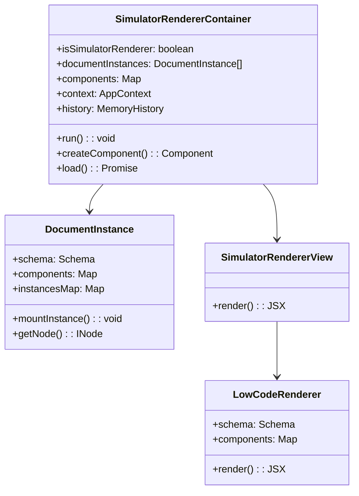
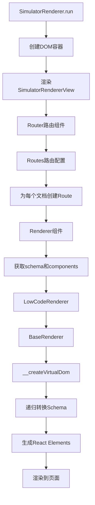
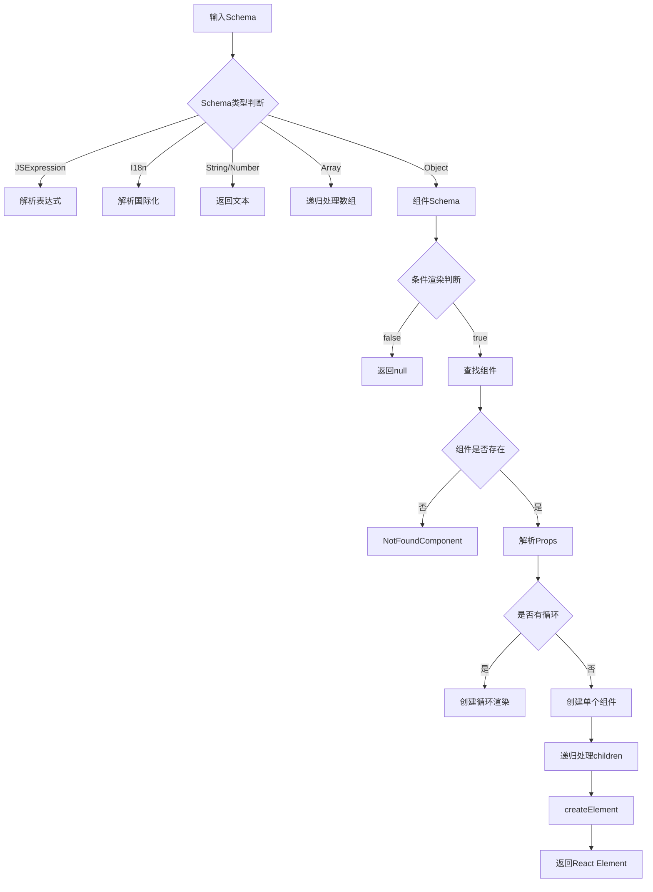

# SimulatorRenderer 渲染器原理详解

## 一、SimulatorRenderer 概述

SimulatorRenderer 是低代码引擎中负责在 iframe 内将 Schema（搭建协议）转换为实际可交互的 React 组件的核心模块。它运行在完全隔离的 iframe 环境中，与设计器主框架通过特定的通信机制进行交互。

## 二、核心架构

### 2.1 架构分层

```
SimulatorRenderer (渲染容器)
    ├── DocumentInstance (文档实例管理)
    ├── SimulatorRendererView (视图层)
    │   ├── Router (路由管理)
    │   ├── Layout (布局容器)
    │   └── Renderer (渲染组件)
    │       └── LowCodeRenderer (核心渲染器)
    │           └── BaseRenderer (基础渲染器)
    │               └── __createVirtualDom (Schema转换引擎)
```

### 2.2 关键类图



## 三、SimulatorRenderer 工作原理

### 3.1 初始化流程

```javascript
// 伪代码展示初始化流程
class SimulatorRenderer {
    constructor() {
        // 1. 初始化状态管理（MobX）
        makeObservable(this);

        // 2. 连接到 host（设计器）
        host.connect(this, () => {
            // 同步配置：layout、componentsMap、designMode等
            this.syncWithHost();
        });

        // 3. 创建内存路由
        this.history = createMemoryHistory();

        // 4. 监听文档变化
        host.autorun(() => {
            // 创建/更新文档实例
            this.updateDocumentInstances();
        });

        // 5. 消费组件资源
        host.componentsConsumer.consume(async (asset) => {
            await this.load(asset);
            this.buildComponents();
        });

        // 6. 初始化应用上下文
        this.initAppContext();
    }

    run() {
        // 1. 创建容器
        const container = document.createElement('div');
        container.id = 'app';

        // 2. 渲染 React 组件树
        ReactDOM.render(
            <SimulatorRendererView rendererContainer={this} />,
            container
        );

        // 3. 通知设计器渲染完成
        host.project.setRendererReady(this);
    }
}
```

### 3.2 渲染执行流程



### 3.3 组件实例管理

```javascript
class DocumentInstance {
    // 组件实例映射表：nodeId -> ReactInstance[]
    instancesMap = new Map();

    mountInstance(nodeId, instance) {
        // 1. 处理空实例（卸载）
        if (!instance) {
            this.unmountInstance(nodeId);
            return;
        }

        // 2. 标记实例
        instance[SYMBOL_VNID] = nodeId;
        instance[SYMBOL_VDID] = docId;

        // 3. Hook 生命周期
        const origUnmount = instance.componentWillUnmount;
        instance.componentWillUnmount = function() {
            // 卸载时自动清理
            unmountInstance(nodeId, instance);
            origUnmount?.call(this);
        };

        // 4. 更新映射表
        let instances = this.instancesMap.get(nodeId);
        if (!instances) {
            instances = [];
        }
        instances.push(instance);
        this.instancesMap.set(nodeId, instances);

        // 5. 同步到 host
        host.setInstance(docId, nodeId, instances);
    }
}
```

## 四、Schema 转换为 React 组件的核心机制

### 4.1 转换原理

Schema 转换为 React 组件的核心在于 `__createVirtualDom` 方法，它递归地将 Schema 树转换为 React 元素树。

### 4.2 转换流程图



### 4.3 核心转换代码（带详细注释）

```javascript
/**
 * 核心Schema转换引擎
 * 将低代码Schema递归转换为React虚拟DOM
 * @param originalSchema - 原始Schema数据
 * @param originalScope - 当前作用域（包含state、props等）
 * @param parentInfo - 父组件信息
 * @param idx - 循环索引（用于key生成）
 */
__createVirtualDom = (
    originalSchema: any,
    originalScope: any,
    parentInfo: INodeInfo,
    idx: string | number = '',
): any => {
    // ========== 1. 空值处理 ==========
    if (originalSchema === null || originalSchema === undefined) {
        return null;
    }

    let scope = originalScope;
    let schema = originalSchema;
    const { engine } = this.context || {};
    const { __components: components = {} } = this.props || {};

    // ========== 2. 特殊类型处理 ==========
    // 2.1 JSExpression：解析JavaScript表达式
    if (isJSExpression(schema)) {
        // 例如：{ type: 'JSExpression', value: 'this.state.title' }
        return this.__parseExpression(schema, scope);
    }

    // 2.2 国际化数据
    if (isI18nData(schema)) {
        // 例如：{ type: 'i18n', key: 'app.title' }
        return parseI18n(schema, scope);
    }

    // 2.3 插槽
    if (isJSSlot(schema)) {
        // 递归处理插槽内容
        return this.__createVirtualDom(schema.value, scope, parentInfo);
    }

    // ========== 3. 基础类型处理 ==========
    // 3.1 字符串直接返回
    if (typeof schema === 'string') {
        return schema;
    }

    // 3.2 数字和布尔值转为字符串
    if (typeof schema === 'number' || typeof schema === 'boolean') {
        return String(schema);
    }

    // 3.3 数组：递归处理每个元素
    if (Array.isArray(schema)) {
        if (schema.length === 1) {
            return this.__createVirtualDom(schema[0], scope, parentInfo);
        }
        return schema.map((item, index) =>
            this.__createVirtualDom(
                item,
                scope,
                parentInfo,
                // 生成唯一key
                item?.__ctx?.lceKey || String(index)
            )
        );
    }

    // ========== 4. 组件Schema处理 ==========
    if (!isSchema(schema)) {
        return null;
    }

    const { componentName } = schema;

    // 4.1 查找组件
    let Component = components[componentName];

    if (!Component) {
        // 组件未找到，使用 NotFoundComponent
        return createElement(
            NotFoundComponent,
            { componentName },
            '组件未找到'
        );
    }

    // 4.2 条件渲染
    if (schema.condition) {
        const conditionValue = this.__parseExpression(
            schema.condition,
            scope
        );
        if (!conditionValue) {
            return null;  // 条件为false，不渲染
        }
    }

    // 4.3 循环渲染
    if (schema.loop) {
        const loopData = this.__parseData(schema.loop, scope);
        if (Array.isArray(loopData)) {
            return this.__createLoopVirtualDom(
                schema,
                loopData,
                scope,
                Component
            );
        }
    }

    // 4.4 解析属性
    const props = this.__parseProps(schema.props, scope);

    // 4.5 处理子元素
    const children = this.__createChildrenVirtualDom(
        schema.children,
        scope
    );

    // 4.6 添加设计态特殊属性
    if (this.__designMode === 'design') {
        props.__id = schema.id;
        props.__schema = schema;
        // 添加ref回调，用于实例管理
        props.ref = (ref) => {
            this.mountInstance(schema.id, ref);
        };
    }

    // 4.7 创建React元素
    return engine.createElement(
        Component,
        props,
        children
    );
};
```

### 4.4 循环渲染实现

```javascript
/**
 * 创建循环渲染的虚拟DOM
 * @param schema - 包含loop的Schema
 * @param loopData - 循环数据数组
 * @param scope - 当前作用域
 * @param Component - 要渲染的组件
 */
__createLoopVirtualDom(schema, loopData, scope, Component) {
    const { loopArgs = ['item', 'index'] } = schema;

    return loopData.map((item, index) => {
        // 1. 创建循环作用域
        const loopScope = {
            ...scope,
            [loopArgs[0]]: item,    // 循环项
            [loopArgs[1]]: index,   // 循环索引
        };

        // 2. 解析循环中的属性
        const props = this.__parseProps(
            schema.props,
            loopScope  // 使用循环作用域
        );

        // 3. 处理key
        props.key = props.key || `${schema.id}_${index}`;

        // 4. 递归处理子元素
        const children = this.__createVirtualDom(
            schema.children,
            loopScope,
            parentInfo
        );

        // 5. 创建元素
        return createElement(Component, props, children);
    });
}
```

### 4.5 属性解析机制

```javascript
/**
 * 解析组件属性
 * 支持静态值、表达式、函数、事件等
 */
__parseProps(propsSchema, scope) {
    const parsedProps = {};

    for (const [key, value] of Object.entries(propsSchema)) {
        // 1. JSExpression：JavaScript表达式
        if (isJSExpression(value)) {
            // { type: 'JSExpression', value: 'this.state.count' }
            parsedProps[key] = this.__parseExpression(value, scope);
        }
        // 2. JSFunction：函数定义
        else if (isJSFunction(value)) {
            // { type: 'JSFunction', value: 'function() { ... }' }
            parsedProps[key] = this.__parseFunction(value, scope);
        }
        // 3. JSSlot：插槽
        else if (isJSSlot(value)) {
            // { type: 'JSSlot', value: [...] }
            parsedProps[key] = () => this.__createVirtualDom(
                value.value,
                scope,
                parentInfo
            );
        }
        // 4. 嵌套对象：递归解析
        else if (isPlainObject(value)) {
            parsedProps[key] = this.__parseProps(value, scope);
        }
        // 5. 静态值：直接使用
        else {
            parsedProps[key] = value;
        }
    }

    return parsedProps;
}
```

## 五、设计态特殊处理

### 5.1 组件包装与增强

在设计态下，所有组件都会被包装以支持选中、悬停、拖拽等交互：

```javascript
customCreateElement: (Component, props, children) => {
    const { __id, __designMode, ...viewProps } = props;

    // 1. 检查是否需要特殊处理
    const componentMeta = host.getComponentMeta(Component.displayName);
    if (componentMeta?.isModal) {
        return null;  // 模态框不在画布中渲染
    }

    // 2. 添加设计态标记
    const _leaf = {
        componentId: __id,
        componentName: Component.displayName,
        // 用于设计器识别和操作
        isEmpty: () => false,
        isMock: true,
    };
    viewProps._leaf = _leaf;

    // 3. 包装事件处理
    if (__designMode === 'design') {
        // 拦截原始事件
        const originalOnClick = viewProps.onClick;
        viewProps.onClick = (e) => {
            e.stopPropagation();
            // 触发选中而非执行原始逻辑
            host.selectNode(__id);
        };
    }

    // 4. 创建包装后的元素
    return createElement(Component, viewProps, children);
}
```

### 5.2 实例跟踪与管理

```javascript
// 组件挂载时的ref回调
ref: (instance) => {
    if (!instance) return;

    // 1. 记录实例映射
    documentInstance.mountInstance(nodeId, instance);

    // 2. 获取DOM节点
    const domNode = ReactDOM.findDOMNode(instance);

    // 3. 添加数据属性
    if (domNode) {
        domNode.setAttribute('data-node-id', nodeId);
        domNode.setAttribute('data-component-name', componentName);
    }

    // 4. 通知设计器
    host.onComponentMount(nodeId, instance, domNode);
}
```

## 六、性能优化策略

### 6.1 组件缓存

```javascript
class SimulatorRenderer {
    // 组件缓存
    private _componentsCache = new Map();

    getComponent(name) {
        // 1. 查找缓存
        if (this._componentsCache.has(name)) {
            return this._componentsCache.get(name);
        }

        // 2. 构建组件
        const component = this.buildComponent(name);

        // 3. 缓存组件
        this._componentsCache.set(name, component);

        return component;
    }
}
```

### 6.2 批量更新

```javascript
// 使用 MobX 的 computed 和 observable 实现批量更新
@computed get schema() {
    // 只有在真正访问时才计算
    return this.document.export(IPublicEnumTransformStage.Render);
}

// 批量更新状态
runInAction(() => {
    this._components = newComponents;
    this._designMode = newMode;
    this._device = newDevice;
});
```

### 6.3 条件渲染优化

```javascript
// 提前判断，避免无效渲染
if (!container.autoRender || isRendererDetached()) {
    return null;  // 不需要渲染
}

// Schema变化检测
if (!this.schemaChangedSymbol) {
    return this.cachedElement;  // 使用缓存
}
```

## 七、常见问题与注意事项

### 7.1 组件未找到

**问题**：控制台报错 "Component XXX not found"

**解决方案**：
1. 确认组件已正确注册到 components Map
2. 检查组件名称拼写是否正确
3. 确认组件资源已加载完成

### 7.2 循环渲染性能问题

**问题**：大量数据循环渲染卡顿

**优化方案**：
1. 使用虚拟滚动
2. 添加 key 优化 React diff
3. 使用 React.memo 缓存组件

### 7.3 事件处理冲突

**问题**：设计态点击事件与运行态冲突

**解决方案**：
```javascript
// 根据设计模式区分处理
if (designMode === 'design') {
    // 设计态：选中组件
    e.stopPropagation();
    selectNode(nodeId);
} else {
    // 预览态：执行原始事件
    originalHandler(e);
}
```

## 八、总结

SimulatorRenderer 是一个功能强大的渲染引擎，通过以下核心机制实现了Schema到React组件的转换：

1. **递归转换引擎**：通过 `__createVirtualDom` 递归处理各种类型的 Schema
2. **表达式解析器**：支持 JSExpression、JSFunction 等动态内容
3. **组件管理系统**：动态加载、缓存和实例化组件
4. **设计态增强**：通过HOC和自定义createElement添加设计时功能
5. **性能优化**：通过缓存、批量更新等策略提升渲染性能

这种设计既保证了渲染的灵活性和扩展性，又通过iframe隔离确保了安全性和稳定性。
