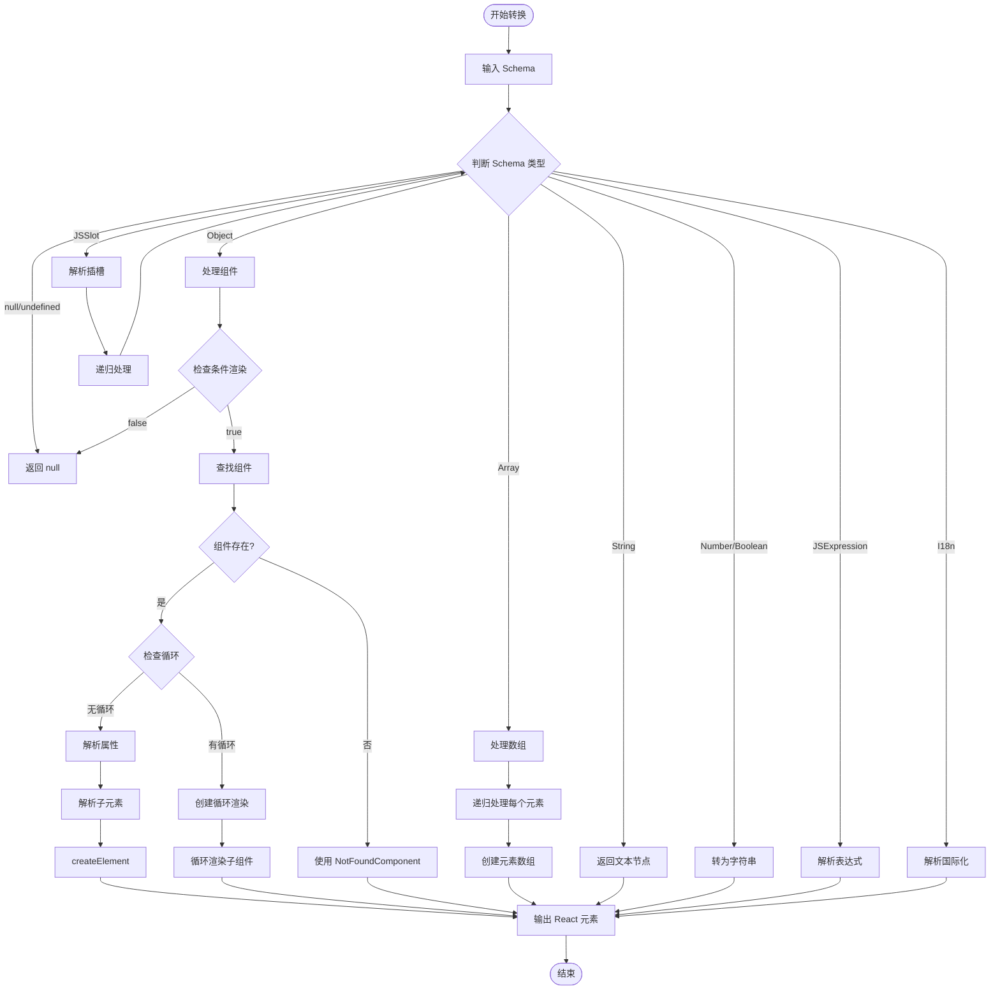
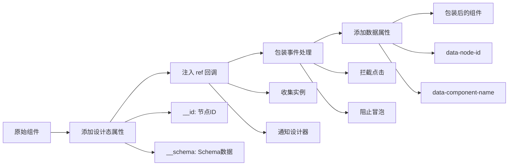

# Schema 转 React 组件实现原理

## 一、转换原理概述

低代码引擎将 Schema（JSON 格式的页面描述）转换为实际的 React 组件树，这个过程是通过递归解析和动态创建组件实现的。核心在于 `__createVirtualDom` 方法，它能够处理各种类型的 Schema 节点。

## 二、Schema 结构示例

### 2.1 基础 Schema 结构
```json
{
  "componentName": "Page",
  "props": {
    "className": "home-page"
  },
  "children": [
    {
      "componentName": "Button",
      "props": {
        "type": "primary",
        "onClick": {
          "type": "JSFunction",
          "value": "function() { console.log('clicked'); }"
        }
      },
      "children": "点击按钮"
    }
  ]
}
```

### 2.2 复杂 Schema 示例
```json
{
  "componentName": "List",
  "props": {
    "dataSource": {
      "type": "JSExpression",
      "value": "this.state.items"
    }
  },
  "loop": {
    "type": "JSExpression",
    "value": "this.state.items"
  },
  "loopArgs": ["item", "index"],
  "children": {
    "componentName": "ListItem",
    "props": {
      "key": {
        "type": "JSExpression",
        "value": "item.id"
      },
      "title": {
        "type": "JSExpression",
        "value": "item.title"
      }
    },
    "condition": {
      "type": "JSExpression",
      "value": "item.visible"
    },
    "children": {
      "type": "JSExpression",
      "value": "item.content"
    }
  }
}
```

## 三、转换流程详解

### 3.1 整体转换流程



### 3.2 核心转换伪代码

```javascript
function schemaToReact(schema, scope) {
    // 1. 空值处理
    if (schema == null) return null;

    // 2. 特殊类型处理
    if (schema.type === 'JSExpression') {
        return evaluateExpression(schema.value, scope);
    }
    if (schema.type === 'i18n') {
        return getI18nText(schema.key, scope.locale);
    }
    if (schema.type === 'JSSlot') {
        return schemaToReact(schema.value, scope);
    }

    // 3. 基础类型处理
    if (typeof schema === 'string') return schema;
    if (typeof schema === 'number') return String(schema);
    if (typeof schema === 'boolean') return String(schema);

    // 4. 数组处理
    if (Array.isArray(schema)) {
        return schema.map(item => schemaToReact(item, scope));
    }

    // 5. 组件处理
    if (schema.componentName) {
        // 5.1 条件渲染
        if (schema.condition) {
            const show = evaluateExpression(schema.condition, scope);
            if (!show) return null;
        }

        // 5.2 查找组件
        const Component = findComponent(schema.componentName);
        if (!Component) {
            return <NotFoundComponent name={schema.componentName} />;
        }

        // 5.3 循环渲染
        if (schema.loop) {
            const loopData = evaluateExpression(schema.loop, scope);
            return loopData.map((item, index) => {
                const loopScope = {
                    ...scope,
                    item,
                    index
                };
                const props = parseProps(schema.props, loopScope);
                const children = schemaToReact(schema.children, loopScope);
                return <Component key={index} {...props}>{children}</Component>;
            });
        }

        // 5.4 普通渲染
        const props = parseProps(schema.props, scope);
        const children = schemaToReact(schema.children, scope);
        return <Component {...props}>{children}</Component>;
    }

    return null;
}
```

## 四、关键技术点

### 4.1 表达式解析

```javascript
/**
 * 解析 JSExpression
 * 支持访问 this、state、props、循环变量等
 */
function parseExpression(expression, scope) {
    // expression.value = "this.state.count + 1"

    // 1. 创建执行上下文
    const context = {
        this: scope.this,
        state: scope.state,
        props: scope.props,
        item: scope.item,    // 循环变量
        index: scope.index,  // 循环索引
    };

    // 2. 创建函数并执行
    const fn = new Function(
        'scope',
        `with(scope) { return ${expression.value} }`
    );

    // 3. 执行并返回结果
    try {
        return fn(context);
    } catch (error) {
        console.error('Expression evaluation failed:', error);
        return undefined;
    }
}
```

### 4.2 属性解析

```javascript
/**
 * 解析组件属性
 * 支持静态值、表达式、函数等
 */
function parseProps(propsSchema, scope) {
    const props = {};

    for (const [key, value] of Object.entries(propsSchema)) {
        // JSExpression
        if (value?.type === 'JSExpression') {
            props[key] = parseExpression(value, scope);
        }
        // JSFunction
        else if (value?.type === 'JSFunction') {
            props[key] = parseFunction(value, scope);
        }
        // JSSlot（插槽）
        else if (value?.type === 'JSSlot') {
            props[key] = (slotProps) => {
                const slotScope = { ...scope, ...slotProps };
                return schemaToReact(value.value, slotScope);
            };
        }
        // 嵌套对象
        else if (isPlainObject(value)) {
            props[key] = parseProps(value, scope);
        }
        // 静态值
        else {
            props[key] = value;
        }
    }

    return props;
}
```

### 4.3 循环渲染实现

```javascript
/**
 * 创建循环渲染
 * 支持自定义循环变量名
 */
function createLoopRender(schema, loopData, scope) {
    const { loopArgs = ['item', 'index'] } = schema;

    return loopData.map((item, index) => {
        // 创建循环作用域
        const loopScope = {
            ...scope,
            [loopArgs[0]]: item,    // 默认 'item'
            [loopArgs[1]]: index,   // 默认 'index'
        };

        // 在循环作用域中解析
        const Component = findComponent(schema.componentName);
        const props = parseProps(schema.props, loopScope);
        const children = schemaToReact(schema.children, loopScope);

        // 确保有唯一的 key
        const key = props.key || `${schema.id}_${index}`;

        return <Component key={key} {...props}>{children}</Component>;
    });
}
```

### 4.4 条件渲染实现

```javascript
/**
 * 处理条件渲染
 * 支持复杂的条件表达式
 */
function handleConditionRender(schema, scope) {
    if (!schema.condition) {
        return true;  // 没有条件，直接渲染
    }

    // 解析条件表达式
    const conditionValue = parseExpression(schema.condition, scope);

    // 转换为布尔值
    return Boolean(conditionValue);
}
```

## 五、设计态特殊处理

### 5.1 组件包装流程



### 5.2 实例管理机制

```javascript
class InstanceManager {
    // nodeId -> [instance1, instance2, ...]
    instancesMap = new Map();

    mountInstance(nodeId, instance) {
        // 1. 标记实例
        instance[SYMBOL_NODE_ID] = nodeId;

        // 2. Hook 生命周期
        const originalUnmount = instance.componentWillUnmount;
        instance.componentWillUnmount = function() {
            // 自动清理
            unmountInstance(nodeId, instance);
            originalUnmount?.call(this);
        };

        // 3. 存储实例
        let instances = this.instancesMap.get(nodeId) || [];
        instances.push(instance);
        this.instancesMap.set(nodeId, instances);

        // 4. 通知设计器
        notifyDesigner(nodeId, instances);
    }

    unmountInstance(nodeId, instance) {
        const instances = this.instancesMap.get(nodeId);
        if (instances) {
            const index = instances.indexOf(instance);
            if (index > -1) {
                instances.splice(index, 1);
            }
        }
    }

    getInstances(nodeId) {
        return this.instancesMap.get(nodeId) || [];
    }
}
```

## 六、性能优化策略

### 6.1 组件缓存

```javascript
const componentCache = new Map();

function getCachedComponent(name) {
    if (componentCache.has(name)) {
        return componentCache.get(name);
    }

    const component = loadComponent(name);
    componentCache.set(name, component);
    return component;
}
```

### 6.2 Schema 缓存

```javascript
const schemaCache = new WeakMap();

function renderWithCache(schema, scope) {
    // 检查缓存
    if (schemaCache.has(schema)) {
        const cached = schemaCache.get(schema);
        if (cached.scope === scope) {
            return cached.element;
        }
    }

    // 渲染并缓存
    const element = schemaToReact(schema, scope);
    schemaCache.set(schema, { scope, element });
    return element;
}
```

### 6.3 批量更新优化

```javascript
import { unstable_batchedUpdates } from 'react-dom';

function batchSchemaUpdate(updates) {
    unstable_batchedUpdates(() => {
        updates.forEach(update => {
            applySchemaUpdate(update);
        });
    });
}
```

## 七、调试技巧

### 7.1 Schema 验证

```javascript
function validateSchema(schema) {
    const errors = [];

    // 检查必需字段
    if (schema.componentName && !findComponent(schema.componentName)) {
        errors.push(`Component ${schema.componentName} not found`);
    }

    // 检查循环配置
    if (schema.loop && !schema.loopArgs) {
        errors.push('Loop requires loopArgs');
    }

    // 递归检查子元素
    if (schema.children) {
        if (Array.isArray(schema.children)) {
            schema.children.forEach(child => {
                errors.push(...validateSchema(child));
            });
        }
    }

    return errors;
}
```

### 7.2 渲染日志

```javascript
function debugRender(schema, scope) {
    console.group(`Rendering: ${schema.componentName || 'Unknown'}`);
    console.log('Schema:', schema);
    console.log('Scope:', scope);

    const startTime = performance.now();
    const element = schemaToReact(schema, scope);
    const endTime = performance.now();

    console.log('Rendered in:', endTime - startTime, 'ms');
    console.log('Result:', element);
    console.groupEnd();

    return element;
}
```

## 八、常见问题

### Q1: 组件未找到
**解决方案**：
1. 确认组件已注册
2. 检查组件名拼写
3. 确认资源加载完成

### Q2: 表达式执行错误
**解决方案**：
1. 检查作用域变量
2. 确认 this 指向
3. 添加错误边界

### Q3: 循环渲染性能问题
**解决方案**：
1. 使用虚拟滚动
2. 添加正确的 key
3. 使用 React.memo

### Q4: 条件渲染不生效
**解决方案**：
1. 检查表达式语法
2. 确认数据源
3. 调试作用域

## 九、总结

Schema 转 React 组件的核心是递归解析和动态创建，通过以下机制实现：

1. **类型判断**：根据不同类型采用不同处理策略
2. **递归处理**：深度优先遍历整个 Schema 树
3. **作用域管理**：维护表达式执行的上下文
4. **动态创建**：使用 createElement 动态创建组件
5. **性能优化**：通过缓存和批量更新提升性能

这种设计既保证了灵活性，又提供了良好的扩展性，是低代码引擎的核心技术之一。
