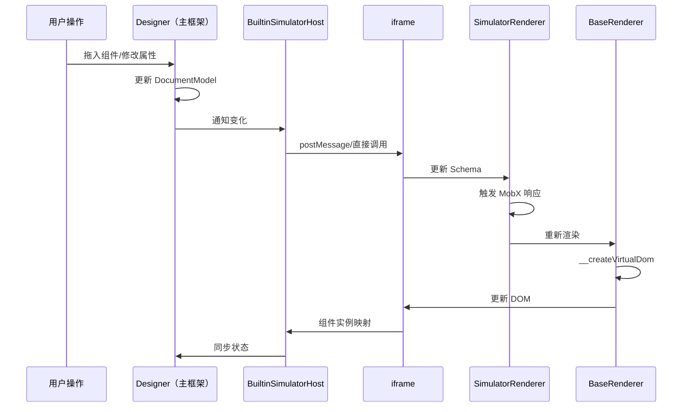

# 完整 iframe 渲染流程（修正版）

## 一、渲染触发起点

渲染的起点并不是 `SimulatorRenderer`，而是从引擎初始化开始的。完整流程如下：

```mermaid
graph TB
    subgraph "1-引擎初始化阶段"
        A["engine.init()<br/>packages/engine/src/engine-core.ts:206"]
        A --> B["创建 Editor 实例<br/>packages/engine/src/engine-core.ts:99"]
        B --> C["创建 Designer 实例<br/>packages/engine/src/engine-core.ts:111"]
        C --> D["创建 Project 实例<br/>packages/designer/src/project/project.ts"]
    end

    subgraph "2-插件注册阶段"
        D --> E["plugins.init()<br/>packages/engine/src/engine-core.ts:259"]
        E --> F["registryInnerPlugin()<br/>注册内置插件"]
        F --> G["defaultPanelRegistry 插件执行<br/>packages/engine/src/inner-plugins/default-panel-registry.tsx"]
        G --> H["skeleton.add() 添加到 mainArea<br/>注册 DesignerPlugin 组件"]
    end

    subgraph "3-UI渲染阶段"
        H --> I["渲染 Workbench<br/>packages/editor-skeleton/src/workbench.tsx"]
        I --> J["渲染 MainArea<br/>skeleton.mainArea"]
        J --> K["渲染 DesignerPlugin<br/>packages/plugin-designer/src/index.tsx:117"]
        K --> L["DesignerPlugin.setupAssets()<br/>获取 assets、library 等"]
        L --> M["DesignerPlugin.render()<br/>plugin-designer/index.tsx:138"]
        M --> N["渲染 DesignerView<br/>designer/designer-view.tsx"]
        N --> O["渲染 ProjectView<br/>designer-view.tsx:63"]
    end

    subgraph "4-模拟器创建阶段"
        O --> P["渲染 BuiltinSimulatorHostView<br/>project-view.tsx:52"]
        P --> Q["创建 BuiltinSimulatorHost<br/>host-view.tsx:29"]
        Q --> R["host.setProps()<br/>传递 library、designMode 等"]
        R --> S["渲染 Canvas 组件<br/>host-view.tsx:43"]
        S --> T["渲染 Content 组件<br/>创建 iframe 元素"]
    end

    subgraph "5-iframe初始化阶段"
        T --> U["调用 mountContentFrame<br/>host.ts:440"]
        U --> V["buildLibrary()<br/>处理 packages 资源"]
        V --> W["createSimulator()<br/>create-simulator.ts:16"]
        W --> X["parseAssetList()<br/>解析资源列表"]
        X --> Y["doc.write() HTML<br/>注入所有 JS/CSS 资源"]
        Y --> Z["等待 window.SimulatorRenderer"]
    end

    subgraph "6-渲染器启动阶段-iframe内"
        Z --> AA["SimulatorRenderer 初始化<br/>renderer.ts:282"]
        AA --> AB["创建 DocumentInstance<br/>renderer.ts:38"]
        AB --> AC["buildComponents()<br/>构建组件映射表"]
        AC --> AD["host.connect()<br/>建立通信连接"]
        AD --> AE["renderer.run()<br/>启动渲染"]
    end

    subgraph "7-组件渲染阶段-iframe内"
        AE --> AF["渲染 SimulatorRendererView<br/>renderer-view.tsx:49"]
        AF --> AG["渲染 Routes<br/>路由管理"]
        AG --> AH["渲染 Layout<br/>布局容器"]
        AH --> AI["渲染 Renderer 组件<br/>renderer-view.tsx:149"]
        AI --> AJ["LowCodeRenderer<br/>renderer-view.tsx:205"]
        AJ --> AK["BaseRenderer.__createDom<br/>renderer-core/base.tsx"]
        AK --> AL["__createVirtualDom<br/>递归转换 Schema"]
        AL --> AM["React.createElement<br/>生成最终 UI"]
    end

    style A fill:#e1f5fe
    style K fill:#fff3e0
    style AA fill:#ffebee
    style AM fill:#e8f5e9
```



## 二、详细类职责与文件路径

### 引擎层
| 类名 | 文件路径 | 主要职责 |
|------|---------|---------|
| Engine | packages/engine/src/engine-core.ts | 引擎入口，初始化所有模块 |
| Editor | packages/editor-core/src/editor.ts | 编辑器核心，管理全局状态 |
| Workbench | packages/editor-skeleton/src/workbench.tsx | 工作台UI框架 |

### 设计器层
| 类名 | 文件路径 | 主要职责 |
|------|---------|---------|
| Designer | packages/designer/src/designer/designer.ts | 设计器核心控制器 |
| DesignerView | packages/designer/src/designer/designer-view.tsx | 设计器主视图 |
| Project | packages/designer/src/project/project.ts | 项目数据管理 |
| ProjectView | packages/designer/src/project/project-view.tsx | 项目视图容器 |

### 模拟器层（主框架侧）
| 类名 | 文件路径 | 主要职责 |
|------|---------|---------|
| BuiltinSimulatorHostView | packages/designer/src/builtin-simulator/host-view.tsx | 模拟器视图组件 |
| BuiltinSimulatorHost | packages/designer/src/builtin-simulator/host.ts | 模拟器核心逻辑 |
| Canvas | packages/designer/src/builtin-simulator/host-view.tsx:49 | 设备外壳层 |
| Content | packages/designer/src/builtin-simulator/host-view.tsx:72 | iframe 容器层 |
| BemTools | packages/designer/src/builtin-simulator/bem-tools/index.tsx | 辅助工具层（参考线等） |
| createSimulator | packages/designer/src/builtin-simulator/create-simulator.ts | iframe 资源注入 |

### 渲染器层（iframe 内）
| 类名 | 文件路径 | 主要职责 |
|------|---------|---------|
| SimulatorRendererContainer | packages/react-simulator-renderer/src/renderer.ts:190 | 渲染器容器 |
| DocumentInstance | packages/react-simulator-renderer/src/renderer.ts:38 | 文档实例管理 |
| SimulatorRendererView | packages/react-simulator-renderer/src/renderer-view.tsx:49 | 渲染器视图 |
| Renderer | packages/react-simulator-renderer/src/renderer-view.tsx:129 | 页面渲染组件 |
| LowCodeRenderer | packages/react-renderer/src/index.ts | React 渲染器适配 |
| BaseRenderer | packages/renderer-core/src/renderer/base.tsx | 基础渲染器 |

## 三、关键方法调用链（修正版）

```
1. 引擎初始化
   └── engine.init()
       ├── new Editor()
       ├── new Designer()
       └── new Project()

2. 插件注册与执行
   └── plugins.init()
       └── registryInnerPlugin()
           └── defaultPanelRegistry
               └── skeleton.add({
                    area: 'mainArea',
                    content: <DesignerPlugin />
                  })

3. React 渲染流程
   └── <Workbench>
       └── <MainArea>
           └── <DesignerPlugin>
               ├── setupAssets()             // 获取 assets、library
               └── render()
                   └── <DesignerView>
                       └── <ProjectView>
                           └── <BuiltinSimulatorHostView>
                               ├── new BuiltinSimulatorHost()
                               ├── host.setProps()  // 传递 library
                               └── <Canvas>
                                   └── <Content>
                                       └── <iframe ref={sim.mountContentFrame}>

4. iframe 初始化
   └── mountContentFrame(iframe)
       ├── buildLibrary()           // 构建组件库资源（处理 packages）
       ├── createSimulator()         // 注入资源
       │   ├── parseAssetList()     // 解析资源列表
       │   ├── doc.write(HTML)      // 写入 HTML
       │   └── wait for load        // 等待加载
       ├── waitFirstConsume()        // 等待资源消费
       ├── renderer.run()            // 启动渲染器
       └── setupEvents()             // 设置事件

5. SimulatorRenderer 运行（iframe 内）
   └── renderer.run()
       └── ReactDOM.render(<SimulatorRendererView>)
           └── <Router>
               └── <Layout>
                   └── <Renderer>
                       └── <LowCodeRenderer>
                           └── BaseRenderer.__createVirtualDom()
                               └── createElement(Component, props, children)
```

## 四、数据流向



## 五、核心触发机制

### 1. 初始触发
- **触发者**：`engine.init()` 被应用调用
- **触发时机**：页面加载完成后
- **触发方式**：直接函数调用

### 2. iframe 创建触发
- **触发者**：React 组件生命周期
- **触发时机**：`Content` 组件 `render` 时
- **触发方式**：JSX 渲染 `<iframe>`

### 3. SimulatorRenderer 创建触发
- **触发者**：`createSimulator` 函数
- **触发时机**：iframe 加载资源后
- **触发方式**：`window.SimulatorRenderer` 被赋值

### 4. 渲染更新触发
- **触发者**：MobX 响应式系统
- **触发时机**：Schema 或配置变化
- **触发方式**：`@observer` 装饰器自动触发

## 六、关键同步点

1. **资源加载同步**：`componentsConsumer.waitFirstConsume()`
2. **渲染器就绪同步**：`project.onRendererReady()`
3. **文档切换同步**：`history.listen()` 和路由切换
4. **实例映射同步**：`host.setInstance()`

## 七、调试入口点

如果要调试整个流程，建议在以下位置设置断点：

1. `engine.init()` - 查看初始化
2. `mountContentFrame()` - 查看 iframe 创建
3. `createSimulator()` - 查看资源注入
4. `SimulatorRenderer.run()` - 查看渲染启动
5. `__createVirtualDom()` - 查看 Schema 转换

## 八、重要修正说明

### 关于 DesignerView 渲染位置的修正

**之前的错误理解**：DesignerView 是由 Workbench 直接渲染的。

**正确的渲染流程**：
1. `engine.init()` 调用 `plugins.init()`
2. `defaultPanelRegistry` 插件在 `skeleton.mainArea` 注册 `DesignerPlugin`
3. `Workbench` 渲染 `MainArea`
4. `MainArea` 渲染其中的 `DesignerPlugin`
5. `DesignerPlugin` 渲染 `DesignerView`

### 关键代码位置

```typescript
// packages/engine/src/inner-plugins/default-panel-registry.tsx:13-18
skeleton.add({
    area: 'mainArea',
    name: 'designer',
    type: 'Widget',
    content: <DesignerPlugin engineConfig={config} engineEditor={editor} />,
});
```

```typescript
// packages/plugin-designer/src/index.tsx:138-159
render(): React.ReactNode {
    // ...
    return (
        <DesignerView
            onMount={this.handleDesignerMount}
            className="lowcode-plugin-designer"
            editor={editor}
            // ... 其他 props
        />
    );
}
```

### packages 资源加载的独立路径

**components 加载路径**：
`editor.setAssets()` → 处理 meta.js → 注册组件元数据

**packages 加载路径**：
`DesignerPlugin.setupAssets()` → 提取 packages → 作为 library prop → `buildLibrary()` → iframe HTML

这种分层设计确保了：
- 元数据（meta.js）在主框架加载，用于物料面板显示
- 实现代码（view.js）在 iframe 加载，用于实际渲染

## 九、总结

修正后的流程图严格遵循了实际代码执行路径，每个步骤都可以在源码中找到对应位置。特别要注意的是插件驱动的架构设计，这是低代码引擎灵活性的关键所在。
