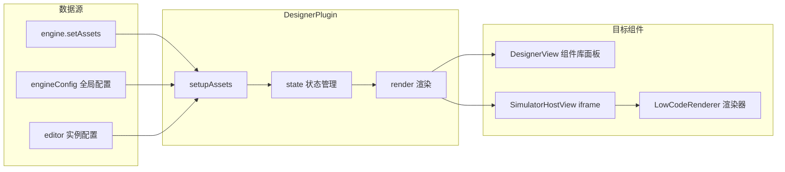
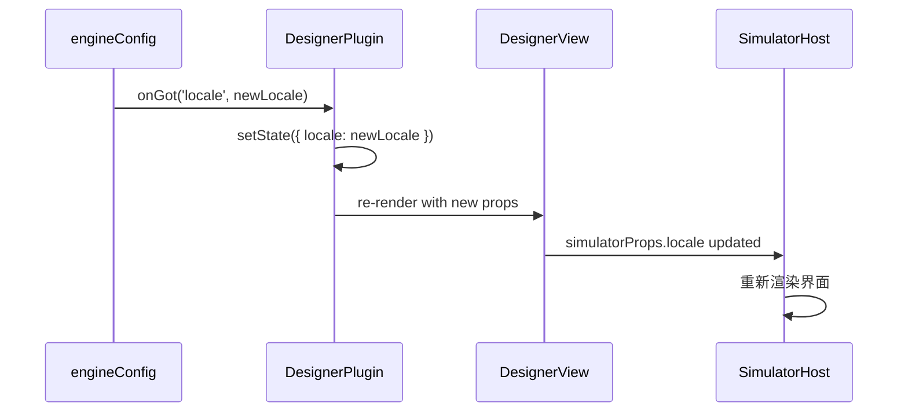

# DesignerPlugin 详解

## 一、主要职责

`DesignerPlugin` 是低代码引擎中的**核心桥梁组件**，它的主要职责包括：

### 🔗 **1. 连接器角色**
- **连接引擎与设计器**：作为 `engine-core` 和 `DesignerView` 之间的桥梁
- **连接配置与视图**：将全局配置转换为设计器可用的属性
- **连接数据与界面**：管理资产数据并传递给视图组件

### 📦 **2. 资源管理器**
- **异步资产加载**：等待并处理 `assets` 的加载完成
- **配置统一管理**：整合来自多个源的配置（全局配置、编辑器实例配置）
- **状态同步管理**：实现配置变化的响应式更新

### 🎛️ **3. 生命周期协调器**
- **设计器实例管理**：处理设计器的创建、挂载、注册
- **事件协调**：在设计器就绪时发出通知事件
- **项目自动加载**：监听 schema 数据并自动打开项目

---

## 二、核心功能模块

### 🚀 **1. setupAssets（资产初始化）**

#### **功能流程**：
```mermaid
graph TB
    A[构造函数调用] --> B[setupAssets 启动]
    B --> C[等待 editor.onceGot('assets')]
    C --> D[获取全局配置]
    D --> E[设置配置监听器]
    E --> F[解构资产对象]
    F --> G[更新组件状态]
    G --> H[触发重新渲染]
```

#### **核心数据处理**：
```typescript
// 资产对象解构
const { components, packages, extraEnvironment, utils } = assets;

// 关键重命名：packages -> library
{
    componentMetadatas: components || [],    // 左侧组件库的元数据
    library: packages || [],                 // iframe 内的组件实现代码
    utilsMetadata: utils || [],             // 可调用的工具函数
}
```

#### **配置优先级策略**：
```typescript
// 全局配置 > 编辑器实例配置
const renderEnv = engineConfig.get('renderEnv') || editor.get('renderEnv');
const device = engineConfig.get('device') || editor.get('device');
```

### 📡 **2. 响应式配置监听**

#### **实时监听机制**：
```typescript
// 语言环境变化监听
engineConfig.onGot('locale', (locale) => {
    this.setState({ locale });
});

// 设备类型变化监听
engineConfig.onGot('device', (device) => {
    this.setState({ device });
});

// 请求处理器变化监听
engineConfig.onGot('requestHandlersMap', (requestHandlersMap) => {
    this.setState({ requestHandlersMap });
});
```

### 🔧 **3. handleDesignerMount（设计器挂载处理）**

#### **核心作用**：
```typescript
// 1. 全局注册设计器实例
editor.set('designer', designer);

// 2. 发出就绪事件通知
editor.eventBus.emit('designer.ready', designer);

// 3. 自动项目加载
editor.onGot('schema', (schema) => {
    designer.project.open(schema);
});
```

### 🎨 **4. render（渲染逻辑）**

#### **渲染决策**：
```typescript
// 必要资源检查
if (!library || !componentMetadatas) {
    return null; // 阻止不完整渲染
}
```

#### **属性传递策略**：
```typescript
<DesignerView
    // 核心实例和配置
    editor={editor}
    designer={editor.get('designer')}
    componentMetadatas={componentMetadatas}

    // 模拟器配置（传递给 iframe）
    simulatorProps={{
        library,           // 🔥 组件实现代码
        utilsMetadata,     // 工具函数
        renderEnv,         // 渲染环境
        device,            // 设备类型
        locale,            // 语言环境
        designMode,        // 设计模式
        simulatorUrl,      // 模拟器地址
        // ... 其他配置
    }}
/>
```

---

## 三、数据流分析

### 📊 **数据来源与流向**



### 🔄 **配置更新流程**



---

## 四、关键设计模式

### 🎯 **1. 桥接模式（Bridge Pattern）**
- **抽象层**：DesignerPlugin
- **实现层**：DesignerView + SimulatorHostView
- **解耦效果**：引擎配置与具体设计器实现分离

### 🔄 **2. 观察者模式（Observer Pattern）**
- **主题**：engineConfig（全局配置中心）
- **观察者**：DesignerPlugin（监听配置变化）
- **通知机制**：`engineConfig.onGot(key, callback)`

### 🏭 **3. 适配器模式（Adapter Pattern）**
- **源接口**：engine 的配置格式
- **目标接口**：DesignerView 期望的属性格式
- **适配器**：DesignerPlugin 的数据转换逻辑

### 🔧 **4. 依赖注入模式（Dependency Injection）**
- **容器**：editor 实例（通过 `editor.set/get` 管理依赖）
- **注入点**：`handleDesignerMount` 中注册设计器实例
- **好处**：组件间松耦合，便于测试和扩展

---

## 五、核心状态数据

### 📋 **状态字段详解**

| 字段 | 类型 | 用途 | 数据来源 | 目标组件 |
|------|------|------|----------|----------|
| **componentMetadatas** | `any[]` | 组件库面板数据 | `assets.components` | DesignerView |
| **library** | `any[]` | 组件实现代码 | `assets.packages` | SimulatorHost |
| **utilsMetadata** | `any[]` | 工具函数元数据 | `assets.utils` | LowCodeRenderer |
| **extraEnvironment** | `any[]` | 运行时环境 | `assets.extraEnvironment` | SimulatorHost |
| **renderEnv** | `string` | 渲染器类型 | `engineConfig/editor` | LowCodeRenderer |
| **device** | `string` | 设备类型 | `engineConfig/editor` | 预览界面 |
| **locale** | `string` | 语言环境 | `engineConfig/editor` | 国际化组件 |
| **designMode** | `string` | 设计模式 | `engineConfig/editor` | 交互控制 |
| **deviceClassName** | `string` | 响应式样式 | `engineConfig/editor` | CSS 样式 |
| **simulatorUrl** | `Asset` | 模拟器地址 | `engineConfig/editor` | iframe src |
| **requestHandlersMap** | `any` | 请求处理器 | `engineConfig/editor` | 数据获取 |

---

## 六、使用场景与价值

### 🎯 **核心价值**

1. **配置统一管理**：
   - 避免配置散落在各个组件中
   - 提供统一的配置更新机制
   - 支持配置的动态变更

2. **资源加载协调**：
   - 确保资源完整加载后再渲染
   - 避免因资源未就绪导致的错误
   - 提供加载状态管理

3. **组件解耦**：
   - engine-core 不直接依赖 DesignerView
   - DesignerView 不需要了解引擎的具体配置方式
   - 便于独立测试和维护

4. **扩展性支持**：
   - 新增配置项时只需修改 DesignerPlugin
   - 支持不同类型的设计器视图
   - 易于添加新的资源类型

### 🚀 **典型使用流程**

```typescript
// 1. 引擎初始化时注册插件
skeleton.add({
    area: 'mainArea',
    name: 'designer',
    type: 'Widget',
    content: <DesignerPlugin engineConfig={config} engineEditor={editor} />,
});

// 2. 设置资产数据
engine.setAssets({
    components: [...],  // 组件元数据
    packages: [...],    // 组件实现
    utils: [...],       // 工具函数
});

// 3. 配置运行环境
engineConfig.set('device', 'mobile');
engineConfig.set('locale', 'zh-CN');

// 4. 自动触发更新
// DesignerPlugin 监听到配置变化，自动更新设计器
```

---

## 七、最佳实践建议

### ✅ **设计优点**
- **单一职责**：专注于配置管理和资源协调
- **松耦合**：通过事件和依赖注入减少直接依赖
- **响应式**：配置变化能自动同步到界面
- **防御性**：有完善的异常处理和状态检查

### ⚠️ **注意事项**
- **异步处理**：需要正确处理资源加载的异步性
- **状态一致性**：确保配置变化时状态的完整更新
- **内存管理**：组件卸载时正确清理监听器
- **错误处理**：资源加载失败时的降级策略

### 🔧 **改进建议**
- **类型完善**：补充 `requestHandlersMap` 等字段的类型定义
- **加载状态**：增加 Loading 组件提升用户体验
- **配置验证**：增加配置项的有效性检查
- **性能优化**：考虑大量组件时的渲染性能

---

## 八、总结

`DesignerPlugin` 是低代码引擎架构中的**关键枢纽组件**，它通过精心设计的桥接模式和观察者模式，实现了：

- 🔗 **架构解耦**：引擎核心与设计器视图的分离
- 📦 **资源管理**：统一的资产加载和配置管理
- 🔄 **响应式更新**：配置变化的自动同步
- 🎛️ **生命周期协调**：设计器实例的完整管理

这种设计不仅提高了系统的可维护性和扩展性，也为用户提供了稳定、流畅的编辑体验。
