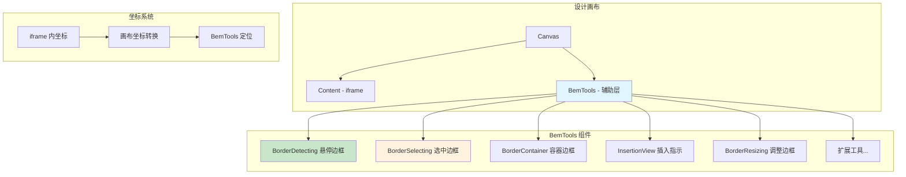

# BemTools 设计辅助工具详解

## 一、概述

`BemTools` 是低代码引擎中的**可视化设计辅助工具集合**，位于 `packages/designer/src/builtin-simulator/bem-tools/index.tsx`。它在设计画布上提供各种视觉辅助元素，帮助用户更直观地进行可视化设计。

## 二、核心功能

### 2.1 主要组件

| 组件名称                  | 功能描述       | 显示时机               |
| ------------------------- | -------------- | ---------------------- |
| **BorderDetecting** | 鼠标悬停边框   | 鼠标悬停在组件上时     |
| **BorderSelecting** | 选中状态边框   | 组件被选中时           |
| **BorderContainer** | 容器响应边框   | 启用容器响应时         |
| **InsertionView**   | 插入位置指示器 | 拖拽组件时显示插入位置 |
| **BorderResizing**  | 调整尺寸边框   | 选中组件且可调整尺寸时 |
| **扩展 BEM 工具**   | 自定义辅助工具 | 根据插件注册情况       |

### 2.2 工作原理



## 三、技术实现

### 3.1 坐标转换系统

BemTools 需要将 iframe 内的组件位置转换为画布上的辅助工具位置：

```typescript
// 关键转换逻辑
const style = {
  transform: `translate(${-scrollX * scale}px, ${-scrollY * scale}px)`
};

// 组件定位
const componentStyle = {
  width: rect.width * scale,
  height: rect.height * scale,
  transform: `translate(${(scrollX + rect.left) * scale}px, ${(scrollY + rect.top) * scale}px)`
};
```

### 3.2 响应式更新机制

- 使用 MobX `@observer` 实现自动响应状态变化
- 监听设计器的选中状态、悬停状态变化
- 实时同步 iframe 内组件的位置和尺寸变化

### 3.3 渲染优化策略

- **条件渲染**：只在设计模式下显示，预览模式不渲染
- **配置控制**：通过 `engineConfig` 控制具体工具的显示/隐藏
- **性能优化**：使用 `PureComponent` 减少不必要的重渲染

## 四、各组件详解

### 4.1 BorderDetecting - 悬停边框

**功能**：鼠标悬停时显示蓝色边框和组件信息

- 显示组件名称和基本信息
- 提供组件操作按钮
- 支持锁定状态显示

### 4.2 BorderSelecting - 选中边框

**功能**：选中时显示橙色边框和操作工具

- 多选状态支持
- 组件操作菜单
- 上下文相关的快捷操作

### 4.3 BorderContainer - 容器边框

**功能**：响应式容器的可视化边界

- 显示容器的响应断点
- 网格系统可视化
- 布局参考线

### 4.4 InsertionView - 插入指示器

**功能**：拖拽时显示组件可插入的位置

- 绿色/红色指示器表示可插入/不可插入
- 实时跟随鼠标位置
- 智能判断插入规则

### 4.5 BorderResizing - 调整边框

**功能**：可调整尺寸的组件显示调整手柄

- 八个方向的调整点
- 比例约束调整
- 最大最小尺寸限制

## 五、扩展机制

### 5.1 BEM 工具管理器

```typescript
host.designer.bemToolsManager.getAllBemTools().map(tools => {
  const ToolsCls = tools.item;
  return <ToolsCls key={tools.name} host={host} />;
})
```

### 5.2 自定义工具接口

```typescript
interface IBemTool {
  name: string;
  item: ComponentType<{ host: BuiltinSimulatorHost }>;
}
```

## 六、配置选项

### 6.1 引擎配置控制

| 配置项                      | 描述           | 默认值 |
| --------------------------- | -------------- | ------ |
| `disableDetecting`        | 禁用悬停检测   | false  |
| `enableReactiveContainer` | 启用响应式容器 | false  |

### 6.2 设计模式控制

- **design 模式**：显示所有辅助工具
- **live 模式**：不显示任何辅助工具
- **preview 模式**：只显示必要的辅助工具

## 七、性能考虑

### 7.1 渲染优化

1. **条件渲染**：根据模式和配置决定是否渲染
2. **组件缓存**：使用 React key 优化组件复用
3. **计算缓存**：使用 MobX computed 缓存计算结果

### 7.2 事件优化

1. **事件代理**：避免为每个工具绑定独立事件
2. **防抖处理**：高频更新事件进行防抖
3. **内存管理**：及时清理事件监听器

## 八、调试技巧

### 8.1 样式调试

```css
/* 查看辅助工具层 */
.lc-bem-tools {
  border: 1px dashed red; /* 临时边框 */
}

/* 检查定位问题 */
.lc-borders {
  background: rgba(255, 0, 0, 0.1); /* 半透明背景 */
}
```

### 8.2 控制台调试

```javascript
// 查看工具管理器状态
console.log(window.AliLowCodeEngine.project.designer.bemToolsManager);

// 查看视口信息
console.log(window.AliLowCodeEngine.project.simulator.viewport);
```

## 九、常见问题

### 9.1 定位偏差

**问题**：辅助工具位置与组件位置不匹配
**原因**：缩放计算或滚动偏移计算错误
**解决**：检查 `scale`、`scrollX`、`scrollY` 的计算逻辑

### 9.2 性能问题

**问题**：辅助工具渲染导致卡顿
**原因**：频繁的重渲染或复杂的样式计算
**解决**：使用 `shouldComponentUpdate` 或 `React.memo` 优化

### 9.3 事件冲突

**问题**：辅助工具遮挡组件交互
**原因**：z-index 层级问题或事件冒泡
**解决**：合理设置 `pointer-events` 和事件处理

## 十、最佳实践

### 10.1 开发建议

1. **保持轻量**：辅助工具应该尽可能轻量，不影响主要功能
2. **响应迅速**：用户交互应该有即时的视觉反馈
3. **样式一致**：遵循设计系统的视觉规范

### 10.2 扩展指南

1. **继承基类**：自定义工具继承现有基础类
2. **遵循接口**：实现标准的工具接口
3. **配置驱动**：通过配置控制工具的行为

## 十一、总结

BemTools 是低代码引擎用户体验的重要组成部分，它通过丰富的视觉辅助元素，让用户能够更直观、高效地进行可视化设计。其核心价值在于：

1. **增强可用性**：让用户清楚地看到选择、悬停、可操作区域
2. **提升效率**：减少用户的认知负担，提供直接的视觉反馈
3. **支持扩展**：灵活的架构支持业务定制化需求

理解 BemTools 的工作原理，对于深度定制低代码引擎的交互体验具有重要意义。
