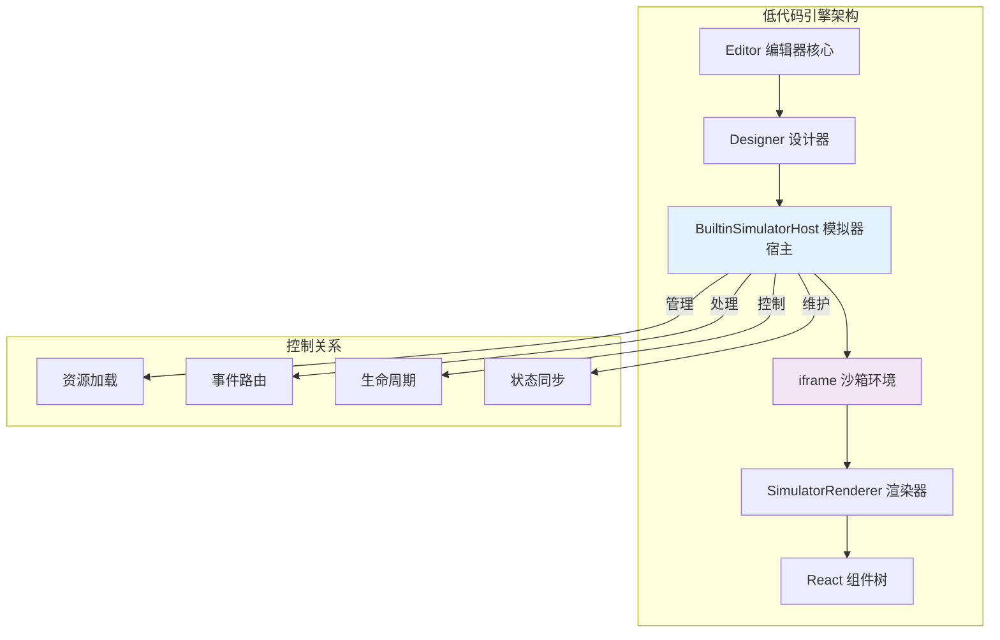
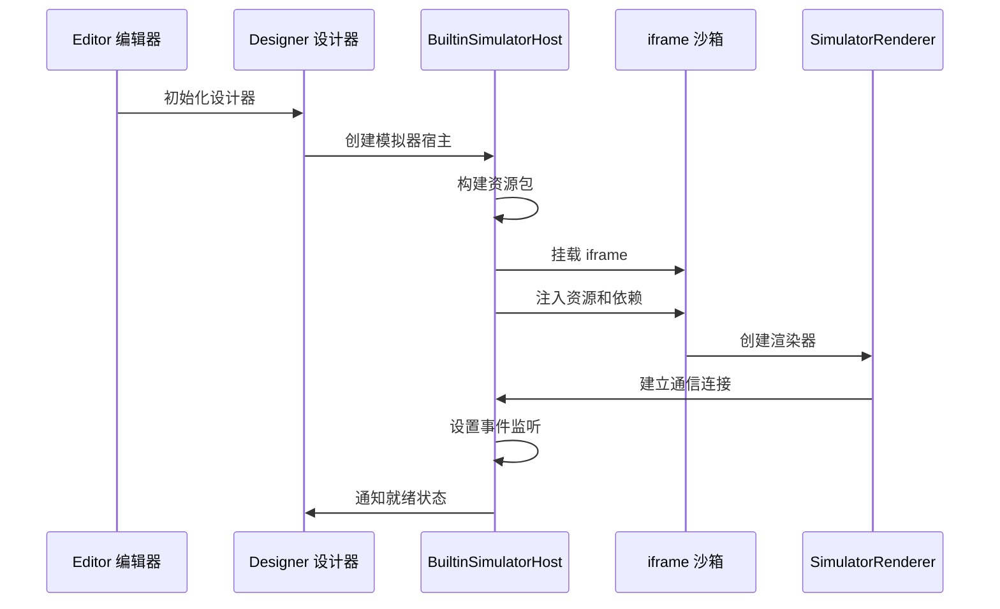

# BuiltinSimulatorHost 核心控制器深度解析

## 一、概述与架构位置

### 1.1 核心定位

`BuiltinSimulatorHost` 是低代码引擎中**模拟器系统的大脑**，位于 `packages/designer/src/builtin-simulator/host.ts`。它在整个架构中扮演着**iframe 外部控制器**的关键角色：



### 1.2 核心职责

| 职责类别 | 具体功能 | 实现方式 |
|---------|---------|----------|
| **🎯 生命周期管理** | iframe 创建、挂载、销毁 | `mountContentFrame()` |
| **📦 资源管理** | 组件库、主题、环境变量加载 | `buildLibrary()`, ResourceConsumer |
| **🎮 事件处理** | 拖拽、点击、悬停、右键 | `setupEvents()` 系列方法 |
| **📱 设备模拟** | 移动端、桌面端适配 | 设备样式和视口管理 |
| **🔄 状态同步** | 宿主与渲染器状态同步 | MobX 响应式系统 |
| **📐 坐标转换** | 画布坐标与 iframe 坐标转换 | `fixEvent()`, `computeRect()` |

### 1.3 在低代码引擎中的地位

**🎯 承上启下的枢纽角色**：
- **向上**：接收来自 `Designer` 和 `Editor` 的指令和配置
- **向下**：控制 iframe 内 `SimulatorRenderer` 的行为
- **横向**：协调 `Project`、`Viewport`、`Dragon` 等模块

**🔗 跨环境通信桥梁**：
- 解决父窗口与 iframe 子窗口的通信问题
- 实现设计时状态与运行时状态的同步
- 处理不同坐标系之间的转换

## 二、核心架构设计

### 2.1 响应式架构

```typescript
// 🔄 MobX 响应式系统核心
class BuiltinSimulatorHost {
  @computed get designMode() { ... }     // 计算属性：自动响应配置变化
  @obx.ref _props = {};                  // 可观察属性：配置变化自动更新

  // 🎯 响应式流程
  setProps(newProps) → 触发 @computed 重计算 → 自动更新 UI
}
```

### 2.2 资源消费者模式

```typescript
// 📦 资源消费者：实现资源的响应式加载
this.componentsConsumer = new ResourceConsumer(() => this.componentsAsset);
this.injectionConsumer = new ResourceConsumer(() => ({ appHelper: this._appHelper }));
this.i18nConsumer = new ResourceConsumer(() => this.project.i18n);

// 🔄 工作原理：
// 资源变化 → 消费者感知 → 自动重新消费 → 更新 iframe 环境
```

### 2.3 事件驱动架构

```typescript
// 📡 事件总线：模块间解耦通信
readonly emitter: IEventBus = createModuleEventBus('BuiltinSimulatorHost');

// 🎮 事件处理流程
外部事件 → setupEvents() → iframe 事件监听 → 业务逻辑处理 → 状态更新
```

## 三、与其他模块的深度联系

### 3.1 上游依赖关系

#### **📋 Project（项目管理器）**
```typescript
readonly project: IProject;

// 🔗 关联能力：
- currentDocument: 当前编辑文档
- i18n: 国际化配置
- getDocument(): 获取指定文档
- 文档状态变化监听
```

#### **🎨 Designer（设计器）**
```typescript
readonly designer: IDesigner;

// 🔗 关联能力：
- componentsMap: 组件映射表
- dragon: 拖拽系统
- editor: 编辑器实例
- createScroller(): 滚动器创建
- refreshComponentMetasMap(): 元数据刷新
```

#### **⚙️ EngineConfig（引擎配置）**
```typescript
// 🔧 配置驱动：
- disableAutoRender: 自动渲染控制
- appHelper: 应用辅助工具
- thisRequiredInJSE: JSX 表达式配置
- 设备映射器、错误组件等配置
```

### 3.2 下游影响关系

#### **🖼️ BuiltinSimulatorHostView（视图组件）**
```typescript
// 🎯 控制关系：
Host 创建 → HostView 渲染 → Canvas 容器 → iframe 展示
```

#### **🎭 SimulatorRenderer（iframe 内渲染器）**
```typescript
// 🔗 通信机制：
Host.connect(renderer) → 建立响应式连接 → 状态自动同步
```

#### **🎨 BemTools（辅助工具）**
```typescript
// 🛠️ 坐标支持：
BemTools 使用 host.viewport 进行坐标转换和定位
```

### 3.3 协作流程图



## 四、核心技术实现

### 4.1 iframe 隔离机制

**🔒 沙箱隔离的必要性**：
- **安全性**：组件代码在独立环境执行，避免污染主应用
- **兼容性**：不同版本的 React、样式库可以并存
- **稳定性**：组件错误不会导致编辑器崩溃
- **性能**：独立的渲染上下文，减少主应用负担

**🌉 跨框架通信**：
```typescript
// 🔗 建立通信桥梁
this._contentWindow = iframe.contentWindow;    // 获取 iframe window
this._contentDocument = this._contentWindow.document; // 获取 iframe document

// 📡 事件路由机制
doc.addEventListener('mousedown', handler);    // 监听 iframe 内事件
parent.postMessage(data, '*');               // 向父窗口传递消息
```

### 4.2 响应式状态管理

**🔄 MobX 响应式系统**：
```typescript
// 计算属性：自动依赖追踪
@computed get designMode() { return this.get('designMode') || 'design'; }

// 可观察状态：变化自动通知
@obx.ref _props: BuiltinSimulatorProps = {};

// 自动运行：状态变化自动执行
autorun(() => { this.renderer?.updateProps(this._props); });
```

### 4.3 资源加载策略

**📦 分级加载机制**：
```typescript
// 🏗️ 资源加载顺序（按 AssetLevel 优先级）：
1. Environment（环境）: React、ReactDOM 基础依赖
2. Library（库）: 组件库 JS/CSS 文件
3. Theme（主题）: 样式主题文件
4. Runtime（运行时）: SimulatorRenderer 核心逻辑
```

**⏰ 异步加载优化**：
```typescript
// 🚀 性能优化策略：
同步库 → 立即加载，阻塞渲染启动
异步库 → 基础环境就绪后加载，不阻塞首屏
```

## 五、关键算法和逻辑

### 5.1 坐标转换算法

**📐 多坐标系转换**：
```typescript
// 🎯 核心转换逻辑：
全局坐标（clientX/Y）→ 画布坐标（canvasX/Y）→ iframe 坐标

fixEvent(e) {
  const point = this.viewport.toLocalPoint({
    clientX: e.globalX,
    clientY: e.globalY
  });
  e.canvasX = point.clientX;  // 转换为画布坐标
  e.canvasY = point.clientY;
}
```

### 5.2 拖拽目标定位算法

**🎯 智能目标选择**：
```typescript
// 🔍 拖拽目标定位流程：
locate(e) {
  1. 获取鼠标位置下的 DOM 元素
  2. 查找对应的节点实例
  3. 向上遍历找到合适的容器
  4. 检查容器的接受规则
  5. 计算精确的插入位置
  6. 返回位置信息对象
}
```

### 5.3 组件实例缓存机制

**🗂️ 多文档实例管理**：
```typescript
// 📊 实例缓存结构：
instancesMap: {
  [docId: string]: Map<string, ComponentInstance[]>
}

// 🎯 缓存策略：
- 按文档 ID 分组管理
- 按节点 ID 索引实例
- 支持一个节点多个实例
- 自动清理无效实例
```

## 六、性能优化设计

### 6.1 防抖和节流

**⚡ 渲染性能优化**：
```typescript
// 🎯 事务管理：批量操作时避免频繁渲染
const rerender = debounce(this.rerender.bind(this), 28); // 28ms 防抖
transactionManager.onEndTransaction(() => {
  rerender();                    // 批量操作结束后统一渲染
});
```

### 6.2 资源缓存策略

**📦 智能缓存机制**：
- **libraryMap**：包名到库名映射缓存
- **asyncLibraryMap**：异步库配置缓存
- **instancesMap**：组件实例缓存

### 6.3 事件优化

**🎮 事件处理优化**：
- 使用事件委托减少监听器数量
- 防抖处理高频事件（如 mousemove）
- 智能事件停止传播控制

## 七、设计模式应用

### 7.1 观察者模式

**📡 事件驱动架构**：
```typescript
// 🔄 观察者模式实现：
emitter.emit('event-name', data);    // 发布事件
emitter.on('event-name', handler);   // 订阅事件
```

### 7.2 策略模式

**🎯 多策略支持**：
- 设备适配策略（移动端/桌面端）
- 渲染环境策略（React/Vue）
- 资源加载策略（同步/异步）

### 7.3 依赖注入模式

**💉 IoC 容器设计**：
```typescript
// 🏗️ 依赖注入：
constructor(project: Project, designer: Designer) {
  this.project = project;     // 注入项目管理器
  this.designer = designer;   // 注入设计器
}
```

## 八、扩展和定制能力

### 8.1 配置驱动

**⚙️ 灵活配置系统**：
```typescript
// 🔧 支持的配置类项目：
- designMode: 设计模式控制
- device: 设备类型模拟
- theme: 主题样式定制
- environment: 环境变量注入
- library: 组件库配置
- deviceStyle: 设备样式定制
```

### 8.2 插件扩展

**🔌 扩展点支持**：
- **deviceMapper**: 设备类型映射器
- **appHelper**: 应用辅助工具注入
- **requestHandlersMap**: 请求处理器映射
- **组件元数据解析器**: 自定义元数据处理

## 九、关键技术细节

### 9.1 跨 iframe 响应式同步

**🔗 核心同步机制**：
```typescript
connect(renderer, effect, options) {
  this._renderer = renderer;
  return autorun(effect, options); // 🔄 建立自动运行连接
}

// 🎯 工作原理：
// 宿主状态变化 → MobX 感知 → autorun 触发 → 渲染器更新
```

### 9.2 设备模拟实现

**📱 设备适配策略**：
```typescript
@computed get device(): string {
  return (
    this.designer?.editor?.get('deviceMapper')?.transform?.(this._props.device) ||
    this._props.device
  );
}

// 🎯 支持的设备类型：
// 'mobile', 'tablet', 'desktop', 'iphone', 'android' 等
```

### 9.3 组件库集成机制

**📚 UMD 模块加载**：
```typescript
// 🔧 支持的导出模式：
1. default: 直接全局变量导出
2. functionCall: 函数调用模式导出
3. exportName: 别名导出（解决命名冲突）

// 📦 资源类型支持：
- JavaScript 文件（.js）
- CSS 样式文件（.css）
- 内联代码片段（JSText/CSSText）
```

## 十、故障排查和调试

### 10.1 常见问题诊断

| 问题类型 | 症状表现 | 排查方向 | 解决方案 |
|---------|----------|----------|----------|
| **iframe 无法加载** | 白屏，控制台报错 | simulatorUrl 配置 | 检查资源路径和网络连接 |
| **组件库加载失败** | 组件不显示 | library 配置 | 验证 UMD 格式和依赖关系 |
| **拖拽功能异常** | 无法拖放 | setupEvents 逻辑 | 检查事件绑定和权限 |
| **坐标定位错误** | 辅助工具位置偏移 | 坐标转换逻辑 | 检查缩放和滚动计算 |

### 10.2 调试技巧

**🔍 调试工具和方法**：
```javascript
// 🛠️ 控制台调试命令：
window.AliLowCodeEngine.project.simulator         // 查看模拟器实例
window.AliLowCodeEngine.project.designer.dragon   // 查看拖拽系统状态
host.viewport.bounds                              // 查看视口边界
host.instancesMap                                // 查看组件实例缓存

// 📊 性能监控：
console.time('mountContentFrame');  // 测量 iframe 挂载耗时
console.timeEnd('mountContentFrame');
```

## 十一、最佳实践

### 11.1 配置优化

**⚙️ 推荐配置**：
```typescript
// 🚀 性能优化配置
{
  disableAutoRender: false,     // 保持自动渲染，除非有特殊性能要求
  enableReactiveContainer: true, // 启用响应式容器，增强设计体验
  library: [                   // 合理规划组件库加载
    { async: false, ...essential }, // 核心库同步加载
    { async: true, ...optional }    // 可选库异步加载
  ]
}
```

### 11.2 扩展开发

**🔧 自定义扩展指南**：
```typescript
// 🎯 自定义设备映射器
editor.set('deviceMapper', {
  transform: (device) => {
    const mappings = { 'mobile': 'iphone-x', 'tablet': 'ipad-pro' };
    return mappings[device] || device;
  }
});

// 🛠️ 自定义应用辅助工具
engineConfig.set('appHelper', {
  utils: customUtils,
  services: customServices
});
```

## 十二、未来发展方向

### 12.1 待优化领域

**🚀 性能提升**：
- iframe 热重载机制优化
- 资源缓存策略改进
- 事件处理性能优化

**🔧 功能增强**：
- 多设备同步预览
- 实时协作编辑支持
- 更丰富的调试工具

### 12.2 架构演进

**🏗️ 架构优化方向**：
- 微前端架构支持
- Web Worker 渲染优化
- Service Worker 资源管理

## 十三、总结

`BuiltinSimulatorHost` 是低代码引擎中设计精妙的核心组件，它体现了：

1. **🎯 单一职责原则**：专注于模拟器控制，职责清晰
2. **🔄 响应式设计**：基于 MobX 的自动化状态管理
3. **🔌 开放封闭原则**：核心稳定，支持配置和插件扩展
4. **🎮 事件驱动架构**：解耦的模块间通信
5. **⚡ 性能优先**：防抖、缓存、异步加载优化

理解这个类的设计思想和实现细节，对于深度定制低代码引擎具有重要价值。它不仅展现了复杂前端架构的设计智慧，也为业务定制提供了丰富的扩展点。

