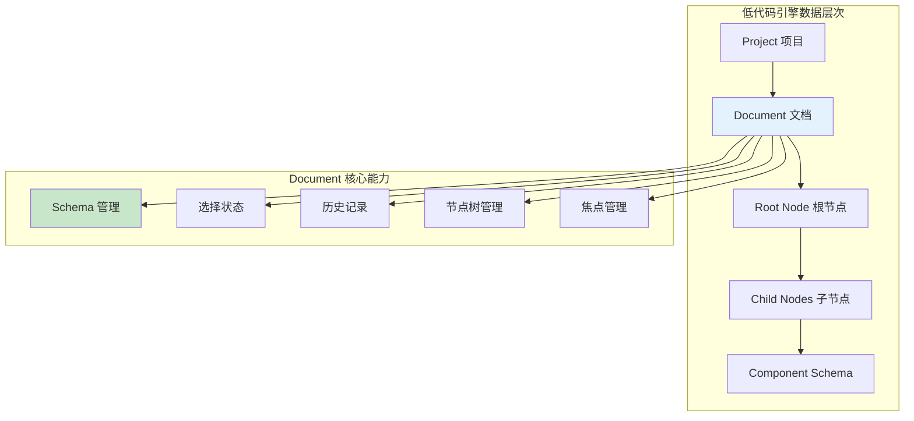
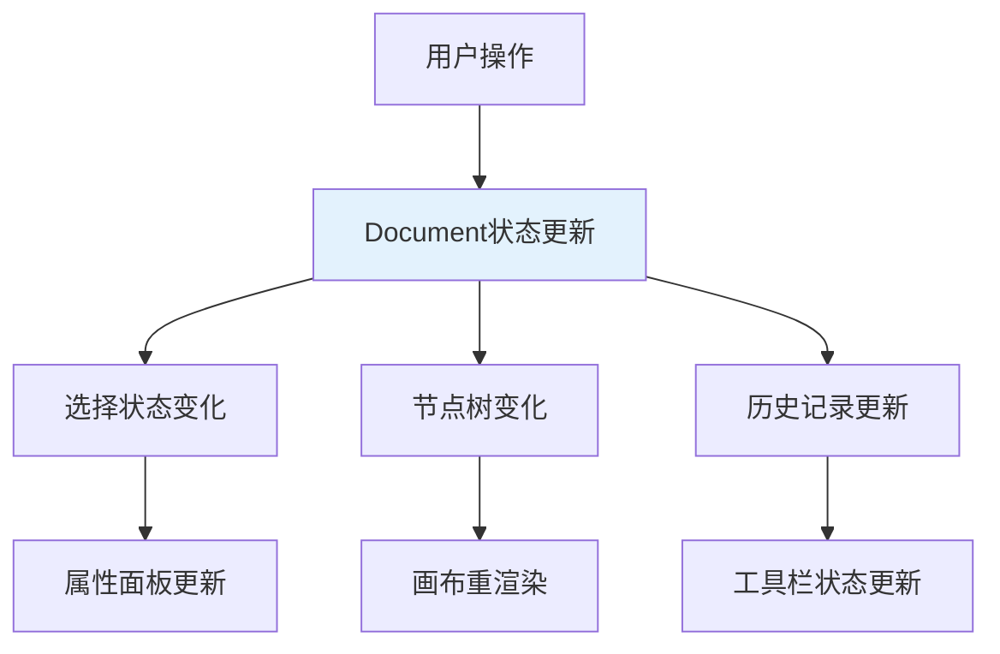

# CurrentDocument 文档管理核心详解

## 一、概述与定位

### 1.1 核心概念

`currentDocument` 是低代码引擎中的**文档管理核心**，代表当前正在编辑的页面或组件文档。它是整个设计时数据的**唯一来源**，承载着页面的完整状态信息。



### 1.2 在架构中的地位

```typescript
// 🎯 在 BuiltinSimulatorHost 中的访问方式
get currentDocument() {
  return this.project.currentDocument;
}

// 📊 数据流向
Editor → Designer → Project → Document → Node Tree → Schema
```

## 二、Document 接口完整能力分析

### 2.1 基础属性和标识

```typescript
interface IDocument {
  // 📋 基础标识信息
  readonly id: string;                    // 文档唯一标识符
  readonly fileName?: string;             // 文件名称（可选）
  readonly title?: string;                // 文档标题
  readonly version?: string;              // 版本号

  // 🏷️ 文档类型和状态
  readonly docType: 'page' | 'component'; // 文档类型：页面或组件
  readonly state: 'normal' | 'saving' | 'saved' | 'error'; // 文档状态
  readonly isModified: boolean;           // 是否已修改
  readonly isBlank: boolean;              // 是否为空白文档
}
```

### 2.2 节点树管理能力

#### **🌳 节点树结构**

```typescript
interface IDocument {
  // 🌳 节点树管理
  readonly root: INode;                   // 根节点，树结构的起点
  readonly nodesMap: Map<string, INode>;  // 节点ID到节点实例的映射表

  // 🔍 节点查找和操作
  getNode(id: string): INode | null;      // 根据ID获取节点
  getNodeByComponentName(name: string): INode[]; // 根据组件名查找节点
  createNode(schema: ISchema): INode;     // 创建新节点
  removeNode(node: INode | string): boolean; // 删除节点
  insertNode(parent: INode, node: INode, at?: number): void; // 插入节点

  // 🔄 节点遍历
  visitNodes(visitor: (node: INode) => void): void; // 深度优先遍历
  findNodes(predicate: (node: INode) => boolean): INode[]; // 条件查找
}
```

#### **🎯 节点操作示例**

```typescript
// 📝 创建和插入节点
const buttonSchema = {
  componentName: 'Button',
  props: { children: 'Click me' }
};
const buttonNode = document.createNode(buttonSchema);
document.insertNode(document.root, buttonNode);

// 🔍 查找特定组件
const allButtons = document.getNodeByComponentName('Button');
const specificButton = document.getNode('button-id-123');

// 🗑️ 删除节点
document.removeNode(buttonNode);
```

### 2.3 选择状态管理

#### **🎯 选择管理器能力**

```typescript
interface ISelection {
  // 📊 选择状态查询
  readonly size: number;                  // 选中节点数量
  readonly length: number;                // 选择长度（同size）
  readonly isEmpty: boolean;              // 是否为空选择
  readonly first: INode | null;          // 第一个选中节点
  readonly node: INode | null;           // 主选中节点（单选时等于first）

  // 🎯 单选操作
  select(id: string | INode): void;       // 选中指定节点
  selectAll(): void;                      // 全选
  clear(): void;                          // 清空选择

  // 🔄 多选操作
  add(id: string | INode): void;          // 添加到选择
  remove(id: string | INode): void;       // 从选择中移除
  toggle(id: string | INode): void;       // 切换选择状态

  // 🔍 选择查询
  has(id: string | INode): boolean;       // 是否包含指定节点
  contains(node: INode): boolean;         // 是否包含节点（包括子节点）
  getNodes(): INode[];                    // 获取所有选中节点
  getTopNodes(): INode[];                 // 获取顶层选中节点

  // 📡 事件监听
  onSelectionChange(callback: (selection: ISelection) => void): () => void;
}
```

#### **🎮 选择状态应用场景**

```typescript
// 🎯 单选操作
document.selection.select('node-id-123');
console.log(document.selection.node?.componentName); // 'Button'

// 🔄 多选操作
document.selection.add('node-id-456');
document.selection.add('node-id-789');
console.log(document.selection.size); // 3

// 🎨 批量操作选中节点
const selectedNodes = document.selection.getNodes();
selectedNodes.forEach(node => {
  node.setProp('className', 'selected');
});

// 📡 监听选择变化
const unsub = document.selection.onSelectionChange((selection) => {
  console.log(`选中了 ${selection.size} 个节点`);
});
```

### 2.4 焦点管理

#### **🎯 焦点节点概念**

```typescript
interface IDocument {
  // 🎯 焦点管理
  focusNode: INode | null;                // 当前焦点节点
  setFocusNode(node: INode | null): void; // 设置焦点节点

  // 🔍 焦点相关查询
  getFocusedContainer(): INode | null;    // 获取焦点容器
  isChildOfFocusNode(node: INode): boolean; // 是否为焦点节点的子节点
}
```

#### **💡 焦点节点的作用**

1. **🎯 操作上下文**：确定当前操作的上下文环境
2. **🔍 悬停优化**：悬停时优先显示焦点节点信息
3. **📋 快捷操作**：复制、粘贴等操作的默认目标
4. **🎨 视觉高亮**：在设计器中高亮显示焦点区域

### 2.5 Schema 管理能力

#### **📄 Schema 操作接口**

```typescript
interface IDocument {
  // 📄 Schema 管理
  schema: ISchema;                        // 完整的文档Schema
  exportSchema(stage?: 'save' | 'render' | 'clone'): ISchema; // 导出Schema
  importSchema(schema: ISchema, checkVersion?: boolean): void; // 导入Schema

  // 🔄 Schema 转换
  toSchema(): ISchema;                    // 转换为Schema格式
  fromSchema(schema: ISchema): void;      // 从Schema创建

  // 🔧 Schema 工具
  validateSchema(schema: ISchema): boolean; // 验证Schema有效性
  upgradeSchema(schema: ISchema): ISchema; // 升级Schema版本
}
```

#### **📊 Schema 结构分析**

```typescript
// 🗂️ 完整的文档 Schema 结构
interface IDocumentSchema {
  // 📋 基础信息
  version: string;                        // Schema版本
  componentsMap: ComponentsMap[];         // 组件映射表
  componentsTree: INodeSchema[];          // 组件树

  // 🎨 样式和资源
  css?: string;                          // 全局样式
  constants?: ConstantsMap;              // 常量定义

  // 🔧 配置信息
  config?: {
    title?: string;                      // 页面标题
    meta?: object;                       // 元数据
    router?: RouterConfig;               // 路由配置
  };

  // 📱 设备和环境
  device?: 'mobile' | 'desktop';         // 目标设备
  locale?: string;                       // 语言环境
}
```

### 2.6 历史记录管理

#### **🕰️ 历史记录接口**

```typescript
interface IHistory {
  // 📊 状态查询
  readonly canBack: boolean;              // 是否可撤销
  readonly canForward: boolean;           // 是否可重做
  readonly current: any;                  // 当前状态
  readonly size: number;                  // 历史记录数量

  // 🔄 基础操作
  back(): void;                          // 撤销上一步操作
  forward(): void;                       // 重做下一步操作
  push(state: any, tag?: string): void;  // 推入新的历史状态
  clear(): void;                         // 清空历史记录

  // 🎯 事务操作
  startTransaction(tag?: string): void;   // 开始事务（批量操作）
  endTransaction(): void;                // 结束事务
  isInTransaction(): boolean;            // 是否在事务中

  // 📡 事件监听
  onHistoryChange(callback: (history: IHistory) => void): () => void;
}
```

#### **⚡ 历史记录优化策略**

```typescript
// 🎯 事务优化：批量操作合并为单个历史记录
document.history.startTransaction('批量删除操作');
selectedNodes.forEach(node => document.removeNode(node));
document.history.endTransaction();

// 🔄 只产生一个历史记录，撤销时一次性恢复所有操作
```

### 2.7 验证和规则检查

#### **🛡️ 嵌套规则检查**

```typescript
interface IDocument {
  // 🛡️ 规则验证
  checkNesting(container: INode, dragObject: IDragObject): boolean; // 检查嵌套规则
  checkDroppable(target: INode, source: INode[]): boolean; // 检查是否可放置

  // 🔍 约束检查
  validateStructure(): ValidationResult[];  // 结构验证
  checkCircularReference(node: INode): boolean; // 循环引用检查
}
```

#### **🔧 验证规则类型**

1. **📦 组件兼容性**：检查组件是否支持特定子组件
2. **🏗️ 结构完整性**：确保必需的属性和子组件存在
3. **🚫 循环引用**：防止组件引用自身造成无限循环
4. **📱 设备兼容性**：检查组件在目标设备上的支持情况

### 2.8 事件系统

#### **📡 文档级事件**

```typescript
interface IDocument {
  // 📡 事件监听
  onNodeCreate(callback: (node: INode) => void): () => void;
  onNodeRemove(callback: (node: INode) => void): () => void;
  onNodeUpdate(callback: (node: INode) => void): () => void;
  onSelectionChange(callback: (selection: ISelection) => void): () => void;
  onFocusChange(callback: (focusNode: INode | null) => void): () => void;

  // 📢 事件触发
  emit(eventName: string, ...args: any[]): void;
  off(eventName: string, callback: Function): void;
}
```

## 三、CurrentDocument 的存在意义

### 3.1 数据中心角色

**📊 单一数据源（Single Source of Truth）**：
```typescript
// 🎯 所有设计时数据都来源于 currentDocument
const selectedComponents = host.currentDocument.selection.getNodes();
const rootComponent = host.currentDocument.root;
const canUndo = host.currentDocument.history.canBack;

// 💡 避免数据不一致：所有模块都从同一数据源读取
```

### 3.2 状态管理中心

**🔄 状态同步枢纽**：


### 3.3 业务逻辑载体

**🎯 核心业务规则实现**：

1. **🛡️ 权限控制**：
   ```typescript
   // 检查节点是否可以被删除
   const canDelete = node.isRemovable() && !node.isLocked;
   ```

2. **🔧 规则验证**：
   ```typescript
   // 验证拖拽是否符合嵌套规则
   const isValid = document.checkNesting(container, dragNodes);
   ```

3. **🎨 样式管理**：
   ```typescript
   // 管理全局样式和主题
   document.updateGlobalCSS(newStyles);
   ```

### 3.4 协作和持久化

**💾 数据持久化支持**：
```typescript
// 🔄 完整的保存和加载流程
class DocumentPersistence {
  // 💾 保存文档
  async save(document: IDocument) {
    const schema = document.exportSchema('save');
    await api.saveDocument(document.id, schema);
  }

  // 📂 加载文档
  async load(documentId: string) {
    const schema = await api.loadDocument(documentId);
    document.importSchema(schema);
  }
}
```

**👥 协作编辑支持**：
```typescript
// 🔄 实时协作的数据同步
document.onNodeUpdate((node) => {
  // 📡 广播节点变更到其他协作者
  collaborationService.broadcastNodeChange({
    documentId: document.id,
    nodeId: node.id,
    changes: node.getChanges()
  });
});
```

## 四、技术实现细节

### 4.1 响应式系统集成

**🔄 MobX 响应式支持**：
```typescript
class Document {
  @observable
  private _selection: Selection;

  @observable
  private _focusNode: INode | null = null;

  @computed
  get canPaste(): boolean {
    return this.clipboard.hasContent && this._focusNode?.isContainer;
  }
}
```

### 4.2 内存管理和性能优化

**⚡ 性能优化策略**：

1. **🗺️ 节点映射缓存**：
   ```typescript
   private nodesMap = new Map<string, INode>();  // O(1) 节点查找
   ```

2. **🔄 增量更新**：
   ```typescript
   updateNode(nodeId: string, changes: Partial<INodeSchema>) {
     const node = this.nodesMap.get(nodeId);
     node?.updateProps(changes.props);  // 只更新变更的属性
   }
   ```

3. **💾 历史记录优化**：
   ```typescript
   // 限制历史记录数量，自动清理过期记录
   private readonly MAX_HISTORY_SIZE = 50;
   ```

### 4.3 错误处理和容灾

**🛡️ 错误恢复机制**：
```typescript
class DocumentErrorHandler {
  // 🚨 捕获和恢复Schema解析错误
  recoverFromSchemaError(schema: ISchema): ISchema {
    try {
      return this.validateAndRepairSchema(schema);
    } catch (error) {
      console.error('Schema恢复失败:', error);
      return this.createEmptySchema(); // 🆘 返回空白Schema
    }
  }

  // 🔄 自动保存和备份
  autoBackup() {
    const backup = this.document.exportSchema('backup');
    localStorage.setItem(`backup_${this.document.id}`, JSON.stringify(backup));
  }
}
```

## 五、最佳实践和使用模式

### 5.1 安全访问模式

```typescript
// ✅ 推荐：安全的文档访问
function safeDocumentOperation(host: BuiltinSimulatorHost) {
  const document = host.currentDocument;
  if (!document) {
    console.warn('当前没有活跃文档');
    return;
  }

  // 进行文档操作...
}

// ❌ 不推荐：直接访问可能为空
function unsafeOperation(host: BuiltinSimulatorHost) {
  const node = host.currentDocument.root; // 可能报错
}
```

### 5.2 事务操作模式

```typescript
// ✅ 推荐：使用事务处理批量操作
function batchUpdateNodes(document: IDocument, updates: NodeUpdate[]) {
  document.history.startTransaction('批量更新节点');

  try {
    updates.forEach(update => {
      const node = document.getNode(update.id);
      node?.updateProps(update.props);
    });
  } finally {
    document.history.endTransaction(); // 确保事务结束
  }
}
```

### 5.3 事件监听模式

```typescript
// ✅ 推荐：正确的事件监听和清理
class ComponentManager {
  private unsubscribeCallbacks: Array<() => void> = [];

  init(document: IDocument) {
    // 🔄 监听选择变化
    const unsub1 = document.selection.onSelectionChange(this.handleSelectionChange);
    this.unsubscribeCallbacks.push(unsub1);

    // 🎯 监听焦点变化
    const unsub2 = document.onFocusChange(this.handleFocusChange);
    this.unsubscribeCallbacks.push(unsub2);
  }

  destroy() {
    // 🧹 清理所有事件监听
    this.unsubscribeCallbacks.forEach(unsub => unsub());
    this.unsubscribeCallbacks = [];
  }
}
```

## 六、扩展和定制

### 6.1 自定义验证规则

```typescript
// 🔧 扩展文档验证能力
class CustomDocumentValidator {
  validateBusinessRules(document: IDocument): ValidationResult[] {
    const errors: ValidationResult[] = [];

    // 🏗️ 业务规则：页面必须有标题
    if (!document.root.getChild('title')) {
      errors.push({
        type: 'warning',
        message: '页面缺少标题组件',
        nodeId: document.root.id
      });
    }

    // 📱 设备规则：移动端不允许某些组件
    if (document.config?.device === 'mobile') {
      const invalidComponents = document.findNodes(node =>
        ['Table', 'Tree'].includes(node.componentName)
      );

      invalidComponents.forEach(node => {
        errors.push({
          type: 'error',
          message: `${node.componentName} 组件不支持移动端`,
          nodeId: node.id
        });
      });
    }

    return errors;
  }
}
```

### 6.2 文档插件系统

```typescript
// 🔌 文档插件接口
interface IDocumentPlugin {
  name: string;
  version: string;

  // 📡 生命周期钩子
  onDocumentInit?(document: IDocument): void;
  onNodeCreate?(node: INode): void;
  onSchemaExport?(schema: ISchema): ISchema;

  // 🛠️ 扩展能力
  customValidators?: IValidator[];
  customCommands?: ICommand[];
}

// 🔧 插件管理器
class DocumentPluginManager {
  private plugins: IDocumentPlugin[] = [];

  register(plugin: IDocumentPlugin) {
    this.plugins.push(plugin);
    // 注册插件的验证器和命令...
  }

  applyPlugins(document: IDocument) {
    this.plugins.forEach(plugin => {
      plugin.onDocumentInit?.(document);
    });
  }
}
```

## 七、调试和故障排查

### 7.1 调试工具

```typescript
// 🔍 文档调试工具
class DocumentDebugger {
  // 📊 分析文档结构
  analyzeStructure(document: IDocument) {
    console.group('📄 Document Structure Analysis');
    console.log('📋 基础信息:', {
      id: document.id,
      title: document.title,
      nodeCount: document.nodesMap.size
    });

    console.log('🎯 选择状态:', {
      selectedCount: document.selection.size,
      focusNode: document.focusNode?.componentName
    });

    console.log('🕰️ 历史记录:', {
      canUndo: document.history.canBack,
      canRedo: document.history.canForward,
      historySize: document.history.size
    });
    console.groupEnd();
  }

  // 🔍 检查节点关系
  validateNodeTree(document: IDocument) {
    const orphanNodes = [];
    const circularRefs = [];

    document.nodesMap.forEach(node => {
      // 检查孤儿节点
      if (node.parent && !document.nodesMap.has(node.parent.id)) {
        orphanNodes.push(node.id);
      }

      // 检查循环引用
      if (this.hasCircularReference(node)) {
        circularRefs.push(node.id);
      }
    });

    console.warn('🚨 发现问题:', { orphanNodes, circularRefs });
  }
}
```

### 7.2 性能监控

```typescript
// ⚡ 性能监控工具
class DocumentPerformanceMonitor {
  private operationTimes = new Map<string, number>();

  startTiming(operation: string) {
    this.operationTimes.set(operation, performance.now());
  }

  endTiming(operation: string) {
    const startTime = this.operationTimes.get(operation);
    if (startTime) {
      const duration = performance.now() - startTime;
      console.log(`⏱️ ${operation} 耗时: ${duration.toFixed(2)}ms`);
      this.operationTimes.delete(operation);
    }
  }
}
```

## 八、总结

`currentDocument` 作为低代码引擎的数据核心，体现了以下设计智慧：

### 🎯 核心价值

1. **📊 数据统一性**：作为唯一数据源，确保所有模块数据一致
2. **🔄 状态管理**：提供完整的状态管理和历史记录能力
3. **🛡️ 业务规则**：承载复杂的业务逻辑和验证规则
4. **⚡ 性能优化**：通过缓存和增量更新提供高性能
5. **🔌 扩展性**：支持插件和自定义扩展

### 🚀 技术特点

- **响应式架构**：基于 MobX 的自动状态同步
- **事务支持**：批量操作的原子性保证
- **内存优化**：智能缓存和垃圾回收
- **错误恢复**：完善的容错和恢复机制
- **调试友好**：丰富的调试和监控工具

理解 `currentDocument` 的设计和能力，对于深度使用和扩展低代码引擎具有重要意义。它不仅是数据的载体，更是整个设计时体验的基础。

