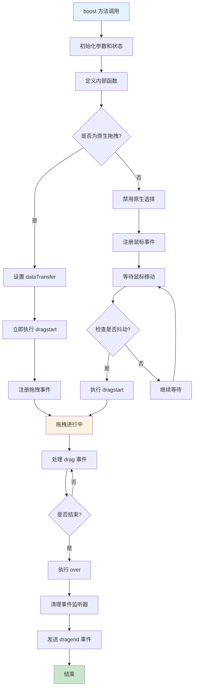

# Dragon.boost 方法详解

## 🎯 核心功能概述

`boost` 方法是 Dragon 拖拽引擎的**核心方法**，负责启动和管理整个拖拽流程。它的主要职责包括：

1. **拖拽初始化**：设置拖拽状态和参数
2. **事件监听管理**：动态注册/移除各种拖拽相关事件
3. **拖拽流程控制**：管理拖拽的开始、进行、结束三个阶段
4. **传感器协调**：协调多个传感器的交互
5. **坐标转换**：处理不同坐标系之间的转换
6. **视觉反馈**：提供拖拽过程中的视觉反馈

## 📋 方法签名

```typescript
boost(
  dragObject: IPublicModelDragObject,  // 拖拽对象（包含被拖拽的节点或数据）
  boostEvent: MouseEvent | DragEvent,  // 触发拖拽的初始事件
  fromRglNode?: INode | IPublicModelNode // 可选：来源的 RGL 节点（React Grid Layout）
): void
```

## 🏗️ 代码结构分析

### 1️⃣ **初始化阶段（第168-184行）**

```typescript
boost(
  dragObject: IPublicModelDragObject,    // 拖拽对象：包含要拖拽的节点或数据
  boostEvent: MouseEvent | DragEvent,    // 触发事件：鼠标或拖拽事件
  fromRglNode?: INode | IPublicModelNode // 可选的RGL节点：React Grid Layout节点
) {
  const { designer } = this;                          // 获取设计器实例，用于访问项目、文档等
  const masterSensors = this.getMasterSensors();     // 获取主传感器列表（活跃的模拟器）
  const handleEvents = makeEventsHandler(boostEvent, masterSensors); // 创建事件处理器，用于跨文档事件处理

  // 判断是否为新组件（从组件库拖入）：
  // - 如果 dragObject.type === 'NodeData'，则 isDragNodeObject 返回 false，newBie 为 true
  // - 如果 dragObject.type === 'Node'，则 isDragNodeObject 返回 true，newBie 为 false
  const newBie = !isDragNodeObject(dragObject);

  // 判断是否强制复制状态：当拖拽的节点中包含插槽时，强制进行复制而非移动
  const forceCopyState =
    isDragNodeObject(dragObject) &&
    dragObject.nodes.some((node: Node | IPublicModelNode) =>
      (typeof node.isSlot === 'function' ? node.isSlot() : node.isSlot)
    );

  // 判断是否来自原生拖拽API（HTML5 Drag API）
  const isBoostFromDragAPI = isDragEvent(boostEvent);

  let lastSensor: IPublicModelSensor | undefined;     // 记录上一个活跃的传感器

  this._dragging = false;                             // 初始化拖拽状态为 false
```

### 2️⃣ **内部函数定义阶段（第186-497行）**

#### **getRGL 函数（第186-192行）**
```typescript
// 获取 React Grid Layout 相关信息
const getRGL = (e: MouseEvent | DragEvent) => {
  const locateEvent = createLocateEvent(e);          // 创建定位事件对象
  const sensor = chooseSensor(locateEvent);          // 选择合适的传感器
  if (!sensor || !sensor.getNodeInstanceFromElement) return {}; // 传感器无效则返回空对象

  // 从事件目标元素获取节点实例
  const nodeInst = sensor.getNodeInstanceFromElement(e.target as Element);
  return nodeInst?.node?.getRGL() || {};             // 返回 RGL 信息或空对象
};
```

#### **checkesc 函数（第194-199行）**
```typescript
// ESC 键取消拖拽处理
const checkesc = (e: KeyboardEvent) => {
  if (e.keyCode === 27) {                            // ESC 键的 keyCode 是 27
    designer.clearLocation();                        // 清除设计器中的位置信息
    over();                                          // 结束拖拽
  }
};
```

#### **checkcopy 函数（第202-231行）**
```typescript
let copy = false;                                    // 标记是否为复制模式
const checkcopy = (e: MouseEvent | DragEvent | KeyboardEvent) => {
  /* istanbul ignore next */
  // 处理原生拖拽API的情况
  if (isDragEvent(e) && e.dataTransfer) {
    if (newBie || forceCopyState) {                  // 新组件或强制复制状态
      e.dataTransfer.dropEffect = 'copy';           // 设置拖拽效果为复制
    }
    return;
  }

  // 新组件直接返回（默认就是复制）
  if (newBie) {
    return;
  }

  // 检查 Alt 或 Ctrl 键是否按下
  if (e.altKey || e.ctrlKey) {
    copy = true;                                     // 设置为复制模式
    this.setCopyState(true);                         // 设置拖拽引擎的复制状态
    /* istanbul ignore next */
    if (isDragEvent(e) && e.dataTransfer) {
      e.dataTransfer.dropEffect = 'copy';           // 原生拖拽API设置复制效果
    }
  } else {
    copy = false;                                    // 设置为移动模式
    if (!forceCopyState) {                           // 非强制复制状态
      this.setCopyState(false);                      // 设置拖拽引擎的移动状态
      /* istanbul ignore next */
      if (isDragEvent(e) && e.dataTransfer) {
        e.dataTransfer.dropEffect = 'move';         // 原生拖拽API设置移动效果
      }
    }
  }
};
```

#### **drag 函数（第234-292行）- 拖拽过程处理**
```typescript
let lastArrive: any;                                 // 记录上一次的鼠标位置事件
const drag = (e: MouseEvent | DragEvent) => {
  // FIXME: donot setcopy when: newbie & no location
  checkcopy(e);                                      // 检查复制状态

  // 过滤无效的鼠标位置点
  if (isInvalidPoint(e, lastArrive)) return;

  // 避免处理相同位置的重复事件（性能优化）
  if (lastArrive && isSameAs(e, lastArrive)) {
    lastArrive = e;
    return;
  }
  lastArrive = e;

  const { isRGL, rglNode } = getRGL(e);              // 获取 RGL 信息
  const locateEvent = createLocateEvent(e);          // 创建定位事件
  const sensor = chooseSensor(locateEvent);          // 选择传感器

  /* istanbul ignore next */
  // 处理 React Grid Layout 特殊逻辑
  if (isRGL) {
    debugger;                                        // 调试断点
    // 禁止被拖拽元素阻断鼠标事件
    const nodeInst = dragObject.nodes[0].getDOMNode();
    if (nodeInst && nodeInst.style) {
      this.nodeInstPointerEvents = true;
      nodeInst.style.pointerEvents = 'none';        // 设置为不响应鼠标事件
    }

    // 通知 RGL 停止休眠
    this.emitter.emit('rgl.sleeping', false);

    // 如果是从同一个 RGL 节点拖拽，直接返回
    if (fromRglNode && fromRglNode.id === rglNode.id) {
      designer.clearLocation();
      this.clearState();
      this.emitter.emit('drag', locateEvent);
      return;
    }

    // 尝试定位并判断是否可以放置
    this._canDrop = !!sensor?.locate(locateEvent);
    if (this._canDrop) {
      // 添加 RGL 占位符
      this.emitter.emit('rgl.add.placeholder', {
        rglNode,
        fromRglNode,
        node: locateEvent.dragObject?.nodes[0],
        event: e,
      });
      designer.clearLocation();
      this.clearState();
      this.emitter.emit('drag', locateEvent);
      return;
    }
  } else {
    // 非 RGL 情况
    this._canDrop = false;
    this.emitter.emit('rgl.remove.placeholder');     // 移除 RGL 占位符
    this.emitter.emit('rgl.sleeping', true);         // RGL 进入休眠
  }

  // 正常的传感器定位逻辑
  if (sensor) {
    sensor.fixEvent(locateEvent);                    // 修正事件对象
    sensor.locate(locateEvent);                      // 进行定位
  } else {
    designer.clearLocation();                        // 清除位置
  }
  this.emitter.emit('drag', locateEvent);           // 发送拖拽事件
};
```

#### **dragstart 函数（第294-312行）- 拖拽开始处理**
```typescript
const dragstart = () => {
  this._dragging = true;                             // 设置拖拽状态为 true
  setShaken(boostEvent);                            // 标记事件已经发生了抖动
  const locateEvent = createLocateEvent(boostEvent); // 创建初始定位事件

  // 根据拖拽类型设置初始状态
  if (newBie || forceCopyState) {
    this.setCopyState(true);                         // 新组件或强制复制，设置为复制状态
  } else {
    chooseSensor(locateEvent);                       // 选择传感器
  }

  this.setDraggingState(true);                      // 设置全局拖拽状态

  // 非原生拖拽API时，注册 ESC 取消功能
  if (!isBoostFromDragAPI) {
    handleEvents((doc) => {
      doc.addEventListener('keydown', checkesc, false);
    });
  }

  this.emitter.emit('dragstart', locateEvent);      // 发送拖拽开始事件
};
```

#### **move 函数（第315-332行）- 鼠标移动处理**
```typescript
// route: drag-move
const move = (e: MouseEvent | DragEvent) => {
  /* istanbul ignore next */
  // 原生拖拽API需要阻止默认行为
  if (isBoostFromDragAPI) {
    e.preventDefault();
  }

  // 如果已经在拖拽状态，直接处理拖拽
  if (this._dragging) {
    drag(e);                                         // 处理拖拽移动
    return;
  }

  // 首次移动检查是否已经发生抖动（防误触）
  if (isShaken(boostEvent, e)) {
    dragstart();                                     // 开始拖拽
    drag(e);                                         // 处理拖拽移动
  }
};
```

#### **drop 函数（第335-340行）- 原生拖拽放置处理**
```typescript
let didDrop = true;                                  // 标记是否发生了放置
/* istanbul ignore next */
const drop = (e: DragEvent) => {
  e.preventDefault();                                // 阻止默认行为
  e.stopPropagation();                              // 阻止事件冒泡
  didDrop = true;                                   // 标记已放置
};
```

#### **over 函数（第343-421行）- 拖拽结束处理**
```typescript
// end-tail drag process
const over = (e?: any) => {
  // 恢复被拖拽元素的鼠标事件响应
  if (this.nodeInstPointerEvents) {
    const nodeInst = dragObject.nodes[0].getDOMNode();
    if (nodeInst && nodeInst.style) {
      nodeInst.style.pointerEvents = '';            // 恢复 pointer-events
    }
    this.nodeInstPointerEvents = false;
  }

  // 处理 RGL 放置事件
  if (e) {
    const { isRGL, rglNode } = getRGL(e);
    /* istanbul ignore next */
    if (isRGL && this._canDrop && this._dragging) {
      const tarNode = dragObject.nodes[0];
      if (rglNode.id !== tarNode.id) {              // 避免自己拖拽到自己
        // 发送 RGL 放置事件
        this.emitter.emit('rgl.drop', {
          rglNode,
          node: tarNode,
        });
        // 选中放置的节点
        const selection = designer.project.currentDocument?.selection;
        selection?.select(tarNode.id);
      }
    }
  }

  // 清理占位符
  this.emitter.emit('rgl.remove.placeholder');

  /* istanbul ignore next */
  if (e && isDragEvent(e)) {
    e.preventDefault();
  }

  // 停用最后的传感器
  if (lastSensor) {
    lastSensor.deactiveSensor();
  }

  /* istanbul ignore next */
  // 根据拖拽类型进行不同的清理
  if (isBoostFromDragAPI) {
    if (!didDrop) {                                  // 原生拖拽未成功放置
      designer.clearLocation();
    }
  } else {
    this.setNativeSelection(true);                   // 恢复原生选择
  }

  this.clearState();                                // 清除拖拽状态

  let exception;
  // 发送拖拽结束事件
  if (this._dragging) {
    this._dragging = false;
    try {
      this.emitter.emit('dragend', { dragObject, copy });
    } catch (ex) /* istanbul ignore next */ {
      exception = ex;
    }
  }

  designer.clearLocation();                          // 清除设计器位置

  // 移除所有事件监听器
  handleEvents((doc) => {
    /* istanbul ignore next */
    if (isBoostFromDragAPI) {
      doc.removeEventListener('dragover', move, true);
      doc.removeEventListener('dragend', over, true);
      doc.removeEventListener('drop', drop, true);
    } else {
      doc.removeEventListener('mousemove', move, true);
      doc.removeEventListener('mouseup', over, true);
    }
    doc.removeEventListener('mousedown', over, true);
    doc.removeEventListener('keydown', checkesc, false);
    doc.removeEventListener('keydown', checkcopy, false);
    doc.removeEventListener('keyup', checkcopy, false);
  });

  /* istanbul ignore next */
  if (exception) {
    throw exception;                                 // 重新抛出异常
  }
};
```

#### **createLocateEvent 函数（第424-466行）- 创建定位事件**
```typescript
// create drag locate event
const createLocateEvent = (e: MouseEvent | DragEvent): ILocateEvent => {
  const evt: any = {
    type: 'LocateEvent',                             // 事件类型
    dragObject,                                      // 拖拽对象
    target: e.target,                               // 事件目标
    originalEvent: e,                               // 原始事件
  };

  const sourceDocument = e.view?.document;          // 获取事件来源文档

  // 事件来自当前文档
  if (!sourceDocument || sourceDocument === document) {
    evt.globalX = e.clientX;                        // 直接使用客户端坐标
    evt.globalY = e.clientY;
  } /* istanbul ignore next */ else {
    // 事件来自模拟器沙箱（iframe）
    let srcSim: ISimulatorHost | undefined;
    const lastSim = lastSensor && isSimulatorHost(lastSensor) ? lastSensor : null;

    // 检查来源模拟器
    if (lastSim && lastSim.contentDocument === sourceDocument) {
      srcSim = lastSim;
    } else {
      // 在主传感器中查找匹配的模拟器
      srcSim = masterSensors.find((sim) => sim.contentDocument === sourceDocument);
      if (!srcSim && lastSim) {
        srcSim = lastSim;                           // 回退到最后的模拟器
      }
    }

    if (srcSim) {
      // 通过模拟器进行坐标转换
      const g = srcSim.viewport.toGlobalPoint(e);
      evt.globalX = g.clientX;                      // 全局坐标
      evt.globalY = g.clientY;
      evt.canvasX = e.clientX;                      // 画布坐标
      evt.canvasY = e.clientY;
      evt.sensor = srcSim;                          // 关联传感器
    } else {
      // 异常情况的处理，确保 TypeScript 通过
      evt.globalX = e.clientX;
      evt.globalY = e.clientY;
    }
  }
  return evt;
};
```

#### **chooseSensor 函数（第470-497行）- 选择传感器**
```typescript
const sourceSensor = getSourceSensor(dragObject);   // 获取拖拽对象的来源传感器
/* istanbul ignore next */
const chooseSensor = (e: ILocateEvent) => {
  // 合并所有可用传感器（this.sensors 会在拖拽开始时变化）
  const sensors: IPublicModelSensor[] = this.sensors.concat(masterSensors as IPublicModelSensor[]);

  // 选择传感器的优先级：
  // 1. 事件自带的传感器且进入了该传感器区域
  // 2. 可用的传感器中找到进入区域的传感器
  let sensor =
    e.sensor && e.sensor.isEnter(e) ? e.sensor : sensors.find((s) => s.sensorAvailable && s.isEnter(e));

  if (!sensor) {
    // 没有找到合适传感器时的回退策略
    // TODO: enter some area like componentspanel cancel
    if (lastSensor) {
      sensor = lastSensor;                          // 使用上一个传感器
    } else if (e.sensor) {
      sensor = e.sensor;                            // 使用事件传感器
    } else if (sourceSensor) {
      sensor = sourceSensor;                        // 使用来源传感器
    }
  }

  // 传感器切换处理
  if (sensor !== lastSensor) {
    if (lastSensor) {
      lastSensor.deactiveSensor();                  // 停用旧传感器
    }
    lastSensor = sensor;                            // 更新当前传感器
  }

  if (sensor) {
    e.sensor = sensor;                              // 关联传感器到事件
    sensor.fixEvent(e);                             // 让传感器修正事件
  }

  this._activeSensor = sensor;                      // 设置活跃传感器
  return sensor;
};
```

### 3️⃣ **主流程执行阶段（第499-541行）**

#### **原生拖拽API处理（第500-516行）**
```typescript
/* istanbul ignore next */
if (isDragEvent(boostEvent)) {                      // 如果是原生拖拽事件
  const { dataTransfer } = boostEvent;

  if (dataTransfer) {
    dataTransfer.effectAllowed = 'all';             // 允许所有拖拽效果

    try {
      dataTransfer.setData('application/json', '{}'); // 设置拖拽数据
    } catch (ex) {
      // ignore                                      // 忽略设置失败
    }
  }

  dragstart();                                      // 立即开始拖拽
} else {
  this.setNativeSelection(false);                   // 禁用原生选择
}
```

#### **事件监听器注册（第518-531行）**
```typescript
handleEvents((doc) => {
  /* istanbul ignore next */
  if (isBoostFromDragAPI) {                         // 原生拖拽API事件
    doc.addEventListener('dragover', move, true);   // 拖拽经过
    // dragexit
    didDrop = false;                               // 重置放置标记
    doc.addEventListener('drop', drop, true);       // 拖拽放置
    doc.addEventListener('dragend', over, true);    // 拖拽结束
  } else {                                         // 鼠标拖拽事件
    doc.addEventListener('mousemove', move, true);  // 鼠标移动
    doc.addEventListener('mouseup', over, true);    // 鼠标释放
  }
  doc.addEventListener('mousedown', over, true);    // 鼠标按下（用于取消拖拽）
});
```

#### **复制功能键盘监听（第535-540行）**
```typescript
// 只有在非新组件且非原生拖拽时才监听键盘事件
if (!newBie && !isBoostFromDragAPI) {
  handleEvents((doc) => {
    doc.addEventListener('keydown', checkcopy, false); // 键盘按下检查复制
    doc.addEventListener('keyup', checkcopy, false);   // 键盘释放检查复制
  });
}
```

## 🔄 拖拽流程图



## 🎮 关键功能详解

### **1. 传感器系统**
- **作用**：协调多个拖拽感应区域
- **实现**：通过 `chooseSensor` 动态选择最合适的传感器
- **支持**：iframe 内外的坐标转换

### **2. 状态管理**
- **拖拽状态**：`_dragging` 标记是否正在拖拽
- **复制状态**：根据键盘修饰键动态切换复制/移动
- **传感器状态**：跟踪活跃的传感器并进行切换

### **3. 事件处理**
- **跨文档支持**：通过 `handleEvents` 处理主文档和 iframe 文档
- **防抖机制**：通过 `isShaken` 防止误触发拖拽
- **坐标转换**：支持不同坐标系之间的转换

### **4. RGL 特殊处理**
- **React Grid Layout 支持**：特殊处理网格布局组件
- **占位符机制**：动态显示/隐藏拖拽占位符
- **pointer-events 控制**：防止拖拽元素阻断事件

## 🎯 总结

**boost 方法是一个高度复杂的拖拽引擎核心**，它通过：
- **统一的事件处理机制**
- **灵活的传感器协调系统**
- **完善的状态管理**
- **强大的坐标转换能力**

实现了支持**多种拖拽场景**（组件库拖拽、画布内拖拽、RGL拖拽）的**通用拖拽解决方案**。
