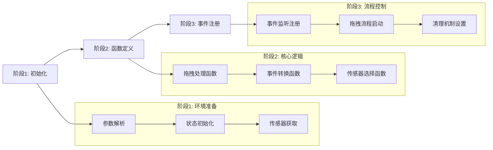
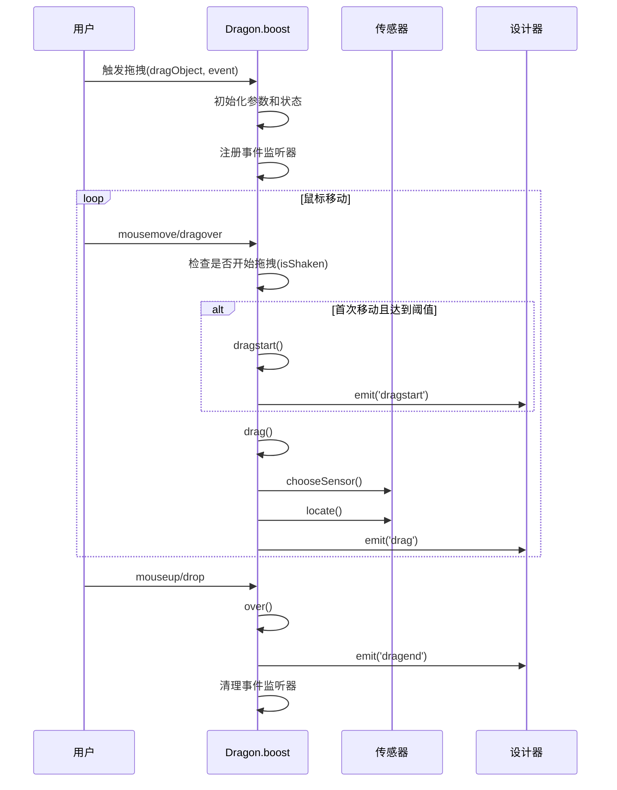

# Dragon.boost 功能详解总结

## 🎯 核心功能概述

`boost` 方法是 **Dragon 拖拽引擎的核心心脏**，负责统一管理低代码引擎中所有类型的拖拽操作。

### **主要职责**
1. **统一拖拽入口**：所有拖拽操作的唯一入口点
2. **多场景支持**：支持组件库拖拽、画布内拖拽、RGL拖拽等
3. **跨框架协调**：协调主文档和 iframe 之间的拖拽交互
4. **状态管理**：管理复杂的拖拽状态和传感器切换
5. **事件路由**：智能路由和处理各种拖拽相关事件

## 📊 方法参数详解

| 参数 | 类型 | 说明 | 示例 |
|------|------|------|------|
| **dragObject** | `IPublicModelDragObject` | 拖拽对象 | `{type: 'Node', nodes: [node]}` 或 `{type: 'NodeData', data: componentMeta}` |
| **boostEvent** | `MouseEvent \| DragEvent` | 触发事件 | 鼠标按下事件或HTML5拖拽事件 |
| **fromRglNode** | `INode \| IPublicModelNode?` | RGL来源节点 | React Grid Layout 容器节点（可选） |

## 🏗️ 内部架构设计

### **三阶段执行模式**



## 🔧 核心功能模块详解

### **1. 拖拽类型判断机制**

#### **newBie（新手模式）**
```typescript
const newBie = !isDragNodeObject(dragObject);
```
- **作用**：区分新组件添加 vs 已有组件移动
- **判断逻辑**：
  - `dragObject.type === 'NodeData'` → `newBie = true` → 组件库拖拽
  - `dragObject.type === 'Node'` → `newBie = false` → 画布内拖拽

#### **forceCopyState（强制复制）**
```typescript
const forceCopyState = isDragNodeObject(dragObject) &&
  dragObject.nodes.some(node => node.isSlot);
```
- **作用**：插槽节点强制复制，防止破坏组件结构
- **适用场景**：拖拽包含插槽的组件时

### **2. 事件处理策略**

#### **双模式事件处理**
| 模式 | 触发条件 | 事件类型 | 特点 |
|------|----------|----------|------|
| **原生拖拽** | `isDragEvent(boostEvent)` | `dragover`, `drop`, `dragend` | HTML5 API，跨窗口支持 |
| **鼠标模拟** | `MouseEvent` | `mousemove`, `mouseup` | 自定义实现，更精确控制 |

#### **防抖机制**
```typescript
if (isShaken(boostEvent, e)) {
  dragstart(); // 只有移动超过阈值才开始拖拽
}
```
- **SHAKE_DISTANCE = 4px**：防止误触发拖拽

### **3. 传感器协调系统**

#### **传感器选择策略**
```typescript
const chooseSensor = (e: ILocateEvent) => {
  // 优先级：事件传感器 > 区域传感器 > 上次传感器 > 来源传感器
  let sensor = e.sensor && e.sensor.isEnter(e) ? e.sensor :
               sensors.find(s => s.sensorAvailable && s.isEnter(e));

  if (!sensor) {
    sensor = lastSensor || e.sensor || sourceSensor;
  }

  return sensor;
};
```

#### **传感器类型**
- **masterSensors**：主传感器（模拟器实例）
- **this.sensors**：自定义传感器（如大纲面板）
- **sourceSensor**：拖拽对象的来源传感器

### **4. 坐标转换机制**

#### **跨iframe坐标转换**
```typescript
const createLocateEvent = (e: MouseEvent | DragEvent) => {
  if (sourceDocument === document) {
    // 主文档：直接使用客户端坐标
    evt.globalX = e.clientX;
    evt.globalY = e.clientY;
  } else {
    // iframe：通过模拟器进行坐标转换
    const g = srcSim.viewport.toGlobalPoint(e);
    evt.globalX = g.clientX;  // 全局坐标
    evt.canvasX = e.clientX;  // 画布坐标
  }
};
```

### **5. RGL（React Grid Layout）特殊处理**

#### **RGL识别和处理**
```typescript
const { isRGL, rglNode } = getRGL(e);
if (isRGL) {
  // 1. 禁用拖拽元素的pointer-events
  nodeInst.style.pointerEvents = 'none';

  // 2. 通知RGL系统状态变化
  this.emitter.emit('rgl.sleeping', false);

  // 3. 显示占位符
  this.emitter.emit('rgl.add.placeholder', {...});
}
```

#### **RGL特性**
- **占位符管理**：动态显示/隐藏拖拽占位符
- **pointer-events控制**：防止拖拽元素阻断事件
- **循环检测**：避免节点拖拽到自身

### **6. 复制/移动状态管理**

#### **状态切换逻辑**
```typescript
const checkcopy = (e: KeyboardEvent | MouseEvent) => {
  if (e.altKey || e.ctrlKey) {
    copy = true;
    this.setCopyState(true);
    e.dataTransfer.dropEffect = 'copy';
  } else {
    copy = false;
    this.setCopyState(false);
    e.dataTransfer.dropEffect = 'move';
  }
};
```

#### **状态影响范围**
- **视觉反馈**：光标样式变化
- **操作行为**：复制 vs 移动节点
- **原生拖拽**：`dataTransfer.dropEffect` 设置

## 🔄 完整拖拽流程

### **流程图**


### **关键时机**
1. **boost调用**：拖拽启动，设置环境
2. **首次移动**：检查抖动，决定是否开始
3. **拖拽进行**：持续定位，更新反馈
4. **拖拽结束**：清理状态，发送事件

## ⚡ 性能优化策略

### **1. 事件过滤**
- **相同位置过滤**：`isSameAs(e, lastArrive)`
- **无效坐标过滤**：`isInvalidPoint(e, lastArrive)`
- **抖动检测**：`isShaken(boostEvent, e)`

### **2. 状态缓存**
- **lastSensor**：避免重复传感器操作
- **lastArrive**：缓存上次事件，减少重复处理
- **_activeSensor**：快速访问当前传感器

### **3. 条件执行**
- **newBie判断**：不同拖拽类型的差异化处理
- **传感器可用性**：`sensor.sensorAvailable`
- **RGL检测**：只在必要时执行复杂逻辑

## 🛡️ 错误处理和容错

### **1. 防御性编程**
```typescript
// 传感器安全访问
if (!sensor || !sensor.getNodeInstanceFromElement) return {};

// DOM节点安全访问
if (nodeInst && nodeInst.style) {
  nodeInst.style.pointerEvents = 'none';
}

// 异常捕获和延迟抛出
try {
  this.emitter.emit('dragend', { dragObject, copy });
} catch (ex) {
  exception = ex; // 延迟到cleanup后抛出
}
```

### **2. 回退策略**
- **传感器选择**：多层回退机制
- **坐标转换**：找不到模拟器时的兜底处理
- **事件处理**：原生拖拽和鼠标模拟的双重支持

## 🎯 总结

**Dragon.boost 方法是一个高度复杂的拖拽引擎核心**，它通过：

### **设计优势**
1. **统一接口**：一个方法处理所有拖拽场景
2. **模块化设计**：清晰的内部函数分工
3. **扩展性强**：支持自定义传感器和处理逻辑
4. **性能优化**：多层次的性能优化策略
5. **容错机制**：完善的错误处理和回退策略

### **核心价值**
- **简化业务使用**：业务层只需调用一个方法
- **处理复杂性**：内部处理跨框架、多传感器等复杂场景
- **保证一致性**：统一的拖拽体验和状态管理
- **支持扩展**：为业务自定义提供足够的扩展点

**这使得低代码引擎能够提供流畅、一致、功能强大的拖拽体验。**
