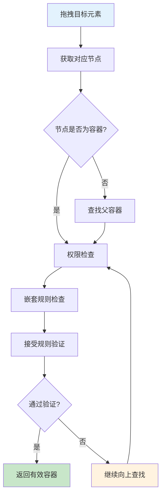

# 组件 isContainer 配置影响详解

## 🎯 概述

`component.isContainer` 是低代码引擎中一个关键的组件元数据配置项，当设置为 `true` 时，会在**渲染行为、拖拽操作、节点选择、快捷键操作**等多个层面产生重要影响。

### **核心判断逻辑**
```typescript
// packages/designer/src/document/node/node.ts
get isContainerNode(): boolean {
  return this.isParentalNode && this.componentMeta.isContainer;
}

// 双重条件：
// 1. isParentalNode：不是叶子节点（可以有子节点）
// 2. componentMeta.isContainer：组件元数据配置为容器
```

## 📋 影响范围总览

| 影响类别 | 具体功能 | 详细说明 |
|---------|----------|----------|
| **🎨 渲染层面** | 空容器占位符 | 显示拖拽提示信息 |
| | 子组件处理 | 强制数组形式处理children |
| **🔧 拖拽操作** | 投放容器查找 | 影响拖拽时的目标容器判断 |
| | 接受规则验证 | 参与拖拽元素的接受性检查 |
| | 嵌套冲突检测 | 避免循环嵌套问题 |
| **⚡ 交互选择** | 键盘导航 | 影响Tab/方向键导航行为 |
| | 点击选择逻辑 | 影响点击时的节点选择策略 |
| **📋 编辑操作** | 剪贴板功能 | 粘贴操作的可用性 |
| | 右键菜单 | 上下文菜单项的启用状态 |
| **🏗️ 结构操作** | 节点插入 | 子节点的插入和移动逻辑 |
| | 层级管理 | 父子关系的建立和维护 |

## 🎨 1. 渲染层面影响

### **1.1 空容器占位符显示**

#### **触发条件**
```typescript
// packages/react-simulator-renderer/src/renderer-view.tsx
// 如果是容器 && 无children && 高宽为空 增加一个占位容器，方便拖动
if (
  !viewProps.dataSource &&           // 非数据源驱动
  leaf?.isContainer() &&             // 是容器组件
  (children == null || (Array.isArray(children) && !children.length)) && // 无子节点
  (!viewProps.style || Object.keys(viewProps.style).length === 0)         // 无样式设置
) {
  // 显示占位符
}
```

#### **占位符内容**
```typescript
let defaultPlaceholder = intl('Drag and drop components or templates here');

// 锁定状态检查
const lockedNode = getClosestNode(leaf, (node) => {
  return node?.getExtraProp('isLocked')?.getValue() === true;
});

if (lockedNode) {
  defaultPlaceholder = intl('Locked elements and child elements cannot be edited');
}

// 渲染占位符
children = (
  <div className={cn('lc-container-placeholder', { 'lc-container-locked': !!lockedNode })}
       style={viewProps.placeholderStyle}>
    {viewProps.placeholder || defaultPlaceholder}
  </div>
);
```

#### **占位符样式类**
- **`.lc-container-placeholder`**: 基础占位符样式
- **`.lc-container-locked`**: 锁定状态的占位符样式

### **1.2 子组件处理方式**

#### **强制数组形式**
```typescript
// 渲染时的特殊处理
return createElement(
  getDeviceView(Component, device, designMode),
  viewProps,
  // 容器组件强制使用数组形式处理children
  leaf?.isContainer() ?
    (children == null ? [] : Array.isArray(children) ? children : [children]) :
    children,
);
```

#### **处理逻辑**
- **非容器组件**: 直接传递 `children`
- **容器组件**:
  - `null` → `[]` (空数组)
  - 非数组 → `[children]` (包装为数组)
  - 数组 → `children` (保持不变)

## 🔧 2. 拖拽操作影响

### **2.1 投放容器查找逻辑**

#### **容器能力检查**
```typescript
// packages/designer/src/builtin-simulator/host.ts - getDropContainer方法
if (!container?.isParental()) {
  container = container?.parent || currentRoot;  // 向上查找容器
}
```

#### **查找流程**


### **2.2 接受规则验证**

#### **容器接受检查**
```typescript
// 容器必须满足的条件
const meta = container.componentMeta;

// 📦 容器检查：必须是容器组件或可接受组件
if (!meta.isContainer && !this.isAcceptable(container)) {
  return false;  // 不能作为投放容器
}
```

#### **验证维度**
- **组件元数据**: `meta.isContainer` 为 `true`
- **动态接受规则**: `this.isAcceptable(container)` 动态验证
- **嵌套规则**: 检查组件间的嵌套限制
- **权限规则**: 检查用户操作权限

### **2.3 嵌套冲突检测**

#### **循环嵌套防护**
```typescript
// 避免将容器放入其自身或子节点中
const drillDownExcludes = new Set<INode>();
if (isDragNodeObject(dragObject)) {
  const { nodes } = dragObject;
  let p: any = container;

  // 检查是否存在包含关系
  for (const node of nodes) {
    if (contains(node, p)) {
      p = node.parent;  // 向上移动到安全位置
    }
  }

  if (p !== container) {
    container = p || document.focusNode;
    drillDownExcludes.add(container);
  }
}
```

## ⚡ 3. 交互选择影响

### **3.1 键盘导航行为**

#### **方向键导航**
```typescript
// packages/engine/src/inner-plugins/builtin-hotkey.ts
function getNextForSelect(next: IPublicModelNode | null): any {
  if (next) {
    let ret;
    if (next.isContainerNode) {  // 容器节点特殊处理
      const { children } = next;
      if (children && !children.isEmptyNode) {
        ret = getNextForSelect(children.get(0));  // 进入第一个子节点
      }
    }
    return ret || next;
  }
  return next;
}
```

#### **导航策略差异**
| 节点类型 | 导航行为 | 说明 |
|---------|----------|------|
| **容器节点** | 深入导航 | 优先进入第一个子节点 |
| **叶子节点** | 平级导航 | 在同级节点间移动 |

### **3.2 点击选择逻辑**

#### **拖拽目标收集**
```typescript
// packages/designer/src/designer/designer.ts
if (!refNode || refNode === focusNode) {
  target = focusNode;
} else if (refNode.componentMeta.isContainer) {  // 容器组件优先作为目标
  target = refNode;
} else {
  // 非容器组件需要特殊处理
}
```

## 📋 4. 编辑操作影响

### **4.1 剪贴板功能**

#### **粘贴可用性**
```typescript
// packages/designer/src/project/project.ts
@computed
get canPaste(): boolean {
  return this.clipboard.hasContent && this._focusNode?.isContainer;
}
```

#### **粘贴逻辑**
- **容器节点**: ✅ 可以粘贴内容
- **非容器节点**: ❌ 无法粘贴内容

### **4.2 右键菜单功能**

#### **菜单项启用逻辑**
```typescript
// packages/engine/src/inner-plugins/default-context-menu.ts
{
  name: 'paste',
  disabled: (nodes = []) => {
    const node = nodes?.[0];
    return !node.isContainerNode;  // 非容器节点禁用粘贴
  },
  async action(nodes) {
    const node = nodes?.[0];
    // 执行粘贴操作
  }
}
```

#### **功能差异**
| 菜单项 | 容器节点 | 非容器节点 |
|-------|----------|------------|
| **粘贴** | ✅ 可用 | ❌ 禁用 |
| **插入子组件** | ✅ 可用 | ❌ 禁用 |
| **清空内容** | ✅ 可用 | ❌ 禁用 |

## 🏗️ 5. 结构操作影响

### **5.1 节点插入逻辑**

#### **插入目标验证**
```typescript
// packages/plugin-command/src/node-command.ts
if (!parentNode.isContainerNode) {
  throw new Error(`Node '${parentNodeId}' is not a container node.`);
}
```

#### **插入策略**
- **容器节点**: 允许插入子节点
- **非容器节点**: 抛出错误，阻止插入

### **5.2 层级管理机制**

#### **父子关系建立**
```typescript
// 检查节点是否可以成为父容器
function getSuitablePlaceForNode(targetNode, node, ref) {
  if (targetNode.isRootNode && targetNode.children) {
    const dropElement = targetNode.children.filter((c) => {
      if (!c.isContainerNode) {  // 过滤非容器节点
        return false;
      }
      if (document.checkNesting(c, dragNodeObject)) {
        return true;
      }
    });
  }

  if (targetNode.isContainerNode) {  // 容器节点可以接受子节点
    if (document.checkNesting(targetNode, dragNodeObject)) {
      return { container: targetNode, ref };
    }
  }
}
```

## 📊 6. 内置组件示例

### **6.1 HTML 基础组件**
```typescript
// packages/react-simulator-renderer/src/builtin-components/builtin-components.ts
const metasMap: any = {
  div: { isContainer: true },           // 容器组件
  ul: { isContainer: true },            // 列表容器
  p: { isContainer: true },             // 段落容器
  span: { isContainer: true },          // 行内容器
  button: { isContainer: true },        // 按钮容器

  input: { isContainer: false },        // 非容器组件
  textarea: { isContainer: false },     // 非容器组件
  img: { isContainer: false },          // 非容器组件
  br: { isContainer: false },           // 非容器组件
};
```

### **6.2 自定义组件配置**
```typescript
// 组件注册时的配置
{
  componentName: 'CustomContainer',
  configure: {
    component: {
      isContainer: true,  // 标记为容器组件
    },
    props: [
      // 属性配置
    ],
    advanced: {
      callbacks: {
        // 可以动态调整容器行为
        onInit: (node) => {
          // 初始化逻辑
        }
      }
    }
  }
}
```

## 🔧 7. 最佳实践建议

### **7.1 何时设置为容器**

#### **✅ 适合设置的场景**
- **布局组件**: `Div`、`Section`、`Container`
- **列表组件**: `List`、`Table`、`Grid`
- **卡片组件**: `Card`、`Panel`、`Modal`
- **表单组件**: `Form`、`FormItem`、`Fieldset`

#### **❌ 不适合设置的场景**
- **输入组件**: `Input`、`Select`、`Button`
- **展示组件**: `Image`、`Text`、`Icon`
- **原子组件**: `Link`、`Label`、`Span`

### **7.2 配置注意事项**

#### **嵌套规则配合**
```typescript
{
  component: {
    isContainer: true,
  },
  advanced: {
    nesting: {
      parentWhitelist: ['Form', 'Page'],      // 允许的父组件
      childWhitelist: ['FormItem', 'Button'], // 允许的子组件
      ancestorBlacklist: ['Button'],          // 禁止的祖先组件
    }
  }
}
```

#### **动态容器能力**
```typescript
{
  component: {
    isContainer: true,
  },
  advanced: {
    callbacks: {
      // 动态判断是否可以接受子组件
      canDropIn: (node, dragObject) => {
        // 自定义接受逻辑
        return true;
      }
    }
  }
}
```

## 🎯 8. 总结

### **核心影响维度**

#### **🎨 用户体验层面**
- **空容器提示**: 提供友好的拖拽指引
- **导航体验**: 优化键盘和鼠标交互
- **编辑便利**: 支持剪贴板和上下文操作

#### **🔧 技术实现层面**
- **渲染逻辑**: 特殊的children处理和占位符
- **拖拽引擎**: 投放容器查找和验证
- **结构管理**: 节点层级和嵌套控制

#### **⚡ 性能考虑**
- **查找优化**: 容器节点优先级更高
- **验证缓存**: 接受规则的计算和缓存
- **事件处理**: 减少不必要的事件冒泡

**`isContainer: true` 是低代码引擎中区分组件类型的关键配置，正确设置可以显著提升搭建体验和系统稳定性。**
