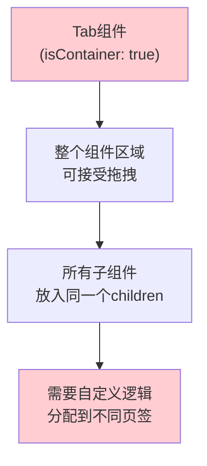
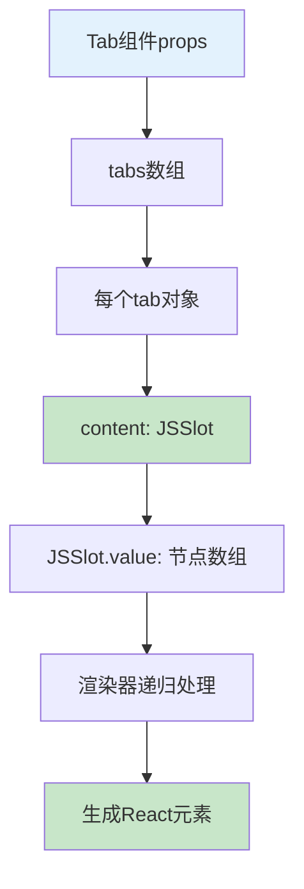
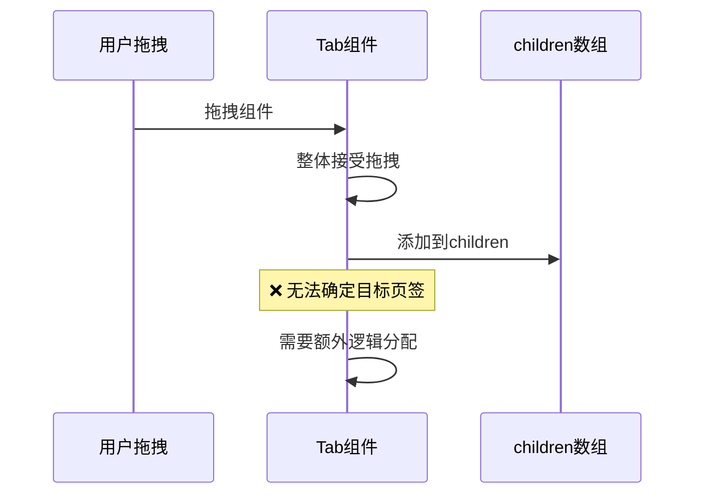
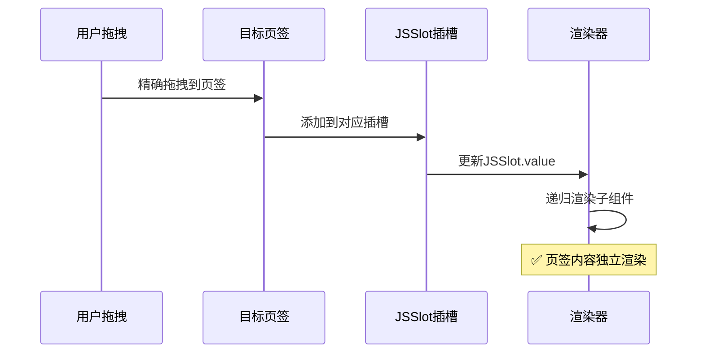

# Tab组件容器方案对比分析

## 🎯 问题背景

用户询问Tab组件的两种容器实现方案：
1. **方案一**: 设置 `isContainer: true`
2. **方案二**: 使用 `JSSlot` 定义插槽

Tab组件的特点是有多个页签，每个页签下都可以拖入组件，需要选择合适的容器实现方式。

## 📋 方案对比总览

| 对比维度 | isContainer: true | JSSlot插槽方案 |
|---------|-------------------|----------------|
| **适用场景** | 单一容器区域 | 多个独立插槽 |
| **拖拽体验** | 整体容器接受 | 精确插槽定位 |
| **配置复杂度** | 简单 | 中等 |
| **灵活性** | 较低 | 很高 |
| **推荐度** | ❌ 不推荐 | ✅ 强烈推荐 |

## 🔧 方案一：isContainer: true 分析

### **实现方式**
```typescript
// Tab组件配置
{
  componentName: 'Tab',
  configure: {
    component: {
      isContainer: true,  // 整个组件标记为容器
    },
    props: [
      {
        name: 'tabs',
        setter: 'ArraySetter', // 页签配置
      }
    ]
  }
}
```

### **工作机制**


### **存在的问题**

#### **1️⃣ 拖拽定位不精确**
```typescript
// 问题：无法区分要拖到哪个页签
<Tab isContainer={true}>
  {/* 所有拖入的组件都在这里，无法自动分配到正确的页签 */}
  <Component1 />  {/* 应该在页签1？页签2？ */}
  <Component2 />  {/* 用户拖拽时无法精确指定 */}
</Tab>
```

#### **2️⃣ 页签切换逻辑复杂**
```typescript
// 需要复杂的逻辑来管理哪个组件属于哪个页签
const TabComponent = ({ children, tabs }) => {
  // ❌ 需要额外逻辑分配children到不同页签
  const distributeChildrenToTabs = () => {
    // 复杂的分配逻辑...
  };

  return (
    <Tabs>
      {tabs.map(tab => (
        <TabPane key={tab.key}>
          {/* 如何知道哪些children属于这个页签？ */}
        </TabPane>
      ))}
    </Tabs>
  );
};
```

#### **3️⃣ 用户体验差**
- **拖拽时无法明确目标页签**
- **占位符显示在整个Tab区域**
- **无法为不同页签提供不同的提示信息**

### **适用场景**
- ❌ **多页签Tab组件不适用**
- ✅ **单一内容区域的简单容器适用**

## ✅ 方案二：JSSlot插槽方案分析

### **实现方式**
```typescript
// Tab组件配置 - 推荐方案
{
  componentName: 'Tab',
  configure: {
    component: {
      isContainer: false,  // 组件本身不是容器
    },
    props: [
      {
        name: 'tabs',
        title: '页签配置',
        setter: {
          componentName: 'ArraySetter',
          props: {
            itemSetter: {
              componentName: 'ObjectSetter',
              props: {
                config: {
                  items: [
                    {
                      name: 'key',
                      title: '页签标识',
                      setter: 'StringSetter'
                    },
                    {
                      name: 'title',
                      title: '页签标题',
                      setter: 'StringSetter'
                    },
                    {
                      name: 'content',
                      title: '页签内容',
                      setter: {
                        componentName: 'SlotSetter',
                        props: {
                          initialValue: {
                            type: 'JSSlot',
                            value: []  // 每个页签独立的插槽
                          }
                        }
                      }
                    }
                  ]
                }
              }
            }
          }
        }
      }
    ]
  }
}
```

### **数据结构**
```typescript
// Tab组件的props数据结构
interface TabProps {
  tabs: Array<{
    key: string;
    title: string;
    content: {
      type: 'JSSlot';
      value: IPublicTypeNodeData[];  // 该页签的子组件数据
    };
  }>;
}

// 实际数据示例
const tabData = {
  tabs: [
    {
      key: 'tab1',
      title: '页签1',
      content: {
        type: 'JSSlot',
        value: [
          {
            componentName: 'Button',
            props: { text: '按钮1' }
          }
        ]
      }
    },
    {
      key: 'tab2',
      title: '页签2',
      content: {
        type: 'JSSlot',
        value: [
          {
            componentName: 'Input',
            props: { placeholder: '输入框' }
          }
        ]
      }
    }
  ]
};
```

### **组件实现**
```typescript
// Tab组件实现
const TabComponent = ({ tabs = [] }) => {
  const [activeKey, setActiveKey] = useState(tabs[0]?.key);

  return (
    <Tabs activeKey={activeKey} onChange={setActiveKey}>
      {tabs.map(tab => (
        <TabPane
          key={tab.key}
          tab={tab.title}
        >
          {/* ✅ 直接渲染JSSlot的内容 */}
          {tab.content}
        </TabPane>
      ))}
    </Tabs>
  );
};
```

### **渲染机制**


### **JSSlot渲染逻辑**
```typescript
// packages/renderer-core/src/renderer/base.tsx
// 渲染器中的JSSlot处理
if (isJSSlot(schema)) {
  // ✅ 直接递归渲染JSSlot的value
  return this.__createVirtualDom(schema.value, scope, parentInfo);
}

// 对于Tab组件：
// 1. tab.content 是 JSSlot 类型
// 2. 渲染器会递归处理 JSSlot.value 中的所有子组件
// 3. 每个页签的内容独立渲染
```

### **优势分析**

#### **1️⃣ 精确的拖拽定位**
```typescript
// ✅ 每个页签有独立的拖拽区域
<Tabs>
  <TabPane tab="页签1">
    {/* 拖拽到这里的组件明确属于页签1 */}
    <div className="lc-container-placeholder">
      拖拽组件到页签1
    </div>
  </TabPane>
  <TabPane tab="页签2">
    {/* 拖拽到这里的组件明确属于页签2 */}
    <div className="lc-container-placeholder">
      拖拽组件到页签2
    </div>
  </TabPane>
</Tabs>
```

#### **2️⃣ 独立的占位符**
- 每个空页签显示独立的占位符
- 可以为不同页签定制不同的提示文案
- 拖拽体验更直观

#### **3️⃣ 数据结构清晰**
```json
{
  "tabs": [
    {
      "key": "tab1",
      "title": "页签1",
      "content": {
        "type": "JSSlot",
        "value": [
          // 页签1的所有子组件
        ]
      }
    }
  ]
}
```

#### **4️⃣ 支持高级特性**
```typescript
// 支持带参数的插槽
{
  name: 'content',
  setter: {
    componentName: 'SlotSetter',
    props: {
      initialValue: {
        type: 'JSSlot',
        params: ['tabData', 'index'],  // 页签数据和索引
        value: []
      }
    }
  }
}
```

## 🔄 渲染流程对比

### **isContainer方案渲染流程**


### **JSSlot方案渲染流程**


## 📊 设计器体验对比

### **isContainer方案的设计器体验**
```typescript
// ❌ 用户困惑的交互
┌─────────────────────────┐
│ Tab1 │ Tab2 │ Tab3       │
├─────────────────────────┤
│                         │
│  整个区域都是拖拽目标     │
│  用户不知道拖到哪个页签   │
│                         │
│  [拖拽组件到这里]        │
│                         │
└─────────────────────────┘
```

### **JSSlot方案的设计器体验**
```typescript
// ✅ 清晰的交互界面
┌─────────────────────────┐
│ Tab1 │ Tab2 │ Tab3       │
├─────────────────────────┤
│ [当前显示Tab1内容]       │
│                         │
│ [拖拽组件到Tab1]        │
│                         │
│ 切换页签查看其他内容     │
│                         │
└─────────────────────────┘
```

## 🛠️ 实际配置示例

### **完整的Tab组件配置**
```typescript
export const TabComponentMeta = {
  componentName: 'Tab',
  title: '选项卡',
  icon: 'tab',
  group: '布局组件',
  category: '容器',

  configure: {
    // ✅ 组件本身不是容器
    component: {
      isContainer: false,
    },

    props: [
      // 基础配置
      {
        name: 'type',
        title: '页签类型',
        setter: {
          componentName: 'SelectSetter',
          props: {
            options: [
              { label: '线条型', value: 'line' },
              { label: '卡片型', value: 'card' }
            ]
          }
        },
        defaultValue: 'line'
      },

      // 页签配置
      {
        name: 'tabs',
        title: '页签配置',
        setter: {
          componentName: 'ArraySetter',
          props: {
            itemSetter: {
              componentName: 'ObjectSetter',
              props: {
                config: {
                  items: [
                    {
                      name: 'key',
                      title: '页签标识',
                      setter: 'StringSetter',
                      isRequired: true
                    },
                    {
                      name: 'title',
                      title: '页签标题',
                      setter: 'StringSetter',
                      isRequired: true
                    },
                    {
                      name: 'icon',
                      title: '页签图标',
                      setter: 'IconSetter'
                    },
                    {
                      name: 'disabled',
                      title: '是否禁用',
                      setter: 'BoolSetter'
                    },
                    {
                      name: 'content',
                      title: '页签内容',
                      setter: {
                        componentName: 'SlotSetter',
                        props: {
                          initialValue: {
                            type: 'JSSlot',
                            value: []
                          }
                        }
                      }
                    }
                  ]
                }
              }
            }
          }
        },
        // 默认配置两个页签
        defaultValue: [
          {
            key: 'tab1',
            title: '页签1',
            content: {
              type: 'JSSlot',
              value: []
            }
          },
          {
            key: 'tab2',
            title: '页签2',
            content: {
              type: 'JSSlot',
              value: []
            }
          }
        ]
      }
    ]
  }
};
```

### **组件渲染实现**
```typescript
import { Tabs } from 'antd';
const { TabPane } = Tabs;

const TabComponent = ({ tabs = [], type = 'line', ...otherProps }) => {
  return (
    <Tabs type={type} {...otherProps}>
      {tabs.map(tab => (
        <TabPane
          key={tab.key}
          tab={
            <span>
              {tab.icon && <Icon type={tab.icon} />}
              {tab.title}
            </span>
          }
          disabled={tab.disabled}
        >
          {/* ✅ JSSlot会被渲染器自动处理 */}
          {tab.content}
        </TabPane>
      ))}
    </Tabs>
  );
};

export default TabComponent;
```

## 🎯 最佳实践建议

### **✅ 推荐使用JSSlot方案的原因**

#### **1. 用户体验更好**
- 拖拽目标明确，不会产生歧义
- 每个页签独立编辑，符合用户心理模型
- 支持页签间的独立操作（复制、粘贴、清空）

#### **2. 技术实现更清晰**
- 数据结构清晰，便于理解和维护
- 渲染逻辑简单，减少出错概率
- 支持更多高级特性（带参数插槽、条件渲染等）

#### **3. 扩展性更强**
- 易于添加新的页签类型
- 支持页签的动态增删
- 可以为不同页签定制不同的编辑行为

### **⚠️ 使用注意事项**

#### **1. 初始数据结构**
```typescript
// 确保初始化时有正确的数据结构
const defaultTabs = [
  {
    key: 'default',
    title: '默认页签',
    content: {
      type: 'JSSlot',
      value: []  // 空数组，不是undefined
    }
  }
];
```

#### **2. 页签动态操作**
```typescript
// 添加页签时需要包含完整的JSSlot结构
const addTab = () => {
  const newTab = {
    key: `tab_${Date.now()}`,
    title: '新页签',
    content: {
      type: 'JSSlot',
      value: []
    }
  };
  setTabs([...tabs, newTab]);
};
```

#### **3. 数据验证**
```typescript
// 确保JSSlot结构的完整性
const validateTabData = (tabs) => {
  return tabs.map(tab => ({
    ...tab,
    content: tab.content?.type === 'JSSlot' ? tab.content : {
      type: 'JSSlot',
      value: []
    }
  }));
};
```

## 🎯 总结

### **核心结论**

对于Tab组件这种**多页签容器**场景：

#### **❌ 不推荐 isContainer: true**
- 拖拽定位不精确
- 用户体验混乱
- 实现逻辑复杂
- 扩展性差

#### **✅ 强烈推荐 JSSlot方案**
- 每个页签独立的插槽
- 拖拽体验清晰直观
- 数据结构规范
- 支持高级特性
- 易于维护和扩展

### **适用场景总结**

| 组件类型 | 推荐方案 | 原因 |
|---------|----------|------|
| **简单容器** (Div, Card) | `isContainer: true` | 单一内容区域 |
| **复杂容器** (Tab, Accordion) | `JSSlot插槽` | 多个独立内容区域 |
| **表单容器** (Form, FormItem) | `JSSlot插槽` | 需要精确控制字段位置 |
| **布局容器** (Grid, Layout) | `JSSlot插槽` | 多个布局区域 |

**JSSlot方案是Tab组件的最佳选择，能够提供最好的用户体验和技术实现。**
