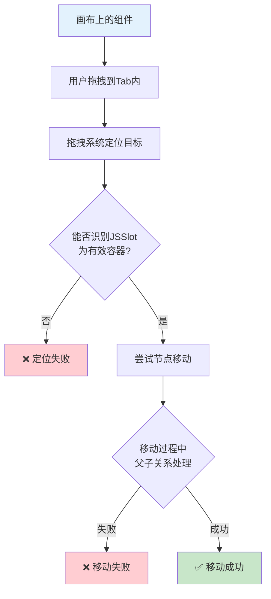

# JSSlot拖拽问题分析与解决方案

## 🎯 问题描述

用户使用JSSlot方案实现Tab组件后：
- ✅ **从组件库拖入画布和Tab内**：完全正常
- ❌ **画布上已存在的组件拖入Tab内**：出现问题

这是一个典型的JSSlot拖拽兼容性问题。

## 🔍 问题根本原因分析

### **1. JSSlot的特殊性质**

#### **JSSlot不是真正的容器节点**
```typescript
// JSSlot的本质
interface JSSlotStructure {
  type: 'JSSlot';
  value: IPublicTypeNodeData[];  // 只是属性值，不是Node
  params?: string[];
  title?: string;
}

// 与真正的容器节点的区别
interface ContainerNode {
  isContainer: true;           // 真正的容器标识
  children: INodeChildren;     // 真正的子节点集合
  isParental(): boolean;       // 容器能力检查
}
```

#### **渲染时的转换机制**
```typescript
// packages/designer/src/document/node/props/prop.ts
setAsSlot(data: IPublicTypeJSSlot) {
  // JSSlot会被转换为内部的Slot节点
  const slotSchema = {
    componentName: 'Slot',
    title: data.title,
    children: data.value,  // JSSlot.value变成Slot的children
  };

  this._slotNode = owner.document?.createNode<ISlotNode>(slotSchema);
}
```

### **2. 拖拽系统的容器识别机制**

#### **容器查找逻辑**
```typescript
// packages/designer/src/builtin-simulator/host.ts - getDropContainer
getDropContainer(e: ILocateEvent): DropContainer | null {
  const { target } = e;

  // 1. 从DOM元素查找对应的节点
  const ref = this.getNodeInstanceFromElement(target);
  let container = ref?.node;

  // 2. 检查是否为容器节点
  if (!container?.isParental()) {
    container = container?.parent || currentRoot;  // ❌ 向上查找
  }

  // 3. 验证容器能力
  const meta = container.componentMeta;
  if (!meta.isContainer && !this.isAcceptable(container)) {
    return false;  // ❌ JSSlot属性区域可能无法通过验证
  }
}
```

#### **关键问题点**
- **DOM到节点映射**：JSSlot渲染的DOM区域可能无法正确映射到对应的Slot节点
- **容器能力验证**：拖拽系统可能无法识别JSSlot属性区域为有效容器
- **父子关系定位**：向上查找容器时可能跳过了JSSlot的Slot节点

### **3. 新建vs移动的处理差异**

#### **从组件库拖入（新建）**
```typescript
// packages/designer/src/designer/designer.ts - onDragend
if (isDragNodeDataObject(dragObject)) {
  // ✅ 新建组件：直接创建NodeData并插入
  const nodeData = Array.isArray(dragObject.data) ? dragObject.data : [dragObject.data];
  nodes = insertChildren(loc.target, nodeData, loc.detail.index);
}
```

#### **画布组件移动（已存在）**
```typescript
if (isDragNodeObject(dragObject)) {
  // ❌ 移动已存在组件：需要复杂的父子关系变更
  nodes = insertChildren(loc.target, [...dragObject.nodes], loc.detail.index, copy);
}
```

#### **Slot节点的特殊处理**
```typescript
// packages/designer/src/designer/dragon.ts - boost方法
const forceCopyState =
  isDragNodeObject(dragObject) &&
  dragObject.nodes.some(node => node.isSlot());

// ⚠️ 包含Slot节点时强制复制而非移动
```

### **4. 具体失败原因**

#### **场景分析**


## 🛠️ 解决方案

### **方案一：增强JSSlot的容器识别 [推荐]**

#### **1. 优化组件配置**
```typescript
{
  componentName: 'Tab',
  configure: {
    component: {
      // ✅ 组件本身也标记为容器，作为兜底
      isContainer: true,
    },

    // ✅ 增加拖拽钩子处理
    advanced: {
      callbacks: {
        // 自定义投放容器查找逻辑
        canDropIn: (target, dragObject, dropLocation) => {
          // 检查是否拖拽到JSSlot区域
          const tabPaneElement = target.closest('[role="tabpanel"]');
          if (tabPaneElement) {
            return true;  // 允许投放到Tab页签内容区域
          }
          return false;
        },

        // 自定义节点插入逻辑
        onChildAdd: (node, target, index) => {
          // 当节点添加到Tab时的特殊处理
          console.log('Node added to Tab:', node, target, index);
        }
      }
    },

    props: [
      {
        name: 'list',
        setter: {
          componentName: 'ArraySetter',
          props: {
            itemSetter: {
              componentName: 'ObjectSetter',
              props: {
                config: {
                  items: [
                    {
                      name: 'label',
                      setter: 'StringSetter',
                    },
                    {
                      name: 'children',
                      title: '页签内容',
                      setter: {
                        componentName: 'SlotSetter',
                        props: {
                          // ✅ 增强SlotSetter配置
                          initialValue: {
                            type: 'JSSlot',
                            value: []
                          },
                          // 提供更好的拖拽提示
                          slotTitle: '拖拽组件到此页签',
                          // 支持拖拽时的自动定位
                          supportVariableGlobally: true
                        }
                      }
                    }
                  ]
                }
              }
            }
          }
        }
      }
    ]
  }
}
```

#### **2. 增强渲染时的DOM标识**
```typescript
// Tab组件渲染实现
const TabComponent = ({ list = [] }) => {
  return (
    <Tabs>
      {list.map((item, index) => (
        <TabPane
          key={item.key || index}
          tab={item.label}
          // ✅ 增加数据属性，帮助拖拽系统识别
          data-slot-container="true"
          data-slot-index={index}
          role="tabpanel"
        >
          <div
            className="tab-content-slot"
            // ✅ 重要：标识这是一个JSSlot容器区域
            data-jsslot-container="true"
            data-tab-index={index}
            style={{
              minHeight: '100px',  // 确保有足够的拖拽区域
              position: 'relative'
            }}
          >
            {/* JSSlot内容会被渲染器自动处理 */}
            {item.children}
          </div>
        </TabPane>
      ))}
    </Tabs>
  );
};
```

### **方案二：自定义拖拽处理器 [高级]**

#### **1. 实现自定义Sensor**
```typescript
// 创建专门处理JSSlot的拖拽传感器
class JSSlotDragSensor implements IPublicModelSensor {

  locate(e: ILocateEvent): IPublicModelDropLocation | null {
    const { target, dragObject } = e;

    // 检查目标是否为JSSlot容器
    const slotContainer = target.closest('[data-jsslot-container="true"]');
    if (!slotContainer) {
      return null;  // 不是JSSlot区域，交给其他传感器处理
    }

    // 获取Tab索引
    const tabIndex = slotContainer.getAttribute('data-tab-index');
    const tabComponent = this.findTabComponent(slotContainer);

    if (!tabComponent) {
      return null;
    }

    // 创建特殊的位置对象，指向JSSlot
    return {
      target: tabComponent,
      detail: {
        type: IPublicTypeLocationDetailType.Children,
        // 指定要插入到哪个JSSlot
        slotName: 'children',
        slotIndex: parseInt(tabIndex),
        index: 0,  // 插入到JSSlot的开头
        valid: true
      },
      source: 'JSSlotSensor',
      event: e
    };
  }

  private findTabComponent(element: Element): INode | null {
    // 向上查找Tab组件节点
    // 实现逻辑...
  }
}

// 注册自定义传感器
designer.dragon.addSensor(new JSSlotDragSensor());
```

#### **2. 重写插入逻辑**
```typescript
// 重写insertChildren以支持JSSlot
function insertChildrenToJSSlot(
  tabNode: INode,
  children: any[],
  slotIndex: number,
  insertIndex: number = 0
): INode[] | null {

  // 获取tabs属性
  const tabsProp = tabNode.getProp('list');
  const tabsValue = tabsProp.getValue();

  if (!Array.isArray(tabsValue) || !tabsValue[slotIndex]) {
    return null;
  }

  // 获取目标页签的JSSlot
  const targetTab = tabsValue[slotIndex];
  const jsSlot = targetTab.children;

  if (!jsSlot || jsSlot.type !== 'JSSlot') {
    return null;
  }

  // 创建新的节点数据
  const newNodeData = Array.isArray(children) ? children : [children];

  // 更新JSSlot的value
  const updatedValue = [...(jsSlot.value || [])];
  updatedValue.splice(insertIndex, 0, ...newNodeData);

  // 更新页签数据
  const updatedTabs = [...tabsValue];
  updatedTabs[slotIndex] = {
    ...targetTab,
    children: {
      ...jsSlot,
      value: updatedValue
    }
  };

  // 更新组件属性
  tabsProp.setValue(updatedTabs);

  return newNodeData.map(data =>
    tabNode.document?.createNode(data)
  ).filter(Boolean);
}
```

### **方案三：混合方案 [推荐实用]**

#### **结合isContainer和JSSlot的优势**
```typescript
{
  componentName: 'Tab',
  configure: {
    component: {
      // ✅ 同时支持整体容器和JSSlot
      isContainer: true,
    },

    advanced: {
      callbacks: {
        // 拖拽时的智能路由
        canDropIn: (target, dragObject) => {
          // 检查是否拖拽到特定页签
          const tabPane = target.closest('[role="tabpanel"]');
          if (tabPane) {
            // 允许拖拽到页签内容区域
            return true;
          }

          // 检查是否拖拽到页签标题区域
          const tabNav = target.closest('.ant-tabs-nav');
          if (tabNav) {
            // 允许拖拽到页签导航区域（会添加到当前活跃页签）
            return true;
          }

          return true;  // 其他区域也允许（会有智能分配逻辑）
        },

        // 智能插入逻辑
        onChildAdd: (childNode, targetContainer, detail) => {
          const tabComponent = targetContainer;
          const listProp = tabComponent.getProp('list');
          const tabs = listProp.getValue() || [];

          // 获取当前活跃页签索引
          const activeIndex = tabComponent.getProp('activeKey')?.getValue() || 0;

          // 如果拖拽到特定页签内容区域，插入到对应JSSlot
          const tabPane = detail.event?.target?.closest('[role="tabpanel"]');
          if (tabPane) {
            const tabIndex = parseInt(tabPane.getAttribute('data-tab-index') || '0');
            insertToJSSlot(tabs, tabIndex, childNode);
          } else {
            // 否则插入到当前活跃页签
            insertToJSSlot(tabs, activeIndex, childNode);
          }

          listProp.setValue([...tabs]);

          // 阻止默认的children插入逻辑
          return false;
        }
      }
    }
  }
}

function insertToJSSlot(tabs: any[], tabIndex: number, nodeData: any) {
  if (!tabs[tabIndex]) {
    return;
  }

  const targetTab = tabs[tabIndex];
  const jsSlot = targetTab.children || { type: 'JSSlot', value: [] };

  jsSlot.value = jsSlot.value || [];
  jsSlot.value.push(nodeData);

  targetTab.children = jsSlot;
}
```

## 🎯 最终推荐方案

### **实用解决方案 [立即可用]**

#### **1. 修改组件配置**
```typescript
{
  title: '标签项',
  name: 'list',
  setter: {
    componentName: 'ArraySetter',
    props: {
      itemSetter: {
        componentName: 'ObjectSetter',
        props: {
          config: {
            items: [
              {
                title: '展示文案',
                name: 'label',
                setter: 'StringSetter',
                initialValue: '展示文案',
                isRequired: true,
              },
              {
                title: '联动设置',
                name: 'linkageSettings',
                setter: 'SelectComponentSetter',
                isRequired: true,
              },
              {
                title: '页签内容',
                name: 'children',
                setter: {
                  componentName: 'SlotSetter',
                  props: {
                    // ✅ 关键配置
                    initialValue: {
                      type: 'JSSlot',
                      value: []
                    },
                    // ✅ 增强拖拽体验
                    slotTitle: '拖拽组件到此页签',
                    slotStyle: {
                      minHeight: '120px',  // 确保有足够拖拽区域
                      border: '2px dashed #d9d9d9',
                      borderRadius: '6px',
                      padding: '16px'
                    }
                  }
                }
              }
            ]
          }
        },
        initialValue: () => {
          const key = uuid();
          return {
            label: '标签项',
            key,
            // ✅ 确保正确的JSSlot结构
            children: {
              type: 'JSSlot',
              value: [],
            },
            linkageSettings: [],
          };
        },
      },
    },
  },
},

// ✅ 重要：同时启用组件容器能力
component: {
  isContainer: true,  // 启用容器能力作为兜底
}
```

#### **2. 优化组件渲染**
```typescript
const TabComponent = ({ list = [], activeKey, ...props }) => {
  return (
    <Tabs activeKey={activeKey} {...props}>
      {list.map((item, index) => (
        <TabPane
          key={item.key || index}
          tab={item.label}
          // ✅ 增加识别标识
          data-tab-index={index}
        >
          <div
            className="lc-tab-slot-container"
            // ✅ 关键：帮助拖拽系统识别
            data-lcnode-id={`tab-slot-${index}`}
            style={{
              minHeight: '100px',
              position: 'relative',
              padding: '8px'
            }}
          >
            {/* JSSlot内容渲染 */}
            {item.children}
          </div>
        </TabPane>
      ))}
    </Tabs>
  );
};
```

#### **3. 添加CSS样式支持**
```scss
// 增强拖拽体验的样式
.lc-tab-slot-container {
  &:empty::before {
    content: '拖拽组件到此页签';
    display: block;
    text-align: center;
    color: #999;
    font-size: 14px;
    padding: 40px 20px;
    border: 2px dashed #d9d9d9;
    border-radius: 6px;
    background: #fafafa;
  }

  // 拖拽悬停状态
  &.lc-drop-hover {
    border: 2px dashed #1890ff;
    background: #f0f9ff;
  }
}
```

## 📊 方案效果对比

| 方案 | 实现难度 | 兼容性 | 用户体验 | 维护成本 |
|------|----------|--------|----------|----------|
| **方案一：增强配置** | ⭐⭐ | ⭐⭐⭐⭐ | ⭐⭐⭐ | ⭐⭐⭐ |
| **方案二：自定义Sensor** | ⭐⭐⭐⭐⭐ | ⭐⭐⭐ | ⭐⭐⭐⭐⭐ | ⭐⭐ |
| **方案三：混合方案** | ⭐⭐⭐ | ⭐⭐⭐⭐⭐ | ⭐⭐⭐⭐ | ⭐⭐⭐⭐ |

## ⚠️ 注意事项

### **1. 数据结构一致性**
```typescript
// 确保每个页签都有正确的JSSlot结构
const validateTabData = (tabs) => {
  return tabs.map(tab => ({
    ...tab,
    children: tab.children?.type === 'JSSlot' ? tab.children : {
      type: 'JSSlot',
      value: []
    }
  }));
};
```

### **2. 调试技巧**
```typescript
// 在组件中添加调试信息
console.log('Tab拖拽调试:', {
  dragObject,
  targetElement: e.target,
  isJSSlotArea: e.target.closest('[data-jsslot-container]'),
  tabIndex: e.target.closest('[data-tab-index]')?.getAttribute('data-tab-index')
});
```

### **3. 兼容性处理**
- 确保与现有拖拽逻辑兼容
- 测试不同拖拽来源（组件库、画布、大纲树）
- 验证复制粘贴等其他操作的正常工作

**通过以上方案，可以有效解决JSSlot方案中画布组件拖入Tab内的问题，同时保持良好的用户体验和系统稳定性。**
