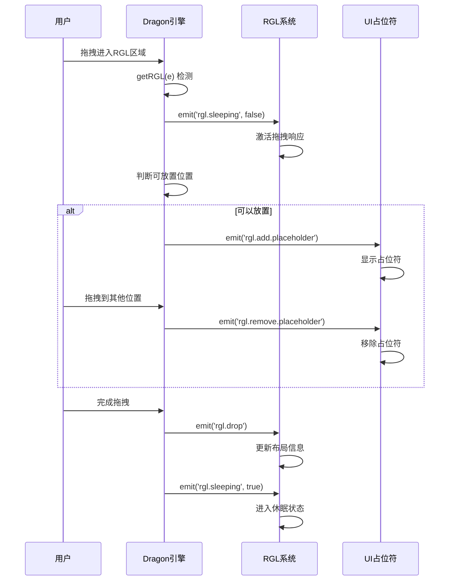

# RGL系统深度分析

## 🎯 概述

RGL（React Grid Layout）是低代码引擎中的**自实现网格布局系统**，用于支持可拖拽调整的网格布局容器。当Dragon拖拽引擎发送`'rgl.sleeping', false`事件时，会激活RGL系统的拖拽响应机制。

## 📋 RGL系统核心概念

### **什么是RGL**
```typescript
// packages/designer/src/document/node/node.ts:1222-1237
getRGL(): {
  isContainerNode: boolean;    // 是否为容器节点
  isEmptyNode: boolean;        // 是否为空节点
  isRGLContainerNode: boolean; // 是否为RGL容器节点
  isRGLNode: boolean;          // 是否为RGL子节点
  isRGL: boolean;              // 综合判断是否在RGL环境中
  rglNode: Node | null;        // RGL容器节点引用
}
```

### **RGL判断逻辑**
```typescript
const isContainerNode = this.isContainer();
const isEmptyNode = this.isEmpty();
const isRGLContainerNode = this.isRGLContainer;
const isRGLNode = (this.getParent()?.isRGLContainer) as boolean;

// 关键逻辑：
const isRGL = isRGLContainerNode || (isRGLNode && (!isContainerNode || !isEmptyNode));
let rglNode = isRGLContainerNode ? this : isRGL ? this?.getParent() : null;
```

#### **判断条件**
- **RGL容器自身** → `isRGL = true`
- **RGL容器的子节点 + (不是容器 或 不为空)** → `isRGL = true`
- **其他情况** → `isRGL = false`

## 🔧 RGL系统的作用

### **1. 网格布局管理**
RGL系统提供了**自实现的响应式网格布局**，支持：
- 拖拽调整组件位置
- 自动对齐和吸附
- 响应式布局适配
- 冲突检测和避让

### **2. 布局组件标识**
标记组件是否支持网格布局功能：
```typescript
// 设置组件为RGL容器
node.isRGLContainer = true;

// 配置布局信息
node.fieldId = 'unique_container_id';
node.layout = [
  {
    i: 'child_fieldId',    // 子组件标识
    x: 0, y: 0,           // 网格位置
    w: 2, h: 2            // 网格大小
  }
];
```

### **3. 特殊交互行为**
RGL组件有独特的交互模式：
- **禁用多选**：网格布局不支持多组件选择
- **原生拖拽**：使用HTML5原生拖拽API
- **调整手柄**：支持拖拽调整大小（`.react-resizable-handle`）

## 💥 `rgl.sleeping` 事件的影响

### **激活RGL系统**
```typescript
// packages/designer/src/designer/dragon.ts:305
this.emitter.emit('rgl.sleeping', false);
```

#### **效果和影响**
1. **唤醒拖拽响应**：激活RGL系统对拖拽事件的响应
2. **启用占位符**：开始显示拖拽占位符
3. **激活布局计算**：开始实时计算拖拽位置和布局影响
4. **启用碰撞检测**：检测拖拽组件与现有组件的位置冲突

### **休眠RGL系统**
```typescript
// packages/designer/src/designer/dragon.ts:334
this.emitter.emit('rgl.sleeping', true);
```

#### **效果和影响**
1. **停止响应**：RGL系统停止响应拖拽事件
2. **清除占位符**：移除所有显示的占位符
3. **暂停计算**：停止布局计算，节省性能
4. **清理状态**：清除RGL相关的临时状态

## 🎯 RGL系统的使用场景

### **适用组件类型**
- **仪表板布局**：支持拖拽调整的仪表板组件
- **网格容器**：Grid、Layout等布局组件
- **响应式面板**：需要动态调整大小和位置的面板

### **设置方法**
```typescript
// 方式一：Schema配置
{
  componentName: 'GridContainer',
  props: {
    // 其他属性
  },
  isRGLContainer: true,
  fieldId: 'grid_container_1',
  layout: [
    {
      i: 'widget_1',
      x: 0, y: 0,
      w: 2, h: 2,
      minW: 1, minH: 1
    }
  ]
}

// 方式二：运行时设置
const node = document.getNode('node_id');
node.isRGLContainer = true;
node.fieldId = 'unique_id';
node.layout = [...];
```

## 📡 RGL事件系统

### **事件列表**
| 事件名称 | 触发时机 | 携带数据 | 作用 |
|---------|----------|----------|------|
| `rgl.sleeping` | 进入/退出RGL区域 | `boolean` | 控制RGL系统激活状态 |
| `rgl.switch` | RGL拖拽开始/结束 | `{action, rglNode}` | 控制RGL拖拽流程 |
| `rgl.add.placeholder` | 可放置位置 | `{rglNode, node, event}` | 显示拖拽占位符 |
| `rgl.remove.placeholder` | 离开RGL区域 | 无 | 移除拖拽占位符 |
| `rgl.drop` | RGL组件放置 | `{rglNode, node}` | 完成RGL布局更新 |

### **事件监听者**
```typescript
// RGL系统的事件监听通常在以下位置：
// 1. RGL布局管理器（内部实现）
// 2. 占位符渲染组件
// 3. 布局计算引擎
// 4. 调试和性能监控工具
```

## 🔄 RGL拖拽流程

### **完整流程图**


## 🏗️ RGL实现细节

### **核心文件位置**
| 文件 | 作用 | 关键功能 |
|------|------|----------|
| `packages/designer/src/document/node/node.ts` | RGL判断逻辑 | `getRGL()`, `isRGLContainer` |
| `packages/designer/src/designer/dragon.ts` | 拖拽流程控制 | `getRGL()`, RGL事件发送 |
| `packages/designer/src/builtin-simulator/host.ts` | 交互事件处理 | `rgl.switch` 事件发送 |

### **状态管理机制**
```typescript
// RGL状态标识符
interface RGLState {
  isRGLContainerNode: boolean;  // 节点本身是RGL容器
  isRGLNode: boolean;           // 节点在RGL容器内
  isRGL: boolean;               // 综合RGL状态
  rglNode: Node | null;         // RGL容器节点引用
}

// 拖拽时的RGL处理
if (isRGL) {
  // 1. 禁用pointer-events，防止拖拽元素阻断
  nodeInst.style.pointerEvents = 'none';

  // 2. 激活RGL系统
  this.emitter.emit('rgl.sleeping', false);

  // 3. 检测可放置位置，显示占位符
  if (this._canDrop) {
    this.emitter.emit('rgl.add.placeholder', {...});
  }
}
```

## ⚡ 性能优化策略

### **1. 状态缓存**
- 缓存RGL状态检测结果
- 避免重复的DOM查询
- 复用节点关系计算

### **2. 事件防抖**
- 限制RGL事件的触发频率
- 合并连续的占位符更新
- 延迟布局重计算

### **3. 渲染优化**
- 只在RGL区域显示特殊UI
- 懒加载复杂的布局计算
- 使用虚拟占位符减少DOM操作

## 🎭 与普通拖拽的差异

### **拖拽模式对比**
| 特性 | 普通组件拖拽 | RGL组件拖拽 |
|------|-------------|------------|
| **拖拽API** | 鼠标模拟 | HTML5原生 |
| **多选支持** | ✅ 支持 | ❌ 禁用 |
| **占位符** | 插入线 | 网格占位块 |
| **位置计算** | 线性插入 | 网格对齐 |
| **碰撞检测** | 简单边界 | 复杂网格 |
| **调整手柄** | 无 | ✅ 支持 |

### **事件处理差异**
```typescript
// 普通拖拽
setupDragAndClick() {
  if (isRGLNode) {
    // RGL特殊处理
    designer.dragon.emitter.emit('rgl.switch', { action: 'start' });
  } else {
    // 普通拖拽处理
    downEvent.stopPropagation();
    downEvent.preventDefault();
  }
}
```

## 🛠️ 使用示例

### **创建RGL容器组件**
```typescript
// 组件元数据配置
const GridContainerMeta = {
  componentName: 'GridContainer',
  configure: {
    component: {
      isContainer: true,
    },
    props: [
      {
        name: 'layout',
        title: '布局配置',
        setter: 'JsonSetter'
      },
      {
        name: 'cols',
        title: '列数',
        setter: 'NumberSetter',
        defaultValue: 12
      }
    ],
    advanced: {
      // 启用RGL功能的回调
      callbacks: {
        onInit: (node) => {
          node.isRGLContainer = true;
          node.fieldId = `grid_${Date.now()}`;
        }
      }
    }
  }
};

// 组件实现
const GridContainer = ({ layout, cols, children }) => {
  return (
    <div
      className="rgl-container"
      data-rgl-container="true"
      data-cols={cols}
    >
      {/* 网格布局渲染逻辑 */}
      <ResponsiveGridLayout
        layout={layout}
        cols={cols}
        onLayoutChange={(newLayout) => {
          // 同步布局变化到设计器
        }}
      >
        {children}
      </ResponsiveGridLayout>
    </div>
  );
};
```

## 🎯 总结

### **RGL系统的核心价值**
1. **增强交互体验**：提供专业的网格布局编辑能力
2. **精确位置控制**：支持像素级的位置和大小调整
3. **智能布局计算**：自动处理组件间的布局冲突
4. **响应式支持**：适配不同设备尺寸的布局需求

### **使用场景**
- **仪表板搭建**：BI报表、数据可视化面板
- **自由布局页面**：拖拽式页面设计器
- **组件库管理**：支持位置调整的组件展示
- **响应式设计**：多设备适配的布局系统

**RGL系统是低代码引擎实现高级布局功能的关键技术，通过事件驱动的方式实现了复杂的网格布局交互。**
