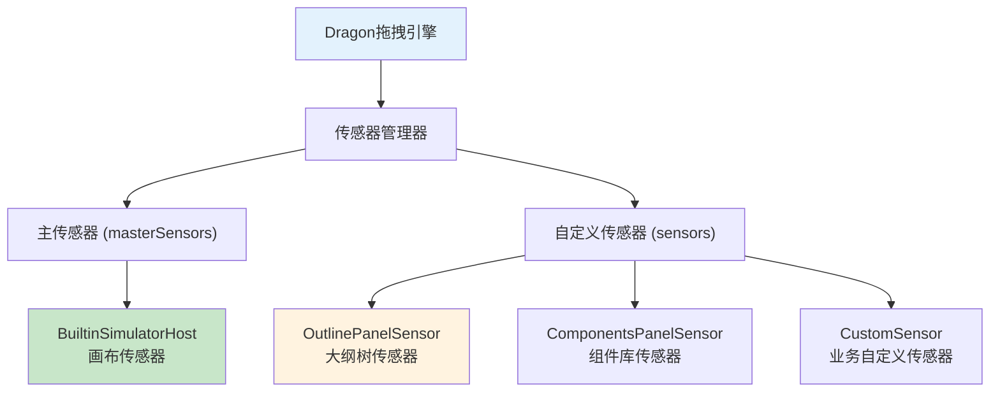
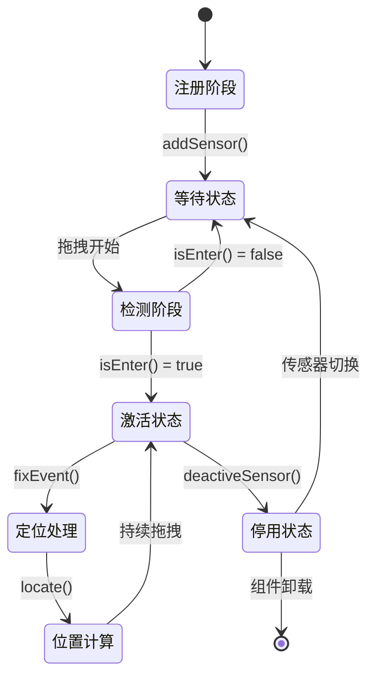
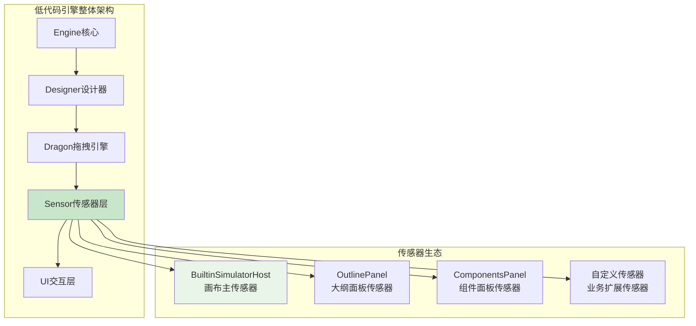
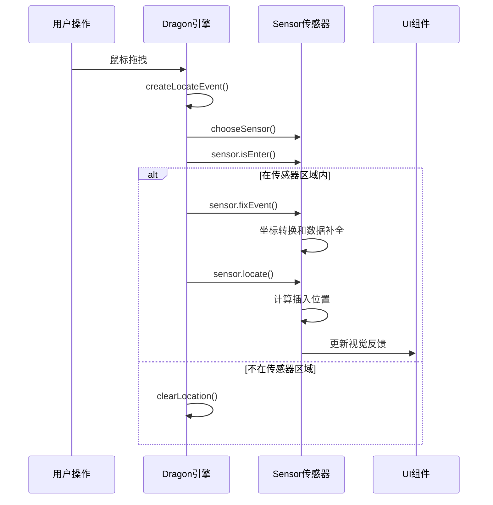

# Sensor传感器架构详解

## 🎯 什么是Sensor传感器

**Sensor（传感器）**是低代码引擎中的**拖拽感应器**，负责检测和处理特定区域内的拖拽事件。它是**Dragon拖拽引擎架构的核心组件**，为不同的UI区域提供专门的拖拽处理能力。

### **为什么叫"传感器"**
- **感应功能**：能够"感知"鼠标进入其管辖区域
- **响应机制**：对区域内的拖拽事件做出响应
- **区域划分**：每个传感器管理特定的UI区域
- **智能选择**：系统能智能选择最合适的传感器

## 📋 Sensor接口定义

### **IPublicModelSensor接口**
```typescript
// packages/types/src/shell/model/sensor.ts
export interface IPublicModelSensor<Node = IPublicModelNode> {
    /**
     * 传感器可用状态
     * 比如面板被隐藏时，可设置为 false
     */
    readonly sensorAvailable: boolean;

    /**
     * 事件修正方法
     * 对定位事件进行坐标转换和数据补全
     */
    fixEvent(e: IPublicModelLocateEvent): IPublicModelLocateEvent;

    /**
     * 核心定位方法
     * 在传感器区域内定位拖拽目标和插入位置
     */
    locate(e: IPublicModelLocateEvent): IPublicModelDropLocation | undefined | null;

    /**
     * 区域检测方法
     * 判断拖拽事件是否在传感器管辖区域内
     */
    isEnter(e: IPublicModelLocateEvent): boolean;

    /**
     * 停用传感器
     * 清理传感器状态，取消响应
     */
    deactiveSensor(): void;

    /**
     * 从DOM元素获取节点实例（可选）
     */
    getNodeInstanceFromElement?: (e: Element | null) => IPublicTypeNodeInstance<IPublicTypeComponentInstance, Node> | null;
}
```

## 🏗️ 传感器类型和架构

### **传感器分类体系**


### **传感器优先级策略**
```typescript
// packages/designer/src/designer/dragon.ts:568-606
const chooseSensor = (e: ILocateEvent) => {
    // 合并所有可用传感器
    const sensors: IPublicModelSensor[] = this.sensors.concat(masterSensors);

    // 选择策略（按优先级）：
    // 1️⃣ 事件已关联传感器 && 鼠标在其区域内
    // 2️⃣ 从所有传感器中找到可用且鼠标在其区域内的传感器
    let sensor = e.sensor && e.sensor.isEnter(e) ? e.sensor :
                 sensors.find(s => s.sensorAvailable && s.isEnter(e));

    if (!sensor) {
        // 3️⃣ 回退策略
        if (lastSensor) {
            sensor = lastSensor;           // 使用上一个传感器
        } else if (e.sensor) {
            sensor = e.sensor;             // 使用事件传感器
        } else if (sourceSensor) {
            sensor = sourceSensor;         // 使用来源传感器
        }
    }

    // 处理传感器切换
    if (sensor !== lastSensor) {
        lastSensor?.deactiveSensor();      // 停用旧传感器
        lastSensor = sensor;               // 更新活跃传感器
    }

    if (sensor) {
        e.sensor = sensor;                 // 关联传感器到事件
        sensor.fixEvent(e);                // 让传感器修正事件
    }

    this._activeSensor = sensor;           // 设置引擎活跃传感器
    return sensor;
};
```

## 🔧 主要传感器实现分析

### **1. BuiltinSimulatorHost - 画布传感器**

#### **实现位置**
`packages/designer/src/builtin-simulator/host.ts:258-2101`

#### **核心功能**
```typescript
export class BuiltinSimulatorHost implements ISimulatorHost<BuiltinSimulatorProps> {
    // 传感器可用性控制
    get sensorAvailable(): boolean {
        return this._sensorAvailable;
    }

    // 事件坐标修正
    fixEvent(e: ILocateEvent): ILocateEvent {
        // 1. 坐标转换：全局坐标 → 画布坐标
        const l = this.viewport.toLocalPoint({
            clientX: e.globalX,
            clientY: e.globalY,
        });
        e.canvasX = l.clientX;
        e.canvasY = l.clientY;

        // 2. 目标元素修正：在iframe内查找实际目标
        if (!isNaN(e.canvasX) && !isNaN(e.canvasY)) {
            e.target = this.contentDocument?.elementFromPoint(e.canvasX, e.canvasY);
        }

        e.fixed = true;
        return e;
    }

    // 区域检测
    isEnter(e: ILocateEvent): boolean {
        const rect = this.viewport.bounds;
        return (
            e.globalY >= rect.top &&
            e.globalY <= rect.bottom &&
            e.globalX >= rect.left &&
            e.globalX <= rect.right
        );
    }

    // 核心定位逻辑
    locate(e: ILocateEvent): any {
        // 复杂的定位算法：
        // 1. 权限检查
        // 2. 容器查找
        // 3. 位置计算
        // 4. 插入点确定

        return this.designer.createLocation(locationData);
    }
}
```

#### **管辖区域**
- **iframe画布**：设计器主要的组件编辑区域
- **坐标系统**：处理全局坐标到iframe内坐标的转换
- **DOM映射**：将DOM元素映射到设计器节点

### **2. OutlinePanelSensor - 大纲树传感器**

#### **实现位置**
`packages/plugin-outline-pane/src/controllers/pane-controller.ts:26-634`

#### **核心功能**
```typescript
export class PaneController implements IPublicModelSensor, ITreeBoard {
    // 传感器可用性
    get sensorAvailable() {
        return this._sensorAvailable;  // 面板显示状态控制
    }

    // 区域检测
    isEnter(e: IPublicModelLocateEvent): boolean {
        if (!this._shell) return false;

        const rect = this._shell.getBoundingClientRect();
        return (
            e.globalX >= rect.left &&
            e.globalX <= rect.right &&
            e.globalY >= rect.top &&
            e.globalY <= rect.bottom
        );
    }

    // 大纲树定位逻辑
    locate(e: IPublicModelLocateEvent): IPublicModelDropLocation | null {
        // 树形结构的特殊定位算法
        // 1. 节点层级检测
        // 2. 插槽区域识别
        // 3. 嵌套关系验证

        return this.drillLocate(treeNode, e);
    }
}
```

#### **管辖区域**
- **大纲树面板**：左侧或右侧的组件层级树
- **层级导航**：支持树形结构的拖拽插入
- **结构预览**：提供组件结构的可视化操作

### **3. 自定义传感器扩展**

#### **创建自定义传感器**
```typescript
class CustomAreaSensor implements IPublicModelSensor {
    private area: HTMLElement;
    private designer: Designer;

    constructor(area: HTMLElement, designer: Designer) {
        this.area = area;
        this.designer = designer;

        // 注册到Dragon引擎
        designer.dragon.addSensor(this);
    }

    get sensorAvailable(): boolean {
        return this.area.style.display !== 'none';
    }

    fixEvent(e: IPublicModelLocateEvent): IPublicModelLocateEvent {
        // 自定义坐标修正逻辑
        const rect = this.area.getBoundingClientRect();
        e.customX = e.globalX - rect.left;
        e.customY = e.globalY - rect.top;
        return e;
    }

    isEnter(e: IPublicModelLocateEvent): boolean {
        const rect = this.area.getBoundingClientRect();
        return (
            e.globalX >= rect.left &&
            e.globalX <= rect.right &&
            e.globalY >= rect.top &&
            e.globalY <= rect.bottom
        );
    }

    locate(e: IPublicModelLocateEvent): IPublicModelDropLocation | null {
        // 自定义定位逻辑
        const customLocation = this.calculateCustomLocation(e);

        return {
            target: this.getTargetNode(e),
            detail: {
                type: 'custom',
                index: customLocation.index,
                valid: true
            },
            source: 'CustomAreaSensor',
            event: e
        };
    }

    deactiveSensor(): void {
        // 清理传感器状态
        this.clearHighlight();
    }
}
```

## ⚙️ 传感器的工作流程

### **传感器生命周期**


### **传感器协作机制**
```typescript
// Dragon引擎中的传感器协作
class Dragon {
    private sensors: IPublicModelSensor[] = [];  // 自定义传感器列表

    getMasterSensors(): ISimulatorHost[] {
        // 获取主传感器（模拟器实例）
        return Array.from(
            new Set(
                this.designer.project.documents
                    .map(doc => doc.active && doc.simulator?.sensorAvailable ? doc.simulator : null)
                    .filter(Boolean)
            )
        );
    }

    // 传感器选择和切换逻辑
    chooseSensor(e: ILocateEvent): IPublicModelSensor | undefined {
        const masterSensors = this.getMasterSensors();
        const allSensors = this.sensors.concat(masterSensors);

        // 智能选择算法
        return allSensors.find(sensor =>
            sensor.sensorAvailable && sensor.isEnter(e)
        );
    }
}
```

## 🎮 传感器的核心功能

### **1. 区域感知能力**
```typescript
// 传感器区域检测示例
isEnter(e: ILocateEvent): boolean {
    const bounds = this.getManagementArea();

    return (
        e.globalX >= bounds.left &&
        e.globalX <= bounds.right &&
        e.globalY >= bounds.top &&
        e.globalY <= bounds.bottom
    );
}
```

#### **管理区域类型**
- **画布区域**：主要的组件编辑画布
- **面板区域**：侧边栏、工具栏等UI面板
- **浮动区域**：弹窗、抽屉等浮动组件
- **自定义区域**：业务特定的交互区域

### **2. 坐标转换能力**
```typescript
// BuiltinSimulatorHost的坐标转换
fixEvent(e: ILocateEvent): ILocateEvent {
    // 全局坐标 → 画布坐标转换
    const localPoint = this.viewport.toLocalPoint({
        clientX: e.globalX,
        clientY: e.globalY,
    });

    e.canvasX = localPoint.clientX;
    e.canvasY = localPoint.clientY;

    // DOM目标元素修正
    e.target = this.contentDocument?.elementFromPoint(e.canvasX, e.canvasY);

    return e;
}
```

#### **坐标系统**
- **globalX/Y**：相对于整个浏览器窗口的坐标
- **canvasX/Y**：相对于设计画布的坐标
- **localX/Y**：相对于传感器区域的坐标

### **3. 定位计算能力**
```typescript
// 复杂的定位计算逻辑
locate(e: ILocateEvent): IPublicModelDropLocation | null {
    const { dragObject } = e;

    // 1️⃣ 权限检查
    const operationalNodes = this.checkOperationalNodes(dragObject.nodes);
    if (!operationalNodes.length) return null;

    // 2️⃣ 容器查找
    const dropContainer = this.getDropContainer(e);
    if (!dropContainer) return null;

    // 3️⃣ 位置计算
    const insertionPoint = this.calculateInsertionPoint(e, dropContainer);

    // 4️⃣ 创建位置对象
    return this.designer.createLocation({
        target: dropContainer.container,
        detail: {
            type: 'Children',
            index: insertionPoint.index,
            valid: insertionPoint.valid
        }
    });
}
```

## 🔄 传感器的调用机制

### **调用时机**
```typescript
// Dragon拖拽引擎中的传感器调用
const drag = (e: MouseEvent | DragEvent) => {
    const locateEvent = createLocateEvent(e);
    const sensor = chooseSensor(locateEvent);  // 🔥 选择传感器

    if (sensor) {
        sensor.fixEvent(locateEvent);          // 🔥 修正事件
        sensor.locate(locateEvent);            // 🔥 执行定位
    } else {
        designer.clearLocation();             // 没有传感器时清除位置
    }

    this.emitter.emit('drag', locateEvent);
};
```

### **调用频率**
- **高频调用**：鼠标移动时持续调用（60fps左右）
- **智能优化**：相同位置时跳过处理
- **性能控制**：通过防抖和节流控制调用频率

## 📊 传感器在低代码引擎中的架构地位

### **架构层级**


### **数据流向**


## 🛠️ 传感器使用和扩展

### **注册自定义传感器**
```typescript
// 在业务代码中注册传感器
const customSensor = new MyCustomSensor(targetArea);

// 通过Dragon注册
designer.dragon.addSensor(customSensor);

// 或通过Editor获取Designer后注册
const designer = editor.get('designer');
designer.dragon.addSensor(customSensor);
```

### **传感器管理**
```typescript
// 动态传感器管理
class SensorManager {
    private registeredSensors = new Map<string, IPublicModelSensor>();

    registerSensor(name: string, sensor: IPublicModelSensor) {
        this.registeredSensors.set(name, sensor);
        designer.dragon.addSensor(sensor);
    }

    removeSensor(name: string) {
        const sensor = this.registeredSensors.get(name);
        if (sensor) {
            designer.dragon.removeSensor(sensor);
            this.registeredSensors.delete(name);
        }
    }

    // 批量禁用/启用传感器
    toggleSensors(enabled: boolean) {
        this.registeredSensors.forEach(sensor => {
            (sensor as any)._sensorAvailable = enabled;
        });
    }
}
```

## 🎯 传感器的详细功能清单

### **功能分类**
| 功能类别 | 具体功能 | 实现方法 | 应用场景 |
|---------|----------|----------|----------|
| **区域管理** | 边界检测 | `isEnter()` | 判断拖拽是否进入管辖区 |
| **坐标处理** | 坐标转换 | `fixEvent()` | 处理不同坐标系转换 |
| **位置计算** | 插入定位 | `locate()` | 计算精确插入位置 |
| **状态管理** | 可用性控制 | `sensorAvailable` | 控制传感器启用状态 |
| **事件处理** | 清理机制 | `deactiveSensor()` | 传感器停用时的清理 |
| **节点映射** | DOM映射 | `getNodeInstanceFromElement` | DOM到节点的映射 |

### **高级功能**
```typescript
// 传感器的高级功能示例
class AdvancedSensor implements IPublicModelSensor {
    // 1. 多层级定位
    locate(e: ILocateEvent): IPublicModelDropLocation | null {
        const location = this.basicLocate(e);

        // 增加智能修正
        location = this.applySmartCorrection(location, e);

        // 增加冲突检测
        location = this.resolveConflicts(location, e);

        return location;
    }

    // 2. 动态区域管理
    updateManagedArea(newArea: DOMRect) {
        this.managedArea = newArea;
        this.recalculateResponsiveZones();
    }

    // 3. 预测式定位
    predictDropLocation(e: ILocateEvent): IPublicModelDropLocation[] {
        // 返回多个可能的插入位置
        return this.calculatePossibleLocations(e);
    }
}
```

## ⚡ 传感器性能优化

### **优化策略**
1. **区域预检查**：优先进行轻量级的区域检测
2. **坐标缓存**：缓存计算结果，避免重复计算
3. **延迟定位**：在确定进入区域后才执行复杂定位
4. **批量处理**：合并连续的传感器事件

### **性能监控**
```typescript
class SensorPerformanceMonitor {
    private performanceData = new Map<string, any>();

    wrapSensor(sensor: IPublicModelSensor, name: string): IPublicModelSensor {
        return {
            ...sensor,
            locate: (e: ILocateEvent) => {
                const start = performance.now();
                const result = sensor.locate(e);
                const duration = performance.now() - start;

                this.recordPerformance(name, 'locate', duration);
                return result;
            }
        };
    }
}
```

## 🎯 总结

### **传感器的核心价值**
1. **区域化管理**：为不同UI区域提供专门的拖拽处理
2. **智能响应**：根据拖拽位置自动选择最合适的处理器
3. **精确定位**：提供高精度的插入位置计算
4. **扩展能力**：支持业务自定义拖拽行为

### **设计优势**
- **模块化设计**：每个传感器独立负责特定区域
- **插件化扩展**：支持自定义传感器的灵活注册
- **智能协调**：多传感器间的智能选择和切换
- **性能优化**：通过区域检测实现精确的性能控制

**Sensor传感器是低代码引擎实现精确拖拽交互的关键架构，通过传感器网络实现了复杂UI界面的智能拖拽响应。**
