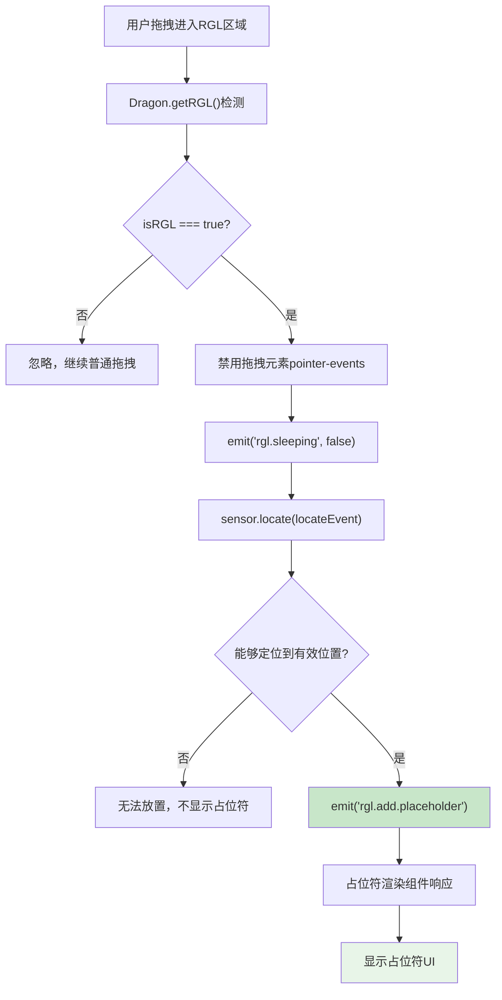
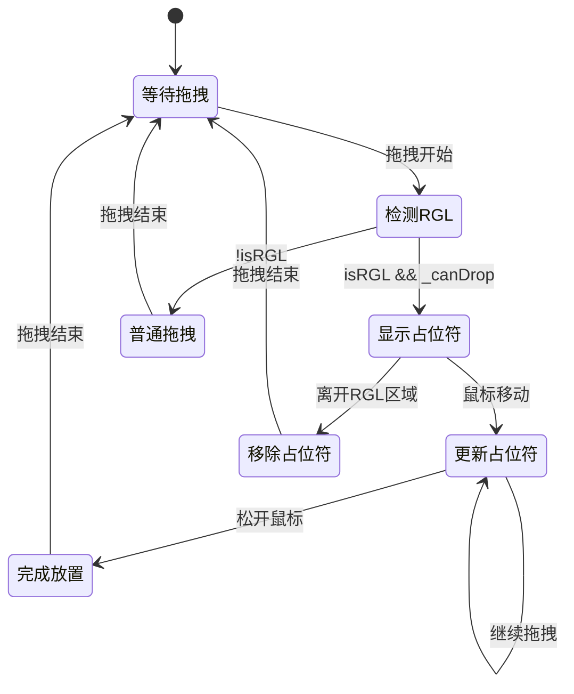

# RGL占位符事件机制分析

## 🎯 概述

RGL占位符事件是低代码引擎中**网格布局拖拽交互的核心机制**，通过`rgl.add.placeholder`和`rgl.remove.placeholder`事件来控制拖拽时的视觉占位符显示。

## 📡 RGL占位符事件详解

### **事件定义**
| 事件名称 | 触发时机 | 携带数据 | 作用 |
|---------|----------|----------|------|
| `rgl.add.placeholder` | RGL区域可放置时 | `{rglNode, fromRglNode, node, event}` | 显示拖拽占位符 |
| `rgl.remove.placeholder` | 离开RGL区域时 | 无数据 | 移除拖拽占位符 |

### **事件发送位置**

#### **rgl.add.placeholder触发**
```typescript
// packages/designer/src/designer/dragon.ts:319-324
if (this._canDrop) {
    // 可以放置：显示RGL占位符
    this.emitter.emit('rgl.add.placeholder', {
        rglNode,                                    // 目标RGL节点
        fromRglNode,                               // 来源RGL节点
        node: locateEvent.dragObject?.nodes?.[0], // 被拖拽的节点
        event: e,                                  // 原始事件
    });
    designer.clearLocation();
    this.clearState();
    this.emitter.emit('drag', locateEvent);
    return;
}
```

#### **触发条件**
1. **isRGL = true**：当前位置在RGL布局区域内
2. **sensor.locate() 成功**：传感器能够定位到有效投放位置
3. **this._canDrop = true**：确认可以在该位置放置组件

#### **携带数据说明**
```typescript
interface RGLPlaceholderEventData {
    rglNode: Node;                    // 目标RGL容器节点
    fromRglNode?: Node;               // 来源RGL节点（如果是RGL内移动）
    node: Node;                       // 被拖拽的节点实例
    event: MouseEvent | DragEvent;   // 原始鼠标/拖拽事件
}
```

#### **rgl.remove.placeholder触发**
```typescript
// packages/designer/src/designer/dragon.ts:333
} else {
    // 非RGL区域的处理
    this._canDrop = false;
    this.emitter.emit('rgl.remove.placeholder'); // 移除RGL占位符
    this.emitter.emit('rgl.sleeping', true);     // RGL系统进入休眠
}

// packages/designer/src/designer/dragon.ts:444
// 拖拽结束时也会清理占位符
this.emitter.emit('rgl.remove.placeholder');
```

#### **触发条件**
1. **离开RGL区域**：拖拽移动到非RGL区域时
2. **拖拽结束**：无论成功与否，都清理占位符
3. **拖拽取消**：ESC取消或其他中断情况

## 🎨 占位符渲染机制推测

### **可能的实现方案**

#### **方案一：DOM直接操作（推测）**
```typescript
// 可能存在的RGL占位符管理器
class RGLPlaceholderManager {
    private placeholder: HTMLElement | null = null;
    private designer: Designer;

    constructor(designer: Designer) {
        this.designer = designer;
        this.setupEventListeners();
    }

    private setupEventListeners() {
        // 监听占位符添加事件
        this.designer.dragon.emitter.on('rgl.add.placeholder', (data) => {
            this.showPlaceholder(data);
        });

        // 监听占位符移除事件
        this.designer.dragon.emitter.on('rgl.remove.placeholder', () => {
            this.hidePlaceholder();
        });
    }

    private showPlaceholder(data: any) {
        const { rglNode, node, event } = data;

        // 创建占位符元素
        if (!this.placeholder) {
            this.placeholder = this.createPlaceholderElement();
        }

        // 计算占位符位置和大小
        const rect = this.calculatePlaceholderRect(rglNode, node, event);

        // 设置占位符样式
        this.placeholder.style.left = `${rect.x}px`;
        this.placeholder.style.top = `${rect.y}px`;
        this.placeholder.style.width = `${rect.width}px`;
        this.placeholder.style.height = `${rect.height}px`;
        this.placeholder.style.display = 'block';

        // 添加到DOM
        rglNode.getDOMNode()?.appendChild(this.placeholder);
    }

    private hidePlaceholder() {
        if (this.placeholder) {
            this.placeholder.style.display = 'none';
            this.placeholder.remove();
        }
    }

    private createPlaceholderElement(): HTMLElement {
        const placeholder = document.createElement('div');
        placeholder.className = 'rgl-drag-placeholder';
        placeholder.style.cssText = `
            position: absolute;
            border: 2px dashed #1890ff;
            background: rgba(24, 144, 255, 0.1);
            pointer-events: none;
            z-index: 9999;
            border-radius: 4px;
        `;
        return placeholder;
    }
}
```

#### **方案二：React组件状态驱动（推测）**
```typescript
// RGL容器组件的内部状态管理
class RGLContainer extends Component {
    state = {
        placeholderVisible: false,
        placeholderRect: null,
        draggedNode: null
    };

    componentDidMount() {
        // 监听Dragon的占位符事件
        const { designer } = this.props;

        designer.dragon.emitter.on('rgl.add.placeholder', (data) => {
            if (data.rglNode === this.props.node) {
                this.setState({
                    placeholderVisible: true,
                    placeholderRect: this.calculateRect(data),
                    draggedNode: data.node
                });
            }
        });

        designer.dragon.emitter.on('rgl.remove.placeholder', () => {
            this.setState({
                placeholderVisible: false,
                placeholderRect: null,
                draggedNode: null
            });
        });
    }

    render() {
        const { placeholderVisible, placeholderRect } = this.state;

        return (
            <div className="rgl-container">
                {/* 正常的网格布局内容 */}
                {this.renderGridItems()}

                {/* 拖拽占位符 */}
                {placeholderVisible && placeholderRect && (
                    <div
                        className="rgl-placeholder"
                        style={{
                            position: 'absolute',
                            left: placeholderRect.x,
                            top: placeholderRect.y,
                            width: placeholderRect.width,
                            height: placeholderRect.height,
                            border: '2px dashed #1890ff',
                            background: 'rgba(24, 144, 255, 0.1)',
                            pointerEvents: 'none'
                        }}
                    />
                )}
            </div>
        );
    }
}
```

## 🔍 占位符事件的监听者分析

### **监听者位置推测**

#### **1. RGL组件内部监听**
```typescript
// RGL容器组件可能在内部监听这些事件
// 位置：业务组件或内置RGL组件中

componentDidMount() {
    const designer = this.getDesigner();

    // 监听自身相关的占位符事件
    this.addPlaceholderListener = designer.dragon.emitter.on('rgl.add.placeholder', (data) => {
        if (data.rglNode.id === this.props.nodeId) {
            this.showPlaceholder(data);
        }
    });

    this.removePlaceholderListener = designer.dragon.emitter.on('rgl.remove.placeholder', () => {
        this.hidePlaceholder();
    });
}
```

#### **2. BemTools系统监听**
```typescript
// packages/designer/src/builtin-simulator/bem-tools/可能存在的占位符工具
class RGLPlaceholderTool extends Component {
    componentDidMount() {
        const { designer } = this.props;

        // 监听占位符事件，在BemTools层显示占位符
        designer.dragon.emitter.on('rgl.add.placeholder', (data) => {
            this.renderPlaceholderInBemLayer(data);
        });

        designer.dragon.emitter.on('rgl.remove.placeholder', () => {
            this.clearPlaceholderInBemLayer();
        });
    }
}
```

#### **3. 调试和开发工具监听**
```typescript
// 开发调试工具可能监听这些事件
if (process.env.NODE_ENV === 'development') {
    designer.dragon.emitter.on('rgl.add.placeholder', (data) => {
        console.log('RGL占位符显示:', {
            targetNode: data.rglNode.componentName,
            draggedComponent: data.node?.componentName,
            position: { x: data.event.clientX, y: data.event.clientY }
        });
    });

    designer.dragon.emitter.on('rgl.remove.placeholder', () => {
        console.log('RGL占位符移除');
    });
}
```

## 🎭 占位符的渲染时机

### **显示时机流程**


### **隐藏时机**
1. **移出RGL区域**：拖拽到非RGL区域时自动隐藏
2. **拖拽结束**：无论成功放置与否，都清理占位符
3. **ESC取消**：用户取消拖拽时清理
4. **拖拽异常**：拖拽过程中发生异常时清理

## 🎨 占位符样式和效果

### **预期的占位符样式**
```css
/* RGL拖拽占位符样式 */
.rgl-drag-placeholder {
    position: absolute;
    border: 2px dashed #1890ff;
    background: rgba(24, 144, 255, 0.1);
    pointer-events: none;
    z-index: 9999;
    border-radius: 4px;
    transition: all 0.2s ease;
}

/* 占位符动画效果 */
.rgl-placeholder-enter {
    opacity: 0;
    transform: scale(0.9);
}

.rgl-placeholder-enter-active {
    opacity: 1;
    transform: scale(1);
    transition: opacity 0.2s, transform 0.2s;
}

.rgl-placeholder-exit {
    opacity: 1;
    transform: scale(1);
}

.rgl-placeholder-exit-active {
    opacity: 0;
    transform: scale(0.9);
    transition: opacity 0.2s, transform 0.2s;
}
```

### **占位符的计算逻辑**
```typescript
// 占位符位置和大小计算
class PlaceholderCalculator {
    calculatePlaceholderRect(rglNode: Node, draggedNode: Node, event: MouseEvent) {
        const containerRect = rglNode.getDOMNode()?.getBoundingClientRect();
        const draggedRect = draggedNode.getDOMNode()?.getBoundingClientRect();

        // 获取网格配置
        const gridConfig = rglNode.getProp('gridConfig')?.getValue() || {
            cols: 12,
            rowHeight: 30,
            margin: [10, 10]
        };

        // 将鼠标位置转换为网格坐标
        const gridPosition = this.mouseToGridPosition(
            event.clientX - containerRect.left,
            event.clientY - containerRect.top,
            gridConfig
        );

        // 计算占位符尺寸（基于拖拽组件的原始尺寸）
        const placeholderSize = this.calculatePlaceholderSize(draggedRect, gridConfig);

        return {
            x: gridPosition.x * gridConfig.colWidth,
            y: gridPosition.y * gridConfig.rowHeight,
            width: placeholderSize.w * gridConfig.colWidth,
            height: placeholderSize.h * gridConfig.rowHeight
        };
    }

    mouseToGridPosition(mouseX: number, mouseY: number, gridConfig: any) {
        const { colWidth, rowHeight, margin } = gridConfig;

        return {
            x: Math.floor((mouseX - margin[0]) / (colWidth + margin[0])),
            y: Math.floor((mouseY - margin[1]) / (rowHeight + margin[1]))
        };
    }
}
```

## 🔧 占位符的实现机制推测

### **可能的监听者**

#### **1. RGL容器组件内部**
```typescript
// RGL容器组件可能的内部实现
class GridLayoutContainer extends Component {
    state = {
        placeholders: new Map()  // 存储多个占位符
    };

    componentDidMount() {
        this.setupPlaceholderListeners();
    }

    setupPlaceholderListeners() {
        const designer = this.context.designer;

        // 监听占位符添加
        designer.dragon.emitter.on('rgl.add.placeholder', (data) => {
            if (data.rglNode === this.node) {
                const placeholderInfo = this.calculatePlaceholder(data);
                this.setState({
                    placeholders: new Map(this.state.placeholders).set(data.node.id, placeholderInfo)
                });
            }
        });

        // 监听占位符移除
        designer.dragon.emitter.on('rgl.remove.placeholder', () => {
            this.setState({ placeholders: new Map() });
        });
    }

    render() {
        return (
            <div className="rgl-container">
                {/* 正常网格内容 */}
                {this.renderGridItems()}

                {/* 拖拽占位符 */}
                {Array.from(this.state.placeholders.values()).map(placeholder => (
                    <div key={placeholder.id} className="rgl-placeholder" style={placeholder.style} />
                ))}
            </div>
        );
    }
}
```

#### **2. BemTools辅助工具层**
```typescript
// packages/designer/src/builtin-simulator/bem-tools/可能存在的RGL工具
class RGLBemTool extends Component {
    state = { placeholders: [] };

    componentDidMount() {
        const { designer } = this.props;

        // 在BemTools层渲染占位符
        designer.dragon.emitter.on('rgl.add.placeholder', (data) => {
            const placeholderElement = this.createPlaceholderElement(data);
            this.setState({
                placeholders: [...this.state.placeholders, placeholderElement]
            });
        });

        designer.dragon.emitter.on('rgl.remove.placeholder', () => {
            this.setState({ placeholders: [] });
        });
    }

    render() {
        return (
            <div className="rgl-bem-layer">
                {this.state.placeholders.map(placeholder => placeholder)}
            </div>
        );
    }
}
```

#### **3. 全局CSS动态注入**
```typescript
// 可能通过动态CSS实现占位符
class RGLStyleManager {
    private styleElement: HTMLStyleElement;

    constructor(designer: Designer) {
        this.styleElement = this.createStyleElement();
        this.setupListeners(designer);
    }

    setupListeners(designer: Designer) {
        designer.dragon.emitter.on('rgl.add.placeholder', (data) => {
            const { rglNode, node, event } = data;
            const rect = this.calculateRect(rglNode, event);

            // 动态注入占位符样式
            const css = `
                .rgl-node-${rglNode.id}::after {
                    content: '';
                    position: absolute;
                    left: ${rect.x}px;
                    top: ${rect.y}px;
                    width: ${rect.width}px;
                    height: ${rect.height}px;
                    border: 2px dashed #1890ff;
                    background: rgba(24, 144, 255, 0.1);
                    pointer-events: none;
                    z-index: 9999;
                }
            `;

            this.styleElement.innerHTML = css;
        });

        designer.dragon.emitter.on('rgl.remove.placeholder', () => {
            this.styleElement.innerHTML = '';
        });
    }
}
```

## 📊 占位符的使用效果

### **用户体验**
1. **视觉指引**：明确显示组件将要放置的位置
2. **网格对齐**：显示对齐到网格的精确位置
3. **尺寸预览**：预览组件在新位置的大小
4. **冲突提示**：显示是否与其他组件冲突

### **交互反馈**


## 🛠️ 在业务中监听占位符事件

### **调试监听方案**
```typescript
// 在控制台中监听RGL占位符事件
const designer = editor.get('designer');

// 监听占位符添加
const addListener = designer.dragon.emitter.on('rgl.add.placeholder', (data) => {
    console.log('🟦 RGL占位符显示:', {
        targetContainer: data.rglNode?.componentName,
        draggedComponent: data.node?.componentName,
        mousePosition: { x: data.event.clientX, y: data.event.clientY },
        fromContainer: data.fromRglNode?.componentName
    });
});

// 监听占位符移除
const removeListener = designer.dragon.emitter.on('rgl.remove.placeholder', () => {
    console.log('🚫 RGL占位符移除');
});

// 清理监听器
// removeListener();
// addListener();
```

### **业务扩展示例**
```typescript
// 自定义RGL占位符管理器
class BusinessRGLManager {
    private analytics: AnalyticsService;

    constructor(designer: Designer, analytics: AnalyticsService) {
        this.analytics = analytics;
        this.setupMonitoring(designer);
    }

    setupMonitoring(designer: Designer) {
        // 占位符性能监控
        designer.dragon.emitter.on('rgl.add.placeholder', (data) => {
            this.analytics.track('rgl_placeholder_show', {
                containerType: data.rglNode.componentName,
                draggedType: data.node?.componentName,
                timestamp: Date.now()
            });

            this.startPlaceholderTimer();
        });

        designer.dragon.emitter.on('rgl.remove.placeholder', () => {
            const duration = this.endPlaceholderTimer();

            this.analytics.track('rgl_placeholder_hide', {
                displayDuration: duration,
                timestamp: Date.now()
            });
        });
    }

    // 占位符显示时长统计
    private placeholderStartTime: number = 0;

    startPlaceholderTimer() {
        this.placeholderStartTime = Date.now();
    }

    endPlaceholderTimer(): number {
        return Date.now() - this.placeholderStartTime;
    }
}
```

## 🎯 总结

### **占位符事件的核心价值**
1. **精确反馈**：提供网格布局的精确拖拽反馈
2. **用户指引**：明确显示组件的目标位置
3. **冲突预防**：预先显示可能的布局冲突
4. **体验优化**：增强RGL组件的拖拽体验

### **实现特点**
- **事件驱动**：通过事件机制实现松耦合
- **数据丰富**：事件携带完整的上下文信息
- **时机精确**：在合适的时机触发和清理
- **扩展性强**：支持业务自定义监听和处理

### **监听者生态**
- **RGL组件**：直接响应占位符显示/隐藏
- **BemTools系统**：可能在辅助工具层显示
- **调试工具**：开发时的监控和分析
- **业务扩展**：自定义的交互增强

**RGL占位符事件是网格布局拖拽交互的关键机制，通过精确的事件时机控制实现了专业的网格拖拽体验。**
