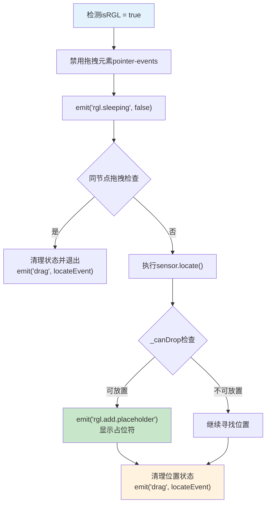
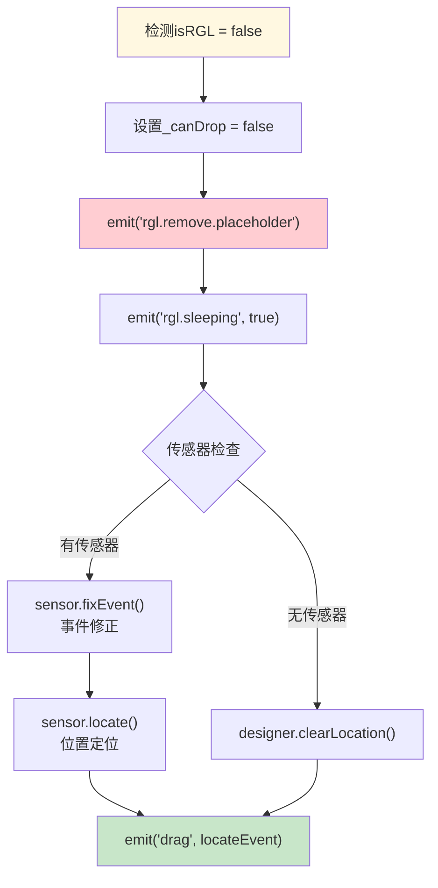
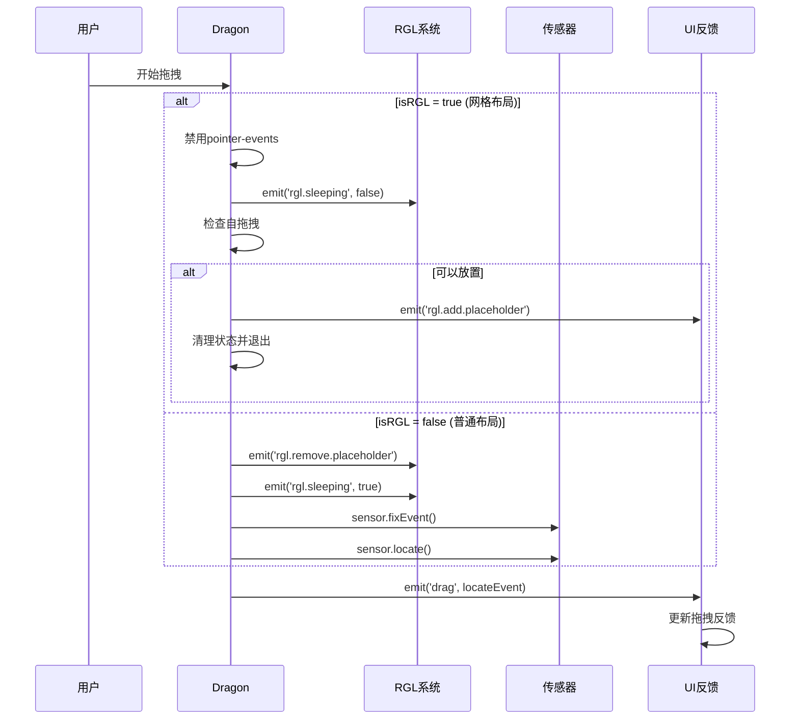

# 拖拽流程分支对比分析

## 🎯 概述

Dragon拖拽引擎根据`isRGL`状态采用**完全不同的处理策略**，这种分支设计是为了适配**网格布局**和**普通布局**两种不同的拖拽需求。

## 🔀 拖拽流程分支判断

### **分支判断逻辑**
```typescript
// packages/designer/src/designer/dragon.ts:287-344
const drag = (e: MouseEvent | DragEvent) => {
    const rglInfo = getRGL(e) as any;
    const { isRGL, rglNode } = rglInfo;
    const locateEvent = createLocateEvent(e);
    const sensor = chooseSensor(locateEvent);

    if (isRGL) {
        // 🟦 RGL分支：网格布局特殊处理
        handleRGLDrag();
    } else {
        // 🟨 普通分支：常规拖拽处理
        handleNormalDrag();
    }
}
```

### **isRGL判断条件**
```typescript
// packages/designer/src/document/node/node.ts:1234
const isRGL = isRGLContainerNode || (isRGLNode && (!isContainerNode || !isEmptyNode));

// 判断逻辑：
// 1. 节点本身是RGL容器 → isRGL = true
// 2. 节点在RGL容器内 && (不是容器 || 不为空) → isRGL = true
// 3. 其他情况 → isRGL = false
```

## 🟦 RGL拖拽流程详解

### **RGL处理流程图**


### **RGL分支的核心特点**
```typescript
if (isRGL) {
    // 🔥 特点1: 禁用pointer-events
    const nodeInst = dragObject.nodes?.[0]?.getDOMNode();
    if (nodeInst && nodeInst.style) {
        this.nodeInstPointerEvents = true;
        nodeInst.style.pointerEvents = 'none';  // 防止拖拽元素阻断事件
    }

    // 🔥 特点2: 激活RGL系统
    this.emitter.emit('rgl.sleeping', false);

    // 🔥 特点3: 自拖拽检测
    if (fromRglNode && fromRglNode.id === rglNode.id) {
        designer.clearLocation();
        this.clearState();
        this.emitter.emit('drag', locateEvent);
        return; // 提前退出，避免自己拖拽自己
    }

    // 🔥 特点4: 占位符管理
    this._canDrop = !!sensor?.locate(locateEvent);
    if (this._canDrop) {
        this.emitter.emit('rgl.add.placeholder', {
            rglNode, fromRglNode,
            node: locateEvent.dragObject?.nodes?.[0],
            event: e,
        });
        designer.clearLocation();
        this.clearState();
        this.emitter.emit('drag', locateEvent);
        return;
    }
}
```

### **RGL分支的事件系统**
| 事件 | 触发时机 | 数据 | 效果 |
|------|----------|------|------|
| `rgl.sleeping: false` | 进入RGL区域 | `boolean` | 激活RGL响应 |
| `rgl.add.placeholder` | 找到可放置位置 | `{rglNode, node, event}` | 显示占位符 |
| `drag` | 状态清理后 | `ILocateEvent` | 通知拖拽继续 |

## 🟨 普通拖拽流程详解

### **普通处理流程图**


### **普通分支的核心特点**
```typescript
} else {
    // 🔥 特点1: 禁用RGL功能
    this._canDrop = false;  // 标记不是RGL放置

    // 🔥 特点2: 清理RGL状态
    this.emitter.emit('rgl.remove.placeholder');  // 移除RGL占位符
    this.emitter.emit('rgl.sleeping', true);      // RGL系统休眠

    // 🔥 特点3: 不清理Designer状态
    // 不调用 designer.clearLocation() 和 this.clearState()
    // 保持拖拽状态继续处理
}

// 🔥 特点4: 常规传感器处理
if (sensor) {
    sensor.fixEvent(locateEvent);    // 坐标转换
    sensor.locate(locateEvent);      // 位置计算
} else {
    designer.clearLocation();       // 无传感器时清除位置
}

this.emitter.emit('drag', locateEvent);  // 发送拖拽事件
```

### **普通分支的事件系统**
| 事件 | 触发时机 | 数据 | 效果 |
|------|----------|------|------|
| `rgl.remove.placeholder` | 离开RGL区域 | 无 | 清理RGL占位符 |
| `rgl.sleeping: true` | 进入普通区域 | `boolean` | RGL系统休眠 |
| `drag` | 传感器处理后 | `ILocateEvent` | 继续拖拽流程 |

## 🔄 完整拖拽事件系统对比

### **事件时序对比**


## ⚙️ 两种流程的功能对比

### **功能差异对比表**
| 功能维度 | RGL分支 | 普通分支 |
|---------|---------|----------|
| **pointer-events** | ✅ 主动禁用 | ❌ 不处理 |
| **系统激活** | ✅ 激活RGL | ✅ 休眠RGL |
| **自拖拽检测** | ✅ 严格检测 | ❌ 无检测 |
| **占位符** | ✅ 网格占位符 | ❌ 清理占位符 |
| **状态清理** | ✅ 提前清理 | ❌ 保持状态 |
| **传感器处理** | ✅ 仍然执行 | ✅ 常规处理 |
| **事件发送** | ✅ 发送drag | ✅ 发送drag |

### **处理策略差异**
```typescript
// RGL策略：预处理 + 早退出
if (isRGL) {
    // 1. 预处理：设置特殊状态
    // 2. 检查：避免问题情况
    // 3. 定位：使用传感器
    // 4. 处理：显示占位符或继续
    // 5. 清理：清理状态
    // 6. 退出：return结束处理
}

// 普通策略：清理 + 继续处理
} else {
    // 1. 清理：移除RGL相关状态
    // 2. 继续：不退出，继续后续处理
}
// 公共处理：传感器+事件发送
```

## 🔧 条件触发的详细分析

### **RGL触发条件**
```typescript
// 满足RGL触发的场景
const rglTriggerConditions = {
    // 场景1：RGL容器内的直接子组件拖拽
    scenario1: {
        draggedNode: "RGL容器的直接子节点",
        condition: "isRGLNode && !isContainerNode",
        example: "在GridLayout中拖拽Card组件"
    },

    // 场景2：RGL容器内的非空容器拖拽
    scenario2: {
        draggedNode: "RGL容器内的有内容容器",
        condition: "isRGLNode && isContainerNode && !isEmptyNode",
        example: "拖拽包含子组件的Panel"
    },

    // 场景3：RGL容器本身的拖拽
    scenario3: {
        draggedNode: "RGL容器节点本身",
        condition: "isRGLContainerNode",
        example: "拖拽整个GridLayout组件"
    }
};
```

### **普通触发条件**
```typescript
// 满足普通拖拽的场景
const normalTriggerConditions = {
    // 场景1：普通组件拖拽
    scenario1: {
        draggedNode: "非RGL环境中的组件",
        condition: "!isRGLNode",
        example: "在普通Page中拖拽Button"
    },

    // 场景2：RGL容器内的空容器
    scenario2: {
        draggedNode: "RGL容器内的空容器",
        condition: "isRGLNode && isContainerNode && isEmptyNode",
        example: "拖拽空的Container组件"
    },

    // 场景3：从组件库拖入
    scenario3: {
        draggedNode: "新组件拖入",
        condition: "newBie = true",
        example: "从组件库拖拽新组件到画布"
    }
};
```

## 📊 事件效果对比分析

### **RGL事件效果**
```typescript
// RGL分支的事件效果
const rglEffects = {
    immediate: [
        "禁用拖拽元素的鼠标事件响应",
        "激活RGL系统 (rgl.sleeping: false)",
        "检测并处理自拖拽情况"
    ],

    conditional: [
        "显示网格占位符 (rgl.add.placeholder)",
        "清理Designer位置状态",
        "清理Dragon拖拽状态",
        "提前退出处理流程"
    ],

    visual: [
        "网格对齐的占位符显示",
        "拖拽元素变为半透明",
        "网格线条和吸附效果"
    ]
};
```

### **普通事件效果**
```typescript
// 普通分支的事件效果
const normalEffects = {
    immediate: [
        "清理所有RGL占位符 (rgl.remove.placeholder)",
        "RGL系统进入休眠 (rgl.sleeping: true)",
        "设置_canDrop = false"
    ],

    continuous: [
        "执行传感器事件修正 (sensor.fixEvent)",
        "执行传感器位置定位 (sensor.locate)",
        "保持拖拽状态继续处理",
        "发送常规拖拽事件"
    ],

    visual: [
        "线性插入指示器",
        "边界高亮效果",
        "普通拖拽反馈"
    ]
};
```

## 🔧 代码实现对比

### **完整代码对比**
```typescript
// packages/designer/src/designer/dragon.ts:294-344
if (isRGL) {
    // ============= RGL分支 =============

    // 1️⃣ 状态预处理
    const nodeInst = dragObject.nodes?.[0]?.getDOMNode();
    if (nodeInst && nodeInst.style) {
        this.nodeInstPointerEvents = true;
        nodeInst.style.pointerEvents = 'none';
    }

    // 2️⃣ 系统激活
    this.emitter.emit('rgl.sleeping', false);

    // 3️⃣ 冲突检测
    if (fromRglNode && fromRglNode.id === rglNode.id) {
        designer.clearLocation();
        this.clearState();
        this.emitter.emit('drag', locateEvent);
        return; // 🚀 早退出
    }

    // 4️⃣ 位置验证
    this._canDrop = !!sensor?.locate(locateEvent);
    if (this._canDrop) {
        // 5️⃣ 占位符显示
        this.emitter.emit('rgl.add.placeholder', {
            rglNode, fromRglNode,
            node: locateEvent.dragObject?.nodes?.[0],
            event: e,
        });
        designer.clearLocation();
        this.clearState();
        this.emitter.emit('drag', locateEvent);
        return; // 🚀 早退出
    }

} else {
    // ============= 普通分支 =============

    // 1️⃣ RGL清理
    this._canDrop = false;
    this.emitter.emit('rgl.remove.placeholder');
    this.emitter.emit('rgl.sleeping', true);

    // 2️⃣ 无早退出，继续执行后续逻辑
}

// 🔄 公共处理逻辑（两个分支都会执行）
if (sensor) {
    sensor.fixEvent(locateEvent);
    sensor.locate(locateEvent);
} else {
    designer.clearLocation();
}
this.emitter.emit('drag', locateEvent);
```

## 🎯 关键差异点分析

### **1. 状态管理策略**
| 方面 | RGL分支 | 普通分支 |
|------|---------|----------|
| **pointer-events** | 主动禁用 | 不处理 |
| **Designer状态** | 条件性清理 | 保持状态 |
| **Dragon状态** | 条件性清理 | 保持状态 |
| **位置信息** | 可能清理 | 传感器管理 |

### **2. 执行流程策略**
| 方面 | RGL分支 | 普通分支 |
|------|---------|----------|
| **流程控制** | 多点早退出 | 顺序执行 |
| **传感器使用** | 条件性使用 | 常规使用 |
| **事件发送** | 多次发送 | 单次发送 |
| **性能特点** | 优化为主 | 完整处理 |

### **3. 视觉效果策略**
| 方面 | RGL分支 | 普通分支 |
|------|---------|----------|
| **占位符类型** | 网格块状 | 线性指示 |
| **显示时机** | 智能显示 | 实时显示 |
| **交互反馈** | 网格吸附 | 自由移动 |
| **清理机制** | 事件驱动 | 自动清理 |

## 🚀 性能影响分析

### **RGL分支性能特点**
```typescript
// RGL分支的性能优化
const rglPerformanceFeatures = {
    earlyExit: {
        description: "早退出机制",
        benefit: "避免不必要的计算",
        scenarios: ["自拖拽检测", "占位符显示后"]
    },

    stateClearing: {
        description: "主动状态清理",
        benefit: "减少后续处理开销",
        impact: "Designer和Dragon状态重置"
    },

    pointerEvents: {
        description: "pointer-events控制",
        benefit: "避免事件被拖拽元素拦截",
        cost: "需要额外的DOM操作"
    }
};
```

### **普通分支性能特点**
```typescript
// 普通分支的性能特点
const normalPerformanceFeatures = {
    continuousProcessing: {
        description: "连续处理流程",
        benefit: "完整的传感器处理流程",
        cost: "可能有冗余计算"
    },

    sensorChain: {
        description: "完整传感器链",
        benefit: "精确的位置计算",
        process: "fixEvent → locate → emit"
    },

    statePreservation: {
        description: "状态保持",
        benefit: "保持拖拽上下文",
        impact: "为后续处理保留完整信息"
    }
};
```

## 🎨 使用场景映射

### **RGL分支适用场景**
- **仪表板编辑**：拖拽调整图表和组件位置
- **自由布局页面**：网格对齐的页面设计
- **响应式设计**：需要精确位置控制的场景
- **专业设计工具**：类似Figma的设计体验

### **普通分支适用场景**
- **流式布局页面**：常规的页面布局设计
- **表单设计**：表单字段的线性排列
- **内容管理**：文章、博客等内容编辑
- **移动端设计**：适合移动端的简单布局

## ⚠️ 注意事项和最佳实践

### **RGL使用注意事项**
1. **性能考虑**：RGL占位符计算较复杂，避免过度使用
2. **内存管理**：及时清理占位符状态，防止内存泄露
3. **事件冲突**：注意与其他拖拽事件的协调
4. **浏览器兼容**：某些效果可能在旧浏览器中表现不佳

### **普通拖拽注意事项**
1. **传感器依赖**：确保有合适的传感器处理拖拽
2. **状态一致性**：保持拖拽状态在各组件间的一致
3. **性能优化**：高频事件需要适当的节流处理
4. **用户体验**：提供清晰的拖拽反馈和指引

## 🎯 总结

### **设计理念对比**
| 方面 | RGL分支 | 普通分支 |
|------|---------|----------|
| **设计理念** | 专业化、精确化 | 通用化、简洁化 |
| **交互模式** | 网格吸附 | 自由拖拽 |
| **性能策略** | 优化优先 | 功能完整优先 |
| **扩展性** | 专用性强 | 通用性强 |

### **核心价值**
- **RGL分支**：为专业设计场景提供精确的网格布局拖拽体验
- **普通分支**：为通用场景提供简单高效的拖拽功能
- **分支设计**：通过分支策略适配不同的使用需求

**两个分支的设计体现了低代码引擎对不同拖拽场景的深度适配，既支持专业的网格设计，也兼顾通用的布局需求。**
