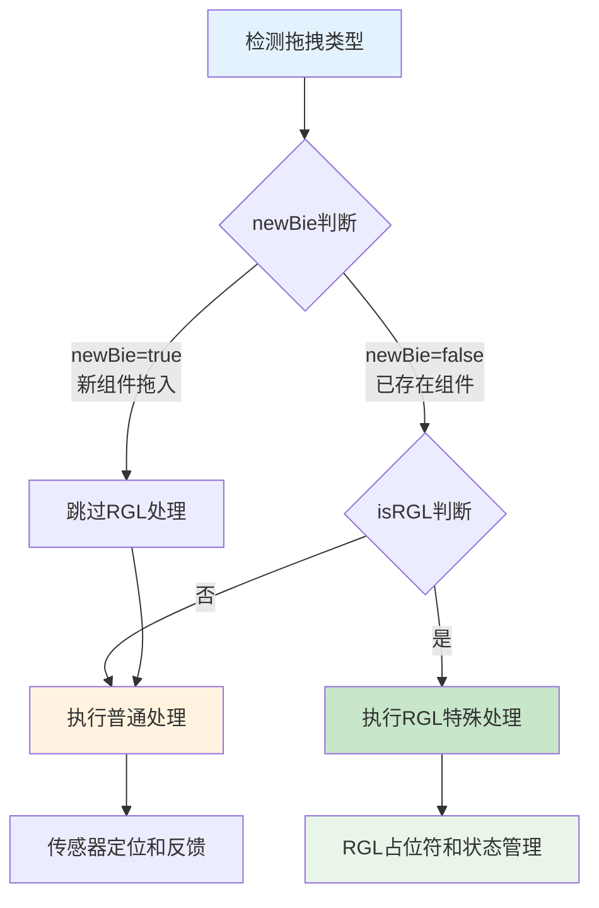
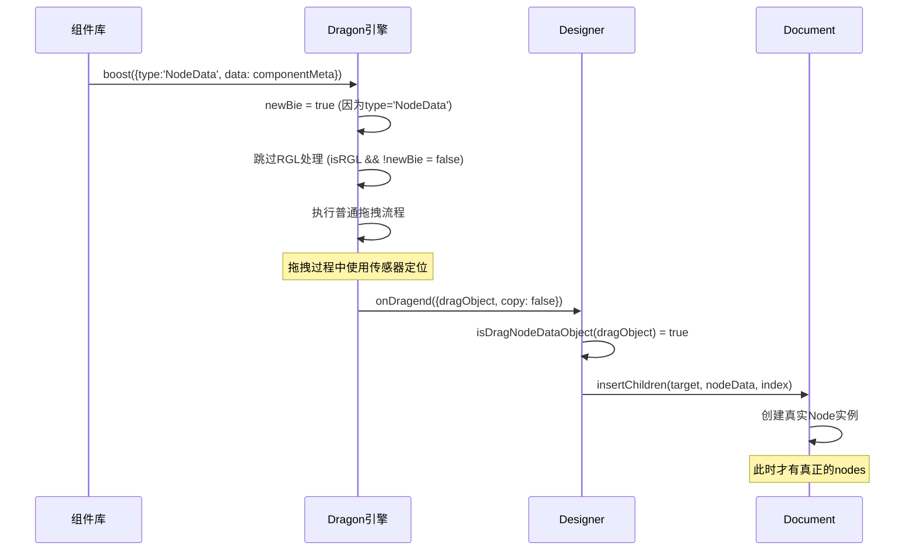

# DragObject数据结构与Nodes属性分析

## 🎯 问题概述

用户发现从组件库拖入组件时，`dragObject`格式为：
```typescript
{
  data: {componentName: 'Clock', props: {…}},
  type: "nodedata"
}
```
**不存在nodes属性**，而`nodes`属性只在渲染后才出现。这在`isRGL`分支中会造成异常。

## 📋 DragObject数据结构详解

### **两种DragObject类型**

#### **1. NodeData类型（新组件拖入）**
```typescript
// packages/types/src/shell/type/drag-node-data-object.ts
interface IPublicTypeDragNodeDataObject {
  type: IPublicEnumDragObjectType.NodeData;  // "nodedata"
  data: IPublicTypeNodeSchema | IPublicTypeNodeSchema[];
  thumbnail?: string;
  description?: string;
}

// 实际数据示例
const dragObject = {
  type: "nodedata",
  data: {
    componentName: 'Clock',
    props: {
      format: 'YYYY-MM-DD HH:mm:ss'
    }
  }
  // ❌ 注意：没有nodes属性！
};
```

#### **2. Node类型（已存在组件移动）**
```typescript
// packages/types/src/shell/type/drag-node-object.ts
interface IPublicTypeDragNodeObject<Node = IPublicModelNode> {
  type: IPublicEnumDragObjectType.Node;  // "node"
  nodes: Node[];  // ✅ 有nodes属性
}

// 实际数据示例
const dragObject = {
  type: "node",
  nodes: [nodeInstance1, nodeInstance2] // 已渲染的节点实例
};
```

### **类型判断逻辑**
```typescript
// packages/designer/src/designer/dragon.ts:184
const newBie = !isDragNodeObject(dragObject);

// 判断流程：
// - dragObject.type === 'NodeData' → isDragNodeObject返回false → newBie = true
// - dragObject.type === 'Node' → isDragNodeObject返回true → newBie = false
```

## ⚠️ Nodes属性缺失的后果

### **在RGL分支中的问题**
```typescript
// 问题代码：packages/designer/src/designer/dragon.ts:298-302
if (isRGL) {
    // ❌ 当dragObject.type = "nodedata"时，dragObject.nodes不存在
    const nodeInst = dragObject.nodes?.[0]?.getDOMNode();  // undefined
    if (nodeInst && nodeInst.style) {
        this.nodeInstPointerEvents = true;
        nodeInst.style.pointerEvents = 'none';  // 无法执行
    }
}
```

### **具体失效的功能**
1. **pointer-events禁用失效**：无法禁用拖拽元素的鼠标事件
2. **节点信息缺失**：无法获取拖拽组件的DOM节点
3. **RGL信息获取失效**：`getRGL()`可能返回空对象
4. **占位符数据不完整**：`rgl.add.placeholder`事件缺少节点信息

### **getRGL返回空对象的原因**
```typescript
// packages/designer/src/designer/dragon.ts:207-215
const getRGL = (e: MouseEvent | DragEvent) => {
    const locateEvent = createLocateEvent(e);
    const sensor = chooseSensor(locateEvent);
    if (!sensor || !sensor.getNodeInstanceFromElement) return {}; // 返回空对象

    // 从事件目标获取节点实例
    const nodeInst = sensor.getNodeInstanceFromElement(e.target as Element);
    return (nodeInst?.node as any)?.getRGL?.() || {}; // 新组件还未渲染，无法获取RGL信息
};

// 原因分析：
// 1. 新组件还没有渲染到DOM中
// 2. e.target是组件库面板中的元素，不是画布中的节点
// 3. getNodeInstanceFromElement无法找到对应的设计器节点
// 4. 因此nodeInst为null，getRGL()返回空对象{}
```

## 💡 解决方案分析

### **方案一：跳过RGL处理（推荐）**

#### **原理**
新组件拖入时本就不需要RGL特殊处理，可以直接跳过。

#### **实现代码**
```typescript
// packages/designer/src/designer/dragon.ts:294修改
if (isRGL && !newBie) {  // ✅ 增加!newBie条件
    // 只有已存在组件拖拽才进入RGL处理
    const nodeInst = dragObject.nodes?.[0]?.getDOMNode();
    if (nodeInst && nodeInst.style) {
        this.nodeInstPointerEvents = true;
        nodeInst.style.pointerEvents = 'none';
    }

    // 其他RGL处理逻辑...
}
```

#### **优势**
- ✅ 简单直接，风险最低
- ✅ 符合业务逻辑，新组件不需要RGL处理
- ✅ 避免了访问不存在的nodes属性
- ✅ 保持现有代码逻辑不变

### **方案二：增加Nodes属性（复杂）**

#### **原理**
为NodeData类型的dragObject动态创建临时nodes属性。

#### **实现代码**
```typescript
// 在boost方法开始时增加预处理
boost(dragObject: IPublicModelDragObject, boostEvent: MouseEvent | DragEvent, fromRglNode?: INode | IPublicModelNode) {
    // 为NodeData类型创建临时nodes属性
    if (isDragNodeDataObject(dragObject) && !dragObject.nodes) {
        const tempNodes = this.createTempNodesForNodeData(dragObject);
        (dragObject as any).nodes = tempNodes;
    }

    // 其他原有逻辑...
}

private createTempNodesForNodeData(dragObject: IPublicTypeDragNodeDataObject): INode[] {
    const { data } = dragObject;
    const nodeDataArray = Array.isArray(data) ? data : [data];

    return nodeDataArray.map(nodeData => {
        // 创建临时节点实例（不添加到文档）
        return this.designer.project.currentDocument?.createTempNode(nodeData);
    }).filter(Boolean);
}
```

#### **问题**
- ❌ 增加复杂度，可能引入新问题
- ❌ 临时节点可能与真实节点不一致
- ❌ 需要额外的内存管理和清理逻辑
- ❌ 可能影响其他依赖nodes的逻辑

### **方案三：安全访问模式（防御性）**

#### **原理**
在所有访问nodes的地方都增加安全检查。

#### **实现代码**
```typescript
// 在所有访问dragObject.nodes的地方增加安全检查
if (isRGL) {
    // ✅ 安全访问nodes属性
    const nodeInst = dragObject.nodes?.[0]?.getDOMNode();
    if (nodeInst && nodeInst.style) {
        this.nodeInstPointerEvents = true;
        nodeInst.style.pointerEvents = 'none';
    }

    // 其他地方也要安全访问
    const draggedNode = dragObject.nodes?.[0] || null;

    this.emitter.emit('rgl.add.placeholder', {
        rglNode,
        fromRglNode,
        node: draggedNode,  // 可能为null
        event: e,
    });
}
```

#### **评估**
- ✅ 防御性好，避免崩溃
- ⚠️ 功能可能不完整（node为null时）
- ⚠️ 需要修改多个地方
- ⚠️ 可能导致功能降级

## 🎯 最推荐的方案：方案一

### **推荐理由**
1. **逻辑合理性**：新组件拖入确实不需要RGL特殊处理
2. **风险最低**：只修改判断条件，不改变核心逻辑
3. **性能最优**：避免了不必要的RGL处理开销
4. **维护简单**：代码改动最小，易于理解和维护

### **具体实现**
```typescript
// packages/designer/src/designer/dragon.ts:294
// 原代码：
if (isRGL) {

// 修改为：
if (isRGL && !newBie) {
    // 只有已存在组件在RGL环境中拖拽才需要特殊处理
    // 新组件拖入(newBie=true)时跳过RGL处理，走普通流程即可
```

### **修改后的逻辑流程**


## 🔍 新拖入组件的完整处理流程

### **组件库拖入的数据流**


### **关键时机说明**
1. **拖拽开始**：dragObject只有data，无nodes
2. **拖拽过程**：仍然只有data，RGL处理被跳过
3. **拖拽结束**：通过insertChildren创建Node实例
4. **渲染完成**：Node实例渲染到DOM，具备完整能力

## 📊 数据结构转换时机

### **NodeData → Node转换过程**
```typescript
// packages/designer/src/designer/designer.ts:289-296
if (isDragNodeDataObject(dragObject)) {
    // 1. 提取nodeData
    const nodeData = Array.isArray(dragObject.data) ? dragObject.data : [dragObject.data];

    // 2. 验证数据格式
    const isNotNodeSchema = nodeData.find((item) => !isNodeSchema(item));
    if (isNotNodeSchema) return;

    // 3. 创建真实Node实例
    nodes = insertChildren(loc.target, nodeData, loc.detail.index);
}

// insertChildren内部逻辑
function insertChildren(container: INode, things: IPublicTypeNodeData[], index?: number): INode[] {
    return things.map(data => {
        // 🔥 关键：这里才创建真正的Node实例
        return container.document?.createNode(data);
    }).filter(Boolean);
}
```

### **数据结构对比**
| 阶段 | 数据类型 | 结构 | 特点 |
|------|----------|------|------|
| **拖拽前** | `IPublicTypeDragNodeDataObject` | `{type: 'nodedata', data: componentMeta}` | 只有元数据 |
| **拖拽中** | 同上 | 同上 | 仍然只有元数据 |
| **拖拽后** | `INode[]` | 真实节点实例 | 完整的节点能力 |
| **渲染后** | 同上 | DOM已挂载 | 具备DOM操作能力 |

## 🛠️ 完整解决方案代码

### **推荐解决方案实现**
```typescript
// packages/designer/src/designer/dragon.ts:294行修改
// 原代码：
if (isRGL) {

// 修改后：
if (isRGL && !newBie) {  // ✅ 增加newBie检查
```

### **修改后的完整RGL处理逻辑**
```typescript
const drag = (e: MouseEvent | DragEvent) => {
    checkcopy(e);
    if (isInvalidPoint(e, lastArrive)) return;
    if (lastArrive && isSameAs(e, lastArrive)) {
        lastArrive = e;
        return;
    }
    lastArrive = e;

    const rglInfo = getRGL(e) as any;
    const { isRGL, rglNode } = rglInfo;
    const locateEvent = createLocateEvent(e);
    const sensor = chooseSensor(locateEvent);

    // ✅ 修改后的RGL处理条件
    if (isRGL && !newBie) {
        // 只处理已存在组件在RGL环境中的拖拽
        // 新组件拖入(newBie=true)走普通流程即可

        const nodeInst = dragObject.nodes?.[0]?.getDOMNode();
        if (nodeInst && nodeInst.style) {
            this.nodeInstPointerEvents = true;
            nodeInst.style.pointerEvents = 'none';
        }

        this.emitter.emit('rgl.sleeping', false);

        if (fromRglNode && fromRglNode.id === rglNode.id) {
            designer.clearLocation();
            this.clearState();
            this.emitter.emit('drag', locateEvent);
            return;
        }

        this._canDrop = !!sensor?.locate(locateEvent);
        if (this._canDrop) {
            this.emitter.emit('rgl.add.placeholder', {
                rglNode,
                fromRglNode,
                node: locateEvent.dragObject?.nodes?.[0],
                event: e,
            });
            designer.clearLocation();
            this.clearState();
            this.emitter.emit('drag', locateEvent);
            return;
        }
    } else {
        // 普通处理：包括新组件拖入和非RGL环境
        this._canDrop = false;
        this.emitter.emit('rgl.remove.placeholder');
        this.emitter.emit('rgl.sleeping', true);
    }

    // 公共处理逻辑
    if (sensor) {
        sensor.fixEvent(locateEvent);
        sensor.locate(locateEvent);
    } else {
        designer.clearLocation();
    }

    this.emitter.emit('drag', locateEvent);
};
```

## 📈 解决方案效果对比

### **修改前的问题**
```typescript
// ❌ 问题流程
从组件库拖入 → dragObject.type="nodedata" → newBie=true
→ isRGL=true时仍进入RGL分支 → dragObject.nodes[0]报错
```

### **修改后的正确流程**
```typescript
// ✅ 正确流程
从组件库拖入 → dragObject.type="nodedata" → newBie=true
→ isRGL && !newBie = false → 跳过RGL分支 → 走普通拖拽流程
```

### **功能完整性对比**
| 功能 | 修改前 | 修改后 |
|------|--------|--------|
| **新组件拖入** | ❌ 报错崩溃 | ✅ 正常工作 |
| **已存在组件RGL拖拽** | ✅ 正常 | ✅ 正常 |
| **普通组件拖拽** | ✅ 正常 | ✅ 正常 |
| **性能影响** | ❌ 异常处理开销 | ✅ 无影响 |

## 🔧 额外优化建议

### **增强错误处理**
```typescript
// 在关键位置增加防御性检查
if (isRGL && !newBie) {
    // ✅ 双重安全检查
    if (!dragObject.nodes || !dragObject.nodes.length) {
        console.warn('RGL拖拽但dragObject.nodes为空，跳过RGL处理');
        // 降级到普通处理
        this._canDrop = false;
        this.emitter.emit('rgl.remove.placeholder');
        this.emitter.emit('rgl.sleeping', true);
    } else {
        // 正常RGL处理逻辑
        const nodeInst = dragObject.nodes[0]?.getDOMNode();
        // ...
    }
}
```

### **调试信息增强**
```typescript
// 添加调试日志，便于排查问题
const drag = (e: MouseEvent | DragEvent) => {
    const rglInfo = getRGL(e) as any;
    const { isRGL, rglNode } = rglInfo;

    // 调试信息
    if (process.env.NODE_ENV === 'development') {
        console.log('拖拽调试:', {
            isRGL,
            newBie,
            dragObjectType: dragObject?.type,
            hasNodes: !!(dragObject as any)?.nodes,
            targetElement: e.target?.className
        });
    }

    // 处理逻辑...
};
```

## 🎯 总结和建议

### **问题根本原因**
1. **数据结构差异**：NodeData与Node类型的本质差异
2. **时机错误**：在节点实例创建前就尝试访问nodes属性
3. **条件不充分**：RGL判断条件没有考虑newBie状态

### **最佳解决方案**
**推荐使用方案一**：`if (isRGL && !newBie)`
- 简单安全，符合业务逻辑
- 新组件拖入走普通流程，已存在组件走RGL流程
- 最小化代码修改，降低回归风险

### **长期优化建议**
1. **类型安全**：在TypeScript层面更好地区分两种dragObject类型
2. **文档改进**：明确说明什么时候nodes属性可用
3. **测试完善**：增加针对不同dragObject类型的测试用例
4. **错误处理**：增强异常情况的处理和恢复机制

**通过合理的条件判断，可以完美解决dragObject.nodes属性缺失的问题，同时保持系统的健壮性和性能。**
