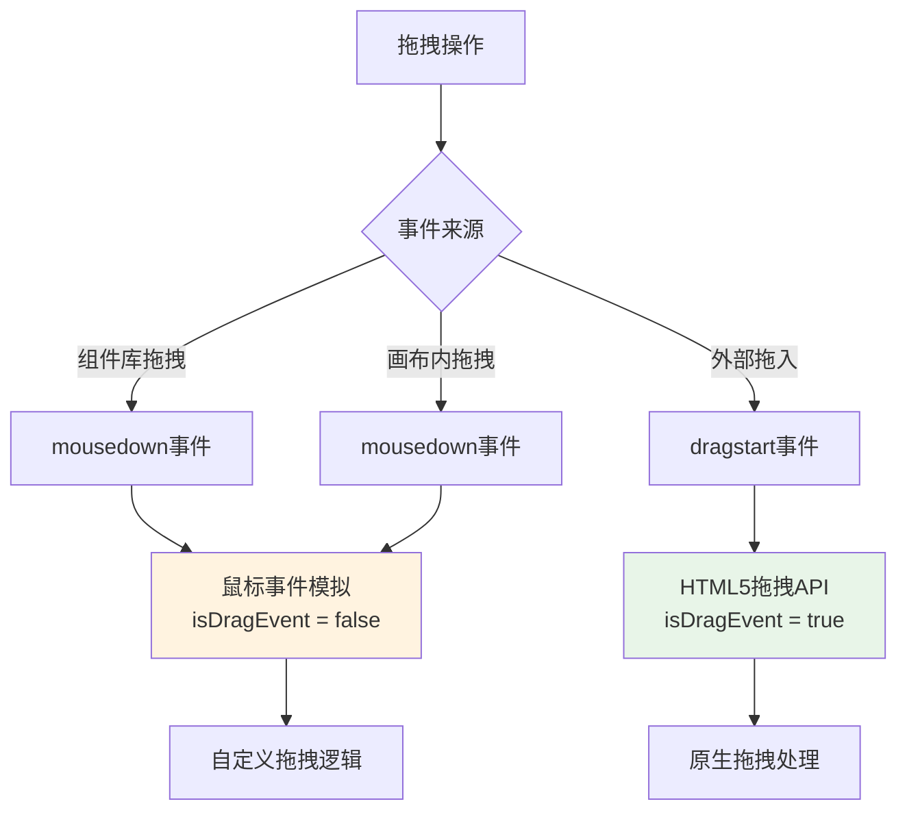
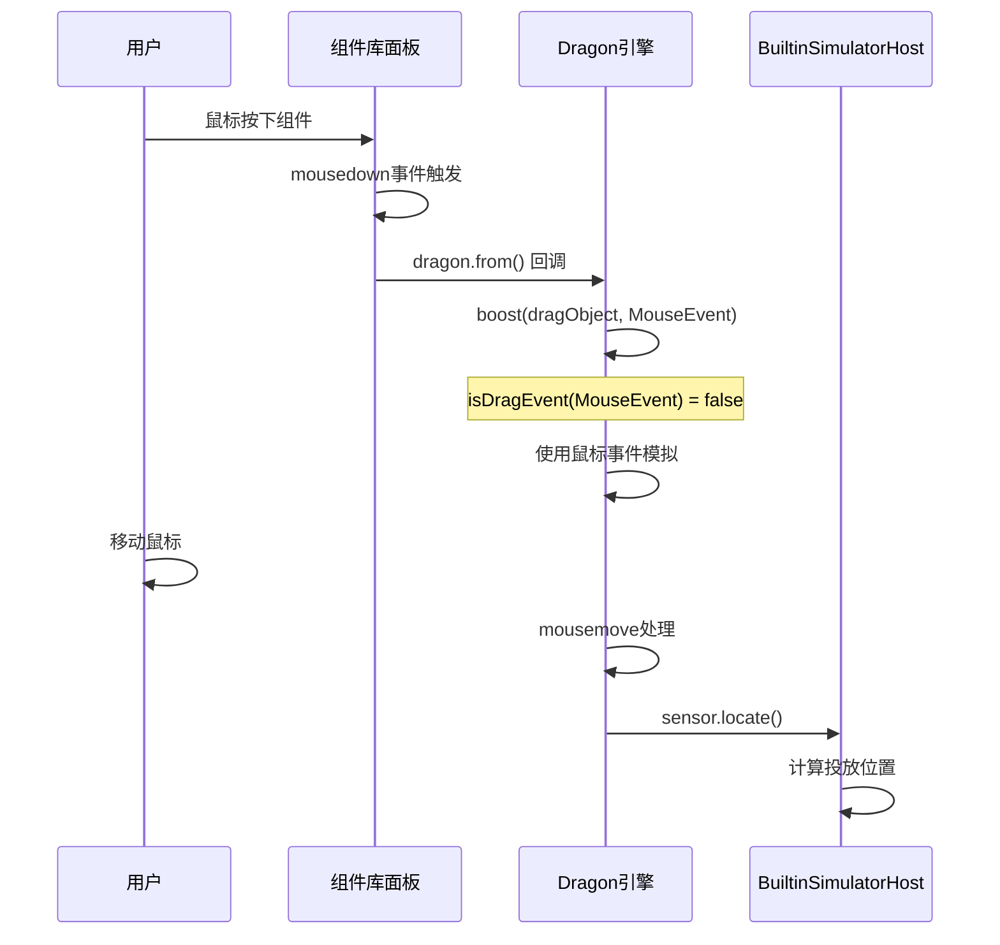
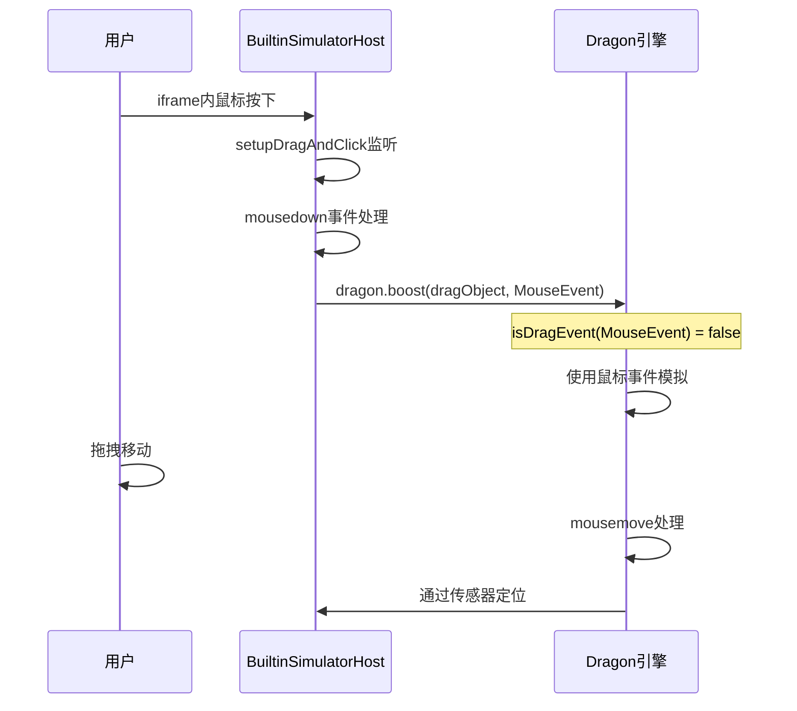

# isDragEvent为false原因分析

## 🎯 问题描述

用户发现在拖动修改位置和拖入组件时，`isDragEvent(boostEvent)`都返回`false`，想了解原因。

## 🔍 isDragEvent函数分析

### **函数定义**
```typescript
// packages/designer/src/designer/dragon.ts:92-94
function isDragEvent(e: any): e is DragEvent {
    return e?.type?.startsWith('drag');
}
```

### **判断逻辑**
- **true条件**：事件类型以'drag'开头（如：dragstart、dragover、dragend、drop等）
- **false条件**：事件类型不以'drag'开头（如：mousedown、mousemove、mouseup等）

## 📋 isDragEvent返回false的原因

### **1. 低代码引擎使用鼠标事件模拟拖拽**

#### **事件源分析**
```typescript
// packages/designer/src/builtin-simulator/host.ts:1080-1210
// 拖拽是从mousedown事件开始的
doc.addEventListener('mousedown', (downEvent: MouseEvent) => {
    // 处理鼠标按下逻辑

    if (isLeftButton && focusNode && !node.contains(focusNode)) {
        // 调用Dragon.boost，传入的是MouseEvent
        designer.dragon.boost({
            type: IPublicEnumDragObjectType.Node,
            nodes,
        }, downEvent, isRGLNode ? rglNode : undefined);
        //     ↑
        //     这里传入的是MouseEvent，不是DragEvent
    }
}, true);
```

#### **事件类型对比**
| 事件源 | 事件类型 | isDragEvent结果 | 说明 |
|-------|----------|-----------------|------|
| **mousedown** | `MouseEvent` | `false` | 鼠标按下事件 |
| **mousemove** | `MouseEvent` | `false` | 鼠标移动事件 |
| **mouseup** | `MouseEvent` | `false` | 鼠标释放事件 |
| **dragstart** | `DragEvent` | `true` | HTML5拖拽开始 |
| **dragover** | `DragEvent` | `true` | HTML5拖拽经过 |
| **drop** | `DragEvent` | `true` | HTML5拖拽放置 |

### **2. HTML5拖拽API vs 鼠标事件模拟**

#### **低代码引擎的拖拽策略**


#### **为什么使用鼠标事件模拟**
```typescript
// 鼠标事件模拟的优势
const mouseSimulationAdvantages = {
    precision: "更精确的拖拽控制",
    customization: "可以自定义拖拽行为",
    crossFrame: "更好的iframe支持",
    feedback: "丰富的视觉反馈",
    compatibility: "更好的浏览器兼容性"
};

// HTML5拖拽API的限制
const html5DragLimitations = {
    customization: "自定义能力有限",
    styling: "拖拽时样式控制困难",
    crossFrame: "跨iframe支持不佳",
    mobile: "移动端支持不完善",
    feedback: "视觉反馈受限"
};
```

## 🔄 两种拖拽模式的处理差异

### **鼠标事件模拟模式**（isDragEvent = false）
```typescript
// packages/designer/src/designer/dragon.ts:628-646
} else {
    // 🔥 鼠标模拟拖拽模式
    this.setNativeSelection(false);  // 禁用文本选择
}

// 注册事件监听器
handleEvents((doc) => {
    if (isBoostFromDragAPI) {
        // HTML5原生拖拽事件
        // ...
    } else {
        // 🔥 鼠标模拟拖拽事件
        doc.addEventListener('mousemove', move, true);    // 鼠标移动
        doc.addEventListener('mouseup', over, true);      // 鼠标释放
    }
    doc.addEventListener('mousedown', over, true);        // 鼠标按下（取消拖拽）
});

// 键盘事件监听
if (!newBie && !isBoostFromDragAPI) {
    handleEvents((doc) => {
        doc.addEventListener('keydown', checkcopy, false); // 复制检查
        doc.addEventListener('keyup', checkcopy, false);
    });
}
```

### **HTML5拖拽API模式**（isDragEvent = true）
```typescript
// packages/designer/src/designer/dragon.ts:611-639
if (isDragEvent(boostEvent)) {
    const { dataTransfer } = boostEvent;

    if (dataTransfer) {
        dataTransfer.effectAllowed = 'all';  // 允许所有拖拽效果

        try {
            // 设置拖拽数据
            dataTransfer.setData('application/json', '{}');
        } catch (ex) {
            // 忽略设置失败
        }
    }

    dragstart();  // 🔥 立即开始拖拽
}

// 注册HTML5拖拽事件
handleEvents((doc) => {
    doc.addEventListener('dragover', move, true);     // 拖拽经过
    didDrop = false;
    doc.addEventListener('drop', drop, true);         // 拖拽放置
    doc.addEventListener('dragend', over, true);      // 拖拽结束
});
```

## 📊 事件处理差异对比

### **功能差异表**
| 功能 | 鼠标模拟 (isDragEvent=false) | HTML5拖拽 (isDragEvent=true) |
|------|------------------------------|------------------------------|
| **拖拽启动** | 需要鼠标移动超过阈值 | 立即启动拖拽 |
| **文本选择** | 主动禁用 | 浏览器自动处理 |
| **复制检查** | 键盘事件监听 | dataTransfer设置 |
| **事件类型** | mousemove/mouseup | dragover/drop/dragend |
| **跨窗口** | 需要自定义处理 | 原生支持 |
| **自定义性** | 完全自定义 | 受浏览器限制 |

### **触发条件差异**
```typescript
// 鼠标模拟拖拽的启动条件
const move = (e: MouseEvent | DragEvent) => {
    if (this._dragging) {
        drag(e);  // 已在拖拽，直接处理
        return;
    }

    // 🔥 关键：需要鼠标移动超过阈值才开始拖拽
    if (isShaken(boostEvent, e)) {
        dragstart();  // 开始拖拽
        drag(e);      // 处理当前移动
    }
    // 未达到阈值：继续等待
};

// HTML5拖拽的启动
if (isDragEvent(boostEvent)) {
    dragstart();  // 🔥 关键：立即开始拖拽，无需等待移动
}
```

## 🎮 实际使用场景分析

### **组件库拖拽场景**
```typescript
// 组件库面板的拖拽实现
class ComponentLibraryPanel {
    setupDragBehavior() {
        // 使用Dragon.from设置拖拽
        const disposeFn = designer.dragon.from(this.panelElement, (e: MouseEvent) => {
            //                                                    ↑
            //                            这里是MouseEvent，所以isDragEvent = false

            const componentMeta = this.getComponentMeta(e.target);
            return {
                type: 'NodeData',  // 新组件数据
                data: componentMeta
            };
        });
    }
}
```

### **画布内拖拽场景**
```typescript
// packages/designer/src/builtin-simulator/host.ts:1196-1203
designer.dragon.boost({
    type: IPublicEnumDragObjectType.Node,
    nodes: selectedNodes,
}, downEvent, isRGLNode ? rglNode : undefined);
//  ↑
//  downEvent是mousedown事件，所以isDragEvent = false
```

### **外部文件拖入场景**（会是true）
```typescript
// 从外部拖拽文件到画布的场景
document.addEventListener('dragenter', (e: DragEvent) => {
    // 这种情况下e是DragEvent，isDragEvent = true

    if (e.dataTransfer?.files.length > 0) {
        // 处理文件拖入
        designer.dragon.boost({
            type: 'FileData',
            files: e.dataTransfer.files
        }, e);  // 这里传入的是DragEvent
    }
});
```

## ⚙️ 事件模式选择的设计考虑

### **鼠标模拟模式的优势**
1. **精确控制**：可以精确控制拖拽的开始、过程和结束
2. **自定义反馈**：完全自定义的视觉反馈和交互
3. **iframe支持**：更好地支持iframe内的拖拽交互
4. **移动端适配**：更容易适配移动设备的触摸操作

### **HTML5拖拽模式的优势**
1. **原生性能**：浏览器原生优化的拖拽性能
2. **跨窗口支持**：自动支持跨窗口、跨应用拖拽
3. **无障碍访问**：更好的屏幕阅读器等辅助工具支持
4. **系统一致性**：与操作系统的拖拽行为保持一致

## 🛠️ 如何在业务中判断拖拽类型

### **检测当前拖拽模式**
```typescript
// 在业务代码中检测拖拽模式
designer.dragon.onDragstart((e) => {
    const dragMode = isDragEvent(e.originalEvent) ? 'html5' : 'mouse-simulation';

    console.log('拖拽模式:', dragMode, {
        eventType: e.originalEvent.type,
        isDragEvent: isDragEvent(e.originalEvent),
        hasDataTransfer: !!(e.originalEvent as any).dataTransfer
    });
});
```

### **适配不同模式的处理**
```typescript
class DragModeAdapter {
    constructor(designer: Designer) {
        designer.dragon.onDrag((e) => {
            const isHtml5Mode = isDragEvent(e.originalEvent);

            if (isHtml5Mode) {
                this.handleHtml5Drag(e);
            } else {
                this.handleMouseSimulationDrag(e);
            }
        });
    }

    handleHtml5Drag(e: ILocateEvent) {
        // HTML5拖拽模式的特殊处理
        const dragEvent = e.originalEvent as DragEvent;
        if (dragEvent.dataTransfer) {
            // 可以访问dataTransfer
            console.log('拖拽效果:', dragEvent.dataTransfer.dropEffect);
        }
    }

    handleMouseSimulationDrag(e: ILocateEvent) {
        // 鼠标模拟模式的特殊处理
        const mouseEvent = e.originalEvent as MouseEvent;
        console.log('鼠标位置:', { x: mouseEvent.clientX, y: mouseEvent.clientY });
    }
}
```

## 📊 事件类型统计

### **常见事件类型分布**
```typescript
// 在实际使用中，事件类型分布大致如下：
const eventTypeDistribution = {
    // 🔥 主要使用鼠标事件（约95%）
    mouseEvents: {
        percentage: 95,
        types: ['mousedown', 'mousemove', 'mouseup'],
        scenarios: [
            '组件库拖拽到画布',
            '画布内组件移动',
            '组件位置调整',
            '组件复制移动'
        ]
    },

    // 🔥 少量使用HTML5拖拽（约5%）
    dragEvents: {
        percentage: 5,
        types: ['dragstart', 'dragover', 'drop', 'dragend'],
        scenarios: [
            '外部文件拖入',
            '跨应用拖拽',
            '某些特殊组件的原生拖拽'
        ]
    }
};
```

## 🔧 不同模式的技术实现

### **鼠标事件模拟拖拽**（主要模式）
```typescript
// 实现原理
class MouseDragSimulation {
    boost(dragObject: any, boostEvent: MouseEvent) {
        // 1. 禁用文本选择
        this.setNativeSelection(false);

        // 2. 等待鼠标移动超过阈值
        const move = (e: MouseEvent) => {
            if (!this._dragging) {
                if (isShaken(boostEvent, e)) {
                    this.startDragging();  // 开始拖拽
                }
            } else {
                this.handleDrag(e);  // 处理拖拽
            }
        };

        // 3. 注册鼠标事件
        document.addEventListener('mousemove', move, true);
        document.addEventListener('mouseup', this.endDrag, true);
    }
}

// 优势
const mouseSimulationBenefits = {
    control: "完全控制拖拽行为",
    feedback: "自定义视觉反馈",
    iframe: "更好的iframe支持",
    threshold: "防抖阈值避免误触发"
};
```

### **HTML5拖拽API**（特殊场景）
```typescript
// 实现原理
class Html5DragImplementation {
    boost(dragObject: any, boostEvent: DragEvent) {
        const { dataTransfer } = boostEvent;

        // 1. 设置拖拽效果
        if (dataTransfer) {
            dataTransfer.effectAllowed = 'all';
            dataTransfer.setData('application/json', '{}');
        }

        // 2. 立即开始拖拽
        this.startDragging();

        // 3. 注册HTML5事件
        document.addEventListener('dragover', this.handleDragOver, true);
        document.addEventListener('drop', this.handleDrop, true);
        document.addEventListener('dragend', this.endDrag, true);
    }
}

// 使用场景
const html5DragScenarios = {
    fileUpload: "文件拖拽上传",
    crossWindow: "跨窗口拖拽",
    nativeIntegration: "与操作系统集成",
    accessibility: "无障碍访问支持"
};
```

## 🎯 实际调用路径分析

### **组件库拖拽调用路径**


### **画布内拖拽调用路径**


## 🔧 如何启用HTML5拖拽模式

### **方式一：组件级别启用**
```typescript
// 在组件上启用HTML5拖拽
class CustomComponent {
    render() {
        return (
            <div
                draggable="true"  // 启用HTML5拖拽
                onDragStart={(e: DragEvent) => {
                    // 这里的e是DragEvent
                    designer.dragon.boost({
                        type: 'NodeData',
                        data: this.getComponentData()
                    }, e);  // 传入DragEvent，isDragEvent = true
                }}
            >
                可拖拽组件
            </div>
        );
    }
}
```

### **方式二：外部拖入处理**
```typescript
// 处理外部文件或数据拖入
class ExternalDragHandler {
    setupExternalDrag() {
        // 监听外部拖入
        document.addEventListener('dragenter', (e: DragEvent) => {
            e.preventDefault();
        });

        document.addEventListener('dragover', (e: DragEvent) => {
            e.preventDefault();
        });

        document.addEventListener('drop', (e: DragEvent) => {
            e.preventDefault();

            // 处理外部拖入，这里isDragEvent = true
            if (e.dataTransfer?.files.length > 0) {
                designer.dragon.boost({
                    type: 'FileData',
                    files: e.dataTransfer.files
                }, e);  // DragEvent
            }
        });
    }
}
```

## 📈 性能和体验对比

### **鼠标模拟的优势**
```typescript
const mouseSimulationFeatures = {
    // 🔥 精确的防抖控制
    preventAccidentalDrag: {
        mechanism: "SHAKE_DISTANCE = 4px",
        benefit: "避免误触发拖拽"
    },

    // 🔥 丰富的状态管理
    stateControl: {
        dragging: "this._dragging状态",
        copyMode: "copy状态动态切换",
        sensors: "智能传感器选择"
    },

    // 🔥 自定义视觉效果
    visualFeedback: {
        dragGhost: "自定义拖拽幽灵",
        dropIndicator: "自定义投放指示器",
        highlighting: "自定义高亮效果"
    }
};
```

### **HTML5拖拽的适用场景**
```typescript
const html5DragUseCases = {
    // 适合的场景
    suitable: [
        "文件上传拖拽",
        "跨应用数据传输",
        "系统级拖拽集成",
        "简单的拖放操作"
    ],

    // 不适合的场景
    notSuitable: [
        "复杂的设计器交互",
        "需要精确位置控制",
        "自定义视觉反馈",
        "iframe内的拖拽"
    ]
};
```

## 🎯 总结

### **isDragEvent为false的根本原因**
1. **设计选择**：低代码引擎主要使用鼠标事件模拟拖拽
2. **事件来源**：拖拽操作起始于`mousedown`事件，而非`dragstart`事件
3. **技术优势**：鼠标模拟提供更好的自定义能力和iframe支持

### **这是正常现象，不是错误**
- ✅ **符合设计预期**：引擎主要依赖鼠标事件模拟
- ✅ **功能完整**：所有拖拽功能都能正常工作
- ✅ **性能优异**：针对设计器场景优化的方案

### **什么时候isDragEvent会是true**
- 外部文件拖入画布
- 从其他应用拖入数据
- 明确设置了`draggable="true"`的元素
- 跨窗口的拖拽操作

**isDragEvent=false是低代码引擎正常的工作模式，体现了引擎对设计器场景的专门优化。**
