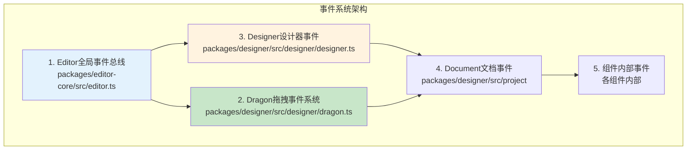

# 低代码引擎事件系统完整指南

## 🎯 概述

低代码引擎采用**多层事件系统**架构，包含Editor事件总线、Dragon拖拽事件、组件内部事件等多个层级，实现了复杂的事件驱动交互。

## 📡 事件系统架构层级

### **事件系统层级图**


## 📋 完整事件列表梳理

### **🔥 Dragon拖拽事件系统**
```typescript
// packages/designer/src/designer/dragon.ts - Dragon.emitter
const dragonEvents = {
    // 核心拖拽事件
    'dragstart': {
        trigger: 'dragon.onDragstart()',
        data: 'ILocateEvent',
        purpose: '拖拽开始通知'
    },
    'drag': {
        trigger: 'dragon.onDrag()',
        data: 'ILocateEvent',
        purpose: '拖拽进行中实时更新'
    },
    'dragend': {
        trigger: 'dragon.onDragend()',
        data: '{dragObject, copy}',
        purpose: '拖拽结束处理'
    },

    // RGL特殊事件
    'rgl.sleeping': {
        trigger: 'RGL区域进入/退出',
        data: 'boolean',
        purpose: '控制RGL系统激活状态'
    },
    'rgl.switch': {
        trigger: 'RGL拖拽开始/结束',
        data: '{action, rglNode}',
        purpose: '控制RGL拖拽流程'
    },
    'rgl.add.placeholder': {
        trigger: 'RGL可放置位置检测',
        data: '{rglNode, fromRglNode, node, event}',
        purpose: '显示RGL拖拽占位符'
    },
    'rgl.remove.placeholder': {
        trigger: 'RGL区域退出或拖拽结束',
        data: '无',
        purpose: '移除RGL拖拽占位符'
    },
    'rgl.drop': {
        trigger: 'RGL组件成功放置',
        data: '{rglNode, node}',
        purpose: '完成RGL布局更新'
    }
};
```

### **🔥 Editor全局事件总线**
```typescript
// packages/editor-core/src/editor.ts - Editor继承EventEmitter
const editorEvents = {
    // 生命周期事件
    'editor.beforeInit': {
        trigger: 'editor.init()执行前',
        data: 'Editor实例',
        purpose: '初始化前的准备工作'
    },
    'editor.afterInit': {
        trigger: 'editor.init()执行后',
        data: 'Editor实例',
        purpose: '初始化完成后的设置'
    },

    // 设计器事件（通过Designer.postEvent转发）
    'dragstart': {
        trigger: 'Designer转发',
        data: 'ILocateEvent',
        purpose: '全局拖拽开始通知'
    },
    'drag': {
        trigger: 'Designer转发',
        data: 'ILocateEvent',
        purpose: '全局拖拽进行通知'
    },
    'dragend': {
        trigger: 'Designer转发',
        data: 'ILocateEvent + DropLocation',
        purpose: '全局拖拽结束通知'
    },
    'selection.change': {
        trigger: '选择状态变化',
        data: 'Selection实例',
        purpose: '节点选择状态变化通知'
    },
    'history.change': {
        trigger: '历史记录变化',
        data: 'History实例',
        purpose: '撤销重做状态变化'
    },
    'document.remove': {
        trigger: '文档移除',
        data: '{id: documentId}',
        purpose: '文档删除通知'
    }
};
```

### **🔥 BuiltinSimulatorHost模拟器事件**
```typescript
// packages/designer/src/builtin-simulator/host.ts
const simulatorEvents = {
    // 组件选择事件
    'designer.builtinSimulator.select': {
        trigger: 'setupDragAndClick中的选择',
        data: '{selected: componentName}',
        purpose: '通知组件被选中'
    },
    'designer.builtinSimulator.contextmenu': {
        trigger: '右键菜单触发',
        data: '{node, originalEvent, componentInstance}',
        purpose: '显示组件右键菜单'
    },

    // 禁用事件控制
    'designer.builtinSimulator.disabledEvents': {
        trigger: '面板操作开始/结束',
        data: '{disabled: boolean}',
        purpose: '暂时禁用画布事件响应'
    }
};
```

### **🔥 Document文档级事件**
```typescript
// packages/designer/src/document/ 相关文件
const documentEvents = {
    // 节点事件
    'node.add': {
        trigger: '节点添加',
        data: '{node, index}',
        purpose: '节点结构变更通知'
    },
    'node.remove': {
        trigger: '节点删除',
        data: '{node, index}',
        purpose: '节点删除通知'
    },
    'node.prop.change': {
        trigger: '节点属性变化',
        data: '{node, prop, oldValue, newValue}',
        purpose: '属性变更通知，触发重渲染'
    },

    // 选择事件
    'selection.change': {
        trigger: '选择状态变更',
        data: 'Selection实例',
        purpose: '选择变化通知'
    }
};
```

## 🛠️ 在业务中监听事件的方法

### **1. 监听全局Editor事件**
```typescript
// 通过Editor事件总线监听
import { editor } from '@alilc/lowcode-engine';

// 监听拖拽事件
const dragListener = editor.eventBus.on('drag', (e) => {
    console.log('全局拖拽事件:', {
        dragType: e.dragObject?.type,
        position: { x: e.globalX, y: e.globalY },
        targetElement: e.target?.tagName
    });
});

// 监听选择变化
const selectionListener = editor.eventBus.on('selection.change', (selection) => {
    console.log('选择变化:', {
        selectedCount: selection.selected.length,
        selectedNodes: selection.selected.map(id => selection.getNode(id)?.componentName)
    });
});

// 清理监听器
// dragListener();
// selectionListener();
```

### **2. 监听Dragon拖拽事件**
```typescript
// 通过Designer的Dragon实例监听
const designer = editor.get('designer');

// 监听拖拽开始
const dragstartListener = designer.dragon.onDragstart((e) => {
    console.log('拖拽开始:', {
        dragObject: e.dragObject,
        eventType: e.originalEvent.type,
        startPosition: { x: e.globalX, y: e.globalY }
    });
});

// 监听RGL事件
const rglSleepingListener = designer.dragon.emitter.on('rgl.sleeping', (sleeping) => {
    console.log('RGL系统状态:', sleeping ? '休眠' : '激活');
});

const rglPlaceholderListener = designer.dragon.emitter.on('rgl.add.placeholder', (data) => {
    console.log('RGL占位符显示:', {
        targetContainer: data.rglNode?.componentName,
        draggedComponent: data.node?.componentName
    });
});
```

### **3. 监听特定文档事件**
```typescript
// 监听当前文档的事件
const currentDocument = designer.project.currentDocument;

if (currentDocument) {
    // 监听选择变化
    currentDocument.selection.onSelectionChange(() => {
        const selectedNodes = currentDocument.selection.getNodes();
        console.log('当前文档选择变化:', selectedNodes.map(n => n.componentName));
    });

    // 监听历史记录变化
    currentDocument.history.onStateChange(() => {
        console.log('历史记录状态:', {
            canUndo: currentDocument.history.getState().canUndo,
            canRedo: currentDocument.history.getState().canRedo
        });
    });
}
```

### **4. 监听模拟器事件**
```typescript
// 监听模拟器特定事件
editor.eventBus.on('designer.builtinSimulator.select', (data) => {
    console.log('组件选中事件:', data.selected);
});

editor.eventBus.on('designer.builtinSimulator.contextmenu', (data) => {
    console.log('右键菜单触发:', {
        componentName: data.node?.componentName,
        position: { x: data.originalEvent.clientX, y: data.originalEvent.clientY }
    });
});

editor.eventBus.on('designer.builtinSimulator.disabledEvents', (data) => {
    console.log('画布事件状态:', data.disabled ? '禁用' : '启用');
});
```

## 🔧 打印事件监听者的方法

### **方法一：通过emitter内省**
```typescript
// 获取特定事件的所有监听者
function printEventListeners(eventName: string) {
    const designer = editor.get('designer');

    // Dragon事件监听者
    const dragonEmitter = designer.dragon.emitter;
    const dragonListeners = dragonEmitter.listeners(eventName);
    console.log(`Dragon事件"${eventName}"的监听者:`, dragonListeners);

    // Editor事件监听者
    const editorListeners = editor.eventBus.listeners(eventName);
    console.log(`Editor事件"${eventName}"的监听者:`, editorListeners);

    // 返回监听者数量
    return {
        dragonListeners: dragonListeners.length,
        editorListeners: editorListeners.length,
        total: dragonListeners.length + editorListeners.length
    };
}

// 使用示例
printEventListeners('drag');
printEventListeners('rgl.add.placeholder');
printEventListeners('selection.change');
```

### **方法二：事件监听代理**
```typescript
// 创建事件监听代理，追踪所有事件
class EventListenerProxy {
    private eventMap = new Map<string, Function[]>();

    wrapEmitter(emitter: any, name: string) {
        const originalOn = emitter.on.bind(emitter);
        const originalEmit = emitter.emit.bind(emitter);

        // 代理on方法
        emitter.on = (event: string, listener: Function) => {
            // 记录监听者
            if (!this.eventMap.has(event)) {
                this.eventMap.set(event, []);
            }
            this.eventMap.get(event)!.push(listener);

            console.log(`[${name}] 新增监听者:`, event, listener.name || '匿名函数');
            return originalOn(event, listener);
        };

        // 代理emit方法
        emitter.emit = (event: string, ...args: any[]) => {
            const listeners = this.eventMap.get(event) || [];
            console.log(`[${name}] 触发事件"${event}"`, {
                listenersCount: listeners.length,
                data: args
            });

            return originalEmit(event, ...args);
        };
    }

    printAllListeners() {
        console.log('=== 所有事件监听者 ===');
        this.eventMap.forEach((listeners, event) => {
            console.log(`事件"${event}": ${listeners.length}个监听者`);
            listeners.forEach((listener, index) => {
                console.log(`  ${index + 1}. ${listener.name || '匿名函数'}`);
            });
        });
    }
}

// 使用方法
const eventProxy = new EventListenerProxy();
const designer = editor.get('designer');

eventProxy.wrapEmitter(designer.dragon.emitter, 'Dragon');
eventProxy.wrapEmitter(editor.eventBus, 'Editor');

// 稍后打印所有监听者
setTimeout(() => {
    eventProxy.printAllListeners();
}, 5000);
```

### **方法三：开发者工具增强**
```typescript
// 在控制台中增强调试能力
(window as any).debugLowcodeEvents = {
    // 监听所有事件
    listenAll() {
        const designer = editor.get('designer');

        // Dragon事件
        const dragonEvents = ['dragstart', 'drag', 'dragend', 'rgl.sleeping', 'rgl.switch', 'rgl.add.placeholder', 'rgl.remove.placeholder', 'rgl.drop'];
        dragonEvents.forEach(eventName => {
            designer.dragon.emitter.on(eventName, (...args) => {
                console.log(`🐉 Dragon事件: ${eventName}`, args);
            });
        });

        // Editor事件
        const editorEvents = ['editor.beforeInit', 'editor.afterInit', 'dragstart', 'drag', 'dragend', 'selection.change', 'history.change'];
        editorEvents.forEach(eventName => {
            editor.eventBus.on(eventName, (...args) => {
                console.log(`📝 Editor事件: ${eventName}`, args);
            });
        });
    },

    // 获取事件监听者
    getListeners(eventName: string) {
        const designer = editor.get('designer');
        return {
            dragon: designer.dragon.emitter.listenerCount(eventName),
            editor: editor.eventBus.listenerCount(eventName)
        };
    },

    // 监听特定事件
    listen(eventName: string) {
        const designer = editor.get('designer');

        const dragonListener = designer.dragon.emitter.on(eventName, (...args) => {
            console.log(`🎯 监听到Dragon事件"${eventName}":`, args);
        });

        const editorListener = editor.eventBus.on(eventName, (...args) => {
            console.log(`🎯 监听到Editor事件"${eventName}":`, args);
        });

        return () => {
            dragonListener();
            editorListener();
        };
    }
};

// 使用方法
debugLowcodeEvents.listenAll();
debugLowcodeEvents.getListeners('drag');
const stopListening = debugLowcodeEvents.listen('rgl.add.placeholder');
```

## 📊 事件配置项详解

### **Dragon事件配置**
```typescript
// 配置Dragon事件行为
const dragonConfig = {
    enableEventLogging: true,         // 启用事件日志
    enablePerformanceTracking: true, // 启用性能追踪
    maxEventPerSecond: 60,           // 最大事件频率
    enableEventDebugger: false       // 启用事件调试器
};

// 应用配置
engineConfig.set('dragonEventConfig', dragonConfig);
```

### **Editor事件配置**
```typescript
// Editor事件总线配置
const editorEventConfig = {
    maxListeners: 200,               // 最大监听器数量
    enableErrorHandling: true,       // 启用错误处理
    eventPrefix: 'lowcode',         // 事件前缀
    enableBroadcast: true           // 启用事件广播
};

// 在Editor构造时应用
editor.setMaxListeners(editorEventConfig.maxListeners);
```

## 🎮 高级事件监听技巧

### **事件过滤和转换**
```typescript
// 事件过滤器
class EventFilter {
    constructor(designer: Designer) {
        // 只监听特定组件的拖拽
        designer.dragon.onDragstart((e) => {
            const draggedComponent = e.dragObject?.nodes?.[0]?.componentName;

            if (this.shouldTrackComponent(draggedComponent)) {
                this.trackComponentDrag(e);
            }
        });

        // 过滤RGL事件
        designer.dragon.emitter.on('rgl.add.placeholder', (data) => {
            if (this.isBusinessRGLContainer(data.rglNode)) {
                this.handleBusinessPlaceholder(data);
            }
        });
    }

    shouldTrackComponent(componentName: string): boolean {
        const trackedComponents = ['Button', 'Input', 'Table'];
        return trackedComponents.includes(componentName);
    }
}
```

### **事件性能监控**
```typescript
// 事件性能监控器
class EventPerformanceMonitor {
    private eventStats = new Map<string, any>();

    constructor(designer: Designer) {
        this.monitorDragonEvents(designer);
        this.monitorEditorEvents(editor);
    }

    monitorDragonEvents(designer: Designer) {
        const events = ['dragstart', 'drag', 'dragend'];

        events.forEach(eventName => {
            designer.dragon.emitter.on(eventName, () => {
                this.recordEvent(eventName);
            });
        });
    }

    recordEvent(eventName: string) {
        const now = Date.now();
        const stats = this.eventStats.get(eventName) || { count: 0, lastTime: 0, avgFreq: 0 };

        stats.count++;
        if (stats.lastTime) {
            const interval = now - stats.lastTime;
            stats.avgFreq = stats.avgFreq ? (stats.avgFreq + interval) / 2 : interval;
        }
        stats.lastTime = now;

        this.eventStats.set(eventName, stats);
    }

    getStats() {
        const result: any = {};
        this.eventStats.forEach((stats, eventName) => {
            result[eventName] = {
                totalCount: stats.count,
                averageFrequency: Math.round(1000 / stats.avgFreq) + 'Hz'
            };
        });
        return result;
    }
}

// 使用方法
const monitor = new EventPerformanceMonitor(designer);
setTimeout(() => {
    console.log('事件性能统计:', monitor.getStats());
}, 30000);
```

## ⚠️ 事件使用注意事项

### **1. 内存泄漏防护**
```typescript
class EventLeakProtection {
    private listeners: Array<() => void> = [];

    addListener(emitter: any, event: string, callback: Function) {
        const removeListener = emitter.on(event, callback);
        this.listeners.push(removeListener);
        return removeListener;
    }

    // 组件卸载时清理所有监听器
    cleanup() {
        this.listeners.forEach(remove => remove());
        this.listeners = [];
    }
}
```

### **2. 事件频率控制**
```typescript
// 高频事件的节流处理
import { throttle } from 'lodash';

const throttledDragHandler = throttle((e: ILocateEvent) => {
    // 处理拖拽事件
    this.updateUI(e);
}, 16); // 60fps

designer.dragon.onDrag(throttledDragHandler);
```

### **3. 错误处理**
```typescript
// 事件监听的错误处理
designer.dragon.onDrag((e) => {
    try {
        // 业务逻辑
        this.handleDrag(e);
    } catch (error) {
        console.error('拖拽事件处理错误:', error);
        // 不阻断其他监听器
    }
});
```

## 📈 事件监听的最佳实践

### **1. 事件分类监听**
```typescript
class EventManager {
    // 按功能分类监听
    setupDragEvents() {
        // 拖拽相关事件
    }

    setupSelectionEvents() {
        // 选择相关事件
    }

    setupDocumentEvents() {
        // 文档相关事件
    }
}
```

### **2. 条件性监听**
```typescript
// 根据配置决定是否监听某些事件
const eventConfig = engineConfig.get('eventConfig', {});

if (eventConfig.enableDragTracking) {
    designer.dragon.onDrag(this.trackDrag);
}

if (eventConfig.enableSelectionAnalytics) {
    editor.eventBus.on('selection.change', this.analyzeSelection);
}
```

## 🎯 总结

### **事件系统的核心价值**
1. **解耦合**：通过事件实现模块间的松耦合通信
2. **可扩展**：支持业务层面的事件监听和扩展
3. **可观测**：提供系统运行状态的可观测性
4. **可调试**：便于开发和调试时的状态追踪

### **监听者分布**
- **Dragon事件**：主要被Designer、插件、调试工具监听
- **Editor事件**：主要被插件、业务代码、分析工具监听
- **Document事件**：主要被UI组件、状态管理器监听

### **调试技巧**
- 使用`debugLowcodeEvents`工具进行全面监听
- 通过事件代理追踪监听者注册
- 使用性能监控器分析事件频率
- 合理使用节流和防抖控制事件频率

**低代码引擎的事件系统是一个完善的事件驱动架构，为复杂的交互和扩展提供了强大的支持。**
