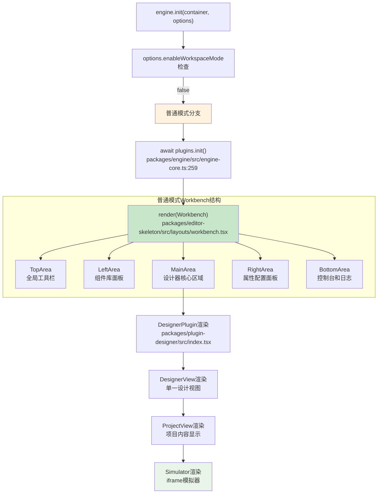
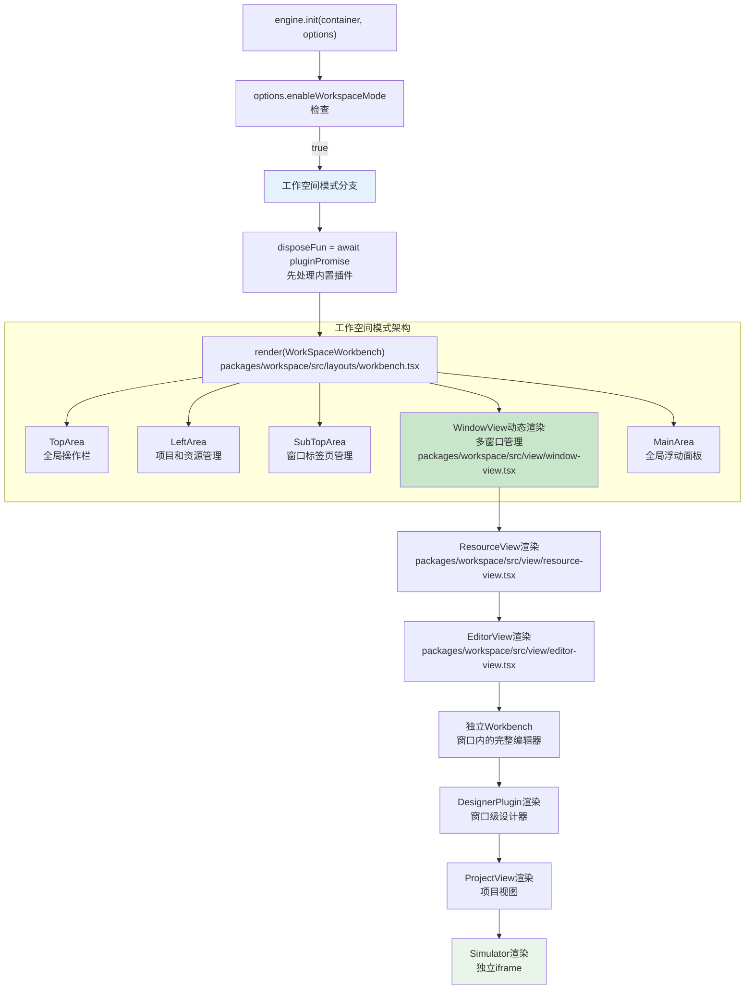
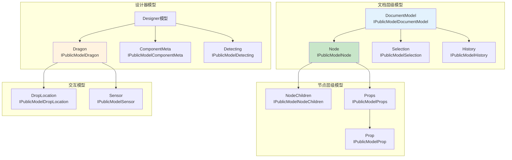
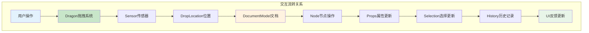

# 工作空间模式与API模型综合分析

## 🎯 两种工作空间模式对比

### **模式判断逻辑**
```typescript
// packages/engine/src/engine-core.ts:237-268
export async function init(container?: HTMLElement, options?: IPublicTypeEngineOptions) {
    // 模式判断
    if (options && options.enableWorkspaceMode) {
        // 🔥 应用级设计模式（工作空间模式）
        render(createElement(WorkSpaceWorkbench, {
            workspace: innerWorkspace,
            className: 'engine-main',
            topAreaItemClassName: 'engine-actionitem',
        }), engineContainer);
    } else {
        // 🔥 普通模式（单窗口模式）
        render(createElement(Workbench, {
            skeleton: innerSkeleton,
            className: 'engine-main',
            topAreaItemClassName: 'engine-actionitem',
        }), engineContainer);
    }
}
```

### **模式差异对比**
| 维度 | 普通模式 | 工作空间模式 |
|------|---------|-------------|
| **组件** | `Workbench` | `WorkSpaceWorkbench` |
| **布局** | 固定区域布局 | 多窗口动态布局 |
| **项目管理** | 单项目 | 多项目并行 |
| **资源管理** | 共享资源 | 独立资源管理 |
| **插件系统** | 全局插件 | 窗口级插件 |
| **状态管理** | 全局状态 | 窗口隔离状态 |

## 🏗️ 普通模式工作流程

### **普通模式渲染流程**


## 🏢 工作空间模式工作流程

### **工作空间模式渲染流程**


### **关键类架构详解**

#### **WorkSpaceWorkbench - 工作空间主容器**
```typescript
// packages/workspace/src/layouts/workbench.tsx:21-127
@observer
export class Workbench extends Component<{
    workspace: Workspace;           // 🔥 工作空间管理器
    config?: EditorConfig;          // 编辑器配置
    components?: PluginClassSet;    // 插件组件集合
}> {
    constructor(props) {
        const { workspace } = props;
        const { skeleton } = workspace;

        // 🔥 核心：构建骨架系统
        skeleton.buildFromConfig(config, components);

        // 监听主题变化
        engineConfig.onGot('theme', (theme) => {
            this.setState({ theme });
        });

        // 监听空工作区组件
        engineConfig.onGot('workspaceEmptyComponent', (component) => {
            this.setState({ workspaceEmptyComponent: component });
        });
    }

    render() {
        const { workspace } = props;
        return (
            <div className="lc-workspace-workbench">
                <SkeletonContext.Provider value={skeleton}>
                    <TopArea />     {/* 全局工具栏 */}
                    <div className="lc-workspace-workbench-body">
                        <LeftArea />     {/* 项目管理 */}
                        <LeftFloatPane />
                        <LeftFixedPane />

                        <div className="lc-workspace-workbench-center">
                            <SubTopArea />   {/* 窗口标签页 */}

                            {/* 🔥 核心：多窗口动态渲染 */}
                            <div className="lc-workspace-workbench-window">
                                {workspace.windows.map((d) => (
                                    <WindowView
                                        active={d.id === workspace.window?.id}
                                        window={d}
                                        key={d.id}
                                    />
                                ))}

                                {/* 空工作区处理 */}
                                {!workspace.windows.length && WorkspaceEmptyComponent ? (
                                    <WorkspaceEmptyComponent />
                                ) : null}
                            </div>
                        </div>

                        <MainArea />    {/* 全局浮动面板 */}
                        <BottomArea />  {/* 全局控制台 */}
                    </div>
                    <TipContainer />    {/* 全局提示 */}
                </SkeletonContext.Provider>
            </div>
        );
    }
}
```

#### **WindowView - 窗口视图管理**
```typescript
// packages/workspace/src/view/window-view.tsx:8-38
@observer
export class WindowView extends PureComponent<{
    window: EditorWindow;  // 窗口实例
    active: boolean;       // 是否激活
}> {
    render() {
        const { active } = this.props;
        const { resource, initReady, url } = this.props.window;

        // 未初始化完成时显示加载
        if (!initReady) {
            const Loading = engineConfig.get('loadingComponent', BuiltinLoading);
            return <div className={`workspace-engine-main ${active ? 'active' : ''}`}>
                <Loading />
            </div>;
        }

        // webview类型资源
        if (resource.type === 'webview' && url) {
            return <DesignerView url={url} viewName={resource.name} />;
        }

        // 常规editor类型资源
        return (
            <div className={`workspace-engine-main ${active ? 'active' : ''}`}>
                <ResourceView resource={resource} window={this.props.window} />
            </div>
        );
    }
}
```

#### **EditorWindow - 编辑器窗口**
```typescript
// packages/workspace/src/window.ts:47-253
export class EditorWindow implements IEditorWindow {
    id: string;                                    // 窗口唯一标识
    resource: IResource;                           // 关联的资源
    editorViews: Map<string, Context>;             // 编辑器视图映射
    @obx initReady = false;                        // 初始化状态

    async init() {
        // 1. 初始化视图类型
        await this.initViewTypes();

        // 2. 执行视图初始化
        await this.execViewTypesInit();

        // 3. 等待渲染器就绪
        await Promise.all(Array.from(this.editorViews.values()).map(d =>
            d.onSimulatorRendererReady()
        ));

        // 4. 获取资源URL
        this.url = await this.resource.url();

        // 5. 设置默认视图
        this.setDefaultViewName();

        // 6. 标记初始化完成
        this.initReady = true;

        // 7. 检查队列中的窗口
        this.workspace.checkWindowQueue();

        // 8. 激活窗口
        this.updateState(WINDOW_STATE.active);
    }
}
```

## 📋 低代码引擎核心模型API详解

### **🔥 核心模型继承关系**


### **📊 模型API详细分析**

#### **DocumentModel - 文档模型**
```typescript
interface IPublicModelDocumentModel {
    // 🔥 核心属性
    readonly id: string;                    // 文档唯一标识
    readonly rootNode: IPublicModelNode;    // 根节点
    readonly selection: IPublicModelSelection; // 选择管理器
    readonly history: IPublicModelHistory;  // 历史记录
    readonly isBlank: boolean;             // 是否为空白文档

    // 🔥 核心方法
    importSchema(schema: IPublicTypeProjectSchema): void;  // 导入Schema
    exportSchema(): IPublicTypeProjectSchema;              // 导出Schema
    checkNesting(target: IPublicModelNode, source: any): boolean; // 检查嵌套规则
    createNode(data: IPublicTypeNodeData): IPublicModelNode;      // 创建节点
    removeNode(node: IPublicModelNode): void;                     // 移除节点

    // 使用场景
    scenarios: [
        "页面Schema的导入导出",
        "节点的创建和删除",
        "嵌套规则的验证",
        "文档级状态管理"
    ];
}
```

#### **Node - 节点模型**
```typescript
interface IPublicModelNode {
    // 🔥 基础属性
    readonly id: string;                    // 节点ID
    readonly componentName: string;         // 组件名称
    readonly props: IPublicModelProps;      // 属性集合
    readonly children: IPublicModelNodeChildren; // 子节点集合
    readonly parent: IPublicModelNode | null;    // 父节点

    // 🔥 状态属性
    readonly isContainer: boolean;          // 是否为容器（已废弃）
    readonly isContainerNode: boolean;      // 是否为容器节点
    readonly isRootNode: boolean;          // 是否为根节点
    readonly isLeaf: boolean;              // 是否为叶子节点

    // 🔥 核心方法
    select(): void;                        // 选中节点
    hover(flag?: boolean): void;           // 悬停状态
    remove(): void;                        // 移除节点
    insertBefore(node: any, ref?: any): void; // 前插入
    insertAfter(node: any, ref?: any): void;  // 后插入
    getDOMNode(): Element | null;          // 获取DOM元素
    contains(node: IPublicModelNode): boolean; // 包含关系检查

    // 使用场景
    scenarios: [
        "组件的增删改操作",
        "节点关系的建立和查询",
        "DOM操作和事件处理",
        "属性和子节点管理"
    ];
}
```

#### **Dragon - 拖拽模型**
```typescript
interface IPublicModelDragon {
    // 🔥 核心属性
    readonly dragging: boolean;            // 是否正在拖拽
    readonly activeSensor: IPublicModelSensor; // 活跃传感器

    // 🔥 核心方法
    boost(dragObject: IPublicModelDragObject, boostEvent: Event): void; // 启动拖拽
    from(shell: Element, boost: Function): Function;  // 监听拖拽源
    addSensor(sensor: IPublicModelSensor): void;      // 添加传感器
    removeSensor(sensor: IPublicModelSensor): void;   // 移除传感器

    // 🔥 事件监听
    onDragstart(callback: Function): Function;        // 拖拽开始
    onDrag(callback: Function): Function;             // 拖拽进行
    onDragend(callback: Function): Function;          // 拖拽结束

    // 使用场景
    scenarios: [
        "组件库拖拽实现",
        "画布内拖拽交互",
        "自定义拖拽行为",
        "拖拽状态监控"
    ];

    // 使用示例
    usage: `
        // 设置拖拽源
        const disposeFn = dragon.from(element, (e) => ({
            type: 'NodeData',
            data: componentMeta
        }));

        // 监听拖拽事件
        dragon.onDrag((e) => {
            console.log('拖拽位置:', e.globalX, e.globalY);
        });
    `;
}
```

### **🔧 模型的引入和使用方式**

#### **通过Shell API引入**
```typescript
// 标准引入方式
import { project, material, canvas, common } from '@alilc/lowcode-engine';

// 获取模型实例
const currentDocument = project.getCurrentDocument();  // DocumentModel
const rootNode = currentDocument.rootNode;             // Node
const selection = currentDocument.selection;           // Selection
const dragon = common.designerCabin.dragon;           // Dragon
```

#### **通过Editor实例获取**
```typescript
// 高级使用方式
const editor = globalThis.editor;  // 获取Editor实例
const designer = editor.get('designer');  // 获取Designer实例

// 访问内部模型
const project = designer.project;                      // Project
const currentDocument = project.currentDocument;       // DocumentModel
const dragon = designer.dragon;                       // Dragon
const detecting = designer.detecting;                 // Detecting
```

#### **在插件中使用**
```typescript
// 插件上下文中使用
export function MyPlugin(ctx: IPublicModelPluginContext) {
    const { project, material, canvas, common } = ctx;

    return {
        init() {
            // 监听文档变化
            project.onCurrentDocumentChange((doc) => {
                console.log('文档切换:', doc?.fileName);
            });

            // 监听拖拽事件
            common.designerCabin.dragon.onDrag((e) => {
                console.log('插件监听拖拽:', e);
            });

            // 监听选择变化
            project.getCurrentDocument()?.selection.onSelectionChange((ids) => {
                console.log('插件监听选择:', ids);
            });
        }
    };
}
```

## 🎯 模型间的连接交互

### **核心交互关系**


### **数据流向分析**
1. **用户交互** → Dragon捕获 → Sensor定位 → 创建DropLocation
2. **DropLocation** → DocumentModel验证 → Node操作 → Props更新
3. **状态变更** → Selection更新 → History记录 → UI重渲染

## 📊 模型使用的注意事项

### **1. 异步操作处理**
```typescript
// 很多模型操作是异步的
const document = await project.openDocument(schema);
await material.setAssets(newAssets);
const component = await material.loadRemoteComponent(url);
```

### **2. 事件监听清理**
```typescript
// 必须清理事件监听器
const dispose1 = project.onCurrentDocumentChange(handler);
const dispose2 = dragon.onDragstart(handler);

// 组件卸载时清理
componentWillUnmount() {
    dispose1();
    dispose2();
}
```

### **3. 状态响应式管理**
```typescript
// 模型状态是响应式的（MobX）
import { autorun, reaction } from 'mobx';

// 响应节点变化
autorun(() => {
    const selectedNodes = selection.getNodes();
    updatePropertyPanel(selectedNodes);
});

// 响应属性变化
reaction(
    () => node.props.get('title').getValue(),
    (title) => updateTitle(title)
);
```

## 🎯 总结

### **工作空间模式的核心价值**
- **多项目并行**：支持同时编辑多个项目
- **窗口隔离**：每个窗口独立的状态和插件
- **资源管理**：灵活的资源类型和视图管理
- **扩展性强**：支持自定义资源类型和视图

### **API模型的设计特点**
- **层次清晰**：从Document到Node到Prop的清晰层级
- **功能完整**：覆盖设计器的所有核心功能
- **类型安全**：完整的TypeScript类型定义
- **响应式**：基于MobX的响应式状态管理

### **使用建议**
1. **普通模式**：适合单一项目的简单编辑场景
2. **工作空间模式**：适合复杂的多项目管理场景
3. **API选择**：根据使用场景选择合适的API层级
4. **性能考虑**：合理使用响应式特性，避免过度监听

**低代码引擎通过双模式架构和完善的API模型，为不同复杂度的应用场景提供了灵活而强大的支持。**
