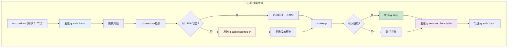

# 044-RGL组件特性深度分析

## 概述

基于 `engine-core.js` 源码分析，RGL（React Grid Layout）组件是低代码引擎中的特殊组件类型，提供了磁贴布局功能。与普通组件相比，RGL组件具有独特的布局机制、拖拽处理、事件系统和渲染特性。

## 🏗️ 1. 核心布局特性

### 1.1 RGL容器标识

```typescript
// engine-core.js 行 29280, 29386-29400
class Node {
    constructor() {
        this._isRGLContainer = false;  // RGL容器标识
    }

    get isRGLContainer() {
        return !!this._isRGLContainer;
    }

    set isRGLContainer(status) {
        this._isRGLContainer = status;
    }

    // 别名属性
    get isRGLContainerNode() {
        return !!this._isRGLContainer;
    }
}
```

### 1.2 getRGL方法 - 磁贴布局信息获取

```typescript
// engine-core.js 行 30378-30395
Node.prototype.getRGL = function() {
    var isContainerNode = this.isContainer();
    var isEmptyNode = this.isEmpty();
    var isRGLContainerNode = this.isRGLContainer;
    var isRGLNode = this.getParent()?.isRGLContainer;

    // 🔥 关键逻辑：判断是否为RGL相关节点
    var isRGL = isRGLContainerNode ||
                (isRGLNode && (!isContainerNode || !isEmptyNode));

    var rglNode = isRGLContainerNode ? this :
                  (isRGL ? this.getParent() : null);

    return {
        isContainerNode,
        isEmptyNode,
        isRGLContainerNode,
        isRGLNode,          // 是否在RGL容器内
        isRGL,              // 是否参与RGL布局
        rglNode             // RGL容器节点引用
    };
};
```

### 1.3 Layout 属性管理

```typescript
// RGL组件通过layout属性存储网格布局信息
// 每个子节点通过fieldId与layout项关联

// 获取layout数组
var layout = rglNode.getPropValue('layout') || [];

// layout项结构：
{
    i: "fieldId",        // 唯一标识，对应节点的fieldId
    x: 0,               // 网格X位置
    y: 0,               // 网格Y位置
    w: 4,               // 网格宽度
    h: 2,               // 网格高度
    minW: 1,            // 最小宽度
    minH: 1,            // 最小高度
    // ...其他React Grid Layout属性
}
```

---

## 🎯 2. 特殊拖拽机制

### 2.1 拖拽开始识别

```typescript
// engine-core.js 行 34687-34698
var rglNode = node?.getParent();
var isRGLNode = rglNode?.isRGLContainer;

if (isRGLNode) {
    // 🔥 特殊处理1：跳过resize handle
    if (downEvent.target.classList.contains('react-resizable-handle')) {
        return; // 不处理resize操作
    }

    // 🔥 特殊处理2：禁止多选
    isMulti = false;

    // 🔥 特殊处理3：发送RGL切换事件
    designer.dragon.emitter.emit('rgl.switch', {
        action: 'start',
        rglNode: rglNode
    });
} else {
    // 普通组件：阻止原生拖拽
    downEvent.stopPropagation();
    downEvent.preventDefault();
}
```

### 2.2 拖拽进行中的特殊逻辑

```typescript
// engine-core.js 行 37853-37888
if (isRGL) {
    // 🔥 启用RGL拖拽模式
    this.emitter.emit('rgl.sleeping', false);

    // 🔥 同一RGL容器内拖拽检查
    if (fromRglNode && fromRglNode.id === rglNode.id) {
        console.log('是从同一个RGL节点内拖拽');
        designer.clearLocation();
        this.clearState();
        this.emitter.emit('drag', locateEvent);
        return; // 直接返回，不进行位置定位
    }

    // 🔥 跨RGL容器拖拽处理
    this._canDrop = !!(sensor?.locate(locateEvent));
    if (this._canDrop) {
        // 发送占位符添加事件
        this.emitter.emit('rgl.add.placeholder', {
            rglNode: rglNode,
            fromRglNode: fromRglNode,
            node: locateEvent.dragObject?.nodes[0],
            event: e
        });

        designer.clearLocation();
        this.clearState();
        this.emitter.emit('drag', locateEvent);
        return;
    }
} else {
    // 非RGL：移除占位符
    this.emitter.emit('rgl.remove.placeholder');
    this.emitter.emit('rgl.sleeping', true);
}
```

### 2.3 拖拽结束的特殊处理

```typescript
// engine-core.js 行 37957-37977
if (isRGL && this._canDrop && this._dragging) {
    var tarNode = dragObject && dragObject.nodes?.[0];

    if (tarNode && rglNode.id !== tarNode.id) {
        // 🔥 避免死循环检查
        this.emitter.emit('rgl.drop', {
            rglNode: rglNode,
            node: tarNode
        });

        // 选中投放的节点
        var selection = designer.project.currentDocument?.selection;
        selection?.select(tarNode.id);
    }
}

// 🔥 清理占位符
this.emitter.emit('rgl.remove.placeholder');
```

---

## 🎨 3. 专用事件系统

### 3.1 RGL事件类型

| 事件名 | 触发时机 | 参数 | 作用 |
|--------|----------|------|------|
| `rgl.switch` | 拖拽开始/结束 | `{action: 'start/end', rglNode}` | 切换RGL拖拽状态 |
| `rgl.sleeping` | 拖拽进行中 | `boolean` | 控制RGL是否处于睡眠状态 |
| `rgl.add.placeholder` | 可投放时 | `{rglNode, fromRglNode, node, event}` | 添加投放占位符 |
| `rgl.remove.placeholder` | 拖拽结束 | 无 | 移除投放占位符 |
| `rgl.drop` | 确认投放 | `{rglNode, node}` | 执行RGL投放逻辑 |

### 3.2 事件处理流程图



---

## 🔄 4. 复制与布局同步

### 4.1 RGL节点复制特殊处理

```typescript
// engine-core.js 行 39976-39993
if (isRGL) {
    // 🔥 复制layout信息
    var layout = rglNode.getPropValue('layout') || [];

    // 找到当前节点的layout配置
    var curLayout = layout.filter(function (item) {
        return item.i === node.getPropValue('fieldId');
    });

    if (curLayout && curLayout[0]) {
        // 创建新的layout项
        layout.push({
            ...curLayout[0],
            i: newNode.getPropValue('fieldId')  // 使用新节点的fieldId
        });

        // 更新RGL容器的layout属性
        rglNode.setPropValue('layout', layout);

        // 🔥 滚动到新位置
        setTimeout(() => {
            newNode.document.project.simulatorHost.scrollToNode(newNode);
        }, 10);
    }
}
```

### 4.2 FieldId关联机制

```typescript
// RGL子节点必须有fieldId属性
// fieldId用于关联layout中的配置项

// 节点创建时生成唯一fieldId
const fieldId = generateUniqueId();
node.setPropValue('fieldId', fieldId);

// layout中对应的配置
const layoutItem = {
    i: fieldId,  // 关联节点
    x: 0, y: 0, w: 4, h: 2,
    // ...其他布局属性
};
```

---

## 🎛️ 5. 渲染与交互特性

### 5.1 Resize Handle支持

```typescript
// RGL组件支持resize功能
// 通过react-resizable-handle实现

// 拖拽时跳过resize handle
if (downEvent.target.classList.contains('react-resizable-handle')) {
    return; // 不触发拖拽逻辑
}
```

### 5.2 多选禁用

```typescript
// RGL节点禁用多选功能
if (isRGLNode) {
    isMulti = false;  // 强制禁用多选
}
```

### 5.3 选中状态特殊处理

```typescript
// RGL节点的选中不受鼠标抖动影响
if (!isShaken(downEvent, e) || isRGLNode) {
    // RGL节点即使有轻微抖动也认为是选中操作
    node.select();
}
```

---

## 🔍 6. 与普通组件的核心差异

### 6.1 特性对比表

| 特性 | 普通组件 | RGL组件 |
|------|----------|---------|
| **布局方式** | 流式/固定布局 | 网格磁贴布局 |
| **拖拽机制** | sensor定位系统 | RGL专用拖拽逻辑 |
| **多选支持** | 支持多选 | 禁用多选 |
| **Resize功能** | 不支持 | 内置resize handle |
| **事件系统** | 标准拖拽事件 | RGL专用事件 |
| **复制行为** | 简单节点复制 | 复制+layout同步 |
| **位置存储** | 样式属性 | layout数组 |

### 6.2 布局数据结构差异

```typescript
// 普通组件：样式驱动
<div style={{
    position: 'absolute',
    left: '100px',
    top: '200px',
    width: '300px',
    height: '150px'
}}>
    普通组件
</div>

// RGL组件：layout数组驱动
props.layout = [
    {
        i: 'item1',     // 对应fieldId
        x: 0, y: 0,     // 网格坐标
        w: 4, h: 2,     // 网格尺寸
        minW: 2,        // 最小宽度
        minH: 1         // 最小高度
    }
];
```

---

## 🚀 7. 性能与用户体验优化

### 7.1 睡眠机制

```typescript
// 通过rgl.sleeping事件控制性能
this.emitter.emit('rgl.sleeping', false);  // 激活RGL
this.emitter.emit('rgl.sleeping', true);   // 休眠RGL
```

### 7.2 占位符预览

```typescript
// 实时显示投放位置预览
this.emitter.emit('rgl.add.placeholder', {
    rglNode,
    fromRglNode,
    node,
    event
});
```

### 7.3 滚动到位置

```typescript
// 自动滚动到新创建/移动的节点位置
setTimeout(() => {
    simulatorHost.scrollToNode(newNode);
}, 10);
```

---

## 💡 8. 业务应用场景

### 8.1 适用场景

1. **仪表板布局**：数据可视化面板
2. **拖拽网格**：卡片式内容管理
3. **响应式布局**：自适应网格系统
4. **组件面板**：可调整大小的组件容器

### 8.2 技术优势

1. **性能优化**：通过睡眠机制减少不必要的计算
2. **用户体验**：实时预览和平滑动画
3. **数据同步**：layout与节点状态自动同步
4. **扩展性好**：基于成熟的React Grid Layout

---

## 🔧 9. 调试与问题排查

### 9.1 关键调试点

```typescript
// 1. 检查RGL标识
console.log('isRGLContainer:', node.isRGLContainer);

// 2. 检查layout数据
console.log('layout:', rglNode.getPropValue('layout'));

// 3. 检查fieldId关联
console.log('fieldId:', node.getPropValue('fieldId'));

// 4. 监听RGL事件
dragon.emitter.on('rgl.drop', (data) => {
    console.log('RGL drop:', data);
});
```

### 9.2 常见问题

1. **拖拽失效**：检查isRGLContainer设置
2. **layout不同步**：检查fieldId是否正确设置
3. **resize冲突**：确认react-resizable-handle正确处理
4. **性能问题**：检查睡眠机制是否正常工作

---

## 📝 10. 总结

RGL组件作为低代码引擎的特殊组件类型，通过以下核心特性实现了强大的网格布局功能：

1. **布局管理**：基于layout数组的网格布局系统
2. **特殊拖拽**：专用的拖拽逻辑和事件系统
3. **性能优化**：睡眠机制和状态缓存
4. **用户体验**：实时预览、自动滚动、resize支持
5. **数据同步**：layout与节点状态自动关联

这些特性使得RGL组件能够提供类似于专业仪表板工具的用户体验，是低代码引擎中处理复杂布局需求的重要技术方案。