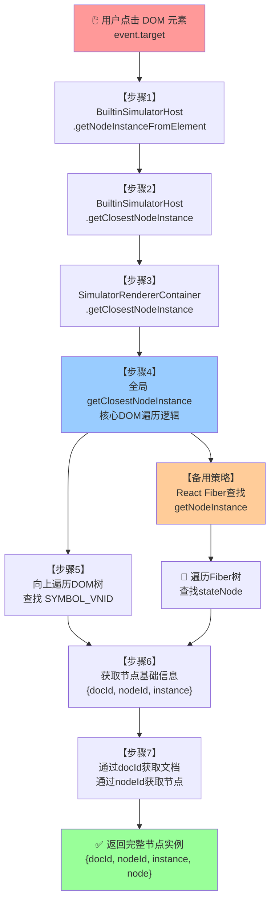

# setupDragAndClick 中 getNodeInstanceFromElement 执行链深度分析

## 📋 概述

`setupDragAndClick` 函数是低代码引擎中处理鼠标点击和拖拽事件的核心函数，其中 `getNodeInstanceFromElement` 方法负责将 DOM 元素映射回对应的节点实例。本文详细分析该方法的完整执行链。

## 🎯 主要调用入口

### setupDragAndClick 函数调用位置

```typescript
// packages/designer/src/builtin-simulator/host.ts:1080-1260
setupDragAndClick() {
    const { designer } = this;
    const doc = this.contentDocument!;

    // 监听 mousedown 事件
    doc.addEventListener('mousedown', (downEvent: MouseEvent) => {
        // 🔥 关键调用：从 DOM 元素获取节点实例
        const nodeInst = this.getNodeInstanceFromElement(downEvent.target);
        const { focusNode } = documentModel;

        // 🔍 获取最近的可点击节点
        const node = getClosestClickableNode(nodeInst?.node || focusNode, downEvent);

        // ... 后续处理逻辑
    });
}
```

## 🔄 完整执行链分析

### 第一层：BuiltinSimulatorHost.getNodeInstanceFromElement

**位置**: `packages/designer/src/builtin-simulator/host.ts:1602-1618`

```typescript
/**
 * 🎯 【第一步】通过 DOM 节点获取完整节点实例信息
 * 这是从 DOM 元素到节点实例转换的入口方法
 */
getNodeInstanceFromElement(target: Element | null): IPublicTypeNodeInstance<IPublicTypeComponentInstance, INode> | null {
    // 🚫 空值检查
    if (!target) {
        return null;
    }

    // 🔍 【关键调用】委托给底层渲染器获取基础节点实例
    const nodeInstance = this.getClosestNodeInstance(target);
    if (!nodeInstance) {
        return null;
    }

    // 📄 通过文档ID获取文档实例
    const { docId } = nodeInstance;
    const doc = this.project.getDocument(docId)!;

    // 🎯 通过节点ID获取完整节点对象
    const node = doc.getNode(nodeInstance.nodeId);

    // 📦 返回完整的节点实例信息
    return {
        ...nodeInstance,    // 包含：docId, nodeId, instance
        node,              // 完整的节点对象
    };
}
```

**功能要点**:

- ✅ 输入验证和空值处理
- 🔄 委托给 `getClosestNodeInstance` 获取基础实例
- 📋 通过 docId 和 nodeId 获取完整节点对象
- 📦 组装完整的节点实例信息

### 第二层：BuiltinSimulatorHost.getClosestNodeInstance

**位置**: `packages/designer/src/builtin-simulator/host.ts:1496-1501`

```typescript
/**
 * 🔄 【第二步】委托给渲染器处理
 * 这里是一个代理方法，实际逻辑在渲染器中实现
 */
getClosestNodeInstance(
    from: IPublicTypeComponentInstance,
    specId?: string,
): IPublicTypeNodeInstance<IPublicTypeComponentInstance> | null {
    // 🎯 委托给渲染器的同名方法
    return this.renderer?.getClosestNodeInstance(from, specId) || null;
}
```

**功能要点**:

- 🔄 简单的代理方法，委托给渲染器处理
- 🎯 渲染器负责具体的DOM遍历和节点查找逻辑

### 第三层：SimulatorRendererContainer.getClosestNodeInstance

**位置**: `packages/react-simulator-renderer/src/renderer.ts:443-445`

```typescript
/**
 * 🔄 【第三步】渲染器容器的代理方法
 */
getClosestNodeInstance(from: ReactInstance, nodeId?: string): IPublicTypeNodeInstance<ReactInstance> | null {
    // 🎯 调用全局的 getClosestNodeInstance 函数
    return getClosestNodeInstance(from, nodeId);
}
```

**功能要点**:

- 🔄 再次委托给全局函数处理
- 🎯 保持接口一致性，实际逻辑在全局函数中

### 第四层：全局 getClosestNodeInstance 函数（核心实现）

**位置**: `packages/react-simulator-renderer/src/renderer.ts:614-642`

```typescript
/**
 * 🔥 【第四步】核心实现：从DOM元素向上查找节点实例
 * 这是整个调用链的核心逻辑所在
 */
function getClosestNodeInstance(from: ReactInstance, specId?: string): IPublicTypeNodeInstance<ReactInstance> | null {
    let el: any = from;

    // 🎯 【步骤1】处理不同类型的输入
    if (el) {
        if (isElement(el)) {
            // DOM 元素：缓存 React 键值
            el = cacheReactKey(el);
        } else {
            // React 实例：直接从 Fiber 节点获取
            return getNodeInstance(getReactInternalFiber(el), specId);
        }
    }

    // 🔄 【步骤2】向上遍历 DOM 树查找节点标识
    while (el) {
        // 🏷️ 检查元素是否有节点ID标识（SYMBOL_VNID）
        if (SYMBOL_VNID in el) {
            const nodeId = el[SYMBOL_VNID];    // 节点ID
            const docId = el[SYMBOL_VDID];     // 文档ID

            // 🎯 如果没有指定特定节点ID，或者匹配指定ID，返回结果
            if (!specId || specId === nodeId) {
                return {
                    docId,      // 文档ID
                    nodeId,     // 节点ID
                    instance: el, // DOM 实例
                };
            }
        }

        // 🧬 检查 React Fiber 节点
        if (el[REACT_KEY]) {
            return getNodeInstance(el[REACT_KEY], specId);
        }

        // ⬆️ 继续向上查找父元素
        el = el.parentElement;
    }

    // 🚫 未找到任何节点实例
    return null;
}
```

**功能要点**:

- 🎯 处理两种输入类型：DOM 元素和 React 实例
- 🔄 向上遍历 DOM 树查找带有节点标识的元素
- 🏷️ 查找特殊符号 `SYMBOL_VNID` 和 `SYMBOL_VDID`
- 🧬 备用策略：通过 React Fiber 节点查找
- 📦 返回包含文档ID、节点ID和实例的完整信息

### 第五层：getNodeInstance 辅助函数（Fiber节点处理）

**位置**: `packages/react-simulator-renderer/src/renderer.ts:644-659`

```typescript
/**
 * 🧬 【第五步】通过 React Fiber 节点获取节点实例
 * 用于处理 React 组件实例的情况
 */
function getNodeInstance(fiberNode: any, specId?: string): IPublicTypeNodeInstance<ReactInstance> | null {
    // 🔍 获取 Fiber 节点对应的实例
    const instance = fiberNode?.stateNode;

    // 🏷️ 检查实例是否有节点标识
    if (instance && SYMBOL_VNID in instance) {
        const nodeId = instance[SYMBOL_VNID];
        const docId = instance[SYMBOL_VDID];

        // 🎯 匹配指定节点ID（如果有）
        if (!specId || specId === nodeId) {
            return {
                docId,
                nodeId,
                instance,
            };
        }
    }

    // 🔄 递归查找父 Fiber 节点
    if (!instance && !fiberNode?.return) return null;
    return getNodeInstance(fiberNode?.return);
}
```

**功能要点**:

- 🧬 处理 React Fiber 节点结构
- 🔍 从 `stateNode` 获取组件实例
- 🏷️ 检查实例上的节点标识符号
- 🔄 递归向上查找父 Fiber 节点

## 🔑 关键技术点

### 1. 节点标识符号系统

```typescript
// 全局符号，用于标识节点信息
const SYMBOL_VNID = Symbol('_LCNodeId');  // 节点ID符号
const SYMBOL_VDID = Symbol('_LCDocId');   // 文档ID符号
```

**工作机制**:

- 🏷️ 在组件渲染时，会在DOM元素上设置这些符号属性
- 🔍 查找时通过检查这些符号来确定元素对应的节点
- 🔐 使用 Symbol 确保属性不会与用户代码冲突

### 2. 双重查找策略

#### 策略A：DOM 元素直接查找

```typescript
// 向上遍历DOM树，查找带有节点标识的元素
while (el) {
    if (SYMBOL_VNID in el) {
        // 找到节点标识，返回结果
        return { docId, nodeId, instance: el };
    }
    el = el.parentElement; // 向上查找
}
```

#### 策略B：React Fiber 查找

```typescript
// 通过React内部的Fiber节点结构查找
if (el[REACT_KEY]) {
    return getNodeInstance(el[REACT_KEY], specId);
}
```

### 3. 缓存机制

```typescript
/**
 * 🎯 cacheReactKey 函数
 * 缓存React键值，提高后续查找效率
 */
function cacheReactKey(el: Element): Element {
    // 实现细节：缓存React相关信息到DOM元素
    return el;
}
```

## 🔄 数据流转过程

### 完整流转链路



### 关键数据转换

| 阶段 | 输入数据 | 输出数据 | 核心处理 |
|------|----------|----------|----------|
| 点击事件 | `MouseEvent.target` | `Element` | 获取点击的DOM元素 |
| 节点查找 | `Element` | `{docId, nodeId, instance}` | DOM遍历+符号检查 |
| 文档查找 | `docId` | `DocumentModel` | 项目文档管理器查找 |
| 节点获取 | `nodeId` | `INode` | 文档内节点查找 |
| 结果组装 | 各部分数据 | `完整节点实例` | 数据聚合 |

## 🎯 使用场景分析

### 1. 鼠标点击选中

```typescript
// setupDragAndClick 中的使用
doc.addEventListener('mousedown', (downEvent: MouseEvent) => {
    // 🎯 获取点击元素对应的节点
    const nodeInst = this.getNodeInstanceFromElement(downEvent.target);
    const node = getClosestClickableNode(nodeInst?.node || focusNode, downEvent);

    if (!node) return;

    // 📌 执行选中逻辑
    if (isMulti) {
        selection.add(node);
    } else {
        node.select();
    }
});
```

### 2. 拖拽操作中的节点识别

```typescript
// Dragon.boost 中的使用场景
const getRGL = (e: MouseEvent | DragEvent) => {
    const locateEvent = createLocateEvent(e);
    const sensor = chooseSensor(locateEvent);

    // 🎯 从拖拽目标元素获取节点
    const nodeInst = sensor.getNodeInstanceFromElement(e.target as Element);
    return (nodeInst?.node as any)?.getRGL?.() || {};
};
```

### 3. 悬停检测

```typescript
// BorderDetecting 等组件中的使用
onMouseMove = (e: MouseEvent) => {
    // 🎯 获取悬停元素对应的节点
    const nodeInst = this.host.getNodeInstanceFromElement(e.target);
    this.setDetectingNode(nodeInst?.node);
};
```

## ⚡ 性能优化策略

### 1. 缓存机制

- 🗃️ DOM元素上缓存React键值
- 📋 节点实例信息缓存
- 🔄 避免重复的DOM遍历

### 2. 早期返回

- 🚫 输入验证，空值直接返回
- 🎯 找到匹配节点立即返回，避免不必要遍历
- 🔍 使用Symbol快速识别，避免字符串比较

### 3. 双重查找策略

- 🥇 优先使用DOM元素符号查找（更快）
- 🥈 备用React Fiber查找（兼容性更好）
- 🎯 根据元素类型选择最优策略

## 🚨 注意事项和边界情况

### 1. 空值处理

```typescript
if (!target) return null;           // 输入为空
if (!nodeInstance) return null;     // 未找到节点实例
if (!doc) return null;              // 文档不存在
```

### 2. 特殊节点处理

- 🔒 **锁定节点**: 需要特殊的可点击性检查
- 🎯 **根节点**: 可能需要特殊的选中逻辑
- 📦 **容器节点**: 需要处理空容器的占位符

### 3. React版本兼容性

- 🧬 不同React版本的Fiber结构可能有差异
- 🔑 React内部API的变化需要适配
- 🛡️ 需要防御性编程处理异常情况

## 📊 错误处理和调试

### 常见问题排查

1. **节点找不到**
   - 检查DOM元素是否正确设置了节点标识符号
   - 验证组件是否正确注册和渲染

2. **符号丢失**
   - 检查组件渲染过程中是否正确设置Symbol
   - 验证DOM操作是否破坏了符号属性

3. **Fiber节点异常**
   - 检查React版本兼容性
   - 验证组件卸载时的清理逻辑

### 调试建议

```typescript
// 添加调试日志
function debugNodeInstance(target: Element) {
    console.log('Target element:', target);
    console.log('Has VNID:', SYMBOL_VNID in target);
    console.log('Has VDID:', SYMBOL_VDID in target);
    console.log('React key:', target[REACT_KEY]);
}
```

## 📋 总结

`getNodeInstanceFromElement` 执行链是低代码引擎中DOM元素与逻辑节点映射的核心机制：

- 🔄 **四层委托结构**: 从业务层到底层实现的清晰分层
- 🎯 **双重查找策略**: DOM符号查找 + React Fiber查找
- 🏷️ **符号标识系统**: 使用Symbol确保节点标识的唯一性
- ⚡ **性能优化**: 缓存、早期返回、智能策略选择
- 🛡️ **健壮性设计**: 完善的错误处理和边界情况处理

这个机制是拖拽、选中、悬停等交互功能的基础，确保了用户在画布上的操作能够准确映射到对应的逻辑节点。
