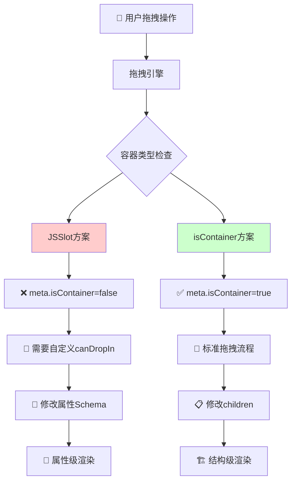
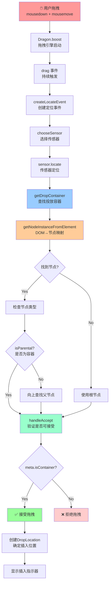

# JSSlot 与 isContainer 两种方案深度对比分析

## 📋 概述

在低代码引擎中，有两种主要的方式让组件支持接受子组件：**JSSlot** 和 **isContainer**。本文深入分析这两种方案在渲染、拖拽、原理层面的差异。

## 🎯 方案定义

### 方案A：组件A内渲染JSSlot

```javascript
// 组件A的Schema配置
{
  componentName: 'ComponentA',
  props: {
    content: {
      type: 'JSSlot',
      value: [] // 子组件会放在这里
    }
  }
}
```

### 方案B：组件B配置isContainer为true

```javascript
// 组件B的Meta配置
{
  componentName: 'ComponentB',
  configure: {
    isContainer: true // 标识为容器组件
  }
}

// 组件B的Schema配置
{
  componentName: 'ComponentB',
  children: [] // 子组件直接作为children
}
```

## 🎨 1. 渲染差异分析

### JSSlot 渲染机制

**位置**: `packages/renderer-core/src/renderer/base.tsx:557-559`

```typescript
// JSSlot渲染逻辑
if (isJSSlot(schema)) {
    // 🔑 JSSlot会递归渲染其value中的内容
    return this.__createVirtualDom(schema.value, scope, parentInfo);
}
```

**渲染特点**:

- 🏷️ **属性级别**: JSSlot作为组件的属性存在
- 🔄 **递归渲染**: 通过`__createVirtualDom`递归渲染slot内容
- 📦 **包装结构**: JSSlot本身是一个数据结构，不产生额外DOM节点
- 🎯 **动态内容**: 支持参数传递和作用域继承

**Schema结构**:

```javascript
{
  type: 'JSSlot',
  title: '插槽标题',
  name: '插槽名称',
  params: ['item', 'index'], // 参数列表
  value: [
    // 实际的子组件Schema
    {
      componentName: 'ChildComponent',
      props: { text: 'Hello' }
    }
  ]
}
```

### isContainer 渲染机制

**位置**: `packages/react-simulator-renderer/src/renderer-view.tsx:233-252`

```typescript
// isContainer渲染逻辑
if (
  !viewProps.dataSource &&
  leaf?.isContainer() &&                    // 🔑 检查是否为容器
  (children == null || (Array.isArray(children) && !children.length)) &&
  (!viewProps.style || Object.keys(viewProps.style).length === 0)
) {
  // 🎯 为空容器添加占位符，方便拖拽
  let defaultPlaceholder = intl('Drag and drop components or templates here');
  children = (
    <div className="lc-container-placeholder" style={viewProps.placeholderStyle}>
      {viewProps.placeholder || defaultPlaceholder}
    </div>
  );
}
```

**渲染特点**:

- 🏗️ **结构级别**: 直接作为组件的children渲染
- 📋 **占位符支持**: 空容器自动显示拖拽占位符
- 🎨 **样式优化**: 提供专门的容器样式类
- 🔒 **锁定状态**: 支持锁定容器的特殊显示

### 渲染差异对比

| 特性 | JSSlot | isContainer |
|------|---------|-------------|
| **DOM结构** | 作为属性值，不产生包装节点 | 直接作为children，可能产生占位符 |
| **占位符** | 需要手动处理 | 自动生成拖拽占位符 |
| **参数传递** | 支持params参数 | 通过标准props传递 |
| **作用域** | 继承父组件作用域 | 标准组件作用域 |
| **样式控制** | 依赖父组件样式 | 独立的容器样式 |

## 🚀 2. 拖拽支持分析

### JSSlot 拖拽处理

**核心问题**: JSSlot作为属性值存在，不是标准的容器节点

**位置**: `packages/designer/src/builtin-simulator/host.ts:2042-2060`

```typescript
handleAccept({ container }: DropContainer, e: ILocateEvent): boolean {
  const meta = (container as Node).componentMeta;

  // 🚫 JSSlot组件通常meta.isContainer为false
  if (!meta.isContainer && !acceptable) {
    return false; // 直接拒绝拖拽
  }

  return document.checkNesting(container, dragObject as any);
}
```

**JSSlot拖拽特点**:

- ❌ **默认不支持**: 组件meta通常不设置isContainer
- 🔧 **需要特殊处理**: 需要自定义拖拽逻辑
- 🎯 **属性级操作**: 需要修改特定属性而非children
- 📝 **Schema复杂**: 需要更新嵌套的属性结构

**JSSlot拖拽实现方案**:

```javascript
// 方法1：在组件meta中同时配置
{
  componentName: 'TabComponent',
  configure: {
    isContainer: true, // 允许拖拽
    // 自定义拖拽处理
    canDropIn: (draggedNode, currentNode) => {
      // 检查是否可以拖入到JSSlot中
      return true;
    }
  }
}

// 方法2：使用onChildAdd钩子
{
  configure: {
    callbacks: {
      onChildAdd: (child, currentNode) => {
        // 将拖入的组件添加到JSSlot的value中
        const jsSlotProp = currentNode.getProp('content');
        if (jsSlotProp && jsSlotProp.value) {
          jsSlotProp.value.push(child.export());
        }
      }
    }
  }
}
```

### isContainer 拖拽处理

**核心逻辑**: 标准的容器拖拽支持

```typescript
// isContainer的拖拽验证逻辑
if (!meta.isContainer && !acceptable) {
  return false; // ✅ isContainer为true时通过验证
}
```

**isContainer拖拽特点**:

- ✅ **天然支持**: 直接通过isContainer检查
- 🎯 **标准流程**: 使用标准的children插入逻辑
- 🔄 **自动处理**: 拖拽引擎自动处理插入操作
- 📋 **简单Schema**: 直接修改children数组

### 拖拽支持对比

| 特性 | JSSlot | isContainer |
|------|---------|-------------|
| **拖拽支持** | ❌ 需要特殊配置 | ✅ 天然支持 |
| **配置复杂度** | 🔴 复杂，需要自定义逻辑 | 🟢 简单，只需设置标志 |
| **插入位置** | 🎯 属性值中的特定位置 | 🎯 children数组中 |
| **Schema变更** | 🔄 更新嵌套属性结构 | 🔄 更新children数组 |
| **占位符** | ❌ 需要手动实现 | ✅ 自动显示 |

## ⚙️ 3. 原理层面差异

### 架构层次对比



### JSSlot 原理深度分析

#### 1. Schema层面
- **数据结构**: 作为特殊的属性值类型存在
- **类型标识**: `type: 'JSSlot'`
- **内容存储**: 通过`value`字段存储实际内容

#### 2. 渲染层面
- **解析阶段**: 在`__createVirtualDom`中被识别和处理
- **递归渲染**: 通过递归调用渲染slot内的内容
- **作用域继承**: 继承父组件的scope和context

#### 3. 交互层面
- **拖拽复杂**: 需要特殊的拖拽逻辑处理
- **选中困难**: JSSlot内容的选中需要特殊处理
- **编辑挑战**: 属性级别的编辑比结构级编辑复杂

**JSSlot核心代码链**:

```typescript
// 1. 类型检查
if (isJSSlot(schema)) {
  // 2. 递归渲染
  return this.__createVirtualDom(schema.value, scope, parentInfo);
}

// 3. Prop导出时的特殊处理
if (type === 'slot') {
  return {
    type: 'JSSlot',
    params: schema.params,
    value: schema.children, // 🔑 children转换为value
    title: schema.title,
    name: schema.name,
    id: schema.id,
  };
}
```

### isContainer 原理深度分析

#### 1. Meta层面
- **配置简单**: 通过`isContainer: true`声明
- **全局识别**: 整个引擎都能识别容器属性
- **标准化**: 符合组件容器的标准定义

#### 2. 渲染层面
- **直接渲染**: children直接作为React children渲染
- **占位符**: 自动处理空容器的占位符显示
- **样式支持**: 提供标准的容器样式类

#### 3. 交互层面
- **拖拽简单**: 标准的拖拽流程，无需特殊处理
- **选中直观**: 标准的节点选中逻辑
- **编辑友好**: 结构级编辑，操作直观

**isContainer核心代码链**:

```typescript
// 1. Meta检查
if (!meta.isContainer && !acceptable) {
  return false;
}

// 2. 标准插入流程
loc.detail.target.insertChildren(nodes, loc.detail.index, copy);

// 3. 占位符渲染
if (leaf?.isContainer() && !children.length) {
  children = <div className="lc-container-placeholder">占位符</div>;
}
```

### 原理差异总结

| 维度 | JSSlot | isContainer |
|------|---------|-------------|
| **概念层次** | 🎯 Schema/属性层面 | 🏗️ 组件/结构层面 |
| **实现复杂度** | 🔴 复杂，需要多层特殊处理 | 🟢 简单，标准化流程 |
| **扩展性** | 🔶 有限，受属性结构限制 | 🟢 良好，标准容器扩展 |
| **维护成本** | 🔴 高，需要维护特殊逻辑 | 🟢 低，使用标准逻辑 |
| **性能影响** | 🔶 中等，额外的属性解析 | 🟢 低，标准渲染流程 |

## 🔍 4. 拖拽容器查找完整流程分析

### 拖拽系统工作原理

当用户从组件库拖拽组件到画布时，低代码引擎需要经历以下完整流程来确定投放容器：



### 核心代码流程详解

#### 步骤1：拖拽事件触发

**位置**: `packages/designer/src/designer/dragon.ts:273-289`

```typescript
const drag = (e: MouseEvent | DragEvent) => {
    // 检查复制状态
    checkcopy(e);

    // 创建标准化定位事件
    const locateEvent = createLocateEvent(e);
    // 选择最合适的传感器（通常是 BuiltinSimulatorHost）
    const sensor = chooseSensor(locateEvent);

    // 🔑 关键调用：让传感器进行定位
    sensor?.locate(locateEvent);
}
```

#### 步骤2：传感器定位处理

**位置**: `packages/designer/src/builtin-simulator/host.ts:1737-1929`

```typescript
locate(e: ILocateEvent): any {
    // 获取投放容器
    const dropContainer = this.getDropContainer(e);

    if (!dropContainer) {
        return null; // 无法找到有效容器
    }

    // 验证是否可以接受拖拽
    if (!this.handleAccept(dropContainer, e)) {
        return null; // 容器拒绝接受
    }

    // 创建位置数据
    const locationData = {
        target: dropContainer.container,
        detail: {
            type: 'Children',
            index: insertIndex
        },
        source: this.viewName,
        event: e
    };

    return this.designer.createLocation(locationData);
}
```

#### 步骤3：投放容器查找逻辑

**位置**: `packages/designer/src/builtin-simulator/host.ts:1934-2033`

```typescript
getDropContainer(e: ILocateEvent): DropContainer | null {
    const { target, dragObject } = e;
    let container: INode | null;

    if (target) {
        // 🔑 核心步骤：从DOM元素找到对应节点
        const ref = this.getNodeInstanceFromElement(target);
        if (ref?.node) {
            container = ref.node;
        } else {
            // 找不到节点，使用根节点
            container = currentRoot;
        }
    }

    // 🔍 如果节点不是容器类型，向上查找父节点
    if (!container?.isParental()) {
        container = container?.parent || currentRoot;
    }

    // 排除被拖拽的节点本身
    const drillDownExcludes = new Set<INode>();
    if (isDragNodeObject(dragObject)) {
        // 防止节点拖拽到自己内部
        let p: any = container;
        const { nodes } = dragObject;
        nodes.forEach(node => {
            if (contains(node, p)) {
                p = node.parent;
            }
        });
        container = p || document.focusNode;
    }

    // 获取组件实例
    const instance = this.getComponentInstances(container)?.[0];

    return {
        container: container as any,
        instance,
    };
}
```

#### 步骤4：容器接受验证

**位置**: `packages/designer/src/builtin-simulator/host.ts:2042-2060`

```typescript
handleAccept({ container }: DropContainer, e: ILocateEvent): boolean {
    const { dragObject } = e;
    const document = this.currentDocument!;
    const { focusNode } = document;

    // 根节点或包含焦点节点的容器，使用文档级验证
    if (isRootNode(container) || container.contains(focusNode)) {
        return document.checkNesting(focusNode!, dragObject as any);
    }

    const meta = (container as Node).componentMeta;

    // 🔥 关键检查：是否为容器组件
    if (!meta.isContainer && !this.isAcceptable(container)) {
        return false; // ❌ 非容器组件，拒绝拖拽
    }

    // 检查嵌套规则（父子组件兼容性）
    return document.checkNesting(container, dragObject as any);
}
```

### JSSlot vs isContainer 在容器查找中的差异

#### JSSlot 的查找困境

```typescript
// JSSlot 渲染时的问题
if (isJSSlot(schema)) {
    // 🚫 问题：直接递归渲染，没有包装节点
    return this.__createVirtualDom(schema.value, scope, parentInfo);
}
```

**JSSlot 面临的问题**:

1. **DOM 映射缺失**
   ```typescript
   // getNodeInstanceFromElement 查找过程
   const ref = this.getNodeInstanceFromElement(target);
   // ❌ JSSlot 内容的DOM元素无法映射到 JSSlot 本身
   // ✅ 只能映射到包含 JSSlot 的父组件
   ```

2. **容器识别失败**
   ```typescript
   // handleAccept 验证过程
   const meta = (container as Node).componentMeta;
   if (!meta.isContainer) {
       return false; // ❌ JSSlot 组件通常 meta.isContainer = false
   }
   ```

3. **插入位置混乱**
   ```typescript
   // 标准插入位置计算
   locationData = {
       target: container,           // ❌ 指向父组件，不是 JSSlot
       detail: {
           type: 'Children',        // ❌ 误以为插入到 children
           index: insertIndex
       }
   };
   ```

#### isContainer 的查找优势

```typescript
// isContainer 组件的完整流程
if (leaf?.isContainer() && !children.length) {
    // ✅ 自动添加占位符，便于拖拽识别
    children = (
        <div className="lc-container-placeholder">
            {defaultPlaceholder}
        </div>
    );
}
```

**isContainer 的优势**:

1. **DOM 映射清晰**
   ```typescript
   // 容器组件的DOM有明确的节点标识
   const ref = this.getNodeInstanceFromElement(target);
   // ✅ 可以准确映射到容器节点
   container = ref.node; // 直接就是目标容器
   ```

2. **容器识别准确**
   ```typescript
   // meta 配置明确
   const meta = (container as Node).componentMeta;
   if (!meta.isContainer) {
       return false; // ✅ isContainer = true，通过验证
   }
   ```

3. **插入位置明确**
   ```typescript
   // 标准的children插入
   locationData = {
       target: container,           // ✅ 明确指向容器节点
       detail: {
           type: 'Children',        // ✅ 正确的插入类型
           index: insertIndex       // ✅ 准确的插入位置
       }
   };
   ```

### 拖拽失败的常见原因

#### JSSlot 拖拽失败分析

1. **节点映射失败**
   ```typescript
   // 调试代码示例
   console.log('Target Element:', e.target);
   const ref = this.getNodeInstanceFromElement(e.target);
   console.log('Mapped Node:', ref?.node?.componentName);
   // JSSlot: 输出父组件名，不是期望的JSSlot区域
   ```

2. **容器验证失败**
   ```typescript
   // 调试代码示例
   const meta = container.componentMeta;
   console.log('isContainer:', meta.isContainer);
   console.log('isAcceptable:', this.isAcceptable(container));
   // JSSlot: isContainer=false, isAcceptable=false
   ```

3. **插入逻辑错误**
   ```typescript
   // 标准插入会调用
   container.insertChildren(nodes, index);
   // ❌ 但 JSSlot 需要调用
   container.getProp('slotName').setValue(newValue);
   ```

#### isContainer 拖拽成功分析

1. **节点映射成功**
   ```typescript
   console.log('Target Element:', e.target);
   const ref = this.getNodeInstanceFromElement(e.target);
   console.log('Mapped Node:', ref?.node?.componentName);
   // isContainer: 直接输出容器组件名
   ```

2. **容器验证成功**
   ```typescript
   const meta = container.componentMeta;
   console.log('isContainer:', meta.isContainer); // true
   // ✅ 通过 handleAccept 验证
   ```

3. **插入逻辑标准**
   ```typescript
   // 标准插入流程
   container.insertChildren(nodes, index);
   // ✅ 直接修改 children 数组，简单可靠
   ```

### 调试拖拽问题的方法

#### 1. DOM 元素追踪
```typescript
// 在 getDropContainer 中添加调试
console.log('Drag Target:', e.target);
console.log('Target Classes:', e.target.className);
console.log('Target Dataset:', e.target.dataset);
```

#### 2. 节点映射调试
```typescript
// 在 getNodeInstanceFromElement 中添加调试
const ref = this.getNodeInstanceFromElement(target);
console.log('Mapped Node:', {
    nodeId: ref?.node?.id,
    componentName: ref?.node?.componentName,
    isContainer: ref?.node?.isContainer(),
    meta: ref?.node?.componentMeta?.isContainer
});
```

#### 3. 容器验证调试
```typescript
// 在 handleAccept 中添加调试
console.log('Accept Check:', {
    containerName: container.componentName,
    isContainer: meta.isContainer,
    isAcceptable: this.isAcceptable(container),
    nestingCheck: document.checkNesting(container, dragObject)
});
```

### 总结：为什么 isContainer 更简单

通过完整的拖拽容器查找流程分析，可以清楚看到：

1. **DOM → 节点映射**: isContainer 有明确的节点对应关系，JSSlot 没有
2. **容器类型识别**: isContainer 通过 meta.isContainer 直接识别，JSSlot 需要复杂判断
3. **插入逻辑处理**: isContainer 使用标准的 children 插入，JSSlot 需要属性级操作
4. **调试和维护**: isContainer 流程清晰可预测，JSSlot 需要多层特殊处理

这就是为什么推荐优先使用 isContainer 方案的技术原因！

## 🎯 5. 使用场景建议

### JSSlot 适用场景

```typescript
// ✅ 适合：动态内容插槽
{
  componentName: 'Table',
  props: {
    columns: [
      {
        title: '操作',
        render: {
          type: 'JSSlot',
          params: ['record', 'index'],
          value: [
            // 基于record数据的动态内容
            {
              componentName: 'Button',
              props: {
                text: { type: 'JSExpression', value: 'record.id' }
              }
            }
          ]
        }
      }
    ]
  }
}
```

**JSSlot最佳实践**:

- 🎯 **参数化内容**: 需要传递特定参数的场景
- 🔄 **动态渲染**: 基于父组件数据的条件渲染
- 🎨 **模板化**: 可复用的内容模板
- 🧩 **高级组件**: 如Table列渲染、Form表单项等

### isContainer 适用场景

```typescript
// ✅ 适合：标准容器组件
{
  componentName: 'Panel',
  configure: {
    isContainer: true,
    // 可选的高级配置
    canDropIn: (draggedNode) => {
      // 自定义拖拽限制逻辑
      return draggedNode.componentName !== 'Modal';
    }
  },
  children: [
    // 标准的子组件结构
    {
      componentName: 'Button',
      props: { text: '按钮' }
    }
  ]
}
```

**isContainer最佳实践**:

- 📦 **布局容器**: Div、Section、Card等布局组件
- 🎨 **UI容器**: Modal、Drawer、Panel等UI组件
- 📋 **表单容器**: Form、FormGroup等表单组件
- 🗂️ **数据容器**: List、Grid等数据展示组件

### 混合使用方案

```typescript
// 🎯 复杂组件：同时支持两种方式
{
  componentName: 'ComplexComponent',
  configure: {
    isContainer: true, // 支持标准拖拽
    callbacks: {
      onChildAdd: (child, currentNode, index) => {
        // 根据拖拽位置决定插入方式
        if (index < 2) {
          // 插入到header slot
          const headerSlot = currentNode.getProp('header');
          headerSlot.value.push(child.export());
        } else {
          // 插入到children
          currentNode.insertChild(child, index - 2);
        }
      }
    }
  },
  props: {
    header: {
      type: 'JSSlot',
      value: [] // header区域内容
    }
  },
  children: [] // body区域内容
}
```

## 📊 5. 性能与兼容性

### 性能对比

| 指标 | JSSlot | isContainer |
|------|---------|-------------|
| **渲染性能** | 🔶 需要额外的类型检查和递归 | 🟢 标准React渲染 |
| **内存占用** | 🔶 额外的Schema解析开销 | 🟢 标准组件内存模式 |
| **更新效率** | 🔴 属性级更新，可能引发大范围重渲染 | 🟢 标准的children更新 |
| **首屏加载** | 🔶 需要解析所有JSSlot结构 | 🟢 标准组件加载 |

### 兼容性考虑

```typescript
// JSSlot向后兼容性处理
export function isJSSlot(obj: any): obj is IPublicTypeJSSlot {
  if (!obj || typeof obj !== 'object' || Array.isArray(obj)) {
    return false;
  }
  // 🔧 兼容旧版本的JSBlock
  return [EXPRESSION_TYPE.JSSLOT, EXPRESSION_TYPE.JSBLOCK].includes(obj.type);
}

// isContainer向后兼容性
get isContainer(): boolean {
  // 🔧 根节点默认为容器
  return this._isContainer! || this.isRootComponent();
}
```

## 🚨 6. 常见问题与解决方案

### JSSlot 常见问题

#### 问题1：拖拽不生效
```typescript
// ❌ 问题：JSSlot组件无法接受拖拽
// ✅ 解决：在meta中配置isContainer
{
  configure: {
    isContainer: true, // 必须设置
    callbacks: {
      onChildAdd: (child, currentNode) => {
        // 自定义插入逻辑
        const slotProp = currentNode.getProp('content');
        const slotValue = slotProp.getValue();
        slotValue.push(child.export());
        slotProp.setValue(slotValue);
      }
    }
  }
}
```

#### 问题2：选中困难
```typescript
// ❌ 问题：JSSlot内的组件选中有问题
// ✅ 解决：确保正确的节点ID关联
{
  type: 'JSSlot',
  value: [
    {
      id: 'unique-node-id', // 确保ID唯一
      componentName: 'Button'
    }
  ]
}
```

### isContainer 常见问题

#### 问题1：占位符显示异常
```typescript
// ❌ 问题：容器占位符不显示
// ✅ 解决：确保容器样式正确
.lc-container-placeholder {
  min-height: 50px; /* 确保最小高度 */
  border: 2px dashed #d9d9d9;
  display: flex;
  align-items: center;
  justify-content: center;
}
```

#### 问题2：嵌套限制
```typescript
// ✅ 解决：使用nestingRule配置
{
  configure: {
    isContainer: true,
    nestingRule: {
      childWhitelist: (child, currentNode) => {
        // 只允许特定组件
        return ['Button', 'Input', 'Text'].includes(child.componentName);
      }
    }
  }
}
```

## 📋 7. 总结与建议

### 选择建议矩阵

| 需求场景 | 推荐方案 | 原因 |
|----------|----------|------|
| 标准布局容器 | isContainer | 简单、标准、性能好 |
| 参数化内容插槽 | JSSlot | 支持参数传递和动态作用域 |
| 表格列渲染 | JSSlot | 需要record数据参数 |
| 表单容器 | isContainer | 标准的表单结构 |
| 模态框内容 | isContainer | 标准UI容器 |
| 列表项模板 | JSSlot | 需要item、index参数 |

### 技术债务考虑

**JSSlot的技术债务**:
- 🔴 **维护复杂**: 需要维护特殊的拖拽、选中、编辑逻辑
- 🔴 **测试困难**: 属性级操作的测试覆盖困难
- 🔴 **文档成本**: 需要额外的开发文档和用户指南
- 🔴 **学习曲线**: 开发者需要理解JSSlot的特殊机制

**isContainer的优势**:
- 🟢 **标准化**: 符合React标准的组件模式
- 🟢 **生态友好**: 与其他React工具链兼容性好
- 🟢 **可预测**: 标准的容器行为，易于理解和调试
- 🟢 **未来兼容**: 符合React未来发展方向

### 最佳实践总结

1. **优先使用isContainer**
   - 对于90%的容器需求，isContainer是最佳选择
   - 简单、标准、维护成本低

2. **谨慎使用JSSlot**
   - 只在确实需要参数化内容时使用
   - 做好充分的测试和文档

3. **混合方案**
   - 复杂组件可以同时支持两种方式
   - 通过配置决定使用哪种方式

4. **性能优化**
   - JSSlot组件考虑使用React.memo优化
   - isContainer组件注意children的key设置

5. **用户体验**
   - 确保两种方案都有良好的拖拽反馈
   - 提供清晰的占位符和选中状态

**结论**: 在大多数情况下，**isContainer方案更加推荐**，它符合标准、简单易用、维护成本低。JSSlot应该只在确实需要参数化内容的特殊场景下使用。
