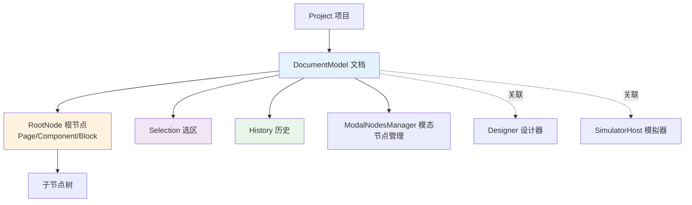
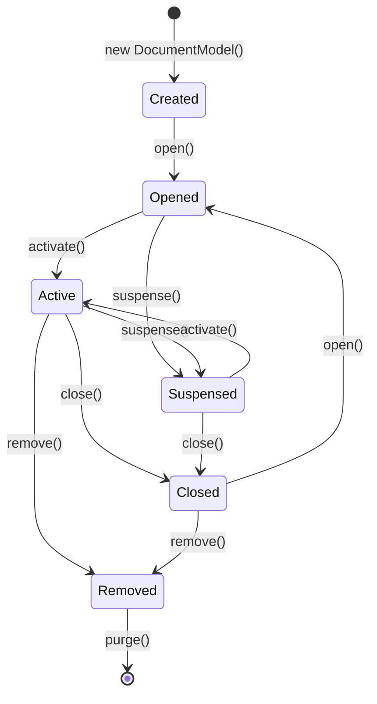
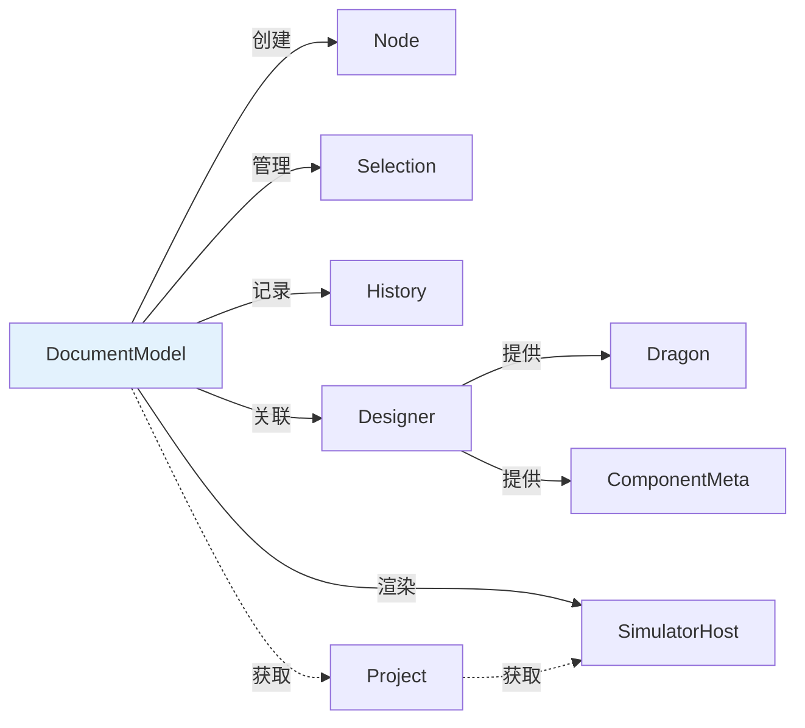

# DocumentModel 文档模型详解

> **源码位置**: `packages/designer/src/document/document-model.ts`
> **公开类型**: `@types` [IPublicModelDocumentModel](https://github.com/alibaba/lowcode-engine/blob/main/packages/types/src/shell/model/document-model.ts)
> **引擎版本**: v1.0.0+

---

## 📋 **目录**

- [基本介绍](#基本介绍)
- [核心标识属性](#核心标识属性)
- [关联模型属性](#关联模型属性)
- [状态管理属性](#状态管理属性)
- [节点管理方法](#节点管理方法)
- [Schema 导入导出](#schema-导入导出)
- [嵌套检查方法](#嵌套检查方法)
- [生命周期管理](#生命周期管理)
- [事件监听方法](#事件监听方法)
- [工具方法](#工具方法)
- [底层原理解析](#底层原理解析)

---

## 🎯 **基本介绍**

DocumentModel 是**低代码引擎的核心文档模型**，代表一个可编辑的页面/组件/区块文档。它负责：

1. **节点树管理** - 维护整个节点树结构
2. **选区控制** - 管理节点选择状态
3. **历史记录** - 操作撤销/重做
4. **Schema 转换** - 数据导入导出
5. **事件协调** - 文档级事件发布

### **架构关系**



---

## 🏷️ **一、核心标识属性**

### **1. id**

```typescript
id: string
```

| 属性 | 说明 |
|------|------|
| **作用** | 文档唯一标识符 |
| **关联模块** | Project（项目管理） |
| **底层原理** | 通过 `uniqueId('doc')` 生成，格式如 `doc_abc123` |
| **可读写** | ✅ 可读可写 |
| **使用场景** | 多文档管理、文档索引 |

**代码示例**：
```typescript
const document = project.currentDocument;
console.log(document.id); // "doc_k1f2g3h4"
```

**底层实现**（第165行）：
```typescript
id: string = uniqueId('doc');
```

---

### **2. fileName**

```typescript
fileName: string
```

| 属性 | 说明 |
|------|------|
| **作用** | 文档文件名 |
| **关联模块** | RootNode（存储在根节点的 extra.fileName） |
| **底层原理** | MobX getter/setter，数据存储在 `rootNode.extra.fileName` |
| **可读写** | ✅ 可读可写 |
| **使用场景** | 多页面项目中的文件命名、导出时的文件名 |

**代码示例**：
```typescript
document.fileName = 'HomePage';
console.log(document.fileName); // "HomePage"
```

**底层实现**（第212-218行）：
```typescript
get fileName(): string {
  return this.rootNode?.getExtraProp('fileName', false)?.getAsString() || this.id;
}

set fileName(fileName: string) {
  this.rootNode?.getExtraProp('fileName', true)?.setValue(fileName);
}
```

---

## 🔗 **二、关联模型属性**

### **1. project**

```typescript
readonly project: IProject
```

| 属性 | 说明 |
|------|------|
| **作用** | 获取文档所属的项目实例 |
| **关联模块** | Project（项目管理）|
| **底层原理** | 构造函数注入，只读引用 |
| **可读写** | ❌ 只读 |
| **使用场景** | 访问项目级配置、切换文档、获取 simulator |

**代码示例**：
```typescript
const project = document.project;
const allDocuments = project.documents;
```

**底层实现**（第184行）：
```typescript
readonly project: IProject;

// 构造函数中赋值
constructor(project: IProject, schema?: IPublicTypeRootSchema) {
  this.project = project;
  // ...
}
```

---

### **2. designer**

```typescript
readonly designer: IDesigner
```

| 属性 | 说明 |
|------|------|
| **作用** | 获取设计器实例 |
| **关联模块** | Designer（设计器核心）、Dragon（拖拽引擎）|
| **底层原理** | 从 project 获取，只读引用 |
| **可读写** | ❌ 只读 |
| **使用场景** | 访问 Dragon、ComponentMeta、事件总线 |

**代码示例**：
```typescript
const designer = document.designer;
const dragon = designer.dragon;
const meta = designer.getComponentMeta('Button');
```

**底层实现**（第186、315行）：
```typescript
readonly designer: IDesigner;

constructor(project: IProject, schema?: IPublicTypeRootSchema) {
  this.designer = this.project?.designer;
}
```

---

### **3. simulator**

```typescript
get simulator(): ISimulatorHost | null
```

| 属性 | 说明 |
|------|------|
| **作用** | 获取模拟器实例（iframe 渲染器）|
| **关联模块** | SimulatorHost（iframe 画布宿主）|
| **底层原理** | 通过 `project.simulator` 获取，计算属性 |
| **可读写** | ❌ 只读（getter）|
| **使用场景** | 触发重渲染、获取组件实例、生成元数据 |

**代码示例**：
```typescript
document.simulator?.rerender(); // 重新渲染画布
const component = document.simulator?.getComponent('Button');
```

**底层实现**（第204-206行）：
```typescript
get simulator(): ISimulatorHost | null {
  return this.project.simulator;
}
```

---

### **4. selection**

```typescript
readonly selection: ISelection
```

| 属性 | 说明 |
|------|------|
| **作用** | 画布节点选中区模型实例 |
| **关联模块** | Selection（选区管理）、UI 高亮显示 |
| **底层原理** | 构造时创建 `new Selection(this)` |
| **可读写** | ❌ 只读（但 selection 内部状态可变）|
| **使用场景** | 获取/设置选中节点、多选操作 |

**代码示例**：
```typescript
document.selection.select('node_123'); // 选中节点
const selected = document.selection.getNodes(); // 获取选中的节点
document.selection.clear(); // 清空选择
```

**底层实现**（第170行）：
```typescript
readonly selection: ISelection = new Selection(this);
```

**相关章节**: [节点选中区模型](./selection)

---

### **5. history**

```typescript
readonly history: IHistory
```

| 属性 | 说明 |
|------|------|
| **作用** | 操作历史模型实例（撤销/重做）|
| **关联模块** | History（历史管理）|
| **底层原理** | 构造时创建 `new History(...)` |
| **可读写** | ❌ 只读（但 history 内部状态可变）|
| **使用场景** | 撤销操作、重做操作、历史记录管理 |

**代码示例**：
```typescript
document.history.back(); // 撤销
document.history.forward(); // 重做
document.history.savePoint(); // 保存状态点
```

**底层实现**（第175、333-340行）：
```typescript
readonly history: IHistory;

this.history = new History(
  () => this.export(IPublicEnumTransformStage.Serilize), // 获取当前状态
  (schema) => {
    this.import(schema as IPublicTypeRootSchema, true); // 恢复状态
    this.simulator?.rerender();
  },
  this,
);
```

**相关章节**: [操作历史模型](./history)

---

### **6. modalNodesManager**

```typescript
modalNodesManager: IModalNodesManager
```

| 属性 | 说明 |
|------|------|
| **作用** | 模态节点管理器（如 Dialog、Drawer）|
| **关联模块** | ModalNodesManager |
| **底层原理** | 构造时创建 `new ModalNodesManager(this)` |
| **可读写** | ✅ 可读可写（import 时会重新创建）|
| **使用场景** | 管理模态弹窗节点、临时节点 |

**代码示例**：
```typescript
const modalNodes = document.modalNodesManager.getModalNodes();
```

**底层实现**（第180、343行）：
```typescript
modalNodesManager: IModalNodesManager;

this.modalNodesManager = new ModalNodesManager(this);
```

**相关章节**: [模态节点管理器](./modal-nodes-manager)

---

### **7. rootNode / root**

```typescript
rootNode: IRootNode | null
get root(): INode | null
```

| 属性 | 说明 |
|------|------|
| **作用** | 获取文档的根节点（Page/Component/Block）|
| **关联模块** | Node（节点模型）|
| **底层原理** | 构造时通过 `createNode(schema)` 创建 |
| **可读写** | ✅ `rootNode` 可变，`root` 只读 getter |
| **使用场景** | 访问页面根节点、遍历节点树 |

**代码示例**：
```typescript
const root = document.root;
console.log(root.componentName); // "Page"
const children = root.children;
```

**底层实现**（第160、308-310、325-331、746-748行）：
```typescript
rootNode: IRootNode | null;

get root() {
  return this.rootNode;
}

// 构造函数中创建
this.rootNode = this.createNode(
  schema || {
    componentName: 'Page',
    id: 'root',
    fileName: '',
  },
);
```

---

### **8. nodesMap**

```typescript
get nodesMap(): Map<string, INode>
```

| 属性 | 说明 |
|------|------|
| **作用** | 获取文档下所有节点的 Map，key 为 nodeId |
| **关联模块** | Node（节点管理）|
| **底层原理** | 私有 `_nodesMap` 的 getter，每次 `createNode` 时自动注册 |
| **可读写** | ❌ 只读（但 Map 内容可通过其他方法修改）|
| **使用场景** | 快速根据 ID 查找节点、统计节点数量 |

**代码示例**：
```typescript
const allNodes = document.nodesMap;
console.log(allNodes.size); // 节点总数
const node = allNodes.get('node_123');
```

**底层实现**（第182、208-210、477行）：
```typescript
private _nodesMap = new Map<string, INode>();

get nodesMap(): Map<string, INode> {
  return this._nodesMap;
}

// createNode 时自动注册
this._nodesMap.set(node.id, node);
```

---

### **9. dropLocation**

```typescript
dropLocation: IDropLocation | null
```

| 属性 | 说明 |
|------|------|
| **作用** | 拖拽放置位置标记（实时显示插入指示器）|
| **关联模块** | Dragon（拖拽引擎）、BorderDetecting（插入指示器）|
| **底层原理** | MobX `@obx.ref` 响应式，setter 触发事件 |
| **可读写** | ✅ 可读可写 |
| **使用场景** | 拖拽过程中显示插入位置提示 |

**代码示例**：
```typescript
// Dragon 拖拽过程中设置
document.dropLocation = {
  target: parentNode,
  index: 2,
  area: 'children'
};

// 监听变化
document.onDropLocationChanged(() => {
  console.log('Drop location changed');
});
```

**底层实现**（第251-267行）：
```typescript
@obx.ref private _dropLocation: IDropLocation | null = null;

set dropLocation(loc: IDropLocation | null) {
  this._dropLocation = loc;
  // 🔔 发布事件，供 UI 监听
  this.designer.editor.eventBus.emit(
    'document.dropLocation.changed',
    { document: this, location: loc },
  );
}

get dropLocation() {
  return this._dropLocation;
}
```

**相关类型**: [IPublicModelDropLocation](https://github.com/alibaba/lowcode-engine/blob/main/packages/types/src/shell/model/drop-location.ts)

**@since v1.1.0**

---

## 📊 **三、状态管理属性**

### **1. active / suspensed**

```typescript
get active(): boolean
get suspensed(): boolean
```

| 属性 | 说明 |
|------|------|
| **作用** | 文档激活状态（active 与 suspensed 相反）|
| **关联模块** | Project（多文档管理）、Simulator |
| **底层原理** | MobX `@obx.ref` 响应式，通过 `_suspensed` 和 `_opened` 计算 |
| **可读写** | ❌ 只读（通过 `suspense()` / `activate()` 修改）|
| **使用场景** | 多标签页切换、停止/启动响应 |

**代码示例**：
```typescript
if (document.active) {
  // 文档处于激活状态
}

document.suspense(); // 暂停文档
document.activate(); // 激活文档
```

**底层实现**（第276-292、628-645行）：
```typescript
@obx.ref private _opened = false;
@obx.ref private _suspensed = false;

get suspensed(): boolean {
  return this._suspensed || !this._opened;
}

get active(): boolean {
  return !this._suspensed;
}

// 修改方法
private setSuspense(flag: boolean) {
  this._suspensed = flag;
  this.simulator?.setSuspense(flag);
  if (!flag) {
    this.project.checkExclusive(this);
  }
}

suspense() {
  this.setSuspense(true);
}

activate() {
  this.setSuspense(false);
}
```

---

### **2. opened**

```typescript
get opened(): boolean
```

| 属性 | 说明 |
|------|------|
| **作用** | 文档是否已打开 |
| **关联模块** | Project（文档生命周期）|
| **底层原理** | MobX `@obx.ref` 响应式 |
| **可读写** | ❌ 只读（通过 `open()` / `close()` 修改）|
| **使用场景** | 判断文档是否在编辑器中打开 |

**底层实现**（第276、301-306行）：
```typescript
@obx.ref private _opened = false;

get opened() {
  return this._opened;
}
```

---

### **3. focusNode / currentRoot**

```typescript
get focusNode(): INode | null
get currentRoot(): INode | null
```

| 属性 | 说明 |
|------|------|
| **作用** | `focusNode`: 聚焦节点（下钻容器或根节点）<br/>`currentRoot`: 当前根节点（模态节点 > 聚焦节点）|
| **关联模块** | Designer、UI 渲染 |
| **底层原理** | 计算属性，支持配置 `focusNodeSelector` |
| **可读写** | ❌ 只读（通过 `drillDown()` 修改）|
| **使用场景** | 容器下钻、模态弹窗编辑 |

**代码示例**：
```typescript
// 下钻到某个容器节点
document.drillDown(containerNode);
console.log(document.focusNode); // containerNode

// 当前编辑的根节点
const editingRoot = document.currentRoot;
```

**底层实现**（第220-248、347-349行）：
```typescript
@obx.ref private _drillDownNode: INode | null = null;
private _modalNode?: INode;

get focusNode(): INode | null {
  if (this._drillDownNode) {
    return this._drillDownNode; // 优先返回下钻节点
  }
  const selector = engineConfig.get('focusNodeSelector');
  if (selector && typeof selector === 'function') {
    return selector(this.rootNode!); // 自定义选择器
  }
  return this.rootNode; // 默认返回根节点
}

get modalNode() {
  return this._modalNode;
}

get currentRoot() {
  return this.modalNode || this.focusNode; // 模态节点优先
}

drillDown(node: INode | null) {
  this._drillDownNode = node;
}
```

---

### **4. schema**

```typescript
get schema(): IPublicTypeRootSchema
```

| 属性 | 说明 |
|------|------|
| **作用** | 导出当前文档的 schema 数据 |
| **关联模块** | RootNode |
| **底层原理** | 直接调用 `rootNode.schema` |
| **可读写** | ❌ 只读（通过 `import()` 修改）|
| **使用场景** | 保存页面数据、数据快照 |

**代码示例**：
```typescript
const schema = document.schema;
localStorage.setItem('page-schema', JSON.stringify(schema));
```

**底层实现**（第272-274行）：
```typescript
get schema(): IPublicTypeRootSchema {
  return this.rootNode?.schema as any;
}
```

---

## 🛠️ **四、节点管理方法**

### **1. createNode**

```typescript
createNode<T extends INode = INode, C = undefined>(
  data: GetDataType<C, T>
): T
```

| 方法 | 说明 |
|------|------|
| **作用** | 根据 Schema 创建节点实例 |
| **关联模块** | Node（节点构造）、ComponentMeta |
| **底层原理** | `new Node(this, schema)` + 自动注册到 `nodesMap` |
| **参数** | `data`: NodeSchema 或文本/表达式 |
| **返回值** | 创建的 Node 实例 |
| **触发事件** | `nodecreate` 事件 |

**代码示例**：
```typescript
// 创建组件节点
const node = document.createNode({
  componentName: 'Button',
  props: { text: '点击' }
});

// 创建文本节点
const textNode = document.createNode('Hello World');
```

**底层实现**（第427-484行）：
```typescript
@action
createNode<T extends INode = INode, C = undefined>(data: GetDataType<C, T>): T {
  let schema: any;

  // 🎯 处理文本或表达式
  if (isDOMText(data) || isJSExpression(data)) {
    schema = {
      componentName: 'Leaf',
      children: data,
    };
  } else {
    schema = data;
  }

  let node: INode | null = null;

  // 🔍 ID 冲突检查
  if (this.hasNode(schema?.id)) {
    schema.id = null;
  }

  // 🔄 节点复用逻辑（很少触发）
  if (schema.id) {
    node = this.getNode(schema.id);
    if (node && node.componentName === schema.componentName) {
      if (node.parent) {
        node.internalSetParent(null, false);
      }
      node.import(schema, true);
    } else if (node) {
      node = null;
    }
  }

  // 🏗️ 创建新节点实例
  if (!node) {
    node = new Node(this, schema); // 🔥 核心：创建节点
  }

  // 📝 注册节点
  this._nodesMap.set(node.id, node);
  this.nodes.add(node);

  // 🔔 发送节点创建事件
  this.emitter.emit('nodecreate', node);

  return node as any;
}
```

---

### **2. getNode / getNodeById**

```typescript
getNode(id: string): INode | null
getNodeById(nodeId: string): INode | null // Shell API 版本
```

| 方法 | 说明 |
|------|------|
| **作用** | 根据 ID 获取节点实例 |
| **关联模块** | nodesMap |
| **底层原理** | 直接从 `_nodesMap` 获取 |
| **参数** | `id`: 节点 ID |
| **返回值** | Node 实例或 null |

**代码示例**：
```typescript
const node = document.getNode('node_123');
if (node) {
  console.log(node.componentName);
}
```

**底层实现**（第397-399行）：
```typescript
getNode(id: string): INode | null {
  return this._nodesMap.get(id) || null;
}
```

---

### **3. insertNode / insertNodes**

```typescript
insertNode(
  parent: INode,
  thing: INode | IPublicTypeNodeData,
  at?: number | null,
  copy?: boolean
): INode | null

insertNodes(
  parent: INode,
  thing: INode[] | IPublicTypeNodeData[],
  at?: number | null,
  copy?: boolean
): INode[]
```

| 方法 | 说明 |
|------|------|
| **作用** | 向父节点插入子节点（单个/多个）|
| **关联模块** | NodeChildren |
| **底层原理** | 调用 `insertChild` / `insertChildren` 工具函数 |
| **参数** | `parent`: 父节点<br/>`thing`: 要插入的节点或 Schema<br/>`at`: 插入位置索引<br/>`copy`: 是否复制插入 |
| **返回值** | 插入的节点实例 |

**代码示例**：
```typescript
// 插入单个节点
const newNode = document.insertNode(
  parentNode,
  { componentName: 'Button', props: { text: 'Click' } },
  0 // 插入到第一个位置
);

// 插入多个节点
const nodes = document.insertNodes(
  parentNode,
  [
    { componentName: 'Button' },
    { componentName: 'Input' }
  ],
  2 // 插入到索引 2 的位置
);
```

**底层实现**（第493-502行）：
```typescript
insertNode(parent: INode, thing: INode | IPublicTypeNodeData, at?: number | null, copy?: boolean): INode | null {
  return insertChild(parent, thing, at, copy);
}

insertNodes(parent: INode, thing: INode[] | IPublicTypeNodeData[], at?: number | null, copy?: boolean) {
  return insertChildren(parent, thing, at, copy);
}
```

---

### **4. removeNode**

```typescript
removeNode(idOrNode: string | INode): void
```

| 方法 | 说明 |
|------|------|
| **作用** | 移除指定节点 |
| **关联模块** | Node、NodeChildren |
| **底层原理** | 调用 `node.remove()` + 从 `nodesMap` 删除 |
| **参数** | `idOrNode`: 节点 ID 或节点实例 |
| **返回值** | void |

**代码示例**：
```typescript
// 通过 ID 删除
document.removeNode('node_123');

// 通过实例删除
document.removeNode(node);
```

**底层实现**（第507-521、526-531行）：
```typescript
removeNode(idOrNode: string | INode) {
  let id: string;
  let node: INode | null = null;
  if (typeof idOrNode === 'string') {
    id = idOrNode;
    node = this.getNode(id);
  } else if (idOrNode.id) {
    id = idOrNode.id;
    node = this.getNode(id);
  }
  if (!node) {
    return;
  }
  this.internalRemoveAndPurgeNode(node, true);
}

internalRemoveAndPurgeNode(node: INode, useMutator = false) {
  if (!this.nodes.has(node)) {
    return;
  }
  node.remove(useMutator); // 🔥 调用节点的 remove 方法
}
```

---

### **5. getNodeCount**

```typescript
getNodeCount(): number
```

| 方法 | 说明 |
|------|------|
| **作用** | 获取文档中的节点总数 |
| **关联模块** | nodesMap |
| **底层原理** | 返回 `_nodesMap.size` |
| **返回值** | 节点数量 |

**代码示例**：
```typescript
console.log(`文档共有 ${document.getNodeCount()} 个节点`);
```

**底层实现**（第404-406行）：
```typescript
getNodeCount(): number {
  return this._nodesMap?.size;
}
```

---

### **6. hasNode**

```typescript
hasNode(id: string): boolean
```

| 方法 | 说明 |
|------|------|
| **作用** | 检查节点是否存在且未被清除 |
| **关联模块** | nodesMap |
| **底层原理** | 检查 `nodesMap` 且节点未被 purge |
| **返回值** | boolean |

**代码示例**：
```typescript
if (document.hasNode('node_123')) {
  console.log('节点存在');
}
```

**底层实现**（第411-414行）：
```typescript
hasNode(id: string): boolean {
  const node = this.getNode(id);
  return node ? !node.isPurged : false;
}
```

---

### **7. nextId**

```typescript
nextId(possibleId: string | undefined): string
```

| 方法 | 说明 |
|------|------|
| **作用** | 生成唯一节点 ID（如果提供的 ID 已存在则自动生成新 ID）|
| **关联模块** | Node（节点创建时使用）|
| **底层原理** | 检查 ID 冲突 + 自增序列号生成 |
| **参数** | `possibleId`: 期望的 ID |
| **返回值** | 唯一的节点 ID |

**代码示例**：
```typescript
const newId = document.nextId('my-button');
console.log(newId); // "my-button" 或 "node_doc123_1a"（如果冲突）
```

**底层实现**（第385-392行）：
```typescript
private seqId = 0;

nextId(possibleId: string | undefined): string {
  let id = possibleId;
  while (!id || this.nodesMap.get(id)) { // 🔍 检查 ID 冲突
    id = `node_${(String(this.id).slice(-10) + (++this.seqId).toString(36)).toLocaleLowerCase()}`;
  }
  return id;
}
```

---

## 📤 **五、Schema 导入导出**

### **1. importSchema / import**

```typescript
importSchema(schema: IPublicTypeRootSchema): void
import(schema: IPublicTypeRootSchema, checkId?: boolean): void
```

| 方法 | 说明 |
|------|------|
| **作用** | 导入 Schema 数据，替换当前文档内容 |
| **关联模块** | RootNode、ModalNodesManager |
| **底层原理** | 清空所有节点 + `rootNode.import()` + 重建模态管理器 |
| **参数** | `schema`: 根节点 Schema<br/>`checkId`: 是否检查 ID 冲突 |
| **触发事件** | 清空全局事件、重新渲染 |

**代码示例**：
```typescript
const savedSchema = JSON.parse(localStorage.getItem('page-schema'));
document.importSchema(savedSchema);
```

**底层实现**（第560-576行）：
```typescript
@action
import(schema: IPublicTypeRootSchema, checkId = false) {
  const drillDownNodeId = this._drillDownNode?.id;
  runWithGlobalEventOff(() => { // 🔇 暂停全局事件
    // 🗑️ 删除所有非根节点
    this.nodes.forEach(node => {
      if (node.isRoot()) return;
      this.internalRemoveAndPurgeNode(node, true);
    });

    // 🔄 导入新 Schema
    this.rootNode?.import(schema as any, checkId);

    // 🔁 重建模态节点管理器
    this.modalNodesManager = new ModalNodesManager(this);

    // 🎯 恢复下钻状态
    if (drillDownNodeId) {
      this.drillDown(this.getNode(drillDownNodeId));
    }
  });
}
```

---

### **2. exportSchema / export**

```typescript
exportSchema(stage: IPublicEnumTransformStage): IPublicTypeRootSchema | undefined
export(stage: IPublicEnumTransformStage): IPublicTypeRootSchema | undefined
```

| 方法 | 说明 |
|------|------|
| **作用** | 导出文档的 Schema 数据 |
| **关联模块** | RootNode |
| **底层原理** | 调用 `rootNode.export()` + 置顶节点排序 |
| **参数** | `stage`: 导出阶段（Render/Save/Serilize/Clone）|
| **返回值** | RootSchema 数据 |

**代码示例**：
```typescript
import { IPublicEnumTransformStage } from '@alilc/lowcode-types';

// 导出用于保存的 Schema
const schema = document.exportSchema(IPublicEnumTransformStage.Save);
localStorage.setItem('page-schema', JSON.stringify(schema));

// 导出用于渲染的 Schema
const renderSchema = document.exportSchema(IPublicEnumTransformStage.Render);
```

**底层实现**（第578-592行）：
```typescript
export(stage: IPublicEnumTransformStage = IPublicEnumTransformStage.Serilize): IPublicTypeRootSchema | undefined {
  stage = compatStage(stage);

  // 🌳 导出根节点 Schema
  const currentSchema = this.rootNode?.export<IPublicTypeRootSchema>(stage);

  // 🔝 处理置顶节点（__isTopFixed__）
  if (Array.isArray(currentSchema?.children) && currentSchema?.children?.length > 0) {
    const FixedTopNodeIndex = currentSchema.children
      .filter(i => isPlainObject(i))
      .findIndex((i => (i as IPublicTypeNodeSchema).props?.__isTopFixed__));
    if (FixedTopNodeIndex > 0) {
      const FixedTopNode = currentSchema.children.splice(FixedTopNodeIndex, 1);
      currentSchema.children.unshift(FixedTopNode[0]); // 置顶
    }
  }

  return currentSchema;
}
```

---

### **3. toData**

```typescript
toData(extraComps?: string[]): {
  componentsMap: IPublicTypeComponentsMap;
  utils: any[];
  componentsTree: IPublicTypeRootSchema[];
}
```

| 方法 | 说明 |
|------|------|
| **作用** | 导出完整的页面数据（包含组件映射、工具库）|
| **关联模块** | ComponentMeta、Assets |
| **底层原理** | `export()` + `getComponentsMap()` + `getUtilsMap()` |
| **参数** | `extraComps`: 额外需要包含的组件名 |
| **返回值** | 包含 componentsMap、utils、componentsTree 的对象 |

**代码示例**：
```typescript
const pageData = document.toData(['CustomComponent']);
console.log(pageData);
// {
//   componentsMap: [{ componentName: 'Button', package: '@alifd/next', ... }],
//   utils: [{ name: 'moment', type: 'npm', content: { ... } }],
//   componentsTree: [{ componentName: 'Page', children: [...] }]
// }
```

**底层实现**（第751-759行）：
```typescript
toData(extraComps?: string[]) {
  const node = this.export(IPublicEnumTransformStage.Save);
  const data = {
    componentsMap: this.getComponentsMap(extraComps),
    utils: this.getUtilsMap(),
    componentsTree: [node],
  };
  return data;
}
```

---

### **4. getComponentsMap**

```typescript
getComponentsMap(extraComps?: string[]): IPublicTypeComponentsMap
```

| 方法 | 说明 |
|------|------|
| **作用** | 获取文档中使用的所有组件的 NPM 映射 |
| **关联模块** | ComponentMeta |
| **底层原理** | 遍历 `nodesMap` + 去重 + 获取 NPM 信息 |
| **返回值** | 组件映射数组 |

**底层实现**（第840-882行）：
```typescript
getComponentsMap(extraComps?: string[]) {
  const componentsMap: IPublicTypeComponentsMap = [];
  const exsitingMap: { [componentName: string]: boolean } = {};

  // 🔍 遍历文档中的所有节点
  for (const node of this._nodesMap.values()) {
    const { componentName } = node || {};
    if (componentName === 'Slot') continue;
    if (!exsitingMap[componentName]) {
      exsitingMap[componentName] = true;
      if (node.componentMeta?.npm?.package) {
        componentsMap.push({
          ...node.componentMeta.npm,
          componentName,
        });
      } else {
        componentsMap.push({
          devMode: 'lowCode',
          componentName,
        });
      }
    }
  }

  // 🔀 合并外界传入的自定义组件
  if (Array.isArray(extraComps)) {
    extraComps.forEach((componentName) => {
      if (componentName && !exsitingMap[componentName]) {
        const meta = this.getComponentMeta(componentName);
        if (meta?.npm?.package) {
          componentsMap.push({ ...meta?.npm, componentName });
        } else {
          componentsMap.push({ devMode: 'lowCode', componentName });
        }
      }
    });
  }

  return componentsMap;
}
```

---

## ✅ **六、嵌套检查方法**

### **1. checkNesting**

```typescript
checkNesting(
  dropTarget: INode,
  dragObject: IPublicTypeDragNodeObject | IPublicTypeNodeSchema | INode | IPublicTypeDragNodeDataObject
): boolean
```

| 方法 | 说明 |
|------|------|
| **作用** | 检查拖拽对象是否可以放置到目标节点 |
| **关联模块** | ComponentMeta、Dragon |
| **底层原理** | 调用 `checkNestingUp` + `checkNestingDown` 双向检查 |
| **参数** | `dropTarget`: 投放目标节点<br/>`dragObject`: 拖拽对象 |
| **返回值** | boolean（是否允许放置）|

**代码示例**：
```typescript
const canDrop = document.checkNesting(
  containerNode,
  { componentName: 'Button', props: {} }
);

if (canDrop) {
  document.insertNode(containerNode, buttonSchema);
}
```

**底层实现**（第688-704行）：
```typescript
checkNesting(
  dropTarget: INode,
  dragObject: IPublicTypeDragNodeObject | IPublicTypeNodeSchema | INode | IPublicTypeDragNodeDataObject,
): boolean {
  let items: Array<INode | IPublicTypeNodeSchema>;

  // 🔍 解析拖拽对象
  if (isDragNodeDataObject(dragObject)) {
    items = Array.isArray(dragObject.data) ? dragObject.data : [dragObject.data];
  } else if (isDragNodeObject<INode>(dragObject)) {
    items = dragObject.nodes;
  } else if (isNode<INode>(dragObject) || isNodeSchema(dragObject)) {
    items = [dragObject];
  } else {
    console.warn('the dragObject is not in the correct type, dragObject:', dragObject);
    return true;
  }

  // ✅ 双向检查：父级对子级的要求 + 子级对父级的要求
  return items.every((item) =>
    this.checkNestingDown(dropTarget, item) &&
    this.checkNestingUp(dropTarget, item)
  );
}
```

---

### **2. checkNestingUp**

```typescript
checkNestingUp(parent: INode, obj: IPublicTypeNodeSchema | INode): boolean
```

| 方法 | 说明 |
|------|------|
| **作用** | 检查子节点对父节点的要求（parentWhitelist）|
| **关联模块** | ComponentMeta |
| **底层原理** | 调用 `componentMeta.checkNestingUp()` |

**底层实现**（第726-735行）：
```typescript
checkNestingUp(parent: INode, obj: IPublicTypeNodeSchema | INode): boolean {
  if (isNode(obj) || isNodeSchema(obj)) {
    const config = isNode(obj) ? obj.componentMeta : this.getComponentMeta(obj.componentName);
    if (config) {
      return config.checkNestingUp(obj, parent);
    }
  }
  return true;
}
```

---

### **3. checkNestingDown**

```typescript
checkNestingDown(parent: INode, obj: IPublicTypeNodeSchema | INode): boolean
```

| 方法 | 说明 |
|------|------|
| **作用** | 检查父节点对子节点的要求（childWhitelist）|
| **关联模块** | ComponentMeta |
| **底层原理** | 调用 `parentMeta.checkNestingDown()` |

**底层实现**（第740-743行）：
```typescript
checkNestingDown(parent: INode, obj: IPublicTypeNodeSchema | INode): boolean {
  const config = parent.componentMeta;
  return config.checkNestingDown(parent, obj);
}
```

---

## 🔄 **七、生命周期管理**

### **1. open**

```typescript
open(): DocumentModel
```

| 方法 | 说明 |
|------|------|
| **作用** | 打开文档（激活编辑状态）|
| **关联模块** | Project、Designer |
| **底层原理** | 设置 `_opened = true` + 触发 `document-open` 事件 |
| **返回值** | this（支持链式调用）|

**代码示例**：
```typescript
document.open();
// 文档进入激活状态，可以进行编辑
```

**底层实现**（第650-662行）：
```typescript
open(): DocumentModel {
  const originState = this._opened;
  this._opened = true;

  if (originState === false) {
    this.designer.postEvent('document-open', this); // 🔔 触发事件
  }

  if (this._suspensed) {
    this.setSuspense(false);
  } else {
    this.project.checkExclusive(this); // 确保独占激活
  }

  return this;
}
```

---

### **2. close**

```typescript
close(): void
```

| 方法 | 说明 |
|------|------|
| **作用** | 关闭文档（停止响应，但保留数据）|
| **关联模块** | Project |
| **底层原理** | 设置 `_opened = false` + `suspense()` |

**代码示例**：
```typescript
document.close();
// 文档关闭，停止一切响应
```

**底层实现**（第667-670行）：
```typescript
close(): void {
  this.setSuspense(true);
  this._opened = false;
}
```

---

### **3. remove**

```typescript
remove(): void
```

| 方法 | 说明 |
|------|------|
| **作用** | 从项目中移除文档（删除）|
| **关联模块** | Project |
| **底层原理** | 触发事件 + `purge()` 清理 + 从 project 移除 |

**代码示例**：
```typescript
document.remove();
// 文档被删除，无法恢复
```

**底层实现**（第675-679行）：
```typescript
remove() {
  this.designer.postEvent('document.remove', { id: this.id });
  this.purge(); // 清理所有节点
  this.project.removeDocument(this); // 从项目移除
}
```

---

### **4. purge**

```typescript
purge(): void
```

| 方法 | 说明 |
|------|------|
| **作用** | 清除文档所有节点数据（内存清理）|
| **底层原理** | 清空 `rootNode`、`nodes`、`nodesMap` |

**底层实现**（第681-686行）：
```typescript
purge() {
  this.rootNode?.purge();
  this.nodes.clear();
  this._nodesMap.clear();
  this.rootNode = null;
}
```

---

### **5. isBlank**

```typescript
isBlank(): boolean
```

| 方法 | 说明 |
|------|------|
| **作用** | 判断文档是否为空白文档（未修改的新文档）|
| **底层原理** | 检查 `_blank` 标记 + 历史记录 |

**代码示例**：
```typescript
if (document.isBlank()) {
  console.log('这是一个空白文档');
}
```

**底层实现**（第235、318-320、378-380行）：
```typescript
private _blank?: boolean;

constructor(project: IProject, schema?: IPublicTypeRootSchema) {
  if (!schema) {
    this._blank = true; // 🏷️ 标记为空白文档
  }
}

isBlank() {
  return !!(this._blank && !this.isModified());
}
```

---

### **6. isModified**

```typescript
isModified(): boolean
```

| 方法 | 说明 |
|------|------|
| **作用** | 判断文档是否已被修改 |
| **关联模块** | History |
| **底层原理** | 调用 `history.isSavePoint()` |

**代码示例**：
```typescript
if (document.isModified()) {
  console.log('文档有未保存的修改');
}
```

**底层实现**（第608-610行）：
```typescript
isModified(): boolean {
  return this.history.isSavePoint();
}
```

---

## 🔔 **八、事件监听方法**

### **1. onNodeCreate / onAddNode**

```typescript
onNodeCreate(func: (node: INode) => void): IPublicTypeDisposable
onAddNode(fn: (node: INode) => void): IPublicTypeDisposable
```

| 方法 | 说明 |
|------|------|
| **作用** | 监听节点创建事件 |
| **触发时机** | `createNode()` 方法被调用时 |
| **底层原理** | 内部 EventEmitter `nodecreate` 事件 |
| **返回值** | 取消监听函数 |

**代码示例**：
```typescript
const dispose = document.onNodeCreate((node) => {
  console.log('新节点创建:', node.componentName);
});

// 取消监听
dispose();
```

**底层实现**（第897-903行）：
```typescript
onNodeCreate(func: (node: INode) => void) {
  const wrappedFunc = wrapWithEventSwitch(func); // 🔇 支持全局事件开关
  this.emitter.on('nodecreate', wrappedFunc);
  return () => {
    this.emitter.removeListener('nodecreate', wrappedFunc);
  };
}
```

---

### **2. onNodeDestroy / onRemoveNode**

```typescript
onNodeDestroy(func: (node: INode) => void): IPublicTypeDisposable
onRemoveNode(fn: (node: INode) => void): IPublicTypeDisposable
```

| 方法 | 说明 |
|------|------|
| **作用** | 监听节点删除事件 |
| **触发时机** | 节点被销毁时 |
| **底层原理** | 内部 EventEmitter `nodedestroy` 事件 |

**代码示例**：
```typescript
document.onNodeDestroy((node) => {
  console.log('节点删除:', node.id);
});
```

**底层实现**（第486-488、905-911行）：
```typescript
public destroyNode(node: INode) {
  this.emitter.emit('nodedestroy', node);
}

onNodeDestroy(func: (node: INode) => void) {
  const wrappedFunc = wrapWithEventSwitch(func);
  this.emitter.on('nodedestroy', wrappedFunc);
  return () => {
    this.emitter.removeListener('nodedestroy', wrappedFunc);
  };
}
```

---

### **3. onMountNode**

```typescript
onMountNode(fn: (payload: { node: INode }) => void): IPublicTypeDisposable
```

| 方法 | 说明 |
|------|------|
| **作用** | 监听节点挂载到文档事件 |
| **触发时机** | 节点插入到文档树后 |
| **底层原理** | 全局 EventBus `node.add` 事件 |

**代码示例**：
```typescript
document.onMountNode(({ node }) => {
  console.log('节点挂载:', node.id);
});
```

**底层实现**（第416-422行）：
```typescript
onMountNode(fn: (payload: { node: INode }) => void) {
  this.designer.editor.eventBus.on('node.add', fn as any);
  return () => {
    this.designer.editor.eventBus.off('node.add', fn as any);
  };
}
```

---

### **4. onChangeNodeVisible**

```typescript
onChangeNodeVisible(
  fn: (node: INode, visible: boolean) => void
): IPublicTypeDisposable
```

| 方法 | 说明 |
|------|------|
| **作用** | 监听节点显隐状态变更 |
| **触发时机** | 节点的 visible 属性改变时 |
| **底层原理** | 全局 EventBus `NODE_VISIBLE_CHANGE` 事件 |

**代码示例**：
```typescript
document.onChangeNodeVisible((node, visible) => {
  console.log(`节点 ${node.id} ${visible ? '显示' : '隐藏'}`);
});
```

**底层实现**（第351-357行）：
```typescript
onChangeNodeVisible(fn: (node: INode, visible: boolean) => void): IPublicTypeDisposable {
  this.designer.editor?.eventBus.on(EDITOR_EVENT.NODE_VISIBLE_CHANGE, fn);
  return () => {
    this.designer.editor?.eventBus.off(EDITOR_EVENT.NODE_VISIBLE_CHANGE, fn);
  };
}
```

---

### **5. onChangeNodeChildren**

```typescript
onChangeNodeChildren(
  fn: (info: IPublicTypeOnChangeOptions<INode>) => void
): IPublicTypeDisposable
```

| 方法 | 说明 |
|------|------|
| **作用** | 监听节点子节点变更 |
| **触发时机** | 节点的 children 增删改时 |
| **底层原理** | 全局 EventBus `NODE_CHILDREN_CHANGE` 事件 |

**代码示例**：
```typescript
document.onChangeNodeChildren((info) => {
  console.log('子节点变更:', info.type, info.node);
});
```

**底层实现**（第359-365行）：
```typescript
onChangeNodeChildren(fn: (info: IPublicTypeOnChangeOptions<INode>) => void): IPublicTypeDisposable {
  this.designer.editor?.eventBus.on(EDITOR_EVENT.NODE_CHILDREN_CHANGE, fn);
  return () => {
    this.designer.editor?.eventBus.off(EDITOR_EVENT.NODE_CHILDREN_CHANGE, fn);
  };
}
```

---

### **6. onDropLocationChanged**

```typescript
onDropLocationChanged(
  fn: (doc: IPublicModelDocumentModel) => void
): IPublicTypeDisposable
```

| 方法 | 说明 |
|------|------|
| **作用** | 监听拖拽位置变化 |
| **触发时机** | `dropLocation` setter 被调用时 |
| **底层原理** | 全局 EventBus `document.dropLocation.changed` 事件 |

**代码示例**：
```typescript
document.onDropLocationChanged((doc) => {
  const loc = doc.dropLocation;
  console.log('拖拽位置变化:', loc?.target, loc?.index);
});
```

**触发位置**（第253-260行）：
```typescript
set dropLocation(loc: IDropLocation | null) {
  this._dropLocation = loc;
  this.designer.editor.eventBus.emit(
    'document.dropLocation.changed',
    { document: this, location: loc },
  );
}
```

**@since v1.1.0**

---

### **7. onReady**

```typescript
onReady(fn: (...args: any[]) => void): IPublicTypeDisposable
```

| 方法 | 说明 |
|------|------|
| **作用** | 监听文档准备就绪（打开）事件 |
| **触发时机** | 文档 `open()` 时 |
| **底层原理** | 全局 EventBus `document-open` 事件 |

**代码示例**：
```typescript
document.onReady(() => {
  console.log('文档已打开');
});
```

**底层实现**（第927-932行）：
```typescript
onReady(fn: (...args: any[]) => void) {
  this.designer.editor.eventBus.on('document-open', fn);
  return () => {
    this.designer.editor.eventBus.off('document-open', fn);
  };
}
```

---

## 🧰 **九、工具方法**

### **1. getComponentMeta**

```typescript
getComponentMeta(componentName: string): IComponentMeta
```

| 方法 | 说明 |
|------|------|
| **作用** | 获取组件的元数据配置 |
| **关联模块** | Designer、ComponentMeta、Simulator |
| **底层原理** | 优先从 Designer 缓存获取，否则从 Simulator 生成 |

**代码示例**：
```typescript
const meta = document.getComponentMeta('Button');
console.log(meta.componentName); // "Button"
console.log(meta.npm); // NPM 包信息
```

**底层实现**（第617-622行）：
```typescript
getComponentMeta(componentName: string): IComponentMeta {
  return this.designer.getComponentMeta(
    componentName,
    () => this.simulator?.generateComponentMetadata(componentName) || null,
  );
}
```

---

### **2. getNodeSchema**

```typescript
getNodeSchema(id: string): IPublicTypeNodeData | null
```

| 方法 | 说明 |
|------|------|
| **作用** | 根据 ID 导出节点的 Schema 数据 |
| **关联模块** | Node |
| **底层原理** | 获取节点 + 返回 `node.schema` |

**代码示例**：
```typescript
const schema = document.getNodeSchema('node_123');
console.log(schema);
// { componentName: 'Button', props: { text: 'Click' } }
```

**底层实现**（第597-603行）：
```typescript
getNodeSchema(id: string): IPublicTypeNodeData | null {
  const node = this.getNode(id);
  if (node) {
    return node.schema;
  }
  return null;
}
```

---

### **3. wrapWith**

```typescript
wrapWith(schema: IPublicTypeNodeSchema): INode | null
```

| 方法 | 说明 |
|------|------|
| **作用** | 用指定组件包裹当前选中的节点 |
| **关联模块** | Selection、Node |
| **底层原理** | 创建包裹节点 + 将选中节点移入其中 |

**代码示例**：
```typescript
// 选中多个 Button 节点
document.selection.selectAll([button1, button2]);

// 用 Div 包裹它们
const wrapper = document.wrapWith({
  componentName: 'Div',
  props: { className: 'button-group' }
});

// 现在节点树变成:
// Div.button-group
//   ├─ Button
//   └─ Button
```

**底层实现**（第541-558行）：
```typescript
wrapWith(schema: IPublicTypeNodeSchema): INode | null {
  const nodes = this.selection.getTopNodes();
  if (nodes.length < 1) {
    return null; // 没有选中节点
  }

  const wrapper = this.createNode(schema);
  if (wrapper.isParental()) {
    const first = nodes[0];
    // 插入包裹节点到第一个选中节点的位置
    insertChild(first.parent!, wrapper, first.index);
    // 将选中的节点移入包裹节点
    insertChildren(wrapper, nodes);
    // 选中包裹节点
    this.selection.select(wrapper.id);
    return wrapper;
  }

  this.removeNode(wrapper); // 如果不是容器节点，删除
  return null;
}
```

---

### **4. drillDown**

```typescript
drillDown(node: INode | null): void
```

| 方法 | 说明 |
|------|------|
| **作用** | 下钻到指定容器节点（聚焦编辑该容器）|
| **关联模块** | UI 渲染 |
| **底层原理** | 设置 `_drillDownNode` + 影响 `focusNode` 返回值 |

**代码示例**：
```typescript
// 下钻到某个 Tabs 组件内部编辑
document.drillDown(tabsNode);
console.log(document.focusNode); // tabsNode

// 退出下钻
document.drillDown(null);
console.log(document.focusNode); // rootNode
```

**底层实现**（第231、347-349行）：
```typescript
@obx.ref private _drillDownNode: INode | null = null;

drillDown(node: INode | null) {
  this._drillDownNode = node;
}
```

---

### **5. addWillPurge / removeWillPurge**

```typescript
addWillPurge(node: INode): void
removeWillPurge(node: INode): void
```

| 方法 | 说明 |
|------|------|
| **作用** | 管理待清除节点的缓存空间 |
| **关联模块** | Node 生命周期 |
| **底层原理** | 维护 `willPurgeSpace` 数组 |

**底层实现**（第239、367-376行）：
```typescript
@obx.shallow private willPurgeSpace: INode[] = [];

addWillPurge(node: INode) {
  this.willPurgeSpace.push(node);
}

removeWillPurge(node: INode) {
  const i = this.willPurgeSpace.indexOf(node);
  if (i > -1) {
    this.willPurgeSpace.splice(i, 1);
  }
}
```

---

## 🔧 **十、底层原理解析**

### **1. MobX 响应式系统**

DocumentModel 使用 MobX 实现响应式状态管理：

```typescript
import { makeObservable, obx, action } from '@alilc/lowcode-editor-core';

export class DocumentModel {
  @obx.ref private _opened = false;        // 响应式引用
  @obx.ref private _suspensed = false;
  @obx.ref private _dropLocation: IDropLocation | null = null;
  @obx.shallow private nodes = new Set<INode>(); // 浅响应式集合

  @action  // MobX action 标记
  createNode() { /* ... */ }

  @action
  import() { /* ... */ }
}
```

**关键点**：
- `@obx.ref`: 引用响应式（只监听引用变化，不监听对象内部）
- `@obx.shallow`: 浅响应式（监听集合增删，不监听元素内部）
- `@action`: 标记修改状态的方法，支持事务批处理

---

### **2. 事件系统架构**

DocumentModel 使用**双层事件系统**：

```typescript
// 1️⃣ 内部 EventEmitter（模块级事件）
private emitter: IEventBus;
this.emitter = createModuleEventBus('DocumentModel');

// 触发内部事件
this.emitter.emit('nodecreate', node);

// 2️⃣ 全局 EventBus（跨模块事件）
this.designer.editor.eventBus.emit('document.dropLocation.changed', { ... });
```

**事件分类**：
- **内部事件**（emitter）：`nodecreate`、`nodedestroy`
- **全局事件**（eventBus）：`document-open`、`node.add`、`NODE_VISIBLE_CHANGE` 等

---

### **3. 节点管理机制**

```typescript
private _nodesMap = new Map<string, INode>();  // ID → Node 快速查找
@obx.shallow private nodes = new Set<INode>(); // 所有节点集合

// 创建节点流程
createNode(schema) {
  const node = new Node(this, schema);  // 1️⃣ 实例化节点
  this._nodesMap.set(node.id, node);    // 2️⃣ 注册到 Map
  this.nodes.add(node);                 // 3️⃣ 添加到 Set
  this.emitter.emit('nodecreate', node); // 4️⃣ 触发事件
  return node;
}
```

**双重存储的原因**：
- `_nodesMap`: O(1) 快速查找
- `nodes`: 方便遍历、响应式监听集合变化

---

### **4. Schema 转换流程**

```typescript
// 导入流程
import(schema) {
  runWithGlobalEventOff(() => {         // 🔇 暂停全局事件
    this.nodes.forEach(node => {
      if (!node.isRoot()) {
        this.removeNode(node);          // 🗑️ 删除所有非根节点
      }
    });
    this.rootNode?.import(schema);      // 🔄 根节点导入 Schema
    this.modalNodesManager = new ...;   // 🔁 重建管理器
  });
}

// 导出流程
export(stage) {
  const schema = this.rootNode?.export(stage);  // 🌳 递归导出节点树
  // 🔝 处理置顶节点排序
  return schema;
}
```

---

### **5. 生命周期状态机**



**状态说明**：
- **Created**: 构造完成，未打开
- **Opened**: 已打开，默认激活
- **Active**: 激活状态，响应所有操作
- **Suspensed**: 暂停状态，停止响应（多标签切换时）
- **Closed**: 关闭状态，保留数据但不响应
- **Removed**: 已移除，等待清理

---

### **6. 与其他模块的协作**



---

## 📝 **总结**

### **DocumentModel 核心职责**

| 职责 | 实现方式 |
|------|----------|
| **节点树管理** | `createNode`、`insertNode`、`removeNode` |
| **选区控制** | `selection` 实例 |
| **历史记录** | `history` 实例 + 撤销重做 |
| **Schema 转换** | `import`、`export`、`toData` |
| **嵌套检查** | `checkNesting`、`checkNestingUp/Down` |
| **生命周期** | `open`、`close`、`remove`、`purge` |
| **事件协调** | 内部 emitter + 全局 eventBus |
| **状态管理** | MobX 响应式 + 状态机 |

### **与 Node 的区别**

- **DocumentModel**: 文档级管理（管理整个页面/组件）
- **Node**: 节点级操作（单个组件的属性、子节点）

### **在拖拽流程中的作用**

1. **拖拽开始**: 设置 `dropLocation`
2. **嵌套检查**: `checkNesting(dropTarget, dragObject)`
3. **节点插入**: `insertNode(parent, schema, at)`
4. **历史记录**: `history.push()` 自动触发

---

**参考资料**：
- 官方文档：[DocumentModel API](https://lowcode-engine.cn/docV2/api/model/document-model)
- 源码位置：`packages/designer/src/document/document-model.ts`
- 类型定义：`packages/types/src/shell/model/document-model.ts`
