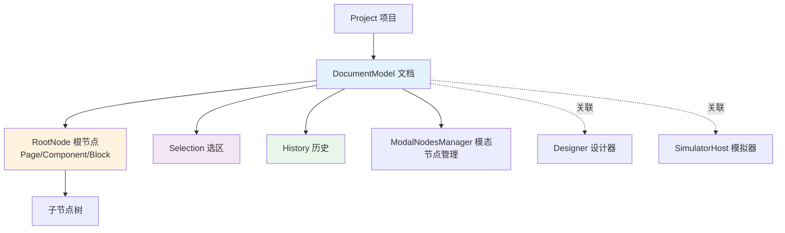
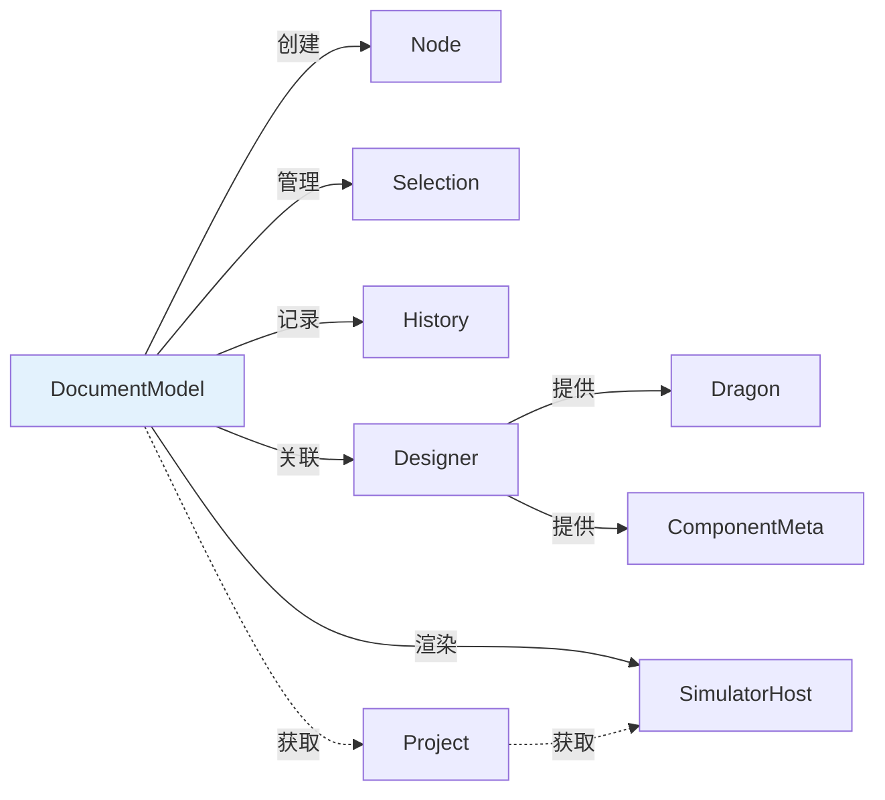

# DocumentModel 文档模型详解

> **源码位置**: `packages/designer/src/document/document-model.ts`
> **公开类型**: `@types` [IPublicModelDocumentModel](https://github.com/alibaba/lowcode-engine/blob/main/packages/types/src/shell/model/document-model.ts)
> **引擎版本**: v1.0.0+

---

## 📋 **目录**

- [基本介绍](#基本介绍)
- [核心属性](#核心属性)
- [节点管理方法](#节点管理方法)
- [Schema 导入导出](#schema-导入导出)
- [事件监听方法](#事件监听方法)
- [底层原理解析](#底层原理解析)

---

## 🎯 **基本介绍**

DocumentModel 是**低代码引擎的文档模型**，代表一个可编辑的页面/组件/区块文档。它是文档级别的核心控制器。

### **主要职责**

1. **节点树管理** - 维护整个节点树结构
2. **选区控制** - 管理节点选择状态
3. **历史记录** - 操作撤销/重做
4. **Schema 转换** - 数据导入导出
5. **事件协调** - 文档级事件发布

### **架构关系**



---

## 🏷️ **一、核心属性**

### **1. id**

```typescript
id: string
```

| 属性 | 说明 |
|------|------|
| **作用** | 文档唯一标识符 |
| **关联模块** | Project（项目管理）|
| **底层原理** | 通过 `uniqueId('doc')` 生成，格式如 `doc_abc123` |
| **可读写** | ✅ 可读可写 |
| **使用场景** | 多文档管理、文档索引 |

**代码示例**：
```typescript
const document = project.currentDocument;
console.log(document.id); // "doc_k1f2g3h4"

// 通过 project 获取指定文档
const doc = project.getDocument('doc_abc123');
```

**底层实现**（第165行）：
```typescript
id: string = uniqueId('doc'); // 自动生成唯一 ID
```

---

### **2. selection**

```typescript
readonly selection: IPublicModelSelection
```

| 属性 | 说明 |
|------|------|
| **作用** | 画布节点选中区模型实例 |
| **关联模块** | Selection（选区管理）、UI 高亮显示 |
| **底层原理** | 构造时创建 `new Selection(this)` |
| **可读写** | ❌ 只读（但 selection 内部状态可变）|
| **使用场景** | 获取/设置选中节点、多选操作 |

**代码示例**：
```typescript
const { selection } = document;

// 选中单个节点
selection.select('node_123');

// 选中多个节点
selection.selectAll(['node_123', 'node_456']);

// 获取选中的节点
const selectedNodes = selection.getNodes();
console.log(selectedNodes.map(n => n.id));

// 清空选择
selection.clear();

// 判断节点是否选中
if (selection.has('node_123')) {
  console.log('节点已选中');
}
```

**底层实现**（第170行）：
```typescript
readonly selection: ISelection = new Selection(this);
```

**相关章节**: [节点选中区模型](./selection)

---

### **3. detecting**

```typescript
readonly detecting: IPublicModelDetecting
```

| 属性 | 说明 |
|------|------|
| **作用** | 画布节点 hover 区模型实例 |
| **关联模块** | Detecting（悬停检测）、UI 高亮 |
| **底层原理** | Designer 中创建，文档引用 |
| **可读写** | ❌ 只读 |
| **使用场景** | 鼠标悬停高亮、hover 态管理 |

**代码示例**：
```typescript
// ⚠️ 注意：detecting 属性在内部文档模型中不存在
// 它是通过 Shell API 包装后提供的

// 在插件中使用（通过 project.currentDocument）
const { detecting } = project.currentDocument;

// 禁用悬停检测（如拖拽时）
detecting.enable = false;

// 启用悬停检测
detecting.enable = true;

// 获取当前悬停的节点
const hoverNode = detecting.current;
```

**底层说明**（第67行接口注释）：
```typescript
// detecting 在内部接口中被排除，由 Shell 层提供
export interface IDocumentModel extends Omit<IPublicModelDocumentModel,
  'detecting' | // ⬅️ 内部不直接暴露
  // ...
> {
  // 内部实现不包含 detecting
}
```

**相关章节**: [画布节点悬停模型](./detecting)

---

### **4. history**

```typescript
readonly history: IPublicModelHistory
```

| 属性 | 说明 |
|------|------|
| **作用** | 操作历史模型实例（撤销/重做）|
| **关联模块** | History（历史管理）|
| **底层原理** | 构造时创建 `new History(...)` |
| **可读写** | ❌ 只读（但 history 内部状态可变）|
| **使用场景** | 撤销操作、重做操作、历史记录管理 |

**代码示例**：
```typescript
const { history } = document;

// 撤销（Ctrl+Z）
history.back();

// 重做（Ctrl+Y）
history.forward();

// 保存当前状态点（如保存到服务器后）
history.savePoint();

// 检查是否可以撤销
if (history.canBack()) {
  console.log('可以撤销');
}

// 检查是否可以重做
if (history.canForward()) {
  console.log('可以重做');
}

// 跳转到指定历史记录
history.go(-2); // 后退 2 步
history.go(1);  // 前进 1 步
```

**底层实现**（第175、333-340行）：
```typescript
readonly history: IHistory;

this.history = new History(
  () => this.export(IPublicEnumTransformStage.Serilize), // 获取当前状态
  (schema) => {
    this.import(schema as IPublicTypeRootSchema, true);   // 恢复状态
    this.simulator?.rerender();
  },
  this,
);
```

**相关章节**: [操作历史模型](./history)

---

### **5. project**

```typescript
readonly project: IPublicApiProject
```

| 属性 | 说明 |
|------|------|
| **作用** | 获取文档所属的项目实例 |
| **关联模块** | Project（项目管理）|
| **底层原理** | 构造函数注入，只读引用 |
| **可读写** | ❌ 只读 |
| **使用场景** | 访问项目级配置、切换文档、获取 simulator |

**代码示例**：
```typescript
const { project } = document;

// 获取项目中所有文档
const allDocuments = project.documents;

// 获取当前活跃文档
const currentDoc = project.currentDocument;

// 打开新文档
project.openDocument(newDocId);

// 获取模拟器
const simulator = project.simulator;
```

**底层实现**（第184、314行）：
```typescript
readonly project: IProject;

constructor(project: IProject, schema?: IPublicTypeRootSchema) {
  this.project = project;
  // ...
}
```

---

### **6. root**

```typescript
get root(): IPublicModelNode | null
```

| 属性 | 说明 |
|------|------|
| **作用** | 获取文档的根节点（Page/Component/Block）|
| **关联模块** | Node（节点模型）|
| **底层原理** | 构造时通过 `createNode(schema)` 创建 |
| **可读写** | ❌ 只读（getter）|
| **使用场景** | 访问页面根节点、遍历节点树 |

**代码示例**：
```typescript
const rootNode = document.root;

if (rootNode) {
  console.log(rootNode.componentName); // "Page"

  // 遍历根节点的子节点
  rootNode.children?.forEach(child => {
    console.log(child.componentName);
  });

  // 修改根节点属性
  rootNode.setPropValue('title', '新页面');
}
```

**底层实现**（第160、308-310、325-331行）：
```typescript
rootNode: IRootNode | null;

get root() {
  return this.rootNode;
}

// 构造函数中创建
this.rootNode = this.createNode(
  schema || {
    componentName: 'Page',
    id: 'root',
    fileName: '',
  },
);
```

---

### **7. nodesMap**

```typescript
get nodesMap(): Map<string, IPublicModelNode>
```

| 属性 | 说明 |
|------|------|
| **作用** | 获取文档下所有节点的 Map，key 为 nodeId |
| **关联模块** | Node（节点管理）|
| **底层原理** | 私有 `_nodesMap` 的 getter，每次 `createNode` 时自动注册 |
| **可读写** | ❌ 只读（但 Map 内容可通过其他方法修改）|
| **使用场景** | 快速根据 ID 查找节点、统计节点数量、遍历所有节点 |

**代码示例**：
```typescript
const { nodesMap } = document;

// 获取节点总数
console.log(`文档共有 ${nodesMap.size} 个节点`);

// 根据 ID 获取节点
const node = nodesMap.get('node_123');

// 遍历所有节点
for (const [id, node] of nodesMap) {
  console.log(`${id}: ${node.componentName}`);
}

// 查找特定类型的所有节点
const buttons = Array.from(nodesMap.values())
  .filter(node => node.componentName === 'Button');
console.log(`共有 ${buttons.length} 个按钮`);

// 检查节点是否存在
if (nodesMap.has('node_456')) {
  console.log('节点存在');
}
```

**底层实现**（第182、208-210、477行）：
```typescript
private _nodesMap = new Map<string, INode>();

get nodesMap(): Map<string, INode> {
  return this._nodesMap;
}

// createNode 时自动注册
createNode(data) {
  const node = new Node(this, schema);
  this._nodesMap.set(node.id, node); // 🔥 注册节点
  this.nodes.add(node);
  return node;
}
```

---

### **8. modalNodesManager**

```typescript
modalNodesManager: IPublicModelModalNodesManager | null
```

| 属性 | 说明 |
|------|------|
| **作用** | 模态节点管理器（如 Dialog、Drawer）|
| **关联模块** | ModalNodesManager |
| **底层原理** | 构造时创建 `new ModalNodesManager(this)` |
| **可读写** | ✅ 可读可写（import 时会重新创建）|
| **使用场景** | 管理模态弹窗节点、临时节点 |

**代码示例**：
```typescript
const { modalNodesManager } = document;

// 获取所有模态节点
const modalNodes = modalNodesManager?.getModalNodes();

// 设置模态节点可见性
modalNodesManager?.setVisible(dialogNode, true);

// 隐藏所有模态节点
modalNodesManager?.hideAll();
```

**底层实现**（第180、343、570行）：
```typescript
modalNodesManager: IModalNodesManager;

// 构造函数中创建
this.modalNodesManager = new ModalNodesManager(this);

// import 时重新创建
import(schema: IPublicTypeRootSchema, checkId = false) {
  // ... 清理节点 ...
  this.rootNode?.import(schema as any, checkId);
  this.modalNodesManager = new ModalNodesManager(this); // 🔁 重建
}
```

**相关章节**: [模态节点管理器](./modal-nodes-manager)

---

### **9. dropLocation** ⭐

```typescript
dropLocation: IPublicModelDropLocation | null
```

| 属性 | 说明 |
|------|------|
| **作用** | 拖拽放置位置标记（实时显示插入指示器）|
| **关联模块** | Dragon（拖拽引擎）、BorderDetecting（插入指示器）|
| **底层原理** | MobX `@obx.ref` 响应式，setter 触发事件 |
| **可读写** | ✅ 可读可写 |
| **使用场景** | 拖拽过程中显示插入位置提示 |
| **版本要求** | **@since v1.1.0** |

**代码示例**：
```typescript
// 在 Dragon 拖拽过程中设置
document.dropLocation = {
  target: parentNode,  // 投放目标节点
  index: 2,           // 插入位置索引
  detail: {
    type: 'Children', // 投放区域类型
    edge: null,
  },
};

// 读取当前投放位置
const location = document.dropLocation;
if (location) {
  console.log('投放目标:', location.target.componentName);
  console.log('插入位置:', location.index);
}

// 监听位置变化
document.onDropLocationChanged((doc) => {
  const loc = doc.dropLocation;
  if (loc) {
    console.log('投放位置变化:', loc);
  }
});

// 清除投放位置（拖拽结束时）
document.dropLocation = null;
```

**底层实现**（第251-267行）：
```typescript
@obx.ref private _dropLocation: IDropLocation | null = null;

set dropLocation(loc: IDropLocation | null) {
  this._dropLocation = loc;

  // 🔔 发布事件，供 UI 监听
  this.designer.editor.eventBus.emit(
    'document.dropLocation.changed',
    { document: this, location: loc },
  );
}

get dropLocation() {
  return this._dropLocation;
}
```

**DropLocation 类型**：
```typescript
interface IDropLocation {
  target: INode;     // 投放目标容器节点
  index: number;     // 插入位置索引（在 children 中的位置）
  detail: {
    type: 'Children' | 'Slot'; // 投放区域类型
    edge?: 'before' | 'after';  // 边缘插入方向
  };
}
```

**@since v1.1.0**

---

## 🛠️ **二、节点管理方法**

### **1. getNodeById**

```typescript
getNodeById(nodeId: string): IPublicModelNode | null
```

| 方法 | 说明 |
|------|------|
| **作用** | 根据 ID 获取节点实例 |
| **关联模块** | nodesMap |
| **底层原理** | 直接从 `_nodesMap` 获取 |
| **参数** | `nodeId`: 节点 ID |
| **返回值** | Node 实例或 null |

**代码示例**：
```typescript
// 通过 ID 查找节点
const node = document.getNodeById('node_123');

if (node) {
  console.log('节点名称:', node.componentName);
  console.log('节点属性:', node.props);

  // 修改节点
  node.setPropValue('text', '新文本');
} else {
  console.log('节点不存在');
}

// 批量获取节点
const nodeIds = ['node_1', 'node_2', 'node_3'];
const nodes = nodeIds
  .map(id => document.getNodeById(id))
  .filter(Boolean); // 过滤掉 null
```

**底层实现**（第397-399行）：
```typescript
getNode(id: string): INode | null {
  return this._nodesMap.get(id) || null;
}
```

**注意**：
- 内部方法名为 `getNode`，Shell API 包装为 `getNodeById`
- 返回的节点可能是 `null`，使用前需判断

---

### **2. createNode**

```typescript
createNode(data: any): IPublicModelNode | null
```

| 方法 | 说明 |
|------|------|
| **作用** | 根据 Schema 创建节点实例 |
| **关联模块** | Node（节点构造）、ComponentMeta |
| **底层原理** | `new Node(this, schema)` + 自动注册到 `nodesMap` |
| **参数** | `data`: NodeSchema 或文本/表达式 |
| **返回值** | 创建的 Node 实例 |
| **触发事件** | `nodecreate` 事件（内部）|

**代码示例**：
```typescript
// 创建组件节点
const buttonNode = document.createNode({
  componentName: 'Button',
  props: {
    type: 'primary',
    text: '点击我',
  },
  children: [],
});

// 创建文本节点
const textNode = document.createNode('Hello World');

// 创建嵌套结构
const containerNode = document.createNode({
  componentName: 'Div',
  props: { className: 'container' },
  children: [
    {
      componentName: 'Button',
      props: { text: '按钮1' },
    },
    {
      componentName: 'Button',
      props: { text: '按钮2' },
    },
  ],
});

console.log('创建的节点 ID:', buttonNode.id);
```

**底层实现**（第427-484行）：
```typescript
@action
createNode<T extends INode = INode, C = undefined>(data: GetDataType<C, T>): T {
  let schema: any;

  // 🎯 处理文本或表达式
  if (isDOMText(data) || isJSExpression(data)) {
    schema = {
      componentName: 'Leaf', // 文本节点使用 'Leaf'
      children: data,
    };
  } else {
    schema = data;
  }

  let node: INode | null = null;

  // 🔍 ID 冲突检查
  if (this.hasNode(schema?.id)) {
    schema.id = null; // 清除冲突 ID，自动生成新 ID
  }

  // 🏗️ 创建新节点实例
  if (!node) {
    node = new Node(this, schema); // 🔥 核心：创建节点
  }

  // 📝 注册节点
  this._nodesMap.set(node.id, node);
  this.nodes.add(node);

  // 🔔 发送节点创建事件
  this.emitter.emit('nodecreate', node);

  return node as any;
}
```

**注意事项**：
- 创建的节点**未自动插入文档树**，需要使用 `insertNode` 插入
- 支持嵌套结构（children 会递归创建）
- ID 冲突时自动生成新 ID

---

### **3. insertNode**

```typescript
insertNode(
  parent: IPublicModelNode,
  thing: IPublicModelNode,
  at?: number | null,
  copy?: boolean
): IPublicModelNode | null
```

| 方法 | 说明 |
|------|------|
| **作用** | 向父节点插入子节点 |
| **关联模块** | NodeChildren |
| **底层原理** | 调用 `insertChild` 工具函数 |
| **参数** | `parent`: 父节点<br/>`thing`: 要插入的节点<br/>`at`: 插入位置索引<br/>`copy`: 是否复制插入 |
| **返回值** | 插入的节点实例 |

**代码示例**：
```typescript
// 插入到末尾
const newNode = document.createNode({ componentName: 'Button' });
document.insertNode(
  parentNode,
  newNode
  // at 不传，默认插入到末尾
);

// 插入到指定位置
document.insertNode(
  parentNode,
  buttonNode,
  0 // 插入到第一个位置
);

// 复制插入
document.insertNode(
  parentNode,
  existingNode,
  2,
  true // 🔥 复制模式，不移动原节点
);

// 插入到兄弟节点之前
const targetIndex = parentNode.children.indexOf(siblingNode);
document.insertNode(parentNode, newNode, targetIndex);
```

**底层实现**（第493-495行）：
```typescript
insertNode(parent: INode, thing: INode | IPublicTypeNodeData, at?: number | null, copy?: boolean): INode | null {
  return insertChild(parent, thing, at, copy);
}
```

**插入逻辑**（insertChild 函数）：
```typescript
// 简化版实现
function insertChild(parent: INode, thing: INode | Schema, at?: number, copy?: boolean) {
  let node: INode;

  if (isNode(thing)) {
    if (copy) {
      // 复制模式：克隆节点
      node = parent.document.createNode(thing.export());
    } else {
      // 移动模式：从原位置移除
      thing.remove(false);
      node = thing;
    }
  } else {
    // 创建新节点
    node = parent.document.createNode(thing);
  }

  // 插入到父节点
  parent.children.insert(node, at);

  return node;
}
```

---

### **4. removeNode**

```typescript
removeNode(idOrNode: string | IPublicModelNode): void
```

| 方法 | 说明 |
|------|------|
| **作用** | 移除指定节点 |
| **关联模块** | Node、NodeChildren |
| **底层原理** | 调用 `node.remove()` + 从 `nodesMap` 删除 |
| **参数** | `idOrNode`: 节点 ID 或节点实例 |
| **返回值** | void |

**代码示例**：
```typescript
// 通过 ID 删除
document.removeNode('node_123');

// 通过实例删除
const node = document.getNodeById('node_456');
if (node) {
  document.removeNode(node);
}

// 删除选中的节点
const selectedNodes = document.selection.getNodes();
selectedNodes.forEach(node => {
  document.removeNode(node);
});

// 条件删除
for (const [id, node] of document.nodesMap) {
  if (node.componentName === 'DeprecatedComponent') {
    document.removeNode(id);
  }
}
```

**底层实现**（第507-521、526-531行）：
```typescript
removeNode(idOrNode: string | INode) {
  let id: string;
  let node: INode | null = null;

  if (typeof idOrNode === 'string') {
    id = idOrNode;
    node = this.getNode(id);
  } else if (idOrNode.id) {
    id = idOrNode.id;
    node = this.getNode(id);
  }

  if (!node) {
    return;
  }

  this.internalRemoveAndPurgeNode(node, true);
}

internalRemoveAndPurgeNode(node: INode, useMutator = false) {
  if (!this.nodes.has(node)) {
    return;
  }
  node.remove(useMutator); // 🔥 调用节点的 remove 方法
}
```

**节点移除流程**：
1. 从父节点的 children 中移除
2. 触发 `beforeDestroy` 生命周期
3. 从 `nodesMap` 中删除
4. 清理节点内部状态
5. 触发 `nodedestroy` 事件

---

### **5. checkNesting**

```typescript
checkNesting(
  dropTarget: IPublicModelNode,
  dragObject: IPublicTypeDragNodeObject | IPublicTypeDragNodeDataObject
): boolean
```

| 方法 | 说明 |
|------|------|
| **作用** | 检查拖拽对象是否可以放置到目标节点 |
| **关联模块** | ComponentMeta、Dragon |
| **底层原理** | 调用 `checkNestingUp` + `checkNestingDown` 双向检查 |
| **参数** | `dropTarget`: 投放目标节点<br/>`dragObject`: 拖拽对象 |
| **返回值** | boolean（是否允许放置）|
| **版本要求** | **@since v1.0.16** |

**代码示例**：
```typescript
// 在拖拽前检查是否可以放置
const canDrop = document.checkNesting(
  containerNode,
  {
    type: 'NodeData',
    data: { componentName: 'Button', props: {} },
  }
);

if (canDrop) {
  // 可以放置，执行插入
  document.insertNode(containerNode, buttonSchema);
} else {
  // 不能放置，显示提示
  message.error('该组件不能放置在此容器中');
}

// 在自定义传感器中使用
class CustomSensor {
  locate(event) {
    const target = this.getTargetNode(event);
    const dragObject = event.dragObject;

    // 🔥 检查嵌套规则
    const canDrop = document.checkNesting(target, dragObject);

    if (canDrop) {
      document.dropLocation = {
        target,
        index: this.calculateIndex(event),
      };
      return true;
    }

    return false;
  }
}
```

**底层实现**（第688-704行）：
```typescript
checkNesting(
  dropTarget: INode,
  dragObject: IPublicTypeDragNodeObject | IPublicTypeNodeSchema | INode | IPublicTypeDragNodeDataObject,
): boolean {
  let items: Array<INode | IPublicTypeNodeSchema>;

  // 🔍 解析拖拽对象
  if (isDragNodeDataObject(dragObject)) {
    items = Array.isArray(dragObject.data) ? dragObject.data : [dragObject.data];
  } else if (isDragNodeObject<INode>(dragObject)) {
    items = dragObject.nodes;
  } else if (isNode<INode>(dragObject) || isNodeSchema(dragObject)) {
    items = [dragObject];
  } else {
    console.warn('the dragObject is not in the correct type, dragObject:', dragObject);
    return true;
  }

  // ✅ 双向检查：父级对子级的要求 + 子级对父级的要求
  return items.every((item) =>
    this.checkNestingDown(dropTarget, item) &&  // 父级允许这个子级
    this.checkNestingUp(dropTarget, item)       // 子级允许这个父级
  );
}
```

**嵌套规则配置**：
```typescript
// 在组件元数据中配置
{
  componentName: 'Form',
  configure: {
    component: {
      nestingRule: {
        // parentWhitelist: 子级对父级的要求
        parentWhitelist: ['Page', 'Div', 'Modal'],

        // childWhitelist: 父级对子级的要求
        childWhitelist: ['FormItem', 'Button'],
      },
    },
  },
}
```

**@since v1.0.16**

---

### **6. isDetectingNode**

```typescript
isDetectingNode(node: IPublicModelNode): boolean
```

| 方法 | 说明 |
|------|------|
| **作用** | 判断节点是否处于被探测状态（hover）|
| **关联模块** | Detecting |
| **底层原理** | 通过 Designer 的 detecting 实例判断 |
| **参数** | `node`: 要检查的节点 |
| **返回值** | boolean |
| **版本要求** | **@since v1.1.0** |

**代码示例**：
```typescript
// 检查节点是否被 hover
const isHovering = document.isDetectingNode(node);

if (isHovering) {
  console.log('节点正在被 hover');
  // 显示特殊 UI
}

// 在渲染中使用
function NodeComponent({ node }) {
  const isDetecting = document.isDetectingNode(node);

  return (
    <div className={isDetecting ? 'hover-highlight' : ''}>
      {node.componentName}
    </div>
  );
}

// 监听 hover 变化
document.onChangeDetecting((hoveredNode) => {
  // 遍历所有节点，检查哪些被 hover
  for (const [id, node] of document.nodesMap) {
    if (document.isDetectingNode(node)) {
      console.log('Hover:', node.componentName);
    }
  }
});
```

**底层实现**（Shell 层提供）：
```typescript
// Shell API 包装
isDetectingNode(node: IPublicModelNode): boolean {
  return this.designer.detecting?.current === node;
}
```

**@since v1.1.0**

---

## 📤 **三、Schema 导入导出**

### **1. importSchema**

```typescript
importSchema(schema: IPublicTypeRootSchema): void
```

| 方法 | 说明 |
|------|------|
| **作用** | 导入 Schema 数据，替换当前文档内容 |
| **关联模块** | RootNode、ModalNodesManager |
| **底层原理** | 清空所有节点 + `rootNode.import()` + 重建模态管理器 |
| **参数** | `schema`: 根节点 Schema |
| **返回值** | void |
| **触发事件** | 清空全局事件、重新渲染 |

**代码示例**：
```typescript
// 从本地存储加载页面
const savedSchema = localStorage.getItem('page-schema');
if (savedSchema) {
  const schema = JSON.parse(savedSchema);
  document.importSchema(schema);
}

// 从服务器加载页面
async function loadPage(pageId) {
  const response = await fetch(`/api/pages/${pageId}`);
  const schema = await response.json();

  document.importSchema(schema);
  console.log('页面加载完成');
}

// 重置页面为初始状态
const initialSchema = {
  componentName: 'Page',
  props: { title: '新页面' },
  children: [],
};
document.importSchema(initialSchema);
```

**底层实现**（第560-576行）：
```typescript
@action
import(schema: IPublicTypeRootSchema, checkId = false) {
  const drillDownNodeId = this._drillDownNode?.id;

  runWithGlobalEventOff(() => { // 🔇 暂停全局事件
    // 🗑️ 删除所有非根节点
    this.nodes.forEach(node => {
      if (node.isRoot()) return;
      this.internalRemoveAndPurgeNode(node, true);
    });

    // 🔄 导入新 Schema
    this.rootNode?.import(schema as any, checkId);

    // 🔁 重建模态节点管理器
    this.modalNodesManager = new ModalNodesManager(this);

    // 🎯 恢复下钻状态
    if (drillDownNodeId) {
      this.drillDown(this.getNode(drillDownNodeId));
    }
  });
}
```

**注意事项**：
- **会清空当前所有内容**，谨慎使用
- 导入过程中会暂停事件发布（性能优化）
- 导入后需手动调用 `simulator.rerender()` 重新渲染

---

### **2. exportSchema**

```typescript
exportSchema(stage: IPublicEnumTransformStage): IPublicTypeRootSchema | undefined
```

| 方法 | 说明 |
|------|------|
| **作用** | 导出文档的 Schema 数据 |
| **关联模块** | RootNode |
| **底层原理** | 调用 `rootNode.export()` + 置顶节点排序 |
| **参数** | `stage`: 导出阶段（Render/Save/Serilize/Clone）|
| **返回值** | RootSchema 数据 |

**代码示例**：
```typescript
import { IPublicEnumTransformStage } from '@alilc/lowcode-types';

// 导出用于保存的 Schema
const schema = document.exportSchema(IPublicEnumTransformStage.Save);
localStorage.setItem('page-schema', JSON.stringify(schema));

// 导出用于渲染的 Schema
const renderSchema = document.exportSchema(IPublicEnumTransformStage.Render);
// renderSchema 可能包含运行时计算的属性

// 导出用于序列化的 Schema（默认）
const serilizeSchema = document.exportSchema(IPublicEnumTransformStage.Serilize);

// 导出用于克隆的 Schema
const cloneSchema = document.exportSchema(IPublicEnumTransformStage.Clone);

// 保存到服务器
async function savePage() {
  const schema = document.exportSchema(IPublicEnumTransformStage.Save);

  await fetch('/api/pages', {
    method: 'POST',
    headers: { 'Content-Type': 'application/json' },
    body: JSON.stringify({
      pageId: 'page_123',
      schema,
    }),
  });

  console.log('页面保存成功');
}
```

**底层实现**（第578-592行）：
```typescript
export(stage: IPublicEnumTransformStage = IPublicEnumTransformStage.Serilize): IPublicTypeRootSchema | undefined {
  stage = compatStage(stage);

  // 🌳 导出根节点 Schema
  const currentSchema = this.rootNode?.export<IPublicTypeRootSchema>(stage);

  // 🔝 处理置顶节点（__isTopFixed__）
  if (Array.isArray(currentSchema?.children) && currentSchema?.children?.length > 0) {
    const FixedTopNodeIndex = currentSchema.children
      .filter(i => isPlainObject(i))
      .findIndex((i => (i as IPublicTypeNodeSchema).props?.__isTopFixed__));

    if (FixedTopNodeIndex > 0) {
      const FixedTopNode = currentSchema.children.splice(FixedTopNodeIndex, 1);
      currentSchema.children.unshift(FixedTopNode[0]); // 置顶
    }
  }

  return currentSchema;
}
```

**导出阶段说明**：

| 阶段 | 用途 | 特点 |
|------|------|------|
| **Render** | 渲染时使用 | 包含运行时计算属性 |
| **Save** | 保存到服务器 | 完整数据，包含元信息 |
| **Serilize** | 序列化/默认 | 标准格式，通用场景 |
| **Clone** | 克隆节点 | 深拷贝，重新生成 ID |

---

## 🔔 **四、事件监听方法**

DocumentModel 提供了丰富的事件监听能力，遵循**观察者模式**。

### **1. onAddNode**

```typescript
onAddNode(fn: (node: IPublicModelNode) => void): IPublicTypeDisposable
```

| 方法 | 说明 |
|------|------|
| **作用** | 监听节点创建事件 |
| **触发时机** | `createNode()` 方法被调用时 |
| **关联模块** | 内部 EventEmitter |
| **返回值** | 取消监听函数 |

**代码示例**：
```typescript
// 监听节点创建
const dispose = document.onAddNode((node) => {
  console.log('新节点创建:', node.componentName, node.id);

  // 自动为新创建的 Button 添加默认属性
  if (node.componentName === 'Button' && !node.getPropValue('type')) {
    node.setPropValue('type', 'primary');
  }
});

// 取消监听
dispose();
```

**底层实现**（第897-903行）：
```typescript
onNodeCreate(func: (node: INode) => void) {
  const wrappedFunc = wrapWithEventSwitch(func); // 🔇 支持全局事件开关
  this.emitter.on('nodecreate', wrappedFunc);
  return () => {
    this.emitter.removeListener('nodecreate', wrappedFunc);
  };
}
```

---

### **2. onMountNode**

```typescript
onMountNode(fn: (payload: { node: IPublicModelNode }) => void): IPublicTypeDisposable
```

| 方法 | 说明 |
|------|------|
| **作用** | 监听节点挂载事件（节点已插入文档树）|
| **触发时机** | 节点通过 `insertNode` 插入到文档树后 |
| **关联模块** | 全局 EventBus |
| **返回值** | 取消监听函数 |

**代码示例**：
```typescript
// 监听节点挂载
document.onMountNode(({ node }) => {
  console.log('节点已挂载:', node.componentName);

  // 节点挂载后执行初始化逻辑
  if (node.componentName === 'Form') {
    initializeFormValidation(node);
  }
});
```

**底层实现**（第416-422行）：
```typescript
onMountNode(fn: (payload: { node: INode }) => void) {
  this.designer.editor.eventBus.on('node.add', fn as any);
  return () => {
    this.designer.editor.eventBus.off('node.add', fn as any);
  };
}
```

---

### **3. onRemoveNode**

```typescript
onRemoveNode(fn: (node: IPublicModelNode) => void): IPublicTypeDisposable
```

| 方法 | 说明 |
|------|------|
| **作用** | 监听节点删除事件 |
| **触发时机** | 节点被销毁时 |
| **返回值** | 取消监听函数 |

**代码示例**：
```typescript
document.onRemoveNode((node) => {
  console.log('节点被删除:', node.id);

  // 清理节点相关资源
  cleanupNodeResources(node);
});
```

**底层实现**（第905-911行）：
```typescript
onNodeDestroy(func: (node: INode) => void) {
  const wrappedFunc = wrapWithEventSwitch(func);
  this.emitter.on('nodedestroy', wrappedFunc);
  return () => {
    this.emitter.removeListener('nodedestroy', wrappedFunc);
  };
}
```

---

### **4. onChangeDetecting**

```typescript
onChangeDetecting(fn: (node: IPublicModelNode) => void): IPublicTypeDisposable
```

| 方法 | 说明 |
|------|------|
| **作用** | 监听 hover 变更事件 |
| **触发时机** | 鼠标 hover 到不同节点时 |
| **返回值** | 取消监听函数 |

**代码示例**：
```typescript
document.onChangeDetecting((node) => {
  console.log('Hover 节点:', node?.componentName || 'null');

  // 显示节点信息面板
  if (node) {
    showNodeInfoPanel(node);
  } else {
    hideNodeInfoPanel();
  }
});
```

---

### **5. onChangeSelection**

```typescript
onChangeSelection(fn: (ids: string[]) => void): IPublicTypeDisposable
```

| 方法 | 说明 |
|------|------|
| **作用** | 监听选中变更事件 |
| **触发时机** | 选中的节点发生变化时 |
| **参数** | `ids`: 选中的节点 ID 数组 |
| **返回值** | 取消监听函数 |

**代码示例**：
```typescript
document.onChangeSelection((ids) => {
  console.log('选中节点 IDs:', ids);

  // 更新属性面板
  if (ids.length === 1) {
    const node = document.getNodeById(ids[0]);
    updatePropertiesPanel(node);
  } else if (ids.length > 1) {
    showMultiSelectionPanel(ids);
  } else {
    clearPropertiesPanel();
  }
});
```

---

### **6. onChangeNodeVisible**

```typescript
onChangeNodeVisible(
  fn: (node: IPublicModelNode, visible: boolean) => void
): IPublicTypeDisposable
```

| 方法 | 说明 |
|------|------|
| **作用** | 监听节点显隐状态变更 |
| **触发时机** | 节点的 visible 属性改变时 |
| **返回值** | 取消监听函数 |

**代码示例**：
```typescript
document.onChangeNodeVisible((node, visible) => {
  console.log(`节点 ${node.id} ${visible ? '显示' : '隐藏'}`);

  // 更新大纲树的显示状态
  updateOutlineTree(node.id, visible);
});
```

**底层实现**（第351-357行）：
```typescript
onChangeNodeVisible(fn: (node: INode, visible: boolean) => void): IPublicTypeDisposable {
  this.designer.editor?.eventBus.on(EDITOR_EVENT.NODE_VISIBLE_CHANGE, fn);
  return () => {
    this.designer.editor?.eventBus.off(EDITOR_EVENT.NODE_VISIBLE_CHANGE, fn);
  };
}
```

---

### **7. onChangeNodeChildren**

```typescript
onChangeNodeChildren(
  fn: (info?: IPublicTypeOnChangeOptions) => void
): IPublicTypeDisposable
```

| 方法 | 说明 |
|------|------|
| **作用** | 监听节点子节点变更 |
| **触发时机** | 节点的 children 增删改时 |
| **返回值** | 取消监听函数 |

**代码示例**：
```typescript
document.onChangeNodeChildren((info) => {
  console.log('子节点变更:', info);

  // 更新节点树视图
  refreshNodeTree();
});
```

---

### **8. onChangeNodeProp**

```typescript
onChangeNodeProp(
  fn: (info: IPublicTypePropChangeOptions) => void
): IPublicTypeDisposable
```

| 方法 | 说明 |
|------|------|
| **作用** | 监听节点属性修改 |
| **触发时机** | 节点的 props 改变时 |
| **返回值** | 取消监听函数 |

**代码示例**：
```typescript
document.onChangeNodeProp((info) => {
  console.log('属性变更:', {
    node: info.node,
    key: info.key,
    oldValue: info.oldValue,
    newValue: info.newValue,
  });

  // 实时预览属性变化
  if (info.key === 'style') {
    updatePreview();
  }
});
```

---

### **9. onImportSchema**

```typescript
onImportSchema(
  fn: (schema: IPublicTypeRootSchema) => void
): IPublicTypeDisposable
```

| 方法 | 说明 |
|------|------|
| **作用** | 监听 Schema 导入事件 |
| **触发时机** | `importSchema()` 被调用时 |
| **版本要求** | **@since v1.0.15** |
| **返回值** | 取消监听函数 |

**代码示例**：
```typescript
document.onImportSchema((schema) => {
  console.log('Schema 已导入:', schema);

  // 记录导入日志
  logSchemaImport(schema);

  // 重新初始化某些状态
  reinitializePlugins();
});
```

**@since v1.0.15**

---

### **10. onFocusNodeChanged**

```typescript
onFocusNodeChanged(
  fn: (doc: IPublicModelDocumentModel, focusNode: IPublicModelNode) => void
): IPublicTypeDisposable
```

| 方法 | 说明 |
|------|------|
| **作用** | 监听聚焦节点变化（下钻容器）|
| **触发时机** | 通过插件手动设置聚焦节点时 |
| **版本要求** | **@since v1.1.0** |
| **返回值** | 取消监听函数 |

**代码示例**：
```typescript
document.onFocusNodeChanged((doc, focusNode) => {
  console.log('聚焦节点变化:', focusNode?.componentName);

  // 更新面包屑导航
  updateBreadcrumb(focusNode);
});
```

**@since v1.1.0**

---

### **11. onDropLocationChanged**

```typescript
onDropLocationChanged(
  fn: (doc: IPublicModelDocumentModel) => void
): IPublicTypeDisposable
```

| 方法 | 说明 |
|------|------|
| **作用** | 监听拖拽位置变化 |
| **触发时机** | `dropLocation` setter 被调用时 |
| **版本要求** | **@since v1.1.0** |
| **返回值** | 取消监听函数 |

**代码示例**：
```typescript
document.onDropLocationChanged((doc) => {
  const location = doc.dropLocation;

  if (location) {
    console.log('拖拽位置:', {
      target: location.target.componentName,
      index: location.index,
    });

    // 显示插入指示器
    showInsertIndicator(location);
  } else {
    // 隐藏插入指示器
    hideInsertIndicator();
  }
});
```

**触发位置**（第253-260行）：
```typescript
set dropLocation(loc: IDropLocation | null) {
  this._dropLocation = loc;

  // 🔔 触发事件
  this.designer.editor.eventBus.emit(
    'document.dropLocation.changed',
    { document: this, location: loc },
  );
}
```

**@since v1.1.0**

---

## 🔧 **五、底层原理解析**

### **1. MobX 响应式系统**

DocumentModel 使用 MobX 实现响应式状态管理：

```typescript
import { makeObservable, obx, action } from '@alilc/lowcode-editor-core';

export class DocumentModel {
  @obx.ref private _dropLocation: IDropLocation | null = null; // 响应式引用
  @obx.shallow private nodes = new Set<INode>();               // 浅响应式集合

  @action  // MobX action 标记
  createNode() { /* ... */ }

  @action
  import() { /* ... */ }

  constructor() {
    makeObservable(this); // 激活 MobX 响应式
  }
}
```

**关键装饰器**：
- `@obx.ref`: 引用响应式（只监听引用变化）
- `@obx.shallow`: 浅响应式（监听集合增删）
- `@action`: 标记修改状态的方法

---

### **2. 双层事件系统**

```typescript
// 1️⃣ 内部 EventEmitter（模块级事件）
private emitter: IEventBus;
this.emitter = createModuleEventBus('DocumentModel');

// 触发内部事件
this.emitter.emit('nodecreate', node);

// 2️⃣ 全局 EventBus（跨模块事件）
this.designer.editor.eventBus.emit('document.dropLocation.changed', { ... });
```

**事件分类**：
- **内部事件**：`nodecreate`、`nodedestroy`
- **全局事件**：`node.add`、`NODE_VISIBLE_CHANGE`、`document.dropLocation.changed`

---

### **3. 节点管理双重存储**

```typescript
private _nodesMap = new Map<string, INode>();  // ID → Node 快速查找
@obx.shallow private nodes = new Set<INode>(); // 所有节点集合

createNode(schema) {
  const node = new Node(this, schema);
  this._nodesMap.set(node.id, node);    // 🔥 注册到 Map
  this.nodes.add(node);                 // 🔥 添加到 Set
  return node;
}
```

**双重存储的原因**：
- `_nodesMap`: O(1) 快速查找
- `nodes`: 方便遍历、响应式监听

---

### **4. Schema 转换机制**

```typescript
// 导入流程
import(schema) {
  runWithGlobalEventOff(() => {         // 🔇 暂停全局事件
    this.nodes.forEach(node => {
      if (!node.isRoot()) {
        this.removeNode(node);          // 🗑️ 删除所有非根节点
      }
    });
    this.rootNode?.import(schema);      // 🔄 根节点导入
    this.modalNodesManager = new ...;   // 🔁 重建管理器
  });
}

// 导出流程
export(stage) {
  const schema = this.rootNode?.export(stage);  // 🌳 递归导出
  // 🔝 处理置顶节点排序
  return schema;
}
```

---

### **5. 与其他模块的协作**



---

## 📝 **总结**

### **DocumentModel 公开 API 总结**

| 分类 | API | 数量 | 核心用途 |
|------|-----|------|----------|
| **属性** | id, selection, detecting, history, project, root, nodesMap, modalNodesManager, dropLocation | 9 | 访问文档核心状态 |
| **方法** | getNodeById, createNode, insertNode, removeNode, importSchema, exportSchema, checkNesting, isDetectingNode | 8 | 节点操作、Schema 转换 |
| **事件** | onAddNode, onMountNode, onRemoveNode, onChangeDetecting, onChangeSelection, onChangeNodeVisible, onChangeNodeChildren, onChangeNodeProp, onImportSchema, onFocusNodeChanged, onDropLocationChanged | 11 | 监听文档变化 |

### **核心职责**

| 职责 | 实现方式 |
|------|----------|
| **节点树管理** | `createNode`, `insertNode`, `removeNode` |
| **选区控制** | `selection` 实例 |
| **历史记录** | `history` 实例 |
| **Schema 转换** | `import`, `export` |
| **嵌套检查** | `checkNesting` |
| **事件协调** | 内部 emitter + 全局 eventBus |

### **最佳实践**

1. ✅ **使用事件监听而非轮询**
2. ✅ **总是调用返回的清理函数**（避免内存泄漏）
3. ✅ **导入 Schema 后调用 `simulator.rerender()`**
4. ✅ **使用 `checkNesting` 验证拖拽操作**
5. ✅ **利用 `nodesMap` 进行快速查找**

---

**参考资料**：
- 官方文档：[DocumentModel API](https://lowcode-engine.cn/docV2/api/model/document-model)
- 源码位置：`packages/designer/src/document/document-model.ts`
- 类型定义：`packages/types/src/shell/model/document-model.ts`
