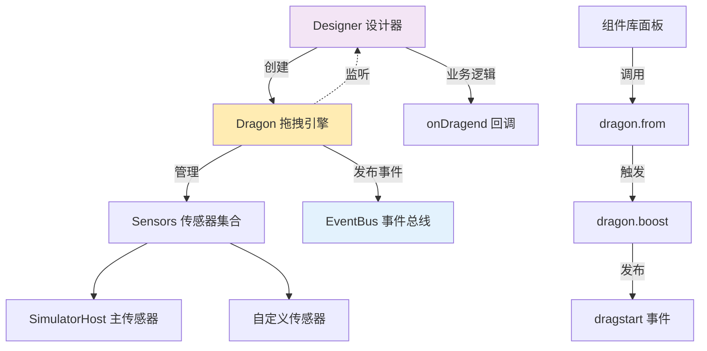
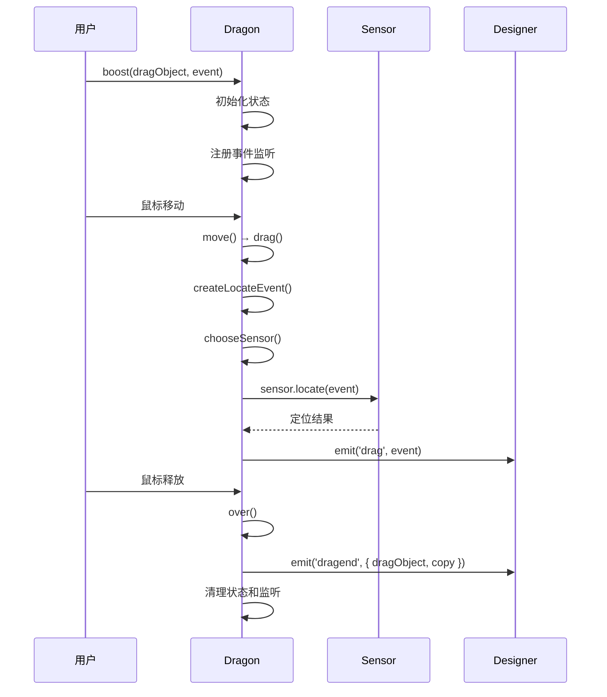
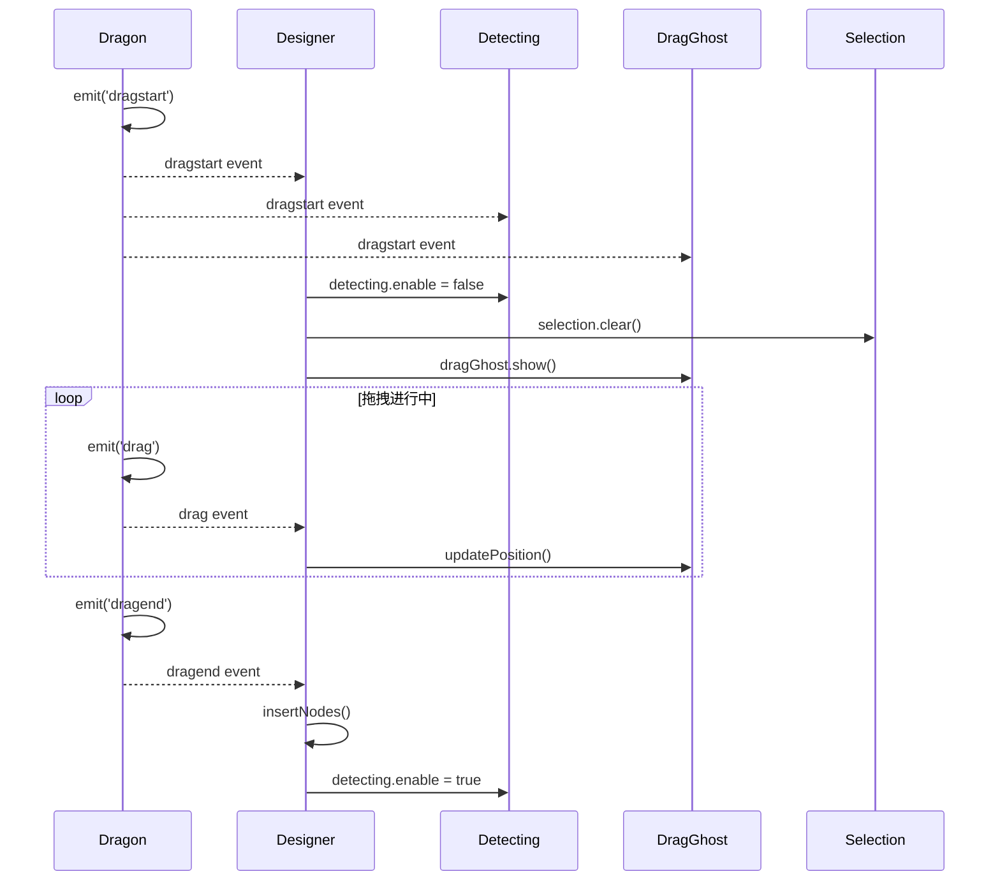
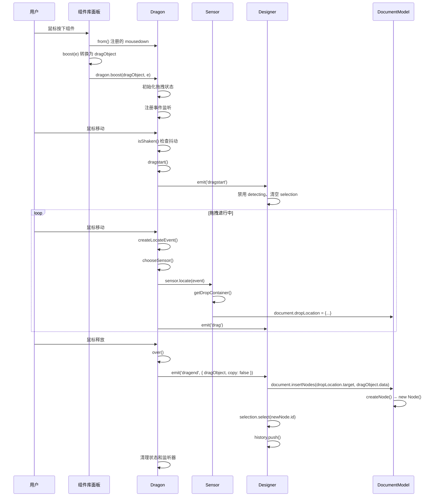
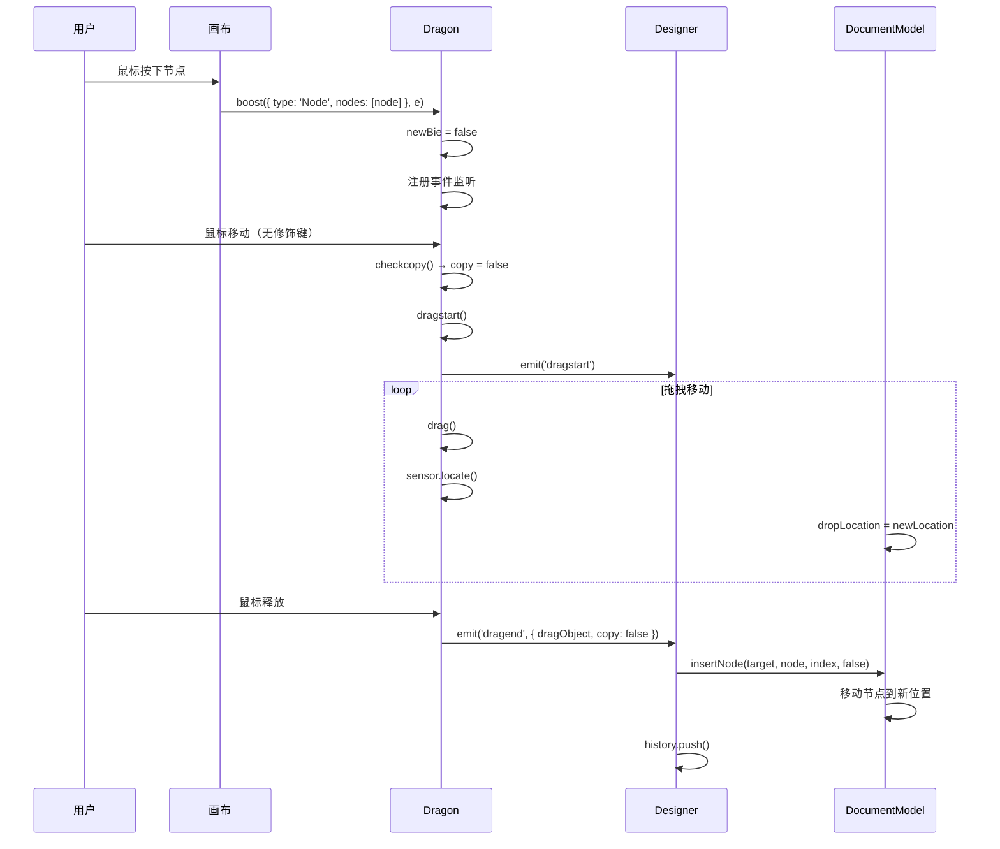
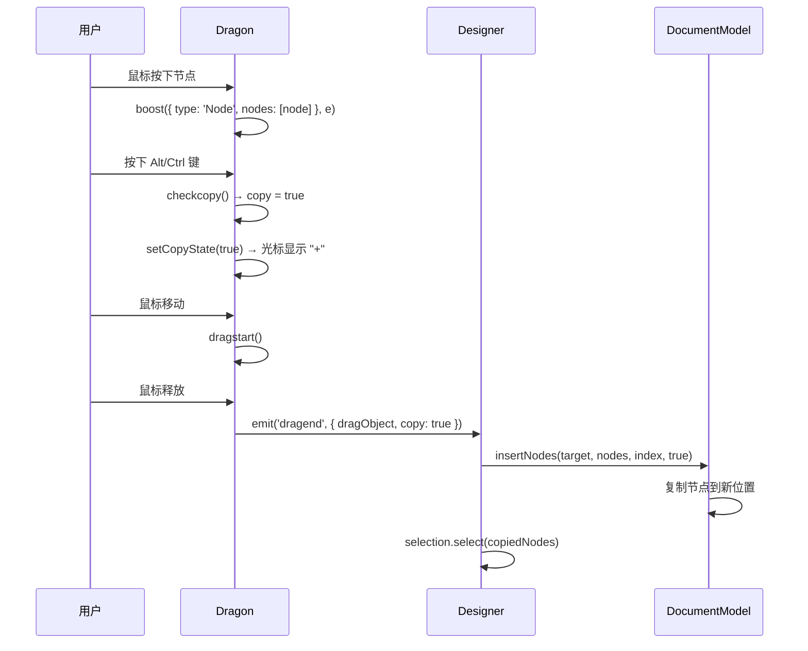

# Dragon 拖拽引擎详解

> **源码位置**: `packages/designer/src/designer/dragon.ts`
> **公开类型**: `@types` [IPublicModelDragon](https://github.com/alibaba/lowcode-engine/blob/main/packages/types/src/shell/model/dragon.ts)
> **引擎版本**: v1.0.0+ (部分 API @since v1.1.0)

---

## 📋 **目录**

- [基本介绍](#基本介绍)
- [核心属性](#核心属性)
- [拖拽启动方法](#拖拽启动方法)
- [事件监听方法](#事件监听方法)
- [传感器管理方法](#传感器管理方法)
- [底层原理解析](#底层原理解析)
- [完整拖拽流程](#完整拖拽流程)

---

## 🎯 **基本介绍**

Dragon 是**低代码引擎的拖拽核心引擎**，负责统一管理所有类型的拖拽操作。它是一个纯技术层的模块，只关心拖拽交互逻辑，不涉及业务决策。

### **主要职责**

1. **拖拽生命周期管理** - 启动、进行中、结束
2. **事件协调** - 发布 dragstart/drag/dragend 事件
3. **传感器管理** - 管理多个拖拽感应区（Sensor）
4. **跨文档支持** - 支持主文档和 iframe 之间的拖拽
5. **复制/移动模式切换** - 根据键盘修饰键动态切换

### **架构关系**



---

## 🏷️ **一、核心属性**

### **dragging**

```typescript
get dragging(): boolean
```

| 属性 | 说明 |
|------|------|
| **作用** | 判断当前是否正在拖拽 |
| **关联模块** | UI 层、插件系统 |
| **底层原理** | MobX `@obx.ref` 响应式，在 `dragstart()` 设置为 `true`，`over()` 设置为 `false` |
| **可读写** | ❌ 只读（getter）|
| **使用场景** | 条件渲染拖拽提示、禁用某些操作 |

**代码示例**：
```typescript
const dragon = designer.dragon;

// 判断是否正在拖拽
if (dragon.dragging) {
  console.log('正在拖拽中');
  // 禁用某些 UI 交互
}

// 在插件中监听拖拽状态变化（通过 MobX reaction）
import { autorun } from 'mobx';
autorun(() => {
  if (dragon.dragging) {
    showDragHint();
  } else {
    hideDragHint();
  }
});
```

**底层实现**（第119-125行）：
```typescript
@obx.ref private _dragging = false; // MobX 响应式私有属性

get dragging(): boolean {
  return this._dragging;
}

// 在拖拽开始时设置（第356行）
const dragstart = () => {
  this._dragging = true; // 🔥 设置拖拽状态
  // ...
};

// 在拖拽结束时重置（第475行）
const over = (e?: any) => {
  // ...
  if (this._dragging) {
    this._dragging = false; // 🔥 重置拖拽状态
    this.emitter.emit('dragend', { dragObject, copy });
  }
};
```

**关联模块**：
- **Designer**: 通过 `dragon.dragging` 判断是否禁用某些操作
- **Detecting**: 拖拽时禁用悬停检测（避免干扰）
- **DragGhost**: 拖拽时显示拖拽预览

---

## 🚀 **二、拖拽启动方法**

### **1. from**

```typescript
from(
  shell: Element,
  boost: (e: MouseEvent) => IPublicTypeDragNodeDataObject | null
): () => void
```

| 方法 | 说明 |
|------|------|
| **作用** | 设置拖拽监听的区域，并提供拖拽转换函数 |
| **关联模块** | 组件库面板（业务方实现）|
| **底层原理** | 监听 `shell` 的 `mousedown` 事件，调用 `boost` 函数获取拖拽对象，然后调用 `this.boost()` 启动拖拽 |
| **参数** | `shell`: 监听区域的 DOM 元素<br/>`boost`: 将 MouseEvent 转换为 DragObject 的函数 |
| **返回值** | 清理函数（用于取消监听）|
| **典型用途** | **组件库面板拖拽**的核心 API |

**代码示例**：
```typescript
import { IPublicTypeDragNodeDataObject } from '@alilc/lowcode-types';

// 业务方实现组件库面板
class ComponentLibraryPanel {
  private cleanupDragon?: () => void;

  setupDragBehavior(panelElement: HTMLElement) {
    const { canvas } = plugins;
    const dragon = canvas.dragon;

    // 🔥 核心：使用 dragon.from 设置拖拽
    this.cleanupDragon = dragon.from(panelElement, (e: MouseEvent) => {
      const target = e.target as HTMLElement;
      const componentName = target.dataset.componentName;

      if (!componentName) {
        return null; // 不是可拖拽元素，返回 null
      }

      // 🎯 关键：将鼠标事件转换为拖拽对象
      return {
        type: 'NodeData', // 标识为新组件数据
        data: {
          componentName,
          props: this.getDefaultProps(componentName),
        },
      } as IPublicTypeDragNodeDataObject;
    });
  }

  destroy() {
    this.cleanupDragon?.(); // 清理拖拽监听
  }
}
```

**底层实现**（第141-160行）：
```typescript
from(shell: Element, boost: (e: MouseEvent) => IPublicModelDragObject | null): any {
  const mousedown = (e: MouseEvent) => {
    // 🚫 忽略右键点击
    if (e.which === 3 || e.button === 2) {
      return;
    }

    // 🔄 调用业务方提供的 boost 函数，获取拖拽对象
    const dragObject = boost(e);
    if (!dragObject) {
      return; // boost 返回 null，不启动拖拽
    }

    // 🚀 启动拖拽
    this.boost(dragObject, e);
  };

  // 📝 注册事件监听
  shell.addEventListener('mousedown', mousedown as any);

  // 🧹 返回清理函数
  return () => {
    shell.removeEventListener('mousedown', mousedown as any);
  };
}
```

**拖拽对象类型**：
```typescript
// 新组件数据（从组件库拖入）
interface IPublicTypeDragNodeDataObject {
  type: 'NodeData';
  data: IPublicTypeNodeSchema | IPublicTypeNodeSchema[];
}

// 已存在的节点（画布内拖拽）
interface IPublicTypeDragNodeObject {
  type: 'Node';
  nodes: IPublicModelNode[];
}
```

**使用场景**：
1. ✅ **组件库面板** - 拖入新组件
2. ✅ **自定义拖拽源** - 从外部拖入元素
3. ✅ **物料面板** - 拖入模板、区块

**注意事项**：
- `boost` 函数应该尽快返回，避免阻塞 UI
- 返回 `null` 时不会启动拖拽
- 必须在组件卸载时调用返回的清理函数

---

### **2. boost**

```typescript
boost(
  dragObject: IPublicTypeDragObject,
  boostEvent: MouseEvent | DragEvent,
  fromRglNode?: IPublicModelNode
): void
```

| 方法 | 说明 |
|------|------|
| **作用** | 发射拖拽对象，启动拖拽流程 |
| **关联模块** | Designer、Sensor、DocumentModel |
| **底层原理** | 初始化拖拽状态、注册事件监听、管理拖拽生命周期 |
| **参数** | `dragObject`: 拖拽对象（Node 或 NodeData）<br/>`boostEvent`: 触发事件（鼠标或拖拽）<br/>`fromRglNode`: 可选的 RGL 节点 |
| **返回值** | void |
| **触发时机** | 1. `from()` 内部自动调用<br/>2. 画布内节点拖拽时调用<br/>3. 大纲面板拖拽时调用 |

**代码示例**：
```typescript
// 场景1: 通过 from() 自动触发（最常见）
dragon.from(panel, (e) => ({ type: 'NodeData', data: schema }));

// 场景2: 画布内节点拖拽（引擎内部调用）
const handleMouseDown = (e: MouseEvent, node: INode) => {
  const dragObject = {
    type: 'Node',
    nodes: [node],
  };
  dragon.boost(dragObject, e);
};

// 场景3: 自定义拖拽场景
const startCustomDrag = (event: MouseEvent) => {
  dragon.boost(
    {
      type: 'NodeData',
      data: {
        componentName: 'CustomComponent',
        props: { text: 'Hello' },
      },
    },
    event
  );
};
```

**底层实现概览**（第170-662行）：
```typescript
boost(
  dragObject: IPublicModelDragObject,
  boostEvent: MouseEvent | DragEvent,
  fromRglNode?: INode | IPublicModelNode,
) {
  // ========== 第一阶段：初始化 ==========
  const { designer } = this;
  const masterSensors = this.getMasterSensors(); // 获取所有活跃传感器
  const handleEvents = makeEventsHandler(boostEvent, masterSensors);

  // 判断拖拽类型
  const newBie = !isDragNodeObject(dragObject); // 是否为新组件
  const forceCopyState = /* 是否包含 Slot 节点 */;
  const isBoostFromDragAPI = isDragEvent(boostEvent); // 是否原生拖拽

  this._dragging = false; // 初始拖拽状态

  // ========== 第二阶段：定义核心函数 ==========

  // 拖拽开始
  const dragstart = () => {
    this._dragging = true;
    this.setDraggingState(true); // 设置全局拖拽状态
    this.emitter.emit('dragstart', locateEvent); // 🔔 发布事件
  };

  // 拖拽进行中
  const drag = (e: MouseEvent | DragEvent) => {
    // 检查复制状态
    checkcopy(e);

    // 创建定位事件
    const locateEvent = createLocateEvent(e);
    const sensor = chooseSensor(locateEvent); // 选择传感器

    // 🔥 核心：传感器定位（容器判断）
    if (sensor) {
      sensor.fixEvent(locateEvent);
      sensor.locate(locateEvent); // 判断投放容器
    }

    this.emitter.emit('drag', locateEvent); // 🔔 发布事件
  };

  // 拖拽结束
  const over = (e?: any) => {
    // 清理状态
    this.clearState();

    // 发布结束事件
    if (this._dragging) {
      this._dragging = false;
      this.emitter.emit('dragend', { dragObject, copy }); // 🔔 发布事件
    }

    // 移除事件监听
    handleEvents((doc) => {
      doc.removeEventListener('mousemove', move, true);
      doc.removeEventListener('mouseup', over, true);
      // ...
    });
  };

  // ========== 第三阶段：注册事件监听 ==========

  if (isBoostFromDragAPI) {
    // HTML5 原生拖拽
    dragstart(); // 立即开始
    handleEvents((doc) => {
      doc.addEventListener('dragover', move, true);
      doc.addEventListener('drop', drop, true);
      doc.addEventListener('dragend', over, true);
    });
  } else {
    // 鼠标模拟拖拽
    this.setNativeSelection(false); // 禁用文本选择
    handleEvents((doc) => {
      doc.addEventListener('mousemove', move, true);
      doc.addEventListener('mouseup', over, true);
    });
  }
}
```

**关键流程图**：



**注意事项**：
1. **不要直接调用 `boost()`** - 应该使用 `from()` 或让引擎自动调用
2. **支持跨 iframe** - 自动处理主文档和 iframe 之间的拖拽
3. **自动坐标转换** - 处理 iframe 视口坐标到全局坐标的转换

---

## 🔔 **三、事件监听方法**

Dragon 拖拽引擎遵循**观察者模式**，业务方通过监听事件来实现自定义逻辑。

### **1. onDragstart**

```typescript
onDragstart(func: (e: IPublicModelLocateEvent) => any): () => void
```

| 方法 | 说明 |
|------|------|
| **作用** | 监听拖拽开始事件 |
| **触发时机** | 鼠标移动超过抖动阈值，或原生拖拽开始时 |
| **关联模块** | Designer、Detecting、DragGhost、Selection |
| **参数** | `func`: 回调函数，接收定位事件 |
| **返回值** | 取消监听的函数 |

**代码示例**：
```typescript
// Designer 中的使用（引擎内部）
const unsubscribe = dragon.onDragstart((event) => {
  console.log('拖拽开始', event.dragObject);

  // 禁用悬停检测（避免干扰拖拽）
  detecting.enable = false;

  // 清空选区（防止视觉混乱）
  selection.clear();

  // 显示拖拽预览
  dragGhost.show(event);
});

// 插件中的使用
export default function MyPlugin() {
  const { canvas } = plugins;
  const dragon = canvas.dragon;

  useEffect(() => {
    const dispose = dragon.onDragstart(() => {
      // 拖拽开始时的业务逻辑
      showDragTips();
    });

    return dispose; // 组件卸载时自动清理
  }, []);
}
```

**事件对象结构**：
```typescript
interface IPublicModelLocateEvent {
  type: 'LocateEvent';
  dragObject: IPublicModelDragObject; // 拖拽对象
  target: Element;                    // 事件目标元素
  originalEvent: MouseEvent | DragEvent; // 原始事件
  globalX: number;                    // 全局 X 坐标
  globalY: number;                    // 全局 Y 坐标
  canvasX?: number;                   // 画布 X 坐标（iframe内）
  canvasY?: number;                   // 画布 Y 坐标（iframe内）
  sensor?: IPublicModelSensor;        // 关联的传感器
}
```

**底层实现**（第740-745行）：
```typescript
onDragstart(func: (e: ILocateEvent) => any) {
  this.emitter.on('dragstart', func); // 注册监听
  return () => {
    this.emitter.removeListener('dragstart', func); // 返回清理函数
  };
}
```

**触发位置**（第376行）：
```typescript
const dragstart = () => {
  this._dragging = true;
  setShaken(boostEvent);
  const locateEvent = createLocateEvent(boostEvent);

  // 设置初始状态
  if (newBie || forceCopyState) {
    this.setCopyState(true);
  } else {
    chooseSensor(locateEvent);
  }

  this.setDraggingState(true);

  // 🔔 触发 dragstart 事件
  this.emitter.emit('dragstart', locateEvent);
};
```

---

### **2. onDrag**

```typescript
onDrag(func: (e: IPublicModelLocateEvent) => any): () => void
```

| 方法 | 说明 |
|------|------|
| **作用** | 监听拖拽进行中事件 |
| **触发时机** | 鼠标每次移动时（有性能优化，过滤重复位置）|
| **关联模块** | Designer、BorderDetecting |
| **参数** | `func`: 回调函数 |
| **返回值** | 取消监听的函数 |
| **触发频率** | 高频（鼠标移动时）|

**代码示例**：
```typescript
// Designer 中监听拖拽移动
dragon.onDrag((event) => {
  console.log('拖拽移动中', event.globalX, event.globalY);

  // 更新拖拽预览位置
  dragGhost.updatePosition(event);

  // 显示投放位置指示器
  if (document.dropLocation) {
    borderDetecting.show(document.dropLocation);
  }
});

// 自定义拖拽提示
const dragHint = document.createElement('div');
dragon.onDrag((event) => {
  dragHint.style.left = event.globalX + 'px';
  dragHint.style.top = event.globalY + 'px';
  dragHint.textContent = `位置: (${event.globalX}, ${event.globalY})`;
});
```

**底层实现**（第747-752行）：
```typescript
onDrag(func: (e: ILocateEvent) => any) {
  this.emitter.on('drag', func);
  return () => {
    this.emitter.removeListener('drag', func);
  };
}
```

**触发位置**（第348行）：
```typescript
const drag = (e: MouseEvent | DragEvent) => {
  checkcopy(e);

  // 性能优化：过滤无效和重复事件
  if (isInvalidPoint(e, lastArrive)) return;
  if (lastArrive && isSameAs(e, lastArrive)) {
    lastArrive = e;
    return;
  }
  lastArrive = e;

  const locateEvent = createLocateEvent(e);
  const sensor = chooseSensor(locateEvent);

  // 传感器定位
  if (sensor) {
    sensor.fixEvent(locateEvent);
    sensor.locate(locateEvent); // 容器判断
  } else {
    designer.clearLocation();
  }

  // 🔔 触发 drag 事件
  this.emitter.emit('drag', locateEvent);
};
```

**性能优化机制**：
```typescript
// 过滤无效坐标点（避免处理异常数据）
function isInvalidPoint(e: any, last: any): boolean {
  return (
    e.clientX === 0 && e.clientY === 0 &&
    last && (Math.abs(last.clientX - e.clientX) > 5 || Math.abs(last.clientY - e.clientY) > 5)
  );
}

// 过滤相同位置的重复事件（避免无意义计算）
function isSameAs(e1: MouseEvent | DragEvent, e2: MouseEvent | DragEvent): boolean {
  return e1.clientY === e2.clientY && e1.clientX === e2.clientX;
}
```

---

### **3. onDragend**

```typescript
onDragend(
  func: (o: { dragObject: IPublicModelDragObject; copy?: boolean }) => any
): () => void
```

| 方法 | 说明 |
|------|------|
| **作用** | 监听拖拽结束事件 |
| **触发时机** | 鼠标释放、ESC 取消、或拖拽被中断时 |
| **关联模块** | **Designer（核心业务逻辑）**、History |
| **参数** | `func`: 回调函数，接收拖拽对象和复制标记 |
| **返回值** | 取消监听的函数 |
| **重要性** | ⭐⭐⭐⭐⭐ **最重要的事件**，业务逻辑都在这里 |

**代码示例**：
```typescript
// Designer 中的核心业务逻辑（引擎内部）
dragon.onDragend(({ dragObject, copy }) => {
  console.log('拖拽结束', { dragObject, copy });

  // 🎯 核心：获取投放位置
  const dropLocation = document.dropLocation;
  if (!dropLocation) {
    console.log('无有效投放位置，拖拽取消');
    return;
  }

  // 🔥 关键：根据拖拽类型执行不同逻辑
  if (isDragNodeDataObject(dragObject)) {
    // 场景1: 新组件拖入
    const nodes = document.insertNodes(
      dropLocation.target,    // 父容器
      dragObject.data,        // 组件 Schema
      dropLocation.index,     // 插入位置
      false                   // 不复制（新组件本就是新建）
    );

    // 选中新创建的节点
    selection.select(nodes.map(n => n.id));

    // 记录历史（支持撤销）
    history.push();

  } else if (isDragNodeObject(dragObject)) {
    // 场景2: 已有节点拖拽
    const nodes = dragObject.nodes;

    if (copy) {
      // 复制模式：复制节点到新位置
      const copiedNodes = document.insertNodes(
        dropLocation.target,
        nodes,
        dropLocation.index,
        true // 🔥 复制标记
      );
      selection.select(copiedNodes.map(n => n.id));
    } else {
      // 移动模式：移动节点到新位置
      nodes.forEach((node, index) => {
        document.insertNode(
          dropLocation.target,
          node,
          dropLocation.index + index,
          false // 移动（不复制）
        );
      });
      selection.select(nodes.map(n => n.id));
    }

    history.push();
  }

  // 清理状态
  document.dropLocation = null;
  detecting.enable = true; // 恢复悬停检测
});

// 插件中自定义拖拽后处理
dragon.onDragend(({ dragObject, copy }) => {
  // 发送拖拽埋点
  analytics.track('component_drag', {
    type: dragObject.type,
    isCopy: copy,
  });

  // 显示操作提示
  message.success(copy ? '组件已复制' : '组件已移动');
});
```

**事件参数结构**：
```typescript
interface DragendEvent {
  dragObject: IPublicModelDragObject; // 拖拽对象
  copy?: boolean;                     // 是否为复制模式（true=复制，false=移动）
}
```

**底层实现**（第754-759行）：
```typescript
onDragend(func: (x: {dragObject: IPublicModelDragObject; copy: boolean}) => any) {
  this.emitter.on('dragend', func);
  return () => {
    this.emitter.removeListener('dragend', func);
  };
}
```

**触发位置**（第474-481行）：
```typescript
const over = (e?: any) => {
  // ... 清理工作 ...

  // 发送拖拽结束事件
  if (this._dragging) {
    this._dragging = false;
    try {
      // 🔔 触发 dragend 事件
      this.emitter.emit('dragend', {
        dragObject,  // 拖拽对象
        copy         // 复制标记（Alt/Ctrl 键控制）
      });
    } catch (ex) {
      exception = ex; // 捕获异常但延后抛出
    }
  }

  // ... 清理监听器 ...
};
```

**`copy` 参数的决定逻辑**：
```typescript
// 1. 新组件：默认为 false（新组件本就是创建，不是复制）
const newBie = !isDragNodeObject(dragObject);

// 2. 插槽节点：强制为 true（插槽不能移动，只能复制）
const forceCopyState = isDragNodeObject(dragObject) &&
  dragObject.nodes.some(node => node.isSlot());

// 3. 普通节点：根据键盘修饰键动态切换
let copy = false;
const checkcopy = (e: MouseEvent | DragEvent | KeyboardEvent) => {
  if (newBie) return; // 新组件不处理

  if (e.altKey || e.ctrlKey) { // Alt 或 Ctrl 键按下
    copy = true;  // 复制模式
    this.setCopyState(true);
  } else {
    copy = false; // 移动模式
    if (!forceCopyState) {
      this.setCopyState(false);
    }
  }
};
```

---

## 🎯 **四、传感器管理方法**

### **传感器（Sensor）概念**

传感器是**拖拽感应区域的抽象**，负责：
1. 判断鼠标是否在其区域内（`isEnter()`）
2. 定位投放位置（`locate()`）
3. 修正事件坐标（`fixEvent()`）

**常见传感器**：
- **SimulatorHost** - iframe 画布（主传感器）
- **自定义传感器** - 业务方实现的特殊区域

---

### **1. addSensor**

```typescript
addSensor(sensor: any): void
```

| 方法 | 说明 |
|------|------|
| **作用** | 添加自定义投放感应区 |
| **关联模块** | 业务方自定义拖拽区域 |
| **底层原理** | 将传感器添加到 `sensors` 数组，拖拽时会遍历选择 |
| **参数** | `sensor`: 传感器实例（需实现 `isEnter`、`locate` 等方法）|
| **返回值** | void |

**代码示例**：
```typescript
// 创建自定义传感器
class CustomSensor implements IPublicModelSensor {
  sensorAvailable = true;

  isEnter(event: ILocateEvent): boolean {
    // 判断鼠标是否在自定义区域内
    const rect = this.element.getBoundingClientRect();
    return (
      event.globalX >= rect.left &&
      event.globalX <= rect.right &&
      event.globalY >= rect.top &&
      event.globalY <= rect.bottom
    );
  }

  locate(event: ILocateEvent): boolean {
    // 处理定位逻辑
    console.log('自定义传感器定位', event);
    return true; // 返回 true 表示可以放置
  }

  fixEvent(event: ILocateEvent): void {
    // 修正事件坐标（如需要）
  }

  deactiveSensor(): void {
    // 传感器停用时的清理
  }
}

// 添加到 Dragon
const customSensor = new CustomSensor(myElement);
dragon.addSensor(customSensor);

// 现在拖拽到 myElement 区域时，会触发 customSensor.locate()
```

**底层实现**（第726-728行）：
```typescript
addSensor(sensor: any) {
  this.sensors.push(sensor); // 添加到传感器列表
}
```

**传感器选择逻辑**（第572-610行）：
```typescript
const chooseSensor = (e: ILocateEvent) => {
  // 合并所有可用传感器（自定义 + 主传感器）
  const sensors: IPublicModelSensor[] = this.sensors.concat(masterSensors);

  // 传感器选择策略：
  // 1. 事件已关联传感器且鼠标在其区域内
  // 2. 从所有传感器中找到可用且鼠标在其区域内的传感器
  let sensor =
    e.sensor && e.sensor.isEnter(e) ? e.sensor :
    sensors.find((s) => s.sensorAvailable && s.isEnter(e)); // 🔍 遍历传感器

  // 没找到时的回退策略
  if (!sensor) {
    if (lastSensor) {
      sensor = lastSensor;
    } else if (e.sensor) {
      sensor = e.sensor;
    } else if (sourceSensor) {
      sensor = sourceSensor;
    }
  }

  // 处理传感器切换
  if (sensor !== lastSensor) {
    if (lastSensor) {
      lastSensor.deactiveSensor(); // 停用旧传感器
    }
    lastSensor = sensor;
  }

  if (sensor) {
    e.sensor = sensor;
    sensor.fixEvent(e); // 让传感器修正事件
  }

  this._activeSensor = sensor; // 更新活跃传感器
  return sensor;
};
```

**使用场景**：
- ✅ 侧边栏拖入区域
- ✅ 自定义画布区域
- ✅ 多画布切换场景

---

### **2. removeSensor**

```typescript
removeSensor(sensor: any): void
```

| 方法 | 说明 |
|------|------|
| **作用** | 移除自定义投放感应区 |
| **底层原理** | 从 `sensors` 数组中移除传感器 |
| **参数** | `sensor`: 要移除的传感器实例 |
| **返回值** | void |

**代码示例**：
```typescript
const customSensor = new CustomSensor(myElement);

// 添加传感器
dragon.addSensor(customSensor);

// ... 使用一段时间 ...

// 移除传感器（如组件卸载时）
dragon.removeSensor(customSensor);
```

**底层实现**（第733-738行）：
```typescript
removeSensor(sensor: any) {
  const i = this.sensors.indexOf(sensor); // 查找索引
  if (i > -1) {
    this.sensors.splice(i, 1); // 从数组中移除
  }
}
```

**注意事项**：
- 组件卸载时务必移除传感器，避免内存泄漏
- 移除后该区域将不再响应拖拽

---

## 🔧 **五、底层原理解析**

### **1. 双事件系统支持**

Dragon 同时支持两种拖拽机制：

```typescript
// 判断事件类型
const isBoostFromDragAPI = isDragEvent(boostEvent);

if (isBoostFromDragAPI) {
  // ========== HTML5 原生拖拽 API ==========
  dragstart(); // 立即开始（无需抖动检测）

  handleEvents((doc) => {
    doc.addEventListener('dragover', move, true);   // 拖拽经过
    doc.addEventListener('drop', drop, true);       // 拖拽放置
    doc.addEventListener('dragend', over, true);    // 拖拽结束
  });

} else {
  // ========== 鼠标模拟拖拽 ==========
  this.setNativeSelection(false); // 禁用文本选择（避免干扰）

  handleEvents((doc) => {
    doc.addEventListener('mousemove', move, true);  // 鼠标移动
    doc.addEventListener('mouseup', over, true);    // 鼠标释放
  });
}
```

**对比表**：

| 特性 | HTML5 原生拖拽 | 鼠标模拟拖拽 |
|------|---------------|-------------|
| **触发方式** | 元素设置 `draggable="true"` | 鼠标按下 |
| **开始时机** | 立即开始 | 移动超过阈值 |
| **浏览器支持** | 现代浏览器 | 所有浏览器 |
| **视觉反馈** | 浏览器原生拖拽阴影 | 自定义拖拽预览 |
| **文本选择** | 自动禁用 | 需手动禁用 |
| **事件名称** | dragstart/dragover/drop/dragend | mousedown/mousemove/mouseup |

---

### **2. 抖动检测机制**

防止误触发拖拽（鼠标轻微移动不应启动拖拽）：

```typescript
const SHAKE_DISTANCE = 4; // 抖动阈值（像素）

// 检查是否发生抖动
function isShaken(e1: MouseEvent | DragEvent, e2: MouseEvent | DragEvent): boolean {
  if ((e1 as any).shaken) {
    return true; // 已标记为抖动
  }
  if (e1.target !== e2.target) {
    return true; // 目标元素改变，视为抖动
  }
  // 计算移动距离（勾股定理）
  return Math.pow(e1.clientY - e2.clientY, 2) + Math.pow(e1.clientX - e2.clientX, 2) > SHAKE_DISTANCE;
}

// 在 move 函数中使用
const move = (e: MouseEvent | DragEvent) => {
  if (this._dragging) {
    drag(e); // 已在拖拽，继续处理
    return;
  }

  // 首次移动：检查抖动
  if (isShaken(boostEvent, e)) {
    dragstart(); // 超过阈值，开始拖拽
    drag(e);
  }
  // 未超过阈值：继续等待
};
```

**效果**：只有鼠标移动超过 4 像素时才启动拖拽，避免误触。

---

### **3. 跨文档事件处理**

支持主文档和 iframe 之间的拖拽：

```typescript
// 创建跨文档事件处理器
const handleEvents = makeEventsHandler(boostEvent, masterSensors);

// 使用：为主文档和所有 iframe 注册事件
handleEvents((doc) => {
  doc.addEventListener('mousemove', move, true);
  doc.addEventListener('mouseup', over, true);
});

// 实现原理（简化版）
function makeEventsHandler(event: Event, sensors: ISimulatorHost[]) {
  const documents = [
    document, // 主文档
    ...sensors.map(sim => sim.contentDocument).filter(Boolean) // iframe 文档
  ];

  return (callback: (doc: Document) => void) => {
    documents.forEach(callback); // 为每个文档执行回调
  };
}
```

**优势**：
- 拖拽可以从主文档进入 iframe
- 拖拽可以从 iframe 进入主文档
- 事件监听自动覆盖所有文档

---

### **4. 坐标转换系统**

处理 iframe 坐标到全局坐标的转换：

```typescript
const createLocateEvent = (e: MouseEvent | DragEvent): ILocateEvent => {
  const evt: any = {
    type: 'LocateEvent',
    dragObject,
    target: e.target,
    originalEvent: e,
  };

  const sourceDocument = e.view?.document;

  if (!sourceDocument || sourceDocument === document) {
    // 🔵 主文档：直接使用客户端坐标
    evt.globalX = e.clientX;
    evt.globalY = e.clientY;
  } else {
    // 🔴 iframe 文档：需要坐标转换
    let srcSim: ISimulatorHost | undefined;

    // 查找事件来源的模拟器
    srcSim = masterSensors.find((sim) =>
      (sim as any).contentDocument === sourceDocument
    );

    if (srcSim) {
      // 🔥 关键：通过模拟器视口进行坐标转换
      const g = srcSim.viewport.toGlobalPoint(e);
      evt.globalX = g.clientX;  // 全局坐标（相对于主文档）
      evt.globalY = g.clientY;
      evt.canvasX = e.clientX;  // 画布坐标（相对于 iframe）
      evt.canvasY = e.clientY;
      evt.sensor = srcSim;
    } else {
      // 兜底：使用原始坐标
      evt.globalX = e.clientX;
      evt.globalY = e.clientY;
    }
  }
  return evt;
};
```

**坐标类型**：
- `globalX/globalY`: 相对于主文档视口的全局坐标
- `canvasX/canvasY`: 相对于 iframe 画布的局部坐标

---

### **5. 复制/移动状态管理**

动态切换拖拽模式：

```typescript
let copy = false; // 本地复制标记

const checkcopy = (e: MouseEvent | DragEvent | KeyboardEvent) => {
  // 新组件：默认不处理（无所谓复制或移动，都是新建）
  if (newBie) return;

  // 检查键盘修饰键
  if (e.altKey || e.ctrlKey) {
    copy = true; // 🟢 复制模式
    this.setCopyState(true); // 设置全局状态（影响光标样式）

    // 原生拖拽：设置视觉效果
    if (isDragEvent(e) && e.dataTransfer) {
      e.dataTransfer.dropEffect = 'copy';
    }
  } else {
    copy = false; // 🔵 移动模式
    if (!forceCopyState) { // 非强制复制的情况
      this.setCopyState(false);

      if (isDragEvent(e) && e.dataTransfer) {
        e.dataTransfer.dropEffect = 'move';
      }
    }
  }
};

// 在拖拽过程中持续监听键盘
if (!newBie && !isBoostFromDragAPI) {
  handleEvents((doc) => {
    doc.addEventListener('keydown', checkcopy, false); // 键盘按下
    doc.addEventListener('keyup', checkcopy, false);   // 键盘释放
  });
}
```

**视觉反馈**：
```typescript
// 设置光标样式
private setCopyState(state: boolean) {
  cursor.setCopy(state); // 复制模式：光标显示 "+"
  this.getSimulators().forEach((sim) => {
    sim?.setCopyState(state); // 同步到所有模拟器
  });
}
```

---

### **6. 事件发布机制**

Dragon 使用 EventEmitter 模式：

```typescript
// 初始化事件总线
emitter: IEventBus = createModuleEventBus('Dragon');

// 发布事件
this.emitter.emit('dragstart', locateEvent);
this.emitter.emit('drag', locateEvent);
this.emitter.emit('dragend', { dragObject, copy });

// 订阅事件
onDragstart(func: (e: ILocateEvent) => any) {
  this.emitter.on('dragstart', func);
  return () => {
    this.emitter.removeListener('dragstart', func);
  };
}
```

**事件流**：


---

## 📊 **六、完整拖拽流程**

### **场景1：组件库拖入新组件**



**关键代码路径**：
```
1. 组件库面板：dragon.from(panel, boost)
2. Dragon：boost() → 注册事件
3. Dragon：move() → isShaken() → dragstart()
4. Dragon：dragstart() → emit('dragstart')
5. Designer：onDragstart() → detecting.enable = false
6. Dragon：drag() → sensor.locate()
7. Sensor：locate() → getDropContainer() → document.dropLocation
8. Dragon：over() → emit('dragend')
9. Designer：onDragend() → document.insertNodes()
10. DocumentModel：insertNodes() → createNode() → new Node()
```

---

### **场景2：画布内节点拖拽（移动）**



---

### **场景3：画布内节点拖拽（复制）**



---

## 📝 **总结**

### **Dragon 核心职责**

| 职责 | 实现方式 |
|------|----------|
| **拖拽启动** | `from()` 注册监听、`boost()` 发射拖拽 |
| **生命周期管理** | dragstart → drag → dragend 事件流 |
| **传感器管理** | `addSensor()`、`removeSensor()`、智能选择 |
| **跨文档支持** | 事件处理器覆盖主文档和所有 iframe |
| **坐标转换** | `createLocateEvent()` 自动转换坐标 |
| **模式切换** | `checkcopy()` 根据键盘动态切换复制/移动 |
| **事件发布** | EventEmitter 模式，业务方监听决策 |

### **与其他模块的协作**

```mermaid
graph LR
    Dragon[Dragon 拖拽引擎] -->|发布事件| Designer[Designer]
    Dragon -->|选择传感器| Sensor[Sensor]
    Dragon -->|管理| MasterSensors[主传感器集合]

    Designer -->|监听| onDragstart[onDragstart]
    Designer -->|监听| onDrag[onDrag]
    Designer -->|监听| onDragend[onDragend]

    onDragend -->|插入节点| DocumentModel[DocumentModel]
    DocumentModel -->|创建节点| Node[Node]

    Sensor -->|定位| locate[locate]
    locate -->|设置| dropLocation[dropLocation]

    style Dragon fill:#ffecb3
```



### **公开 API 总结**

| API | 类型 | 作用 | 典型用途 |
|-----|------|------|----------|
| **dragging** | 属性 | 是否正在拖拽 | 条件渲染、状态判断 |
| **from()** | 方法 | 注册拖拽监听区域 | 组件库面板拖拽 |
| **boost()** | 方法 | 发射拖拽对象 | 引擎内部调用 |
| **onDragstart()** | 事件 | 拖拽开始监听 | 禁用 detecting、清空选区 |
| **onDrag()** | 事件 | 拖拽进行中监听 | 更新拖拽预览位置 |
| **onDragend()** | 事件 | 拖拽结束监听 | **核心业务逻辑**（插入节点）|
| **addSensor()** | 方法 | 添加自定义传感器 | 自定义拖拽区域 |
| **removeSensor()** | 方法 | 移除自定义传感器 | 组件卸载清理 |

### **最佳实践**

1. ✅ **使用 `from()` 而非直接调用 `boost()`**
2. ✅ **在 `onDragend()` 中实现核心业务逻辑**
3. ✅ **总是调用返回的清理函数**（避免内存泄漏）
4. ✅ **自定义传感器需实现完整接口**
5. ✅ **利用 `dragging` 属性优化 UI 交互**

---

**参考资料**：
- 官方文档：[Dragon API](https://lowcode-engine.cn/docV2/api/model/dragon)
- 源码位置：`packages/designer/src/designer/dragon.ts`
- 类型定义：`packages/types/src/shell/model/dragon.ts`
