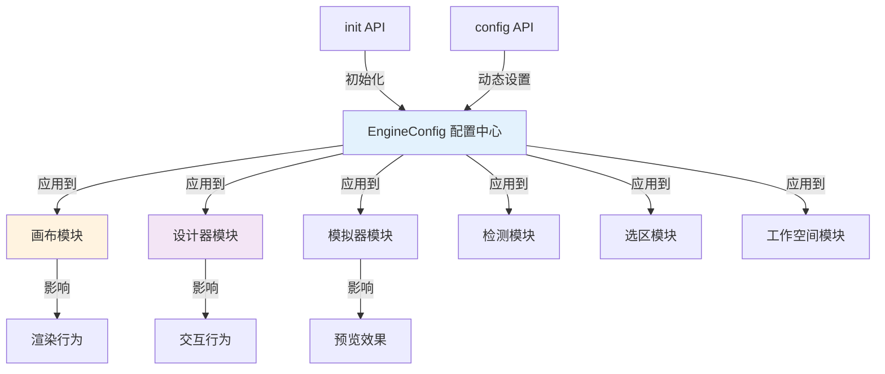

# EngineOptions 引擎配置项详解

> **源码位置**: `packages/engine/src/engine-core.ts`（入口）
> **打包产物**: `engine-core.js`
> **类型定义**: `@types` [IPublicTypeEngineOptions](https://github.com/alibaba/lowcode-engine/blob/main/packages/types/src/shell/type/engine-options.ts)

---

## 📋 **目录**

- [基本介绍](#基本介绍)
- [画布配置](#画布配置)
- [编排配置](#编排配置)
- [应用级设计器配置](#应用级设计器配置)
- [定制组件配置](#定制组件配置)
- [插件配置](#插件配置)
- [其他配置](#其他配置)
- [配置使用示例](#配置使用示例)

---

## 🎯 **基本介绍**

EngineOptions 是**低代码引擎的全局配置系统**，提供了对引擎各个模块行为的细粒度控制。

### **配置方式**

有两种配置方式：

#### **方式1：init API（初始化时配置）**

```typescript
import { init } from '@alilc/lowcode-engine';

await init(document.getElementById('engine'), {
  // 配置项
  enableCondition: false,
  enableCanvasLock: true,
  locale: 'zh-CN',
  device: 'default',
  // ... 更多配置
});
```

#### **方式2：config API（动态配置）**

```typescript
import { config } from '@alilc/lowcode-engine';

// 单个配置
config.set('enableCondition', false);

// 批量配置
config.setConfig({
  enableCanvasLock: true,
  locale: 'zh-CN',
});

// 读取配置
const enabled = config.get('enableCondition');
```

### **配置系统架构**



---

## 🖼️ **一、画布配置**

### **1. locale - 语言**

```typescript
locale?: string
```

| 配置项 | 说明 |
|--------|------|
| **作用** | 设置引擎界面语言 |
| **默认值** | `'zh-CN'`（中文）|
| **可选值** | `'zh-CN'`、`'en-US'`、`'ja-JP'` 等 |
| **关联模块** | Skeleton（骨架）、所有 UI 组件 |
| **底层原理** | 通过 i18n 系统切换所有 UI 文本 |

**代码示例**：
```typescript
// 设置英文
await init(container, {
  locale: 'en-US',
});

// 所有界面文本变为英文
// "组件" → "Components"
// "属性" → "Properties"
// "大纲树" → "Outline"
```

**效果说明**：
- ✅ 顶部工具栏文本切换
- ✅ 左侧组件面板文本切换
- ✅ 右侧属性面板文本切换
- ✅ 大纲树面板文本切换
- ✅ 右键菜单文本切换

**底层实现**：
```javascript
// engine-core.js 中会将 locale 注入到各个模块
skeleton.setLocale(locale);
material.setLocale(locale);
```

---

### **2. device - 设备类型**

```typescript
device?: string
```

| 配置项 | 说明 |
|--------|------|
| **作用** | 设置画布设备类型（影响预览尺寸）|
| **默认值** | `'default'` |
| **可选值** | `'default'`、`'mobile'`、`'iphonex'`、`'iphone6'`、`'phone'`、`'tablet'`、`'desktop'` |
| **关联模块** | Simulator（模拟器）、Canvas |
| **底层原理** | 通过 CSS 类名控制画布容器尺寸 |

**代码示例**：
```typescript
// 移动端模式
await init(container, {
  device: 'mobile',
});

// iPhone X 模式
await init(container, {
  device: 'iphonex',
});
```

**效果说明**：

| device | 画布宽度 | 画布高度 | 用途 |
|--------|---------|---------|------|
| `default` | 100% | 100% | PC端全屏 |
| `mobile` | 375px | 667px | 移动端通用 |
| `iphonex` | 375px | 812px | iPhone X |
| `iphone6` | 375px | 667px | iPhone 6/7/8 |
| `phone` | 375px | 自适应 | 手机 |
| `tablet` | 768px | 自适应 | 平板 |
| `desktop` | 1920px | 自适应 | 桌面 |

**自定义设备类型**：
```css
/* 需要补充对应的 CSS 样式 */
.lc-simulator-device-phone {
  top: 16px;
  bottom: 16px;
  left: 50%;
  width: 375px;
  transform: translateX(-50%);
  margin: auto;
}
```

**底层实现**：
```javascript
// 画布容器会添加 className
<div className="lc-simulator-device-{device}">
  {/* 画布内容 */}
</div>
```

---

### **3. deviceClassName - 自定义设备样式类**

```typescript
deviceClassName?: string
```

| 配置项 | 说明 |
|--------|------|
| **作用** | 指定自定义的设备样式类名 |
| **关联模块** | Simulator |
| **底层原理** | 直接添加到画布顶层容器 |

**代码示例**：
```typescript
await init(container, {
  deviceClassName: 'my-custom-device',
});

// CSS 定义
.my-custom-device {
  width: 414px;
  height: 896px;
  border: 2px solid #000;
  border-radius: 36px;
}
```

---

### **4. enableCondition - 启用条件渲染**

```typescript
enableCondition?: boolean
```

| 配置项 | 说明 |
|--------|------|
| **作用** | 是否启用组件的条件渲染（condition 属性）|
| **默认值** | `false` |
| **关联模块** | Renderer（渲染器）、Node（节点模型）|
| **底层原理** | 控制节点的 `___condition___` 属性是否生效 |

**代码示例**：
```typescript
// 关闭条件渲染（默认，设计器中全部显示）
await init(container, {
  enableCondition: false,
});

// 开启条件渲染（设计器中根据条件显示/隐藏）
await init(container, {
  enableCondition: true,
});
```

**效果对比**：

**场景：** 组件设置了条件 `condition: { type: 'JSExpression', value: 'this.state.showButton' }`

| enableCondition | 设计器行为 | 说明 |
|-----------------|-----------|------|
| `false`（默认）| ✅ 始终显示 | 方便编辑，不受条件影响 |
| `true` | ⚡ 根据条件显示/隐藏 | 真实预览效果 |

**底层实现**（engine-core.js:27528-27533）：
```javascript
// 在导出节点时判断
if (stage === IPublicEnumTransformStage.Render && this.key === '___condition___') {
  // 在设计器里，所有组件默认需要展示，除非开启了 enableCondition 配置
  if (engineConfig?.get('enableCondition') !== true) {
    return true; // 🔥 强制返回 true，忽略条件
  }
  return this._value; // 使用实际条件值
}
```

**使用场景**：
- ❌ 关闭（默认）：设计阶段，需要编辑所有组件
- ✅ 开启：需要在设计器中预览真实条件渲染效果

---

### **5. disableAutoRender - 禁用自动渲染**

```typescript
disableAutoRender?: boolean
```

| 配置项 | 说明 |
|--------|------|
| **作用** | 关闭画布自动渲染（手动控制渲染时机）|
| **默认值** | `false` |
| **关联模块** | Simulator |
| **使用场景** | 资产包多重异步加载时避免重复渲染 |

**代码示例**：
```typescript
await init(container, {
  disableAutoRender: true, // 禁用自动渲染
});

// 异步加载多个资产包
await Promise.all([
  loadAssets('package1'),
  loadAssets('package2'),
  loadAssets('package3'),
]);

// 手动触发渲染
const { project } = await plugins.init();
project.simulator.rerender();
```

**效果说明**：
- `false`（默认）：每次资产加载都触发渲染（可能闪烁）
- `true`：等待所有资产加载完成，手动渲染（性能优化）

---

### **6. renderEnv - 渲染器类型**

```typescript
renderEnv?: string
```

| 配置项 | 说明 |
|--------|------|
| **作用** | 指定渲染器类型 |
| **默认值** | `'react'` |
| **可选值** | `'react'`、`'rax'`、`'vue'` |
| **关联模块** | Renderer |

**代码示例**：
```typescript
// React 渲染器（默认）
await init(container, {
  renderEnv: 'react',
});

// Rax 渲染器
await init(container, {
  renderEnv: 'rax',
});
```

---

### **7. simulatorUrl - 模拟器 URL**

```typescript
simulatorUrl?: string[]
```

| 配置项 | 说明 |
|--------|------|
| **作用** | 设置模拟器相关的资源 URL（JS、CSS）|
| **关联模块** | Simulator |
| **底层原理** | iframe 中加载这些资源 |

**代码示例**：
```typescript
await init(container, {
  simulatorUrl: [
    'https://cdn.example.com/simulator.js',
    'https://cdn.example.com/simulator.css',
  ],
});
```

---

### **8. enableStrictNotFoundMode - 严格未找到模式**

```typescript
enableStrictNotFoundMode?: boolean
```

| 配置项 | 说明 |
|--------|------|
| **作用** | 组件未找到时是否显示占位容器 |
| **默认值** | `false` |
| **关联模块** | Renderer |

**代码示例**：
```typescript
// 宽松模式（默认）：未找到组件时显示占位 Div
await init(container, {
  enableStrictNotFoundMode: false,
});

// 严格模式：未找到组件时不渲染任何内容
await init(container, {
  enableStrictNotFoundMode: true,
});
```

**效果对比**：

**场景：** Schema 中引用了不存在的组件 `<UnknownComponent>`

| enableStrictNotFoundMode | 渲染结果 |
|--------------------------|---------|
| `false`（默认）| 渲染占位 Div，显示错误信息 |
| `true` | 不渲染，跳过该组件 |

---

## 🎨 **二、编排配置**

### **1. focusNodeSelector - 指定根组件**

```typescript
focusNodeSelector?: (rootNode: IPublicModelNode) => IPublicModelNode
```

| 配置项 | 说明 |
|--------|------|
| **作用** | 自定义聚焦节点选择逻辑（容器下钻）|
| **关联模块** | DocumentModel |
| **底层原理** | 在 `document.focusNode` getter 中调用 |

**代码示例**：
```typescript
await init(container, {
  focusNodeSelector: (rootNode) => {
    // 自动聚焦到第一个 Page 节点
    const pageNode = rootNode.children?.find(
      child => child.componentName === 'Page'
    );
    return pageNode || rootNode;
  },
});
```

**使用场景**：
- 应用级设计：自动聚焦到某个页面
- 容器下钻：自动进入某个容器进行编辑

**底层实现**（document-model.ts:220-229）：
```typescript
get focusNode(): INode | null {
  if (this._drillDownNode) {
    return this._drillDownNode;
  }

  // 🔥 调用自定义选择器
  const selector = engineConfig.get('focusNodeSelector');
  if (selector && typeof selector === 'function') {
    return selector(this.rootNode!);
  }

  return this.rootNode;
}
```

---

### **2. supportVariableGlobally - 全局变量支持**

```typescript
supportVariableGlobally?: boolean
```

| 配置项 | 说明 |
|--------|------|
| **作用** | 所有属性是否支持变量配置 |
| **默认值** | `false` |
| **关联模块** | Setters（设置器）|

**代码示例**：
```typescript
await init(container, {
  supportVariableGlobally: true,
});
```

**效果说明**：
- `false`（默认）：只有标记为支持变量的属性才能设置变量
- `true`：所有属性都显示变量绑定按钮

---

### **3. customizeIgnoreSelectors - 点击忽略选择器**

```typescript
customizeIgnoreSelectors?: (
  defaultIgnoreSelectors: string[],
  e: MouseEvent
) => string[]
```

| 配置项 | 说明 |
|--------|------|
| **作用** | 自定义画布中需要忽略点击事件的元素 |
| **关联模块** | Simulator、Selection |
| **底层原理** | 点击事件中过滤这些选择器 |

**默认忽略选择器**：
```javascript
[
  '.next-input-group',
  '.next-checkbox-group',
  '.next-checkbox-wrapper',
  '.next-date-picker',
  '.next-input',
  '.next-month-picker',
  '.next-number-picker',
  '.next-radio-group',
  '.next-range',
  '.next-range-picker',
  '.next-rating',
  '.next-select',
  '.next-switch',
  '.next-time-picker',
  '.next-upload',
  '.next-year-picker',
  '.next-breadcrumb-item',
  '.next-calendar-header',
  '.next-calendar-table',
  '.editor-container', // 富文本组件
]
```

**代码示例**：
```typescript
await init(container, {
  customizeIgnoreSelectors: (defaultSelectors, event) => {
    // 添加自定义忽略选择器
    return [
      ...defaultSelectors,
      '.my-custom-input',
      '.my-interactive-widget',
    ];
  },
});
```

**效果说明**：
- 这些元素的点击事件**不会触发节点选中**
- 允许用户直接与组件交互（如输入文本、点击按钮）

---

### **4. enableCanvasLock - 画布锁定** ⭐

```typescript
enableCanvasLock?: boolean
```

| 配置项 | 说明 |
|--------|------|
| **作用** | 开启画布锁定功能 |
| **默认值** | `false` |
| **关联模块** | ComponentActions、ContextMenu |
| **底层原理** | 为容器节点添加 lock/unlock 操作 |

**代码示例**：
```typescript
await init(container, {
  enableCanvasLock: true,
});
```

**效果说明**：

**未开启（默认）**：
- 右键菜单：无锁定/解锁选项
- 容器节点：可随意拖拽和编辑子节点

**开启后**：
- ✅ 容器节点右键显示"锁定"菜单
- ✅ 锁定后的容器：子节点无法拖拽、删除
- ✅ 显示"解锁"菜单恢复编辑

**底层实现**（engine-core.js:40014-40031）：
```javascript
// 添加 lock 操作
{
  name: 'lock',
  content: {
    icon: 'lock',
    title: '锁定',
    action: (node) => node.lock(),
  },
  condition: (node) =>
    engineConfig.get('enableCanvasLock', false) &&
    node.isContainerNode &&
    !node.isLocked, // 🔥 只有未锁定的容器才显示
  important: true,
},
// 添加 unlock 操作
{
  name: 'unlock',
  content: {
    icon: 'unlock',
    title: '解锁',
    action: (node) => node.unlock(),
  },
  condition: (node) =>
    engineConfig.get('enableCanvasLock', false) &&
    node.isContainerNode &&
    node.isLocked, // 🔥 只有已锁定的容器才显示
  important: true,
}
```

**使用场景**：
- ✅ 保护复杂容器结构不被误操作
- ✅ 多人协作时锁定某些区域

---

### **5. enableLockedNodeSetting - 锁定节点设置**

```typescript
enableLockedNodeSetting?: boolean
```

| 配置项 | 说明 |
|--------|------|
| **作用** | 锁定的容器本身是否可以修改属性 |
| **默认值** | `false` |
| **前置条件** | 需要 `enableCanvasLock: true` |
| **关联模块** | Setters |

**代码示例**：
```typescript
await init(container, {
  enableCanvasLock: true,
  enableLockedNodeSetting: true, // 允许修改锁定容器的属性
});
```

**效果对比**：

| enableLockedNodeSetting | 锁定容器的属性面板 |
|-------------------------|-------------------|
| `false`（默认）| ❌ 无法修改任何属性 |
| `true` | ✅ 可以修改容器属性（但子节点仍锁定）|

---

### **6. enableMouseEventPropagationInCanvas - 鼠标事件冒泡**

```typescript
enableMouseEventPropagationInCanvas?: boolean
```

| 配置项 | 说明 |
|--------|------|
| **作用** | 鼠标事件是否允许在画布中冒泡 |
| **默认值** | `false` |
| **影响事件** | mouseover、mouseleave、mousemove |
| **关联模块** | Simulator、Detecting |

**代码示例**：
```typescript
// 默认：不冒泡（性能更好）
await init(container, {
  enableMouseEventPropagationInCanvas: false,
});

// 开启冒泡（特殊交互需求）
await init(container, {
  enableMouseEventPropagationInCanvas: true,
});
```

---

### **7. enableReactiveContainer - 响应式容器**

```typescript
enableReactiveContainer?: boolean
```

| 配置项 | 说明 |
|--------|------|
| **作用** | 启用响应式容器功能 |
| **默认值** | `false` |
| **关联模块** | Simulator |

---

### **8. enableContextMenu - 右键菜单** ⭐

```typescript
enableContextMenu?: boolean
```

| 配置项 | 说明 |
|--------|------|
| **作用** | 是否启用右键菜单 |
| **默认值** | `false` |
| **关联模块** | ContextMenu、GlobalContextMenuActions |
| **底层原理** | 监听 contextmenu 事件，显示自定义菜单 |

**代码示例**：
```typescript
await init(container, {
  enableContextMenu: true,
});
```

**效果说明**：

**未开启（默认）**：
- 右键节点：浏览器原生菜单

**开启后**：
- ✅ 右键节点：显示自定义菜单
- ✅ 菜单项：复制、粘贴、删除、锁定、隐藏等
- ✅ 支持插件扩展菜单

**底层实现**（engine-core.js:40159-40168）：
```javascript
// 监听配置变化
engineConfig.onGot('enableContextMenu', (enable) => {
  if (this.enableContextMenu === enable) {
    return;
  }

  this.enableContextMenu = enable;
  this.dispose.forEach(d => d());

  if (enable) {
    this.initEvent(); // 🔥 开启时初始化事件监听
  }
});
```

**菜单示例**：
```
┌─────────────────┐
│ 复制          │
│ 粘贴          │
│ 删除          │
│ ───────────── │
│ 锁定          │
│ 隐藏          │
│ ───────────── │
│ 查看代码      │
└─────────────────┘
```

---

### **9. disableDetecting - 禁用检测虚线** ⭐

```typescript
disableDetecting?: boolean
```

| 配置项 | 说明 |
|--------|------|
| **作用** | 关闭拖拽时的虚线响应（性能优化）|
| **默认值** | `false` |
| **关联模块** | BorderDetecting、Simulator |
| **底层原理** | 不渲染 `<BorderDetecting>` 组件 |

**代码示例**：
```typescript
// 默认：显示虚线
await init(container, {
  disableDetecting: false,
});

// 禁用虚线（性能优化）
await init(container, {
  disableDetecting: true,
});
```

**效果对比**：

| disableDetecting | 鼠标悬停/拖拽时 | 性能 |
|------------------|----------------|------|
| `false`（默认）| ✅ 显示蓝色虚线边框 | 一般 |
| `true` | ❌ 不显示虚线 | 🚀 更好 |

**底层实现**（engine-core.js:37181-37186）：
```javascript
// 渲染辅助层时判断
{!engineConfig.get('disableDetecting') && (
  <BorderDetecting key="hovering" host={host} /> // 🔥 条件渲染
)}
<BorderSelecting key="selecting" host={host} />
```

**使用场景**：
- ❌ 禁用：大型项目、性能敏感场景
- ✅ 启用：小型项目、需要精确定位

---

### **10. disableDefaultSettingPanel - 禁用默认设置面板**

```typescript
disableDefaultSettingPanel?: boolean
```

| 配置项 | 说明 |
|--------|------|
| **作用** | 禁用默认的设置面板 |
| **默认值** | `false` |
| **关联模块** | Skeleton、Setters |

**代码示例**：
```typescript
await init(container, {
  disableDefaultSettingPanel: true,
});

// 使用自定义设置面板插件
plugins.register(MyCustomSettingPanel);
```

---

### **11. disableDefaultSetters - 禁用默认设置器**

```typescript
disableDefaultSetters?: boolean
```

| 配置项 | 说明 |
|--------|------|
| **作用** | 禁用所有内置设置器 |
| **默认值** | `false` |
| **关联模块** | Setters |

**代码示例**：
```typescript
await init(container, {
  disableDefaultSetters: true,
});

// 注册自定义设置器
setters.registerSetter('MyStringSetter', MyStringSetterComponent);
```

---

### **12. stayOnTheSameSettingTab - 保持设置 Tab**

```typescript
stayOnTheSameSettingTab?: boolean
```

| 配置项 | 说明 |
|--------|------|
| **作用** | 切换节点时是否保持在相同的设置 Tab |
| **默认值** | `false` |
| **关联模块** | Setters |

**效果对比**：

**场景：** 当前在"样式" Tab，选中另一个节点

| stayOnTheSameSettingTab | 行为 |
|-------------------------|------|
| `false`（默认）| 🔄 切换到"属性" Tab（第一个 Tab）|
| `true` | ✅ 保持在"样式" Tab |

---

### **13. hideSettingsTabsWhenOnlyOneItem - 隐藏单 Tab**

```typescript
hideSettingsTabsWhenOnlyOneItem?: boolean
```

| 配置项 | 说明 |
|--------|------|
| **作用** | 只有一个 Tab 时隐藏 Tab 栏 |
| **默认值** | `false` |
| **关联模块** | Setters |

**效果说明**：
- `false`（默认）：总是显示 Tab 栏
- `true`：只有一个 Tab 时隐藏，节省空间

---

### **14. hideComponentAction - 隐藏辅助层**

```typescript
hideComponentAction?: boolean
```

| 配置项 | 说明 |
|--------|------|
| **作用** | 隐藏设计器辅助层（选择框、操作按钮）|
| **默认值** | `false` |
| **关联模块** | BorderSelecting、ComponentActions |

**代码示例**：
```typescript
// 隐藏所有辅助层（纯预览模式）
await init(container, {
  hideComponentAction: true,
});
```

---

### **15. thisRequiredInJSE - JSExpression this 必需** ⭐

```typescript
thisRequiredInJSE?: boolean
```

| 配置项 | 说明 |
|--------|------|
| **作用** | JSExpression 是否必须使用 this 访问上下文 |
| **默认值** | `true` |
| **关联模块** | Renderer、JSExpression 解析 |
| **底层原理** | 影响表达式求值的上下文绑定 |

**代码示例**：
```typescript
// 新版本（推荐）：必须使用 this
await init(container, {
  thisRequiredInJSE: true,
});

// Schema 中的表达式
{
  componentName: 'Button',
  props: {
    visible: {
      type: 'JSExpression',
      value: 'this.state.showButton', // ✅ 使用 this
    },
  },
}

// 旧版本兼容：允许省略 this
await init(container, {
  thisRequiredInJSE: false,
});

{
  componentName: 'Button',
  props: {
    visible: {
      type: 'JSExpression',
      value: 'state.showButton', // ✅ 兼容旧写法
    },
  },
}
```

**底层实现**（engine-core.js:34320-34324）：
```javascript
get thisRequiredInJSE() {
  return engineConfig.get('thisRequiredInJSE') ?? true;
}

// 在表达式求值时使用
if (this.thisRequiredInJSE) {
  // 严格模式：必须用 this
} else {
  // 兼容模式：支持 state.xxx
}
```

**迁移建议**：
- ✅ 新项目：使用 `thisRequiredInJSE: true`（默认）
- ⚡ 旧项目：设置为 `false` 进行兼容

---

## 🏢 **三、应用级设计器配置**

### **1. enableWorkspaceMode - 应用级设计模式** ⭐

```typescript
enableWorkspaceMode?: boolean
```

| 配置项 | 说明 |
|--------|------|
| **作用** | 开启应用级设计模式（多窗口/多页面）|
| **默认值** | `false` |
| **关联模块** | Workspace、WorkSpaceWorkbench |
| **底层原理** | 切换到工作空间工作台渲染 |

**代码示例**：
```typescript
// 单项目模式（默认）
await init(container, {
  enableWorkspaceMode: false,
});

// 应用级设计模式
await init(container, {
  enableWorkspaceMode: true,
});
```

**效果对比**：

| 模式 | 特点 |
|------|------|
| **单项目模式**（默认）| - 一个画布<br/>- 一个文档<br/>- 适合单页面应用 |
| **应用级模式** | - 多个窗口<br/>- 多个文档<br/>- 支持页面/组件切换<br/>- 适合复杂应用 |

**底层实现**（engine-core.ts:313-336）：
```typescript
if (options && options.enableWorkspaceMode) {
  // 🔥 渲染工作空间工作台
  render(
    createElement(WorkSpaceWorkbench, {
      workspace: innerWorkspace,
      className: 'engine-main',
      topAreaItemClassName: 'engine-actionitem',
    }),
    engineContainer,
  );

  // 配置工作空间
  innerWorkspace.enableAutoOpenFirstWindow =
    engineConfig.get('enableAutoOpenFirstWindow', true);
  innerWorkspace.setActive(true);
  innerWorkspace.initWindow();
  innerHotkey.activate(false);

  // 初始化工作空间插件
  await innerWorkspace.plugins.init(pluginPreference);
  return;
}

// 普通模式
await plugins.init(pluginPreference);
render(createElement(Workbench, { ... }), engineContainer);
```

---

### **2. enableAutoOpenFirstWindow - 自动打开第一个窗口**

```typescript
enableAutoOpenFirstWindow?: boolean
```

| 配置项 | 说明 |
|--------|------|
| **作用** | 应用级模式下，自动打开第一个窗口 |
| **默认值** | `true` |
| **前置条件** | `enableWorkspaceMode: true` |
| **关联模块** | Workspace |

**代码示例**：
```typescript
await init(container, {
  enableWorkspaceMode: true,
  enableAutoOpenFirstWindow: true, // 自动打开第一个页面
});
```

---

### **3. workspaceEmptyComponent - 空窗口占位组件**

```typescript
workspaceEmptyComponent?: ReactComponent
```

| 配置项 | 说明 |
|--------|------|
| **作用** | 应用级模式下，窗口为空时显示的组件 |
| **前置条件** | `enableWorkspaceMode: true` |
| **关联模块** | Workspace |

**代码示例**：
```typescript
import EmptyState from './EmptyState';

await init(container, {
  enableWorkspaceMode: true,
  workspaceEmptyComponent: EmptyState,
});

// EmptyState.tsx
function EmptyState() {
  return (
    <div className="workspace-empty">
      <h2>暂无页面</h2>
      <p>请点击左侧创建新页面</p>
    </div>
  );
}
```

---

## 🎭 **四、定制组件配置**

### **1. faultComponent - 错误占位组件**

```typescript
faultComponent?: ReactComponent
```

| 配置项 | 说明 |
|--------|------|
| **作用** | 组件渲染错误时的占位组件 |
| **关联模块** | Renderer |

**代码示例**：
```typescript
import ErrorBoundary from './ErrorBoundary';

await init(container, {
  faultComponent: ErrorBoundary,
});

// ErrorBoundary.tsx
function ErrorBoundary({ error, componentName }) {
  return (
    <div className="component-error">
      <h3>组件渲染失败: {componentName}</h3>
      <pre>{error.message}</pre>
    </div>
  );
}
```

---

### **2. notFoundComponent - 未找到组件占位**

```typescript
notFoundComponent?: ReactComponent
```

| 配置项 | 说明 |
|--------|------|
| **作用** | 组件不存在时的占位组件 |
| **关联模块** | Renderer |

**代码示例**：
```typescript
function NotFound({ componentName }) {
  return (
    <div className="component-not-found">
      <span>组件未找到: {componentName}</span>
    </div>
  );
}

await init(container, {
  notFoundComponent: NotFound,
});
```

---

### **3. loadingComponent - 加载占位组件**

```typescript
loadingComponent?: ReactComponent
```

| 配置项 | 说明 |
|--------|------|
| **作用** | 组件加载中的占位组件 |
| **关联模块** | Renderer |

**代码示例**：
```typescript
import { Spin } from '@alifd/next';

await init(container, {
  loadingComponent: () => <Spin size="large" />,
});
```

---

## 🔌 **五、插件配置**

### **1. defaultSettingPanelProps - 设置面板 Props**

```typescript
defaultSettingPanelProps?: object
```

| 配置项 | 说明 |
|--------|------|
| **作用** | 内置设置面板插件的默认属性 |
| **关联模块** | SettingPanel Plugin |

**代码示例**：
```typescript
await init(container, {
  defaultSettingPanelProps: {
    width: 320,
    position: 'right',
  },
});
```

---

### **2. defaultOutlinePaneProps - 大纲树 Props**

```typescript
defaultOutlinePaneProps?: object
```

| 配置项 | 说明 |
|--------|------|
| **作用** | 内置大纲树面板插件的默认属性 |
| **关联模块** | OutlinePane Plugin |

**代码示例**：
```typescript
await init(container, {
  defaultOutlinePaneProps: {
    width: 280,
    extraTitle: '页面结构',
  },
});
```

---

## ⚙️ **六、其他配置**

### **1. enableStrictPluginMode - 严格插件模式**

```typescript
enableStrictPluginMode?: boolean
```

| 配置项 | 说明 |
|--------|------|
| **作用** | 严格模式下插件无法通过 engineOptions 传递自定义配置 |
| **默认值** | 根据 `STRICT_PLUGIN_MODE_DEFAULT` 环境变量 |
| **关联模块** | Plugins |

---

### **2. requestHandlersMap - 请求处理器映射**

```typescript
requestHandlersMap?: Record<string, RequestHandler>
```

| 配置项 | 说明 |
|--------|------|
| **作用** | 数据源引擎的请求处理器映射 |
| **关联模块** | DataSource |

**代码示例**：
```typescript
await init(container, {
  requestHandlersMap: {
    fetch: async (params) => {
      const response = await fetch(params.url, params.options);
      return response.json();
    },
    axios: async (params) => {
      const { data } = await axios(params);
      return data;
    },
  },
});
```

---

### **3. customPluginTransducer - 插件处理中间件**

```typescript
customPluginTransducer?: (
  originPlugin: IPublicTypePlugin,
  ctx: IPublicModelPluginContext,
  options: any
) => Promise<IPublicTypePlugin>
```

| 配置项 | 说明 |
|--------|------|
| **作用** | 插件加载中间件，方便调试和增强 |
| **关联模块** | Plugins |

**代码示例**：
```typescript
await init(container, {
  customPluginTransducer: async (plugin, ctx, options) => {
    // 插件加载前的预处理
    console.log('Loading plugin:', plugin.pluginName);

    // 可以修改插件行为
    const originalInit = plugin.init;
    plugin.init = async function(...args) {
      console.log('Plugin init start:', plugin.pluginName);
      await originalInit.apply(this, args);
      console.log('Plugin init done:', plugin.pluginName);
    };

    return plugin;
  },
});
```

---

### **4. appHelper - 应用辅助对象**

```typescript
appHelper?: object
```

| 配置项 | 说明 |
|--------|------|
| **作用** | 与 react-renderer 的 appHelper 一致，提供全局工具函数 |
| **关联模块** | Renderer |

**代码示例**：
```typescript
await init(container, {
  appHelper: {
    utils: {
      formatDate: (date) => moment(date).format('YYYY-MM-DD'),
      request: (url) => fetch(url).then(res => res.json()),
    },
    constants: {
      API_BASE: 'https://api.example.com',
    },
  },
});

// 在组件中使用
{
  componentName: 'Text',
  props: {
    value: {
      type: 'JSExpression',
      value: 'this.utils.formatDate(new Date())',
    },
  },
}
```

---

## 📚 **七、配置使用示例**

### **示例1：基础配置（单项目模式）**

```typescript
import { init, plugins } from '@alilc/lowcode-engine';

await init(document.getElementById('lce'), {
  // 画布配置
  locale: 'zh-CN',
  device: 'default',

  // 编排配置
  enableCondition: false,        // 设计器中全部显示
  enableCanvasLock: true,        // 启用锁定功能
  enableContextMenu: true,       // 启用右键菜单
  disableDetecting: false,       // 显示虚线
  thisRequiredInJSE: true,       // 使用 this

  // 自定义组件
  loadingComponent: () => <Spin />,
});

// 注册插件
await plugins.register(PluginA);
await plugins.register(PluginB);
```

---

### **示例2：应用级设计模式**

```typescript
await init(document.getElementById('lce'), {
  // 开启应用级模式
  enableWorkspaceMode: true,
  enableAutoOpenFirstWindow: true,

  // 空窗口占位
  workspaceEmptyComponent: EmptyStatePage,

  // 画布配置
  locale: 'zh-CN',
  device: 'mobile',

  // 编排配置
  enableCanvasLock: true,
  enableContextMenu: true,
});
```

---

### **示例3：性能优化配置**

```typescript
await init(document.getElementById('lce'), {
  // 性能优化
  disableDetecting: true,              // 🚀 禁用虚线（性能）
  disableAutoRender: true,             // 🚀 手动控制渲染
  enableMouseEventPropagationInCanvas: false, // 🚀 禁用事件冒泡

  // 简化 UI
  hideComponentAction: false,
  hideSettingsTabsWhenOnlyOneItem: true,
});

// 手动触发渲染
const { project } = await plugins.init();
await loadAllAssets();
project.simulator.rerender();
```

---

### **示例4：移动端预览配置**

```typescript
await init(document.getElementById('lce'), {
  // 移动端设备
  device: 'iphonex',

  // 禁用不需要的功能
  enableCanvasLock: false,
  enableContextMenu: false,
  disableDetecting: true,

  // 简化界面
  disableDefaultSettingPanel: true,
  hideComponentAction: true,

  // 移动端渲染器
  renderEnv: 'react',
});
```

---

### **示例5：完整生产环境配置**

```typescript
import { init, config, plugins } from '@alilc/lowcode-engine';
import assets from './assets.json';

// 初始化引擎
await init(document.getElementById('lce'), {
  // ========== 画布配置 ==========
  locale: 'zh-CN',
  device: 'default',
  deviceClassName: 'custom-canvas',

  // ========== 编排配置 ==========
  enableCondition: false,
  enableCanvasLock: true,
  enableLockedNodeSetting: true,
  enableContextMenu: true,
  disableDetecting: false,

  thisRequiredInJSE: true,

  // 自定义点击忽略
  customizeIgnoreSelectors: (defaults) => [
    ...defaults,
    '.my-interactive-component',
  ],

  // ========== 应用级配置 ==========
  enableWorkspaceMode: false,

  // ========== 定制组件 ==========
  loadingComponent: LoadingSpinner,
  faultComponent: ErrorBoundary,
  notFoundComponent: ComponentNotFound,

  // ========== 插件配置 ==========
  defaultSettingPanelProps: {
    width: 320,
  },
  defaultOutlinePaneProps: {
    width: 280,
  },

  // ========== 其他配置 ==========
  appHelper: {
    utils: globalUtils,
    constants: globalConstants,
  },

  requestHandlersMap: {
    fetch: customFetchHandler,
  },
});

// 动态配置
config.set('enableCondition', false);

// 加载资产
await material.setAssets(assets);

// 注册插件
await plugins.register(SavePlugin);
await plugins.register(PreviewPlugin);
await plugins.register(CustomSettingPanel);

// 加载 Schema
const schema = await loadSchema();
project.importSchema(schema);
```

---

## 📝 **总结**

### **配置项分类统计**

| 分类 | 配置项数量 | 核心配置 |
|------|-----------|---------|
| **画布配置** | 8 | locale, device, enableCondition, disableDetecting |
| **编排配置** | 15 | enableCanvasLock, enableContextMenu, thisRequiredInJSE |
| **应用级配置** | 3 | enableWorkspaceMode |
| **定制组件** | 3 | loadingComponent, faultComponent, notFoundComponent |
| **插件配置** | 2 | defaultSettingPanelProps, defaultOutlinePaneProps |
| **其他配置** | 4 | appHelper, requestHandlersMap |

### **常用配置推荐**

**生产环境推荐配置**：
```typescript
{
  locale: 'zh-CN',
  device: 'default',
  enableCondition: false,
  enableCanvasLock: true,
  enableContextMenu: true,
  disableDetecting: false,
  thisRequiredInJSE: true,
}
```

**性能优化配置**：
```typescript
{
  disableDetecting: true,
  disableAutoRender: true,
  enableMouseEventPropagationInCanvas: false,
}
```

**移动端配置**：
```typescript
{
  device: 'mobile',
  enableCanvasLock: false,
  disableDetecting: true,
}
```

---

**参考资料**：
- 官方文档：[配置选项](https://lowcode-engine.cn/docV2/api/configOptions)
- 源码位置：`packages/engine/src/engine-core.ts`
- 类型定义：`packages/types/src/shell/type/engine-options.ts`
