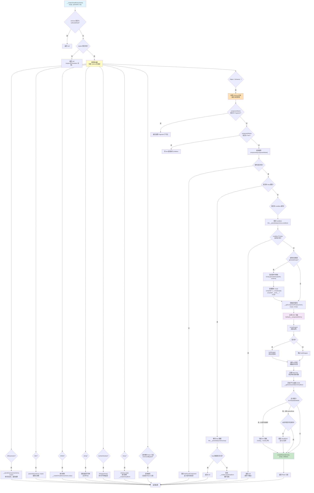
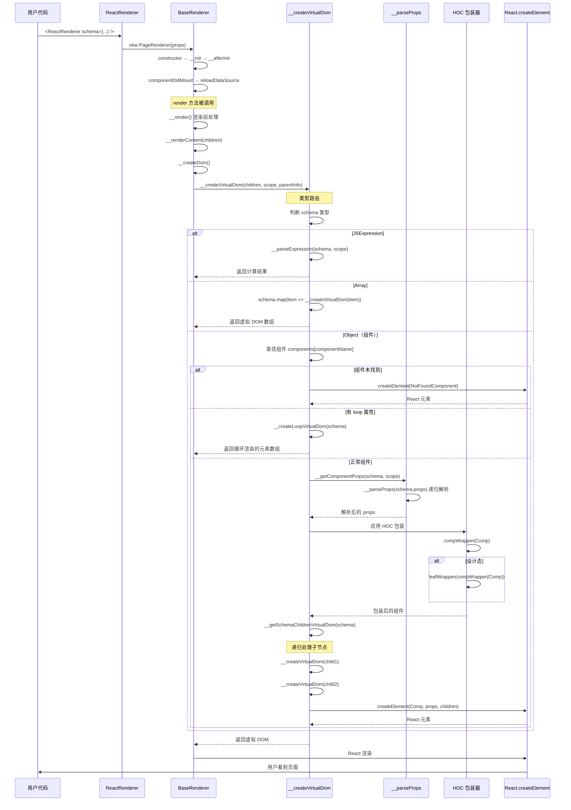
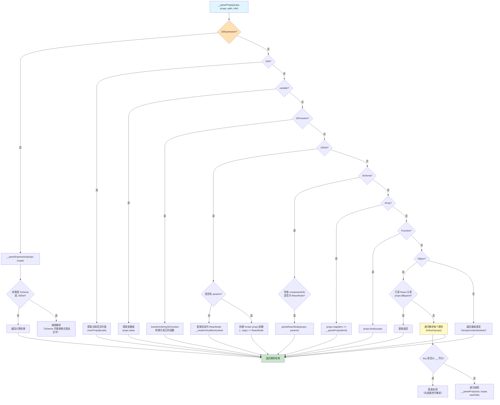
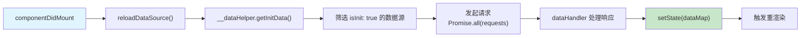
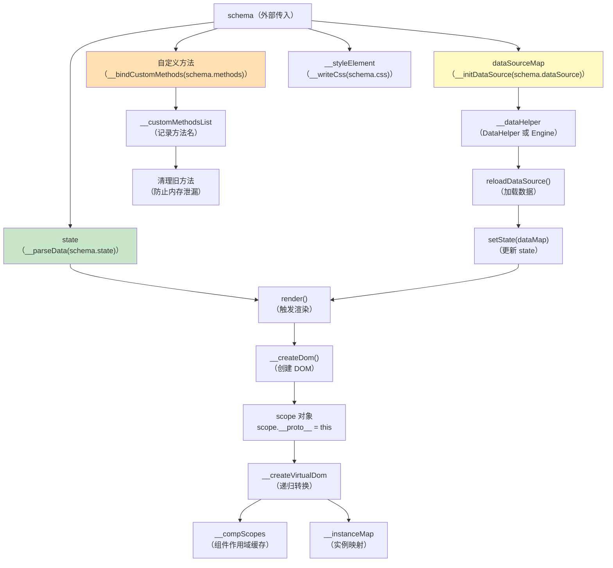
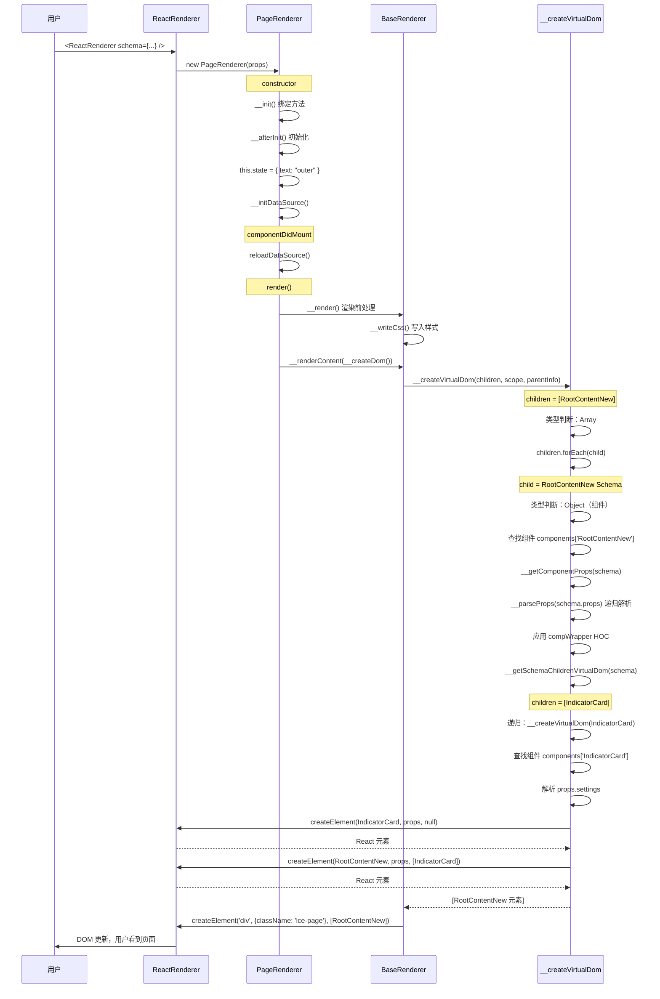

好的！我来详细讲解 `BaseRenderer` 类的核心实现。这是整个渲染引擎最重要的类，理解它就理解了 lowcode-engine 的核心原理。

## 一、BaseRenderer 核心架构概览

### 1.1 BaseRenderer 的职责定位

```
BaseRenderer 是什么？
├─ Schema → React 虚拟 DOM 的转换引擎
├─ 所有渲染器（Page/Component/Block）的基类
├─ 提供完整的低代码渲染能力
└─ 核心：递归解析和转换 Schema 结构
```

### 1.2 关键方法分类

让我创建一个详细的方法分类图：

```mermaid
graph TD
    BaseRenderer["BaseRenderer 类"]

    BaseRenderer --> Init["🔧 初始化方法（7个）"]
    BaseRenderer --> Lifecycle["🔄 生命周期方法（7个）"]
    BaseRenderer --> Core["🎨 核心渲染方法（11个）"]
    BaseRenderer --> Data["📡 数据管理方法（3个）"]
    BaseRenderer --> Context["🌍 上下文管理（4个）"]
    BaseRenderer --> Utils["🛠️ 工具方法（9个）"]

    Init --> Init1["constructor - 构造函数"]
    Init --> Init2["__beforeInit - 初始化前钩子"]
    Init --> Init3["__init - 初始化钩子"]
    Init --> Init4["__afterInit - 初始化后钩子"]
    Init --> Init5["__bindCustomMethods - 绑定方法"]
    Init --> Init6["__generateCtx - 生成上下文"]
    Init --> Init7["__initI18nAPIs - 初始化国际化"]

    Lifecycle --> LC1["componentDidMount - 挂载后"]
    Lifecycle --> LC2["componentDidUpdate - 更新后"]
    Lifecycle --> LC3["componentWillUnmount - 卸载前"]
    Lifecycle --> LC4["componentDidCatch - 捕获错误"]
    Lifecycle --> LC5["getDerivedStateFromProps - 派生状态"]
    Lifecycle --> LC6["getSnapshotBeforeUpdate - 更新前快照"]
    Lifecycle --> LC7["__executeLifeCycleMethod - 执行生命周期"]

    Core --> Core1["__createVirtualDom - 核心转换引擎⭐"]
    Core --> Core2["__createDom - 创建 DOM 结构"]
    Core --> Core3["__parseProps - 解析属性⭐"]
    Core --> Core4["__createLoopVirtualDom - 循环渲染"]
    Core --> Core5["__getSchemaChildrenVirtualDom - 获取子节点"]
    Core --> Core6["__getComponentProps - 获取组件属性"]
    Core --> Core7["__render - 渲染前处理"]
    Core --> Core8["__renderContent - 渲染内容"]
    Core --> Core9["__renderComp - 渲染组件"]
    Core --> Core10["__checkSchema - 检查 Schema"]
    Core --> Core11["render - 渲染方法"]

    Data --> Data1["__initDataSource - 初始化数据源"]
    Data --> Data2["reloadDataSource - 重新加载数据源"]
    Data --> Data3["__parseData - 解析数据"]

    Context --> Ctx1["__renderContextProvider - 渲染 Provider"]
    Context --> Ctx2["__renderContextConsumer - 渲染 Consumer"]
    Context --> Ctx3["__getHOCWrappedComponent - HOC 包装"]
    Context --> Ctx4["__componentHOCs - 获取 HOC 列表"]

    Utils --> U1["$ - 收集组件实例"]
    Utils --> U2["__getRef - 获取 ref"]
    Utils --> U3["__writeCss - 写入样式"]
    Utils --> U4["__debug - 调试日志"]
    Utils --> U5["forceUpdate - 强制更新"]
    Utils --> U6["shouldComponentUpdate - 是否更新"]
    Utils --> U7["appHelper, utils, constants - getter"]
    Utils --> U8["history, location, match - 路由"]
    Utils --> U9["__designModeIsDesign - 设计态判断"]

    style Core1 fill:#ff6b6b
    style Core3 fill:#ff6b6b
```



## 二、核心方法详细讲解

### 2.1 ⭐ __createVirtualDom - 核心转换引擎

这是**最最核心**的方法，整个渲染器的灵魂！
Ran tool

现在让我为你创建一个详细的 `__createVirtualDom` 运行流程讲解：

## 三、__createVirtualDom 核心方法深度解析

### 3.1 方法执行流程图



### 3.2 核心步骤详细讲解

#### 步骤 1：类型路由器（Type Router）

**为什么需要类型路由？**

因为 Schema 可以是多种类型：
```javascript
// 类型1：JSExpression（表达式）
{ type: 'JSExpression', value: 'this.state.count' }

// 类型2：字符串（文本节点）
'Hello World'

// 类型3：数组（多个子节点）
[
  { componentName: 'Button' },
  { componentName: 'Input' }
]

// 类型4：对象（组件）
{ componentName: 'Button', props: { ... } }
```

**实现原理：**
```javascript
// 1. 先处理特殊类型（JSExpression、i18n、JSSlot）
if (isJSExpression(schema)) {
    return this.__parseExpression(schema, scope);
}

// 2. 再处理基础类型（string、number、boolean）
if (typeof schema === 'string') {
    return schema;  // 直接作为文本节点
}

// 3. 再处理数组（递归处理每个元素）
if (Array.isArray(schema)) {
    return schema.map(item => this.__createVirtualDom(item, ...));
}

// 4. 最后处理对象（组件）
// 这是最复杂的逻辑...
```

**为什么按这个顺序？**
- 先处理特殊类型：避免被误判为普通对象
- 再处理基础类型：快速返回，性能优化
- 最后处理组件：最复杂，需要完整流程

---

#### 步骤 2：循环渲染处理（Loop Handling）

**为什么需要循环渲染？**

业务场景：根据数据列表渲染多个相同组件

```javascript
// Schema 示例
{
  componentName: 'Card',
  loop: { type: 'JSExpression', value: 'this.state.products' },
  loopArgs: ['product', 'index'],
  props: {
    title: { type: 'JSExpression', value: 'product.name' },
    price: { type: 'JSExpression', value: 'product.price' }
  }
}

// 等价于（手写代码）
{this.state.products.map((product, index) => (
  <Card key={index} title={product.name} price={product.price} />
))}
```

**实现原理：**
```javascript
// 1. 检测到 loop 属性
if (schema.loop != null) {
    // 2. 解析 loop 数据（可能是表达式）
    const loop = this.__parseData(schema.loop, scope);
    // loop = [{ id: 1, name: '商品1' }, { id: 2, name: '商品2' }]

    // 3. 调用循环渲染方法
    return this.__createLoopVirtualDom({...schema, loop}, scope, parentInfo, idx);
}
```

**__createLoopVirtualDom 的实现：**
```javascript
__createLoopVirtualDom = (schema, scope, parentInfo, idx) => {
    const itemArg = schema.loopArgs[0] || 'item';    // 循环项变量名
    const indexArg = schema.loopArgs[1] || 'index';  // 索引变量名

    // 遍历数组
    return schema.loop.map((item, i) => {
        // 🔥 创建循环作用域（关键）
        const loopSelf = {
            [itemArg]: item,      // product: { id: 1, name: '商品1' }
            [indexArg]: i,        // index: 0
        };
        loopSelf.__proto__ = scope;  // 继承父作用域

        // 递归调用 __createVirtualDom
        return this.__createVirtualDom(
            { ...schema, loop: undefined },  // 移除 loop 避免无限循环
            loopSelf,                         // 使用循环作用域
            parentInfo,
            i                                 // 索引作为 key
        );
    });
};
```

**为什么用原型链？**
```javascript
const loopSelf = { product: {...}, index: 0 };
loopSelf.__proto__ = scope;  // scope = { props: {...}, __proto__: this }

// 现在 loopSelf 可以访问：
// - loopSelf.product  ✅（自己的）
// - loopSelf.index    ✅（自己的）
// - loopSelf.props    ✅（通过原型链访问 scope.props）
// - loopSelf.state    ✅（通过原型链访问 scope.state → this.state）
```

---

#### 步骤 3：条件渲染处理（Condition Handling）

**为什么需要条件渲染？**

业务场景：根据条件显示/隐藏组件

```javascript
// Schema 示例
{
  componentName: 'Button',
  condition: { type: 'JSExpression', value: 'this.state.isAdmin' },
  props: { children: '删除' }
}

// 等价于
{this.state.isAdmin && <Button>删除</Button>}
```

**实现原理：**
```javascript
// 1. 解析 condition（默认为 true）
const condition = schema.condition == null
    ? true
    : this.__parseData(schema.condition, scope);

// 2. 设计态特殊处理
const displayInHook = this.__designModeIsDesign;

// 3. 条件为 false 且非设计态，不渲染
if (!condition && !displayInHook) {
    return null;
}

// 4. 设计态即使 condition 为 false 也渲染（但 leafWrapper 会隐藏）
// 这样设计器可以编辑被隐藏的组件
```

**为什么设计态要特殊处理？**
- 运行态：`condition = false` → 完全不渲染（DOM 不存在）
- 设计态：`condition = false` → 渲染但透明度降低（方便编辑）

---

#### 步骤 4：组件作用域（Component Scope）

**什么是 generateScope？**

某些高级组件需要维护自己的作用域（类似闭包）

```javascript
// 例如：FormItem 组件
FormItem.generateScope = (baseRenderer, schema) => {
    return {
        getValue: () => {
            // 获取表单值
            return baseRenderer.state.formData[schema.props.field];
        },
        setValue: (value) => {
            // 设置表单值
            baseRenderer.setState({
                formData: {
                    ...baseRenderer.state.formData,
                    [schema.props.field]: value
                }
            });
        }
    };
};
```

**实现原理：**
```javascript
// 1. 检查组件是否有 generateScope 方法
if (Comp.generateScope) {
    // 2. 生成唯一的 scopeKey
    const scopeKey = schema.__ctx.lceKey;  // 如 'lce1'

    // 3. 只生成一次（缓存）
    if (!this.__compScopes[scopeKey]) {
        this.__compScopes[scopeKey] = Comp.generateScope(this, schema);
    }

    // 4. 创建新的 scope，继承原 scope
    const compSelf = { ...this.__compScopes[scopeKey] };
    compSelf.__proto__ = scope;
    scope = compSelf;  // 使用新 scope
}
```

**为什么要缓存？**
- 避免重复创建作用域对象
- 保持状态一致性（多次渲染使用同一个 scope）

---

#### 步骤 5：HOC 包装（HOC Wrapping）

**为什么需要 HOC？**

实现横切关注点（cross-cutting concerns）：
- 错误边界（compWrapper）
- 响应式更新（leafWrapper，设计态）

**实现原理：**
```javascript
// 获取 HOC 列表
// 设计态：[leafWrapper, compWrapper]
// 运行态：[compWrapper]
this.__componentHOCs.forEach((ComponentConstruct) => {
    Comp = ComponentConstruct(Comp, {
        schema,
        componentInfo,
        baseRenderer: this,
        scope,
    });
});

// 包装顺序（从内到外）：
// OriginalComp
//   ↓ leafWrapper
// LeafHoc(OriginalComp)
//   ↓ compWrapper
// ErrorBoundary(LeafHoc(OriginalComp))
```

**为什么这个顺序？**
- `leafWrapper` 在内层：监听 Schema 变化，触发重渲染
- `compWrapper` 在外层：捕获所有错误（包括 leafWrapper 的错误）

---

#### 步骤 6：ref 收集

**为什么需要收集 ref？**

业务需要通过 `this.$('myButton')` 访问组件实例

**实现原理：**
```javascript
otherProps.ref = (ref: any) => {
    // 1. 收集到 __instanceMap
    this.$(props.fieldId || props.ref, ref);

    // 2. 如果 ref 是字符串，挂载到 this 上
    const refProps = props.ref;
    if (typeof refProps === 'string') {
        this['myButton'] = ref;  // 可以通过 this.myButton 访问
    }

    // 3. 通知 engine（设计器需要）
    ref && engine.props?.onCompGetRef(schema, ref);
};
```

**使用示例：**
```javascript
// Schema
{
  componentName: 'Button',
  props: {
    ref: 'submitButton'  // 或 fieldId: 'submitButton'
  }
}

// 在 methods 中使用
methods: {
  handleSubmit() {
    const btn = this.$('submitButton');  // 方式1
    // 或
    const btn = this.submitButton;       // 方式2
    btn.focus();
  }
}
```

---

#### 步骤 7：React key 生成

**为什么需要 key？**

React 列表渲染性能优化，保证组件身份稳定

**key 生成策略：**
```javascript
// 优先级1：schema.__ctx.lceKey（设计态）
if (schema?.__ctx?.lceKey) {
    props.key = `${schema.__ctx.lceKey}_${schema.__ctx.idx || 0}_${idx}`;
}
// 优先级2：循环索引
else if (typeof idx === 'number' || typeof idx === 'string') {
    props.key = idx;
}
// 优先级3：schema.id
else {
    props.key = schema.id;
}
```

**为什么这样设计？**
- `lceKey`：设计态唯一标识，保证组件在编辑时不会被销毁重建
- `idx`：循环场景，使用索引作为 key
- `id`：兜底方案，保证每个组件都有 key

---

### 3.3 __createVirtualDom 完整调用链

让我创建一个实际运行示例的流程图：



---

## 四、__parseProps 属性解析引擎详解

这是第二核心的方法，理解它才能理解属性如何被转换。

### 4.1 __parseProps 支持的类型

```javascript
// 类型1：JSExpression
props.disabled = { type: 'JSExpression', value: 'this.state.loading' }
// → disabled: true（假设 loading = true）

// 类型2：JSFunction
props.onClick = { type: 'JSFunction', value: 'function() { console.log(123); }' }
// → onClick: function() { console.log(123); }

// 类型3：JSSlot（插槽）
props.header = {
    type: 'JSSlot',
    value: { componentName: 'Title', props: { text: '标题' } }
}
// → header: <Title text="标题" />

// 类型4：JSSlot with params（render props）
props.renderItem = {
    type: 'JSSlot',
    params: ['item', 'index'],
    value: { componentName: 'Item', props: { name: '{{item.name}}' } }
}
// → renderItem: (item, index) => <Item name={item.name} />

// 类型5：i18n
props.placeholder = {
    type: 'i18n',
    'zh-CN': '请输入',
    'en-US': 'Please input'
}
// → placeholder: '请输入'（根据当前语言）

// 类型6：对象（递归解析）
props.style = {
    color: { type: 'JSExpression', value: 'this.state.themeColor' },
    fontSize: 14
}
// → style: { color: '#1890ff', fontSize: 14 }

// 类型7：数组（递归解析）
props.items = [
    { type: 'JSExpression', value: 'this.state.item1' },
    { type: 'JSExpression', value: 'this.state.item2' }
]
// → items: ['项目1', '项目2']
```

### 4.2 __parseProps 递归处理流程



### 4.3 为什么递归解析？

**原因：Schema 可以无限嵌套**

```javascript
// 嵌套示例
props: {
  style: {  // 对象
    color: { type: 'JSExpression', value: 'this.state.color' },  // 表达式
    margin: {  // 对象嵌套
      top: { type: 'JSExpression', value: 'this.state.marginTop' },
      left: 10
    }
  },
  config: {  // 对象
    list: [  // 数组
      { type: 'JSExpression', value: 'this.state.item1' },
      { type: 'JSExpression', value: 'this.state.item2' }
    ]
  }
}

// 递归解析后：
{
  style: {
    color: '#1890ff',
    margin: {
      top: 20,
      left: 10
    }
  },
  config: {
    list: ['项目1', '项目2']
  }
}
```

**递归的关键：**
```javascript
forEach(props, (val, key) => {
    // 跳过内部属性（__ 开头）
    if (key.startsWith('__')) {
        res[key] = val;
        return;
    }
    // 🔥 递归调用，更新 path
    res[key] = this.__parseProps(
        val,
        scope,
        path ? `${path}.${key}` : key,  // path: 'style.color'
        info
    );
});
```

**path 的作用？**
- 用于属性类型检查：`checkPropTypes(value, 'style.color', propType)`
- 用于错误提示：`属性 'style.color' 类型不匹配`

---

## 五、BaseRenderer 内部状态和方法关系流程图

```mermaid
graph TD
    Start["ReactRenderer 实例化"] --> Constructor["constructor<br/>（BaseRenderer）"]

    Constructor --> BeforeInit["__beforeInit(props)<br/>🔹 空方法（子类可重写）"]
    BeforeInit --> Init["__init(props)<br/>🔹 绑定方法和国际化"]

    Init --> InitScopes["this.__compScopes = {}<br/>重置作用域缓存"]
    Init --> InitInstances["this.__instanceMap = {}<br/>重置实例映射"]
    Init --> BindMethods["__bindCustomMethods(props)<br/>绑定 schema.methods"]
    Init --> InitI18n["__initI18nAPIs()<br/>挂载 i18n/getLocale/setLocale"]

    BindMethods --> AfterInit["__afterInit(props)<br/>🔹 子类必须重写"]

    AfterInit --> PageInit{"子类类型?"}
    PageInit -->|PageRenderer| PageLogic["__generateCtx({page: this})<br/>初始化 state<br/>__initDataSource"]
    PageInit -->|ComponentRenderer| CompLogic["__generateCtx({component: this})<br/>初始化 state<br/>__initDataSource"]
    PageInit -->|BlockRenderer| BlockLogic["__generateCtx({})<br/>可选 state<br/>可选 dataSource"]

    PageLogic --> DidMount["componentDidMount"]
    CompLogic --> DidMount
    BlockLogic --> DidMount

    DidMount --> LoadData["reloadDataSource()<br/>🔹 加载 isInit: true 的数据源"]
    LoadData --> GetInitData["__dataHelper.getInitData()"]
    GetInitData --> SetState["setState(res)<br/>更新 state"]
    SetState --> ExecLC["__executeLifeCycleMethod('componentDidMount')"]

    ExecLC --> RenderCycle["渲染周期开始"]

    RenderCycle --> Render["render()<br/>🔹 子类重写"]
    Render --> RenderImpl{"子类实现"}
    RenderImpl -->|PageRenderer| PageRender["__render() 渲染前处理<br/>__renderContent(__createDom())"]
    RenderImpl -->|ComponentRenderer| CompRender["__render() 渲染前处理<br/>__renderContent(__createDom())"]

    PageRender --> RenderProcess["__render 流程"]
    CompRender --> RenderProcess

    RenderProcess --> ExecRenderLC["__executeLifeCycleMethod('render')"]
    ExecRenderLC --> WriteCss["__writeCss(props)<br/>注入 schema.css"]
    WriteCss --> NotifyEngine["engine.props.onCompGetCtx(schema, this)"]
    NotifyEngine --> DesignMode{"设计态?"}
    DesignMode -->|是| RebindMethods["__bindCustomMethods(props)<br/>重新绑定方法"]
    DesignMode -->|否| CreateDom["__createDom()"]
    RebindMethods --> CreateDom

    CreateDom --> CreateScope["创建 scope 对象<br/>scope = {props: ...}<br/>scope.__proto__ = this"]
    CreateScope --> GetChildren["getSchemaChildren(__schema)"]
    GetChildren --> WrapHOC["__getHOCWrappedComponent(Comp)"]
    WrapHOC --> CallVDom["__createVirtualDom(children, scope, parentInfo)"]

    CallVDom --> VDomRouter["类型路由器"]
    VDomRouter --> VDomType{"schema 类型?"}

    VDomType -->|JSExpression| ExprParse["__parseExpression"]
    VDomType -->|Array| ArrayMap["map + 递归 __createVirtualDom"]
    VDomType -->|Object| ObjectProcess["对象处理流程"]

    ObjectProcess --> FindComp["查找组件<br/>components[componentName]"]
    FindComp --> CompFound{"组件存在?"}
    CompFound -->|否| NotFound["createElement(NotFoundComponent)"]
    CompFound -->|是| CheckLoop{"有 loop?"}

    CheckLoop -->|是| LoopRender["__createLoopVirtualDom<br/>循环渲染"]
    CheckLoop -->|否| CheckCond{"condition?"}

    CheckCond -->|false且非设计态| ReturnNull["return null"]
    CheckCond -->|true或设计态| GetProps["__getComponentProps(schema)"]

    GetProps --> ParseProps["__parseProps(schema.props)<br/>🔹 递归解析属性"]
    ParseProps --> ApplyHOC["应用 HOC<br/>compWrapper + leafWrapper"]
    ApplyHOC --> SetRef["设置 ref 回调<br/>收集组件实例"]
    SetRef --> SetKey["设置 React key"]
    SetKey --> GetChildVDom["__getSchemaChildrenVirtualDom<br/>🔹 递归处理子节点"]
    GetChildVDom --> CreateEl["createElement(Comp, props, children)"]

    CreateEl --> ReactEl["React 元素"]
    ExprParse --> ReactEl
    ArrayMap --> ReactEl
    NotFound --> ReactEl
    LoopRender --> ReactEl

    ReactEl --> ReactRender["React 协调与渲染"]
    ReactRender --> DOM["浏览器 DOM 更新"]
    DOM --> UserSee["用户看到页面"]

    style CallVDom fill:#ff6b6b
    style ParseProps fill:#ff6b6b
    style GetChildVDom fill:#ff6b6b
```



---

## 六、核心功能实现原理

### 6.1 作用域链（Scope Chain）机制

**为什么需要作用域链？**

让表达式能访问到 `this.state`、`this.page`、`props` 等

**实现原理：**

```javascript
// 1. PageRenderer 初始化
constructor(props) {
    // ...
    this.__generateCtx({ page: this });  // this.page = this
    this.state = { count: 0 };
}

// 2. __createDom 创建根作用域
__createDom() {
    const scope = { props: {...} };
    scope.__proto__ = this;  // 指向 PageRenderer 实例

    // 现在 scope 可以访问：
    // - scope.props ✅
    // - scope.state ✅（通过原型链 → this.state）
    // - scope.page ✅（通过原型链 → this.page）
}

// 3. 循环渲染创建循环作用域
__createLoopVirtualDom(schema) {
    const loopSelf = {
        item: { id: 1, name: '商品' },
        index: 0
    };
    loopSelf.__proto__ = scope;  // 继承父作用域

    // 现在 loopSelf 可以访问：
    // - loopSelf.item ✅（自己的）
    // - loopSelf.index ✅（自己的）
    // - loopSelf.props ✅（父作用域）
    // - loopSelf.state ✅（父作用域 → this.state）
}
```

**作用域链示意图：**
```
loopSelf = { item, index }
    ↓ __proto__
scope = { props }
    ↓ __proto__
this = PageRenderer {
    state: { ... },
    page: this,
    dataSourceMap: { ... },
    handleClick: function() {...}
}
```

**表达式访问示例：**
```javascript
// 表达式：'item.name + " - " + this.state.count'
// 解析过程：
// 1. item → loopSelf.item ✅
// 2. this → loopSelf（作用域对象）
// 3. this.state → loopSelf.state → scope.state → PageRenderer.state ✅
// 4. 计算结果：'商品 - 5'
```

---

### 6.2 HOC 包装机制

**为什么需要 HOC？**

实现功能增强而不修改原组件

**compWrapper（错误边界）实现：**
Ran tool

### 6.3 compWrapper 错误边界实现原理

**为什么这样实现？**

```javascript
// 问题：如何捕获函数组件的错误？
const MyComponent = (props) => {
  throw new Error('出错了');  // 函数组件无法使用 componentDidCatch
};

// 解决方案：包装一个类组件
class Wrapper extends Component {
  componentDidCatch(error) {
    this.setState({ engineRenderError: true, error });
  }

  render() {
    if (this.state.engineRenderError) {
      return <FaultComponent error={this.state.error} />;  // 显示错误 UI
    }
    return <MyComponent {...this.props} />;  // 正常渲染
  }
}
```

**patchDidCatch 的巧妙之处：**

```javascript
// 对于类组件，直接修改原型
Comp.prototype.componentDidCatch = function(error) {
    this.setState({ engineRenderError: true, error });
};

Comp.prototype.render = function() {
    if (this.state.engineRenderError) {
        return <FaultComponent error={this.state.error} />;
    }
    return originalRender.call(this);  // 调用原 render
};
```

**为什么要 patch 而不是包装？**
- 性能更好：不增加额外的组件层级
- 保持 ref 透明：ref 直接指向原组件
- 兼容性好：对组件几乎无侵入

---

### 6.4 数据源管理机制

**两种数据源方案对比：**

```javascript
// 方案1：DataSourceEngine（新）
if (appHelper.requestHandlersMap) {
    const { dataSourceMap, reloadDataSource } = createDataSourceEngine(
        schema.dataSource,
        this,  // 上下文
        { requestHandlersMap }
    );

    // 特点：
    // - 支持数据源依赖关系
    // - 支持复杂的数据流
    // - 更强大的配置能力
}

// 方案2：DataHelper（旧）
else {
    this.__dataHelper = new DataHelper(
        this,
        schema.dataSource,
        appHelper,
        (config) => this.__parseData(config)
    );

    // 特点：
    // - 简单的请求/响应模式
    // - 兼容性好
    // - 易于理解
}
```

**数据源加载流程：**



**为什么在 componentDidMount 加载？**
- 避免重复请求：constructor 中可能多次调用
- 确保 DOM 已挂载：某些数据源可能依赖 DOM
- 符合 React 最佳实践

---

## 七、关键注意事项

### 7.1 ⚠️ 性能陷阱

**陷阱 1：大列表循环渲染**

```javascript
// ❌ 错误：循环渲染 10000 个组件
{
  componentName: 'Card',
  loop: { type: 'JSExpression', value: 'this.state.largeList' },  // 10000 条数据
}

// ✅ 正确：使用虚拟滚动
{
  componentName: 'VirtualList',
  props: {
    dataSource: { type: 'JSExpression', value: 'this.state.largeList' }
  }
}
```

**原因：**
- `__createVirtualDom` 会为每个循环项创建虚拟 DOM
- 10000 次递归调用 → 性能瓶颈

---

**陷阱 2：深层嵌套的表达式**

```javascript
// ❌ 错误：每次渲染都重新计算复杂表达式
props.data = {
    type: 'JSExpression',
    value: 'this.state.list.map(item => ({ ...item, processed: true })).filter(item => item.active)'
}

// ✅ 正确：使用 computed（计算属性）
state: {
    processedList: {
        type: 'JSExpression',
        value: 'this.state.list.map(...).filter(...)'
    }
}
props.data = {
    type: 'JSExpression',
    value: 'this.state.processedList'  // 缓存计算结果
}
```

**原因：**
- `__parseExpression` 每次渲染都会执行
- 复杂计算应该放在 state 中，利用 React 的缓存

---

### 7.2 ⚠️ 内存泄漏风险

**风险 1：事件监听器未清理**

```javascript
// Schema 中的生命周期
lifeCycles: {
    componentDidMount: {
        type: 'JSFunction',
        value: `function() {
            window.addEventListener('resize', this.handleResize);
        }`
    },
    componentWillUnmount: {
        type: 'JSFunction',
        value: `function() {
            // 🔥 必须清理事件监听器
            window.removeEventListener('resize', this.handleResize);
        }`
    }
}
```

**风险 2：定时器未清理**

```javascript
methods: {
    startTimer() {
        this.timer = setInterval(() => {
            this.setState({ time: Date.now() });
        }, 1000);
    }
},
lifeCycles: {
    componentWillUnmount: {
        type: 'JSFunction',
        value: `function() {
            // 🔥 必须清理定时器
            if (this.timer) {
                clearInterval(this.timer);
            }
        }`
    }
}
```

---

### 7.3 ⚠️ this 指向问题

**问题：表达式中的 this 指向谁？**

```javascript
// ✅ 正确：this 指向渲染器实例
{ type: 'JSExpression', value: 'this.state.count' }
// this = PageRenderer 实例

// ❌ 错误：this 不是组件 props
{ type: 'JSExpression', value: 'this.props.value' }
// ❌ 错误！this 没有 props 属性
// 应该用 props.value（scope.props.value）

// ✅ 正确：访问 props
{ type: 'JSExpression', value: 'props.value' }
// 或
{ type: 'JSExpression', value: 'this.props.value' }
// 如果 scope.props = { value: 123 }
```

**parseExpression 的实现原理：**

```javascript
// utils/common.ts
function parseExpression({ str, self, thisRequired }) {
    let tarStr = str.value.trim();

    // 🔥 关键：将 'this' 替换为 '__self'
    tarStr = tarStr.replace(/this(\W|$)/g, (_a, b) => `__self${b}`);
    // 'this.state.count' → '__self.state.count'

    // 构造代码
    const code = `with(${thisRequired ? '{}' : '$scope || {}'}) { return __self.state.count }`;

    // 执行
    return new Function('$scope', code)(self);
    // self = scope（作用域对象）
    // __self = arguments[0] = self
}
```

**为什么用 with？**
```javascript
// 不用 with
const result = self.state.count;  // 只能访问 self

// 用 with
with ($scope) {
    return __self.state.count;
}
// 可以访问：
// - __self.state.count（明确的 this）
// - props.value（来自 $scope.props）
// - item（来自 $scope.item）
```

---

## 八、BaseRenderer 内部状态管理

### 8.1 关键内部状态

```javascript
class BaseRenderer extends Component {
    // ========== 用户可访问的状态 ==========
    state: any;                    // 组件状态（schema.state）
    dataSourceMap: Record<string, any>;  // 数据源映射表
    i18n: Function;               // 国际化方法
    page?: PageRenderer;          // Page 实例（PageRenderer 注入）
    component?: ComponentRenderer;// Component 实例（ComponentRenderer 注入）

    // + schema.methods 中定义的所有方法
    handleClick?: Function;
    getData?: Function;

    // ========== 内部状态（__ 开头）==========
    __compScopes: Record<string, any>;    // 组件作用域缓存
    __instanceMap: Record<string, any>;   // 组件实例映射
    __dataHelper: any;                    // 数据源助手
    __customMethodsList: string[];        // 自定义方法列表
    __parseExpression: Function;          // 表达式解析函数
    __ref: any;                          // 渲染器 ref
    __styleElement: HTMLStyleElement;    // 样式元素
}
```

### 8.2 状态之间的依赖关系



---

## 九、核心方法调用关系链

### 9.1 渲染链路

```
用户代码: <ReactRenderer schema={...} />
  ↓
ReactRenderer.render()（react-renderer/index.ts）
  ↓
Renderer.render()（renderer/renderer.tsx）
  ↓ 路由到
PageRenderer.render()（renderer/page.tsx）
  ↓
BaseRenderer.__render()（渲染前处理）
  ↓
BaseRenderer.__renderContent(children)
  ↓
BaseRenderer.__createDom()
  ↓
BaseRenderer.__createVirtualDom(children, scope, parentInfo) ⭐ 核心
  ↓ 递归调用
BaseRenderer.__getSchemaChildrenVirtualDom(schema)
  ↓ 递归调用
BaseRenderer.__createVirtualDom(child1)
  ↓
BaseRenderer.__getComponentProps(schema) → __parseProps(schema.props) ⭐ 核心
  ↓
BaseRenderer.__componentHOCs.forEach(HOC => Comp = HOC(Comp))
  ↓
React.createElement(Comp, props, children)
  ↓
React 渲染引擎
  ↓
浏览器 DOM
```

### 9.2 数据加载链路

```
componentDidMount
  ↓
reloadDataSource()
  ↓
__dataHelper.getInitData()
  ↓
筛选 isInit: true 的数据源
  ↓
Promise.all(requests)
  ↓
dataHandler 处理响应
  ↓
setState(dataMap)
  ↓
触发重渲染
  ↓
__createVirtualDom 使用新数据
  ↓
页面更新
```

---

## 十、实际运行示例（基于你的 schema.json）

让我用你的实际 Schema 演示整个流程：

```javascript
// 你的 schema.json（简化）
{
  "componentsTree": [{
    "componentName": "Page",  // ← 会创建 PageRenderer
    "state": {
      "text": { "type": "JSExpression", "value": "\"outer\"" }
    },
    "children": [{
      "componentName": "RootContentNew",  // ← 业务组件
      "children": [
        {
          "componentName": "IndicatorCard",  // ← 业务组件
          "props": {
            "settings": {
              "unitId": "unit_885235810326712321"
            }
          }
        }
      ]
    }]
  }]
}
```

**运行流程：**



---

## 十一、最佳实践和优化建议

### 11.1 Schema 设计最佳实践

```javascript
// ✅ 好的设计
{
  componentName: 'Page',
  state: {
    loading: false,
    data: null
  },
  dataSource: {
    list: [{
      id: 'fetchData',
      isInit: true,  // 自动加载
      options: { uri: '/api/data' },
      dataHandler: {
        type: 'JSFunction',
        value: 'function(res) { return res.data; }'
      }
    }]
  },
  methods: {
    refresh() {
      this.setState({ loading: true });
      this.reloadDataSource().then(() => {
        this.setState({ loading: false });
      });
    }
  }
}

// ❌ 不好的设计
{
  methods: {
    fetchData() {
      // ❌ 不要手动发请求，应该用 dataSource
      fetch('/api/data').then(res => {
        this.setState({ data: res });
      });
    }
  },
  lifeCycles: {
    componentDidMount: {
      type: 'JSFunction',
      value: 'function() { this.fetchData(); }'
    }
  }
}
```

### 11.2 性能优化建议

```javascript
// 1. 使用 condition 避免渲染
{
  componentName: 'ExpensiveComponent',
  condition: { type: 'JSExpression', value: 'this.state.showDetail' },
  // 条件为 false 时完全不渲染（不执行转换逻辑）
}

// 2. 循环时使用稳定的 key
{
  loop: [...],
  props: {
    key: { type: 'JSExpression', value: 'item.id' }  // ✅ 使用唯一 ID
    // ❌ 不要用 index
  }
}

// 3. 避免在 render 中做复杂计算
{
  // ❌ 错误
  props: {
    data: {
      type: 'JSExpression',
      value: 'this.state.list.map(...).filter(...).sort(...)'  // 每次渲染都计算
    }
  },

  // ✅ 正确：放在 state 中
  state: {
    sortedList: {
      type: 'JSExpression',
      value: 'this.state.list.map(...).filter(...).sort(...)'
    }
  },
  props: {
    data: { type: 'JSExpression', value: 'this.state.sortedList' }
  }
}
```

---

## 十二、总结

### BaseRenderer 核心能力汇总

| 能力 | 实现方法 | 核心价值 |
|------|---------|---------|
| **Schema → 虚拟 DOM** | `__createVirtualDom` | 整个引擎的核心，递归转换 |
| **属性解析** | `__parseProps` | 处理 10+ 种特殊类型 |
| **表达式执行** | `__parseExpression` | 动态计算能力 |
| **循环渲染** | `__createLoopVirtualDom` | 列表渲染支持 |
| **条件渲染** | condition 处理 | 动态显示/隐藏 |
| **作用域管理** | scope 原型链 | 表达式可访问 this |
| **HOC 包装** | `__componentHOCs` | 错误边界 + 响应式 |
| **数据源管理** | `__initDataSource` | 统一的数据请求 |
| **生命周期** | `__executeLifeCycleMethod` | 完整的生命周期支持 |
| **ref 收集** | `$` 方法 | 组件实例访问 |

### 设计哲学

1. **递归是核心**：Schema 是树形结构，递归转换是最自然的方式
2. **原型链是灵魂**：通过原型链实现作用域继承，优雅且高效
3. **HOC 是增强**：通过 HOC 实现功能增强，保持代码解耦
4. **缓存是优化**：合理使用缓存（__compScopes、LeafCache）提升性能

希望这个深度讲解能帮助你彻底理解 BaseRenderer 的核心实现！如果还有疑问，欢迎继续提问。