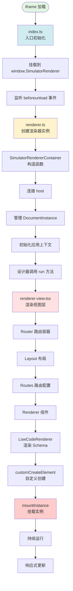
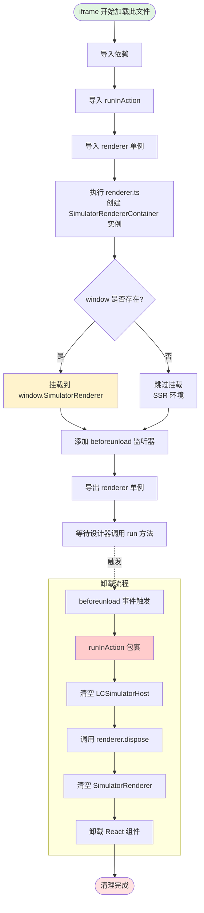
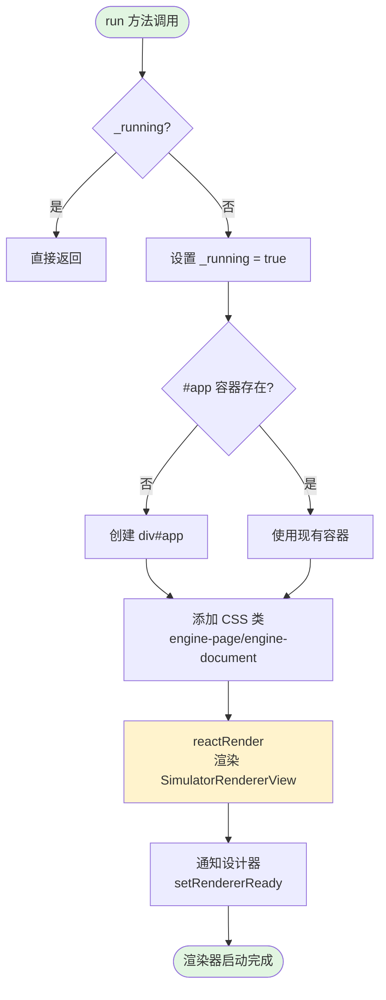
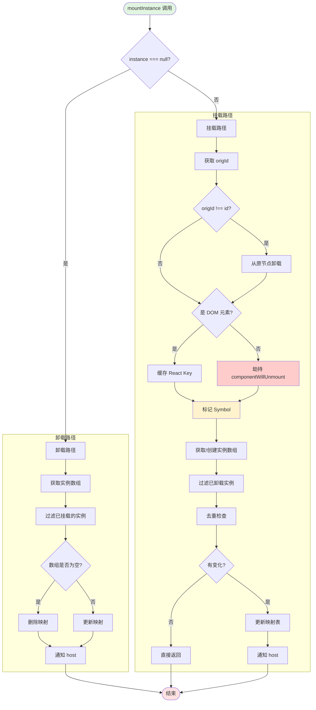
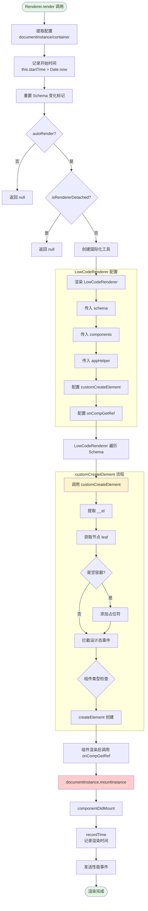
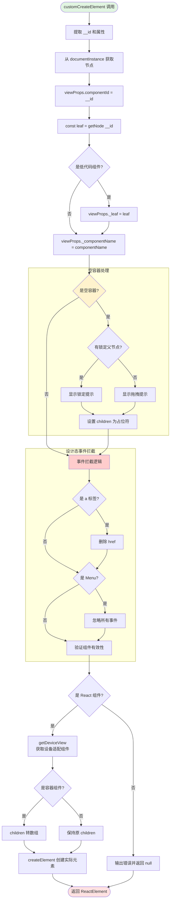
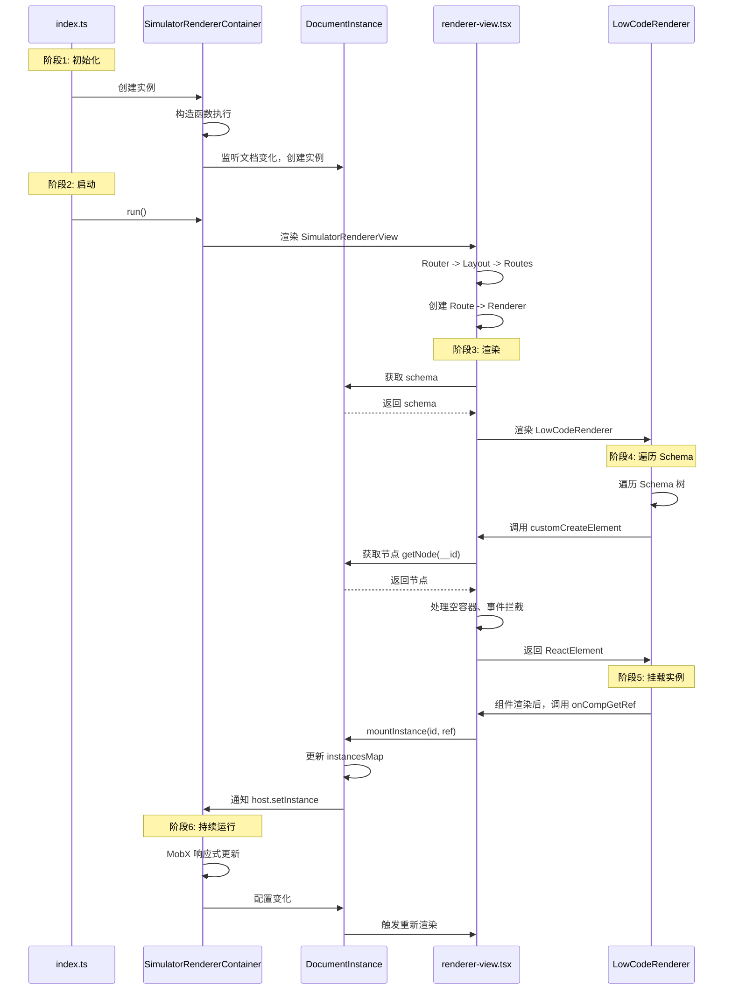
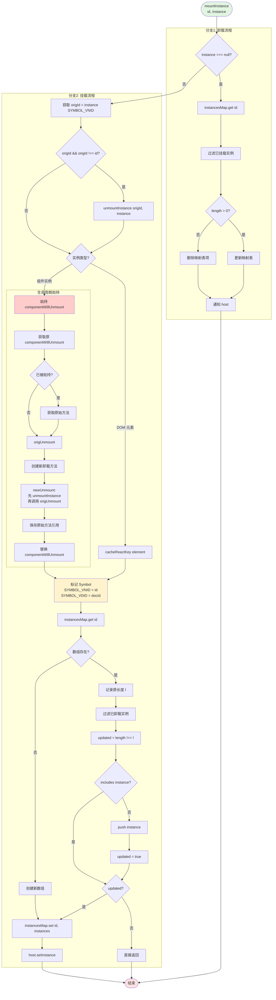

好的！我删除刚才创建的文件，直接在回复中展示内容。
Ran tool

好的！我直接在回复中展示，不保存文件。

---

## 📚 问题3：流程图分层拆解

我按照你的要求，将流程图分为：
1. 总览流程图（大图）
2. index.ts 详细流程
3. renderer.ts 详细流程
4. renderer-view.tsx 详细流程

### 3.1 总览流程图（大图）



### 3.2 index.ts 详细流程图



**index.ts 关键点：**
- ✅ 负责生命周期的起点和终点
- ✅ 将渲染器暴露给外部
- ✅ 确保资源正确清理

### 3.3 renderer.ts 详细流程图

由于 renderer.ts 包含两个类，我分别绘制：

#### 3.3.1 SimulatorRendererContainer 构造函数流程

```mermaid
graph TB
    Start([new SimulatorRendererContainer]) --> Step1[启用 MobX<br/>makeObservable]

    Step1 --> Step2[同步 autoRender]

    Step2 --> Step3[host.connect<br/>建立双向通信]

    subgraph Host 连接回调
        Step3 --> Sync1[同步 layout]
        Sync1 --> Sync2[同步 libraryMap]
        Sync2 --> Sync3[同步 componentsMap]
        Sync3 --> Sync4[构建组件映射表]
        Sync4 --> Sync5[同步 designMode]
        Sync5 --> Sync6[同步 locale]
        Sync6 --> Sync7[同步 requestHandlersMap]
        Sync7 --> Sync8[同步 device]
    end

    Sync8 --> Step4[host.autorun<br/>监听文档变化]

    subgraph 文档监听
        Step4 --> Doc1[映射 documents 为<br/>DocumentInstance 数组]
        Doc1 --> Doc2[缓存实例<br/>documentInstanceMap]
        Doc2 --> Doc3[获取当前文档路径]
        Doc3 --> Doc4[同步路由]
    end

    Doc4 --> Step5[创建 MemoryHistory]
    Step5 --> Step6[监听路由变化]
    Step6 --> Step7[消费组件资源<br/>componentsConsumer]

    Step7 --> Step8[初始化 appContext]

    subgraph AppContext 初始化
        Step8 --> Ctx1[创建 router 工具]
        Ctx1 --> Ctx2[创建 legaoBuiltins]
        Ctx2 --> Ctx3[创建 i18n 工具]
        Ctx3 --> Ctx4[注入项目 utils]
    end

    Ctx4 --> Step9[消费注入配置<br/>injectionConsumer]
    Step9 --> Step10[消费国际化<br/>i18nConsumer]

    Step10 --> Ready([构造完成<br/>等待 run 调用])

    style Start fill:#e1f5e1
    style Ready fill:#e1f5e1
```



#### 3.3.2 run 方法流程



#### 3.3.3 DocumentInstance.mountInstance 流程（核心！）



### 3.4 renderer-view.tsx 详细流程图

#### 3.4.1 组件层级结构

```mermaid
graph TB
    Root[SimulatorRendererView<br/>根组件] --> Router[Router<br/>内存路由容器]

    Router --> Layout[Layout<br/>布局组件]

    Layout --> CheckLayout{layout 配置存在?}
    CheckLayout -->|是| ApplyLayout[应用 Layout 组件]
    CheckLayout -->|否| Fragment[Fragment 透传]

    ApplyLayout --> Routes
    Fragment --> Routes[Routes<br/>路由配置]

    Routes --> Observer1[@observer<br/>响应文档列表变化]
    Observer1 --> Switch[Switch 路由切换]

    Switch --> MapDocs[遍历 documentInstances]
    MapDocs --> CreateRoute[创建 Route]

    CreateRoute --> Renderer[Renderer<br/>核心渲染组件]
    Renderer --> Observer2[@observer<br/>响应 Schema 变化]

    Observer2 --> LowCode[LowCodeRenderer<br/>低代码渲染器]

    style Root fill:#e1f5e1
    style Renderer fill:#ffcccc
    style LowCode fill:#fff3cd
```

#### 3.4.2 Renderer 组件渲染流程



#### 3.4.3 customCreateElement 详细流程（最核心！）



### 3.5 三个文件的协作关系图



### 3.6 mountInstance 核心流程（单独详解）



### 3.7 完整的响应式更新流程

```mermaid
graph LR
    subgraph 设计器操作
        D1[修改 Schema]
        D2[切换设备]
        D3[切换语言]
        D4[加载组件]
    end

    subgraph Host 通信层
        H1[host.project]
        H2[host.designer]
        H3[host.libraryMap]
    end

    subgraph 渲染器响应
        R1[host.connect 回调]
        R2[host.autorun 回调]
        R3[MobX 响应式]
    end

    subgraph 视图更新
        V1[@observer 组件]
        V2[重新渲染]
        V3[DOM 更新]
    end

    D1 --> H1
    D2 --> H2
    D3 --> H2
    D4 --> H3

    H1 --> R1
    H2 --> R1
    H3 --> R1

    H1 --> R2
    H2 --> R2

    R1 --> R3
    R2 --> R3

    R3 --> V1
    V1 --> V2
    V2 --> V3

    style D1 fill:#e1f5e1
    style H1 fill:#d1ecf1
    style R3 fill:#fff3cd
    style V3 fill:#ffe1e1
```

---

## 📊 学习路径建议

### 🎯 从大到小学习顺序

#### 第1步：理解整体架构（30分钟）
- 看总览流程图，理解三个文件的职责
- 看协作关系图，理解数据流向
- 理解：index.ts → renderer.ts → renderer-view.tsx 的调用链

#### 第2步：理解初始化过程（1小时）
- 看 index.ts 流程图
- 看 SimulatorRendererContainer 构造函数流程
- 理解 host.connect 和 host.autorun 的作用
- 理解 documentInstanceMap 缓存机制

#### 第3步：理解渲染过程（1.5小时）
- 看 run 方法流程
- 看 renderer-view.tsx 组件层级
- 看 Renderer 组件渲染流程
- 理解 Router -> Layout -> Routes -> Renderer 的层级

#### 第4步：深入核心机制（2小时）
- **重点！** 看 mountInstance 流程图
- **重点！** 看 customCreateElement 流程图
- 理解实例复用检测
- 理解生命周期劫持
- 理解 Symbol 标记机制

#### 第5步：理解响应式更新（1小时）
- 看响应式更新流程图
- 理解 MobX 的作用
- 理解设计器操作如何触发渲染器更新
- 理解双向同步机制

---

## 🔑 关键流程速查表

| 流程 | 入口 | 关键步骤 | 结果 |
|-----|------|---------|------|
| **初始化** | index.ts 加载 | 创建容器 -> 连接 host -> 监听文档 | 渲染器就绪 |
| **启动渲染** | run() | 创建容器 -> 渲染视图 -> 通知就绪 | 显示画布 |
| **Schema渲染** | Renderer.render() | 获取 Schema -> LowCodeRenderer -> customCreateElement | React 组件树 |
| **实例挂载** | mountInstance() | 劫持生命周期 -> 标记 Symbol -> 更新映射 | 建立双向绑定 |
| **响应式更新** | host 变化 | MobX 检测 -> 触发回调 -> 重新渲染 | 同步最新状态 |

---

这样的分层结构是否清晰了？你可以先从总览图开始，然后根据兴趣深入某个具体流程！🚀