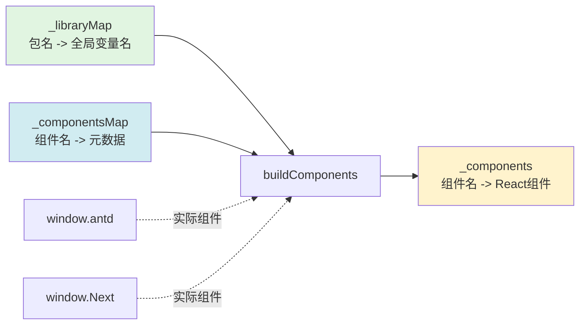
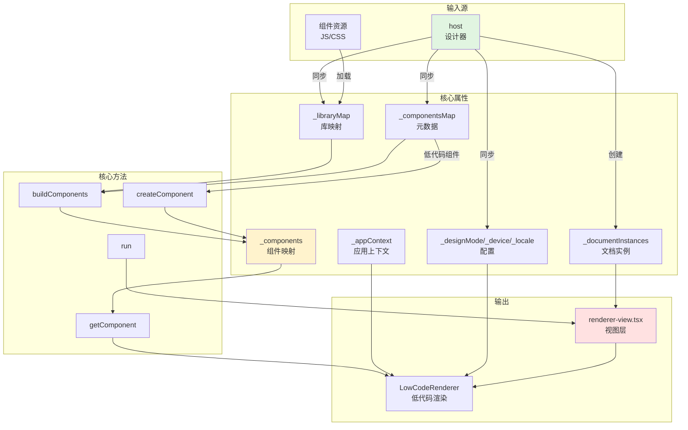
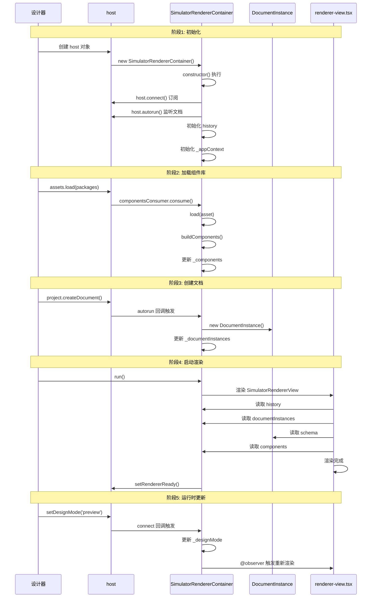
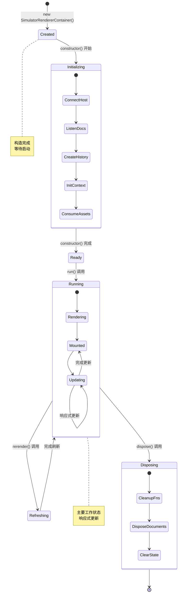
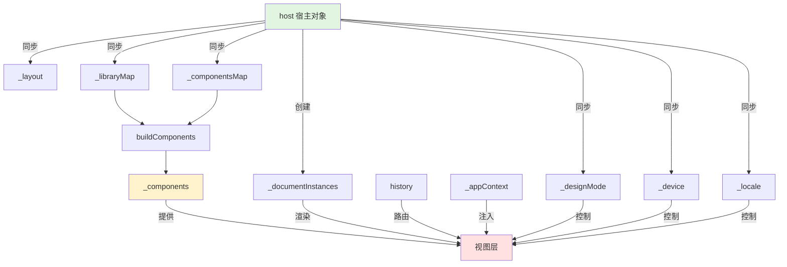
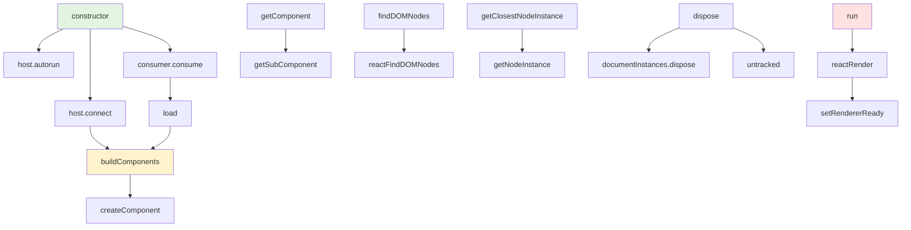

好的！我来为你深入剖析 `SimulatorRendererContainer` 类，这是整个渲染器的**大脑和指挥中心**。

让我先读取完整的代码，然后做全面分析：
Ran tool

# 🎯 SimulatorRendererContainer 深度剖析

## 一、类的定位与设计理念

### 1.1 核心定位

```typescript
SimulatorRendererContainer = 渲染器的"大脑" + "指挥中心"

职责：
┌─────────────────────────────────────────────────┐
│ 1. 生命周期管理：初始化 -> 运行 -> 销毁          │
│ 2. 状态同步中心：与设计器保持实时同步             │
│ 3. 资源管理中心：组件库、CSS、工具函数            │
│ 4. 文档管理器：管理多个文档实例                   │
│ 5. 上下文提供者：为渲染器提供全局上下文           │
│ 6. 路由管理器：内存路由，支持多页面               │
└─────────────────────────────────────────────────┘
```

### 1.2 设计模式

```typescript
// 单例模式
export default new SimulatorRendererContainer();

// 为什么是单例？
// 1. 一个 iframe 只需要一个渲染器
// 2. 避免多个实例导致状态混乱
// 3. 便于全局访问（window.SimulatorRenderer）
// 4. 节省内存
```

---

## 二、属性全景图（按功能分类）

### 2.1 属性分类总览

```typescript
class SimulatorRendererContainer {
  // 🔖 标识属性
  isSimulatorRenderer: true

  // 🗑️ 清理管理
  disposeFunctions: Array<Function>
  _running: boolean

  // 🛤️ 路由管理
  history: MemoryHistory

  // 📚 文档管理
  _documentInstances: DocumentInstance[]

  // 🎨 布局管理
  _layout: any

  // 🧩 组件管理
  _libraryMap: {[key: string]: string}
  _components: Record<string, Component>
  _componentsMap: object

  // 🌐 上下文管理
  _appContext: any

  // ⚙️ 配置管理
  _designMode: string
  _device: string
  _locale: string
  _requestHandlersMap: any

  // 🎛️ 控制标志
  autoRender: boolean
  autoRepaintNode: boolean
}
```

### 2.2 属性详解（结合实际场景）

#### 🔖 标识属性

```typescript
readonly isSimulatorRenderer = true;
```

**作用：** 类型标识，实现接口 `BuiltinSimulatorRenderer`

**实际场景：**
```typescript
// 设计器中判断对象类型
function isSimulatorRenderer(obj: any): boolean {
  return obj?.isSimulatorRenderer === true;
}

// 使用场景
if (isSimulatorRenderer(renderer)) {
  // 是渲染器，可以调用渲染器方法
  renderer.run();
}
```

#### 🗑️ 清理管理

```typescript
private disposeFunctions: Array<() => void> = [];
```

**作用：** 收集所有需要清理的函数（事件监听、订阅等）

**实际场景：**
```typescript
// 构造函数中收集清理函数
constructor() {
  // 场景1：host.connect 返回清理函数
  this.disposeFunctions.push(
    host.connect(this, () => { /* 同步配置 */ })
  );

  // 场景2：host.autorun 返回清理函数
  this.disposeFunctions.push(
    host.autorun(() => { /* 监听文档变化 */ })
  );

  // 场景3：组件资源消费者
  host.componentsConsumer.consume(async (asset) => {
    await this.load(asset);
  });
  // consume 内部也可能返回清理函数
}

// 销毁时统一清理
dispose() {
  // 一次性调用所有清理函数
  // - 取消 MobX autorun
  // - 移除事件监听器
  // - 断开 host 连接
  this.disposeFunctions.forEach(fn => fn());
}
```

**为什么这样设计？**
```typescript
// ❌ 方案1：手动管理每个订阅
let unsubscribe1, unsubscribe2, unsubscribe3;

constructor() {
  unsubscribe1 = host.connect(...);
  unsubscribe2 = host.autorun(...);
  unsubscribe3 = someObservable.subscribe(...);
}

dispose() {
  unsubscribe1?.();
  unsubscribe2?.();
  unsubscribe3?.();
  // 容易遗漏，难以维护
}

// ✅ 方案2：统一收集
disposeFunctions = [];

constructor() {
  this.disposeFunctions.push(host.connect(...));
  this.disposeFunctions.push(host.autorun(...));
  this.disposeFunctions.push(someObservable.subscribe(...));
}

dispose() {
  this.disposeFunctions.forEach(fn => fn());
  // 统一管理，不会遗漏
}
```

#### 🛤️ 路由管理

```typescript
readonly history: MemoryHistory;
```

**作用：** 内存路由，管理多文档切换

**实际场景：**
```typescript
// 场景：用户在设计器中切换页面

// 页面1：首页
// 页面2：详情页
// 页面3：关于页

// 设计器中：
┌────────────────────────────┐
│ 📄 首页 (当前)              │
│ 📄 详情页                   │
│ 📄 关于页                   │
└────────────────────────────┘

// 内存路由状态：
history.location.pathname = '/首页'

// 用户点击"详情页" -> 设计器触发：
host.project.open('详情页');

// host.autorun 检测到变化：
this.history.replace('/详情页');

// 路由变化 -> Routes 组件重新渲染
<Route path="/详情页" render={() => <Renderer doc={详情页} />} />

// 反向同步：
// 如果用户在渲染器中调用 router.push('/关于页')
// -> history.listen 监听到
// -> 调用 host.project.open('关于页')
// -> 设计器切换到关于页
```

**为什么用内存路由而不是浏览器路由？**
```typescript
// ❌ 使用浏览器路由（BrowserRouter）
// 问题1：URL 被 iframe 独占，影响父窗口
// 问题2：刷新页面会丢失状态
// 问题3：无法与设计器同步

// ✅ 使用内存路由（MemoryHistory）
// 优点1：不影响浏览器 URL
// 优点2：完全由程序控制
// 优点3：与设计器完美同步
// 优点4：支持前进后退
```

#### 📚 文档管理

```typescript
@obx.ref private _documentInstances: DocumentInstance[] = [];
```

**作用：** 存储所有文档的渲染实例

**实际场景：**
```typescript
// 用户的低代码项目结构：
project/
├── 首页.json        -> DocumentInstance1
├── 详情页.json      -> DocumentInstance2
└── 关于页.json      -> DocumentInstance3

// _documentInstances 数组：
[
  DocumentInstance { id: '首页', path: '/首页', instancesMap: Map {...} },
  DocumentInstance { id: '详情页', path: '/详情页', instancesMap: Map {...} },
  DocumentInstance { id: '关于页', path: '/关于页', instancesMap: Map {...} }
]

// 当用户在设计器中：
// 1. 新建页面 -> 创建新的 DocumentInstance
// 2. 删除页面 -> 从数组移除，调用 dispose()
// 3. 切换页面 -> 路由切换，渲染对应的 DocumentInstance
```

**为什么是数组？**
```typescript
// 支持多页面应用！

// 单页应用（SPA）场景：
_documentInstances = [首页]

// 多页应用（MPA）场景：
_documentInstances = [首页, 详情页, 列表页, ...]

// 动态变化：
用户新建页面 -> push 新 DocumentInstance
用户删除页面 -> filter 移除对应实例
```

#### 🧩 组件管理（最复杂！）

```typescript
private _libraryMap: {[key: string]: string} = {};
private _components: Record<string, Component> | null = {};
private _componentsMap = {};
```

**三者的关系：**



**实际场景详解：**

```typescript
// 场景：用户在设计器中配置使用 Ant Design

// 步骤1：设计器加载组件库
designer.assets.setAssets({
  packages: [
    {
      package: 'antd',
      version: '4.x',
      library: 'antd',  // window 全局变量名
      urls: [
        'https://cdn.xxx.com/antd.min.js',
        'https://cdn.xxx.com/antd.min.css'
      ]
    }
  ]
});

// 步骤2：资源加载后，设置 libraryMap
host.libraryMap = {
  'antd': 'antd'  // 包名: 全局变量名
};

// 步骤3：设计器注册组件元数据
host.designer.componentsMap = {
  'Button': {
    componentName: 'Button',
    package: 'antd',
    exportName: 'Button',
    // ... 其他元数据
  },
  'Input': {
    componentName: 'Input',
    package: 'antd',
    exportName: 'Input',
  }
};

// 步骤4：渲染器构建组件映射表
buildComponents() {
  // 从 window.antd 获取组件
  const antd = window['antd'];  // 根据 _libraryMap

  this._components = {
    'Button': antd.Button,  // 真实的 React 组件
    'Input': antd.Input,
    // ... 其他组件
  };
}

// 步骤5：Schema 中使用
{
  componentName: 'Button',  // 从 _components 获取
  props: { type: 'primary' }
}

// 步骤6：实际渲染
<Button type="primary">点击</Button>
```

**为什么需要三个映射表？**

```typescript
// _libraryMap: 解决"从哪里获取组件"的问题
// 问题：window.antd 还是 window.AntDesign？
// 解决：{ 'antd': 'antd' } 明确告诉从 window.antd 获取

// _componentsMap: 解决"组件的配置信息"问题
// 问题：Button 有哪些属性？哪些事件？
// 解决：存储完整的组件元数据，供设计器使用

// _components: 解决"如何渲染组件"的问题
// 问题：Schema 中的 'Button' 如何变成真实组件？
// 解决：{ 'Button': React.Component } 直接映射
```

#### 🌐 应用上下文（最重要！）

```typescript
@obx.ref private _appContext: any = {};
```

**作用：** 提供全局上下文，供低代码 JSExpression 使用

**完整结构：**

```typescript
_appContext = {
  // ========== utils: 工具函数 ==========
  utils: {
    // --- 路由工具 ---
    router: {
      push(path, params),    // 跳转
      replace(path, params)  // 替换
    },

    // --- Legao 内置方法 ---
    legaoBuiltins: {
      getUrlParams()  // 获取 URL 参数
    },

    // --- 国际化 ---
    i18n: {
      setLocale(loc),        // 切换语言
      currentLocale: 'zh-CN',
      messages: {}           // 国际化消息
    },

    // --- 自定义工具 ---
    ...projectUtils  // 项目自定义的工具函数
  },

  // ========== constants: 常量 ==========
  constants: {
    // 项目常量
  },

  // ========== requestHandlersMap: 请求处理器 ==========
  requestHandlersMap: {
    // 数据源请求配置
  }
}
```

**实际使用场景：**

```typescript
// 场景1：Schema 中的 JSExpression 使用 utils
{
  componentName: 'Button',
  props: {
    onClick: {
      type: 'JSExpression',
      value: `function() {
        // 这里可以访问 this.utils.router
        this.utils.router.push('/detail', { id: 123 });
      }`
    }
  }
}

// 场景2：获取 URL 参数
{
  componentName: 'div',
  children: {
    type: 'JSExpression',
    value: `this.utils.legaoBuiltins.getUrlParams().id`
  }
}

// 场景3：国际化
{
  componentName: 'div',
  children: {
    type: 'JSExpression',
    value: `this.utils.i18n.messages['welcome']`
  }
}
```

**为什么需要 appContext？**

```typescript
// 低代码的核心：用户编写的是配置（JSON），不是代码

// ❌ 没有 appContext：
// 用户无法在 JSExpression 中使用任何工具函数
{
  onClick: {
    type: 'JSExpression',
    value: 'function() { /* 什么都做不了 */ }'
  }
}

// ✅ 有 appContext：
// 用户可以使用丰富的工具函数
{
  onClick: {
    type: 'JSExpression',
    value: `function() {
      this.utils.router.push('/page');  // 路由跳转
      this.utils.message.success('成功');  // 消息提示
      this.constants.API_URL;  // 访问常量
    }`
  }
}
```

#### ⚙️ 配置管理

```typescript
@obx.ref private _designMode: string = 'design';
@obx.ref private _device: string = 'default';
@obx.ref private _locale: string | undefined = undefined;
```

**为什么都用 @obx.ref？**

```typescript
// MobX 的响应式模式：

// @obx.ref: 只在引用改变时触发更新
@obx.ref private _designMode = 'design';

// 场景1：值改变（会触发）
this._designMode = 'preview';  // ✅ 触发更新

// 场景2：对象属性改变（不会触发）
// 如果是对象：
@obx.ref private _config = { mode: 'design' };
this._config.mode = 'preview';  // ❌ 不会触发
this._config = { ...this._config, mode: 'preview' };  // ✅ 触发

// 为什么用 ref？
// - designMode、device、locale 是简单值类型
// - 只关心整个值的变化，不关心内部属性
// - ref 模式性能更好（不深度监听）
```

**实际场景：**

```typescript
// 场景1：切换设计模式
用户点击"预览" -> host.designMode = 'preview'
-> host.connect 回调触发
-> this._designMode = 'preview'
-> @observer 组件重新渲染
-> 所有组件进入预览态

// 场景2：切换设备
用户选择"手机预览" -> host.device = 'mobile'
-> this._device = 'mobile'
-> getDeviceView() 获取移动端组件
-> 渲染移动端样式

// 场景3：切换语言
用户选择"English" -> host.locale = 'en-US'
-> this._locale = 'en-US'
-> intl() 返回英文文案
-> 界面文案切换
```

---

## 三、方法全景图（按功能分类）

### 3.1 方法分类总览

```typescript
class SimulatorRendererContainer {
  // 🏗️ 生命周期方法
  constructor()            // 初始化
  run()                    // 启动
  dispose()                // 销毁
  rerender()               // 刷新

  // 🧩 组件管理方法
  private buildComponents()        // 构建组件映射
  load(asset)                      // 加载资源
  loadAsyncLibrary(asyncLibraryMap)  // 异步加载
  getComponent(componentName)      // 获取组件
  createComponent(schema)          // 创建低代码组件

  // 🔍 实例查找方法
  getClosestNodeInstance(from, nodeId?)
  findDOMNodes(instance)
  getClientRects(element)

  // 🎛️ 状态控制方法
  setNativeSelection(enableFlag)
  setDraggingState(state)
  setCopyState(state)
  clearState()
  stopAutoRepaintNode()
  enableAutoRepaintNode()
}
```

### 3.2 核心方法深度解析

#### 🏗️ constructor - 初始化（最复杂！）

**方法签名：**
```typescript
constructor()
```

**执行流程拆解：**

```typescript
constructor() {
  // ===== 阶段1：启用响应式 =====
  makeObservable(this);

  // 这一步激活所有 @obx、@computed 装饰器
  // 使得属性变化能够自动触发视图更新

  // ===== 阶段2：连接设计器 =====
  this.disposeFunctions.push(
    host.connect(this, () => {
      // 这个回调会在设计器配置变化时自动执行
      // 实现设计器 -> 渲染器的单向数据流

      this._layout = host.project.get('config').layout;
      this._libraryMap = host.libraryMap;
      this._designMode = host.designMode;
      this._locale = host.locale;
      this._device = host.device;
    })
  );

  // ===== 阶段3：管理文档实例 =====
  const documentInstanceMap = new Map();

  this.disposeFunctions.push(
    host.autorun(() => {
      // 监听 host.project.documents 变化
      // 文档增删改 -> 自动更新 _documentInstances

      this._documentInstances = host.project.documents.map(doc => {
        let inst = documentInstanceMap.get(doc.id);
        if (!inst) {
          inst = new DocumentInstance(this, doc);
          documentInstanceMap.set(doc.id, inst);
        }
        return inst;
      });

      // 同步当前文档到路由
      const path = getCurrentDocPath();
      this.history.replace(path);
    })
  );

  // ===== 阶段4：创建路由 =====
  this.history = createMemoryHistory({ initialEntries: ['/'] });

  // 监听路由变化，反向同步到设计器
  history.listen(location => {
    const docId = location.pathname.slice(1);
    host.project.open(docId);  // 渲染器 -> 设计器
  });

  // ===== 阶段5：消费组件资源 =====
  host.componentsConsumer.consume(async (componentsAsset) => {
    await this.load(componentsAsset);
    this.buildComponents();
  });

  // ===== 阶段6：初始化应用上下文 =====
  this._appContext = {
    utils: {
      router: {
        push: (path, params) => history.push(withQueryParams(path, params)),
        replace: (path, params) => history.replace(withQueryParams(path, params))
      },
      legaoBuiltins: {
        getUrlParams: () => parseQuery(history.location.search)
      },
      i18n: {
        setLocale: (loc) => {
          this._appContext.utils.i18n.currentLocale = loc;
          this._locale = loc;
        },
        currentLocale: this.locale,
        messages: {}
      }
    },
    constants: {},
    requestHandlersMap: this._requestHandlersMap
  };

  // ===== 阶段7：消费注入配置 =====
  host.injectionConsumer.consume(data => {
    const newCtx = { ...this._appContext };
    merge(newCtx, data.appHelper || {});
    this._appContext = newCtx;
  });

  // ===== 阶段8：消费国际化 =====
  host.i18nConsumer.consume(data => {
    const newCtx = { ...this._appContext };
    newCtx.utils.i18n.messages = data || {};
    this._appContext = newCtx;
  });
}
```

**每个阶段的实际效果：**

```typescript
// 阶段1 效果：
console.log(renderer.designMode);  // 访问会被 MobX 追踪

// 阶段2 效果：
// 设计器中修改配置
designer.setDesignMode('preview');
// -> host.designMode 变化
// -> host.connect 回调自动触发
// -> renderer._designMode = 'preview'
// -> @observer 组件自动重新渲染

// 阶段3 效果：
// 用户新建页面
designer.project.createDocument('新页面');
// -> host.project.documents 数组变化
// -> host.autorun 回调触发
// -> 创建新的 DocumentInstance
// -> _documentInstances 更新
// -> Routes 组件重新渲染，新增一个 Route

// 阶段4 效果：
// 双向路由同步
renderer.history.push('/详情页');  // 渲染器主动
// -> history.listen 触发
// -> host.project.open('详情页')
// -> 设计器切换页面

// 阶段5 效果：
// 加载新组件库
designer.assets.load({ packages: [{ package: 'moment' }] });
// -> componentsConsumer 触发
// -> load() 加载 JS 到 window
// -> buildComponents() 重新构建
// -> _components 包含 moment 的组件

// 阶段6 效果：
// JSExpression 中可用
{
  type: 'JSExpression',
  value: 'this.utils.router.push("/page")'  // ✅ 可用
}

// 阶段7 效果：
// 业务自定义工具函数注入
designer.inject({
  appHelper: {
    utils: {
      request: (url) => fetch(url)  // 自定义请求工具
    }
  }
});
// -> injectionConsumer 触发
// -> merge 到 _appContext
// -> JSExpression 中可以使用 this.utils.request()

// 阶段8 效果：
// 国际化消息更新
designer.setI18n({
  'zh-CN': { welcome: '欢迎' },
  'en-US': { welcome: 'Welcome' }
});
// -> i18nConsumer 触发
// -> _appContext.utils.i18n.messages 更新
```

#### 🚀 run - 启动渲染器

```typescript
run() {
  if (this._running) return;  // 防重复
  this._running = true;

  // 1. 准备容器
  let container = document.getElementById('app');
  if (!container) {
    container = document.createElement('div');
    container.id = 'app';
    document.body.appendChild(container);
  }

  // 2. 添加样式类
  document.documentElement.classList.add('engine-page');
  document.body.classList.add('engine-document');

  // 3. 渲染 React 根组件
  reactRender(
    createElement(SimulatorRendererView, { rendererContainer: this }),
    container
  );

  // 4. 通知设计器
  host.project.setRendererReady(this);
}
```

**实际调用时机：**

```typescript
// 设计器启动时：
┌────────────────────────────────────┐
│ 1. 创建 iframe                      │
│ 2. 设置 iframe.src = 'simulator.js'│
│ 3. iframe 加载 -> index.ts 执行     │
│ 4. 创建 SimulatorRendererContainer  │
│ 5. 设计器注入 host 到 iframe        │
│    window.LCSimulatorHost = host    │
│ 6. 设计器调用：                     │
│    iframe.contentWindow              │
│      .SimulatorRenderer.run()       │
│ 7. 渲染器启动，显示画布             │
└────────────────────────────────────┘
```

**为什么要添加 CSS 类？**

```typescript
// engine-page 和 engine-document 类名被样式系统依赖

// 在 renderer.less 中：
.engine-document {
  // 重置样式
  margin: 0;
  padding: 0;

  // 确保容器占满整个 iframe
  width: 100%;
  height: 100%;
}

// 在 packages/designer 中也可能有相关样式
.engine-page {
  // 全局样式
}

// 如果不添加这些类，画布可能：
// - 布局混乱
// - 样式不生效
// - 容器尺寸不正确
```

#### 🧩 buildComponents - 构建组件映射

```typescript
private buildComponents() {
  // 核心工作：将组件库转换为可用的组件映射表

  this._components = buildComponents(
    this._libraryMap,      // { 'antd': 'antd' }
    this._componentsMap,   // { 'Button': { package: 'antd', ... } }
    this.createComponent.bind(this)  // 创建低代码组件的工厂函数
  );

  // 添加内置组件
  this._components = {
    ...builtinComponents,  // Slot, Leaf
    ...this._components
  };
}
```

**buildComponents 的内部逻辑（来自 @alilc/lowcode-utils）：**

```typescript
// 简化版实现
function buildComponents(libraryMap, componentsMap, createComponent) {
  const components = {};

  for (const [name, meta] of Object.entries(componentsMap)) {
    // 情况1：普通 React 组件
    if (meta.package) {
      const lib = window[libraryMap[meta.package]];
      components[name] = lib[meta.exportName];
    }

    // 情况2：低代码组件
    if (meta.isLowCode) {
      components[name] = createComponent(meta.schema);
    }
  }

  return components;
}
```

**实际场景：**

```typescript
// 输入：
_libraryMap = {
  'antd': 'antd',
  '@alifd/next': 'Next'
};

_componentsMap = {
  'Button': { package: 'antd', exportName: 'Button' },
  'Input': { package: 'antd', exportName: 'Input' },
  'Dialog': { package: '@alifd/next', exportName: 'Dialog' },
  'MyComponent': { isLowCode: true, schema: {...} }
};

// 执行 buildComponents() 后：
_components = {
  'Slot': SlotComponent,           // 内置组件
  'Leaf': LeafComponent,           // 内置组件
  'Button': window.antd.Button,    // Ant Design 组件
  'Input': window.antd.Input,
  'Dialog': window.Next.Dialog,    // Fusion 组件
  'MyComponent': LowCodeComp       // 低代码组件
};

// Schema 渲染时：
{
  componentName: 'Button'
}
// -> 从 _components 获取
// -> 实际渲染 <AntButton />
```

#### 🎨 createComponent - 创建低代码组件

这个方法**非常关键**，它实现了"低代码组件嵌套使用"。

```typescript
createComponent(schema) {
  // 将低代码组件的 Schema 包装成标准 React 组件

  const _schema = {
    ...schema,
    componentsTree: schema.componentsTree.map(compatibleLegaoSchema)
  };

  const componentsTreeSchema = _schema.componentsTree[0];

  // 如果组件有 CSS，注入到 document head
  if (componentsTreeSchema.css) {
    const style = document.createElement('style');
    style.textContent = componentsTreeSchema.css;
    document.head.appendChild(style);
  }

  const renderer = this;

  // 返回一个 React 组件类
  class LowCodeComp extends React.Component {
    render() {
      return createElement(LowCodeRenderer, {
        schema: componentsTreeSchema,
        components: renderer.components,
        appHelper: renderer.context,
        // ... 其他配置
      });
    }
  }

  return LowCodeComp;
}
```

**实际场景：**

```typescript
// 场景：用户创建一个低代码组件 "UserCard"

// 步骤1：在设计器中设计组件
UserCard 组件设计：
┌──────────────────┐
│ 头像 (Avatar)     │
│ 姓名 (Text)       │
│ 年龄 (Text)       │
└──────────────────┘

// 步骤2：导出为 Schema
const userCardSchema = {
  componentName: 'Component',
  id: 'user-card-1',
  css: '.user-card { padding: 10px; }',
  componentsTree: [{
    componentName: 'div',
    props: { className: 'user-card' },
    children: [
      { componentName: 'Avatar', props: { src: '${props.avatar}' } },
      { componentName: 'Text', children: '${props.name}' },
      { componentName: 'Text', children: '${props.age}' }
    ]
  }]
};

// 步骤3：注册为组件
host.designer.componentsMap = {
  'UserCard': {
    isLowCode: true,
    schema: userCardSchema
  }
};

// 步骤4：buildComponents 调用 createComponent
_components['UserCard'] = createComponent(userCardSchema);

// 步骤5：在其他页面使用
{
  componentName: 'UserCard',
  props: {
    avatar: 'https://...',
    name: '张三',
    age: 18
  }
}

// 步骤6：实际渲染
<LowCodeComp avatar="..." name="张三" age={18}>
  // 内部又使用 LowCodeRenderer 渲染
  <div className="user-card">
    <Avatar src="..." />
    <Text>张三</Text>
    <Text>18</Text>
  </div>
</LowCodeComp>
```

**为什么需要包装成 React 组件？**

```typescript
// 问题：低代码组件（JSON）如何在 React 中使用？

// ❌ 方案1：每次都解析 Schema
{
  componentName: 'UserCard'
}
// -> 查找 Schema
// -> 调用 LowCodeRenderer
// 问题：重复解析，性能差

// ✅ 方案2：包装成 React 组件
_components['UserCard'] = class LowCodeComp extends React.Component {
  render() {
    return <LowCodeRenderer schema={...} />;
  }
};

// 优点：
// 1. 符合 React 组件规范
// 2. 可以像普通组件一样使用
// 3. 享受 React 的优化（shouldComponentUpdate 等）
// 4. 组件可以嵌套使用
```

#### 🔍 getComponent - 获取组件（支持子组件）

```typescript
getComponent(componentName: string) {
  const paths = componentName.split('.');
  const subs: string[] = [];

  while (true) {
    const component = this._components?.[componentName];
    if (component) {
      return getSubComponent(component, subs);
    }

    const sub = paths.pop();
    if (!sub) return null;

    subs.unshift(sub);
    componentName = paths.join('.');
  }
}
```

**实际场景：**

```typescript
// 场景1：简单组件
getComponent('Button');
// -> 直接从 _components['Button'] 获取

// 场景2：子组件（点号分隔）
getComponent('Button.Group');

// 查找逻辑：
// 尝试1：_components['Button.Group']  // 未找到
// 尝试2：_components['Button']        // 找到！
//        -> getSubComponent(Button, ['Group'])
//        -> 返回 Button.Group

// 场景3：多级子组件
getComponent('Ant.Form.Item');

// 查找逻辑：
// 尝试1：_components['Ant.Form.Item']  // 未找到
// 尝试2：_components['Ant.Form']       // 未找到
// 尝试3：_components['Ant']            // 找到！
//        -> getSubComponent(Ant, ['Form', 'Item'])
//        -> 返回 Ant.Form.Item
```

**为什么需要这种查找逻辑？**

```typescript
// 组件库的不同导出方式：

// 方式1：平铺导出
_components = {
  'Button': antd.Button,
  'Button.Group': antd.Button.Group  // ❌ 冗余
};

// 方式2：嵌套导出
_components = {
  'Button': antd.Button  // Button.Group 在 Button 上
};

// getComponent 支持两种方式：
// 1. 先查平铺的 'Button.Group'
// 2. 再查嵌套的 Button.Group
// 3. 最灵活
```

#### 🎛️ 状态控制方法（与设计器交互）

```typescript
// 这些方法是设计器调用的，用于控制渲染器行为

setDraggingState(state: boolean) {
  cursor.setDragging(state);
}

setCopyState(state: boolean) {
  cursor.setCopy(state);
}

clearState() {
  cursor.release();
}
```

**实际场景：**

```typescript
// 场景：用户在设计器中拖拽组件

// 步骤1：鼠标按下（mousedown）
designer.onMouseDown = (e) => {
  const component = getComponentFromEvent(e);

  // 通知渲染器进入拖拽状态
  iframe.contentWindow.SimulatorRenderer.setDraggingState(true);

  // 效果：鼠标光标变成拖拽样式
  // document.body.style.cursor = 'move';
};

// 步骤2：按住 Ctrl/Cmd（复制模式）
designer.onKeyDown = (e) => {
  if (e.metaKey || e.ctrlKey) {
    iframe.contentWindow.SimulatorRenderer.setCopyState(true);
    // 光标变成 + 号，表示复制
  }
};

// 步骤3：鼠标松开（mouseup）
designer.onMouseUp = (e) => {
  iframe.contentWindow.SimulatorRenderer.clearState();
  // 恢复正常光标
};
```

**cursor 工具的实现（来自 @alilc/lowcode-utils）：**

```typescript
// 简化版实现
const cursor = {
  setDragging(state) {
    if (state) {
      document.body.classList.add('lc-dragging');
      document.body.style.cursor = 'move';
    } else {
      document.body.classList.remove('lc-dragging');
      document.body.style.cursor = '';
    }
  },

  setCopy(state) {
    if (state) {
      document.body.classList.add('lc-copying');
      document.body.style.cursor = 'copy';
    }
  },

  release() {
    document.body.classList.remove('lc-dragging', 'lc-copying');
    document.body.style.cursor = '';
  }
};
```

---

## 四、属性和方法的关联关系图

### 4.1 核心数据流



### 4.2 方法调用时序图



---

## 五、综合实现的功能（场景驱动）

### 5.1 功能1：多页面应用支持

**如何实现的？**

```typescript
// 1. 文档实例数组
_documentInstances = [首页实例, 详情页实例, 列表页实例]

// 2. 内存路由
history.location.pathname = '/详情页'

// 3. Routes 组件根据路由渲染对应文档
<Switch>
  <Route path="/首页" render={() => <Renderer doc={首页实例} />} />
  <Route path="/详情页" render={() => <Renderer doc={详情页实例} />} />
  <Route path="/列表页" render={() => <Renderer doc={列表页实例} />} />
</Switch>
```

**实际效果：**

```typescript
// 用户操作：点击"详情页"标签

// 流程：
设计器选中详情页
-> host.project.open('详情页')
-> host.currentDocument 变化
-> host.autorun 回调触发
-> history.replace('/详情页')
-> Routes 组件响应路由变化
-> 渲染详情页的 Renderer
-> 显示详情页内容
```

### 5.2 功能2：组件库热更新

**如何实现的？**

```typescript
// 1. 监听组件资源变化
host.componentsConsumer.consume(async (componentsAsset) => {
  // 2. 加载新的组件库 JS/CSS
  await this.load(componentsAsset);

  // 3. 重新构建组件映射表
  this.buildComponents();

  // 4. MobX 响应式更新
  // _components 变化 -> @observer 组件重新渲染
});
```

**实际场景：**

```typescript
// 场景：用户在设计器中切换组件库版本

// 初始状态：使用 antd 4.x
_libraryMap = { 'antd': 'antd' };
_components = { 'Button': antd4.Button };

// 用户操作：升级到 antd 5.x
designer.assets.load({
  packages: [{
    package: 'antd',
    version: '5.x',
    urls: ['https://cdn.xxx.com/antd@5.min.js']
  }]
});

// 自动流程：
// 1. 加载 antd 5.x 到 window.antd
// 2. componentsConsumer 触发
// 3. buildComponents() 重新构建
// 4. _components['Button'] = antd5.Button  // 更新！
// 5. 页面中的所有 Button 自动更新为 v5 样式
```

### 5.3 功能3：设计态与预览态切换

**如何实现的？**

```typescript
// 1. 同步设计模式
host.connect(() => {
  this._designMode = host.designMode;
});

// 2. 传递给 LowCodeRenderer
<LowCodeRenderer
  designMode={this.designMode}  // 'design' | 'preview'
  // ...
/>

// 3. LowCodeRenderer 根据模式调整行为
// - design: 拦截事件、显示辅助信息
// - preview: 正常执行事件、隐藏辅助信息
```

**实际效果对比：**

```typescript
// 设计态（design）：
┌────────────────────────────┐
│ [Button] <- 可点击选中      │
│ ├─ onClick: 被拦截          │
│ ├─ 显示边框高亮             │
│ └─ 显示占位符               │
│                            │
│ [空容器]                    │
│ └─ "拖拽组件到这里"         │
└────────────────────────────┘

// 预览态（preview）：
┌────────────────────────────┐
│ [Button] <- 点击触发事件    │
│ ├─ onClick: 正常执行        │
│ ├─ 无边框                  │
│ └─ 无占位符                │
│                            │
│ [空容器]                    │
│ └─ 真实的空白               │
└────────────────────────────┘
```

### 5.4 功能4：响应式设备切换

**如何实现的？**

```typescript
// 1. 同步设备类型
this._device = host.device;

// 2. 传递给渲染器
<LowCodeRenderer
  device={this.device}
  customCreateElement={(Component, props, children) => {
    // 3. 获取设备适配的组件
    const DeviceComponent = getDeviceView(Component, device, designMode);
    return createElement(DeviceComponent, props, children);
  }}
/>
```

**实际场景：**

```typescript
// 场景：Button 组件有移动端和桌面端两个版本

// 组件定义：
const Button = {
  // 桌面端版本
  default: DesktopButton,
  // 移动端版本
  Mobile: MobileButton
};

// 设备切换：
用户选择"手机预览"
-> host.device = 'mobile'
-> this._device = 'mobile'
-> getDeviceView(Button, 'mobile', 'design')
   -> 返回 Button.Mobile
-> 渲染 <MobileButton />

// 视觉效果：
桌面端：[大按钮]  高度 32px
移动端：[触屏按钮] 高度 44px (更大的触摸区域)
```

### 5.5 功能5：国际化支持

**如何实现的？**

```typescript
// 1. 同步语言环境
this._locale = host.locale;

// 2. 提供切换方法
_appContext.utils.i18n.setLocale = (loc) => {
  this._locale = loc;
};

// 3. 传递给渲染器
<LowCodeRenderer
  locale={this.locale}
  messages={this._appContext.utils.i18n.messages}
/>
```

**实际场景：**

```typescript
// 场景：用户切换界面语言

// 步骤1：设计器切换语言
designer.setLocale('en-US');
-> host.locale = 'en-US'
-> this._locale = 'en-US'

// 步骤2：国际化消息更新
host.i18nConsumer.consume({
  'zh-CN': { submit: '提交' },
  'en-US': { submit: 'Submit' }
});
-> this._appContext.utils.i18n.messages 更新

// 步骤3：组件中使用
{
  componentName: 'Button',
  children: {
    type: 'JSExpression',
    value: 'this.i18n("submit")'  // 根据 locale 返回对应文案
  }
}

// 渲染结果：
locale = 'zh-CN' -> <Button>提交</Button>
locale = 'en-US' -> <Button>Submit</Button>
```

---

## 六、生命周期完整流程

### 6.1 从创建到销毁的完整生命周期

```typescript
// ===== 阶段1：创建（index.ts 加载时） =====
const renderer = new SimulatorRendererContainer();
// -> constructor() 执行
// -> 连接 host
// -> 初始化各种配置
// -> 等待 run() 调用

// ===== 阶段2：启动（设计器调用 run） =====
renderer.run();
// -> 创建 DOM 容器
// -> 渲染 React 根组件
// -> 通知设计器就绪

// ===== 阶段3：运行（响应式更新） =====
// 3.1 设计器修改配置
host.designMode = 'preview';
// -> host.connect 回调触发
// -> this._designMode = 'preview'
// -> @observer 组件重新渲染

// 3.2 用户操作画布
用户拖拽组件
// -> setDraggingState(true)
// -> 光标样式变化

// 3.3 切换文档
host.project.open('详情页');
// -> host.autorun 回调触发
// -> history.replace('/详情页')
// -> Routes 组件切换路由

// ===== 阶段4：刷新（可选） =====
renderer.rerender();
// -> 强制重新渲染
// -> 适用于某些特殊情况

// ===== 阶段5：销毁（iframe 卸载时） =====
window.addEventListener('beforeunload', () => {
  renderer.dispose();
  // -> 执行所有 disposeFunctions
  // -> 销毁所有 DocumentInstance
  // -> 清空 _components、_appContext
});
```

### 6.2 状态流转图



---

## 七、核心机制深度剖析

### 7.1 机制1：双向同步机制

```typescript
// 🔄 设计器 <-> 渲染器 双向同步

// 方向1：设计器 -> 渲染器
host.connect(() => {
  this._designMode = host.designMode;
  this._device = host.device;
  // ... 所有配置
});

// 方向2：渲染器 -> 设计器
history.listen(location => {
  host.project.open(docId);
});

docInstance.mountInstance(id, instance);
-> host.setInstance(docId, id, instance);
```

**实际场景：**

```typescript
// 场景：用户在设计器中选中一个按钮

// 流程1：设计器 -> 渲染器
designer.selectNode('button-1');
-> host.selection.select('button-1');
-> 渲染器接收选中信息（通过其他机制）
-> 高亮按钮

// 流程2：渲染器 -> 设计器
用户在画布中点击按钮
-> 事件冒泡到设计器
-> 设计器计算点击位置
-> 通过 getClosestNodeInstance() 找到节点
-> designer.selectNode('button-1')
-> 大纲树高亮
```

### 7.2 机制2：组件映射构建机制

```typescript
// 从零到组件的完整链路

// 输入1：组件库 JS 文件
<script src="https://cdn.xxx.com/antd.min.js"></script>
// -> window.antd = { Button, Input, ... }

// 输入2：组件元数据
_componentsMap = {
  'Button': {
    componentName: 'Button',
    package: 'antd',
    exportName: 'Button',
    props: [...]  // 属性配置
  }
};

// 输入3：库映射
_libraryMap = { 'antd': 'antd' };

// 处理：buildComponents()
const lib = window[_libraryMap['antd']];  // window.antd
const component = lib['Button'];          // window.antd.Button

_components['Button'] = component;

// 输出：可用的组件映射
_components = {
  'Button': React.Component  // 真实的 Button 组件
};

// 使用：Schema 渲染
getComponent('Button') -> 返回 window.antd.Button
-> <Button type="primary">点击</Button>
```

### 7.3 机制3：低代码组件递归渲染

```typescript
// 场景：低代码组件嵌套使用

// UserCard 组件（低代码）
const UserCard = {
  componentName: 'div',
  children: [
    { componentName: 'Avatar', props: {...} },
    { componentName: 'UserInfo', props: {...} }  // 也是低代码组件
  ]
};

// UserInfo 组件（低代码）
const UserInfo = {
  componentName: 'div',
  children: [
    { componentName: 'Text', children: '姓名' },
    { componentName: 'Text', children: '年龄' }
  ]
};

// 渲染流程：
// 1. createComponent(UserCard) -> LowCodeComp1
// 2. createComponent(UserInfo) -> LowCodeComp2
// 3. _components = {
//      'UserCard': LowCodeComp1,
//      'UserInfo': LowCodeComp2
//    }

// 4. 使用 UserCard
<LowCodeComp1>
  // 内部 LowCodeRenderer 渲染
  <div>
    <Avatar />
    <LowCodeComp2>  // 递归！
      // 内部又是 LowCodeRenderer
      <div>
        <Text>姓名</Text>
        <Text>年龄</Text>
      </div>
    </LowCodeComp2>
  </div>
</LowCodeComp1>
```

### 7.4 机制4：性能优化机制

```typescript
// 优化1：文档实例缓存
const documentInstanceMap = new Map();

// 避免重复创建：
host.project.documents 变化
-> 先从缓存查找
-> 找到就复用
-> 没找到才创建

// 优化2：更新检测
if (this._libraryMap !== host.libraryMap) {
  this.buildComponents();  // 只在真正变化时重新构建
}

// 优化3：自动渲染控制
autoRender = true;  // 可以暂停渲染

if (!container.autoRender) {
  return null;  // 提前返回，不渲染
}

// 优化4：自动重绘控制
autoRepaintNode = true;

stopAutoRepaintNode();  // 大量更新时暂停
// ... 批量操作
enableAutoRepaintNode();  // 恢复
```

---

## 八、属性和方法关系图谱

### 8.1 属性依赖关系



### 8.2 方法调用关系



---

## 九、关键问题解答

### Q1: 为什么要用 MobX 而不是 useState？

```typescript
// ❌ 使用 useState（不适合）
function SimulatorRenderer() {
  const [designMode, setDesignMode] = useState('design');
  const [device, setDevice] = useState('default');
  // ... 十几个 state

  // 问题：
  // 1. 需要手动调用 setState
  // 2. 设计器如何触发更新？需要暴露 setter
  // 3. 多个状态更新可能导致多次渲染
}

// ✅ 使用 MobX（完美）
class SimulatorRendererContainer {
  @obx.ref private _designMode = 'design';
  @obx.ref private _device = 'default';

  constructor() {
    host.connect(() => {
      this._designMode = host.designMode;  // 直接赋值！
      this._device = host.device;
    });
  }

  // 优点：
  // 1. 自动追踪依赖
  // 2. 批量更新（一次回调多个赋值，只触发一次渲染）
  // 3. 与设计器的 MobX 无缝集成
}
```

### Q2: 为什么需要 disposeFunctions？

```typescript
// JavaScript 的内存管理问题

// 场景：创建了很多监听器
const unsubscribe1 = host.connect(...);
const unsubscribe2 = host.autorun(...);
const unsubscribe3 = observable.subscribe(...);

// 如果不清理：
// 1. 回调函数一直存在（闭包引用）
// 2. 回调引用了渲染器实例
// 3. 渲染器无法被 GC 回收
// 4. 内存泄漏！

// 正确做法：
disposeFunctions = [unsubscribe1, unsubscribe2, unsubscribe3];

dispose() {
  disposeFunctions.forEach(fn => fn());
  // 断开所有引用，允许 GC 回收
}
```

### Q3: history 和 _documentInstances 如何协作？

```typescript
// 双向绑定机制：

// 方向1：文档列表 -> 路由
host.autorun(() => {
  this._documentInstances = host.project.documents.map(...);

  const currentPath = getCurrentDocumentPath();
  this.history.replace(currentPath);  // 同步路由
});

// 方向2：路由 -> 文档列表
history.listen(location => {
  const docId = location.pathname.slice(1);
  host.project.open(docId);  // 通知设计器
});

// 实际效果：
// - 设计器切换文档 -> 路由更新 -> 视图更新
// - 用户点击路由链接 -> 路由变化 -> 设计器切换文档
// - 完美的双向同步
```

---

## 十、总结：SimulatorRendererContainer 的价值

### 10.1 解决的核心问题

```typescript
1. 如何在 iframe 中渲染低代码 Schema？
   -> 提供完整的渲染引擎

2. 如何与设计器实时同步？
   -> MobX 响应式 + host 通信

3. 如何支持多页面？
   -> DocumentInstance 数组 + 内存路由

4. 如何让低代码有丰富的能力？
   -> appContext 提供工具函数

5. 如何支持热更新？
   -> 监听资源变化，动态重建组件

6. 如何避免内存泄漏？
   -> disposeFunctions 统一清理
```

### 10.2 设计亮点

```typescript
✨ 亮点1：单例模式
   -> 避免多实例混乱

✨ 亮点2：响应式架构
   -> 自动同步，无需手动更新

✨ 亮点3：资源清理机制
   -> 统一管理，不会遗漏

✨ 亮点4：组件热更新
   -> 动态加载，无需刷新

✨ 亮点5：上下文注入
   -> 低代码能力扩展

✨ 亮点6：双向路由同步
   -> 设计器与渲染器完美协作
```

---

这就是 `SimulatorRendererContainer` 的完整剖析！它是整个渲染系统的**核心枢纽**，通过精妙的设计实现了设计器与渲染器的无缝协作。🚀

有任何不清楚的地方，随时问我！