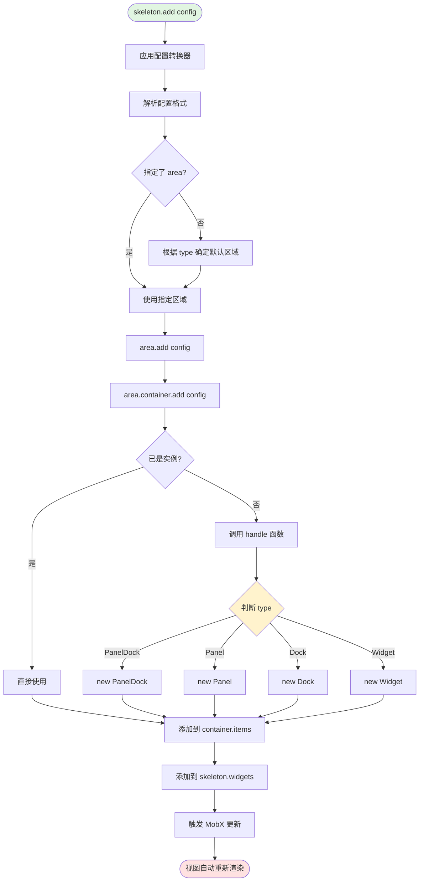
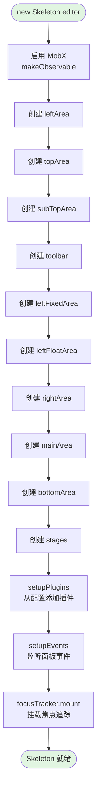
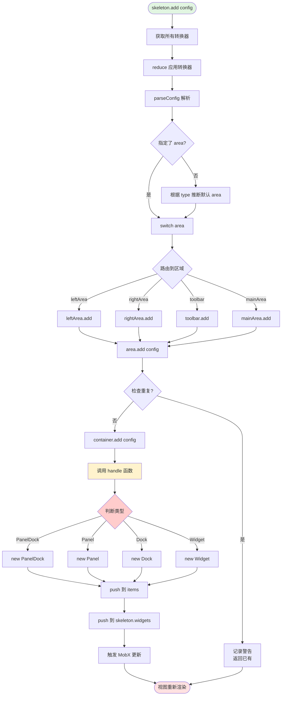
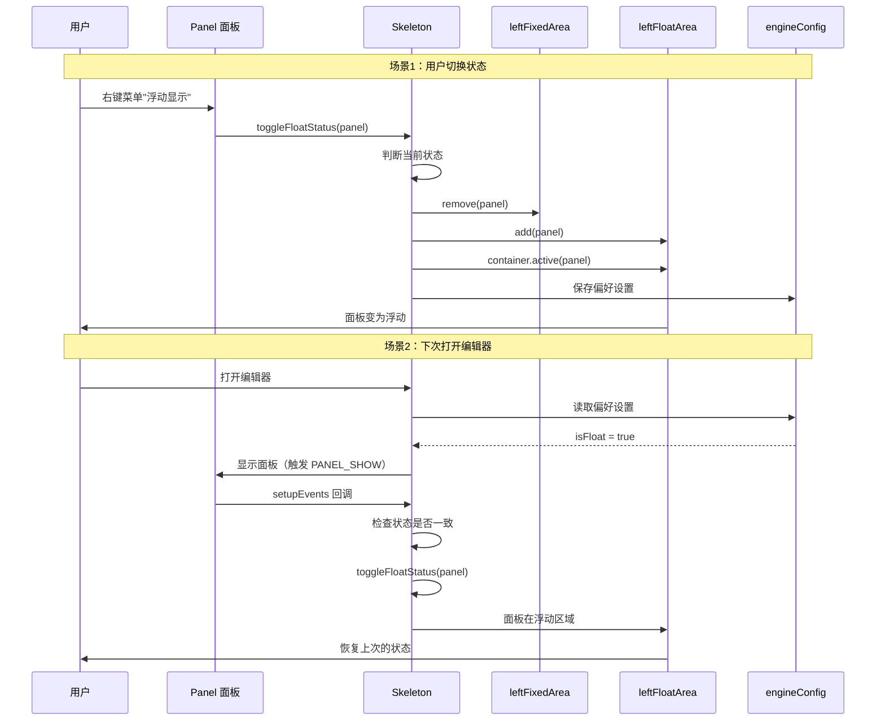
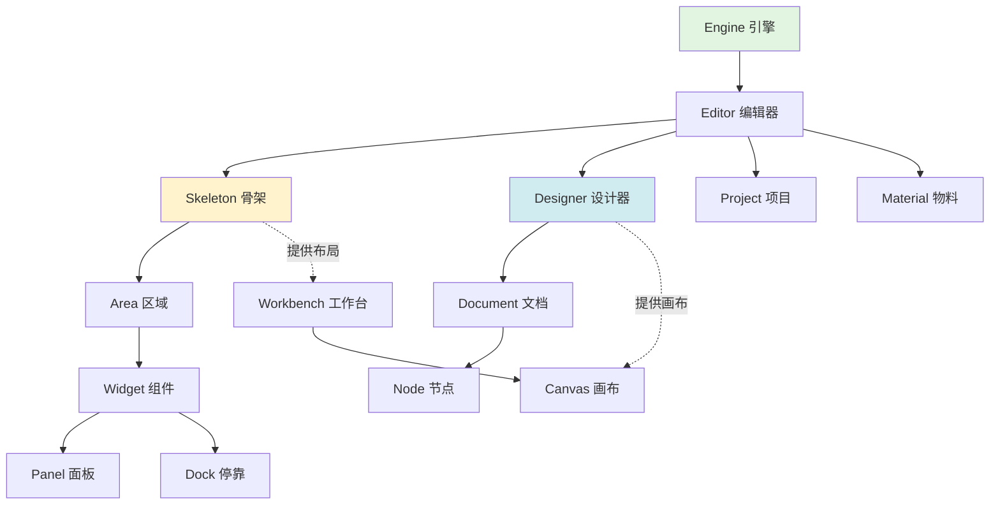

好的！我直接为你生成详细的学习笔记内容，你可以自己保存：

---

# Editor Skeleton 骨架系统详解

## 一、核心概念与定位

### 1.1 什么是 Skeleton？

**Skeleton（骨架）是低代码编辑器的布局管理系统**，类似于人体骨架支撑整个身体。

```typescript
// 类比理解：
人体骨架 = {
  头部: 顶部区域 (topArea),
  躯干: 主区域 (mainArea),
  左臂: 左侧区域 (leftArea),
  右臂: 右侧区域 (rightArea),
  腿部: 底部区域 (bottomArea)
}

// Skeleton 管理：
编辑器 = {
  topArea: [Logo, 标题, 全局操作],
  toolbar: [保存, 预览, 撤销, 重做],
  leftArea: [大纲树, 组件库, 数据源],
  mainArea: [画布],
  rightArea: [属性设置, 样式设置],
  bottomArea: [控制台, 源码查看]
}
```

### 1.2 编辑器布局结构

```
┌─────────────────────────────────────────────────────┐
│                  topArea (顶部区域)                  │
│  [Logo] [项目名称] [用户信息] [帮助]                 │
├─────────────────────────────────────────────────────┤
│                subTopArea (子顶部区域)               │
│  (可选区域，用于扩展)                                │
├─────────────────────────────────────────────────────┤
│                  toolbar (工具栏)                    │
│  [保存] [预览] | [撤销] [重做] | [设备切换]          │
├──────────┬──────────────────────────────┬───────────┤
│          │                              │           │
│ leftArea │        mainArea (主区域)      │ rightArea │
│          │                              │           │
│ ┌──────┐ │  ┌────────────────────────┐  │ ┌───────┐│
│ │大纲树│ │  │                        │  │ │属性设│││
│ │组件库│ │  │       画布区域          │  │ │样式设│││
│ │数据源│ │  │      (Canvas)          │  │ │      │││
│ └──────┘ │  │                        │  │ └───────┘│
│          │  └────────────────────────┘  │           │
│          │       stages (舞台列表)       │           │
├──────────┴──────────────────────────────┴───────────┤
│                bottomArea (底部区域)                 │
│  [控制台] [网络] [源码]                              │
└─────────────────────────────────────────────────────┘

左侧区域细分：
leftArea
├── leftFixedArea (固定面板)
└── leftFloatArea (浮动面板)
```

---

## 二、核心类剖析

### 2.1 Skeleton 类的属性全景

```typescript
class Skeleton {
  // ========== 引用属性 ==========
  editor: IEditor                    // 编辑器实例引用
  viewName: string                   // 视图名称

  // ========== 私有索引 ==========
  private panels: Map<string, Panel>           // 全局 Panel 索引
  private containers: Map<string, Container>   // 全局容器索引
  private configTransducers: Transducer[]      // 配置转换器列表

  // ========== 7个布局区域 ==========
  readonly leftArea: Area            // 左侧区域（非独占）
  readonly topArea: Area             // 顶部区域（非独占）
  readonly subTopArea: Area          // 子顶部区域（非独占）
  readonly toolbar: Area             // 工具栏（非独占）
  readonly leftFixedArea: Area       // 左侧固定面板（独占）
  readonly leftFloatArea: Area       // 左侧浮动面板（独占）
  readonly rightArea: Area           // 右侧区域（非独占）
  readonly mainArea: Area            // 主区域（独占）
  readonly bottomArea: Area          // 底部区域（独占）
  readonly stages: Area              // 舞台区域

  // ========== Widget 管理 ==========
  readonly widgets: IWidget[]        // 所有 Widget 数组
  readonly focusTracker: FocusTracker  // 焦点追踪器
}
```

### 2.2 区域（Area）的独占模式对比

| 区域          | 独占模式 | 显示方式   | 典型用途               |
| ------------- | -------- | ---------- | ---------------------- |
| leftArea      | 非独占   | 垂直堆叠   | 多个 Dock 同时显示     |
| topArea       | 非独占   | 水平排列   | Logo、标题同时显示     |
| toolbar       | 非独占   | 水平排列   | 所有按钮同时显示       |
| leftFixedArea | 独占     | 标签页切换 | 固定面板，一次一个     |
| leftFloatArea | 独占     | 标签页切换 | 浮动面板，一次一个     |
| rightArea     | 非独占   | 标签页切换 | 属性面板（通常只一个） |
| mainArea      | 独占     | 独占显示   | 画布（只显示一个）     |
| bottomArea    | 独占     | 标签页切换 | 工具面板，一次一个     |

**独占模式的实际效果：**

```typescript
// 独占模式（如 leftFixedArea）：
┌────────────────┐
│ Tab1 Tab2 Tab3 │ <- 标签页
├────────────────┤
│                │
│  Panel 1 内容  │ <- 只显示当前激活的
│                │
└────────────────┘

// 非独占模式（如 toolbar）：
┌────────────────┐
│ [保存] [预览]   │ <- 所有按钮同时显示
│ [撤销] [重做]   │
└────────────────┘
```

---

## 三、核心机制深度剖析

### 3.1 机制1：Widget 创建和添加流程



**实际场景演示：**

```typescript
// 场景：添加大纲树面板

// 步骤1：调用 add 方法
const widget = skeleton.add({
  area: 'leftArea',
  type: 'PanelDock',
  name: 'outline',
  content: OutlinePanel,
  props: {
    title: '大纲树'
  }
});

// 内部执行流程：

// 1. 应用转换器（如果有）
config = transducers.reduce((c, t) => t(c), config);

// 2. 解析配置
config = parseConfig(config);
// -> 处理特殊格式
// -> 合并属性
// -> 标记已解析

// 3. 确定区域
area = 'leftArea';  // 已指定

// 4. 路由到区域
leftArea.add(config);

// 5. 区域内处理
leftArea.container.add(config);

// 6. 调用 handle 函数
handle(config) {
  if (isWidget(config)) return config;
  return skeleton.createWidget(config);
}

// 7. 创建 Widget
createWidget(config) {
  if (isPanelDockConfig(config)) {
    return new PanelDock(skeleton, config);
  }
}

// 8. PanelDock 构造
new PanelDock(skeleton, config) {
  // 创建面板容器
  // 渲染标签页
  // 管理多个 Panel
}

// 9. 添加到容器
container.items.push(panelDock);

// 10. 添加到全局列表
skeleton.widgets.push(panelDock);

// 11. MobX 触发更新
// -> @observer 组件重新渲染
// -> 左侧区域显示大纲树面板
```

### 3.2 机制2：配置转换器（Transducer）链

**什么是 Transducer？**

```typescript
// Transducer 是一个函数，输入配置，输出新配置
type Transducer = (config: any) => any;

// 链式应用：
config1 = transducer1(原始配置);
config2 = transducer2(config1);
config3 = transducer3(config2);
最终配置 = config3;
```

**实际应用示例：**

```typescript
// 转换器1：解析函数字符串（优先级1）
function parseJSFunc(config) {
  // 输入：
  // {
  //   props: {
  //     onClick: 'function() { alert("click"); }'
  //   }
  // }

  // 输出：
  // {
  //   props: {
  //     onClick: function() { alert("click"); }  // 真实函数
  //   }
  // }
}

// 转换器2：解析属性（优先级5）
function parseProps(config) {
  // 处理条件显示、默认值等
}

// 转换器3：合并平台配置（优先级10）
function addonCombine(config) {
  // 合并平台自定义的配置
  return {
    ...config,
    ...platformConfig
  };
}

// 使用 reduce 链式应用：
const finalConfig = [parseJSFunc, parseProps, addonCombine].reduce(
  (config, transducer) => transducer(config),
  原始配置
);
```

**为什么需要转换器？**

```typescript
// 问题：组件元数据可能来自不同来源
// - 组件库提供的元数据
// - 平台定制的配置
// - 插件扩展的配置
// - 用户自定义的配置

// 解决方案：使用转换器逐步处理和合并

// 好处：
// 1. 解耦：每个转换器独立负责一项转换
// 2. 可扩展：可以动态注册新的转换器
// 3. 有序：按优先级执行，保证依赖关系
// 4. 可测试：每个转换器独立测试
```

### 3.3 机制3：面板的固定/浮动切换

**固定面板 vs 浮动面板：**

```typescript
// 固定面板（leftFixedArea）：
特点：
- 固定在左侧区域
- 不可拖拽移动
- 不可关闭
- 适合：常用的核心面板（如大纲树）

// 浮动面板（leftFloatArea）：
特点：
- 可以拖拽到任意位置
- 可以关闭
- 可以调整大小
- 适合：辅助性面板（如搜索、帮助）
```

**切换流程：**

```typescript
// 用户操作：右键点击面板标题 -> "浮动显示"

toggleFloatStatus(panel) {
  // 1. 判断当前状态
  const isFloat = panel.parent.name === 'leftFloatArea';

  if (isFloat) {
    // 当前是浮动 -> 切换到固定
    leftFloatArea.remove(panel);
    leftFixedArea.add(panel);
    leftFixedArea.container.active(panel);
  } else {
    // 当前是固定 -> 切换到浮动
    leftFixedArea.remove(panel);
    leftFloatArea.add(panel);
    leftFloatArea.container.active(panel);
  }

  // 2. 保存用户偏好
  engineConfig.getPreference().set(
    `${panel.name}-pinned-status-isFloat`,
    !isFloat,
    'skeleton'
  );
}

// 3. 下次打开编辑器
setupEvents() {
  editor.eventBus.on(PANEL_SHOW, (panelName, panel) => {
    // 读取偏好
    const savedIsFloat = engineConfig.getPreference().get(
      `${panelName}-pinned-status-isFloat`,
      'skeleton'
    );

    // 当前状态
    const currentIsFloat = panel.isChildOfFloatArea();

    // 不符，自动调整
    if (savedIsFloat !== currentIsFloat) {
      toggleFloatStatus(panel);
    }
  });
}

// 效果：
// - 用户的固定/浮动偏好会被记住
// - 下次打开编辑器自动恢复
```

### 3.4 机制4：事件系统

**事件类型：**

```typescript
enum SkeletonEvents {
  // PanelDock 事件
  PANEL_DOCK_ACTIVE = 'skeleton.panel-dock.active',      // 面板激活
  PANEL_DOCK_UNACTIVE = 'skeleton.panel-dock.unactive',  // 面板取消激活

  // Panel 事件
  PANEL_SHOW = 'skeleton.panel.show',    // 面板显示
  PANEL_HIDE = 'skeleton.panel.hide',    // 面板隐藏

  // Widget 事件
  WIDGET_SHOW = 'skeleton.widget.show',       // Widget 显示
  WIDGET_HIDE = 'skeleton.widget.hide',       // Widget 隐藏
  WIDGET_DISABLE = 'skeleton.widget.disable', // Widget 禁用
  WIDGET_ENABLE = 'skeleton.widget.enable',   // Widget 启用
}
```

**实际使用场景：**

```typescript
// 场景1：统计用户行为
skeleton.editor.on(SkeletonEvents.PANEL_SHOW, (panelName) => {
  console.log(`用户打开了${panelName}面板`);
  analytics.track('panel_show', { panelName });
});

// 场景2：联动其他面板
skeleton.editor.on(SkeletonEvents.PANEL_SHOW, (panelName) => {
  if (panelName === '属性设置') {
    // 属性设置面板打开时，关闭样式设置
    skeleton.getPanel('样式设置')?.hide();
  }
});

// 场景3：性能优化
skeleton.editor.on(SkeletonEvents.PANEL_HIDE, (panelName, panel) => {
  // 面板隐藏时，停止数据轮询
  panel.stopPolling?.();
});

// 场景4：插件响应
skeleton.editor.on(SkeletonEvents.WIDGET_DISABLE, (widgetName) => {
  if (widgetName === 'save') {
    console.log('保存功能被禁用');
  }
});
```

---

## 四、Widget 类型体系

### 4.1 Widget 类型层级

```typescript
Widget (基类)
├── Dock (停靠容器)
│   ├── PanelDock (面板停靠) ⭐ 最常用
│   └── DialogDock (对话框停靠)
├── Panel (面板) ⭐ 最常用
├── Stage (舞台/画布)
└── Divider (分割线)
```

### 4.2 各类型的特点和使用场景

#### Widget（基础类型）

```typescript
// 配置：
{
  type: 'Widget',
  name: 'logo',
  area: 'topArea',
  content: 
}

// 特点：
// - 最简单的类型
// - 可以包含任意内容
// - 没有特殊行为

// 使用场景：
// - Logo 图片
// - 文本标题
// - 简单按钮
// - 自定义内容
```

#### PanelDock（面板停靠容器）

```typescript
// 配置：
{
  type: 'PanelDock',
  name: 'leftDock',
  area: 'leftArea',
  content: [
    {
      type: 'Panel',
      name: 'outline',
      content: OutlinePanel,
      props: { title: '大纲树' }
    },
    {
      type: 'Panel',
      name: 'components',
      content: ComponentList,
      props: { title: '组件库' }
    }
  ]
}

// 特点：
// - 可以包含多个 Panel
// - 显示为标签页
// - 支持拖拽排序
// - 支持面板的显示/隐藏

// 渲染效果：
┌──────────────────────────┐
│ [大纲树] [组件库] [数据源] │ <- 标签页
├──────────────────────────┤
│                          │
│    当前面板的内容          │
│                          │
└──────────────────────────┘

// 使用场景：
// - 左侧多个面板
// - 右侧多个设置面板
// - 底部多个工具面板
```

#### Panel（面板）

```typescript
// 配置：
{
  type: 'Panel',
  name: 'settings',
  area: 'rightArea',
  content: SettingsPanel,
  props: {
    title: '属性设置',
    width: 300
  }
}

// 特点：
// - 独立的面板
// - 有标题栏
// - 可以关闭
// - 可以调整大小

// 渲染效果：
┌──────────────┐
│ 属性设置  [x] │ <- 标题栏
├──────────────┤
│              │
│  面板内容     │
│              │
└──────────────┘

// 使用场景：
// - 属性设置面板
// - 样式配置面板
// - 数据源管理面板
```

#### Divider（分割线）

```typescript
// 配置：
{
  type: 'Divider',
  name: 'divider-1',
  area: 'toolbar'
}

// 特点：
// - 视觉分隔
// - 不可交互
// - 占用很小空间

// 渲染效果：
[保存] [预览] | [撤销] [重做]
              ^ 分割线

// 使用场景：
// - 工具栏分组
// - 顶部区域分隔
```

#### Stage（舞台/画布）

```typescript
// 配置：
{
  type: 'Stage',
  name: 'stage-1',
  area: 'stages',
  content: CanvasComponent
}

// 特点：
// - 用于渲染低代码画布
// - 支持多个 Stage（多页面编辑）
// - 与 DocumentModel 关联

// 使用场景：
// - 主画布
// - 多页面编辑时的多个画布
```

---

## 五、核心方法详解

### 5.1 add 方法（最重要！）

**方法签名：**

```typescript
add(config: SkeletonConfig, extraConfig?: Record<string, any>): Widget
```

**完整执行流程：**

```typescript
// 输入：
const config = {
  area: 'leftArea',
  type: 'PanelDock',
  name: 'outline',
  content: OutlinePanel,
  props: { title: '大纲树' }
};

// 执行：
skeleton.add(config);

// 内部流程：

// 1️⃣ 获取转换器
const transducers = this.getRegisteredConfigTransducers();
// -> [parseJSFunc(优先级1), parseProps(优先级5), addonCombine(优先级10)]

// 2️⃣ 应用转换器
let parsedConfig = this.parseConfig(config);  // 基础解析
parsedConfig = parseJSFunc(parsedConfig);     // 解析函数
parsedConfig = parseProps(parsedConfig);      // 解析属性
parsedConfig = addonCombine(parsedConfig);    // 合并配置

// 3️⃣ 确定区域
let area = parsedConfig.area;  // 'leftArea'

// 4️⃣ 路由到区域
switch (area) {
  case 'leftArea':
    return this.leftArea.add(parsedConfig);
}

// 5️⃣ 区域添加
leftArea.add(parsedConfig) {
  // 检查重复
  if (container.get(config.name)) {
    logger.warn('已存在');
    return existing;
  }

  // 添加到容器
  return container.add(parsedConfig);
}

// 6️⃣ 容器处理
container.add(parsedConfig) {
  // 调用 handle 函数
  const widget = handle(parsedConfig);

  // 添加到 items
  items.push(widget);

  // 触发 MobX 更新
  return widget;
}

// 7️⃣ handle 函数执行
handle(parsedConfig) {
  if (isWidget(parsedConfig)) return parsedConfig;
  return skeleton.createWidget(parsedConfig);
}

// 8️⃣ 创建 Widget
createWidget(parsedConfig) {
  if (isPanelDockConfig(parsedConfig)) {
    const widget = new PanelDock(skeleton, parsedConfig);
    widgets.push(widget);  // 添加到全局列表
    return widget;
  }
}

// 9️⃣ 返回结果
return panelDockWidget;

// 🔟 视图更新
// MobX 检测到 leftArea.container.items 变化
// -> @observer 组件重新渲染
// -> 左侧区域显示新的 PanelDock
```

### 5.2 getPanel 和 getWidget 方法

**两者的区别：**

```typescript
// getPanel: 从全局 panels Map 获取
getPanel(name: string): Panel | undefined {
  return this.panels.get(name);
}
// 时间复杂度：O(1)
// 适用：快速查找 Panel

// getWidget: 从 widgets 数组遍历查找
getWidget(name: string): IWidget | undefined {
  return this.widgets.find(widget => widget.name === name);
}
// 时间复杂度：O(n)
// 适用：查找任意类型的 Widget
```

**为什么 Panel 用 Map，Widget 用数组？**

```typescript
// Panel 的特点：
// - 数量较少（通常几个到十几个）
// - 查找频繁（经常需要显示/隐藏面板）
// - 需要全局唯一性（不能重复）
// -> 使用 Map，O(1) 查找

// Widget 的特点：
// - 数量可能很多（按钮、分割线等）
// - 查找不频繁
// - 插入顺序重要（决定显示顺序）
// -> 使用数组，保持顺序
```

### 5.3 createContainer 方法

**为什么需要容器？**

```typescript
// Area 和 WidgetContainer 的关系：

// Area（区域）：
// - 对外的概念，用户可见
// - 提供高层 API（add、remove、show、hide）
// - 管理可见性、独占逻辑

// WidgetContainer（容器）：
// - 内部实现，用户不可见
// - 管理 Widget 列表（items）
// - 处理激活/取消激活
// - 提供底层操作

// 为什么要分离？
// 1. 职责分离：Area 管理业务逻辑，Container 管理数据
// 2. 复用性：Container 可以独立使用
// 3. 可测试：Container 易于单元测试
```

**实际创建流程：**

```typescript
// 在 Area 构造函数中：
constructor(skeleton, name, handle, exclusive) {
  // 创建容器
  this.container = skeleton.createContainer(
    name,
    handle,
    exclusive,
    () => this.visible,  // 可见性 getter
    defaultSetCurrent
  );
}

// skeleton.createContainer 实现：
createContainer(name, handle, exclusive, checkVisible, defaultSetCurrent) {
  // 创建容器实例
  const container = new WidgetContainer(
    name,
    handle,
    exclusive,
    checkVisible,
    defaultSetCurrent
  );

  // 添加到全局索引
  this.containers.set(name, container);

  return container;
}

// 结果：
// - 每个 Area 有一个 WidgetContainer
// - 所有容器都在 skeleton.containers 中索引
// - 可以通过 name 快速查找容器
```

---

## 六、实战场景深度解析

### 场景1：初始化编辑器布局

```typescript
// 步骤1：创建 Skeleton
const skeleton = new Skeleton(editor);

// 步骤2：添加左侧面板
skeleton.add({
  area: 'leftArea',
  type: 'PanelDock',
  name: 'leftDock',
  content: [
    {
      type: 'Panel',
      name: 'outline',
      content: OutlineTree,
      props: { title: '大纲树', icon: 'tree' }
    },
    {
      type: 'Panel',
      name: 'components',
      content: ComponentList,
      props: { title: '组件库', icon: 'components' }
    },
    {
      type: 'Panel',
      name: 'datasource',
      content: DataSourcePanel,
      props: { title: '数据源', icon: 'database' }
    }
  ]
});

// 渲染效果：
┌────────────────────────────┐
│ 🌲大纲树 📦组件库 💾数据源  │ <- 标签页
├────────────────────────────┤
│                            │
│     大纲树内容              │ <- 默认显示第一个
│                            │
└────────────────────────────┘

// 步骤3：添加右侧面板
skeleton.add({
  area: 'rightArea',
  type: 'Panel',
  name: 'setter',
  content: PropertySetter,
  props: { title: '属性设置' }
});

// 步骤4：添加工具栏
skeleton.add({
  area: 'toolbar',
  type: 'Widget',
  name: 'save',
  content: <Button icon="save">保存</Button>
});

skeleton.add({
  area: 'toolbar',
  type: 'Divider',
  name: 'divider-1'
});

skeleton.add({
  area: 'toolbar',
  type: 'Widget',
  name: 'preview',
  content: <Button icon="preview">预览</Button>
});

// 工具栏效果：
[💾保存] [👁️预览] | [↶撤销] [↷重做]

// 步骤5：渲染编辑器
<Workbench skeleton={skeleton} />
```

### 场景2：动态添加和移除面板

```typescript
// 场景：根据用户权限动态显示功能

// 普通用户：只显示基础面板
skeleton.add({
  area: 'leftArea',
  type: 'Panel',
  name: 'outline',
  content: OutlineTree
});

// 管理员用户：额外显示高级功能
if (user.isAdmin) {
  skeleton.add({
    area: 'leftArea',
    type: 'Panel',
    name: 'advanced',
    content: AdvancedPanel,
    props: { title: '高级功能' }
  });

  skeleton.add({
    area: 'bottomArea',
    type: 'Panel',
    name: 'logs',
    content: LogsPanel,
    props: { title: '系统日志' }
  });
}

// 用户登出时移除
function onLogout() {
  skeleton.leftArea.remove('advanced');
  skeleton.bottomArea.remove('logs');
}
```

### 场景3：从配置文件构建布局

```typescript
// 配置文件（JSON）
const editorConfig = {
  plugins: {
    leftArea: [
      {
        pluginKey: 'outline',
        type: 'TabPanel',
        props: { title: '大纲树' }
      }
    ],
    toolbar: [
      {
        pluginKey: 'save',
        type: 'Widget',
        props: { icon: 'save' }
      },
      {
        pluginKey: 'preview',
        type: 'Widget',
        props: { icon: 'preview' }
      }
    ]
  }
};

// 组件映射
const components = {
  outline: OutlineTree,
  save: SaveButton,
  preview: PreviewButton
};

// 批量构建
skeleton.buildFromConfig(editorConfig, components);

// 效果：
// - 自动添加所有配置的面板和按钮
// - 类型自动转换（TabPanel -> Panel）
// - 组件自动匹配（pluginKey -> components[pluginKey]）
```

---

## 七、核心数据结构

### 7.1 panels Map 的作用

```typescript
// 全局 Panel 索引
private panels = new Map<string, Panel>();

// 使用场景1：快速查找
const panel = skeleton.getPanel('outline');
// O(1) 时间复杂度

// 使用场景2：去重
createPanel(config) {
  if (this.panels.has(config.name)) {
    throw new Error(`Panel ${config.name} 已存在`);
  }
  const panel = new Panel(this, config);
  this.panels.set(panel.name, panel);  // 添加索引
  return panel;
}

// 使用场景3：跨区域访问
// 不需要知道 Panel 在哪个区域，直接获取
const settingsPanel = skeleton.getPanel('settings');
// 可能在 rightArea、leftArea 或其他任何地方
```

### 7.2 widgets 数组的作用

```typescript
// 全局 Widget 列表
readonly widgets: IWidget[] = [];

// 使用场景1：遍历所有 Widget
skeleton.widgets.forEach(widget => {
  console.log(widget.name);
});

// 使用场景2：统计
const totalWidgets = skeleton.widgets.length;
const visibleWidgets = skeleton.widgets.filter(w => w.visible).length;

// 使用场景3：批量操作
skeleton.widgets.forEach(widget => {
  if (widget.name.startsWith('debug-')) {
    widget.hide();  // 隐藏所有调试 Widget
  }
});
```

### 7.3 configTransducers 数组的作用

```typescript
// 配置转换器列表
private configTransducers: Transducer[] = [];

// 注册转换器：
skeleton.registerConfigTransducer(myTransducer, 50);

// 内部排序：
// [
//   { fn: parseJSFunc, level: 1 },
//   { fn: parseProps, level: 5 },
//   { fn: myTransducer, level: 50 },
//   { fn: addonCombine, level: 10 }
// ]
//
// 排序后：
// [
//   { fn: parseJSFunc, level: 1 },    <- 最先执行
//   { fn: parseProps, level: 5 },
//   { fn: addonCombine, level: 10 },
//   { fn: myTransducer, level: 50 }   <- 最后执行
// ]

// 应用时：
config = transducers.reduce((c, t) => t(c), config);
// 相当于：
config = myTransducer(addonCombine(parseProps(parseJSFunc(config))));
```

---

## 八、设计亮点和注意事项

### 8.1 设计亮点

#### ✨ 亮点1：响应式架构（MobX）

```typescript
// 自动更新，无需手动刷新

// 场景：添加 Widget
skeleton.add({...});
// -> container.items 变化（MobX observable）
// -> @observer 组件自动重新渲染
// -> 新 Widget 立即显示

// 好处：
// - 代码简洁（不需要 setState）
// - 自动优化（批量更新）
// - 易于维护（声明式）
```

#### ✨ 亮点2：区域别名支持

```typescript
// 支持多种写法，用户友好

skeleton.add({ area: 'left', ... });      // ✅
skeleton.add({ area: 'leftArea', ... });  // ✅
skeleton.add({ area: 'main', ... });      // ✅
skeleton.add({ area: 'mainArea', ... });  // ✅
skeleton.add({ area: 'center', ... });    // ✅

// 好处：
// - 降低记忆成本
// - 兼容不同的命名习惯
// - 向后兼容旧版本
```

#### ✨ 亮点3：配置转换器机制

```typescript
// 可扩展的配置处理

// 平台可以注册自己的转换器
skeleton.registerConfigTransducer((config) => {
  // 添加平台特有的配置
  return { ...config, platform: 'myPlatform' };
}, 20);

// 插件也可以注册转换器
skeleton.registerConfigTransducer((config) => {
  // 修改配置
  return { ...config, enhanced: true };
}, 30);

// 好处：
// - 高度可扩展
// - 不侵入核心代码
// - 职责分离
```

#### ✨ 亮点4：默认区域智能推断

```typescript
// 不需要每次都指定 area

// 自动推断：
skeleton.add({ type: 'Panel', name: 'custom', ... });
// -> 默认添加到 leftFloatArea

skeleton.add({ type: 'Widget', name: 'button', ... });
// -> 默认添加到 mainArea

// 好处：
// - 减少配置代码
// - 符合使用习惯
// - 降低出错概率
```

### 8.2 注意事项

#### ⚠️ 注意1：Widget name 必须全局唯一

```typescript
// ❌ 错误：重复的 name
skeleton.add({ area: 'leftArea', name: 'outline', ... });
skeleton.add({ area: 'rightArea', name: 'outline', ... });
// 第二次会失败，输出警告

// ✅ 正确：使用唯一的 name
skeleton.add({ area: 'leftArea', name: 'left-outline', ... });
skeleton.add({ area: 'rightArea', name: 'right-outline', ... });
```

#### ⚠️ 注意2：独占模式下需要手动激活

```typescript
// 独占区域（如 leftFixedArea）

// 添加多个面板
leftFixedArea.add({ name: 'panel1', ... });
leftFixedArea.add({ name: 'panel2', ... });
leftFixedArea.add({ name: 'panel3', ... });

// 默认情况：没有面板显示（current = null）
// 需要手动激活：
leftFixedArea.container.active('panel1');

// 或者在构造 Area 时设置 defaultSetCurrent = true
new Area(skeleton, 'leftFixedArea', handle, true, true);
//                                              ^^   ^^
//                                         exclusive  defaultSetCurrent
```

#### ⚠️ 注意3：转换器的优先级很重要

```typescript
// 错误示例：优先级设置不当

// 转换器A：需要函数已被解析
function useFunction(config) {
  config.onClick();  // 调用函数
  return config;
}

// 转换器B：解析函数字符串
function parseFunc(config) {
  config.onClick = eval(config.onClick);
  return config;
}

// ❌ 错误顺序：
skeleton.registerConfigTransducer(useFunction, 1);
skeleton.registerConfigTransducer(parseFunc, 5);
// 结果：useFunction 先执行，此时 onClick 还是字符串，报错！

// ✅ 正确顺序：
skeleton.registerConfigTransducer(parseFunc, 1);      // 先解析
skeleton.registerConfigTransducer(useFunction, 5);    // 再使用
```

#### ⚠️ 注意4：MobX 响应式的限制

```typescript
// 注意：只有用 @obx 标记的属性才是响应式的

// ❌ 不会触发更新：
skeleton.widgets.push(newWidget);
// widgets 是普通数组，push 不会触发更新

// ✅ 会触发更新：
skeleton.leftArea.container.items.push(newWidget);
// container.items 是 @obx 数组

// 正确做法：
skeleton.add({...});  // 使用 add 方法，内部会正确处理
```

---

## 九、核心流程图

### 9.1 Skeleton 初始化流程



### 9.2 add 方法完整流程



### 9.3 面板固定/浮动切换流程



---

## 十、关键知识点总结

### 10.1 必须掌握的概念

| 概念                      | 说明                       | 重要性     |
| ------------------------- | -------------------------- | ---------- |
| **Skeleton**        | 骨架管理器，管理整个布局   | ⭐⭐⭐⭐⭐ |
| **Area**            | 区域，布局的一个区块       | ⭐⭐⭐⭐⭐ |
| **Widget**          | 组件，区域内的内容单元     | ⭐⭐⭐⭐⭐ |
| **Panel**           | 面板，特殊的 Widget        | ⭐⭐⭐⭐   |
| **PanelDock**       | 面板容器，包含多个 Panel   | ⭐⭐⭐⭐   |
| **WidgetContainer** | 内部容器，管理 Widget 列表 | ⭐⭐⭐     |
| **独占模式**        | exclusive，同时只显示一个  | ⭐⭐⭐⭐   |
| **Transducer**      | 配置转换器，预处理配置     | ⭐⭐⭐     |

### 10.2 使用频率排序

```typescript
// 最常用的方法：
1. skeleton.add()              // 添加 Widget
2. skeleton.getPanel()         // 获取面板
3. area.show() / area.hide()   // 显示/隐藏区域

// 常用的方法：
4. skeleton.getWidget()        // 获取 Widget
5. panel.show() / panel.hide() // 显示/隐藏面板
6. area.remove()               // 移除 Widget

// 不常用的方法：
7. skeleton.createStage()      // 创建舞台
8. skeleton.toggleFloatStatus()  // 切换浮动状态
9. skeleton.registerConfigTransducer()  // 注册转换器
```

### 10.3 最佳实践

#### ✅ 实践1：合理使用默认区域

```typescript
// ✅ 推荐：利用默认规则
skeleton.add({
  type: 'Panel',
  name: 'custom',
  content: MyPanel
});
// 自动添加到 leftFloatArea

// ❌ 不推荐：每次都明确指定
skeleton.add({
  area: 'leftFloatArea',
  type: 'Panel',
  name: 'custom',
  content: MyPanel
});
// 冗余
```

#### ✅ 实践2：使用类型守卫

```typescript
// ✅ 推荐：使用类型守卫
if (isPanelDockConfig(config)) {
  // TypeScript 知道 config 的类型
  config.content  // ✅ 类型安全
}

// ❌ 不推荐：手动判断
if (config.type === 'PanelDock') {
  // TypeScript 不知道类型
  config.content  // ❌ 可能报错
}
```

#### ✅ 实践3：监听事件而不是轮询

```typescript
// ✅ 推荐：事件驱动
skeleton.editor.on(SkeletonEvents.PANEL_SHOW, (name) => {
  console.log(`${name} 面板显示了`);
});

// ❌ 不推荐：轮询检查
setInterval(() => {
  const panel = skeleton.getPanel('outline');
  if (panel?.visible) {
    console.log('面板显示了');
  }
}, 100);
```

---

## 十一、完整示例：构建一个编辑器

```typescript
import { Skeleton, Workbench } from '@alilc/lowcode-editor-skeleton';

// 1. 创建 Skeleton
const skeleton = new Skeleton(editor);

// 2. 添加顶部Logo和标题
skeleton.add({
  area: 'topArea',
  type: 'Widget',
  name: 'logo',
  props: { align: 'left' },
  content: 
});

skeleton.add({
  area: 'topArea',
  type: 'Widget',
  name: 'title',
  props: { align: 'left' },
  content: <h1>低代码编辑器</h1>
});

// 3. 添加工具栏
skeleton.add({
  area: 'toolbar',
  type: 'Widget',
  name: 'save',
  content: <Button onClick={handleSave}>保存</Button>
});

skeleton.add({
  area: 'toolbar',
  type: 'Divider',
  name: 'divider-1'
});

skeleton.add({
  area: 'toolbar',
  type: 'Widget',
  name: 'preview',
  content: <Button onClick={handlePreview}>预览</Button>
});

// 4. 添加左侧面板
skeleton.add({
  area: 'leftArea',
  type: 'PanelDock',
  name: 'leftDock',
  content: [
    {
      type: 'Panel',
      name: 'outline',
      content: OutlineTree,
      props: {
        title: '大纲树',
        icon: 'tree'
      }
    },
    {
      type: 'Panel',
      name: 'components',
      content: ComponentList,
      props: {
        title: '组件库',
        icon: 'components'
      }
    }
  ]
});

// 5. 添加右侧属性面板
skeleton.add({
  area: 'rightArea',
  type: 'Panel',
  name: 'setter',
  content: PropertySetter,
  props: {
    title: '属性设置',
    width: 300
  }
});

// 6. 添加底部控制台
skeleton.add({
  area: 'bottomArea',
  type: 'Panel',
  name: 'console',
  content: Console,
  props: {
    title: '控制台',
    height: 200
  }
});

// 7. 渲染编辑器
ReactDOM.render(
  <Workbench skeleton={skeleton} />,
  document.getElementById('root')
);
```

---

## 十二、与其他模块的协作

### 12.1 Skeleton 在引擎中的位置



### 12.2 典型的协作流程

```typescript
// 场景：用户在组件库面板中拖拽组件到画布

// 1. 组件库面板（由 Skeleton 管理）
const componentsPanel = skeleton.getPanel('components');

// 2. 用户拖拽组件
componentsPanel.onDragStart = (component) => {
  // 3. 通知设计器开始拖拽
  designer.dragon.boost(component, 'copy');

  // 4. 设计器处理拖拽逻辑
  designer.dragon.onDrop = (dropLocation) => {
    // 5. 在画布中添加节点
    const node = designer.currentDocument.createNode(component);
    designer.currentDocument.insertNode(dropLocation, node);

    // 6. 节点添加成功
    // 7. 画布自动重新渲染
    // 8. 属性面板自动更新（如果打开）
    const setterPanel = skeleton.getPanel('setter');
    setterPanel?.setTarget(node);
  };
};
```

---

## 十三、深入理解的关键问题

### Q1: 为什么 leftArea 是非独占，但 leftFixedArea 是独占？

```typescript
// leftArea（非独占）：
// - 可以包含多个 Dock
// - 每个 Dock 是独立的容器
// - Dock 内部通过标签页切换面板

┌─────────────────┐
│ Dock1:          │
│ [Tab1] [Tab2]   │
│ Panel内容       │
├─────────────────┤
│ Dock2:          │
│ [Tab3] [Tab4]   │
│ Panel内容       │
└─────────────────┘

// leftFixedArea（独占）：
// - 只能显示一个 Panel
// - 不需要 Dock 容器
// - 直接通过标签页切换

┌─────────────────┐
│[Tab1][Tab2][Tab3]│
├─────────────────┤
│  Panel1 内容     │
└─────────────────┘
```

### Q2: 为什么需要 panels Map 和 widgets 数组两个索引？

```typescript
// panels Map：
// - 只包含 Panel 类型
// - 使用 Map 实现 O(1) 查找
// - Panel 查找频繁（显示/隐藏操作）

// widgets 数组：
// - 包含所有类型（Panel、Dock、Widget 等）
// - 使用数组保持顺序
// - 顺序影响渲染顺序（工具栏按钮从左到右）

// 实际使用：
skeleton.getPanel('outline');   // 从 panels Map 查找，快速
skeleton.getWidget('save');     // 从 widgets 数组查找，完整
```

### Q3: configTransducers 什么时候执行？

```typescript
// 执行时机：add() 方法中

add(config) {
  // 第一步就应用所有转换器
  const transducers = this.getRegisteredConfigTransducers();
  const parsedConfig = transducers.reduce((c, t) => t(c), config);

  // 后续使用 parsedConfig
  // ...
}

// 也就是说：
// - 每次 add() 都会应用
// - 不是在注册时应用
// - 确保动态注册的转换器也能生效
```

---

## 十四、扩展和定制

### 14.1 自定义区域

```typescript
// 虽然 Skeleton 提供了7个标准区域
// 但你可以通过扩展实现自定义区域

class CustomSkeleton extends Skeleton {
  readonly customArea: Area;

  constructor(editor: IEditor) {
    super(editor);

    // 添加自定义区域
    this.customArea = new Area(
      this,
      'customArea',
      (config) => this.createWidget(config),
      false
    );
  }
}
```

### 14.2 自定义 Widget 类型

```typescript
// 创建自己的 Widget 类型

class CustomWidget extends Widget {
  // 自定义行为
  customMethod() {
    console.log('自定义方法');
  }
}

// 在转换器中创建
skeleton.registerConfigTransducer((config) => {
  if (config.type === 'Custom') {
    return new CustomWidget(skeleton, config);
  }
  return config;
}, 1);

// 使用
skeleton.add({
  type: 'Custom',
  name: 'my-widget',
  area: 'leftArea'
});
```

---

## 十五、性能优化技巧

### 15.1 减少不必要的渲染

```typescript
// 技巧1：批量添加时暂停渲染
skeleton.stopAutoRepaintNode?.();  // 暂停自动重绘

for (let i = 0; i < 100; i++) {
  skeleton.add({ ... });  // 批量添加
}

skeleton.enableAutoRepaintNode?.();  // 恢复自动重绘

// 技巧2：使用 MobX action
import { runInAction } from 'mobx';

runInAction(() => {
  skeleton.add({...});
  skeleton.add({...});
  skeleton.add({...});
});
...

Let me reevaluate and take a different approach.
```
