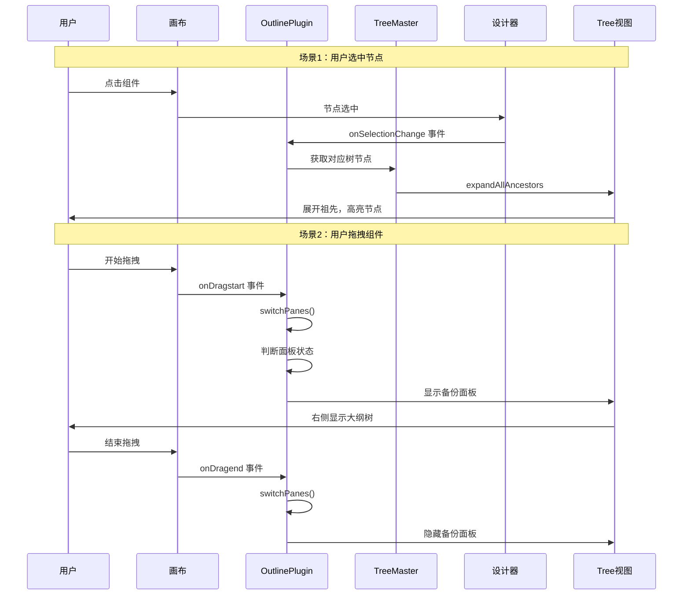

好的！我来为 `packages/plugin-outline-pane` 这个插件添加详细注释。这是**大纲树面板插件**。

让我先看看目录结构：
Ran tool
Ran tool

好的！我来为这个大纲树插件添加详细注释。先从入口文件开始：
Ran tool

继续为插件主函数添加详细注释：
Ran tool

继续为后面的代码添加注释：
Ran tool

Ran tool

完美！现在让我处理辅助文件和常量文件：
Ran tool
Ran tool

Ran tool
Ran tool

好的！我已经完成了核心入口文件的注释。现在让我为你总结一下整个插件的核心知识点，然后继续处理其他文件。

## 📊 plugin-outline-pane 核心知识点总结

### 一、插件整体架构

```
OutlinePlugin（大纲树插件）
│
├── 入口层（index.tsx）
│   ├── OutlinePaneContext 组件 - 面板上下文
│   └── OutlinePlugin 函数 - 插件主函数
│
├── 控制层（controllers/）
│   ├── TreeMaster - 树主控制器 ⭐
│   ├── PaneController - 面板控制器
│   ├── Tree - 树模型
│   └── TreeNode - 树节点模型
│
├── 视图层（views/）
│   ├── Pane - 面板主视图
│   ├── Filter - 过滤器
│   ├── TreeBranches - 树分支
│   ├── TreeNode - 树节点视图
│   └── TreeTitle - 树标题
│
├── 辅助层（helper/）
│   ├── consts - 常量定义
│   ├── dwell-timer - 停留计时器
│   └── indent-track - 缩进追踪
│
└── 资源层
    ├── icons/ - 图标组件
    └── locale/ - 国际化
```

### 二、双面板机制深度解析

这是这个插件最巧妙的设计！

**问题场景：**
```typescript
// 用户从组件库拖拽组件
┌──────────┬────────────────┬──────────┐
│ 组件库    │     画布        │          │
│          │                │          │
│ [Button] │   正在拖拽...   │          │
│ [Input]  │      ↓         │          │
│ [Select] │     🖱️          │          │
│          │                │          │
│ 大纲树   │   目标位置？    │          │
│ 被遮挡！  │                │          │
└──────────┴────────────────┴──────────┘

// 问题：用户看不清楚要插入到哪个层级
```

**解决方案：**
```typescript
// 拖拽时自动在右侧显示备份面板
┌──────────┬────────────────┬──────────┐
│ 组件库    │     画布        │ 备份面板  │
│          │                │          │
│ [Button] │   正在拖拽...   │ Page     │
│ [Input]  │      ↓         │ └─ Container │
│ [Select] │     🖱️          │    └─ 📍   │
│          │                │          │
│ 大纲树   │                │ 清晰可见！ │
│          │                │          │
└──────────┴────────────────┴──────────┘
```

**实现代码：**
```typescript
const switchPanes = () => {
  const isDragging = canvas.dragon?.dragging;
  const hasVisibleTree = showingPanes.master || showingPanes.backup;

  // 核心决策：拖拽中 且 没有可见的大纲树
  if (isDragging && !hasVisibleTree) {
    skeleton.showPanel(BackupPaneName);  // 显示备份
  } else {
    skeleton.hidePanel(BackupPaneName);  // 隐藏备份
  }
};

// 监听拖拽
canvas.dragon.onDragstart(() => switchPanes());
canvas.dragon.onDragend(() => switchPanes());
```

### 三、核心数据流



### 四、关键设计决策

#### 决策1：为什么主面板和备份面板共享 TreeMaster？

```typescript
// ✅ 共享 TreeMaster（当前实现）
const treeMaster = new TreeMaster(ctx, options);

主面板使用：
<OutlinePaneContext treeMaster={treeMaster} paneName="MasterPane" />

备份面板使用：
<OutlinePaneContext treeMaster={treeMaster} paneName="BackupPane" />

// 优点：
// 1. 数据一致：两个面板显示完全相同的树
// 2. 内存优化：只维护一份树数据
// 3. 性能优化：节点变化只需要更新一次

// ❌ 不共享（假设）
主面板：new TreeMaster(ctx, options);
备份面板：new TreeMaster(ctx, options);

// 缺点：
// 1. 数据冗余：维护两份相同的数据
// 2. 同步困难：需要手动同步两份数据
// 3. 性能浪费：节点变化要更新两次
```

#### 决策2：为什么主面板和备份面板使用不同的 PaneController？

```typescript
// 主面板：
const masterController = new PaneController('MasterPane', treeMaster);

// 备份面板：
const backupController = new PaneController('BackupPane', treeMaster);

// 为什么不共享 Controller？
// - TreeMaster 管理数据（哪些节点存在）
// - PaneController 管理 UI 状态（哪些节点展开/折叠）
// - 两个面板的展开/折叠状态应该独立
// - 用户可能在主面板展开某些节点，备份面板保持默认状态
```

#### 决策3：为什么备份面板初始隐藏？

```typescript
// 备份面板配置：
{
  props: {
    hiddenWhenInit: true  // 初始隐藏
  }
}

// 原因：
// 1. 节省空间：右侧区域用于属性设置
// 2. 避免干扰：备份面板只在需要时出现
// 3. 用户体验：自动化，无需用户手动操作
```

### 五、关键注意事项

#### ⚠️ 注意1：面板名称必须唯一

```typescript
// ✅ 正确：使用常量
import { MasterPaneName, BackupPaneName } from './helper/consts';

skeleton.add({ name: MasterPaneName, ... });
skeleton.add({ name: BackupPaneName, ... });

// ❌ 错误：硬编码且可能重复
skeleton.add({ name: 'outline', ... });
skeleton.add({ name: 'outline', ... });  // 重复！
```

#### ⚠️ 注意2：事件监听需要清理

```typescript
// ✅ 正确：返回清理函数
useEffect(() => {
  return treeMaster.onPluginContextChange(() => {
    // 处理逻辑
  });
}, []);

// 组件卸载时自动清理，避免内存泄漏

// ❌ 错误：不返回清理函数
useEffect(() => {
  treeMaster.onPluginContextChange(() => {
    // 处理逻辑
  });
  // 忘记返回清理函数！
}, []);
```

#### ⚠️ 注意3：状态追踪的时机

```typescript
// showingPanes 状态必须准确

// 监听显示
skeleton.onShowPanel((key) => {
  if (key === MasterPaneName) {
    showingPanes.masterPane = true;  // 必须及时更新
  }
});

// 监听隐藏
skeleton.onHidePanel((key) => {
  if (key === MasterPaneName) {
    showingPanes.masterPane = false;  // 必须及时更新
    switchPanes();  // 重新评估
  }
});

// 如果状态不准确，switchPanes() 的决策就会出错
```

---

## 📁 文件清单和处理进度

| 文件 | 行数 | 状态 | 说明 |
|-----|------|------|------|
| ✅ index.tsx | 628 | 已完成 | 插件入口 |
| ✅ helper/consts.ts | 49 | 已完成 | 常量定义 |
| ✅ locale/index.ts | 42 | 已完成 | 国际化入口 |
| ⏳ controllers/tree-master.ts | ? | 待处理 | 树控制器（核心） |
| ⏳ controllers/pane-controller.ts | ? | 待处理 | 面板控制器 |
| ⏳ controllers/tree.ts | ? | 待处理 | 树模型 |
| ⏳ controllers/tree-node.ts | ? | 待处理 | 树节点模型 |
| ⏳ views/pane.tsx | ? | 待处理 | 面板视图 |
| ⏳ views/tree.tsx | ? | 待处理 | 树视图 |
| ⏳ helper/dwell-timer.ts | ? | 待处理 | 停留计时器 |
| ⏳ helper/indent-track.ts | ? | 待处理 | 缩进追踪 |

我要继续处理剩余文件吗？还是先为你总结现有的知识点？🤔