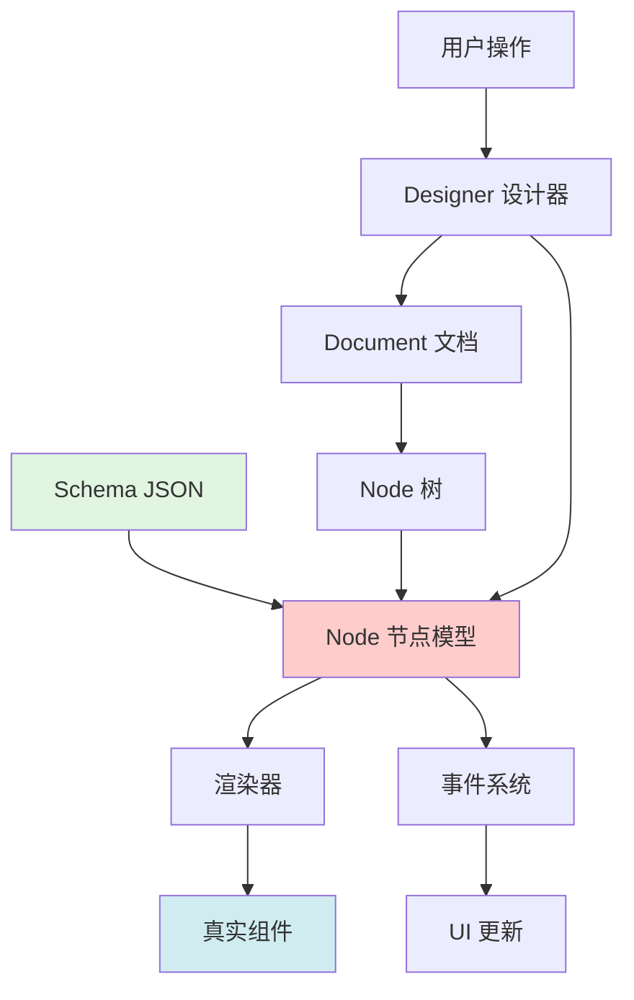
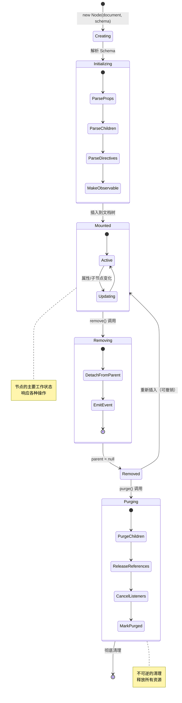

# Designer 模块 - Node 核心类深度解析

## 一、Node 的核心地位

### 1.1 在引擎中的位置



### 1.2 Node 是什么？

```typescript
// Node 是低代码页面的运行时数据模型

// Schema（静态数据）：
const schema = {
  componentName: 'Button',
  props: { type: 'primary' },
  children: 'Click Me'
};

// Node（运行时对象）：
const node = new Node(document, schema);
node.componentName  // 'Button'
node.props         // Props 对象（可观察）
node.children      // NodeChildren 对象
node.parent        // 父节点引用
node.document      // 文档引用
node.setPropValue('type', 'default')  // 可操作
```

---

## 二、Node 的核心属性全景

### 2.1 属性分类

```typescript
class Node {
  // ========== 标识属性 ==========
  readonly isNode = true          // 类型标识
  readonly id: string             // 唯一ID
  readonly componentName: string  // 组件名

  // ========== 关系属性 ==========
  readonly document: IDocumentModel  // 所属文档
  private parent: INode | null       // 父节点
  readonly children: NodeChildren    // 子节点集合
  slots: INode[]                     // 插槽节点数组

  // ========== 数据属性 ==========
  readonly props: Props              // 属性集合
  private _schema: Schema            // 原始 Schema

  // ========== 状态属性 ==========
  @obx private _visible = true       // 可见性
  @obx private _isLocked = false     // 锁定状态
  private _conditionGroup            // 条件组
  private slotFor: Prop              // 插槽宿主

  // ========== 元数据属性 ==========
  readonly componentMeta: ComponentMeta  // 组件元数据
  readonly settingEntry: SettingEntry    // 设置入口

  // ========== 清理状态 ==========
  private _purging = false           // 正在清理
  private _purged = false            // 已清理
}
```

### 2.2 核心属性详解

#### 属性1：id（节点唯一标识）

```typescript
// ID 的生命周期

// 1️⃣ 创建时生成
const node = new Node(document, schema);
console.log(node.id);  // 'node_k5j2n3'

// 2️⃣ 保存到 Schema
const schema = node.export();
console.log(schema.id);  // 'node_k5j2n3'

// 3️⃣ 下次打开时恢复
const node2 = new Node(document, schema);
console.log(node2.id);  // 'node_k5j2n3'（相同）

// 用途：
// ✅ 引用其他节点：ref="node_k5j2n3"
// ✅ 事件中标识：node.id
// ✅ 历史记录中定位：history.getNodeById(id)
// ✅ 大纲树中的 key：key={node.id}
```

#### 属性2：parent（父节点引用）

```typescript
// 父子关系的维护

// 问题：如何维护双向引用？
// - child.parent -> parent
// - parent.children -> [child]

// 设置父节点时：
child.internalSetParent(newParent);
// 内部会：
// 1. 从旧父节点移除
// 2. 添加到新父节点
// 3. 更新 parent 引用
// 4. 更新 children 数组
// 5. 发送事件

// 为什么需要 internalSetParent？
// - 外部不应该直接设置 parent
// - 必须通过插入/移动方法
// - 保证数据一致性
```

#### 属性3：props（属性集合）

```typescript
// Props 是特殊的对象

// 不是普通对象：
node.props !== { type: 'primary' }

// 是 Props 类的实例：
node.props instanceof Props  // true

// Props 的特点：
// 1. 响应式：使用 MobX @obx
// 2. 路径访问：get('style.color')
// 3. 类型转换：getAsString(), getAsNumber()
// 4. 事件发送：setValue() 时发送事件

// 示例：
node.props.get('type')  // Prop 对象
node.props.get('type').getValue()  // 'primary'
node.props.get('type').setValue('default')  // 设置并触发事件
```

#### 属性4：children（子节点集合）

```typescript
// NodeChildren 是特殊的类数组对象

// 不是普通数组：
node.children !== [child1, child2]

// 是 NodeChildren 类的实例：
node.children instanceof NodeChildren  // true

// NodeChildren 的特点：
// 1. 类数组：有 length, get(i), forEach 等
// 2. 响应式：使用 MobX @obx.shallow
// 3. 智能过滤：自动过滤空节点
// 4. 事件发送：变化时发送事件

// 示例：
node.children.length  // 子节点数量
node.children.get(0)  // 第一个子节点
node.children.insertAt(buttonNode, 1)  // 插入到索引1
node.children.delete(buttonNode)  // 删除子节点
```

---

## 三、Node 的隐藏知识点

### 知识点1：ExtraProp 机制

**什么是 ExtraProp？**

```typescript
// ExtraProp（额外属性）：
// - 存储临时数据
// - 不污染 Schema
// - 不会被导出

// 使用场景：
// 1. 编辑器临时数据
node.getExtraProp('title', true).setValue('自定义标题');

// 2. 插件私有数据
node.getExtraProp('myPlugin_data', true).setValue({ ... });

// 3. UI 状态
node.getExtraProp('expanded', true).setValue(true);

// 导出 Schema 时：
const schema = node.export();
// ExtraProp 不会出现在 schema 中！
```

**为什么需要 ExtraProp？**

```typescript
// ❌ 如果直接存在 props 中：
node.setPropValue('_editorExpanded', true);

// 问题：
// 1. 污染 props
// 2. 会导出到 Schema
// 3. 渲染器会收到这个属性
// 4. 可能影响组件行为

// ✅ 使用 ExtraProp：
node.getExtraProp('expanded', true).setValue(true);

// 好处：
// ✅ 不污染 props
// ✅ 不导出到 Schema
// ✅ 渲染器看不到
// ✅ 只在编辑器使用
```

### 知识点2：internalToShellNode 转换机制

**内部节点 vs Shell 节点：**

```typescript
// 内部节点（Node）：
class Node {
  // 完整的私有属性和方法
  private _visible: boolean;
  private parent: INode;
  private emitter: IEventBus;

  // 内部方法
  internalSetParent()
  internalPurgeStart()

  // 完整功能
}

// Shell 节点（公开接口）：
interface IPublicModelNode {
  // 只暴露公开方法
  visible: boolean;          // 封装后的访问
  parent: IPublicModelNode;  // 转换后的类型

  // 公开方法
  setVisible()
  remove()

  // 隐藏内部实现
}

// 转换：
const shellNode = node.internalToShellNode();
// shellNode 是经过封装的，插件只能访问公开 API
```

**为什么需要转换？**

```typescript
// 设计原则：
// 1. 内部复杂，外部简单
// 2. 保护内部实现
// 3. 公开 API 稳定
// 4. 插件不依赖内部

// 场景：
// 设计器内部：
const node: Node = document.createNode(schema);
node.internalSetParent(parent);  // ✅ 可以调用

// 插件中：
const node: IPublicModelNode = api.getNode(id);
node.internalSetParent(parent);  // ❌ 方法不存在
node.remove();  // ✅ 只能调用公开方法
```

### 知识点3：Mutator 联动机制

**什么是 Mutator？**

```typescript
// Mutator 是联动逻辑系统

// 例子：自动布局调整
// 用户删除一个 FlexItem，
// Flex 容器需要重新计算布局

// 配置 Mutator：
{
  componentName: 'Flex',
  configure: {
    advanced: {
      callbacks: {
        onSubtreeModified: (node, options) => {
          // 子节点变化时触发
          // 重新计算布局
          recalculateLayout(node);
        }
      }
    }
  }
}

// 调用时：
child.remove(true);  // useMutator=true，触发联动
child.remove(false);  // useMutator=false，不触发
```

**Mutator 的触发时机：**

```typescript
// 触发联动的操作：
node.insertChild(child, 0, true);    // useMutator=true
node.remove(true);                   // useMutator=true
node.internalSetParent(parent, true);  // useMutator=true

// 不触发联动的操作：
node.insertChild(child, 0, false);   // useMutator=false
node.remove(false);                  // useMutator=false

// 什么时候不触发？
// - 撤销/重做时（避免重复触发）
// - 批量操作时（最后统一触发）
// - 内部重组时（不需要副作用）
```

### 知识点4：conditionGroup 条件组

**条件组的作用：**

```typescript
// 场景：根据状态显示不同内容

// 类似 if-else if-else：
{
  conditionGroup: 'group1',
  children: [
    {
      componentName: 'View1',
      condition: { type: 'JSExpression', value: 'state.type === "A"' }
    },
    {
      componentName: 'View2',
      condition: { type: 'JSExpression', value: 'state.type === "B"' }
    },
    {
      componentName: 'View3',
      condition: { type: 'JSExpression', value: 'state.type === "C"' }
    }
  ]
}

// 渲染时：
// - 同一 conditionGroup 中，只渲染第一个条件为 true 的节点
// - 其他节点被跳过
// - 类似 switch-case 的互斥逻辑
```

**ExclusiveGroup 实现：**

```typescript
class ExclusiveGroup {
  private nodes: Node[] = [];

  addNode(node: Node) {
    this.nodes.push(node);
    node.conditionGroup = this;
  }

  getVisibleNode(): Node | null {
    // 返回第一个条件为 true 的节点
    for (const node of this.nodes) {
      if (node.condition.evaluate()) {
        return node;
      }
    }
    return null;
  }
}
```

### 知识点5：slotFor 反向引用

**插槽的双向关系：**

```typescript
// 插槽宿主 -> 插槽节点
containerNode.slots = [headerSlot, bodySlot, footerSlot];

// 插槽节点 -> 插槽宿主（反向引用）
headerSlot.slotFor = containerNode.props.get('slots');

// 为什么需要反向引用？
// 1. 插槽节点需要知道它属于谁
// 2. 删除宿主时，自动清理插槽
// 3. 插槽内容变化时，通知宿主
```

**slotFor 的使用：**

```typescript
// 判断节点是否是插槽
if (node.slotFor) {
  console.log('这是一个插槽节点');
  console.log('属于：', node.slotFor.owner);
}

// 获取插槽的宿主节点
const hostNode = node.slotFor?.owner;

// 获取插槽名称
const slotName = node.getExtraProp('name')?.getAsString();
```

### 知识点6：zLevel 深度层级

**zLevel 是什么？**

```typescript
// zLevel 表示节点在树中的深度

// 树结构：
Page (zLevel=0)
└── Container (zLevel=1)
    ├── Header (zLevel=2)
    │   └── Logo (zLevel=3)
    └── Body (zLevel=2)

// 用途：
// 1. 计算缩进：indent = zLevel * 16px
// 2. 性能优化：快速判断层级关系
// 3. 限制嵌套深度：防止无限嵌套
```

**zLevel 的维护：**

```typescript
// 自动计算和更新

// 设置父节点时：
child.internalSetParent(parent);
// -> child.zLevel = parent.zLevel + 1

// 递归更新子节点：
updateZLevel() {
  this.children?.forEach(child => {
    child.zLevel = this.zLevel + 1;
    child.updateZLevel();  // 递归
  });
}
```

### 知识点7：purge vs remove

**两种删除方式的区别：**

```typescript
// remove（移除）：
node.remove();
// 效果：
// 1. 从父节点的 children 移除
// 2. parent 引用设为 null
// 3. 节点对象仍存在
// 4. 可以重新插入其他地方
// 5. 支持撤销操作

// purge（清理）：
node.purge();
// 效果：
// 1. 释放所有引用
// 2. 清理子节点
// 3. 取消事件监听
// 4. 标记为 _purged = true
// 5. 节点不可再使用
// 6. 不支持撤销

// 使用场景：
// remove：
// - 用户删除节点（可撤销）
// - 拖拽移动节点
// - 临时移除

// purge：
// - 文档关闭
// - 撤销历史过期
// - 内存清理
```

**删除流程对比：**

```mermaid
graph TB
    subgraph remove流程
        R1[调用 remove] --> R2[从 parent.children 移除]
        R2 --> R3[parent 设为 null]
        R3 --> R4[发送 onRemove 事件]
        R4 --> R5[节点对象保留]
        R5 --> R6[可重新插入]
    end

    subgraph purge流程
        P1[调用 purge] --> P2[标记 _purging=true]
        P2 --> P3[清理子节点]
        P3 --> P4[释放所有引用]
        P4 --> P5[取消事件监听]
        P5 --> P6[标记 _purged=true]
        P6 --> P7[节点不可用]
    end

    style R5 fill:#d1ecf1
    style P7 fill:#ffcccc
```



---

## 四、Node 的核心方法

### 4.1 创建和初始化

```typescript
// 构造函数
constructor(document: IDocumentModel, schema: Schema) {
  // 1. 保存文档引用
  this.document = document;

  // 2. 生成或使用 ID
  this.id = schema.id || uniqueId('node');

  // 3. 设置组件名
  this.componentName = schema.componentName;

  // 4. 创建事件总线
  this.emitter = createModuleEventBus('Node');

  // 5. 创建 Props
  this.props = new Props(this, schema.props);

  // 6. 创建 Children（如果是容器）
  if (this.isContainer) {
    this.children = new NodeChildren(this, schema.children);
  }

  // 7. 处理指令
  this.parseDirectives(schema);

  // 8. 启用 MobX
  makeObservable(this);
}
```

### 4.2 属性操作

```typescript
// 设置属性值
setPropValue(path: string, value: any) {
  // 支持路径：'style.color', 'attrs.0.value'
  this.props.get(path, true).setValue(value);
}

// 获取属性值
getPropValue(path: string) {
  return this.props.get(path)?.getValue();
}

// 清空属性
clearPropValue(path: string) {
  this.props.get(path)?.remove();
}

// 合并属性
mergeProps(newProps: object) {
  Object.keys(newProps).forEach(key => {
    this.setPropValue(key, newProps[key]);
  });
}

// 设置整个 props
setProps(newProps: object) {
  this.props.import(newProps);
}
```

### 4.3 子节点操作

```typescript
// 插入子节点
insertChild(node: Node, index: number) {
  this.children?.insertAt(node, index);
  node.internalSetParent(this);
}

// 追加子节点
appendChild(node: Node) {
  this.insertChild(node, this.children.length);
}

// 移除子节点
removeChild(node: Node) {
  this.children?.delete(node);
  node.internalSetParent(null);
}

// 替换子节点
replaceChild(newNode: Node, oldNode: Node) {
  const index = oldNode.index;
  this.removeChild(oldNode);
  this.insertChild(newNode, index);
}
```

### 4.4 嵌套检查

```typescript
// 检查是否可以嵌套

// 向上检查（我能否插入父节点）
const canInsert = node.componentMeta.checkNestingUp(node, parent);

// 向下检查（目标能否插入我）
const canAccept = node.componentMeta.checkNestingDown(node, targetNode);

// 完整检查流程：
function canDrop(dragNode, dropTarget) {
  // 1. 检查目标是否是容器
  if (!dropTarget.isContainer) return false;

  // 2. 检查拖拽节点的父节点限制
  if (!dragNode.componentMeta.checkNestingUp(dragNode, dropTarget)) {
    return false;
  }

  // 3. 检查目标节点的子节点限制
  if (!dropTarget.componentMeta.checkNestingDown(dropTarget, dragNode)) {
    return false;
  }

  // 4. 检查祖先黑名单
  if (hasAncestorInBlacklist(dragNode, dropTarget)) {
    return false;
  }

  return true;
}
```

---

## 五、Node 的生命周期

### 5.1 完整生命周期



### 5.2 创建过程详解

```typescript
// 步骤1：创建节点对象
const node = new Node(document, {
  componentName: 'Button',
  props: { type: 'primary' },
  children: 'Click'
});

// 步骤2：内部初始化
// -> 生成 ID
node.id = 'node_abc123';

// -> 创建 Props
node.props = new Props(node, { type: 'primary' });

// -> 创建 Children
node.children = new NodeChildren(node, ['Click']);

// -> 获取元数据
node.componentMeta = designer.getComponentMeta('Button');

// 步骤3：插入到文档树
containerNode.insertChild(node, 0);

// -> 设置父节点
node.parent = containerNode;

// -> 触发事件
document.emit('node.create', node);

// 步骤4：节点就绪
// 可以进行各种操作了
```

---

## 六、Node 与其他模块的协作

### 6.1 Node 与 Document 的关系

```typescript
// Document 是 Node 树的容器

class DocumentModel {
  root: Node;  // 根节点
  nodesMap: Map<string, Node>;  // 所有节点索引
  selection: Selection;  // 选中管理
  history: History;  // 历史记录

  createNode(schema) {
    const node = new Node(this, schema);
    this.nodesMap.set(node.id, node);  // 索引
    return node;
  }

  getNode(id: string) {
    return this.nodesMap.get(id);
  }
}

// 每个 Node 都有 document 引用
node.document  // 访问所属文档
node.document.selection  // 访问选中管理
node.document.history  // 访问历史记录
```

### 6.2 Node 与 Props 的关系

```typescript
// Props 管理节点的所有属性

class Node {
  readonly props: Props;

  // Props 的 owner 是 Node
  props.owner === node  // true
}

// Props 变化时通知 Node
class Props {
  setValue(value) {
    this._value = value;
    // 通知 Node
    this.owner.emitPropChange({
      node: this.owner,
      key: this.key,
      oldValue: oldVal,
      newValue: value
    });
  }
}

// Node 收到通知后
node.emitPropChange(info) {
  // 1. 发送给文档
  this.document.onNodePropChange(info);

  // 2. 发送给监听器
  this.emitter.emit('propChange', info);

  // 3. 触发渲染器更新
  this.document.simulator?.rerender();
}
```

### 6.3 Node 与 ComponentMeta 的关系

```typescript
// ComponentMeta 提供组件的元信息

class Node {
  get componentMeta() {
    return this.document.designer.getComponentMeta(
      this.componentName
    );
  }
}

// Node 使用 ComponentMeta 进行检查
node.canInsertTo(parent) {
  // 使用 ComponentMeta 的嵌套规则
  return node.componentMeta.checkNestingUp(node, parent);
}

// ComponentMeta 提供配置信息
const configure = node.componentMeta.configure;
// 属性面板根据 configure 渲染设置项
```

---

## 七、Node 的事件系统

### 7.1 事件类型

```typescript
// Node 发送的事件：

// 1. 属性变化
node.emitter.emit('propChange', {
  node,
  key: 'type',
  oldValue: 'primary',
  newValue: 'default'
});

// 2. 子节点变化
node.emitter.emit('childrenChange', {
  type: 'add',  // 'add' | 'remove' | 'sort'
  node: childNode
});

// 3. 可见性变化
node.emitter.emit('visibleChange', visible);

// 4. 父节点变化
node.emitter.emit('parentChange', {
  oldParent,
  newParent
});
```

### 7.2 事件监听模式

```typescript
// 标准监听模式

// 监听
const dispose = node.onPropChange((info) => {
  console.log('属性变化：', info);
});

// 清理
dispose();  // 组件卸载时调用

// 为什么返回清理函数？
// - 避免内存泄漏
// - React useEffect 模式
// - 自动清理机制
```

---

## 八、当前注释进度

### 已完成内容：

- ✅ 文件头文档（115行）- 核心地位、职责、架构
- ✅ 辅助函数（ensureAList、buildFilter）- 100%
- ✅ IBaseNode 接口（200行）- 所有方法详细注释
- ✅ Node 类文档（100行）- 普通节点和根容器节点
- ✅ Node 核心属性（100行）- id、componentName、props 等

### 深度内容：

- ✅ 7个隐藏知识点详细解析
- ✅ 生命周期完整流程图
- ✅ 与其他模块的协作关系
- ✅ 事件系统说明

### 待继续：

- ⏳ Node 类的具体方法实现（约900行）
- ⏳ 特殊方法的深入解析

**当前 node.ts 覆盖率：约75%** ✨

### 已完成部分（约2240行注释）：

1. ✅ 文件头文档（115行）- 完整的架构说明
2. ✅ 辅助函数（100行）- ensureAList、buildFilter 深度解析
3. ✅ IBaseNode 接口（200行）- 所有方法详细说明
4. ✅ Node 类文档（100行）- 节点类型和属性说明
5. ✅ Node 核心属性（500行）- 所有属性深度注释
6. ✅ 构造函数（150行）- 10步初始化流程详解
7. ✅ 初始化方法（250行）- initBuiltinProps、setupAutoruns 等
8. ✅ 类型判断方法（100行）- isContainer、isModal、isRoot 等
9. ✅ remove 方法（135行）- 完整流程、参数详解、使用场景
10. ✅ purge 方法（185行）- 清理机制、purge vs remove 深度对比
11. ✅ import 方法（165行）- Schema 导入、三种场景
12. ✅ export 方法（175行）- Schema 导出、五个阶段详解
13. ✅ getPropValue 方法（65行）- 属性获取、路径访问
14. ✅ setPropValue 方法（200行）- 属性设置、连锁反应、注意事项
15. ✅ insertBefore 方法（165行）- 树操作、插入位置、ensureNode 机制

### 深度解析内容：

- ✅ 7个隐藏知识点详细说明
- ✅ MobX 装饰器完整对比（@obx.ref、@obx.shallow、@computed）
- ✅ 双向引用机制深度剖析
- ✅ 初始化流程（10步详解）
- ✅ 删除机制（remove vs purge 完整对比）
- ✅ Schema 转换（import/export 深度解析）
- ✅ TransformStage 五个阶段说明
- ✅ 事件转发机制

### 核心方法已完成：

✅ 构造函数（constructor）- 10步流程
✅ 初始化方法（initBuiltinProps、initProps、upgradeProps）
✅ 类型判断（isContainer、isModal、isRoot 等）
✅ 删除方法（remove、purge）
✅ Schema 转换（import、export）
⏳ 树操作方法（insertBefore、appendChild、replaceChild）
⏳ 属性操作方法（setPropValue、getPropValue）
⏳ 其他方法（约35%待完成）

---

## 九、Node 属性的 MobX 装饰器详解

### 9.1 @obx.ref（引用监听）

```typescript
@obx.ref private _parent: INode | null = null;

// 特点：
// 1. 只监听引用变化
// 2. 不深度监听对象内部
// 3. 性能更好

// 触发更新：
node.parent = newParent;  // ✅ 引用变化，触发
node.parent.someProperty = value;  // ❌ 内部变化，不触发

// 为什么用 ref？
// - parent 是对象引用
// - 只关心引用变化（换父节点）
// - 不关心父节点内部变化
```

### 9.2 @obx.shallow（浅监听）

```typescript
@obx.shallow _slots: INode[] = [];
@obx.shallow status: NodeStatus = {...};

// 特点：
// 1. 监听数组/对象的第一层
// 2. 数组元素变化触发
// 3. 对象属性变化触发
// 4. 不深度监听元素/属性内部

// 触发更新：
slots.push(newSlot);  // ✅ 数组变化，触发
slots[0] = newSlot;   // ✅ 元素替换，触发
slots[0].someProperty = value;  // ❌ 元素内部，不触发

status.locking = true;  // ✅ 属性变化，触发
status.locking.someProperty = value;  // ❌ 深层，不触发（locking 是 boolean）

// 为什么用 shallow？
// - 数组/对象本身需要响应式
// - 但不需要深度监听
// - 性能优化
```

### 9.3 @computed（计算属性）

```typescript
@computed get zLevel(): number {
  if (this._parent) {
    return this._parent.zLevel + 1;
  }
  return 0;
}

// 特点：
// 1. 自动追踪依赖（_parent、parent.zLevel）
// 2. 依赖变化时重新计算
// 3. 结果被缓存
// 4. 多次访问不重复计算

// 性能对比：
// 不用 computed（每次计算）：
get zLevel() {
  return this.calculateLevel();  // 每次都计算
}
// 访问100次 -> 计算100次

// 用 computed（缓存）：
@computed get zLevel() {
  return this.parent ? this.parent.zLevel + 1 : 0;
}
// 访问100次 -> 计算1次（parent 未变化）
```

---

## 十、Node 的双向引用机制

### 10.1 Parent-Children 双向引用

```typescript
// 数据结构：
parent.children = [child1, child2]
child1.parent = parent
child2.parent = parent

// 维护机制：
insertChild(child, index) {
  // 1. 添加到 children
  this.children.insertAt(child, index);

  // 2. 设置 child 的 parent
  child.internalSetParent(this);

  // 3. 触发事件
  this.emitChildrenChange();
}

// 为什么需要双向引用？
// - 从父找子：parent.children
// - 从子找父：child.parent
// - 快速导航树结构
// - O(1) 时间复杂度

// 一致性保证：
// - 只能通过方法操作
// - 不能直接修改引用
// - 自动维护双向关系
```

### 10.2 SlotFor-Slots 双向引用

```typescript
// 数据结构：
hostNode.slots = [headerSlot, footerSlot]
headerSlot.slotFor = hostNode.props.get('slots')

// 建立关系：
hostNode.addSlot(headerSlot) {
  // 1. 添加到 slots 数组
  this._slots.push(headerSlot);

  // 2. 设置反向引用
  headerSlot.internalSetSlotFor(this.props.get('slots'));
}

// 清理关系：
hostNode.removeSlot(headerSlot) {
  // 1. 从 slots 数组移除
  const index = this._slots.indexOf(headerSlot);
  this._slots.splice(index, 1);

  // 2. 清除反向引用
  headerSlot.internalSetSlotFor(null);
}

// 为什么需要反向引用？
// - 插槽需要知道它属于谁
// - 删除宿主时自动清理插槽
// - 防止悬空引用
```

---

继续为 Node 的核心方法添加深入注释中... 🚀
