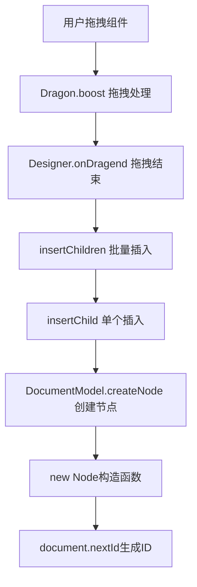
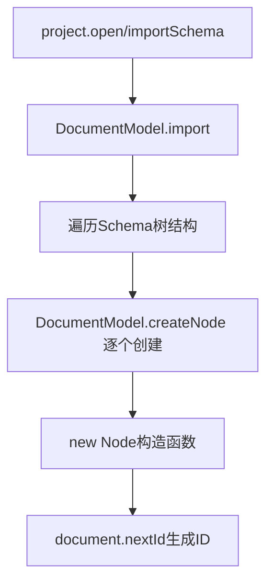
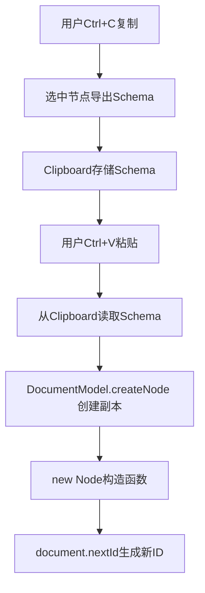
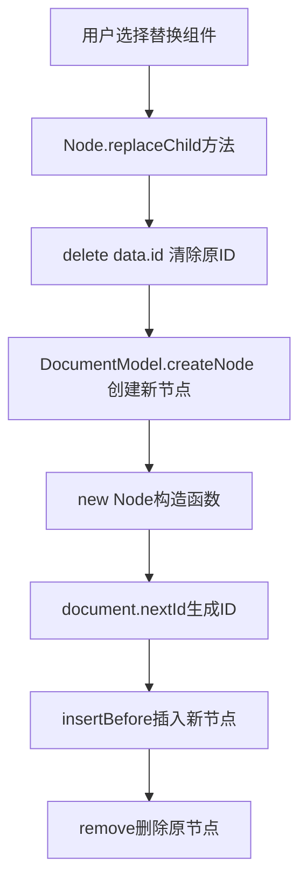
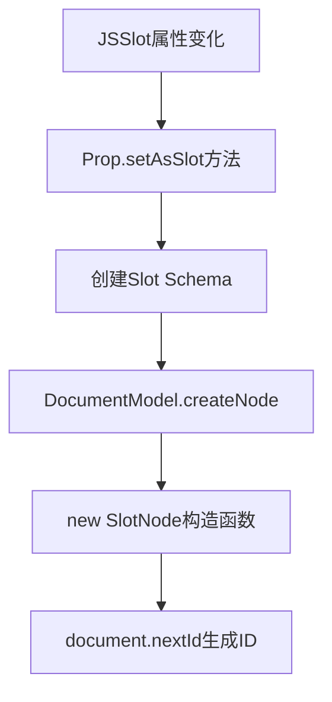
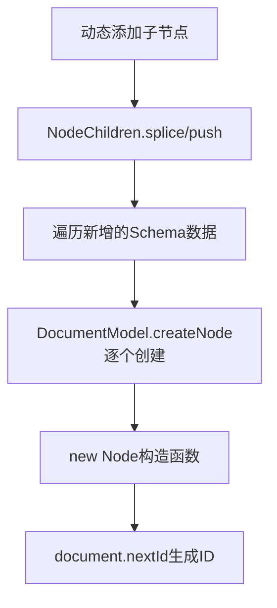
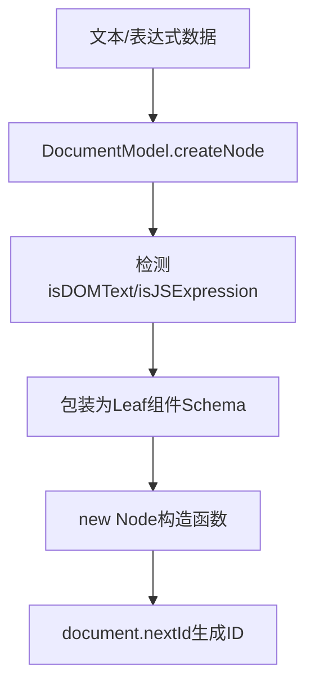
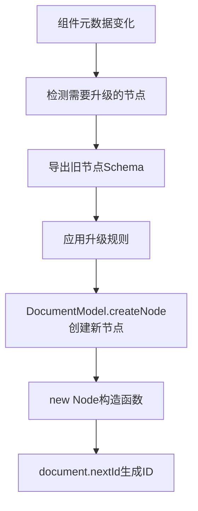
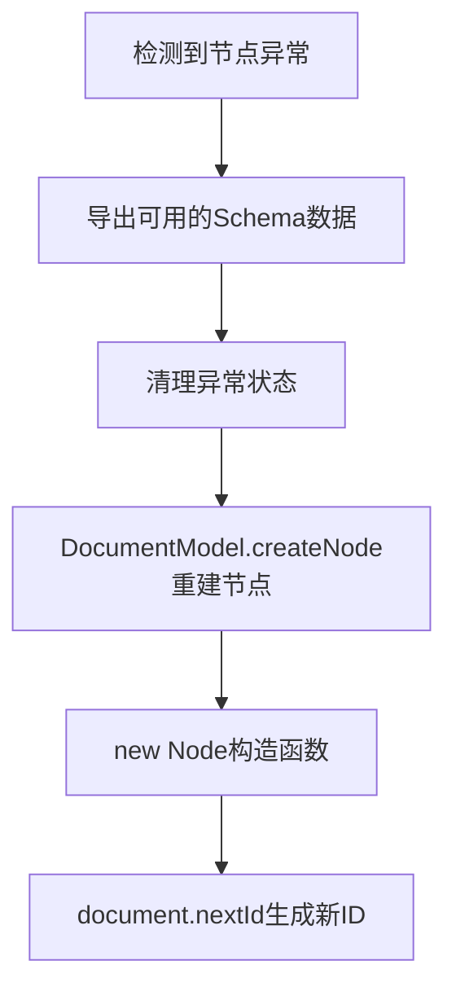
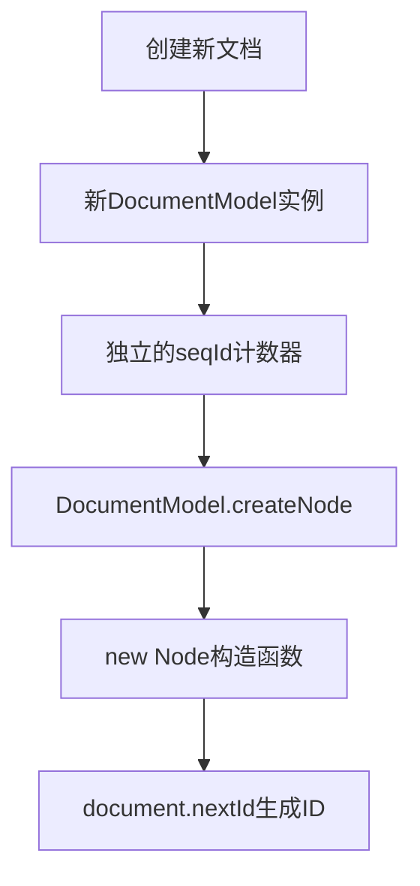

# 低代码引擎 node_ 前缀ID生成完整场景分析

## 📋 **概述**

低代码引擎中的节点ID格式为 `"node_ocmfgjnkuz2"`，其中：

- **前缀**: `node_`
- **后缀**: 由文档ID后10位 + 递增序列号(36进制) 组成的唯一标识

## 🔧 **ID生成核心机制**

### **核心方法：DocumentModel.nextId()**

```typescript
// packages/designer/src/document/document-model.ts:385-392
nextId(possibleId: string | undefined): string {
  let id = possibleId;
  while (!id || this.nodesMap.get(id)) {
    id = `node_${(String(this.id).slice(-10) + (++this.seqId).toString(36)).toLocaleLowerCase()}`;
  }
  return id;
}
```

**生成逻辑**：

1. 如果提供了 `possibleId` 且不冲突，直接使用
2. 否则生成新ID：`node_` + 文档ID后10位 + 递增序列号(36进制转小写)
3. 检查ID是否已存在，如存在则递增序列号重新生成

**调用位置**: 在Node构造函数中调用

```typescript
// packages/designer/src/document/node/node.ts:374
this.id = document.nextId(id);
```

## 🎯 **完整场景分析**

### **场景1: 组件库拖拽到画布** ⭐⭐⭐⭐⭐

**触发条件**: 用户从组件库拖拽组件到设计器画布

**调用链路**:



**具体实现**:

```typescript
// engine-core.js:31665-31696 (DocumentModel.createNode)
createNode(data) {
  var schema = data;
  var node = null;

  // 如果schema.id存在且冲突，清除ID让系统自动生成
  if (this.hasNode(schema?.id)) {
    schema.id = null;
  }

  // 创建新节点实例
  if (!node) {
    node = new node_Node(this, schema); // 🔥 触发ID生成
  }

  this._nodesMap.set(node.id, node);
  return node;
}
```

**生成的ID示例**: `node_1a2b3c4d5e`

---

### **场景2: Schema数据导入/加载** ⭐⭐⭐⭐⭐

**触发条件**: 通过API加载项目Schema数据或导入外部Schema

**调用链路**:



**场景特点**:

- **批量创建**: 根据Schema树结构递归创建所有节点
- **ID冲突处理**: 如果Schema中的ID已存在，会自动生成新ID
- **保持结构**: 维护原Schema的父子关系

**生成的ID示例**:

- 根节点: `node_page001abc`
- 子节点: `node_btn002def`
- 孙节点: `node_txt003ghi`

---

### **场景3: 组件复制粘贴操作** ⭐⭐⭐⭐

**触发条件**: 用户在画布上复制现有组件并粘贴

**调用链路**:



**ID处理特点**:

- **强制重新生成**: 复制的节点必须有新ID，避免ID冲突
- **删除原ID**: 在createNode前会清空schema.id
- **递归处理**: 复制的所有子节点也会获得新ID

**生成的ID示例**:

- 原节点: `node_btn001xyz`
- 复制节点: `node_btn002abc` (完全新的ID)

---

### **场景4: 节点替换操作** ⭐⭐⭐

**触发条件**: 用户替换画布上的现有组件

**调用链路**:



**具体实现**:

```typescript
// engine-core.js:29866-29876 (Node.replaceChild)
replaceChild(node, data) {
  var selected = this.document.selection.has(node.id);
  delete data.id; // 🔥 强制删除ID，确保生成新ID
  var newNode = this.document.createNode(data);

  this.insertBefore(newNode, node, false);
  node.remove(false);

  if (selected) {
    this.document.selection.select(newNode.id);
  }
}
```

**生成的ID示例**: `node_newcomp123`

---

### **场景5: JSSlot插槽内容创建** ⭐⭐⭐

**触发条件**: 在JSSlot插槽中动态创建内容

**调用链路**:



**具体实现**:

```typescript
// engine-core.js:27696-27697
setAsSlot(data) {
  this._slotNode = owner.document?.createNode(slotSchema); // 🔥 创建slot节点
  if (this._slotNode) {
    owner.addSlot(this._slotNode);
  }
}
```

**生成的ID示例**: `node_slot001abc`

---

### **场景6: 动态子节点创建** ⭐⭐⭐

**触发条件**: 程序代码或用户操作动态添加子节点

**调用链路**:



**具体实现**:

```typescript
// engine-core.js:28507-28508
children.map(function (child) {
  return this.owner.document?.createNode(child, options.checkId); // 🔥 批量创建
});
```

**生成的ID示例**:

- 子节点1: `node_child001`
- 子节点2: `node_child002`
- 子节点3: `node_child003`

---

### **场景7: Leaf文本节点创建** ⭐⭐

**触发条件**: 创建文本内容或表达式节点

**调用链路**:



**具体实现**:

```typescript
// engine-core.js:31668-31672
if (isDOMText(data) || isJSExpression(data)) {
  schema = {
    componentName: 'Leaf',
    children: data
  }; // 🔥 包装文本为Leaf节点
}
```

**生成的ID示例**: `node_leaf001txt`

---

### **场景8: 组件升级/迁移** ⭐⭐

**触发条件**: 组件版本升级或API迁移时的节点重建

**调用链路**:



**场景特点**:

- **元数据驱动**: 基于ComponentMeta的变化触发
- **保持数据**: 尽量保持原有的props和children
- **强制新ID**: 确保升级后的节点有新的标识

**生成的ID示例**: `node_upgraded123`

---

### **场景9: 错误恢复重建** ⭐⭐

**触发条件**: 节点数据损坏或异常时的自动重建

**调用链路**:



**场景特点**:

- **异常处理**: 当节点状态不一致时触发
- **数据恢复**: 尽可能恢复原有数据
- **全新标识**: 重建节点获得全新ID

**生成的ID示例**: `node_recovered456`

---

### **场景10: 多文档管理** ⭐⭐

**触发条件**: 在多文档模式下创建新文档的节点

**调用链路**:



**ID特点**:

- **文档独立**: 每个文档有独立的ID序列
- **不重复**: 即使跨文档也不会重复ID
- **可追踪**: 通过ID可以确定节点所属文档

**生成的ID示例**:

- 文档1: `node_doc1001abc`
- 文档2: `node_doc2001def`

---

## 🔍 **ID冲突处理机制**

### **冲突检测**

```typescript
// 检查ID是否已存在
while (!id || this.nodesMap.get(id)) {
  // 生成新ID直到无冲突
  id = `node_${(String(this.id).slice(-10) + (++this.seqId).toString(36)).toLocaleLowerCase()}`;
}
```

### **处理策略**

1. **自动递增**: 序列号自动递增确保唯一性
2. **强制清理**: 在createNode前清除可能冲突的ID
3. **全局检查**: 在整个DocumentModel范围内检查唯一性

---

## 📊 **ID生成统计**

| 场景 | 频率 | 重要性 | ID示例 |
|------|------|--------|---------|
| 组件库拖拽 | ⭐⭐⭐⭐⭐ | 🔥🔥🔥🔥🔥 | `node_btn001abc` |
| Schema导入 | ⭐⭐⭐⭐⭐ | 🔥🔥🔥🔥🔥 | `node_page002def` |
| 复制粘贴 | ⭐⭐⭐⭐ | 🔥🔥🔥🔥 | `node_copy003ghi` |
| 节点替换 | ⭐⭐⭐ | 🔥🔥🔥 | `node_replace004` |
| JSSlot创建 | ⭐⭐⭐ | 🔥🔥🔥 | `node_slot005jkl` |
| 动态子节点 | ⭐⭐⭐ | 🔥🔥🔥 | `node_child006mno` |
| Leaf节点 | ⭐⭐ | 🔥🔥 | `node_leaf007pqr` |
| 组件升级 | ⭐⭐ | 🔥🔥 | `node_upgrade008` |
| 错误恢复 | ⭐⭐ | 🔥🔥 | `node_recover009` |
| 多文档 | ⭐⭐ | 🔥🔥 | `node_doc010stu` |

---

## ⚡ **性能优化要点**

### **ID生成性能**

- **36进制转换**: 比10进制更短，减少字符串长度
- **缓存检查**: 通过nodesMap快速检测冲突
- **递增策略**: 避免随机ID的重复检测开销

### **内存管理**

- **弱引用清理**: 节点销毁时从nodesMap中清除
- **序列号重置**: 长时间运行时考虑序列号重置机制

---

## 🔧 **调试技巧**

### **如何追踪ID生成**

```javascript
// 在控制台监听节点创建
document.addEventListener('nodecreate', (event) => {
  console.log('新节点创建:', {
    id: event.detail.id,
    componentName: event.detail.componentName,
    stackTrace: new Error().stack
  });
});
```

### **ID格式验证**

```javascript
function isValidNodeId(id) {
  return /^node_[a-z0-9]+$/.test(id);
}
```

---

## 📝 **总结**

低代码引擎中的`node_`前缀ID生成涵盖了从基础拖拽操作到复杂数据管理的各个方面。理解这些场景有助于：

1. **🔍 问题诊断**: 当出现ID相关问题时，能快速定位触发场景
2. **🚀 性能优化**: 了解ID生成热点，进行针对性优化
3. **🔧 功能扩展**: 在开发插件或扩展时正确处理节点ID
4. **🐛 错误处理**: 设计合适的ID冲突检测和恢复机制

每个场景都有其特定的触发条件和处理逻辑，但最终都汇聚到`DocumentModel.nextId()`这个核心方法，确保整个系统中节点ID的唯一性和一致性。
