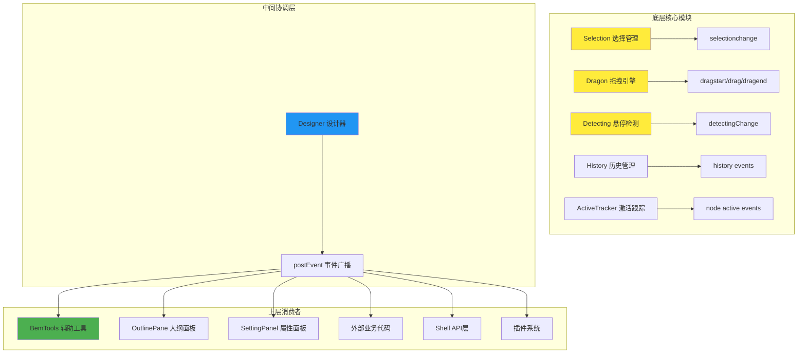

# 低代码引擎事件系统真实架构

## ❌ 常见误解

**误解**: 低代码引擎的事件都是为了 BemTools 而设计的

**真相**: BemTools 只是众多事件监听者之一，事件系统服务于整个设计器架构

## ✅ 真实的事件架构

### 1. 事件的发起层级



### 2. 各模块的监听目的

| 模块 | 监听的事件 | 目的 | 处理逻辑 |
|------|-----------|------|----------|
| **BemTools** | 所有交互事件 | 提供视觉辅助 | 显示边框、指示器等 |
| **OutlinePane** | selection/detecting | 大纲面板同步 | 高亮对应的树节点 |
| **SettingPanel** | selection | 属性编辑 | 显示选中组件的属性 |
| **外部业务** | 所有事件 | 业务逻辑 | 自定义处理和扩展 |
| **Shell API** | 所有事件 | 对外暴露 | 提供给用户的API事件 |
| **插件系统** | 所有事件 | 插件响应 | 插件可监听所有事件 |

### 3. 事件流转的完整链路

#### 3.1 选择事件流转

```typescript
// ① 用户点击组件 -> Selection 模块发出事件
Selection.select(nodeId)
  -> this.emitter.emit('selectionchange', this._selected)

// ② Designer 监听并广播
Designer.setupSelection()
  -> currentSelection.onSelectionChange(() => {
       this.postEvent('selection.change', currentSelection);
     })

// ③ 多个消费者同时响应
BemTools.BorderSelecting -> 显示选中边框
OutlinePane.TreeView     -> 高亮树节点
SettingPanel            -> 显示属性面板
外部业务代码             -> props.onSelectionChange()
Shell API               -> project.onSelectionChange()
```

#### 3.2 拖拽事件流转

```typescript
// ① Dragon 拖拽引擎发出事件
Dragon.boost()
  -> this.emitter.emit('dragstart', locateEvent)

// ② Designer 监听并处理 + 广播
Designer.constructor()
  -> this.dragon.onDragstart((e) => {
       this.detecting.enable = false;  // 禁用悬停检测
       this.props.onDragstart?.(e);    // 外部回调
       this.postEvent('dragstart', e); // 广播事件
     })

// ③ 多个消费者同时响应
BemTools.InsertionView  -> 显示插入指示器
BemTools.DragGhost     -> 显示拖拽幽灵
节点插入逻辑            -> 准备插入操作
状态管理               -> 更新拖拽状态
外部业务代码            -> 自定义拖拽逻辑
```

### 4. 从源码看事件的真实使用者

#### 4.1 Designer 作为事件中转站

```typescript
// Designer 不仅转发给 BemTools，还转发给：
this.postEvent('selection.change', currentSelection);  // → 外部监听者
this.postEvent('dragstart', e);                       // → 插件系统
this.postEvent('drag', e);                           // → 业务逻辑
this.postEvent('dragend', e, loc);                   // → 状态管理

// 外部回调优先于内部处理
if (this.props?.onDragstart) {
  this.props.onDragstart(e);  // 业务代码优先处理
}
```

#### 4.2 大纲面板的独立监听

```typescript
// OutlinePane 直接监听 detecting 事件，不通过 BemTools
TreeView.hover(e) {
  var detecting = project.currentDocument?.detecting;
  var node = this.getTreeNodeFromEvent(e)?.node;
  node?.id && detecting?.capture(node.id);  // 直接调用检测
}
```

#### 4.3 Shell API 层的事件对外暴露

```typescript
// Shell 层为外部提供事件监听接口
project.onSelectionChange(fn) -> 内部路由到 Selection.onSelectionChange()
project.onChangeDetecting(fn) -> 内部路由到 Detecting.onDetectingChange()
```

### 5. BemTools 在事件系统中的真实地位

**BemTools 只是事件系统的一个消费者**，它的作用是：

```typescript
// BemTools 的角色：视觉反馈提供者
class BemTools extends Component {
  render() {
    return (
      <div className="lc-bem-tools">
        <BorderDetecting />   {/* 响应 detectingChange */}
        <BorderSelecting />   {/* 响应 selectionchange */}
        <InsertionView />     {/* 响应 drag 事件 */}
        <BorderResizing />    {/* 响应 selection + resize */}
      </div>
    );
  }
}
```

### 6. 事件系统的设计原则

#### 6.1 分层解耦

- **底层模块**：只负责发出事件，不关心谁在监听
- **中间层**：Designer 作为协调中心，统一管理事件流
- **上层模块**：各司其职，响应自己关心的事件

#### 6.2 优先级控制

```typescript
// 业务逻辑优先于视觉反馈
if (this.props?.onDragstart) {
  this.props.onDragstart(e);  // 先执行业务逻辑
}
this.postEvent('dragstart', e);  // 再广播给其他监听者
```

#### 6.3 状态协调

```typescript
// 拖拽时禁用悬停检测，避免冲突
this.dragon.onDragstart(() => {
  this.detecting.enable = false;  // 状态协调
});
```

## 📊 总结

**低代码引擎的事件系统架构如下：**

1. **事件源头**：Selection、Dragon、Detecting 等核心模块
2. **事件中转**：Designer 作为协调中心进行事件广播
3. **事件消费**：BemTools、OutlinePane、SettingPanel、业务代码等多个消费者
4. **设计原则**：分层解耦、优先级控制、状态协调

**BemTools 只是这个完整事件系统中的一个视觉反馈组件**，它帮助用户更直观地进行可视化设计，但绝不是事件系统的唯一目的或核心。事件系统服务于整个低代码引擎的协调运作。
