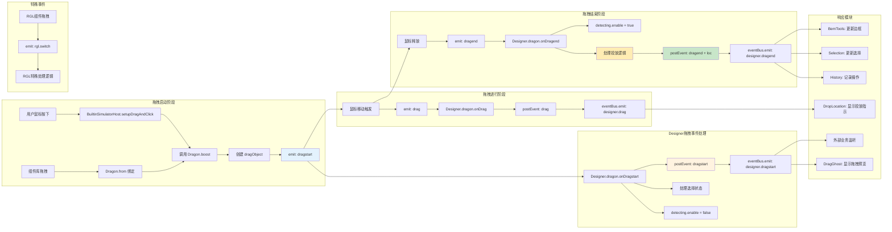

# 低代码引擎拖拽事件完整流转分析

## 1. 拖拽事件流转概述

基于 `engine-core.js` 源码分析，低代码引擎的拖拽系统是一个复杂的事件驱动系统。从用户开始拖拽到最终完成投放，涉及多个阶段的事件触发和处理，每个阶段都有不同的模块参与响应。

## 2. 拖拽事件流转完整流程图



## 3. 拖拽事件详细分析

### 3.1 dragstart - 拖拽开始事件

#### 3.1.1 事件触发源码

```typescript
// Dragon.boost 方法中的 dragstart 函数（engine-core.js 行 37899-37916）
var dragstart = function dragstart() {
    _this2._dragging = true;
    setShaken(boostEvent);
    var locateEvent = createLocateEvent(boostEvent);

    if (newBie || forceCopyState) {
        _this2.setCopyState(true);
    }

    // 设置拖拽状态
    _this2.setDraggingState(true);

    // 触发核心拖拽开始事件
    _this2.emitter.emit('dragstart', locateEvent);
};
```

#### 3.1.2 Designer 层响应

```typescript
// Designer 构造函数中的拖拽开始监听（engine-core.js 行 40399-40421）
this.dragon.onDragstart(function (e) {
    var _this$props;

    // 1. 禁用检测功能，避免拖拽时的干扰
    _this.detecting.enable = false;

    var dragObject = e.dragObject;

    // 2. 处理节点拖拽的选择状态
    if (isDragNodeObject(dragObject)) {
        if (dragObject.nodes.length === 1) {
            _this.currentSelection?.select(dragObject.nodes[0].id);
        } else if (dragObject.nodes.length > 1) {
            _this.currentSelection?.selectAll(dragObject.nodes.map(n => n.id));
        }
    } else {
        // 3. 新组件拖拽时清空当前选择
        _this.currentSelection?.clear();
    }

    // 4. 调用外部回调
    if (_this.props?.onDragstart) {
        _this.props.onDragstart(e);
    }

    // 5. 广播设计器级别事件
    _this.postEvent('dragstart', e);
});
```

#### 3.1.3 响应模块行为

**DragGhost - 拖拽预览**

```typescript
// DragGhost 监听拖拽开始（engine-core.js 行 40964-40970）
this.dragon.onDragstart(function (e) {
    if (e.originalEvent.type.slice(0, 4) === 'drag') {
        return;  // HTML5 拖拽不处理
    }

    // 获取拖拽标题信息
    _this.titles = _this.getTitles(e.dragObject);
    _this.x = e.globalX;
    _this.y = e.globalY;

    // 显示拖拽预览
    _this.show();
});
```

### 3.2 drag - 拖拽进行事件

#### 3.2.1 事件触发源码

```typescript
// Dragon.boost 方法中的 drag 函数（engine-core.js 行 37897）
var drag = function drag(e) {
    var locateEvent = createLocateEvent(e);

    // 定位投放位置
    var location = _this2.locate(locateEvent);
    if (location) {
        designer.setLocation(locateEvent, location);
    } else {
        designer.clearLocation();
    }

    // 触发拖拽进行事件
    _this2.emitter.emit('drag', locateEvent);
};
```

#### 3.2.2 位置计算和视觉反馈

```typescript
// Designer 的 drag 事件处理（engine-core.js 行 40423-40429）
this.dragon.onDrag(function (e) {
    var _this$props2;

    // 调用外部回调
    if (_this$props2.onDrag) {
        _this$props2.onDrag(e);
    }

    // 广播拖拽进行事件
    _this.postEvent('drag', e);
});
```

**投放位置指示器响应**

```typescript
// BorderDetecting 监听投放位置变化（engine-core.js 行 35946-35951）
host.designer.editor.eventBus.on('designer.dropLocation.change', function (loc) {
    var target = _this2.state.target;
    if (target === (loc?.target)) return;

    // 更新投放位置指示
    _this2.setState({
        target: loc?.target
    });
});
```

### 3.3 dragend - 拖拽结束事件

#### 3.3.1 事件触发源码

```typescript
// Dragon.boost 方法中的拖拽结束处理（engine-core.js 行 37998-38001）
_this2.emitter.emit('dragend', {
    dragObject: dragObject,
    copy: copy  // 是否为复制操作
});
```

#### 3.3.2 Designer 层的复杂处理逻辑

```typescript
// Designer 的 dragend 事件处理（engine-core.js 行 40430-40468）
this.dragon.onDragend(function (e) {
    var _this$props3;
    var dragObject = e.dragObject;
    var copy = e.copy;

    designer_logger.debug('onDragend: dragObject ', dragObject, ' copy ', copy);

    // 获取最终投放位置
    var loc = _this._dropLocation;

    if (loc) {
        if (isLocationChildrenDetail(loc.detail) && loc.detail.valid !== false) {
            var nodes;

            if (isDragNodeObject(dragObject)) {
                // 处理已存在节点的移动
                nodes = insertToContainer(loc.target, loc.detail, dragObject.nodes, copy);
            } else {
                // 处理新组件的创建
                nodes = insertToContainer(loc.target, loc.detail, dragObject.data);
            }

            if (nodes && nodes.length) {
                // 选中新插入的节点
                _this.currentSelection?.selectAll(nodes.map(n => n.id));

                // 延迟追踪第一个节点
                setTimeout(() => {
                    return _this.activeTracker.track(nodes[0]);
                }, 10);
            }
        }
    }

    // 调用外部回调
    if (_this$props3.onDragend) {
        _this$props3.onDragend(e, loc);
    }

    // 广播拖拽结束事件
    _this.postEvent('dragend', e, loc);

    // 重新启用检测功能
    _this.detecting.enable = true;
});
```

## 4. 特殊拖拽场景

### 4.1 RGL（React Grid Layout）拖拽

```typescript
// RGL组件的特殊拖拽处理（engine-core.js 行 34695-34698）
designer.dragon.emitter.emit('rgl.switch', {
    action: 'start',
    rglNode: rglNode
});

// 拖拽结束时
designer.dragon.emitter.emit('rgl.switch', {
    action: 'end',
    rglNode: rglNode
});
```

### 4.2 组件库拖拽

```typescript
// 从组件库创建拖拽源（Dragon.from 方法）
from(shell: Element, boost: (e: MouseEvent) => DragObject | null) {
    const mousedown = (e: MouseEvent) => {
        const dragObject = boost(e);  // 业务提供拖拽对象
        if (dragObject) {
            this.boost(dragObject, e);  // 启动拖拽
        }
    };

    shell.addEventListener('mousedown', mousedown);
    return () => shell.removeEventListener('mousedown', mousedown);
}
```

## 5. 事件数据格式

### 5.1 DragObject 数据结构

```typescript
// 节点拖拽对象
interface DragNodeObject {
    type: 'Node';
    nodes: Node[];  // 被拖拽的节点数组
}

// 新组件拖拽对象
interface DragNodeDataObject {
    type: 'NodeData';
    data: NodeSchema | NodeSchema[];  // 组件配置数据
    thumbnail?: string;  // 缩略图
    description?: string;  // 描述
}
```

### 5.2 LocateEvent 事件数据

```typescript
interface LocateEvent {
    type: 'LocateEvent';
    globalX: number;    // 全局X坐标
    globalY: number;    // 全局Y坐标
    clientX: number;    // 客户端X坐标
    clientY: number;    // 客户端Y坐标
    dragObject: DragObject;  // 拖拽对象
    sensor?: Sensor;    // 触发的传感器
}
```

## 6. 各模块响应总结

### 6.1 核心响应模块

| 模块                      | 响应事件          | 主要行为               | 效果                   |
| ------------------------- | ----------------- | ---------------------- | ---------------------- |
| **DragGhost**       | dragstart         | 显示拖拽预览，跟随鼠标 | 用户看到拖拽的视觉反馈 |
| **Detecting**       | dragstart         | 禁用悬停检测           | 避免拖拽时的干扰       |
| **Selection**       | dragstart/dragend | 更新选择状态           | 保持选择的一致性       |
| **BorderDetecting** | drag              | 显示投放位置指示器     | 提示用户可投放位置     |
| **History**         | dragend           | 记录拖拽操作到历史     | 支持撤销重做           |

### 6.2 拖拽监听系统详解

基于 `engine-core.js` 源码分析，低代码引擎实际存在**三套拖拽监听系统**：

#### 6.2.1 Dragon 直接监听（最底层）

```typescript
// 直接监听 Dragon 实例的原始事件
const dragon = designer.dragon;

dragon.onDragstart((e: ILocateEvent) => {
    // 参数: ILocateEvent - 原始拖拽定位事件
    console.log('Dragon层拖拽开始:', e.dragObject, e.globalX, e.globalY);
});

dragon.onDrag((e: ILocateEvent) => {
    // 参数: ILocateEvent - 实时拖拽位置事件
    console.log('Dragon层拖拽中:', e.clientX, e.clientY);
});

dragon.onDragend((e: { dragObject: DragObject; copy: boolean }) => {
    // 参数: { dragObject, copy } - 拖拽对象和复制标识
    console.log('Dragon层拖拽结束:', e.dragObject, e.copy);
});
```

**特点：**
- **触发时机**: 最早，Dragon 内部直接触发
- **数据格式**: 原始的内部事件数据
- **适用场景**: 引擎内部模块，需要最原始数据的场景

#### 6.2.2 EventBus 全局监听（中间层）

```typescript
// 通过设计器的事件总线监听
const editor = designer.editor;

editor.eventBus.on('designer.dragstart', (e: ILocateEvent) => {
    // 参数: 与Dragon层相同的ILocateEvent
    console.log('EventBus层拖拽开始');
});

editor.eventBus.on('designer.drag', (e: ILocateEvent) => {
    // 参数: 实时拖拽事件
    console.log('EventBus层拖拽中');
});

editor.eventBus.on('designer.dragend', (e: ILocateEvent, loc: DropLocation) => {
    // 参数: 拖拽事件 + 投放位置信息
    console.log('EventBus层拖拽结束:', loc);
});
```

**特点：**
- **触发时机**: 在Dragon之后，由Designer.postEvent转发
- **数据增强**: dragend 事件增加了 DropLocation 参数
- **适用场景**: 插件系统、全局功能模块

#### 6.2.3 Canvas Shell API 监听（Shell层）

```typescript
// 通过Shell层的Canvas API监听
import { canvas } from '@alilc/lowcode-engine';

// 实际是: canvas.dragon.onDragstart，本质仍是Dragon监听
canvas.dragon?.onDragstart((e: IPublicModelLocateEvent) => {
    // 参数: 经过Shell包装的公开事件类型
    console.log('Canvas层拖拽开始');
});

canvas.dragon?.onDragend((e: IPublicModelDragEndEvent) => {
    // 参数: 包装后的公开拖拽结束事件
    console.log('Canvas层拖拽结束');
});
```

**特点：**
- **触发时机**: 与Dragon相同（内部就是Dragon）
- **类型包装**: 使用公开的 IPublicModel 类型
- **适用场景**: 外部业务代码，标准API使用

### 6.2.4 三套系统的对比分析

| 监听系统 | 层级 | 触发时机 | 参数类型 | 数据完整性 | 使用场景 |
|----------|------|----------|----------|------------|----------|
| **Dragon直接监听** | 底层 | 最早 | 内部类型 | 原始数据 | 引擎内部开发 |
| **EventBus监听** | 中间层 | 中等 | 内部类型 + 增强 | 增强数据 | 插件开发 |
| **Canvas API监听** | Shell层 | 最早 | 公开类型 | 包装数据 | 业务应用开发 |

### 6.2.5 参数差异详解

```typescript
// 1. Dragon 层 - dragend 参数
{
    dragObject: IPublicModelDragObject,  // 拖拽对象
    copy: boolean                        // 是否复制
}

// 2. EventBus 层 - dragend 参数
(
    e: ILocateEvent,                     // 拖拽事件
    loc: DropLocation                    // 投放位置（增强）
)

// 3. Canvas API 层 - dragstart 参数类型转换
// 内部: ILocateEvent → 外部: IPublicModelLocateEvent
```

### 6.2.6 业务使用建议

**推荐使用优先级：**

1. **Canvas API 监听**（推荐）
   ```typescript
   import { canvas } from '@alilc/lowcode-engine';

   canvas.dragon?.onDragstart((e) => {
       // 业务处理逻辑
   });
   ```
   - ✅ 类型安全（公开API）
   - ✅ 官方标准接口
   - ✅ 版本兼容性好

2. **EventBus 监听**（特定场景）
   ```typescript
   editor.eventBus.on('designer.dragstart', (e) => {
       // 插件逻辑
   });
   ```
   - ✅ 数据最丰富（如dragend的location参数）
   - ✅ 全局事件机制
   - ⚠️ 内部API，可能变更

3. **Dragon 直接监听**（不推荐）
   ```typescript
   designer.dragon.onDragstart((e) => {
       // 内部逻辑
   });
   ```
   - ⚠️ 内部实现细节
   - ⚠️ 无类型保护
   - ❌ 不推荐业务使用

## 7. 实际应用示例

### 7.1 业务代码中的正确使用

```typescript
// 推荐写法：使用Canvas API
import { canvas, project } from '@alilc/lowcode-engine';

// 监听拖拽开始
const removeDragstartListener = canvas.dragon?.onDragstart((e) => {
    console.log('用户开始拖拽:', e.dragObject?.type);

    // 业务逻辑：比如显示拖拽提示
    showDragHint();
});

// 监听拖拽结束
const removeDragendListener = canvas.dragon?.onDragend((e) => {
    console.log('拖拽完成:', e.dragObject?.type, '复制模式:', e.copy);

    // 业务逻辑：比如统计拖拽行为
    trackDragAction(e.dragObject, e.copy);
    hideDragHint();
});

// 清理监听器
const cleanup = () => {
    removeDragstartListener?.();
    removeDragendListener?.();
};
```

### 7.2 插件开发中的使用

```typescript
// 插件中使用EventBus获取更丰富的数据
const pluginInit = (ctx) => {
    const { editor } = ctx;

    editor.eventBus.on('designer.dragend', (dragEvent, dropLocation) => {
        // dragend 事件独有的 dropLocation 参数
        if (dropLocation) {
            console.log('投放到:', dropLocation.target.componentName);
            console.log('投放位置:', dropLocation.detail);
        }

        // 插件特殊处理逻辑
        handlePluginDragEnd(dragEvent, dropLocation);
    });
};
```

## 8. 性能优化机制

### 8.1 事件防抖

```typescript
// 拖拽移动事件的防抖处理
var move = function move(e) {
    if (isShaken(boostEvent, e)) {
        // 首次移动才触发 dragstart
        dragstart();
        drag(e);
    }
};
```

### 8.2 状态缓存

```typescript
// 缓存拖拽状态避免重复计算
this._dragging = true;  // 拖拽状态标记
this._canDrop = false;  // 投放状态标记
```

## 9. 错误处理机制

### 9.1 异常捕获

```typescript
// 拖拽结束时的异常处理（engine-core.js 行 37998-38003）
try {
    _this2.emitter.emit('dragend', {
        dragObject: dragObject,
        copy: copy
    });
} catch (ex) {
    exception = ex;  // 捕获异常但继续执行清理
}
```

### 9.2 状态恢复

```typescript
// 确保拖拽结束时恢复状态
designer.clearLocation();  // 清除投放位置
_this.detecting.enable = true;  // 恢复检测功能
```

## 10. 调试支持

### 10.1 拖拽状态查询

```typescript
// 查询当前拖拽状态
const isDragging = designer.dragon.dragging;
const dragObject = designer.dragon.dragObject;
```

### 10.2 事件日志

```typescript
// 开发环境下的事件调试
if (process.env.NODE_ENV === 'development') {
    dragon.onDragstart((e) => console.log('[Drag] Start:', e));
    dragon.onDrag((e) => console.log('[Drag] Move:', e));
    dragon.onDragend((e) => console.log('[Drag] End:', e));
}
```

## 11. 总结

低代码引擎的拖拽事件系统具有以下特点：

### 11.1 三套监听系统架构
- **Dragon直接监听**：底层原始事件，引擎内部使用
- **EventBus监听**：中间层增强事件，插件开发使用
- **Canvas API监听**：Shell层标准接口，业务应用推荐使用

### 11.2 核心技术特性
1. **完整的生命周期**：dragstart → drag → dragend 三个阶段覆盖拖拽全过程
2. **多层事件传播**：Dragon → Designer → EventBus → 各个消费模块
3. **状态管理完善**：拖拽过程中会禁用检测、更新选择、记录历史
4. **视觉反馈丰富**：拖拽预览、投放指示器、边框显示等多重反馈
5. **错误处理完善**：异常捕获和状态恢复机制
6. **性能优化**：防抖处理、状态缓存等优化手段

### 11.3 业务使用指导

**推荐使用方案：**
```typescript
// ✅ 业务代码推荐
canvas.dragon?.onDragstart((e) => { /* 业务逻辑 */ });

// ✅ 插件开发推荐（需要location信息时）
editor.eventBus.on('designer.dragend', (e, loc) => { /* 插件逻辑 */ });

// ❌ 不推荐直接使用内部API
designer.dragon.onDragstart((e) => { /* 内部实现，不推荐 */ });
```

这套拖拽系统为低代码编辑器提供了流畅的交互体验，同时通过分层架构为不同层次的开发者提供了合适的API接口，是整个设计器用户体验的核心组成部分。
