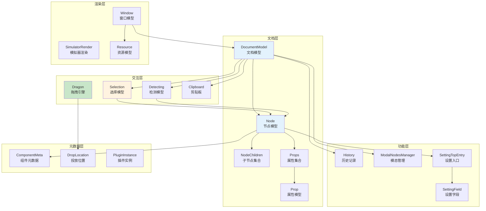
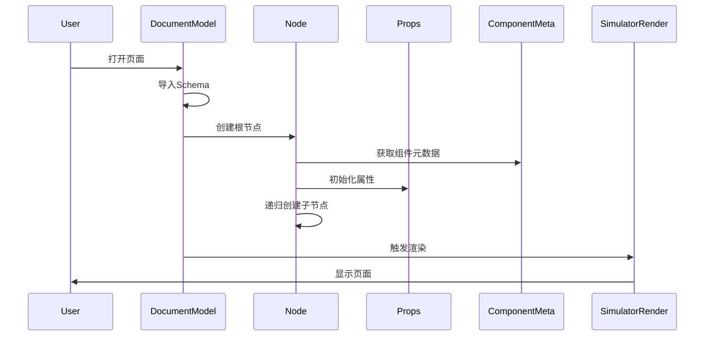
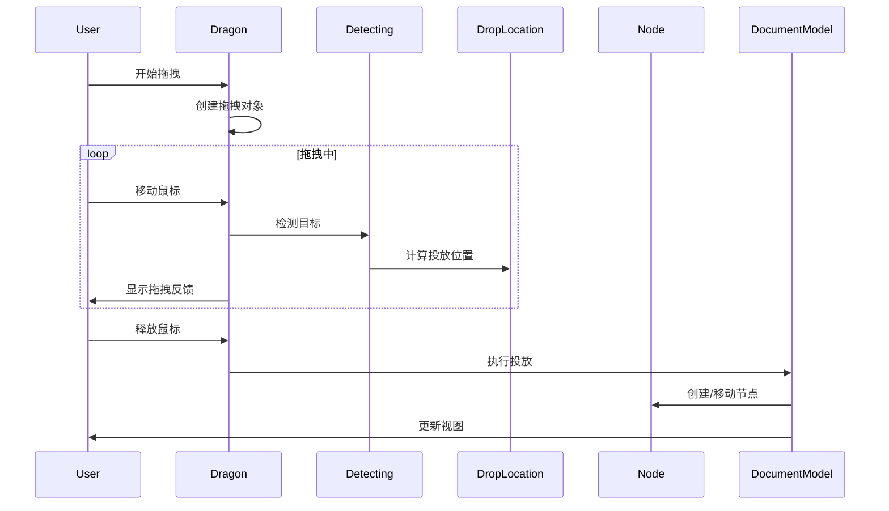
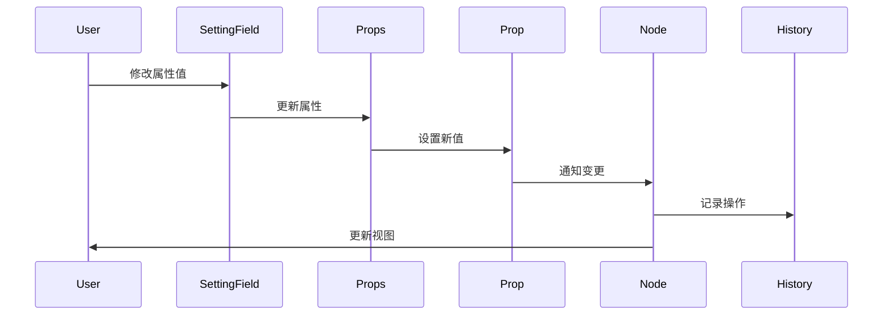

# 低代码引擎模型总览

## 1. 模型体系架构

低代码引擎采用分层架构设计，各个模型之间相互协作，共同构建了一个完整的低代码开发环境。

### 1.1 核心模型关系图



## 2. 模型分类详解

### 2.1 文档结构模型

| 模型 | 职责 | 核心功能 |
|------|------|----------|
| **DocumentModel** | 文档管理 | 管理页面文档的生命周期、节点树、功能模块 |
| **Node** | 节点实例 | 表示页面中的每个组件，管理属性、子节点、状态 |
| **NodeChildren** | 子节点集合 | 管理节点的子元素，维护父子关系 |
| **Props** | 属性集合 | 管理节点的所有属性 |
| **Prop** | 单个属性 | 表示节点的单个属性，支持各种属性类型 |

### 2.2 用户交互模型

| 模型 | 职责 | 核心功能 |
|------|------|----------|
| **Dragon** | 拖拽引擎 | 处理所有拖拽操作，包括新建和移动 |
| **Selection** | 选择管理 | 管理节点的选中状态，支持单选多选 |
| **Detecting** | 悬停检测 | 检测鼠标下的组件，提供视觉反馈 |
| **Clipboard** | 剪贴板 | 管理复制粘贴操作 |

### 2.3 功能支持模型

| 模型 | 职责 | 核心功能 |
|------|------|----------|
| **History** | 历史记录 | 实现撤销重做功能 |
| **ModalNodesManager** | 模态管理 | 管理弹窗等模态组件 |
| **SettingField** | 设置字段 | 属性设置面板的字段 |
| **SettingTopEntry** | 设置入口 | 属性设置面板的顶层入口 |

### 2.4 渲染相关模型

| 模型 | 职责 | 核心功能 |
|------|------|----------|
| **SimulatorRender** | 模拟器渲染 | 渲染编辑态的页面 |
| **Window** | 窗口管理 | 多窗口编辑支持 |
| **Resource** | 资源管理 | 管理组件资源、素材等 |

### 2.5 元数据模型

| 模型 | 职责 | 核心功能 |
|------|------|----------|
| **ComponentMeta** | 组件元数据 | 定义组件的配置信息 |
| **DropLocation** | 投放位置 | 描述拖拽的目标位置 |
| **PluginInstance** | 插件实例 | 插件系统的实例管理 |

## 3. 模型协作流程

### 3.1 页面加载流程



### 3.2 拖拽操作流程



### 3.3 属性编辑流程



## 4. 模型使用指南

### 4.1 获取模型实例

```typescript
// 从引擎获取
import { project, plugins } from '@alilc/lowcode-engine';

// 文档模型
const document = project.currentDocument;

// 节点操作
const node = document.getNode(nodeId);
const rootNode = document.rootNode;

// 选择模型
const selection = document.selection;

// 历史记录
const history = document.history;

// 拖拽引擎
const dragon = designer.dragon;

// 检测模型
const detecting = designer.detecting;
```

### 4.2 监听模型事件

```typescript
// 监听文档变化
document.onNodeCreate((node) => {
  console.log('节点创建:', node);
});

// 监听选择变化
selection.onChange((ids) => {
  console.log('选择变化:', ids);
});

// 监听拖拽事件
dragon.onDragend((e) => {
  console.log('拖拽结束:', e);
});

// 监听属性变化
node.onPropChange((info) => {
  console.log('属性变化:', info);
});
```

### 4.3 模型操作示例

```typescript
// 创建节点
const newNode = document.createNode({
  componentName: 'Button',
  props: { text: '按钮' }
});

// 插入节点
parentNode.insertChild(newNode, 0);

// 选择节点
selection.select(newNode.id);

// 设置属性
newNode.setPropValue('disabled', true);

// 撤销操作
history.undo();
```

## 5. 模型扩展机制

### 5.1 自定义模型

```typescript
// 扩展现有模型
class CustomNode extends Node {
  // 添加自定义功能
  customMethod() {
    // 实现自定义逻辑
  }
}

// 注册自定义模型
designer.registerNodeClass('CustomNode', CustomNode);
```

### 5.2 模型插件

```typescript
// 创建模型插件
const modelPlugin = {
  name: 'model-extension',

  init() {
    // 扩展DocumentModel
    DocumentModel.prototype.customFeature = function() {
      // 添加新功能
    };

    // 监听模型事件
    designer.on('document.created', (doc) => {
      // 处理新文档
    });
  }
};

// 注册插件
plugins.register(modelPlugin);
```

## 6. 最佳实践

### 6.1 性能优化

1. **批量操作**: 使用事务减少渲染次数
2. **懒加载**: 大型节点树使用按需加载
3. **缓存策略**: 合理使用计算属性缓存

### 6.2 错误处理

1. **验证输入**: 操作前验证参数合法性
2. **异常捕获**: 使用try-catch处理异常
3. **回滚机制**: 操作失败时回滚状态

### 6.3 代码组织

1. **模块化**: 按功能组织代码模块
2. **类型安全**: 使用TypeScript定义类型
3. **文档完善**: 为API添加详细注释

## 7. 常见问题

### 7.1 如何选择合适的模型？

- **操作节点结构**: 使用 Node、NodeChildren
- **管理属性**: 使用 Props、Prop
- **处理交互**: 使用 Selection、Dragon、Detecting
- **管理状态**: 使用 History、Clipboard

### 7.2 模型之间如何通信？

- **事件机制**: 使用EventBus进行解耦通信
- **直接引用**: 通过属性访问相关模型
- **回调函数**: 注册回调处理异步操作

### 7.3 如何扩展模型功能？

- **继承扩展**: 创建子类添加新功能
- **插件机制**: 通过插件系统注入功能
- **装饰器**: 使用装饰器模式增强功能

## 8. 总结

低代码引擎的模型体系是一个精心设计的分层架构，每个模型都有明确的职责和边界。通过合理使用这些模型，可以构建功能强大、扩展性好的低代码应用。理解这些模型的设计原理和使用方式，是深入掌握低代码引擎的关键。
