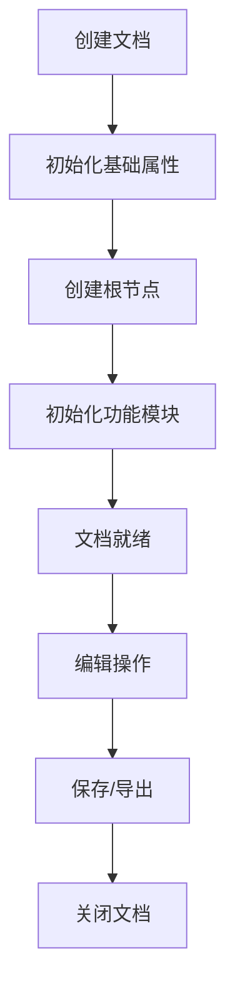

# DocumentModel - 文档模型详解

## 1. 模型概述

`DocumentModel` 是低代码引擎中的核心模型之一，代表一个完整的页面文档。它是低代码页面的容器，管理着页面的所有节点、状态、历史记录等核心功能。

## 2. 核心属性

### 2.1 基础属性

```typescript
class DocumentModel {
  // 唯一标识符
  id: string;

  // 文档类型：Page | Component | Block
  type: string;

  // 根节点
  rootNode: Node;

  // 所属项目
  project: Project;

  // 文档标题
  title?: string;

  // 文件名
  fileName?: string;

  // 模拟器实例
  simulator?: any;

  // 是否已修改
  modified: boolean = false;

  // 是否已保存
  isBlank: boolean = false;
}
```

### 2.2 状态管理属性

```typescript
{
  // 节点映射表
  nodes: Map<string, Node>;

  // 活跃节点列表
  activeNodes: Node[] = [];

  // 悬停节点
  drillDownNode?: Node;

  // 拖拽投放位置
  _dropLocation?: DropLocation;

  // 是否打开
  _opened: boolean = true;

  // 是否暂停
  _suspensed: boolean = false;

  // 待清理节点列表
  willPurgeSpace: Node[] = [];
}
```

### 2.3 功能模块属性

```typescript
{
  // 选择管理器
  selection: Selection;

  // 历史记录管理器
  history: History;

  // 检测管理器
  detecting: Detecting;

  // 模态节点管理器
  modalNodesManager: ModalNodesManager;

  // 剪贴板
  clipboard: Clipboard;

  // 焦点节点
  focusNode?: Node;
}
```

## 3. 核心方法

### 3.1 创建与导入

```typescript
// 创建新文档
static create(schema?: IPublicTypePageSchema | IPublicTypeComponentSchema): DocumentModel;

// 导入Schema
import(schema: IPublicTypeRootSchema): void;

// 导出Schema
export(): IPublicTypeRootSchema;
```

### 3.2 节点操作

```typescript
// 创建节点
createNode<T = Node>(schema: IPublicTypeNodeSchema): T;

// 插入节点
insertNode(node: Node, parent?: Node, index?: number): void;

// 移除节点
removeNode(node: Node | string): void;

// 根据ID查找节点
getNode(id: string): Node | null;

// 根据路径查找节点
getNodeByPath(path: string[]): Node | null;

// 获取所有节点
getNodeCount(): number;
```

### 3.3 状态管理

```typescript
// 打开文档
open(): void;

// 关闭文档
close(): void;

// 暂停渲染
suspense(): void;

// 恢复渲染
resume(): void;

// 检查嵌套规则
checkNesting(node: Node, target: Node): boolean;
```

### 3.4 事件相关

```typescript
// 监听事件
onNodeCreate(fn: (node: Node) => void): IPublicTypeDisposable;
onNodeDestroy(fn: (node: Node) => void): IPublicTypeDisposable;
onNodeChange(fn: (node: Node) => void): IPublicTypeDisposable;
onChangeSelection(fn: (selection: Selection) => void): IPublicTypeDisposable;
onChangeDetecting(fn: (detecting: Detecting) => void): IPublicTypeDisposable;

// 触发渲染
rerender(): void;
```

## 4. 核心原理

### 4.1 文档生命周期



### 4.2 节点管理机制

- **节点注册**: 所有节点创建后都会注册到 `nodes` Map 中
- **父子关系**: 通过节点的 parent 属性维护树形结构
- **快速查找**: 通过 ID 直接从 Map 中获取节点，时间复杂度 O(1)

### 4.3 状态同步机制

```typescript
// 通过 MobX 实现响应式
@obx.shallow nodes: Map<string, Node>;
@obx.shallow activeNodes: Node[];
@obx.ref _dropLocation?: DropLocation;
```

## 5. 与其他模型的关系

### 5.1 与 Project 的关系
- DocumentModel 属于某个 Project
- Project 可以包含多个 DocumentModel
- 通过 `project.documents` 访问所有文档

### 5.2 与 Node 的关系
- DocumentModel 是 Node 的容器
- 通过 rootNode 建立树形结构
- 所有 Node 都有指向 document 的引用

### 5.3 与功能模块的关系
```typescript
// Selection - 管理节点选择
document.selection.select(nodeId);

// History - 管理操作历史
document.history.undo();
document.history.redo();

// Detecting - 管理悬停检测
document.detecting.capture(node);

// Clipboard - 管理剪贴板
document.clipboard.copy();
document.clipboard.paste();
```

## 6. 使用方式

### 6.1 获取文档实例

```typescript
// 从项目获取当前文档
const doc = project.currentDocument;

// 根据ID获取文档
const doc = project.getDocumentById(docId);

// 根据文件名获取文档
const doc = project.getDocumentByFileName(fileName);
```

### 6.2 创建新文档

```typescript
// 创建页面文档
const pageDoc = project.createDocument({
  componentName: 'Page',
  title: '新页面',
  props: {},
  children: []
});

// 创建组件文档
const compDoc = project.createDocument({
  componentName: 'Component',
  title: '新组件',
  props: {},
  children: []
});
```

### 6.3 操作文档内容

```typescript
// 创建节点
const node = doc.createNode({
  componentName: 'Button',
  props: { text: '按钮' }
});

// 插入节点
doc.insertNode(node, parentNode, 0);

// 选择节点
doc.selection.select(node.id);

// 保存历史
doc.history.savePoint();
```

## 7. 注意事项

### 7.1 性能考虑
- 避免频繁的全量 rerender，使用节点级更新
- 大量节点操作时使用批量操作
- 及时清理不用的事件监听器

### 7.2 内存管理
- 关闭文档时会清理所有节点和事件监听
- 注意及时调用 dispose 方法释放资源

### 7.3 并发安全
- 文档操作不是线程安全的
- 避免在多个地方同时修改同一文档

### 7.4 状态一致性
- 修改操作应该通过 action 包装
- 避免直接修改内部状态
- 使用官方提供的 API 进行操作

## 8. 最佳实践

### 8.1 文档初始化
```typescript
// 完整的文档初始化流程
const doc = project.createDocument(schema);
await doc.open();
doc.onReady(() => {
  // 文档就绪后的操作
});
```

### 8.2 批量操作
```typescript
// 批量插入节点
doc.history.startBatch();
nodes.forEach(node => {
  doc.insertNode(node, parent);
});
doc.history.endBatch();
```

### 8.3 错误处理
```typescript
try {
  const node = doc.createNode(schema);
  if (!doc.checkNesting(node, targetParent)) {
    throw new Error('嵌套规则检查失败');
  }
  doc.insertNode(node, targetParent);
} catch (error) {
  console.error('节点创建失败:', error);
  doc.history.undo();
}
```
