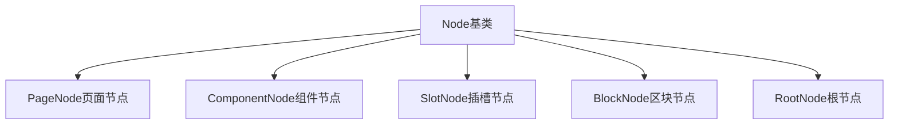

# Node - 节点模型详解

## 1. 模型概述

`Node` 是低代码引擎中最核心的模型，代表页面中的每一个组件实例。它是构成页面树形结构的基本单元，负责管理组件的属性、子节点、状态等所有信息。

## 2. 核心属性

### 2.1 基础属性

```typescript
class Node {
  // 节点唯一标识
  id: string;

  // 组件名称
  componentName: string;

  // 组件元数据
  componentMeta: ComponentMeta;

  // 所属文档
  document: DocumentModel;

  // 父节点
  _parent?: Node;

  // 是否为节点实例标识
  isNode: true;

  // 节点标题
  title?: string | I18nData;

  // 节点别名(用于页面内引用)
  ref?: string;
}
```

### 2.2 属性管理

```typescript
{
  // 属性集合
  props: Props;

  // 属性数据(计算属性)
  propsData: any;

  // 导出属性
  exportName?: string;

  // 设置器入口
  settingEntry: SettingTopEntry;
}
```

### 2.3 子节点管理

```typescript
{
  // 子节点集合
  children?: NodeChildren;

  // 插槽集合
  _slots: Node[] = [];

  // 是否为容器节点
  isContainer: boolean;

  // 是否为父节点
  isParentalNode: boolean;

  // 是否为叶子节点
  isLeafNode: boolean;
}
```

### 2.4 状态与条件

```typescript
{
  // 显示条件
  condition?: boolean | JSExpression;

  // 条件组
  _conditionGroup?: string;

  // 循环数据
  loop?: any[] | JSExpression;

  // 循环参数
  loopArgs?: [string, string]; // [item, index]

  // 是否锁定
  isLocked?: boolean;

  // 是否隐藏
  hidden?: boolean;

  // 节点状态
  status: IPublicEnumNodeStatus;
}
```

### 2.5 高级属性

```typescript
{
  // 层级深度
  zLevel: number;

  // 节点索引
  index: number;

  // 下一个兄弟节点
  nextSibling?: Node;

  // 上一个兄弟节点
  prevSibling?: Node;

  // 是否为模态节点
  isModal: boolean;

  // 是否为 RGL 容器
  isRGLContainer: boolean;
}
```

## 3. 核心方法

### 3.1 基础操作

```typescript
// 获取属性值
getPropValue(path: string): any;

// 设置属性值
setPropValue(path: string, value: any): void;

// 获取额外属性
getExtraProp(key: string): Prop;

// 设置额外属性
setExtraProp(key: string, value: any): void;

// 获取组件实例
getComponentsInstance(): any[];
```

### 3.2 子节点操作

```typescript
// 插入子节点
insertBefore(node: Node, ref?: Node): void;
insertAfter(node: Node, ref?: Node): void;
appendChild(node: Node): void;

// 移除子节点
removeChild(node: Node): void;

// 查找子节点
querySelector(selector: string): Node | null;
querySelectorAll(selector: string): Node[];

// 判断包含关系
contains(node: Node): boolean;
```

### 3.3 节点导航

```typescript
// 获取父节点
getParent(): Node | null;

// 获取根节点
getRoot(): Node;

// 获取页面节点
getPage(): Node | null;

// 获取最近的条件节点
getClosestConditionNode(): Node | null;

// 获取兄弟节点
getSiblings(): Node[];
```

### 3.4 状态管理

```typescript
// 选中节点
select(exclusive?: boolean): void;

// 悬停
hover(flag: boolean): void;

// 锁定/解锁
lock(flag?: boolean): void;

// 显示/隐藏
hide(flag?: boolean): void;

// 移除节点
remove(): void;
```

### 3.5 导入导出

```typescript
// 导入 Schema
import(schema: IPublicTypeNodeSchema): void;

// 导出 Schema
export(stage?: IPublicEnumTransformStage): IPublicTypeNodeSchema;

// 克隆节点
clone(): Node;
```

## 4. 核心原理

### 4.1 节点类型体系



### 4.2 属性管理机制

```typescript
// 属性访问链
node.props.getProp('style.width')
  -> props.get('style')
  -> prop.get('width')
  -> value

// 属性变更通知
setPropValue() -> props.set() -> emitPropChange() -> rerender()
```

### 4.3 父子关系维护

```typescript
// 双向引用
parent.children.add(child)
child._parent = parent

// 索引更新
children.forEach((child, index) => {
  child.index = index
})
```

## 5. 与其他模型的关系

### 5.1 与 DocumentModel 的关系
- Node 必须属于某个 Document
- Document 通过 rootNode 持有节点树
- Node 通过 document 属性访问所属文档

### 5.2 与 Props 的关系
- 每个 Node 都有一个 Props 实例
- Props 管理该节点的所有属性
- 属性变更会触发节点重新渲染

### 5.3 与 ComponentMeta 的关系
- Node 通过 componentName 关联 ComponentMeta
- ComponentMeta 提供组件的元数据信息
- 用于属性校验、嵌套规则检查等

### 5.4 与 NodeChildren 的关系
- 容器节点拥有 NodeChildren 实例
- NodeChildren 管理子节点的增删改
- 维护子节点的顺序和索引

## 6. 使用方式

### 6.1 创建节点

```typescript
// 通过文档创建
const node = document.createNode({
  componentName: 'Button',
  props: {
    text: '按钮',
    type: 'primary'
  }
});

// 设置属性
node.setPropValue('size', 'large');
node.setPropValue('style.color', '#ff0000');
```

### 6.2 操作子节点

```typescript
// 添加子节点
const child = document.createNode({
  componentName: 'Text',
  props: { content: 'Hello' }
});
parentNode.appendChild(child);

// 插入到指定位置
parentNode.insertBefore(newNode, refNode);

// 移除子节点
parentNode.removeChild(child);
```

### 6.3 查询节点

```typescript
// 通过ID查找
const node = document.getNode(nodeId);

// 通过选择器查找
const buttons = rootNode.querySelectorAll('Button');

// 查找特定属性的节点
const primaryButtons = rootNode.querySelectorAll('Button[type="primary"]');
```

### 6.4 状态操作

```typescript
// 选中节点
node.select();

// 锁定节点
node.lock(true);

// 设置条件渲染
node.setCondition({
  type: 'JSExpression',
  value: 'this.state.showButton'
});

// 设置循环渲染
node.setLoop({
  type: 'JSExpression',
  value: 'this.state.list'
});
```

## 7. 高级特性

### 7.1 插槽机制

```typescript
// 定义插槽
const slotNode = document.createNode({
  componentName: 'Slot',
  name: 'header',
  title: '头部插槽'
});

// 向插槽添加内容
parentNode.setSlot('header', contentNode);
```

### 7.2 条件渲染

```typescript
// 设置条件组
node.setConditionGroup('mobile');

// 条件表达式
node.setPropValue('condition', {
  type: 'JSExpression',
  value: 'this.device === "mobile"'
});
```

### 7.3 循环渲染

```typescript
// 设置循环
node.setPropValue('loop', {
  type: 'JSExpression',
  value: 'this.state.dataSource'
});

// 设置循环参数
node.setPropValue('loopArgs', ['item', 'index']);
```

## 8. 注意事项

### 8.1 性能优化
- 避免频繁的属性更新，使用批量操作
- 大量子节点时考虑虚拟滚动
- 及时清理不需要的事件监听

### 8.2 内存管理
- 移除节点时会自动清理子节点
- 注意循环引用的清理
- 大型节点树考虑分页或懒加载

### 8.3 嵌套规则
- 创建节点前检查嵌套规则
- 某些组件不能作为某些组件的子节点
- 使用 `checkNesting` 方法验证

### 8.4 状态一致性
- 通过 API 操作，不要直接修改内部属性
- 属性更新使用 setPropValue
- 结构变更通过相应方法进行

## 9. 最佳实践

### 9.1 节点创建模式

```typescript
// 工厂模式创建
function createButton(text, onClick) {
  return {
    componentName: 'Button',
    props: {
      text,
      onClick: {
        type: 'JSExpression',
        value: onClick
      }
    }
  };
}

const node = document.createNode(createButton('提交', 'this.handleSubmit'));
```

### 9.2 批量操作

```typescript
// 批量更新属性
node.props.transaction(() => {
  node.setPropValue('size', 'large');
  node.setPropValue('type', 'primary');
  node.setPropValue('disabled', false);
});
```

### 9.3 错误处理

```typescript
// 安全的节点操作
function safeAppendChild(parent, child) {
  if (!parent.isContainer()) {
    console.warn('Parent is not a container');
    return false;
  }

  if (!document.checkNesting(parent, child)) {
    console.warn('Nesting rule violation');
    return false;
  }

  parent.appendChild(child);
  return true;
}
```
