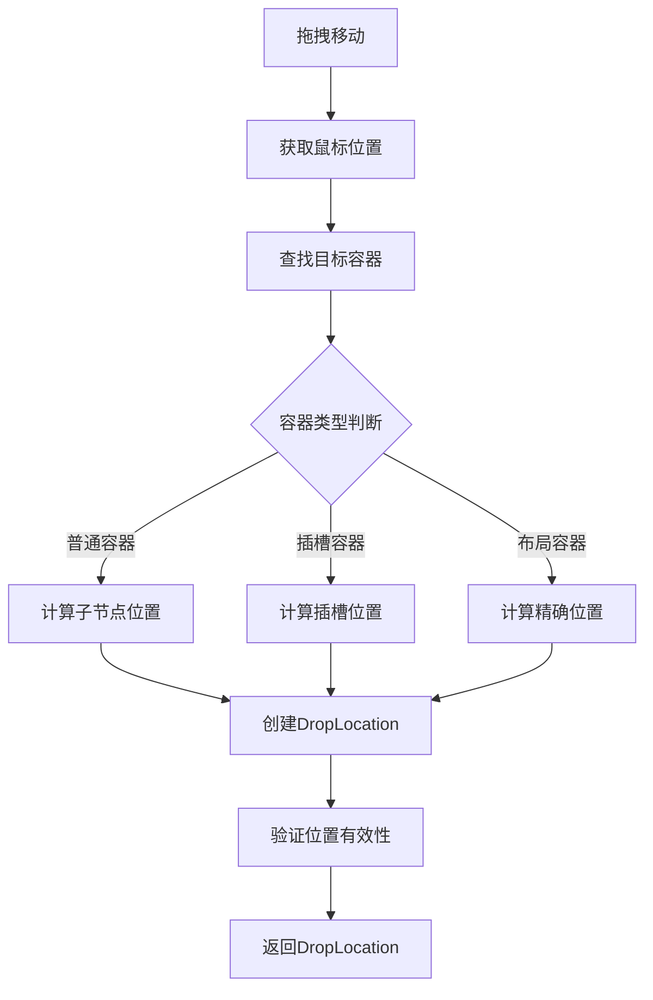

# DropLocation - 投放位置模型详解

## 1. 模型概述

`DropLocation` 是低代码引擎中描述拖拽投放位置的模型。当用户拖拽组件时，DropLocation 精确地定义了组件将要被放置的位置，包括目标容器、插入索引、相对位置等信息。它是拖拽系统中的关键模型，确保组件能够准确地放置到用户期望的位置。

## 2. 核心属性

### 2.1 基础属性

```typescript
interface IPublicModelDropLocation {
  // 目标容器节点
  target: IPublicModelNode;

  // 位置详情
  detail: IPublicTypeLocationDetail;

  // 来源标识（哪个传感器产生的）
  source: string;

  // 触发事件
  event: ILocateEvent;

  // 文档模型
  document?: IPublicModelDocumentModel;
}
```

### 2.2 位置详情类型

```typescript
// 位置详情联合类型
type IPublicTypeLocationDetail =
  | IPublicTypeLocationChildrenDetail    // 子节点位置
  | IPublicTypeLocationPropDetail        // 属性位置（如插槽）
  | IPublicTypeRectDetail               // 矩形区域位置
  | IPublicTypeLocationPositionDetail;   // 精确坐标位置

// 位置详情类型枚举
enum IPublicTypeLocationDetailType {
  Children = 'Children',     // 作为子节点
  Prop = 'Prop',            // 作为属性（插槽）
  Rect = 'Rect',            // 矩形区域
  Position = 'Position'      // 精确位置
}
```

### 2.3 子节点位置详情

```typescript
interface IPublicTypeLocationChildrenDetail {
  // 类型标识
  type: IPublicTypeLocationDetailType.Children;

  // 插入索引
  index: number | null;

  // 是否有效
  valid?: boolean;

  // 边缘信息
  edge?: {
    prev?: IRect;    // 前一个节点的矩形
    next?: IRect;    // 下一个节点的矩形
  };

  // 焦点信息（用于特殊容器如Slot）
  focus?: {
    type: 'slots' | 'content';
    slotName?: string;
  };
}
```

### 2.4 属性位置详情

```typescript
interface IPublicTypeLocationPropDetail {
  // 类型标识
  type: IPublicTypeLocationDetailType.Prop;

  // 属性名（通常是插槽名）
  name: string;

  // 插槽索引
  index?: number;

  // 嵌套路径
  path?: string[];

  // 是否有效
  valid?: boolean;
}
```

### 2.5 精确位置详情

```typescript
interface IPublicTypeLocationPositionDetail {
  // 类型标识
  type: IPublicTypeLocationDetailType.Position;

  // X坐标
  x: number;

  // Y坐标
  y: number;

  // 相对于目标的位置
  position: 'before' | 'after' | 'inner';

  // 对齐方式
  align?: 'start' | 'center' | 'end';
}
```

## 3. 核心方法

### 3.1 位置创建

```typescript
// 创建子节点位置
function createChildrenLocation(
  target: IPublicModelNode,
  index: number,
  event: ILocateEvent
): IPublicModelDropLocation {
  return {
    target,
    detail: {
      type: IPublicTypeLocationDetailType.Children,
      index,
      valid: true
    },
    source: 'simulator',
    event
  };
}

// 创建插槽位置
function createPropLocation(
  target: IPublicModelNode,
  propName: string,
  event: ILocateEvent
): IPublicModelDropLocation {
  return {
    target,
    detail: {
      type: IPublicTypeLocationDetailType.Prop,
      name: propName,
      valid: true
    },
    source: 'simulator',
    event
  };
}
```

### 3.2 位置验证

```typescript
// 验证投放位置
function validateDropLocation(
  location: IPublicModelDropLocation,
  dragObject: IPublicModelDragObject
): boolean {
  const { target, detail } = location;

  // 检查目标是否可接受
  if (!target.canAccept(dragObject)) {
    return false;
  }

  // 检查位置详情
  if (!detail.valid) {
    return false;
  }

  // 检查嵌套规则
  if (isDragNodeObject(dragObject)) {
    for (const node of dragObject.nodes) {
      if (!checkNesting(node, target)) {
        return false;
      }
    }
  }

  return true;
}
```

### 3.3 位置计算

```typescript
// 计算最近的插入位置
function calculateNearestLocation(
  container: IPublicModelNode,
  point: { x: number; y: number }
): IPublicTypeLocationChildrenDetail {
  const children = container.children;
  let minDistance = Infinity;
  let nearestIndex = 0;

  children.forEach((child, index) => {
    const rect = child.getRect();
    const distance = getDistanceToRect(point, rect);

    if (distance < minDistance) {
      minDistance = distance;
      nearestIndex = index;
    }
  });

  // 判断是插入到前面还是后面
  const nearestChild = children.get(nearestIndex);
  const rect = nearestChild?.getRect();

  if (rect && point.y > rect.top + rect.height / 2) {
    nearestIndex++;
  }

  return {
    type: IPublicTypeLocationDetailType.Children,
    index: nearestIndex,
    valid: true
  };
}
```

## 4. 核心原理

### 4.1 位置定位流程



### 4.2 位置计算算法

```typescript
// 边缘检测算法
class EdgeDetector {
  detectEdge(
    container: IPublicModelNode,
    point: { x: number; y: number }
  ): IPublicTypeLocationChildrenDetail {
    const children = container.children;
    const edges: Array<{ index: number; distance: number }> = [];

    // 计算到每个边缘的距离
    children.forEach((child, index) => {
      const rect = child.getRect();

      // 顶部边缘
      edges.push({
        index,
        distance: Math.abs(point.y - rect.top)
      });

      // 底部边缘
      edges.push({
        index: index + 1,
        distance: Math.abs(point.y - rect.bottom)
      });
    });

    // 找到最近的边缘
    const nearest = edges.reduce((min, edge) =>
      edge.distance < min.distance ? edge : min
    );

    return {
      type: IPublicTypeLocationDetailType.Children,
      index: nearest.index,
      valid: true
    };
  }
}
```

### 4.3 位置优先级

```typescript
// 位置优先级判断
class LocationPriority {
  // 获取位置优先级分数
  getScore(location: IPublicModelDropLocation): number {
    const { detail } = location;

    switch (detail.type) {
      case IPublicTypeLocationDetailType.Children:
        // 精确索引位置优先级最高
        return detail.index !== null ? 100 : 50;

      case IPublicTypeLocationDetailType.Prop:
        // 插槽位置优先级较高
        return 80;

      case IPublicTypeLocationDetailType.Position:
        // 坐标位置优先级中等
        return 60;

      case IPublicTypeLocationDetailType.Rect:
        // 区域位置优先级较低
        return 40;

      default:
        return 0;
    }
  }

  // 选择最佳位置
  chooseBest(locations: IPublicModelDropLocation[]): IPublicModelDropLocation | null {
    if (locations.length === 0) return null;

    return locations.reduce((best, location) =>
      this.getScore(location) > this.getScore(best) ? location : best
    );
  }
}
```

## 5. 使用场景

### 5.1 普通容器投放

```typescript
// 向普通容器投放
const location: IPublicModelDropLocation = {
  target: containerNode,
  detail: {
    type: IPublicTypeLocationDetailType.Children,
    index: 2,  // 插入到第3个位置
    valid: true
  },
  source: 'simulator',
  event: dragEvent
};

// 执行投放
if (validateDropLocation(location, dragObject)) {
  insertNodes(location, dragObject);
}
```

### 5.2 插槽投放

```typescript
// 向插槽投放
const slotLocation: IPublicModelDropLocation = {
  target: tabNode,
  detail: {
    type: IPublicTypeLocationDetailType.Prop,
    name: 'content',  // 插槽名称
    index: 0,         // 插槽内的位置
    valid: true
  },
  source: 'simulator',
  event: dragEvent
};
```

### 5.3 精确位置投放

```typescript
// 自由布局的精确位置投放
const positionLocation: IPublicModelDropLocation = {
  target: canvasNode,
  detail: {
    type: IPublicTypeLocationDetailType.Position,
    x: 100,
    y: 200,
    position: 'inner',
    align: 'start'
  },
  source: 'canvas-sensor',
  event: dragEvent
};
```

## 6. 与其他模型的关系

### 6.1 与 Dragon 的关系
- Dragon 在拖拽过程中创建 DropLocation
- DropLocation 指导 Dragon 完成投放
- Dragon 验证 DropLocation 的有效性

### 6.2 与 Node 的关系
- DropLocation 的 target 是 Node
- Node 决定是否接受投放
- 投放完成后更新 Node 结构

### 6.3 与 Sensor 的关系
- Sensor 负责计算 DropLocation
- 不同 Sensor 产生不同类型的 DropLocation
- DropLocation 记录来源 Sensor

## 7. 高级特性

### 7.1 智能位置推荐

```typescript
// 智能推荐投放位置
class SmartLocationRecommender {
  recommend(
    dragObject: IPublicModelDragObject,
    container: IPublicModelNode,
    point: { x: number; y: number }
  ): IPublicModelDropLocation[] {
    const recommendations: IPublicModelDropLocation[] = [];

    // 1. 基于组件类型推荐
    if (this.isFormField(dragObject)) {
      // 推荐表单容器
      const formNodes = this.findFormContainers(container);
      formNodes.forEach(form => {
        recommendations.push(this.createFormLocation(form, dragObject));
      });
    }

    // 2. 基于布局推荐
    if (this.isLayoutComponent(dragObject)) {
      // 推荐根容器或大容器
      recommendations.push(this.createRootLocation(container));
    }

    // 3. 基于使用习惯推荐
    const history = this.getUsageHistory(dragObject);
    history.forEach(pattern => {
      const location = this.createHistoryBasedLocation(pattern, container);
      if (location) recommendations.push(location);
    });

    return recommendations;
  }
}
```

### 7.2 位置约束

```typescript
// 位置约束管理
class LocationConstraints {
  private constraints: Map<string, ILocationConstraint> = new Map();

  // 添加约束
  addConstraint(
    componentName: string,
    constraint: ILocationConstraint
  ) {
    this.constraints.set(componentName, constraint);
  }

  // 应用约束
  applyConstraints(
    location: IPublicModelDropLocation,
    dragObject: IPublicModelDragObject
  ): IPublicModelDropLocation {
    const componentName = this.getComponentName(dragObject);
    const constraint = this.constraints.get(componentName);

    if (!constraint) return location;

    // 应用索引约束
    if (constraint.maxIndex !== undefined) {
      const detail = location.detail as IPublicTypeLocationChildrenDetail;
      if (detail.index > constraint.maxIndex) {
        detail.index = constraint.maxIndex;
      }
    }

    // 应用位置约束
    if (constraint.allowedPositions) {
      const detail = location.detail as IPublicTypeLocationPositionDetail;
      if (!constraint.allowedPositions.includes(detail.position)) {
        detail.position = constraint.allowedPositions[0];
      }
    }

    return location;
  }
}
```

### 7.3 位置预览

```typescript
// 位置预览渲染
class LocationPreview {
  private previewElement?: HTMLElement;

  show(location: IPublicModelDropLocation) {
    // 清除之前的预览
    this.hide();

    // 创建预览元素
    this.previewElement = this.createPreviewElement(location);

    // 定位预览元素
    this.positionPreview(location);

    // 添加到DOM
    document.body.appendChild(this.previewElement);
  }

  private createPreviewElement(location: IPublicModelDropLocation): HTMLElement {
    const element = document.createElement('div');
    element.className = 'drop-location-preview';

    const { detail } = location;

    if (detail.type === IPublicTypeLocationDetailType.Children) {
      // 显示插入线
      element.classList.add('insert-line');
    } else if (detail.type === IPublicTypeLocationDetailType.Prop) {
      // 显示插槽区域
      element.classList.add('slot-area');
      element.textContent = `插槽: ${detail.name}`;
    }

    return element;
  }

  hide() {
    this.previewElement?.remove();
    this.previewElement = undefined;
  }
}
```

## 8. 注意事项

### 8.1 性能优化
- 缓存位置计算结果
- 避免频繁的DOM查询
- 使用防抖处理位置更新

### 8.2 准确性保证
- 考虑滚动偏移
- 处理缩放情况
- 考虑元素变换

### 8.3 兼容性处理
- 处理不同容器类型
- 支持自定义位置类型
- 处理跨iframe情况

## 9. 最佳实践

### 9.1 位置计算优化

```typescript
// 优化的位置计算器
class OptimizedLocationCalculator {
  private cache = new Map<string, IPublicModelDropLocation>();
  private lastPoint?: { x: number; y: number };
  private threshold = 5; // 移动阈值

  calculate(
    container: IPublicModelNode,
    point: { x: number; y: number },
    dragObject: IPublicModelDragObject
  ): IPublicModelDropLocation | null {
    // 检查是否需要重新计算
    if (this.lastPoint &&
        Math.abs(point.x - this.lastPoint.x) < this.threshold &&
        Math.abs(point.y - this.lastPoint.y) < this.threshold) {
      // 使用缓存结果
      const cacheKey = this.getCacheKey(container, point);
      return this.cache.get(cacheKey) || null;
    }

    // 执行计算
    const location = this.doCalculate(container, point, dragObject);

    // 更新缓存
    if (location) {
      const cacheKey = this.getCacheKey(container, point);
      this.cache.set(cacheKey, location);
    }

    this.lastPoint = point;
    return location;
  }
}
```

### 9.2 错误处理

```typescript
// 安全的位置处理
class SafeLocationHandler {
  handleDrop(
    location: IPublicModelDropLocation,
    dragObject: IPublicModelDragObject
  ): boolean {
    try {
      // 验证位置
      if (!this.validateLocation(location)) {
        console.warn('Invalid drop location');
        return false;
      }

      // 验证目标
      if (!this.validateTarget(location.target)) {
        console.warn('Invalid drop target');
        return false;
      }

      // 执行投放
      return this.executeDrop(location, dragObject);

    } catch (error) {
      console.error('Drop failed:', error);
      this.rollback(location);
      return false;
    }
  }

  private rollback(location: IPublicModelDropLocation) {
    // 回滚操作
    location.target.document?.history.undo();
  }
}
```

### 9.3 测试支持

```typescript
// 位置测试辅助
class LocationTestHelper {
  // 创建测试位置
  createTestLocation(
    options: Partial<IPublicModelDropLocation>
  ): IPublicModelDropLocation {
    return {
      target: options.target || this.createMockNode(),
      detail: options.detail || {
        type: IPublicTypeLocationDetailType.Children,
        index: 0,
        valid: true
      },
      source: options.source || 'test',
      event: options.event || this.createMockEvent()
    };
  }

  // 验证位置相等
  assertLocationEqual(
    actual: IPublicModelDropLocation,
    expected: IPublicModelDropLocation
  ) {
    expect(actual.target.id).toBe(expected.target.id);
    expect(actual.detail).toEqual(expected.detail);
    expect(actual.source).toBe(expected.source);
  }
}
```
