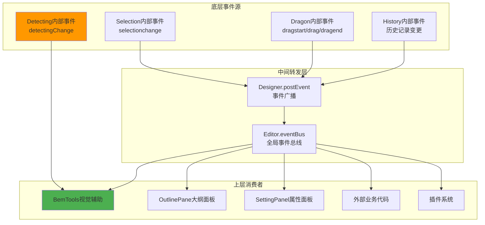

# 低代码引擎完整事件列表更新补充

## 🔍 发现的遗漏事件

### 1. `detectingChange` 事件 ⚠️ **重要遗漏**

**定义位置**: `packages/designer/src/designer/detecting.ts`
**事件常量**: `DETECTING_CHANGE_EVENT = 'detectingChange'`

```typescript
// 事件触发位置
capture(node) {
  if (this._current !== node) {
    this._current = node;
    this.emitter.emit(DETECTING_CHANGE_EVENT, this.current);
  }
}

release(node) {
  if (this._current === node) {
    this._current = null;
    this.emitter.emit(DETECTING_CHANGE_EVENT, this.current);
  }
}
```

**事件用途**:
- 鼠标悬停节点变化时触发
- 主要被 `BorderDetecting` 组件监听
- 用于显示悬停边框和组件信息
- 与大纲面板的悬停同步

### 2. `selectionchange` 与 `selection.change` 的区别

**两个不同层级的选择事件**:

| 事件名 | 触发层级 | 数据格式 | 用途 |
|-------|---------|----------|------|
| `selectionchange` | Selection模块内部 | `string[]` (节点ID数组) | 底层状态变更 |
| `selection.change` | Designer层广播 | `Selection实例` | 上层业务通知 |

```typescript
// selectionchange - Selection模块内部
Selection.select(id) {
  this._selected = [id];
  this.emitter.emit('selectionchange', this._selected);
}

// selection.change - Designer层转发
Designer.setupSelection() {
  currentSelection.onSelectionChange(() => {
    this.postEvent('selection.change', currentSelection);
  });
}
```

## 📊 完整事件层级架构



## 🔧 监听方式对比

### 底层事件监听（直接）
```typescript
// 直接监听 Selection 内部事件
currentDocument.selection.emitter.on('selectionchange', (selectedIds) => {
  console.log('底层选择变化:', selectedIds);
});

// 直接监听 Detecting 内部事件
designer.detecting.onDetectingChange((node) => {
  console.log('悬停变化:', node?.componentName);
});
```

### 上层事件监听（广播）
```typescript
// 监听 Designer 广播的事件
editor.eventBus.on('selection.change', (selection) => {
  console.log('上层选择变化:', selection.selected);
});

// 监听 Editor 全局事件
editor.eventBus.on('dragstart', (e) => {
  console.log('全局拖拽开始:', e);
});
```

## 🎯 事件使用场景

### BemTools 中的事件使用

```typescript
// BorderDetecting 组件响应悬停事件
@computed get current() {
  var current = host.designer.detecting.current;

  // 如果已选中则不显示悬停边框
  if (!current || selection.has(current.id)) {
    return null;
  }

  return current;
}
```

### 大纲面板的事件同步

```typescript
// TreeView 悬停时同步触发检测
hover(e) {
  var detecting = project.currentDocument?.detecting;
  var node = this.getTreeNodeFromEvent(e)?.node;

  // 直接调用 detecting.capture 触发 detectingChange 事件
  node?.id && detecting?.capture(node.id);
}
```

## ⚡ 性能优化建议

### 1. 事件频率控制
```typescript
// 高频事件需要节流
import { throttle } from 'lodash';

const throttledDetectingHandler = throttle((node) => {
  // 处理悬停变化
  this.updateHoverUI(node);
}, 16); // 60fps

designer.detecting.onDetectingChange(throttledDetectingHandler);
```

### 2. 条件性监听
```typescript
// 只在设计模式下监听某些事件
if (engineConfig.get('designMode') === 'design') {
  designer.detecting.onDetectingChange(this.handleHover);
}

// 拖拽时暂停悬停检测
designer.dragon.onDragstart(() => {
  designer.detecting.enable = false;
});

designer.dragon.onDragend(() => {
  designer.detecting.enable = true;
});
```

## 🔍 其他可能遗漏的事件检查

基于源码分析，还需要确认是否遗漏了以下事件：

### History 相关事件
- `history.stateChange` - 历史状态变化
- `history.savePoint` - 保存点设置

### ActiveTracker 相关事件
- `activeTracker.change` - 活跃节点跟踪变化

### ComponentMeta 相关事件
- `metadata.change` - 组件元数据变化

### Simulator 生命周期事件
- `simulator.ready` - 模拟器就绪
- `simulator.mount` - 模拟器挂载

## 📋 检查清单

- [x] `detectingChange` 事件已补充
- [x] `selectionchange` vs `selection.change` 已澄清
- [x] 监听示例代码已更新
- [x] 调试工具已包含新事件
- [ ] 需要进一步确认 History/ActiveTracker 相关事件
- [ ] 需要验证 ComponentMeta 变更事件
- [ ] 需要确认 Simulator 生命周期事件

## 📝 总结

1. **`detectingChange` 是一个重要的遗漏事件**，负责悬停检测功能
2. **需要区分底层事件和广播事件**，它们服务于不同的使用场景
3. **BemTools 大量依赖 `detectingChange` 事件**来提供视觉反馈
4. **事件系统采用分层架构**，底层触发，中层转发，上层消费

感谢您的提醒，这确保了事件列表的完整性和准确性！
