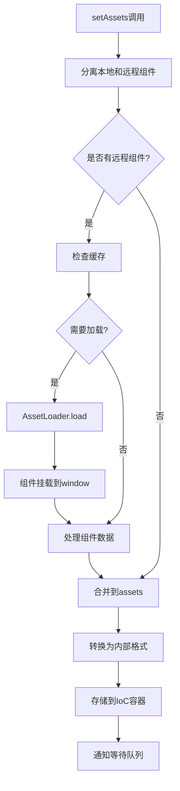
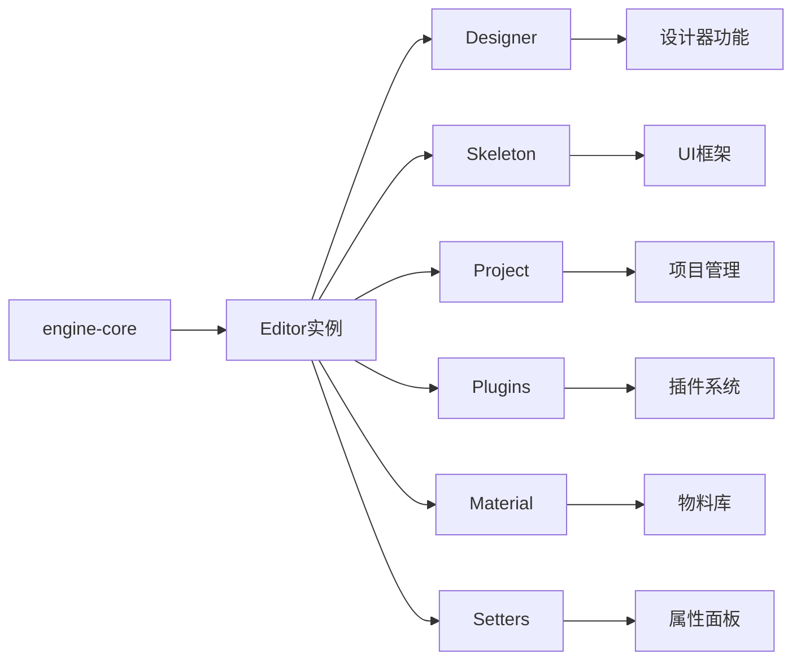

# Editor 核心类详解

## 一、文件位置与作用

**文件路径**: `packages/editor-core/src/editor.ts`

**核心作用**: Editor 类是整个低代码引擎的核心管理器，扮演着"总控中心"的角色。

## 二、主要职责

### 1. IoC 容器（控制反转容器）
- **功能**: 管理所有服务实例的注册和获取
- **实现**: 使用 Map 结构存储各种服务实例
- **服务类型**:
  - `designer` - 设计器实例
  - `skeleton` - 骨架屏（UI框架）实例
  - `project` - 项目管理实例
  - `simulator` - 模拟器实例
  - `plugins` - 插件管理器
  - `setters` - 属性设置器
  - `material` - 物料管理器
  - `assets` - 资源包（组件库等）

### 2. 事件中心
- **功能**: 提供全局事件的发布和订阅机制
- **实现**: 继承自 Node.js 的 EventEmitter
- **事件类型**:
  - `editor.beforeInit` - 初始化前
  - `editor.afterInit` - 初始化后
  - 自定义事件通过 eventBus 发布

### 3. 资源管理
- **功能**: 处理组件资源的加载和缓存
- **特点**:
  - 支持本地组件和远程组件
  - 远程组件自动异步加载
  - 实现版本缓存机制
  - 自动处理组件依赖

### 4. 生命周期管理
- **功能**: 管理编辑器的初始化和销毁过程
- **钩子函数**: 支持在不同生命周期阶段注册回调
- **生命周期**:
  - `init` - 初始化阶段
  - `destroy` - 销毁阶段

## 三、核心方法详解

### 1. 服务管理方法

```typescript
// 注册服务
editor.set('designer', designerInstance);

// 获取服务
const designer = editor.get('designer');

// 检查服务是否存在
if (editor.has('designer')) {
  // ...
}
```

### 2. 异步服务获取

```typescript
// 等待服务注册（一次性）
const designer = await editor.onceGot('designer');

// 持续监听服务
const dispose = editor.onGot('designer', (designer) => {
  // 每次服务更新都会调用
});

// 仅监听变化（不立即调用）
const dispose = editor.onChange('designer', (designer) => {
  // 只在后续更新时调用
});
```

### 3. 资源管理

```typescript
// 设置资源包
await editor.setAssets({
  components: [...],  // 组件列表
  componentList: [...],  // 组件清单
});
```

### 4. 钩子管理

```typescript
// 注册钩子函数
editor.registerHooks([
  {
    message: 'editor.init',
    type: 'on',
    handler: (editor) => {
      // 处理逻辑
    }
  }
]);
```

## 四、黑名单机制

Editor 使用黑名单机制来区分配置项和运行时实例：

```typescript
const keyBlacklist = [
  'designer',      // 设计器实例
  'skeleton',      // 骨架屏实例
  'currentDocument', // 当前文档实例
  'simulator',     // 模拟器实例
  'plugins',       // 插件管理器实例
  'setters',       // 设置器管理器实例
  'material',      // 物料管理器实例
  'innerHotkey',   // 内部快捷键管理器
  'innerPlugins',  // 内部插件管理器
];
```

黑名单中的键不会被持久化到 `engineConfig` 中，因为它们是运行时创建的实例，而非配置项。

## 五、等待队列机制

Editor 实现了一个巧妙的等待队列机制：

```typescript
private waits = new Map<
  IPublicTypeEditorValueKey,
  Array<{
    once?: boolean;  // 是否只执行一次
    resolve: (data: any) => void;  // 回调函数
  }>
>();
```

**工作原理**：
1. 当请求的服务尚未注册时，回调函数会被加入等待队列
2. 当服务被注册时，通过 `notifyGot` 通知所有等待的回调
3. 支持一次性回调和持续监听两种模式

## 六、远程组件加载流程



## 七、在引擎中的地位



## 八、使用示例

```typescript
// 引擎初始化时
const editor = new Editor();

// 注册全局上下文
globalContext.register(editor, Editor);
globalContext.register(editor, 'editor');

// 注册各种服务
editor.set('skeleton', innerSkeleton);
editor.set('designer', designer);
editor.set('project', project);
editor.set('plugins', plugins);

// 初始化编辑器
await editor.init(config, components);

// 设置资源
await editor.set('assets', assetsData);

// 销毁时清理
editor.destroy();
```

## 九、注意事项

1. **单例模式**: Editor 在整个引擎中是单例的，全局只有一个实例
2. **异步处理**: 资源加载等操作是异步的，需要使用 Promise 或 async/await
3. **内存管理**: 使用完监听器后要及时调用返回的 dispose 函数清理
4. **版本控制**: 远程组件支持版本管理，会自动检查版本更新
5. **响应式**: 使用 MobX 的 @obx.shallow 装饰器，实现浅层响应式

## 十、总结

Editor 类是低代码引擎的核心基础设施，提供了：
- **服务注册与发现** - IoC 容器功能
- **事件驱动架构** - 全局事件中心
- **资源管理能力** - 组件库加载和缓存
- **生命周期控制** - 初始化和销毁管理
- **异步协调机制** - 等待队列和Promise支持

它是连接引擎各个模块的枢纽，确保各个子系统能够协同工作。
