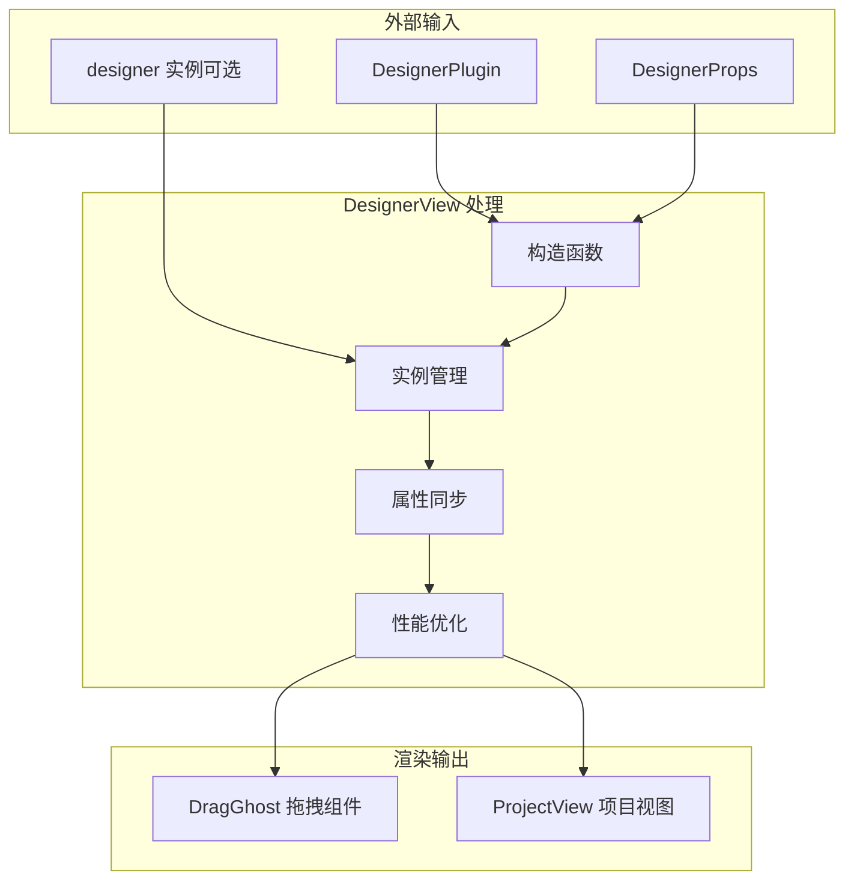
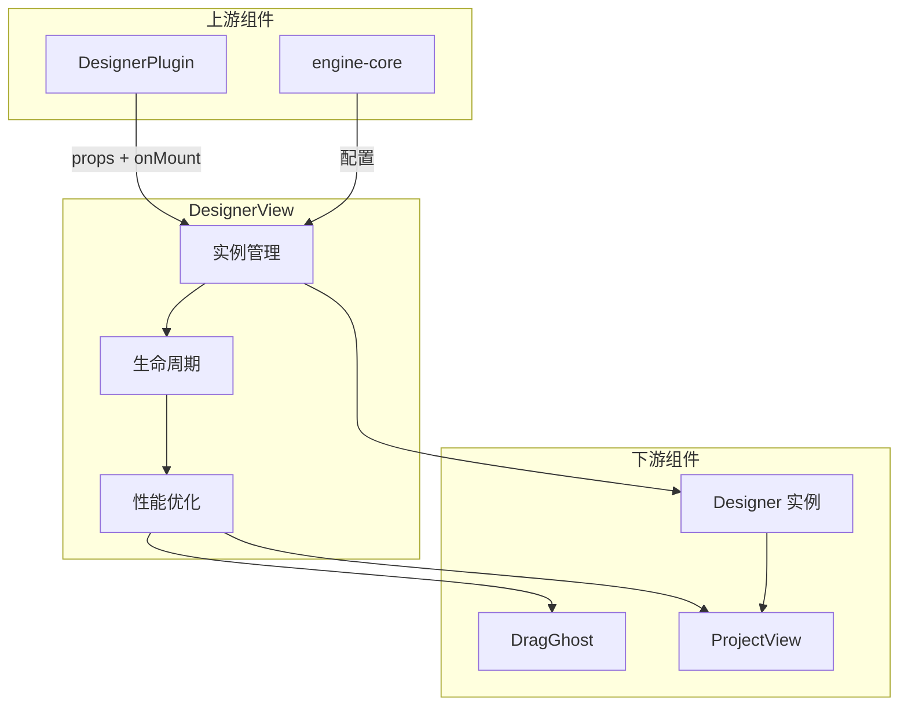

# DesignerView 详解

## 一、主要职责

`DesignerView` 是低代码引擎中的**设计器视图容器组件**，它的主要职责包括：

### 🏗️ **1. 视图容器管理**
- **UI 框架搭建**：提供设计器的主要 UI 结构和布局框架
- **样式容器**：管理设计器的根容器样式和主题
- **组件组合**：将拖拽组件和项目视图组合成完整的设计界面

### 🎛️ **2. Designer 实例管理**
- **实例生命周期**：创建、配置、管理 Designer 核心实例
- **实例复用**：支持热更新和实例传递场景
- **属性同步**：确保外部属性变化与设计器实例保持同步

### 🎨 **3. 交互体验增强**
- **拖拽反馈**：集成拖拽幽灵组件，提供可视化拖拽体验
- **性能优化**：通过精确的重渲染控制提升界面响应速度
- **事件协调**：处理组件挂载和生命周期事件

### 📋 **4. 项目内容展示**
- **内容渲染**：通过 ProjectView 渲染具体的项目设计内容
- **画布管理**：提供设计画布和编辑区域的容器
- **交互处理**：支持设计时的各种用户交互操作

---

## 二、核心架构分析

### 🔄 **组件层次结构**

```
DesignerView (容器组件)
├── DragGhost (拖拽幽灵组件)
│   ├── 拖拽预览效果
│   ├── 视觉反馈指示
│   └── 鼠标跟随动画
└── ProjectView (项目视图组件)
    ├── 画布区域
    ├── 模拟器界面
    ├── 组件编辑区
    └── 交互控制层
```

### 📊 **数据流向**



---

## 三、核心功能模块

### 🚀 **1. 构造函数（实例管理决策）**

#### **关键决策逻辑**：
```typescript
if (designer) {
    // 复用场景：热更新、实例传递
    this.designer = designer;
    designer.setProps(designerProps);
} else {
    // 创建场景：首次初始化
    this.designer = new Designer(designerProps);
}
```

#### **使用场景对比**：

| 场景 | 传入 designer | 处理方式 | 适用情况 |
|------|---------------|----------|----------|
| **首次创建** | `undefined` | `new Designer()` | 标准初始化流程 |
| **热更新** | 现有实例 | 复用 + `setProps` | 开发调试、配置更新 |
| **实例传递** | 外部实例 | 直接复用 | 跨组件共享设计器 |

### 🎯 **2. shouldComponentUpdate（性能优化）**

#### **优化策略**：
```typescript
// 🔥 关键：始终同步属性，但精确控制重渲染
this.designer.setProps(nextProps);

// 只有影响 UI 的属性变化才重新渲染
if (
    nextProps.className !== props.className ||
    nextProps.style !== props.style ||
    nextProps.dragGhostComponent !== props.dragGhostComponent
) {
    return true; // 需要重新渲染
}
return false; // 跳过重新渲染
```

#### **性能收益分析**：

| 属性类型 | 是否触发重渲染 | 原因 | 性能影响 |
|----------|---------------|------|----------|
| **className** | ✅ | 影响根容器样式 | 低 |
| **style** | ✅ | 影响根容器样式 | 低 |
| **dragGhostComponent** | ✅ | 影响拖拽组件渲染 | 中 |
| **其他配置属性** | ❌ | 通过 setProps 同步给实例 | **高性能收益** |

### 📡 **3. componentDidMount（挂载处理）**

#### **核心职责**：
```typescript
// 1. 执行外部回调（重要：连接到 DesignerPlugin）
if (onMount) {
    onMount(this.designer); // 🔥 触发 DesignerPlugin.handleDesignerMount
}

// 2. 发出内部事件（设计器系统内部通知）
this.designer.postEvent('mount', this.designer);
```

#### **事件链分析**：
```
DesignerView.componentDidMount()
    ↓
onMount(designer) 回调
    ↓
DesignerPlugin.handleDesignerMount()
    ↓
editor.set('designer', designer) + editor.eventBus.emit('designer.ready')
    ↓
其他组件接收 'designer.ready' 事件
```

### 🎨 **4. render（视图渲染）**

#### **渲染结构**：
```tsx
<div className="lc-designer + custom">
    {/* 拖拽层：提供拖拽时的视觉反馈 */}
    <DragGhost designer={this.designer} />

    {/* 内容层：实际的设计项目内容 */}
    <ProjectView designer={this.designer} />
</div>
```

#### **组件职责划分**：

| 组件 | 主要功能 | 渲染层级 | 交互类型 |
|------|----------|----------|----------|
| **DragGhost** | 拖拽幽灵效果 | 覆盖层 | 视觉反馈 |
| **ProjectView** | 项目内容展示 | 基础层 | 核心交互 |

---

## 四、关键设计模式

### 🎯 **1. 适配器模式（Adapter Pattern）**
- **目标接口**：React 组件生命周期
- **源接口**：Designer 实例管理
- **适配器**：DesignerView 的生命周期方法
- **好处**：将设计器实例无缝集成到 React 组件系统

### 🏭 **2. 组合模式（Composite Pattern）**
- **组合容器**：DesignerView
- **子组件**：DragGhost + ProjectView
- **统一接口**：通过 designer 实例传递
- **好处**：灵活的 UI 组合和扩展能力

### 🔧 **3. 策略模式（Strategy Pattern）**
- **策略接口**：拖拽组件接口
- **具体策略**：BuiltinDragGhostComponent vs 自定义组件
- **上下文**：DesignerView 选择使用哪个拖拽组件
- **好处**：拖拽体验的可定制性

### 🎛️ **4. 单例模式（Singleton Pattern）**
- **单例对象**：Designer 实例（在组件生命周期内）
- **访问控制**：通过 readonly 属性确保不可变
- **好处**：确保设计器状态的一致性

---

## 五、性能优化策略

### ⚡ **1. 精确重渲染控制**

```typescript
// ✅ 好的做法：精确判断重渲染必要性
shouldComponentUpdate(nextProps) {
    // 总是同步属性到设计器实例
    this.designer.setProps(nextProps);

    // 只有 UI 相关属性变化才重新渲染
    return uiRelatedPropsChanged;
}
```

### 🔄 **2. 实例复用机制**

```typescript
// ✅ 支持实例复用，避免重复创建开销
if (designer) {
    this.designer = designer; // 复用现有实例
} else {
    this.designer = new Designer(designerProps); // 按需创建
}
```

### 🎯 **3. 只读属性设计**

```typescript
// ✅ readonly 确保实例稳定性，避免意外修改
readonly designer: Designer;
readonly viewName: string | undefined;
```

---

## 六、与其他组件的关系

### 🔗 **组件关系图**



### 📋 **调用链分析**

1. **初始化链**：
   ```
   engine.init() → DesignerPlugin → DesignerView → Designer 实例
   ```

2. **事件链**：
   ```
   DesignerView.componentDidMount() → onMount 回调 → DesignerPlugin.handleDesignerMount()
   ```

3. **更新链**：
   ```
   外部属性变化 → shouldComponentUpdate → designer.setProps() → 内部状态更新
   ```

---

## 七、使用场景与最佳实践

### 🎯 **典型使用场景**

#### **场景 1：标准初始化**
```tsx
<DesignerView
    className="my-designer"
    componentMetadatas={components}
    simulatorProps={simulatorConfig}
    onMount={handleMount}
/>
```

#### **场景 2：实例复用（热更新）**
```tsx
<DesignerView
    designer={existingDesigner} // 复用现有实例
    className="my-designer"
    // ... 其他属性
/>
```

#### **场景 3：自定义拖拽组件**
```tsx
<DesignerView
    dragGhostComponent={CustomDragGhost} // 自定义拖拽效果
    // ... 其他属性
/>
```

### ✅ **最佳实践**

1. **合理使用实例复用**：
   - 开发模式下使用复用避免重复初始化
   - 生产模式下建议重新创建确保状态干净

2. **正确处理 onMount 回调**：
   - 确保在 onMount 中完成必要的设计器注册
   - 避免在 onMount 中执行重型操作

3. **性能优化考虑**：
   - 避免频繁传递变化的对象作为 props
   - 合理使用 className 和 style 属性

### ⚠️ **注意事项**

1. **生命周期兼容性**：
   - `UNSAFE_componentWillMount` 在新版 React 中已废弃
   - 建议迁移到 `constructor` 或 `componentDidMount`

2. **实例管理**：
   - Designer 实例是 readonly，避免外部修改
   - 通过 setProps 同步属性，而非直接修改实例

3. **内存管理**：
   - 确保组件卸载时正确清理设计器实例
   - 避免事件监听器泄漏

---

## 八、总结

`DesignerView` 是低代码引擎中的**核心视图容器组件**，它通过精心设计的架构实现了：

- 🏗️ **结构化设计**：清晰的组件层次和职责划分
- ⚡ **性能优化**：精确的重渲染控制和实例复用机制
- 🎨 **用户体验**：流畅的拖拽交互和视觉反馈
- 🔧 **可扩展性**：支持自定义拖拽组件和灵活配置
- 🔗 **系统集成**：与引擎其他部分的无缝协作

这种设计不仅提供了稳定、高效的设计器视图基础，也为复杂的低代码编辑功能奠定了坚实的架构基础。
