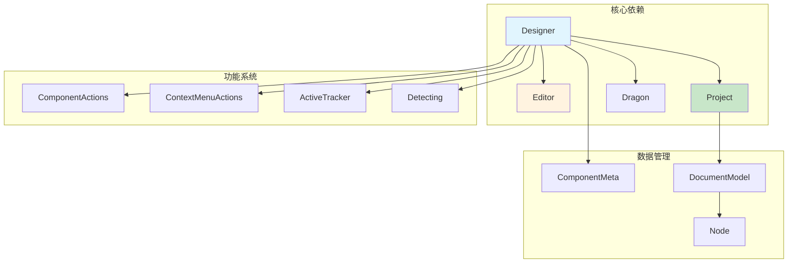
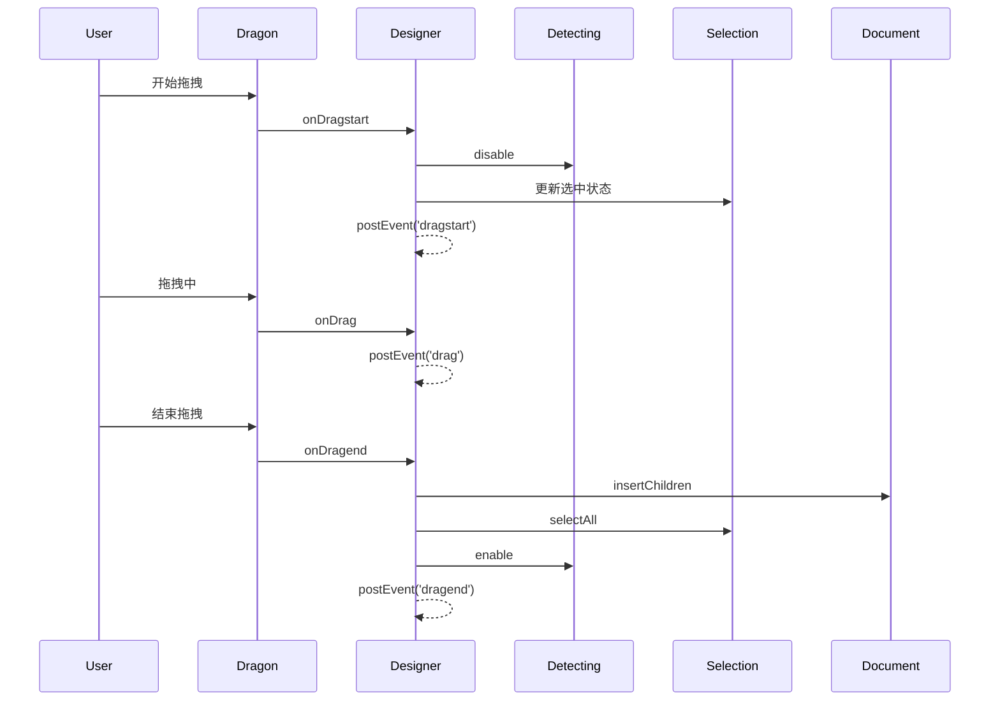
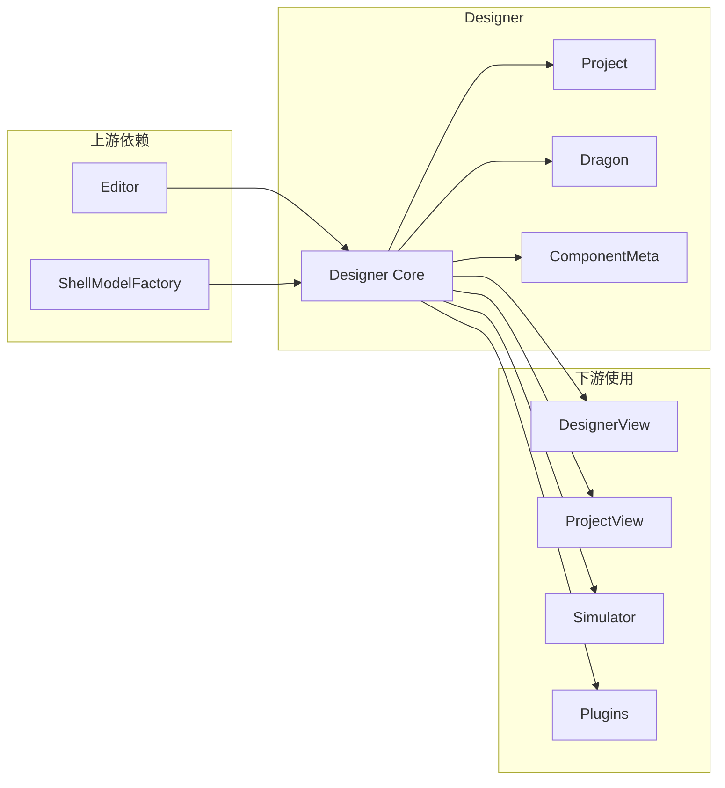
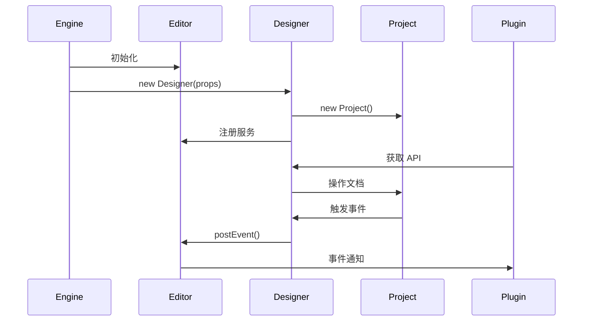

# Designer 核心类详解

## 一、主要职责

`Designer` 是低代码引擎的**设计器控制中心**，与 `Editor` 一起构成引擎的双核心架构。

### 🎯 **核心职责对比**

| 职责 | Designer | Editor | 说明 |
|------|----------|--------|------|
| **定位** | 设计态控制器 | 全局服务容器 | Designer 专注设计功能，Editor 提供基础服务 |
| **管理范围** | 项目、文档、节点 | 全局资源、插件、配置 | Designer 管理设计数据，Editor 管理系统资源 |
| **交互处理** | 拖拽、选择、定位 | - | Designer 负责所有用户交互 |
| **组件管理** | 组件元数据、实例 | 组件资源加载 | Designer 管理组件配置，Editor 管理资源 |
| **事件系统** | designer.* 事件 | 全局事件总线 | Designer 发送设计事件，Editor 提供事件通道 |
| **插件服务** | 提供设计器 API | 提供核心 API | 两者共同为插件提供完整 API |

---

## 二、核心架构

### 🏗️ **类的组成结构**

```typescript
export class Designer implements IDesigner {
    // === 🔥 核心系统实例 ===
    dragon: IDragon;                        // 拖拽系统
    project: IProject;                      // 项目管理
    editor: IPublicModelEditor;             // 编辑器引用

    // === 功能管理器 ===
    componentActions: ComponentActions;      // 组件动作
    contextMenuActions: IContextMenuActions; // 右键菜单
    activeTracker: ActiveTracker;           // 活动追踪
    detecting: Detecting;                   // 节点检测
    bemToolsManager: BemToolsManager;       // BEM 工具

    // === 状态管理 ===
    private _componentMetasMap: Map;        // 组件元数据
    private _simulatorComponent?: Component; // 模拟器组件
    private _simulatorProps?: object;       // 模拟器属性
    private _suspensed: boolean;            // 暂停状态

    // === 辅助系统 ===
    private propsReducers: Map;             // 属性转换器
    private oobxList: OffsetObserver[];     // 偏移观察器
    private _dropLocation?: DropLocation;    // 放置位置
}
```

### 📊 **依赖关系图**



---

## 三、核心功能模块

### 🚀 **1. 构造函数初始化流程**

```typescript
constructor(props: DesignerProps) {
    // 1. MobX 响应式设置
    makeObservable(this);

    // 2. 保存核心引用
    this.editor = editor;
    this.viewName = viewName;
    this.shellModelFactory = shellModelFactory;

    // 3. 设置属性配置
    this.setProps(props);

    // 4. 🔥 创建项目管理器
    this.project = new Project(this, props.defaultSchema, viewName);

    // 5. 🔥 创建拖拽系统
    this.dragon = new Dragon(this);

    // 6. 设置拖拽事件处理
    this.dragon.onDragstart(...);
    this.dragon.onDrag(...);
    this.dragon.onDragend(...);

    // 7. 设置活动追踪
    this.activeTracker.onChange(...);

    // 8. 设置文档变化处理
    this.project.onCurrentDocumentChange(...);

    // 9. 初始化选择和历史管理
    this.setupSelection();
    setupHistory();
}
```

### 🎨 **2. 拖拽系统管理**

#### **拖拽事件流程**


#### **关键方法**
```typescript
// 拖拽开始
onDragstart(e) {
    this.detecting.enable = false; // 禁用检测
    // 处理选中逻辑
    // 发送事件
}

// 拖拽中
onDrag(e) {
    // 触发外部回调
    this.postEvent('drag', e);
}

// 拖拽结束
onDragend(e) {
    // 插入节点
    // 选中新节点
    this.detecting.enable = true; // 恢复检测
}
```

### 📦 **3. 组件元数据管理**

#### **核心数据结构**
```typescript
// 正常组件元数据映射
private _componentMetasMap = new Map<string, IComponentMeta>();

// 丢失组件元数据缓存（组件未加载时的临时存储）
private _lostComponentMetasMap = new Map<string, ComponentMeta>();
```

#### **关键方法**
```typescript
// 创建组件元数据
createComponentMeta(data: IPublicTypeComponentMetadata): IComponentMeta | null {
    const key = data.componentName;
    let meta = this._componentMetasMap.get(key);

    if (meta) {
        meta.setMetadata(data); // 更新已存在的元数据
    } else {
        meta = this._lostComponentMetasMap.get(key);
        if (meta) {
            // 从丢失列表恢复
            meta.setMetadata(data);
            this._lostComponentMetasMap.delete(key);
        } else {
            // 创建新的元数据
            meta = new ComponentMeta(this, data);
        }
    }

    this._componentMetasMap.set(key, meta);
    return meta;
}

// 获取组件元数据
getComponentMeta(
    componentName: string,
    generateMetadata?: () => IPublicTypeComponentMetadata | null,
): IComponentMeta {
    // 优先从正常映射表获取
    if (this._componentMetasMap.has(componentName)) {
        return this._componentMetasMap.get(componentName)!;
    }

    // 其次从丢失映射表获取
    if (this._lostComponentMetasMap.has(componentName)) {
        return this._lostComponentMetasMap.get(componentName)!;
    }

    // 创建新的元数据（标记为丢失）
    const meta = new ComponentMeta(this, {
        componentName,
        ...(generateMetadata ? generateMetadata() : null),
    });

    this._lostComponentMetasMap.set(componentName, meta);
    return meta;
}
```

### 🔄 **4. 属性转换管道**

```typescript
// 属性转换器映射表
private propsReducers = new Map<IPublicEnumTransformStage, IPublicTypePropsTransducer[]>();

// 添加属性转换器
addPropsReducer(reducer: IPublicTypePropsTransducer, stage: IPublicEnumTransformStage) {
    const reducers = this.propsReducers.get(stage) || [];
    reducers.push(reducer);
    this.propsReducers.set(stage, reducers);
}

// 转换属性
transformProps(
    props: IPublicTypeCompositeObject,
    node: Node,
    stage: IPublicEnumTransformStage,
) {
    const reducers = this.propsReducers.get(stage);
    if (!reducers) return props;

    // 通过管道逐个处理
    return reducers.reduce((xprops, reducer) => {
        try {
            return reducer(xprops, node, { stage });
        } catch (e) {
            console.warn(e);
            return xprops;
        }
    }, props);
}
```

### 📡 **5. 事件系统**

```typescript
// 发送设计器事件
postEvent(event: string, ...args: any[]) {
    // 所有设计器事件都以 'designer.' 为前缀
    this.editor.eventBus.emit(`designer.${event}`, ...args);
}

// 常见事件
postEvent('init', this);                    // 初始化完成
postEvent('dragstart', e);                  // 拖拽开始
postEvent('dragend', e, loc);              // 拖拽结束
postEvent('current-document.change', doc);  // 文档切换
postEvent('selection.change', selection);   // 选择变化
postEvent('history.change', history);       // 历史变化
postEvent('dropLocation.change', loc);      // 放置位置变化
```

### 🎯 **6. 插入位置管理**

```typescript
// 创建插入位置
createLocation(locationData: IPublicTypeLocationData<INode>): DropLocation {
    const loc = new DropLocation(locationData);

    // 清理之前的位置
    if (this._dropLocation && this._dropLocation.document !== loc.document) {
        this._dropLocation.document.dropLocation = null;
    }

    this._dropLocation = loc;
    this.postEvent('dropLocation.change', loc);

    // 设置文档的放置位置
    if (loc.document) {
        loc.document.dropLocation = loc;
    }

    // 追踪活动节点
    this.activeTracker.track({ node: loc.target, detail: loc.detail });
    return loc;
}

// 清除插入位置
clearLocation() {
    if (this._dropLocation?.document) {
        this._dropLocation.document.dropLocation = null;
    }
    this.postEvent('dropLocation.change', undefined);
    this._dropLocation = undefined;
}
```

### 📚 **7. 增量资源加载**

```typescript
async loadIncrementalAssets(incrementalAssets: IPublicTypeAssetsJson): Promise<void> {
    const { components, packages } = incrementalAssets;

    // 1. 构建组件元数据
    components && this.buildComponentMetasMap(components);

    // 2. 设置模拟器组件
    if (packages) {
        await this.project.simulator?.setupComponents(packages);
    }

    // 3. 合并资源
    if (components) {
        let assets = this.editor.get('assets') || {};
        let newAssets = mergeAssets(assets, incrementalAssets);
        await this.editor.set('assets', newAssets);
    }

    // 4. 刷新组件映射
    this.refreshComponentMetasMap();

    // 5. 发送就绪事件
    this.editor.eventBus.emit('designer.incrementalAssetsReady');
}
```

---

## 四、关键设计模式

### 🎯 **1. 门面模式（Facade Pattern）**
- **作用**：为复杂的设计器子系统提供统一接口
- **体现**：Designer 类封装了拖拽、选择、项目等多个子系统

### 🏭 **2. 中介者模式（Mediator Pattern）**
- **作用**：协调多个对象之间的交互
- **体现**：Designer 协调 Dragon、Project、Selection 等组件

### 🔄 **3. 观察者模式（Observer Pattern）**
- **作用**：实现事件驱动的架构
- **体现**：通过 postEvent 和各种 onChange 回调

### 🔧 **4. 策略模式（Strategy Pattern）**
- **作用**：动态选择算法或行为
- **体现**：propsReducers 属性转换管道

---

## 五、与其他核心组件的关系

### 🔗 **依赖关系**



### 📊 **交互流程**



---

## 六、最佳实践

### ✅ **使用建议**

1. **事件监听**：优先监听设计器事件而非直接操作
2. **组件元数据**：通过 Designer 统一管理组件配置
3. **属性转换**：使用 propsReducers 处理属性逻辑
4. **资源加载**：使用 loadIncrementalAssets 动态加载

### ⚠️ **注意事项**

1. **单例特性**：Designer 在引擎中通常是单例
2. **生命周期**：注意 init、mount、destroy 等关键时机
3. **内存管理**：及时清理偏移观察器等资源
4. **事件命名**：所有事件自动添加 'designer.' 前缀

---

## 七、总结

`Designer` 类是低代码引擎的**设计态核心控制器**，它：

- 🏗️ **架构定位**：与 Editor 构成双核心，专注设计功能
- 📦 **功能完备**：管理项目、拖拽、组件、交互等所有设计功能
- 🔄 **事件驱动**：通过完善的事件系统实现解耦
- 🎯 **插件友好**：为插件提供丰富的设计器 API
- ⚡ **性能优化**：通过 MobX 响应式和缓存机制提升性能

Designer 的精心设计确保了低代码引擎具有强大、灵活、可扩展的设计能力！
