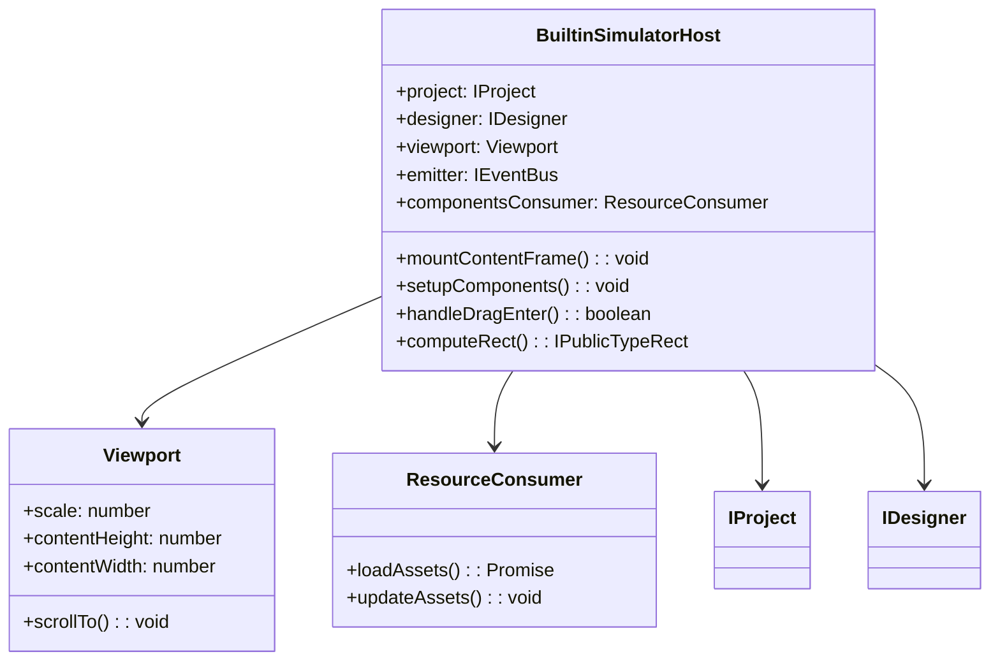

# BuiltinSimulatorHost 核心控制器详解

## 一、概述

`BuiltinSimulatorHost` 是低代码引擎中模拟器的核心控制器，位于 `packages/designer/src/builtin-simulator/host.ts`。它是 iframe 环境外部的控制中心，负责管理整个设计时模拟器的生命周期、资源加载、事件处理等核心功能。

## 二、核心架构

### 2.1 职责分工

| 组件 | 职责 |
|------|------|
| **BuiltinSimulatorHost** | 模拟器控制器，管理生命周期、资源、事件 |
| **BuiltinSimulatorHostView** | React 视图组件，渲染 UI |
| **SimulatorRendererContainer** | iframe 内部的渲染容器 |
| **Viewport** | 视口管理，处理缩放、滚动 |
| **ResourceConsumer** | 资源消费者，管理组件库加载 |

### 2.2 类图关系



## 三、主要功能模块

### 3.1 生命周期管理

#### **iframe 创建和挂载**
- `mountContentFrame()`: 挂载 iframe 元素
- `mountViewport()`: 挂载视口元素
- 初始化渲染器容器

#### **资源注入**
- 注入 React/ReactDOM 环境
- 加载组件库代码
- 注入样式和主题

### 3.2 资源管理

#### **组件库管理**
```typescript
readonly componentsConsumer: ResourceConsumer;  // 组件库消费者
readonly injectionConsumer: ResourceConsumer;   // 注入资源消费者
readonly i18nConsumer: ResourceConsumer;        // 国际化资源消费者
```

#### **默认环境**
- React/ReactDOM 环境变量注入
- PropTypes 兼容性处理
- React DevTools 支持

### 3.3 设备和视口管理

#### **计算属性**
```typescript
@computed get device(): string              // 设备类型
@computed get deviceClassName(): string     // 设备样式类
@computed get designMode(): string          // 设计模式
@computed get deviceStyle(): DeviceStyleProps // 设备样式
```

#### **视口控制**
- 缩放比例控制
- 滚动位置管理
- 设备尺寸适配

### 3.4 拖拽和交互处理

#### **拖拽事件处理**
- `handleDragEnter()`: 拖拽进入处理
- `handleAccept()`: 拖拽接受判断
- `getNearByContainer()`: 查找邻近容器

#### **节点操作**
- 节点查找和定位
- 节点矩形计算
- 节点实例获取

### 3.5 组件和实例管理

#### **组件查找**
- `getComponent()`: 根据名称获取组件
- `generateComponentMetadata()`: 生成组件元数据
- `getComponentInstances()`: 获取组件实例

#### **DOM 操作**
- `findDOMNodes()`: 查找 DOM 节点
- `computeRect()`: 计算节点矩形
- `scrollToNode()`: 滚动到指定节点

## 四、核心方法详解

### 4.1 mountContentFrame()

**作用**：挂载 iframe 元素，启动模拟器渲染流程

**流程**：
1. 设置 iframe 属性（src、name 等）
2. 调用 `createSimulator()` 生成 HTML 内容
3. 将 HTML 注入 iframe
4. 等待渲染器就绪
5. 建立通信机制

### 4.2 setupComponents()

**作用**：设置组件库，处理组件资源加载

**流程**：
1. 构建组件库列表
2. 通过 ResourceConsumer 加载资源
3. 更新组件映射表
4. 触发渲染器更新

### 4.3 handleDragEnter()

**作用**：处理拖拽进入事件，确定是否可以放置

**判断逻辑**：
1. 检查目标容器是否接受拖拽对象
2. 验证嵌套规则
3. 检查组件兼容性
4. 返回是否可接受的布尔值

### 4.4 computeRect()

**作用**：计算节点在画布中的矩形位置

**计算过程**：
1. 获取节点对应的 DOM 元素
2. 计算元素的边界矩形
3. 转换为画布坐标系
4. 考虑缩放和滚动偏移

## 五、配置和扩展

### 5.1 默认配置

#### **模拟器 URL 配置**
```typescript
const defaultSimulatorUrl = (() => {
  const publicPath = getPublicPath();
  // 根据环境生成不同的资源 URL
  if (dev) {
    return [`${prefix}/css/react-simulator-renderer.css`, ...];
  }
  return [`${prefix}/react-simulator-renderer.css`, ...];
})();
```

#### **默认环境变量**
```typescript
const defaultEnvironment = [
  assetItem(AssetType.JSText,
    'window.React=parent.React;window.ReactDOM=parent.ReactDOM;'
  ),
  // PropTypes 兼容
  // React DevTools 支持
];
```

### 5.2 引擎配置集成

- `thisRequiredInJSE`: JSX 表达式是否需要 this
- `enableStrictNotFoundMode`: 严格的未找到组件模式
- `notFoundComponent`: 未找到组件时的降级组件
- `faultComponent`: 组件错误时的降级组件

## 六、事件系统

### 6.1 内部事件总线

```typescript
readonly emitter: IEventBus = createModuleEventBus('BuiltinSimulatorHost');
```

### 6.2 响应式系统

使用 MobX 实现响应式状态管理：
- `@obx.ref`: 可观察的引用
- `@computed`: 计算属性
- `autorun`: 自动运行的副作用

### 6.3 外部事件监听

- 监听设计器事件
- 处理项目状态变化
- 响应组件库更新

## 七、性能优化

### 7.1 资源管理优化

- 懒加载组件库
- 缓存已加载的资源
- 防抖更新机制

### 7.2 DOM 操作优化

- 批量 DOM 查询
- 矩形计算缓存
- 视口裁剪优化

### 7.3 事件处理优化

- 事件委托机制
- 防抖拖拽处理
- 内存泄漏防护

## 八、调试和故障排查

### 8.1 日志系统

```typescript
const logger = new Logger({ level: 'warn', bizName: 'designer' });
```

### 8.2 常见问题

1. **iframe 加载失败**
   - 检查 simulatorUrl 配置
   - 验证资源可访问性

2. **组件无法拖拽**
   - 检查 handleAccept 逻辑
   - 验证组件元数据配置

3. **视口显示异常**
   - 检查设备配置
   - 验证 CSS 样式加载

## 九、与其他模块的关系

### 9.1 上游依赖

- **Designer**: 提供设计器实例和事件
- **Project**: 提供项目和文档管理
- **ResourceConsumer**: 处理资源加载

### 9.2 下游影响

- **BuiltinSimulatorHostView**: 提供视图渲染
- **SimulatorRendererContainer**: iframe 内渲染器
- **BemTools**: 设计辅助工具

## 十、总结

`BuiltinSimulatorHost` 是低代码引擎模拟器系统的核心大脑，它：

1. **统一管理**：集中管理 iframe 生命周期、资源加载、事件处理
2. **高度可配置**：支持设备切换、主题定制、组件库扩展
3. **性能优化**：使用响应式系统、资源缓存、事件优化
4. **扩展友好**：提供丰富的钩子和配置项，便于定制开发

理解这个类的工作原理，对于深入掌握低代码引擎的渲染机制至关重要。
