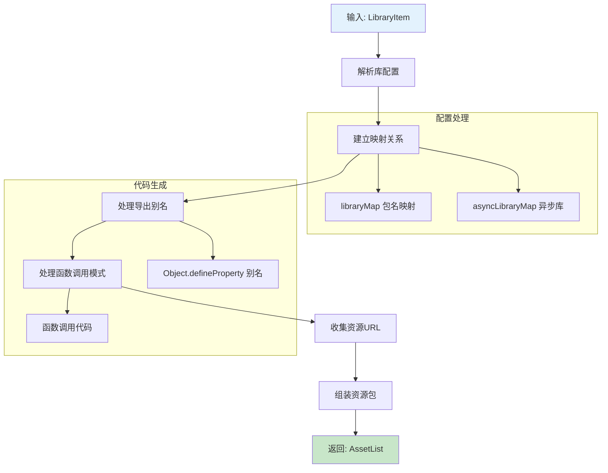
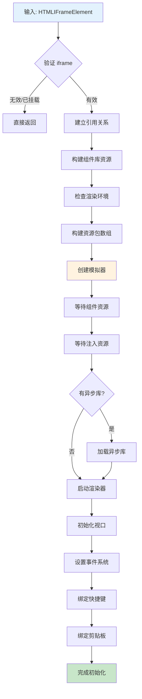
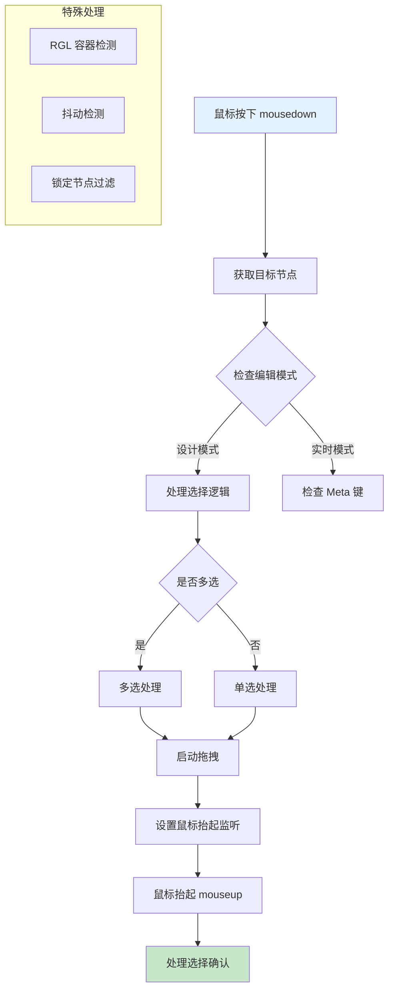
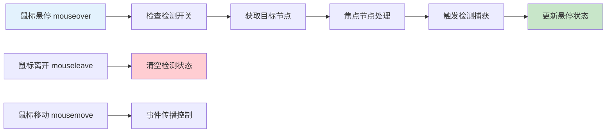
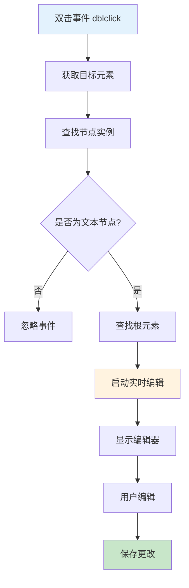
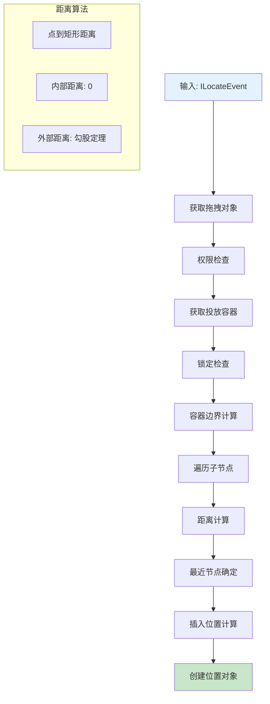
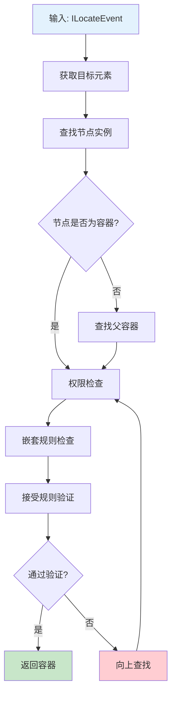

# BuiltinSimulatorHost 核心方法详解

## 一、文档管理方法

### 1.1 currentDocument - 当前文档获取器

#### **🎯 方法作用**

```typescript
get currentDocument() {
  return this.project.currentDocument;
}
```

**核心功能**：获取项目中当前正在编辑的文档实例

#### **📄 currentDocument 的能力分析**

**🏗️ 基础架构能力**：

```typescript
interface IDocument {
  // 📋 基础信息
  id: string;                    // 文档唯一标识
  fileName?: string;             // 文件名称

  // 🌳 节点树管理
  root: INode;                   // 根节点
  getNode(id: string): INode;    // 根据 ID 获取节点
  createNode(schema): INode;     // 创建新节点
  removeNode(id: string): void;  // 删除节点

  // 🎯 选择状态管理
  selection: ISelection;         // 选择管理器
  focusNode: INode | null;      // 当前焦点节点

  // 📚 Schema 管理
  schema: ISchema;              // 完整的页面 Schema
  exportSchema(): ISchema;      // 导出 Schema
  importSchema(schema): void;   // 导入 Schema

  // 📝 历史记录
  history: IHistory;            // 历史记录管理器

  // 🔧 实用工具
  isBlank(): boolean;           // 是否为空白文档
  checkNesting(): boolean;      // 检查嵌套规则
}
```

**🎮 选择管理能力**：

```typescript
// 🎯 selection 的核心能力
selection: {
  // 单选操作
  select(id: string): void;           // 选中指定节点
  has(id: string): boolean;           // 是否包含指定节点
  remove(id: string): void;           // 从选择中移除
  clear(): void;                      // 清空选择

  // 多选操作
  add(id: string): void;              // 添加到选择
  getTopNodes(): INode[];             // 获取顶层选中节点
  containsNode(node, strict?): boolean; // 是否包含节点

  // 状态查询
  size: number;                       // 选中节点数量
  first: INode | null;                // 第一个选中节点
  node: INode | null;                 // 主选中节点
}
```

**📚 Schema 操作能力**：

```typescript
// 🗂️ Schema 的结构和能力
schema: {
  componentName: string;      // 组件名称
  props?: object;            // 属性配置
  children?: ISchema[];      // 子组件 Schema
  condition?: boolean;       // 条件渲染
  loop?: any;               // 循环渲染
  meta?: object;            // 元数据
}

// 🔄 Schema 操作方法
document.exportSchema();     // 导出完整 Schema，用于保存
document.importSchema(data); // 导入 Schema，用于加载
```

**🕰️ 历史记录能力**：

```typescript
// 📝 history 的撤销重做能力
history: {
  // 基础操作
  back(): void;              // 撤销
  forward(): void;           // 重做
  push(state): void;         // 推入历史状态

  // 状态查询
  canBack: boolean;          // 是否可撤销
  canForward: boolean;       // 是否可重做
  current: any;              // 当前状态

  // 批量操作
  startTransaction(): void;   // 开始事务
  endTransaction(): void;     // 结束事务
}
```

#### **🌟 存在意义**

1. **📋 数据中心**：作为设计时数据的唯一来源
2. **🎯 状态管理**：管理选中状态、焦点状态等 UI 状态
3. **🔗 业务逻辑**：提供节点增删改查的业务接口
4. **💾 持久化**：提供 Schema 的序列化和反序列化能力
5. **🕰️ 版本控制**：支持撤销重做等历史操作

---

## 二、资源管理方法

### 2.1 buildLibrary - 组件库资源构建器

#### **🎯 方法作用**

将组件库配置转换为可加载的资源包，支持多种导出模式和异步加载策略。

#### **📋 详细实现流程**



#### **🔍 核心处理逻辑**

**1️⃣ 映射关系建立**：

```typescript
// 🗺️ 建立包名到库名的映射
this.libraryMap[item.package] = item.library;
// 例如：libraryMap['antd'] = 'antd'
//      libraryMap['@ali/fusion'] = 'Next'

// ⏰ 异步库单独管理
if (item.async) {
  this.asyncLibraryMap[item.package] = item;
}
```

**2️⃣ 导出别名处理**：

```typescript
// 🏷️ 解决命名冲突问题
if (item.exportName && item.library) {
  libraryExportList.push(
    `Object.defineProperty(window,'${item.exportName}',{get:()=>window.${item.library}});`
  );
}

// 📝 生成的代码示例：
// Object.defineProperty(window,'bizcharts',{get:()=>window.BizCharts});
// 作用：支持 import { Chart } from 'bizcharts' 的写法
```

**3️⃣ 函数调用模式**：

```typescript
// 📞 动态库加载模式
if (exportMode === 'functionCall' && exportSourceLibrary) {
  functionCallLibraryExportList.push(
    `window["${item.library}"] = window["${exportSourceLibrary}"]("${item.library}", "${item.package}");`
  );
}

// 📝 应用场景：微前端架构中的动态模块加载
// window["MyLib"] = window["ModuleLoader"]("MyLib", "my-package");
```

**4️⃣ 资源URL收集**：

```typescript
// 📦 资源优先级策略
if (item.editUrls) {
  libraryAsset.push(item.editUrls);  // 开发环境：未压缩，便于调试
} else if (item.urls) {
  libraryAsset.push(item.urls);      // 生产环境：已压缩，优化加载
}
```

#### **⚙️ 配置示例详解**

```json
{
  "title": "AntD",                    // 🏷️ 显示名称
  "package": "antd",                  // 📦 npm 包名
  "library": "antd",                  // 🌐 UMD 全局变量名
  "exportName": "Antd",               // 🔄 导出别名（可选）
  "version": "4.20.0",                // 📌 版本号
  "urls": [                           // 📚 生产环境资源
    "https://cdn.jsdelivr.net/npm/antd@4.20.0/dist/antd.min.js",
    "https://cdn.jsdelivr.net/npm/antd@4.20.0/dist/antd.min.css"
  ],
  "editUrls": [                       // 🛠️ 开发环境资源
    "https://cdn.jsdelivr.net/npm/antd@4.20.0/dist/antd.js",
    "https://cdn.jsdelivr.net/npm/antd@4.20.0/dist/antd.css"
  ],
  "async": false,                     // ⏰ 是否异步加载
  "exportMode": "default",            // 📤 导出模式
  "exportSourceLibrary": null        // 🔗 源库（函数调用模式用）
}
```

#### **🎯 使用场景**

1. **🏗️ 初始化阶段**：在 `mountContentFrame` 中构建基础库
2. **🔄 动态加载**：在 `setupComponents` 中加载新增库
3. **📦 资源管理**：配合 `AssetLoader` 进行实际加载

---

### 2.2 mountContentFrame - iframe 环境初始化

#### **🎯 方法作用**

模拟器启动的核心流程，完成 iframe 环境搭建的全过程。

#### **📋 完整执行流程**



#### **🔍 核心阶段详解**

**阶段1️⃣：iframe 引用建立**

```typescript
// 🎯 建立跨框架访问能力
this._iframe = iframe;
this._contentWindow = iframe.contentWindow!;
this._contentDocument = this._contentWindow.document;

// 💡 关键点：这些引用是后续所有操作的基础
```

**阶段2️⃣：资源包构建**

```typescript
// 📦 按优先级组织资源（AssetLevel 决定加载顺序）
const vendors = [
  assetBundle(environment, AssetLevel.Environment),      // 🌐 最高优先级：React 基础环境
  assetBundle(extraEnvironment, AssetLevel.Environment), // 🔧 扩展环境：用户自定义全局依赖
  assetBundle(libraryAsset, AssetLevel.Library),        // 📚 组件库：业务组件
  assetBundle(theme, AssetLevel.Theme),                 // 🎨 主题：样式文件
  assetBundle(simulatorUrl, AssetLevel.Runtime),        // 🎭 运行时：渲染器核心
];
```

**阶段3️⃣：模拟器创建**

```typescript
// 🏗️ createSimulator 内部完成：
// 1. 生成 HTML 模板
// 2. 按优先级注入资源
// 3. 建立通信机制
// 4. 返回渲染器实例
const renderer = await createSimulator(this, iframe, vendors);
```

**阶段4️⃣：资源等待同步**

```typescript
// ⏳ 确保关键资源已准备就绪
await this.componentsConsumer.waitFirstConsume();  // 📦 组件库资源
await this.injectionConsumer.waitFirstConsume();   // 🛠️ 注入资源（appHelper 等）

// 🎯 为什么要等待？
// - 避免渲染时找不到组件导致错误
// - 确保运行时上下文完整可用
```

**阶段5️⃣：异步库处理**

```typescript
// ⏰ 异步库加载策略：基础环境就绪后再加载
if (Object.keys(this.asyncLibraryMap).length > 0) {
  await renderer.loadAsyncLibrary(this.asyncLibraryMap);
  // 🧹 清理映射表，避免重复加载
  Object.keys(this.asyncLibraryMap).forEach(key => {
    delete this.asyncLibraryMap[key];
  });
}
```

**阶段6️⃣：系统功能绑定**

```typescript
// 🎮 交互系统初始化
this.viewport.setScrollTarget(this._contentWindow);  // 📱 视口控制
this.setupEvents();                                 // 🎯 事件系统

// ⌨️ 辅助功能绑定
const hotkey = this.designer.editor.get('innerHotkey');
hotkey.mount(this._contentWindow);                  // 🔥 快捷键支持

const skeleton = this.designer.editor.get('skeleton');
skeleton.focusTracker.mount(this._contentWindow);   // 🎯 焦点追踪

clipboard.injectCopyPaster(this._contentDocument);  // 📋 剪贴板功能
```

#### **⚠️ 关键注意事项**

1. **🔒 安全性**：iframe 提供沙箱隔离，但需要合理处理跨域问题
2. **⏳ 异步性**：整个流程是异步的，需要正确处理 Promise 链
3. **🧹 资源管理**：需要在适当时机清理事件监听和资源引用
4. **💥 错误处理**：资源加载失败时的降级和重试机制

---

## 三、事件处理方法

### 3.1 setupDragAndClick - 拖拽点击事件处理器

#### **🎯 方法作用**

在 iframe 内设置鼠标事件监听，处理组件的拖拽、点击、选择等核心交互。

#### **🎮 事件处理流程**



#### **🔍 核心逻辑解析**

**1️⃣ 目标节点获取**：

```typescript
// 🎯 从 DOM 元素获取对应的业务节点
const nodeInst = this.getNodeInstanceFromElement(downEvent.target);
const node = getClosestClickableNode(nodeInst?.node || focusNode, downEvent);

// 🔍 关键算法：向上遍历找到第一个可点击的节点
// 过滤掉不可交互的节点（如文本节点、被锁定的节点等）
```

**2️⃣ 模式检查和权限验证**：

```typescript
// ⚙️ 设计模式检查
if (this.designMode === 'design') {
  isMulti = downEvent.metaKey || downEvent.ctrlKey;  // 🎯 多选模式
} else if (!downEvent.metaKey) {
  return; // 🚫 非设计模式下，只响应 Meta 键操作
}
```

**3️⃣ RGL（React Grid Layout）特殊处理**：

```typescript
// 🎲 磁铁布局特殊处理
const rglNode = node?.getParent();
const isRGLNode = rglNode?.isRGLContainer;

if (isRGLNode) {
  // 🚫 禁用多选（磁铁布局不支持多选）
  isMulti = false;

  // 🎯 发送 RGL 切换事件
  designer.dragon.emitter.emit('rgl.switch', {
    action: 'start',
    rglNode
  });
}
```

**4️⃣ 拖拽系统集成**：

```typescript
// 🐉 启动 Dragon 拖拽系统
designer.dragon.boost({
  type: IPublicEnumDragObjectType.Node,
  nodes: selectedNodes,                    // 🎯 被拖拽的节点列表
}, downEvent, isRGLNode ? rglNode : undefined);

// 💡 Dragon 负责：
// - 拖拽状态管理
// - 拖拽预览显示
// - 目标区域检测
// - 放置位置计算
```

**5️⃣ 选择状态管理**：

```typescript
// 🎯 智能选择逻辑
const checkSelect = (e: MouseEvent) => {
  // 🤏 抖动检测：避免轻微鼠标移动影响选择
  if (!isShaken(downEvent, e) || isRGLNode) {
    // ✅ 确认选择操作
    designer.activeTracker.track({ node, instance: nodeInst?.instance });

    if (isMulti && selection.has(id)) {
      selection.remove(id);  // 🔄 多选模式：切换选择状态
    } else {
      selection.select(id);  // 🎯 单选模式：直接选择
    }
  }
};
```

#### **🎯 Click 事件处理**

```typescript
// 🖱️ Click 事件：处理表单组件的交互限制
doc.addEventListener('click', (e) => {
  const { target } = e;

  // 🚫 忽略的选择器列表（表单组件）
  const ignoreSelectors = [
    '.next-input-group', '.next-checkbox-group',
    '.next-date-picker', '.next-select',
    '.editor-container'  // 富文本组件
  ];

  // 🛡️ 阻止表单组件的默认交互
  if (target?.closest(ignoreSelectors.join(','))) {
    e.preventDefault();
    e.stopPropagation();
  }
}, true);
```

---

### 3.2 setupDetecting - 悬停检测事件处理器

#### **🎯 方法作用**

设置鼠标悬停检测，为用户提供实时的组件高亮和信息提示。

#### **🔍 检测机制**



#### **🔍 核心实现**

**1️⃣ 悬停检测逻辑**：

```typescript
const hover = (e: MouseEvent) => {
  // 🚦 检测开关和模式检查
  if (!detecting.enable || this.designMode !== 'design') {
    return;  // 🚫 检测被禁用或非设计模式时不响应
  }

  // 🎯 获取悬停目标节点
  const nodeInst = this.getNodeInstanceFromElement(e.target as Element);
  if (nodeInst?.node) {
    let { node } = nodeInst;

    // 🔍 焦点节点优先：如果悬停的是选中节点的子节点，优先显示焦点节点
    const focusNode = node.document?.focusNode;
    if (focusNode && node.contains(focusNode)) {
      node = focusNode;  // 🎯 使用焦点节点替代
    }

    // 📡 触发检测捕获
    detecting.capture(node);
  } else {
    detecting.capture(null);  // 🚫 清空检测状态
  }
};
```

**2️⃣ 事件传播控制**：

```typescript
// 🛡️ 事件传播管理
if (!engineConfig.get('enableMouseEventPropagationInCanvas', false) || dragon.dragging) {
  e.stopPropagation();  // 🚫 阻止事件冒泡，避免干扰父级交互
}

// 🎯 应用场景：
// - 拖拽过程中避免悬停干扰
// - 防止鼠标事件影响画布外的交互
```

**3️⃣ 离开检测处理**：

```typescript
const leave = () => {
  // 🚫 鼠标离开画布时清空检测状态
  this.project.currentDocument && detecting.leave(this.project.currentDocument);
};

// 📡 事件绑定
doc.addEventListener('mouseleave', leave, false);
```

#### **🎨 检测效果**

1. **🔍 视觉反馈**：显示蓝色边框高亮悬停组件
2. **ℹ️ 信息提示**：显示组件名称、类型等信息
3. **🎛️ 操作按钮**：提供快速操作按钮（复制、删除等）
4. **🏷️ 层级指示**：显示组件在树结构中的位置

---

### 3.3 setupLiveEditing - 实时编辑功能

#### **🎯 方法作用**

双击文本元素进入实时编辑模式，支持直接在画布上编辑文本内容。

#### **📝 实现流程**



#### **🔍 核心逻辑**

```typescript
doc.addEventListener('dblclick', (e: MouseEvent) => {
  // 🛡️ 阻止默认行为和事件冒泡
  e.stopPropagation();
  e.preventDefault();

  // 🎯 获取目标节点
  const targetElement = e.target as HTMLElement;
  const nodeInst = this.getNodeInstanceFromElement(targetElement);

  // ✅ 节点有效性检查
  const focusNode = this.project.currentDocument?.focusNode;
  const node = nodeInst.node || focusNode;

  // 🚫 过滤非文本节点和低代码组件
  if (!node || isLowCodeComponent(node)) {
    return;
  }

  // 🔍 查找可编辑的根元素
  const rootElement = this.findDOMNodes(
    nodeInst.instance,
    node.componentMeta.rootSelector  // 🎯 使用组件的根选择器
  )?.find(item =>
    item && item.contains(targetElement)  // 🎯 找到包含点击目标的根元素
  ) as HTMLElement;

  // 🚀 启动实时编辑
  if (rootElement) {
    this.liveEditing.apply({
      node,           // 业务节点
      rootElement,    // DOM 根元素
      event: e,       // 原始事件
    });
  }
});
```

#### **🎨 编辑体验**

1. **📝 直接编辑**：双击文本直接进入编辑状态
2. **🎯 精确定位**：自动识别可编辑的文本区域
3. **💾 实时保存**：编辑完成自动保存到 Schema
4. **🔄 状态同步**：编辑内容实时同步到属性面板

---

### 3.4 setupContextMenu - 右键菜单功能

#### **🎯 方法作用**

设置右键上下文菜单，为用户提供快捷操作入口。

#### **🔍 实现逻辑**

```typescript
doc.addEventListener('contextmenu', (e: MouseEvent) => {
  const targetElement = e.target as HTMLElement;
  const nodeInst = this.getNodeInstanceFromElement(targetElement);
  const editor = this.designer?.editor;

  // 🎯 获取上下文节点
  const node = nodeInst?.node || this.project.currentDocument?.focusNode;

  // 📊 构建上下文信息
  const npm = node?.componentMeta?.npm;
  const selected = [npm?.package, npm?.componentName]
    .filter(item => !!item)
    .join('-') || node?.componentMeta?.componentName || '';

  // 📡 发送右键菜单事件
  editor?.eventBus.emit('designer.builtinSimulator.contextmenu', {
    selected,                                                    // 选中组件标识
    ...nodeInst,                                                // 节点实例信息
    instanceRect: this.computeComponentInstanceRect(nodeInst.instance), // 组件矩形
    originalEvent: e,                                           // 原始事件
  });
});
```

---

## 四、组件元数据和计算方法

### 4.1 generateComponentMetadata - 组件元数据生成

#### **🎯 方法作用**

动态生成组件的元数据信息，支持 HTML 标签和自定义组件。

#### **🔍 生成策略**

```typescript
generateComponentMetadata(componentName: string): IComponentMetadata {
  // 🏷️ HTML 标签处理
  if (isHTMLTag(componentName)) {
    return {
      componentName,
      // TODO: 读取内置 HTML 元数据
    };
  }

  // 🧩 自定义组件处理
  const component = this.getComponent(componentName);
  if (!component) {
    return { componentName };  // 🚫 组件不存在时返回基础信息
  }

  // 📝 元数据解析和生成
  return {
    componentName,
    ...parseMetadata(component),  // 🔍 解析组件的 PropTypes、defaultProps 等
  };
}
```

#### **📊 元数据结构**

```typescript
interface IComponentMetadata {
  componentName: string;        // 组件名称
  title?: string;              // 显示标题
  icon?: string;               // 图标
  category?: string;           // 分类
  props?: PropMetadata[];      // 属性配置
  snippets?: Snippet[];        // 代码片段
  configure?: Configure;       // 配置器
}
```

---

### 4.2 computeComponentInstanceRect - 组件矩形计算

#### **🎯 方法作用**

计算组件实例在画布中的精确矩形位置，用于辅助工具定位。

#### **🔍 计算算法**

```mermaid
graph TD
    A[输入: 组件实例] --> B[查找 DOM 元素]
    B --> C[获取客户端矩形]
    C --> D[处理多个矩形]
    D --> E[计算边界合并]
    E --> F[返回合并矩形]

    subgraph "边界计算"
        G[left = Math.min(rect.left)]
        H[top = Math.min(rect.top)]
        I[right = Math.max(rect.right)]
        J[bottom = Math.max(rect.bottom)]
    end

    style A fill:#e3f2fd
    style F fill:#c8e6c9
```

#### **🔍 核心算法**

```typescript
computeComponentInstanceRect(instance: ComponentInstance, selector?: string): IRect | null {
  // 🔍 查找 DOM 元素
  const elements = this.findDOMNodes(instance, selector);
  if (!elements) return null;

  let rects: DOMRect[] | undefined;
  let boundary: { x: number; y: number; r: number; b: number } | undefined;

  // 🔄 遍历所有相关元素
  for (const elem of elements) {
    rects = this.renderer.getClientRects(elem);

    for (const rect of rects) {
      // 🚫 过滤无效矩形
      if (rect.width === 0 && rect.height === 0) continue;

      // 🎯 边界合并算法
      if (!boundary) {
        boundary = {
          x: rect.left, y: rect.top,
          r: rect.right, b: rect.bottom
        };
      } else {
        // 📐 扩展边界
        boundary.x = Math.min(boundary.x, rect.left);
        boundary.y = Math.min(boundary.y, rect.top);
        boundary.r = Math.max(boundary.r, rect.right);
        boundary.b = Math.max(boundary.b, rect.bottom);
      }
    }
  }

  // 🎯 构建最终矩形
  if (boundary) {
    const result = new DOMRect(
      boundary.x, boundary.y,
      boundary.r - boundary.x, boundary.b - boundary.y
    );
    result.elements = elements;    // 🔗 关联 DOM 元素
    result.computed = true;        // 🏷️ 标记为计算结果
    return result;
  }

  return null;
}
```

---

## 五、拖拽定位方法

### 5.1 locate - 拖拽位置计算

#### **🎯 方法作用**

在拖拽过程中计算精确的放置位置，支持复杂的嵌套和插入规则。

#### **🔍 定位算法流程**



#### **🔍 核心定位逻辑**

**1️⃣ 权限和可操作性检查**：

```typescript
// 🔒 移动权限检查
const operationalNodes = nodes?.filter(node => {
  // 🎯 节点移动钩子检查
  const onMoveHook = node.componentMeta?.advanced.callbacks?.onMoveHook;
  const canMove = onMoveHook ? onMoveHook(node.internalToShellNode()) : true;

  // 🏠 父容器移动钩子检查
  const parentContainer = findParentContainer(node);
  const onChildMoveHook = parentContainer?.componentMeta?.advanced.callbacks?.onChildMoveHook;
  const childrenCanMove = onChildMoveHook ?
    onChildMoveHook(node.internalToShellNode(), parentContainer.internalToShellNode()) : true;

  return canMove && childrenCanMove;  // 🎯 两个条件都满足才可移动
});
```

**2️⃣ 投放容器获取**：

```typescript
// 🎯 获取合适的投放容器
const dropContainer = this.getDropContainer(e);
const lockedNode = getClosestNode(dropContainer?.container, node => node.isLocked);

// 🔒 锁定节点检查：不能放置到锁定的容器中
if (lockedNode) return null;
```

**3️⃣ 容器和子节点分析**：

```typescript
const { container, instance: containerInstance } = dropContainer;
const { children } = container;

// 📐 计算容器边界
const edge = this.computeComponentInstanceRect(
  containerInstance,
  container.componentMeta.rootSelector
);

// 🚫 无法计算边界时返回空
if (!edge) return null;
```

**4️⃣ 子节点距离计算**：

```typescript
let nearNode: INode | null = null;
let nearIndex = 0;
let nearDistance: number | null = null;

// 🔄 遍历所有子节点
for (let i = 0; i < children.size; i++) {
  const node = children.get(i);
  const rect = this.computeComponentInstanceRect(nodeInstance);

  if (rect) {
    // 📏 计算距离：点到矩形的最短距离
    const distance = isPointInRect(e, rect) ? 0 : distanceToRect(e, rect);

    // 🎯 更新最近节点
    if (nearDistance === null || distance < nearDistance) {
      nearDistance = distance;
      nearNode = node;
      nearIndex = i;
    }
  }
}
```

**5️⃣ 插入位置精确计算**：

```typescript
if (nearNode && nearRect) {
  // 📐 布局检测：内联 vs 块级
  const inline = isChildInline(nearElement);
  const row = isRowContainer(nearElement.parentElement);
  const vertical = inline || row;

  // 🎯 插入位置判断
  const near = {
    node: nearNode.internalToShellNode(),
    pos: 'before',  // 默认插入到前面
    align: vertical ? 'V' : 'H',  // 对齐方向
  };

  // 🔄 根据鼠标位置调整插入位置
  if (isNearAfter(e, nearRect, vertical)) {
    near.pos = 'after';
    detail.index = nearIndex + 1;  // 插入到后面
  }
}
```

#### **📊 距离计算算法**

```typescript
// 📏 点到矩形的距离计算
function distanceToRect(point: Point, rect: Rect): number {
  let minX = Math.min(
    Math.abs(point.x - rect.left),
    Math.abs(point.x - rect.right)
  );
  let minY = Math.min(
    Math.abs(point.y - rect.top),
    Math.abs(point.y - rect.bottom)
  );

  // 🎯 点在矩形内部：对应方向距离为 0
  if (point.x >= rect.left && point.x <= rect.right) minX = 0;
  if (point.y >= rect.top && point.y <= rect.bottom) minY = 0;

  // 🔺 勾股定理计算最终距离
  return Math.sqrt(minX ** 2 + minY ** 2);
}
```

---

### 5.2 getDropContainer - 投放容器获取

#### **🎯 方法作用**

在拖拽过程中找到合适的投放容器，处理复杂的嵌套和权限检查。

#### **🔍 容器查找算法**



#### **🔍 查找逻辑**

**1️⃣ 初始目标确定**：

```typescript
const { target, dragObject } = e;
let container: INode | null;
let nodeInstance: INodeInstance | undefined;

// 🎯 从 DOM 目标查找对应节点
if (target) {
  const ref = this.getNodeInstanceFromElement(target);
  if (ref?.node) {
    nodeInstance = ref;
    container = ref.node;
  } else {
    container = currentRoot;  // 🏠 回退到根节点
  }
} else {
  container = currentRoot;
}
```

**2️⃣ 容器能力检查**：

```typescript
// 📦 确保目标是容器节点
if (!container?.isParental()) {
  container = container?.parent || currentRoot;  // 🔄 向上查找容器
}
```

**3️⃣ 拖拽冲突检查**：

```typescript
// 🚫 避免将容器放入其自身或子节点中
const drillDownExcludes = new Set<INode>();
if (isDragNodeObject(dragObject)) {
  const { nodes } = dragObject;
  let p: any = container;

  // 🔍 检查是否存在包含关系
  for (const node of nodes) {
    if (contains(node, p)) {
      p = node.parent;  // 🔄 向上移动到安全位置
    }
  }

  if (p !== container) {
    container = p || document.focusNode;
    drillDownExcludes.add(container);
  }
}
```

**4️⃣ 接受规则验证**：

```typescript
// 🛡️ 容器接受规则检查
while (container) {
  const dropContainer = { container, instance };
  const accepted = this.handleAccept(dropContainer, e);

  if (accepted === true) {
    return dropContainer;  // ✅ 找到合适的容器
  }

  if (!accepted) {
    // 🔄 向上查找父容器
    if (container.parent) {
      container = container.parent;
      instance = this.getClosestNodeInstance(instance, container.id)?.instance;
    } else {
      return null;  // 🚫 无合适容器
    }
  }
}
```

#### **🛡️ 接受规则验证**

```typescript
handleAccept({ container }: DropContainer, e: ILocateEvent): boolean {
  const { dragObject } = e;
  const document = this.currentDocument;
  const { focusNode } = document;

  // 🏠 根节点或包含焦点节点：检查嵌套规则
  if (isRootNode(container) || container.contains(focusNode)) {
    return document.checkNesting(focusNode, dragObject);
  }

  const meta = container.componentMeta;

  // 📦 容器检查：必须是容器组件或可接受组件
  if (!meta.isContainer && !this.isAcceptable(container)) {
    return false;
  }

  // 🔍 最终嵌套规则检查
  return document.checkNesting(container, dragObject);
}
```

## 六、总结

`BuiltinSimulatorHost` 的核心方法展现了复杂的设计时交互处理能力：

### 🎯 核心特点

1. **🎮 事件驱动**：通过精确的事件处理实现丰富的交互体验
2. **🧩 模块协作**：与 Designer、Project、Dragon 等模块紧密协作
3. **📐 算法精密**：距离计算、坐标转换等算法确保交互精度
4. **🛡️ 安全可靠**：完善的权限检查和错误处理机制
5. **⚡ 性能优化**：防抖、缓存、智能更新策略

### 🔧 技术亮点

- **跨 iframe 坐标转换**：解决复杂的坐标系转换问题
- **智能目标识别**：从 DOM 元素精确定位到业务节点
- **拖拽位置计算**：支持复杂布局的精确插入定位
- **权限分层验证**：组件级、容器级、文档级多重权限检查

这些方法的精妙设计，为低代码引擎提供了专业级的设计时体验。
