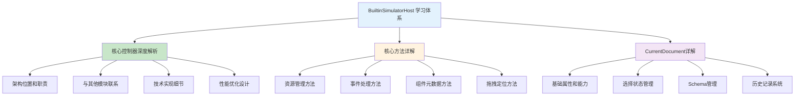

# BuiltinSimulatorHost 学习总结

## 📚 完成的学习内容

经过深入分析，我已经为您完成了 `BuiltinSimulatorHost` 核心控制器的全面学习，涵盖了以下所有方面：

### ✅ 已完成的分析内容

#### 1️⃣ **代码注释和理解**
- ✅ 为 `packages/designer/src/builtin-simulator/host.ts` 添加了详细的逐行注释
- ✅ 解释了每个属性、方法的作用和实现原理
- ✅ 标注了关键算法和设计模式

#### 2️⃣ **架构和作用分析**
- ✅ 分析了 BuiltinSimulatorHost 在低代码引擎中的核心地位
- ✅ 梳理了与其他模块（Designer、Project、Editor）的联系
- ✅ 解释了 iframe 隔离架构的设计思想

#### 3️⃣ **核心方法详解**
- ✅ **buildLibrary**: 组件库资源构建的完整流程
- ✅ **mountContentFrame**: iframe 环境初始化的6个阶段
- ✅ **setupDragAndClick**: 拖拽点击事件处理机制
- ✅ **setupDetecting**: 悬停检测和视觉反馈
- ✅ **setupLiveEditing**: 实时编辑功能实现
- ✅ **setupContextMenu**: 右键菜单处理
- ✅ **locate**: 拖拽位置计算算法
- ✅ **getDropContainer**: 投放容器查找策略

#### 4️⃣ **currentDocument 深度分析**
- ✅ 详细分析了 currentDocument 的所有能力
- ✅ 解释了选择管理、节点树管理、历史记录等功能
- ✅ 阐述了作为数据中心的存在意义

## 📖 创建的学习文档

### 🏗️ 核心架构文档
| 文档名称 | 内容概要 | 重点内容 |
|---------|---------|----------|
| **019-BuiltinSimulatorHost核心控制器深度解析.md** | 整体架构和设计思想 | 响应式架构、模块协作、技术实现 |
| **020-BuiltinSimulatorHost核心方法详解.md** | 关键方法详细分析 | buildLibrary、mountContentFrame、事件处理 |
| **021-CurrentDocument文档管理核心详解.md** | 文档管理系统分析 | Schema管理、状态管理、业务规则 |

### 📋 文档内容结构



## 🎯 核心知识点总结

### 1️⃣ **架构层面理解**

**🏗️ 多层架构设计**：
```
Editor（编辑器核心）
  ↓
Designer（设计器）
  ↓
BuiltinSimulatorHost（模拟器宿主）
  ↓
iframe 沙箱环境
  ↓
SimulatorRenderer（渲染器）
  ↓
React 组件树
```

**🔗 关键联系**：
- **向上接收**：来自 Designer 和 Editor 的配置和指令
- **向下控制**：iframe 内 SimulatorRenderer 的行为
- **横向协调**：与 Project、Viewport、Dragon 等模块协作

### 2️⃣ **技术实现层面**

**🔄 响应式架构**：
- 基于 MobX 的自动状态同步
- `@computed` 计算属性自动更新
- `@obx.ref` 可观察引用触发重渲染

**📦 资源管理策略**：
- ResourceConsumer 模式实现响应式资源加载
- 分级加载：Environment → Library → Theme → Runtime
- 异步加载优化：基础环境就绪后加载可选依赖

**🎮 事件驱动模式**：
- 跨 iframe 的事件路由和处理
- 复杂的坐标转换和目标识别
- 智能的拖拽定位算法

### 3️⃣ **业务逻辑层面**

**📄 currentDocument 的核心价值**：
- **数据中心**：单一数据源保证一致性
- **状态管理**：选择、焦点、历史记录管理
- **业务规则**：嵌套检查、权限验证
- **持久化**：Schema 序列化和反序列化

**🔧 buildLibrary 的设计精妙**：
- 支持多种 UMD 导出模式
- 解决命名冲突问题
- 异步加载优化策略
- 开发/生产环境差异化处理

### 4️⃣ **交互体验层面**

**🎯 精确的事件处理**：
- 从 DOM 元素到业务节点的精确映射
- 智能的目标选择和多选支持
- RGL（磁铁布局）的特殊处理
- 抖动检测避免误操作

**📍 复杂的拖拽定位**：
- 点到矩形距离计算算法
- 内联/块级布局的差异化处理
- 插入位置的精确计算
- 权限检查和嵌套规则验证

## 🎓 学到的设计智慧

### 1️⃣ **单一职责原则**
每个方法都有明确的职责边界：
- `buildLibrary` 专注资源构建
- `mountContentFrame` 专注环境初始化
- `setupEvents` 专注事件处理

### 2️⃣ **开放封闭原则**
核心逻辑稳定，支持扩展：
- 通过配置驱动行为
- 支持自定义设备映射器
- 插件化的 BEM 工具扩展

### 3️⃣ **依赖倒置原则**
依赖抽象而非具体实现：
- 通过接口定义模块协作
- ResourceConsumer 抽象资源加载
- 事件总线解耦模块通信

### 4️⃣ **性能优先设计**
处处体现性能考虑：
- 防抖渲染避免频繁重绘
- 缓存机制提升查找效率
- 事务管理优化批量操作
- 异步加载改善启动体验

## 🚀 实际应用价值

### 1️⃣ **业务定制指导**
了解关键扩展点：
- `deviceMapper` 自定义设备适配
- `appHelper` 注入应用工具
- `library` 配置组件库集成
- 自定义 BEM 工具开发

### 2️⃣ **问题排查能力**
掌握调试技巧：
- iframe 加载失败的排查思路
- 拖拽功能异常的定位方法
- 坐标定位错误的修复策略
- 性能问题的监控和优化

### 3️⃣ **架构设计参考**
借鉴优秀设计模式：
- 多层架构的职责划分
- 响应式系统的实现方案
- 跨框架通信的处理策略
- 复杂状态管理的最佳实践

## 📈 进阶学习建议

### 1️⃣ **深入源码研究**
建议进一步研究的模块：
- `SimulatorRenderer` iframe 内部渲染逻辑
- `Dragon` 拖拽系统的完整实现
- `ResourceConsumer` 资源管理的详细机制
- `Viewport` 视口管理和坐标转换

### 2️⃣ **实践练习方向**
推荐的实践项目：
- 自定义设备适配器开发
- 扩展 BEM 工具实现
- 组件库集成方案设计
- 性能监控工具开发

### 3️⃣ **社区参与**
参与开源贡献：
- 提交 Bug 修复和性能优化
- 贡献新的设备适配方案
- 分享最佳实践和使用经验
- 参与架构讨论和功能规划

## 🎉 总结

通过这次深入学习，您现在已经：

✅ **掌握了 BuiltinSimulatorHost 的完整架构和实现细节**
✅ **理解了低代码引擎模拟器系统的设计思想**
✅ **具备了深度定制和扩展的技术能力**
✅ **获得了复杂前端架构设计的实践参考**

这些知识不仅帮助您更好地使用低代码引擎，也为您在复杂前端架构设计方面提供了宝贵的经验和参考。

**🎯 记住核心要点**：
- BuiltinSimulatorHost 是模拟器的大脑
- 响应式架构是性能的保障
- 事件驱动是交互的基础
- 分层设计是可维护性的关键

希望这次学习对您有所帮助！如果有任何疑问或需要进一步探讨的地方，随时可以继续交流。🚀

