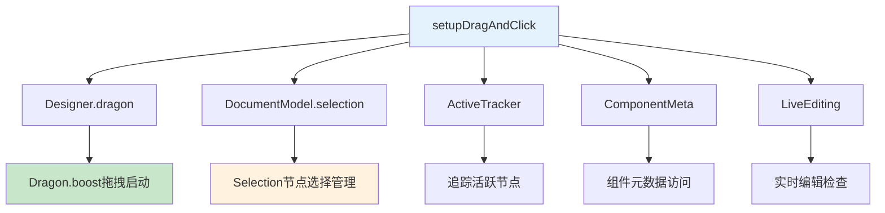
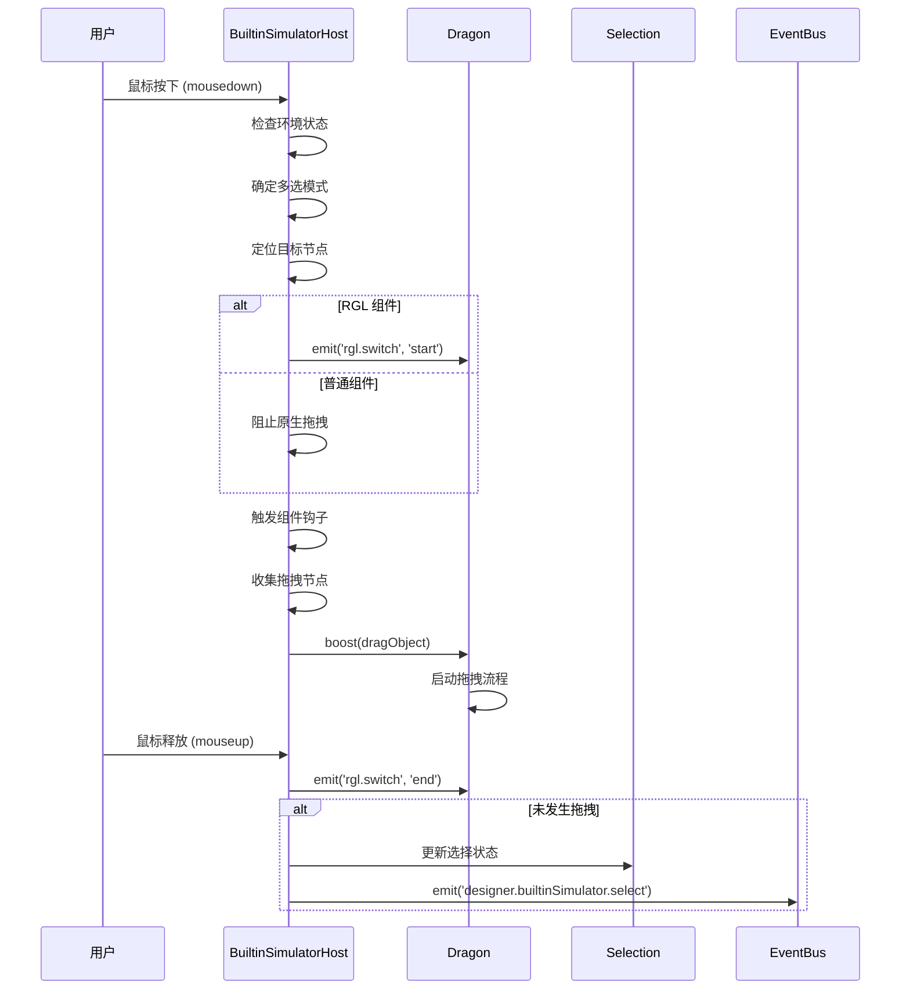
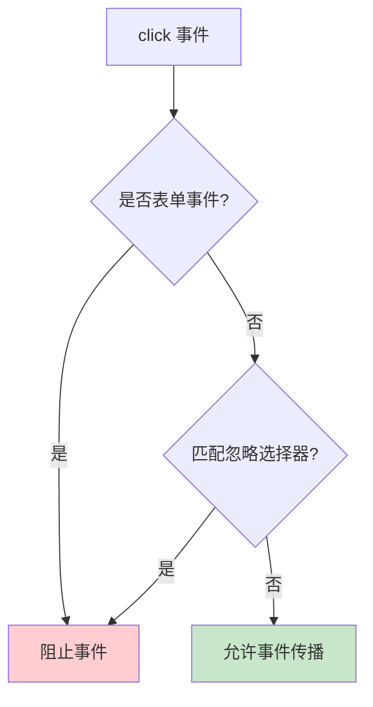

# setupDragAndClick 函数详解

## 🎯 核心功能概述

`setupDragAndClick` 是 `BuiltinSimulatorHost` 中的核心方法，负责在 iframe 内设置拖拽和点击事件的监听处理。它是**连接用户交互与低代码引擎内部系统的关键桥梁**。

### **主要职责**
1. **交互事件监听**：监听 iframe 内的鼠标事件（mousedown、click、mouseup）
2. **节点选择逻辑**：处理组件的选择、多选、取消选择
3. **拖拽启动**：调用 Dragon.boost 启动拖拽流程
4. **事件阻断**：阻止不必要的原生事件传播

## 🔗 与其他模块的联动关系

### **1. 核心模块联动**



### **2. 输入输出数据流**

| 输入源 | 数据类型 | 作用 |
|--------|----------|------|
| **鼠标事件** | `MouseEvent` | 触发交互逻辑 |
| **iframe文档** | `Document` | 事件监听载体 |
| **节点实例** | `INode` | 操作目标 |

| 输出到 | 数据类型 | 作用 |
|--------|----------|------|
| **Dragon.boost** | `DragObject` | 启动拖拽流程 |
| **Selection** | `node.id` | 更新选择状态 |
| **EventBus** | `Events` | 发送组件选择事件 |

### **3. 关键依赖模块**

#### **工具函数模块**
```typescript
// 从 utils 导入的工具函数
import { getClosestClickableNode } from './utils/clickable';
import { isShaken } from '@alilc/lowcode-utils';
import { isFormEvent } from '@alilc/lowcode-utils';
```

#### **设计器模块**
```typescript
const { designer } = this;
// 访问：
// - designer.dragon (拖拽引擎)
// - designer.activeTracker (活跃追踪器)
```

#### **文档模型**
```typescript
const documentModel = this.project.currentDocument;
// 访问：
// - documentModel.selection (选择管理器)
// - documentModel.focusNode (焦点节点)
```

## 🏗️ 函数结构分析

### **整体架构**
```typescript
setupDragAndClick() {
  // 1. 初始化环境
  const { designer } = this;
  const doc = this.contentDocument!;

  // 2. 设置 mousedown 事件监听器
  doc.addEventListener('mousedown', (downEvent) => {
    // 核心拖拽和选择逻辑
  }, true);

  // 3. 设置 click 事件监听器
  doc.addEventListener('click', (e) => {
    // 点击事件过滤逻辑
  }, true);
}
```

## 📋 核心功能详解

### **功能1: 环境检查与初始化**

#### **实现原理**
```typescript
// 修复弹窗关闭逻辑
document.dispatchEvent(new Event('mousedown'));

// 获取当前文档模型
const documentModel = this.project.currentDocument;

// 检查是否在实时编辑模式或文档不存在
if (this.liveEditing.editing || !documentModel) {
  return; // 直接退出，不处理拖拽
}
```

#### **作用机制**
- **弹窗兼容**：通过分发事件确保弹窗正确关闭
- **状态检查**：避免在实时编辑模式下触发拖拽
- **文档验证**：确保当前文档存在且可操作

### **功能2: 多选模式判断**

#### **实现逻辑**
```typescript
let isMulti = false;
if (this.designMode === 'design') {
  // 设计模式：支持 Meta/Ctrl 键多选
  isMulti = downEvent.metaKey || downEvent.ctrlKey;
} else if (!downEvent.metaKey) {
  // 其他模式：必须按 Meta 键才能进行任何操作
  return;
}
```

#### **设计模式差异**
| 模式 | 多选触发条件 | 操作限制 |
|------|-------------|----------|
| **design** | `Meta/Ctrl + 点击` | 无限制，支持所有操作 |
| **live** | `Meta + 点击` | 必须按 Meta 键才能操作 |
| **preview** | 不支持 | 只能预览，无交互 |

### **功能3: 节点定位与验证**

#### **节点查找链路**
```typescript
// 1. 移除 label-for 属性（修复实时编辑问题）
downEvent.target?.removeAttribute('for');

// 2. 从 DOM 元素获取节点实例
const nodeInst = this.getNodeInstanceFromElement(downEvent.target);

// 3. 获取焦点节点作为备选
const { focusNode } = documentModel;

// 4. 查找最近的可点击节点
const node = getClosestClickableNode(nodeInst?.node || focusNode, downEvent);
```

#### **可点击节点算法**
```typescript
// packages/designer/src/builtin-simulator/utils/clickable.ts
export const getClosestClickableNode = (currentNode, event) => {
  let node = currentNode;
  while (node) {
    // 1. 检查节点是否可点击
    let canClick = canClickNode(node, event);

    // 2. 检查是否有锁定的父节点
    const lockedNode = getClosestNode(node, (n) => {
      return !!(node?.isLocked ? n.parent?.isLocked : n.isLocked);
    });

    // 3. 如果有锁定节点，标记为不可点击
    if (lockedNode && lockedNode.getId() !== node.getId()) {
      canClick = false;
    }

    if (canClick) break;

    // 4. 向上查找父节点
    node = node.parent;
  }
  return node;
};
```

### **功能4: RGL (React Grid Layout) 特殊处理**

#### **RGL 检测逻辑**
```typescript
const rglNode = node?.getParent();
const isRGLNode = rglNode?.isRGLContainer;

if (isRGLNode) {
  // 1. 跳过调整手柄
  if (downEvent.target?.classList.contains('react-resizable-handle')) return;

  // 2. 禁止多选（RGL 不支持多选）
  isMulti = false;

  // 3. 发送 RGL 开始事件
  designer.dragon.emitter.emit('rgl.switch', {
    action: 'start',
    rglNode,
  });
} else {
  // 4. 非 RGL：阻止原生拖拽
  downEvent.stopPropagation();
  downEvent.preventDefault();
}
```

#### **RGL vs 普通组件差异**
| 特性 | RGL 组件 | 普通组件 |
|------|----------|----------|
| **多选支持** | ❌ 禁用 | ✅ 支持 |
| **原生拖拽** | ✅ 允许 | ❌ 禁用 |
| **调整手柄** | ✅ 特殊处理 | ❌ 无 |
| **事件通知** | ✅ rgl.switch | ❌ 无 |

### **功能5: 组件钩子回调**

#### **实现机制**
```typescript
// 触发组件的 onMouseDownHook 钩子
const onMouseDownHook = node.componentMeta.advanced.callbacks?.onMouseDownHook;
if (onMouseDownHook) {
  onMouseDownHook(downEvent, node.internalToShellNode());
}
```

#### **钩子用途**
- **自定义交互**：组件可定义特殊的鼠标按下行为
- **阻断默认逻辑**：通过钩子可以阻止默认的选择/拖拽
- **扩展功能**：为特定组件添加额外的交互能力

### **功能6: 拖拽启动逻辑**

#### **启动条件判断**
```typescript
if (isLeftButton && focusNode && !node.contains(focusNode)) {
  // 满足拖拽启动条件
}
```

#### **条件解析**
- **isLeftButton**: 必须是鼠标左键
- **focusNode**: 必须有焦点节点
- **!node.contains(focusNode)**: 点击的节点不能包含当前焦点节点

#### **节点收集策略**
```typescript
let nodes: INode[] = [node];
let ignoreUpSelected = false;

if (isMulti) {
  // 多选模式：处理选择集合
  if (!selection.has(node.id)) {
    designer.activeTracker.track({ node, instance: nodeInst?.instance });
    selection.add(node.id);
    ignoreUpSelected = true;
  }
  focusNode?.id && selection.remove(focusNode.id);
  nodes = selection.getTopNodes(); // 获取顶层节点
} else if (selection.containsNode(node, true)) {
  // 单选模式：如果节点已在选择中，获取所有选中的顶层节点
  nodes = selection.getTopNodes();
} else {
  // 默认情况：仅拖拽当前节点
  // will clear current selection & select dragment in dragstart
}
```

#### **Dragon.boost 调用**
```typescript
designer.dragon.boost(
  {
    type: IPublicEnumDragObjectType.Node, // 节点类型拖拽
    nodes, // 要拖拽的节点数组
  },
  downEvent, // 原始鼠标事件
  isRGLNode ? rglNode : undefined, // RGL 父节点（如果有）
);
```

### **功能7: 选择逻辑处理**

#### **延迟选择机制**
```typescript
const checkSelect = (e: MouseEvent) => {
  doc.removeEventListener('mouseup', checkSelect, true);

  // 1. 发送 RGL 结束事件
  designer.dragon.emitter.emit('rgl.switch', {
    action: 'end',
    rglNode,
  });

  // 2. 检查是否发生了拖拽（通过鼠标移动距离判断）
  if (!isShaken(downEvent, e) || isRGLNode) {
    // 3. 没有拖拽，执行选择逻辑
    handleNodeSelection();
  }
};
```

#### **选择策略**
```typescript
let { id } = node;
designer.activeTracker.track({ node, instance: nodeInst?.instance });

if (isMulti && focusNode && !node.contains(focusNode) && selection.has(id)) {
  // 多选模式：取消选择
  selection.remove(id);
} else {
  // 单选模式：选择节点

  // 特殊处理：Page 组件在 live 模式下选择第一个子节点
  if (node.isPage() && node.getChildren()?.notEmpty() && this.designMode === 'live') {
    const firstChildId = node.getChildren()?.get(0)?.getId();
    if (firstChildId) id = firstChildId;
  }

  if (focusNode) {
    selection.select(node.contains(focusNode) ? focusNode.id : id);
  }

  // 发送选择事件
  const editor = this.designer?.editor;
  const npm = node?.componentMeta?.npm;
  const selected = [npm?.package, npm?.componentName]
    .filter((item) => !!item).join('-') ||
    node?.componentMeta?.componentName || '';

  editor?.eventBus.emit('designer.builtinSimulator.select', {
    selected,
  });
}
```

### **功能8: 点击事件过滤**

#### **忽略选择器配置**
```typescript
const customizeIgnoreSelectors = engineConfig.get('customizeIgnoreSelectors');
const defaultIgnoreSelectors: string[] = [
  '.next-input-group',      // 输入框组
  '.next-checkbox-group',   // 复选框组
  '.next-date-picker',      // 日期选择器
  '.next-select',           // 下拉选择
  '.editor-container',      // 富文本组件
  // ... 更多表单组件选择器
];
```

#### **过滤逻辑**
```typescript
const ignoreSelectors = customizeIgnoreSelectors?.(defaultIgnoreSelectors, e) || defaultIgnoreSelectors;
const ignoreSelectorsString = ignoreSelectors.join(',');

// 检查是否应该忽略点击事件
if ((!customizeIgnoreSelectors && isFormEvent(e)) || target?.closest(ignoreSelectorsString)) {
  e.preventDefault();
  e.stopPropagation();
}
```

#### **过滤策略**
- **表单事件检查**：自动检测表单相关事件
- **选择器匹配**：匹配预定义的忽略选择器
- **自定义扩展**：支持业务自定义忽略规则

## ⚡ 性能优化策略

### **1. 事件委托机制**
```typescript
// 使用事件委托，只在 iframe 文档根部监听
doc.addEventListener('mousedown', handler, true);
doc.addEventListener('click', handler, true);
```

### **2. 条件短路**
```typescript
// 快速退出机制
if (this.liveEditing.editing || !documentModel) return;
if (!node) return;
if (!isLeftButton) return;
```

### **3. 延迟执行**
```typescript
// 使用 mouseup 延迟执行选择逻辑，避免拖拽时的不必要计算
doc.addEventListener('mouseup', checkSelect, true);
```

## 🔄 完整交互流程

### **拖拽交互流程**


### **点击过滤流程**


## 🎯 总结

### **核心价值**
1. **交互统一**：统一处理所有画布内的用户交互
2. **模块协调**：协调拖拽、选择、事件等多个子系统
3. **扩展性强**：支持组件钩子和自定义配置
4. **性能优化**：通过事件委托和条件短路优化性能

### **设计优势**
- **单一职责**：专注于交互事件的处理和路由
- **高内聚**：所有相关的交互逻辑集中在一处
- **低耦合**：通过接口和事件与其他模块通信
- **可配置**：支持自定义忽略规则和组件钩子

**setupDragAndClick 是低代码引擎用户交互体系的核心入口，确保了所有画布交互的统一性和一致性。**
