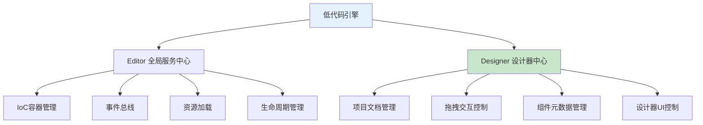

# Designer核心类深度解析

## 🎯 概述

`Designer`是低代码引擎的**设计器控制中心**，与`Editor`一起构成引擎的**双核心架构**。`Editor`负责全局服务管理，`Designer`专注于设计态功能，是所有设计时操作的统一调度中心。

## 📋 Designer在低代码引擎中的作用

### **架构地位**


### **核心职责**
1. **设计时状态管理**：管理所有设计器相关的状态和配置
2. **交互系统调度**：协调拖拽、选择、编辑等交互功能
3. **项目文档管理**：管理多个设计项目和页面文档
4. **组件系统管理**：管理组件元数据和组件库
5. **视图渲染控制**：控制设计器界面的渲染和更新

## 🏗️ Designer核心架构

### **核心系统实例**
```typescript
export class Designer implements IDesigner {
    // === 🔥 核心系统实例 ===
    dragon: IDragon;                    // 拖拽系统：处理组件拖拽交互
    readonly activeTracker;             // 活动节点追踪器：追踪当前激活/悬停的节点
    readonly detecting;                 // 检测系统：检测鼠标位置对应的节点
    readonly project: IProject;         // 🔥 项目管理器：管理所有文档和页面
    readonly editor: IPublicModelEditor; // 🔥 编辑器实例引用：访问全局服务
    readonly bemToolsManager;           // BEM工具管理器：处理设计辅助工具
    readonly componentActions;          // 组件动作管理器：管理组件的各种操作
    readonly contextMenuActions;        // 右键菜单动作管理器
    readonly shellModelFactory;         // Shell模型工厂：创建API包装对象
}
```

### **状态管理**
```typescript
// 响应式状态（MobX）
@obx.ref private _componentMetasMap;    // 🔥 组件元数据映射表
@obx.ref private _simulatorComponent;   // 模拟器组件
@obx.ref private _simulatorProps;       // 模拟器属性
@obx.ref private _suspensed;           // 暂停状态标识

// 私有状态管理
private _dropLocation;                  // 当前拖拽的放置位置
private propsReducers;                  // 属性转换器映射表
private _lostComponentMetasMap;         // 丢失的组件元数据缓存
private oobxList;                      // 偏移观察器列表
```

## 🔧 Designer核心功能详解

### **1. 拖拽系统管理**

#### **Dragon拖拽引擎**
```typescript
constructor(props: DesignerProps) {
    // 创建拖拽系统实例
    this.dragon = new Dragon(this);

    // 监听拖拽开始事件
    this.dragon.onDragstart((e) => {
        this.detecting.enable = false;  // 禁用检测系统
        const { dragObject } = e;

        // 处理节点选择逻辑
        if (isDragNodeObject(dragObject)) {
            if (dragObject.nodes.length === 1) {
                if (dragObject.nodes[0].parent) {
                    dragObject.nodes[0].select();  // 确保选中状态
                } else {
                    this.currentSelection?.clear(); // 清除选择
                }
            }
        } else {
            this.currentSelection?.clear();
        }

        // 发送事件和回调
        this.props?.onDragstart?.(e);
        this.postEvent('dragstart', e);
    });
}
```

#### **拖拽流程管理**
- **拖拽开始**：禁用检测系统，管理选择状态
- **拖拽进行**：发送`drag`事件，更新位置信息
- **拖拽结束**：执行节点插入，恢复检测系统

### **2. 项目文档管理**

#### **Project实例管理**
```typescript
readonly project: IProject = new Project(this, props.defaultSchema, viewName);

// 项目能力
- 多文档管理：支持多个页面/组件的同时编辑
- 文档切换：在不同设计文档间切换
- Schema管理：导入/导出页面Schema数据
- 历史记录：支持撤销重做操作
```

#### **文档生命周期**
```typescript
// 监听文档变化
this.project.onCurrentDocumentChange(() => {
    // 设置历史记录监听
    setupHistory();

    // 设置选择事件监听
    if (this.selectionDispose) {
        this.selectionDispose();
    }

    const { currentDocument } = this;
    if (currentDocument?.selection) {
        this.selectionDispose = currentDocument.selection.onSelectionChange(() => {
            this.postEvent('selection.change', currentDocument.selection);
        });
    }
});
```

### **3. 组件元数据系统**

#### **组件映射表管理**
```typescript
@obx.ref private _componentMetasMap = new Map<string, IComponentMeta>();

// 核心方法
buildComponentMetasMap(metas: IPublicTypeComponentMetadata[]) {
    metas.forEach((data) => this.createComponentMeta(data));
}

createComponentMeta(data: IPublicTypeComponentMetadata): IComponentMeta | null {
    const key = data.componentName;
    let meta = this._componentMetasMap.get(key);

    if (meta) {
        meta.setMetadata(data);  // 更新已有元数据
    } else {
        // 检查丢失缓存
        meta = this._lostComponentMetasMap.get(key);

        if (meta) {
            meta.setMetadata(data);
            this._lostComponentMetasMap.delete(key);
        } else {
            meta = new ComponentMeta(this, data);  // 创建新元数据
        }
    }

    this._componentMetasMap.set(key, meta);
    return meta;
}
```

### **4. 交互检测系统**

#### **Detecting检测器**
```typescript
readonly detecting = new Detecting();

// 功能职责
- 节点悬停检测：检测鼠标悬停的组件
- 实时位置跟踪：跟踪鼠标在画布中的位置
- 节点边界计算：计算组件的边界和层级
- 可交互性检查：判断节点是否可交互
```

#### **ActiveTracker追踪器**
```typescript
readonly activeTracker = new ActiveTracker();

// 监听活跃节点变化
this.activeTracker.onChange(({ node, detail }) => {
    // 自动滚动到激活节点
    node.document?.simulator?.scrollToNode(node, detail);
});
```

### **5. 模拟器组件管理**

#### **模拟器配置**
```typescript
@obx.ref private _simulatorComponent?: ComponentType<any>;
@obx.ref private _simulatorProps?: Record<string, any> | ((project: IProject) => object);

get simulatorComponent() {
    return this._simulatorComponent;
}

set simulatorComponent(comp: ComponentType<any>) {
    this._simulatorComponent = comp;
}

get simulatorProps() {
    if (typeof this._simulatorProps === 'function') {
        return this._simulatorProps(this.project);  // 动态计算属性
    }
    return this._simulatorProps;
}
```

### **6. 事件系统管理**

#### **事件发送机制**
```typescript
postEvent(event: string, ...args: any[]) {
    // 向编辑器事件总线发送事件
    this.editor.emit(event, ...args);
}

// 主要事件类型
- 'dragstart': 拖拽开始
- 'drag': 拖拽进行
- 'dragend': 拖拽结束
- 'selection.change': 选择变化
- 'history.change': 历史记录变化
- 'document.remove': 文档移除
```

## ⚙️ Designer使用场景

### **1. 设计器初始化**
```typescript
// packages/plugin-designer/src/index.tsx
const designer = new Designer({
    editor,                    // 编辑器实例
    shellModelFactory,         // Shell模型工厂
    componentMetadatas,        // 组件元数据
    defaultSchema,             // 默认Schema
    onMount: (designer) => {   // 挂载回调
        editor.set('designer', designer);
    }
});
```

### **2. 拖拽操作处理**
```typescript
// packages/designer/src/builtin-simulator/host.ts
designer.dragon.boost({
    type: IPublicEnumDragObjectType.Node,
    nodes: selectedNodes,
}, mouseEvent, rglNode);
```

### **3. 组件元数据管理**
```typescript
// 获取组件元数据
const meta = designer.getComponentMeta('Button');

// 构建组件映射表
designer.buildComponentMetasMap(componentMetas);

// 动态加载组件
await designer.loadIncrementalAssets(newAssets);
```

### **4. 属性转换处理**
```typescript
// 注册属性转换器
designer.addPropsReducer((props, node) => {
    // 自定义属性转换逻辑
    return transformedProps;
}, IPublicEnumTransformStage.Render);

// 转换属性
const transformedProps = designer.transformProps(rawProps, node);
```

## 🎭 Designer与其他模块的协作

### **与Editor的协作**
```typescript
// Designer通过editor访问全局服务
designer.editor.get('assets');        // 获取资源
designer.editor.eventBus.emit(...);   // 发送事件
designer.editor.onGot('schema', ...); // 监听服务
```

### **与Project的协作**
```typescript
// Designer通过project管理文档
designer.project.openDocument(schema);
designer.project.currentDocument.selection.select(nodeId);
designer.project.removeDocument(document);
```

### **与Simulator的协作**
```typescript
// Designer控制模拟器渲染
designer.simulatorComponent = CustomSimulator;
designer.simulatorProps = {
    device: 'mobile',
    designMode: 'design'
};
```

## 🔄 Designer生命周期

### **创建阶段**
```typescript
constructor(props: DesignerProps) {
    // 1. 基础状态初始化
    makeObservable(this);
    this.editor = props.editor;
    this.viewName = props.viewName;

    // 2. 核心系统创建
    this.project = new Project(this, props.defaultSchema, viewName);
    this.dragon = new Dragon(this);
    this.contextMenuActions = new ContextMenuActions(this);

    // 3. 事件监听设置
    setupDragListeners();
    setupDocumentListeners();
    setupHistoryListeners();
}
```

### **配置阶段**
```typescript
setProps(nextProps: DesignerProps) {
    // 更新配置属性
    this.props = nextProps;

    // 更新组件元数据
    this.buildComponentMetasMap(nextProps.componentMetadatas || []);

    // 更新模拟器配置
    this._simulatorComponent = nextProps.simulatorComponent;
    this._simulatorProps = nextProps.simulatorProps;
}
```

### **销毁阶段**
```typescript
purge() {
    // 清理事件监听
    this.selectionDispose?.();
    historyDispose?.();

    // 清理观察器
    this.oobxList.forEach(x => x.dispose());
    this.oobxList = [];

    // 重置状态
    this.activeTracker.track(null);
    this.detecting.capture(null);
}
```

## 📊 Designer核心能力总结

### **🎨 设计器管理能力**
| 功能 | 方法/属性 | 作用 | 使用场景 |
|------|----------|------|----------|
| **模拟器控制** | `simulatorComponent` | 自定义模拟器组件 | 多端预览、特殊渲染 |
| **属性配置** | `simulatorProps` | 动态模拟器属性 | 响应式配置、状态传递 |
| **暂停控制** | `suspensed` | 暂停设计器渲染 | 性能优化、批量操作 |

### **🔧 交互管理能力**
| 功能 | 方法/属性 | 作用 | 使用场景 |
|------|----------|------|----------|
| **拖拽控制** | `dragon` | 拖拽引擎管理 | 组件拖拽、位置调整 |
| **节点检测** | `detecting` | 鼠标悬停检测 | 实时反馈、边界高亮 |
| **活跃追踪** | `activeTracker` | 活跃节点管理 | 焦点管理、自动滚动 |
| **位置管理** | `createLocation` | 创建插入位置 | 拖拽定位、插入指引 |

### **📋 项目管理能力**
| 功能 | 方法/属性 | 作用 | 使用场景 |
|------|----------|------|----------|
| **文档管理** | `project` | 多文档项目管理 | 页面切换、文档操作 |
| **历史记录** | `currentHistory` | 撤销重做管理 | 操作回滚、版本控制 |
| **选择管理** | `currentSelection` | 节点选择状态 | 多选操作、批量编辑 |

### **🧩 组件管理能力**
| 功能 | 方法/属性 | 作用 | 使用场景 |
|------|----------|------|----------|
| **元数据管理** | `getComponentMeta` | 组件配置获取 | 属性面板、验证规则 |
| **映射表构建** | `buildComponentMetasMap` | 组件注册管理 | 组件库更新、热加载 |
| **增量加载** | `loadIncrementalAssets` | 动态组件加载 | 插件加载、按需引入 |
| **属性转换** | `transformProps` | 属性预处理 | 数据适配、格式转换 |

## 🎯 Designer使用模式

### **模式一：标准设计器**
```typescript
// packages/plugin-designer/src/index.tsx
<DesignerView
  editor={editor}
  componentMetadatas={componentMetadatas}
  simulatorProps={{
    library,
    device,
    designMode,
    locale
  }}
  onMount={(designer) => {
    editor.set('designer', designer);
  }}
/>
```

### **模式二：自定义模拟器**
```typescript
const CustomDesigner = () => {
  return (
    <DesignerView
      editor={editor}
      simulatorComponent={MyCustomSimulator}  // 自定义模拟器
      simulatorProps={(project) => ({
        // 动态属性计算
        device: project.get('device') || 'desktop',
        theme: project.get('theme') || 'light'
      })}
    />
  );
};
```

### **模式三：工作空间模式**
```typescript
// packages/workspace/src/context/base-context.ts
const designer = new Designer({
    editor,
    viewName: 'workspace-view',
    shellModelFactory: workspace.shellModelFactory
});
```

## 🔗 Designer关键方法详解

### **🎯 createLocation - 创建插入位置**
```typescript
createLocation(locationData: IPublicTypeLocationData<INode>): DropLocation {
    // 将原始位置数据转换为引擎内部的DropLocation对象
    // 用于拖拽时的位置计算和插入指引
}
```

### **🔄 transformProps - 属性转换**
```typescript
transformProps(props: any, node: INode, stage: IPublicEnumTransformStage) {
    // 通过注册的属性转换器处理属性
    // 支持多阶段转换：Save, Render, Clone等
    const reducers = this.propsReducers.get(stage) || [];
    return reducers.reduce((props, reducer) => reducer(props, node, { stage }), props);
}
```

### **📊 componentsMap - 组件映射**
```typescript
get componentsMap(): {[key: string]: IPublicTypeNpmInfo | Component} {
    const maps: any = {};

    // 遍历所有组件元数据，构建组件映射表
    this._componentMetasMap.forEach((config: IComponentMeta, key: string) => {
        const npm = config.npm;
        if (!npm) return;

        maps[key] = npm;  // 组件名 -> npm包信息映射
    });

    return maps;
}
```

## ⚡ 性能优化特性

### **1. MobX响应式优化**
- 使用`@obx.ref`进行浅层监听
- 避免深度响应带来的性能损耗
- 精确控制组件重渲染时机

### **2. 组件元数据缓存**
- 缓存丢失的组件元数据
- 避免重复创建ComponentMeta实例
- 支持组件的热更新和替换

### **3. 事件处理优化**
- 使用事件总线减少直接依赖
- 支持事件的批量处理和防抖
- 提供细粒度的事件控制

## 🎯 总结

### **Designer的核心价值**
1. **统一调度中心**：协调所有设计态功能的执行
2. **状态管理枢纽**：管理复杂的设计器状态和配置
3. **交互能力提供**：提供丰富的交互功能和API
4. **扩展性支持**：支持自定义组件和功能扩展

### **架构优势**
- **高内聚低耦合**：功能模块化，职责清晰
- **响应式设计**：基于MobX的响应式状态管理
- **事件驱动**：通过事件总线实现模块间通信
- **插件化扩展**：支持灵活的功能扩展和定制

**Designer是低代码引擎设计态功能的核心控制器，提供了完整的设计器管理、交互控制、组件管理等核心能力。**
