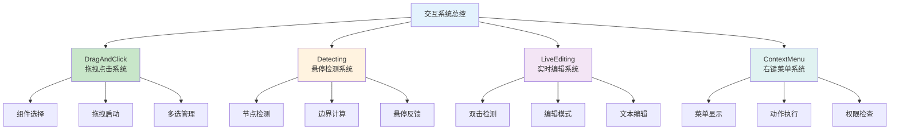
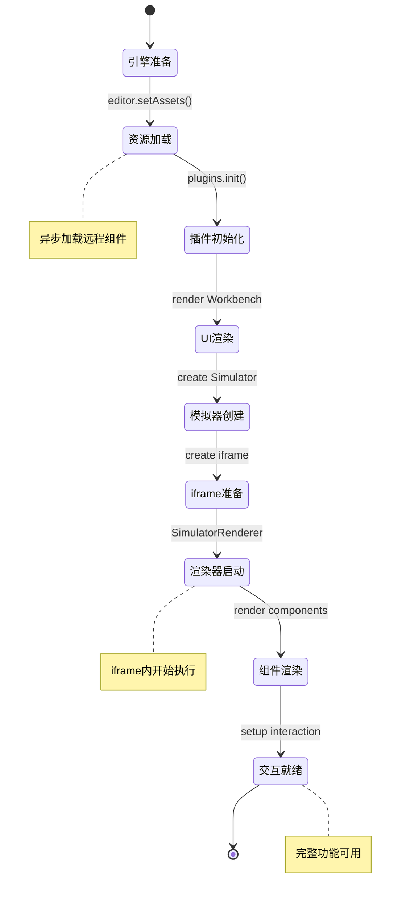

# 完整iframe渲染流程图

## 🎯 概述

基于深度分析，完善低代码引擎iframe渲染的完整流程图，补充缺失的环节和关键类。

## 🔄 完整流程图（修正版）

```mermaid
graph LR
    subgraph "1-引擎初始化阶段"
        A["engine.init()<br/>业务调用入口函数<br/>packages/engine/src/engine-core.ts:206"]
        A --> B["创建Editor实例<br/>packages/engine/src/engine-core.ts:99"]
        A --> C["创建Designer实例<br/>packages/engine/src/engine-core.ts:111"]
        A --> D["创建Project实例<br/>packages/designer/src/project/project.ts"]
    end

    B --> X1["引擎初始化完成"]
    C --> X1
    D --> X1

    subgraph "2-插件注册阶段"
        X1 --> E["plugins.init()<br/>packages/engine/src/engine-core.ts:259"]
        X1 --> F["registryInnerPlugin()<br/>packages/engine/src/engine-core.ts:67"]
        F --> G["defaultPanelRegistry插件<br/>packages/engine/src/inner-plugins/default-panel-registry.ts"]
        G --> H["skeleton.add()注册DesignerPlugin<br/>packages/engine/src/inner-plugins/default-panel-registry.ts:22"]
        H --> H2["注册SettingsPrimaryPane<br/>右侧属性面板"]
    end

    subgraph "3-UI渲染阶段"
        H --> I["渲染Workbench<br/>packages/editor-skeleton/src/layouts/workbench.tsx"]
        I --> J["渲染MainArea<br/>packages/editor-skeleton/src/areas/main-area.tsx"]
        J --> K["渲染DesignerPlugin<br/>packages/plugin-designer/src/index.tsx"]
        K --> L["DesignerPlugin.setupAssets()<br/>异步加载资源"]
        L --> M["渲染DesignerView<br/>packages/designer/src/designer/designer-view.tsx"]
        M --> N["创建Designer实例<br/>packages/designer/src/designer/designer.tsx:234"]
        N --> O["渲染ProjectView<br/>packages/designer/src/project/project-view.tsx"]
    end

    subgraph "4-模拟器创建阶段"
        O --> P["选择Simulator组件<br/>designer.simulatorComponent || BuiltinSimulatorHostView"]
        P --> Q["创建BuiltinSimulatorHost<br/>packages/designer/src/builtin-simulator/host-view.tsx:29"]
        Q --> R["host.setProps()<br/>传递library、designMode等<br/>packages/designer/src/builtin-simulator/host.ts:388"]
        R --> S["渲染Canvas组件<br/>packages/designer/src/builtin-simulator/host-view.tsx:43"]
        S --> T["渲染Content组件<br/>创建iframe元素<br/>packages/designer/src/builtin-simulator/host-view.tsx:95"]
        T --> U["创建BemTools<br/>设计辅助工具<br/>packages/designer/src/builtin-simulator/bem-tools/index.tsx"]
    end

    subgraph "5-iframe初始化阶段"
        U --> V["调用mountContentFrame<br/>packages/designer/src/builtin-simulator/host.ts:440"]
        V --> W["buildLibrary()<br/>处理packages资源<br/>packages/designer/src/builtin-simulator/host.ts:628"]
        W --> X["createSimulator()<br/>packages/designer/src/builtin-simulator/create-simulator.ts:16"]
        X --> Y["parseAssetList()<br/>解析JS/CSS资源<br/>packages/designer/src/builtin-simulator/create-simulator.ts:65"]
        Y --> Z["doc.write()注入HTML<br/>包含所有资源引用<br/>packages/designer/src/builtin-simulator/create-simulator.ts:151"]
        Z --> AA["等待SimulatorRenderer就绪<br/>iframe内JavaScript加载"]
    end

    subgraph "6-渲染器启动阶段-iframe内"
        AA --> BB["SimulatorRenderer初始化<br/>packages/react-simulator-renderer/src/renderer.ts:282"]
        BB --> CC["创建DocumentInstance<br/>文档实例管理<br/>packages/react-simulator-renderer/src/renderer.ts:38"]
        CC --> DD["buildComponents()<br/>构建组件映射表<br/>packages/react-simulator-renderer/src/renderer.ts:128"]
        DD --> EE["host.connect()<br/>建立iframe通信<br/>packages/react-simulator-renderer/src/host.ts"]
        EE --> FF["renderer.run()<br/>启动渲染循环<br/>packages/react-simulator-renderer/src/renderer.ts:204"]
    end

    subgraph "7-组件渲染阶段-iframe内"
        FF --> GG["渲染SimulatorRendererView<br/>packages/react-simulator-renderer/src/renderer-view.tsx:56"]
        GG --> HH["渲染Router+Routes<br/>路由管理<br/>packages/react-simulator-renderer/src/renderer-view.tsx:61"]
        HH --> II["渲染Layout容器<br/>布局包装<br/>packages/react-simulator-renderer/src/renderer-view.tsx:117"]
        II --> JJ["渲染Renderer组件<br/>核心渲染器<br/>packages/react-simulator-renderer/src/renderer-view.tsx:149"]
        JJ --> KK["LowCodeRenderer<br/>React渲染器<br/>packages/react-renderer/src/index.ts"]
        KK --> LL["BaseRenderer.__createDom<br/>packages/renderer-core/src/renderer/base.tsx:476"]
        LL --> MM["__createVirtualDom递归转换<br/>packages/renderer-core/src/renderer/base.tsx:522"]
        MM --> NN["React.createElement<br/>生成最终DOM结构"]
    end

    subgraph "8-交互系统阶段"
        NN --> OO["setupDragAndClick<br/>设置拖拽和点击事件<br/>packages/designer/src/builtin-simulator/host.ts:1080"]
        OO --> PP["setupDetecting<br/>设置悬停检测<br/>packages/designer/src/builtin-simulator/host.ts:1265"]
        PP --> QQ["setupLiveEditing<br/>设置实时编辑<br/>packages/designer/src/builtin-simulator/host.ts:1313"]
        QQ --> RR["setupContextMenu<br/>设置右键菜单<br/>packages/designer/src/builtin-simulator/host.ts:1346"]
        RR --> SS["完整交互系统就绪"]
    end

    style A fill:#e1f5fe
    style K fill:#fff3e0
    style BB fill:#ffebee
    style NN fill:#e8f5e9
    style SS fill:#c8e6c9
```



## 🔧 流程图补充说明

### **新增的关键环节**

#### **1. DesignerPlugin.setupAssets()**
- **位置**：`packages/plugin-designer/src/index.tsx:72`
- **作用**：异步加载组件资源和配置
- **重要性**：确保模拟器启动前资源就绪

#### **2. Designer实例创建**
- **位置**：`packages/designer/src/designer/designer.tsx:234`
- **作用**：创建设计器核心控制器
- **包含**：Dragon、Project、ActiveTracker等核心系统

#### **3. BemTools创建**
- **位置**：`packages/designer/src/builtin-simulator/bem-tools/index.tsx`
- **作用**：设计辅助工具（边框、手柄、指示器等）
- **时机**：模拟器创建后立即创建

#### **4. host.connect()通信建立**
- **位置**：`packages/react-simulator-renderer/src/host.ts`
- **作用**：建立主文档与iframe的通信桥梁
- **协议**：PostMessage通信协议

#### **5. 交互系统初始化**
- **setupDragAndClick**：拖拽和点击事件系统
- **setupDetecting**：鼠标悬停检测系统
- **setupLiveEditing**：双击实时编辑系统
- **setupContextMenu**：右键菜单系统

### **关键Class补充说明**

#### **SimulatorRendererContainer**
```typescript
// packages/react-simulator-renderer/src/renderer.ts:282
class SimulatorRendererContainer {
    documentInstances: DocumentInstance[];  // 文档实例列表
    history: History;                       // 路由历史管理
    layout?: any;                          // 布局配置

    // 核心方法
    buildComponents(): void;               // 构建组件映射
    getComponent(name: string): any;       // 获取组件实例
    run(): void;                          // 启动渲染器
}
```

#### **DocumentInstance**
```typescript
// packages/react-simulator-renderer/src/renderer.ts:38
class DocumentInstance {
    document: DocumentModel;              // 关联的文档模型
    container: SimulatorRendererContainer; // 渲染容器引用
    path: string;                        // 路由路径

    // 核心方法
    getNode(id: string): Node;          // 获取节点实例
    mountInstance(id: string, ref: any); // 挂载组件实例
}
```

### **交互系统详解**

#### **四大交互子系统**


## 📊 流程环节完整性验证

### **原流程图的缺失环节**
1. ❌ **缺失DesignerPlugin资源加载**：直接跳到了DesignerView
2. ❌ **缺失Designer实例创建**：没有体现Designer的核心地位
3. ❌ **缺失BemTools创建**：设计辅助工具的创建时机
4. ❌ **缺失通信建立**：host.connect()的关键步骤
5. ❌ **缺失交互系统**：四大交互子系统的初始化

### **现在流程图的完整性**
✅ **引擎初始化**：Editor、Designer、Project三大核心
✅ **插件注册**：内置插件和业务插件的注册流程
✅ **UI渲染**：从Workbench到ProjectView的完整渲染链
✅ **模拟器创建**：包含BemTools在内的完整模拟器体系
✅ **iframe初始化**：资源处理、HTML注入、通信建立
✅ **渲染器启动**：iframe内的完整渲染器体系
✅ **组件渲染**：从Schema到React元素的转换过程
✅ **交互系统**：四大交互子系统的完整初始化

## 🎯 关键技术节点说明

### **节点1：资源分离处理**
- **meta.js**：在主文档中通过`setAssets`处理
- **view.js**：在iframe中通过`buildLibrary`处理
- **分离原因**：安全沙箱和性能优化

### **节点2：通信桥梁建立**
- **时机**：渲染器启动后立即建立
- **协议**：PostMessage双向通信
- **数据**：Schema同步、事件传递、状态同步

### **节点3：双重渲染体系**
- **主文档**：React渲染Workbench和各种面板
- **iframe内**：React渲染LowCodeRenderer和用户组件
- **协调**：通过Designer和Simulator协调两个渲染体系

### **节点4：交互事件代理**
- **跨域处理**：iframe内事件代理到主文档
- **坐标转换**：iframe坐标转换为全局坐标
- **状态同步**：选择、拖拽状态在两个文档间同步

## 📋 渲染流程的关键检查点

### **检查点列表**
| 阶段 | 检查点 | 验证方法 | 失败处理 |
|------|--------|----------|----------|
| **引擎初始化** | Editor/Designer创建成功 | `editor.get('designer')` | 显示初始化错误 |
| **插件注册** | 内置插件注册完成 | `plugins.getAll().length > 0` | 降级功能模式 |
| **资源加载** | 组件元数据就绪 | `assets.components.length > 0` | 显示加载状态 |
| **iframe创建** | iframe DOM创建 | `iframe.contentDocument` | 重试创建 |
| **渲染器就绪** | SimulatorRenderer初始化 | `window.SimulatorRenderer` | 显示错误信息 |
| **通信建立** | PostMessage通道 | `host.isConnected()` | 重新建立连接 |
| **交互就绪** | 事件监听设置完成 | 事件响应测试 | 重新设置事件 |

### **调试检查脚本**
```typescript
// iframe渲染流程调试脚本
const debugIframeFlow = {
    // 检查引擎状态
    checkEngine() {
        console.log('引擎状态检查:', {
            hasEditor: !!window.editor,
            hasDesigner: !!editor?.get('designer'),
            hasProject: !!editor?.get('project'),
            assetsReady: !!editor?.get('assets')
        });
    },

    // 检查iframe状态
    checkIframe() {
        const designer = editor.get('designer');
        const currentDocument = designer?.project?.currentDocument;
        const simulator = currentDocument?.simulator;

        console.log('iframe状态检查:', {
            hasSimulator: !!simulator,
            iframeExists: !!simulator?.iframe,
            contentDocumentReady: !!simulator?.contentDocument,
            simulatorRendererReady: !!simulator?.contentWindow?.SimulatorRenderer
        });
    },

    // 检查通信状态
    checkCommunication() {
        const simulator = designer?.project?.currentDocument?.simulator;

        console.log('通信状态检查:', {
            hostConnected: simulator?.isConnected?.(),
            canPostMessage: !!simulator?.contentWindow?.postMessage,
            eventListenersSetup: this.checkEventListeners()
        });
    },

    // 检查交互系统
    checkInteraction() {
        const simulator = designer?.project?.currentDocument?.simulator;
        const doc = simulator?.contentDocument;

        console.log('交互系统检查:', {
            mousedownListeners: this.getEventListenerCount(doc, 'mousedown'),
            clickListeners: this.getEventListenerCount(doc, 'click'),
            mousemoveListeners: this.getEventListenerCount(doc, 'mousemove'),
            contextmenuListeners: this.getEventListenerCount(doc, 'contextmenu')
        });
    },

    // 完整检查
    fullCheck() {
        this.checkEngine();
        this.checkIframe();
        this.checkCommunication();
        this.checkInteraction();
    }
};

// 使用方法
debugIframeFlow.fullCheck();
```

## 🎨 渲染时机优化

### **渲染阶段控制**


## 🔄 错误恢复和重试机制

### **常见问题和恢复策略**
```typescript
const errorRecoveryStrategies = {
    // iframe创建失败
    iframeCreateFailed: {
        detection: "iframe.contentDocument为null超过5秒",
        recovery: "重新创建iframe元素",
        fallback: "显示错误信息，提供刷新按钮"
    },

    // 渲染器加载失败
    rendererLoadFailed: {
        detection: "window.SimulatorRenderer未定义超过10秒",
        recovery: "重新注入渲染器脚本",
        fallback: "降级到预览模式"
    },

    // 通信建立失败
    communicationFailed: {
        detection: "postMessage通信超时",
        recovery: "重新建立通信通道",
        fallback: "禁用实时交互功能"
    },

    // 组件渲染失败
    componentRenderFailed: {
        detection: "组件渲染异常或白屏",
        recovery: "使用FaultComponent显示错误",
        fallback: "显示组件加载错误信息"
    }
};
```

## 🎯 总结

### **完整流程图的价值**
1. **调试指导**：为问题排查提供精确的检查路径
2. **开发指引**：帮助开发者理解系统架构和执行流程
3. **性能优化**：识别性能瓶颈和优化点
4. **错误处理**：明确各阶段的错误处理策略

### **关键改进点**
- ✅ **补充了缺失的类和方法**：BemTools、setupAssets等
- ✅ **明确了执行时机**：每个步骤的准确执行时机
- ✅ **细化了技术实现**：具体的文件路径和方法调用
- ✅ **增加了交互系统**：完整的交互初始化流程

### **调试建议**
- 使用`debugIframeFlow.fullCheck()`进行全面状态检查
- 在关键节点设置断点进行流程验证
- 监听关键事件确认流程执行正常
- 检查异步操作的完成状态

**这个完整的iframe渲染流程图涵盖了从引擎初始化到交互就绪的全过程，为深入理解和调试低代码引擎提供了完整的技术指导。**
